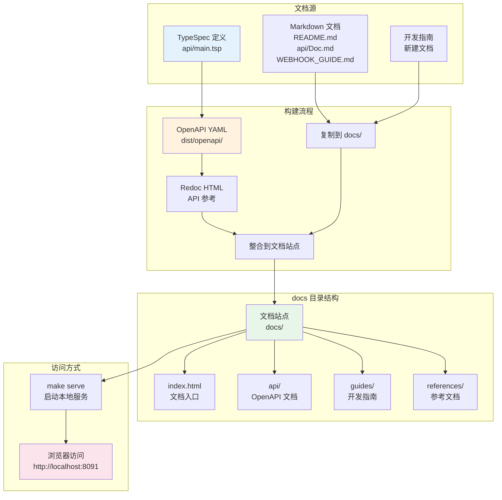
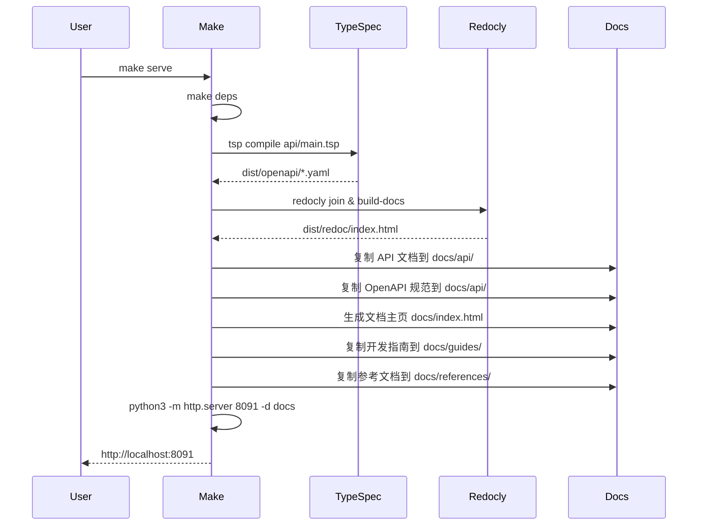

# API 开发文档生成设计

## 目标

在 docs 目录下提供完整的 API 开发文档站点，满足以下需求：
1. 使用 `make serve` 一键启动本地文档服务
2. 包含完整的 OpenAPI 规范文档
3. 提供详尽的开发指南

## 背景分析

### 当前状态

项目已具备以下能力：
- 使用 TypeSpec 定义 API 规范（api/main.tsp）
- 通过 Makefile 编译生成 OpenAPI YAML 文件
- 使用 Redocly 生成静态 HTML 文档（dist/redoc/）
- 已有丰富的说明文档（README.md、api/Doc.md、WEBHOOK_GUIDE.md 等）

### 现有构建流程

| Make 命令 | 功能 | 输出位置 |
|----------|------|---------|
| make deps | 安装依赖（TypeSpec、Redocly、oapi-codegen） | node_modules、Go 工具链 |
| make openapi | 编译 TypeSpec 生成 OpenAPI YAML | dist/openapi/@typespec/openapi3/ |
| make build-docs | 使用 Redocly 构建静态文档 | dist/redoc/index.html |
| make serve-docs | 启动文档服务（端口 8091） | - |

### 差距分析

当前方案的不足：
1. 文档分散在多个位置（README、api/Doc.md、WEBHOOK_GUIDE 等）
2. 缺少统一的文档入口和导航
3. 开发指南内容不够系统化
4. 缺少本地开发友好的文档站点

## 设计方案

### 整体架构



### docs 目录结构设计

```
docs/
├── index.html                      # 文档站点主页（包含导航和快速链接）
├── styles/                         # 样式文件
│   └── main.css                    # 统一样式
├── api/                            # OpenAPI 文档
│   ├── index.html                  # Redoc 生成的 API 文档
│   └── openapi.yaml                # OpenAPI 规范文件（引用）
├── guides/                         # 开发指南
│   ├── getting-started.md          # 快速开始
│   ├── authentication.md           # 认证授权指南
│   ├── document-model.md           # 文档模型详解
│   ├── data-operations.md          # 数据操作指南
│   ├── webhooks.md                 # Webhook 使用指南
│   ├── best-practices.md           # 最佳实践
│   └── examples.md                 # 完整示例
└── references/                     # 参考文档
    ├── error-codes.md              # 错误码参考
    ├── field-types.md              # 字段类型参考
    ├── i18n.md                     # 国际化说明
    └── changelog.md                # 变更日志
```

### 文档内容规划

#### 1. 文档站点主页（index.html）

**目标**：提供清晰的导航和快速访问入口

**内容结构**：
- 项目简介（NexusBook API 概述）
- 主要功能模块卡片式导航
  - OpenAPI 规范文档
  - 开发指南
  - 参考文档
- 快速开始链接
- 相关资源链接

**技术实现**：
- 使用简洁的 HTML + CSS
- 响应式设计
- 支持深色模式
- 无需复杂框架，保持轻量

#### 2. OpenAPI 文档（api/）

**目标**：提供完整的 API 接口参考

**内容来源**：
- 从 dist/redoc/index.html 复制
- 从 dist/openapi/openapi.yaml 复制规范文件

**技术方案**：
- 继续使用 Redocly 生成的静态文档
- 确保所有 API 端点都有详细说明
- 包含请求/响应示例
- 支持搜索和筛选

#### 3. 开发指南（guides/）

**3.1 快速开始（getting-started.md）**

内容大纲：
- 环境准备
  - Node.js、Go、Make 工具安装
  - 依赖安装（make deps）
- 获取访问令牌
  - OAuth2 客户端凭证流程
  - 授权码流程
- 第一个 API 调用
  - 获取文档聚合数据
  - 创建数据行
- 常见问题排查

**3.2 认证授权指南（authentication.md）**

内容大纲：
- OAuth2 认证流程
  - 客户端凭证流程（Client Credentials）
  - 授权码流程（Authorization Code）
- OIDC 集成
  - 发现端点（.well-known/openid-configuration）
  - JWKS 端点
  - UserInfo 端点
- Token 管理
  - 获取 Token
  - 刷新 Token
  - Token 过期处理
- Scope 权限说明
  - doc:read / doc:write
  - data:read / data:write
  - views:manage
  - comments:write
  - approvals:manage
  - requests:manage
- 安全最佳实践
  - Token 存储
  - HTTPS 使用
  - Scope 最小权限原则

**3.3 文档模型详解（document-model.md）**

内容大纲：
- Document 核心概念
  - 统一文档抽象
  - doc-type 路由机制
- 核心数据层
  - Properties（文档属性）
  - Metadata（字段定义）
  - Views（视图配置）
  - Data（数据行）
  - Settings（配置）
- 协作层
  - Comments（评论系统）
  - 评论定位机制（document/field/row/cell）
- 工作流层
  - Requests（变更请求）
  - Revisions（修订历史）
  - Approvals（审批流程）
- 查询能力
  - Filter（过滤器）
  - Sort（排序）
  - Group（分组）
  - Aggregate（聚合）
- 完整工作流示例
  - 订货单场景
  - 发票场景
  - 库存管理场景

**3.4 数据操作指南（data-operations.md）**

内容大纲：
- 数据行 CRUD 操作
  - 创建单行（POST /data）
  - 批量创建（POST /data/bulk）
  - 更新行（PUT /data/{row-id}）
  - 批量更新（POST /data/bulk）
  - 删除行（DELETE /data/{row-id}）
  - 批量删除（POST /data/bulk）
- 查询数据
  - 简单列表查询（GET /data）
  - 结构化查询（POST /data/query）
  - 过滤条件构建
  - 排序和分组
  - 分页策略
- 字段值类型映射
  - 25+ 种字段类型
  - 值类型对应关系
  - 类型验证
- apply 参数说明
  - apply=true 直接应用
  - apply=false 生成变更请求
- 并发控制
  - version 版本号机制
  - 乐观锁处理
  - 冲突解决
- 性能优化建议
  - 批量操作优先
  - 分页大小设置
  - 字段选择优化

**3.5 Webhook 使用指南（webhooks.md）**

内容来源：基于 api/extensions/webhooks/WEBHOOK_GUIDE.md

内容大纲：
- Webhook 概述
- 支持的事件类型
  - Request 相关事件（4 种）
  - Approval 相关事件（5 种）
  - Comment 相关事件（5 种）
  - Metadata 相关事件（4 种）
  - View 相关事件（4 种）
  - Data 相关事件（4 种）
  - Revision 相关事件（2 种）
- Webhook 管理
  - 创建 Webhook
  - 更新 Webhook
  - 删除 Webhook
  - 暂停/恢复 Webhook
- 事件过滤
  - 按文档类型过滤
  - 按用户过滤
  - 自定义条件
- 安全机制
  - HMAC-SHA256 签名验证
  - 签名验证示例代码
- 投递管理
  - 重试策略
  - 投递历史查询
  - 手动重新投递
- 测试和调试
  - 测试端点
  - 投递统计
  - 常见问题排查
- 完整示例
  - 产品变更通知
  - 审批流程集成
  - 评论@提及通知

**3.6 最佳实践（best-practices.md）**

内容大纲：
- 属性设计最佳实践
  - 命名规范
  - 结构设计
  - 避免的反模式
- 元数据设计最佳实践
  - 字段定义规范
  - 验证规则设置
  - 版本管理
- 数据操作最佳实践
  - 批量操作优先
  - 并发控制
  - 错误处理
- 评论协作最佳实践
  - 精确定位
  - @提及使用
  - 解决标记
- 版本控制最佳实践
  - 修订说明编写
  - 历史审计
  - 回滚策略
- 性能优化
  - 分页策略
  - 按需加载
  - 批量操作
  - 缓存策略
- 安全建议
  - 权限控制
  - 数据验证
  - 日志记录

**3.7 完整示例（examples.md）**

内容大纲：
- 场景 1：订货单系统
  - 创建订货单文档
  - 定义字段元数据
  - 添加产品行数据
  - 创建视图（待处理、已完成）
  - 添加评论和讨论
  - 审批和合并流程
  - 完整代码示例（curl、JavaScript、Python、Go）
- 场景 2：发票管理
  - 发票文档结构
  - 明细行管理
  - 金额计算
  - 完整代码示例
- 场景 3：库存管理
  - 库存文档设计
  - 库存查询和更新
  - 低库存预警（Webhook）
  - 完整代码示例
- 场景 4：Webhook 集成
  - 订阅产品变更事件
  - 签名验证实现
  - 事件处理逻辑
  - 完整代码示例（Node.js、Python、Go）

#### 4. 参考文档（references/）

**4.1 错误码参考（error-codes.md）**

内容大纲：
- 错误响应格式
- 错误码分类
  - 认证相关错误（10+）
  - 文档相关错误（5+）
  - 视图相关错误（3+）
  - 数据相关错误（10+）
  - 审批相关错误（5+）
  - Webhook 相关错误（5+）
- 错误处理建议
  - 重试策略
  - 降级方案
  - 用户友好提示

**4.2 字段类型参考（field-types.md）**

内容大纲：
- 字段类型总览（25+ 种）
- 基础类型
  - text、long_text
  - number、currency、percent
  - boolean
- 日期时间类型
  - date、datetime
  - duration
- 选择类型
  - single_select、multi_select
  - rating
- 关联类型
  - attachment
  - user、collaborator
  - relation
- 计算类型
  - lookup、rollup
  - formula
  - auto_number
- 系统字段
  - created_time、updated_time
  - created_by、updated_by
- 字段类型与值类型映射表
- 字段配置选项
  - required、unique、readonly
  - defaultValue
  - validation
  - options

**4.3 国际化说明（i18n.md）**

内容来源：基于 api/shared/MESSAGE_I18N.md

内容大纲：
- 多语言消息系统
- Message 数据结构
- 支持的语言代码（ISO 639-1）
- 使用示例
  - 后端实现
  - 前端使用
- 最佳实践
  - 语言覆盖
  - 降级策略
  - 扩展性
- 迁移指南

**4.4 变更日志（changelog.md）**

内容大纲：
- 版本历史
- 主要功能变更
- API 兼容性说明
- 迁移指南

### 构建流程设计

#### Makefile 修改方案

新增以下任务：

| Make 命令 | 功能 | 依赖 |
|----------|------|------|
| make docs | 构建完整的文档站点 | build-docs |
| make serve | 启动文档服务（默认端口 8091） | docs |
| make clean-docs | 清理 docs 目录 | - |

#### 构建步骤



#### 构建脚本设计

**目标**：自动化文档生成和组织

**脚本功能**：
1. 清理旧的 docs 目录
2. 创建 docs 目录结构
3. 复制 Redoc 生成的 API 文档
4. 复制 OpenAPI YAML 规范文件
5. 生成文档主页（index.html）
6. 复制和转换 Markdown 文档
7. 生成导航和索引
8. 应用统一样式

**技术方案**：
- 使用 shell 脚本（build-docs.sh）
- 或使用 Node.js 脚本（build-docs.js）
- 支持增量构建

### 文档主页设计

#### 页面布局

```
+--------------------------------------------------+
|                 NexusBook API                     |
|          文档管理和数据协作平台 API 文档             |
+--------------------------------------------------+
|                                                   |
|  [快速开始]  [API 参考]  [开发指南]  [参考文档]      |
|                                                   |
+--------------------------------------------------+
|                                                   |
|  ┌──────────────┐  ┌──────────────┐              |
|  │ OpenAPI 文档  │  │   开发指南    │              |
|  │              │  │              │              |
|  │ 完整的 API   │  │ 认证授权     │              |
|  │ 接口参考     │  │ 文档模型     │              |
|  │              │  │ 数据操作     │              |
|  │ [查看文档]   │  │ [查看指南]   │              |
|  └──────────────┘  └──────────────┘              |
|                                                   |
|  ┌──────────────┐  ┌──────────────┐              |
|  │ Webhook 指南 │  │   参考文档    │              |
|  │              │  │              │              |
|  │ 事件通知     │  │ 错误码       │              |
|  │ 签名验证     │  │ 字段类型     │              |
|  │ 完整示例     │  │ 国际化       │              |
|  │ [查看指南]   │  │ [查看参考]   │              |
|  └──────────────┘  └──────────────┘              |
|                                                   |
+--------------------------------------------------+
|                                                   |
|  相关资源                                          |
|  • GitHub 仓库                                     |
|  • 在线演示                                        |
|  • 问题反馈                                        |
|                                                   |
+--------------------------------------------------+
```

#### 导航设计

**顶部导航**：
- 首页
- API 参考
- 开发指南
- 参考文档
- GitHub

**侧边导航**（在子页面中）：
- 开发指南
  - 快速开始
  - 认证授权
  - 文档模型
  - 数据操作
  - Webhook
  - 最佳实践
  - 完整示例
- 参考文档
  - 错误码
  - 字段类型
  - 国际化
  - 变更日志

### 样式设计

#### 设计原则

- 简洁清晰
- 响应式布局
- 良好的可读性
- 支持深色模式
- 与 Redoc 风格保持一致

#### 技术方案

- 使用 CSS 变量定义主题色
- 使用 Flexbox/Grid 布局
- 移动端适配
- 代码高亮（使用 Prism.js 或 highlight.js）
- Markdown 渲染（使用 marked.js）

### Markdown 文档处理

#### 处理方案

**方案 1：静态 HTML 预生成**
- 使用工具将 Markdown 转换为 HTML
- 应用统一模板和样式
- 生成静态 HTML 文件

**方案 2：客户端动态渲染**
- 保留 Markdown 源文件
- 使用 marked.js 在浏览器中渲染
- 支持实时预览

**推荐方案**：方案 1（静态预生成）
- 性能更好
- 无需客户端 JavaScript
- SEO 友好
- 更可靠

#### 转换工具选择

可选工具：
- marked（轻量级）
- markdown-it（功能丰富）
- remark（可扩展）

推荐使用 **marked** + 模板引擎

### 版本管理

#### 文档版本策略

- 主文档跟随项目版本
- 支持多版本文档切换（未来扩展）
- 变更日志记录 API 变更

#### 更新流程


### 部署方案

#### 本地开发

使用 `make serve` 启动本地服务：
- 端口：8091（可配置）
- 服务器：Python http.server
- 热更新：手动运行 make docs

#### 生产部署

**方案 1：静态托管**
- GitHub Pages
- Netlify
- Vercel
- CloudFlare Pages

**方案 2：自托管**
- Nginx
- Apache
- Caddy

**推荐方案**：GitHub Pages + 自动部署

#### CI/CD 集成

GitHub Actions 工作流：
1. 检测 TypeSpec 或文档变更
2. 运行 make docs
3. 部署到 GitHub Pages
4. 通知相关人员

## 技术方案细节

### Makefile 修改

在现有 Makefile 基础上新增：

```makefile
# 文档站点构建目标
DOCS_DIR := docs
DOCS_PORT ?= 8091

.PHONY: docs serve clean-docs

# 构建完整文档站点
docs: build-docs
	@echo "Building documentation site..."
	@mkdir -p $(DOCS_DIR)/api $(DOCS_DIR)/guides $(DOCS_DIR)/references $(DOCS_DIR)/styles
	@# 复制 API 文档
	@cp dist/redoc/index.html $(DOCS_DIR)/api/index.html
	@cp dist/openapi/openapi.yaml $(DOCS_DIR)/api/openapi.yaml
	@# 生成文档主页
	@node scripts/build-docs.js
	@echo "Documentation site built successfully!"

# 启动文档服务
serve: docs
	@echo "Starting documentation server on port $(DOCS_PORT)..."
	@echo "Visit: http://localhost:$(DOCS_PORT)"
	@python3 -m http.server $(DOCS_PORT) -d $(DOCS_DIR) || python -m http.server $(DOCS_PORT) -d $(DOCS_DIR)

# 清理文档
clean-docs:
	@rm -rf $(DOCS_DIR)
```

### 构建脚本（build-docs.js）

**功能**：
1. 读取模板文件
2. 转换 Markdown 为 HTML
3. 生成导航
4. 应用样式
5. 输出 HTML 文件

**依赖**：
- marked（Markdown 解析）
- fs-extra（文件操作）
- cheerio（HTML 操作）

### 文档模板

#### 主页模板（index.html）

包含以下部分：
- 页面头部（meta、title、CSS）
- 顶部导航
- 项目简介
- 功能模块卡片
- 快速链接
- 页脚

#### 内容页模板（page.html）

包含以下部分：
- 页面头部
- 顶部导航
- 侧边导航
- 内容区域
- 目录导航（TOC）
- 页脚

### 样式文件（main.css）

**主要样式**：
- 全局样式重置
- 布局样式（Flexbox/Grid）
- 导航样式
- 卡片样式
- 代码高亮样式
- 响应式断点
- 深色模式

### 开发指南内容生成

#### 内容来源映射

| 目标文档 | 主要来源 | 补充来源 |
|---------|---------|---------|
| getting-started.md | README.md 快速开始部分 | 新编写内容 |
| authentication.md | README.md 认证部分 | api/auth/ 定义 |
| document-model.md | api/Doc.md | README.md 概览部分 |
| data-operations.md | README.md API 参考部分 | 新编写内容 |
| webhooks.md | api/extensions/webhooks/WEBHOOK_GUIDE.md | README.md Webhook 部分 |
| best-practices.md | api/Doc.md 最佳实践部分 | README.md 最佳实践 |
| examples.md | api/Doc.md 使用场景部分 | 新编写完整代码示例 |

#### 内容转换策略

1. 保持原有内容结构
2. 补充缺失的细节
3. 添加更多代码示例
4. 统一格式和风格
5. 添加交叉引用链接

### 参考文档生成

#### 错误码提取

从 TypeSpec 定义中自动提取错误码：
- 扫描 shared/errors.tsp
- 生成错误码表格
- 添加说明和示例

#### 字段类型提取

从 TypeSpec 定义中自动提取字段类型：
- 扫描 document/metadata/fields.tsp
- 生成字段类型表格
- 添加值类型映射
- 添加使用示例

## 实施计划

### 阶段 1：基础设施搭建

**任务**：
1. 创建 docs 目录结构
2. 修改 Makefile 添加 docs、serve 目标
3. 创建构建脚本（build-docs.js）
4. 创建 HTML 模板
5. 创建样式文件（main.css）

**验收标准**：
- make docs 能够成功构建
- make serve 能够启动文档服务
- 能够访问基本的文档主页

### 阶段 2：OpenAPI 文档集成

**任务**：
1. 复制 Redoc 生成的文档到 docs/api/
2. 复制 OpenAPI YAML 规范文件
3. 在主页添加 API 文档链接
4. 测试文档可访问性

**验收标准**：
- API 文档可正常访问
- 搜索和导航功能正常
- 样式与主站一致

### 阶段 3：开发指南编写

**任务**：
1. 编写快速开始指南（getting-started.md）
2. 编写认证授权指南（authentication.md）
3. 整理文档模型详解（基于 api/Doc.md）
4. 编写数据操作指南（data-operations.md）
5. 整理 Webhook 指南（基于 WEBHOOK_GUIDE.md）
6. 编写最佳实践（best-practices.md）
7. 编写完整示例（examples.md）

**验收标准**：
- 所有指南文档齐全
- 内容准确完整
- 代码示例可执行
- 格式统一美观

### 阶段 4：参考文档生成

**任务**：
1. 生成错误码参考（error-codes.md）
2. 生成字段类型参考（field-types.md）
3. 整理国际化说明（基于 MESSAGE_I18N.md）
4. 创建变更日志模板（changelog.md）

**验收标准**：
- 参考文档完整
- 信息准确
- 易于查阅

### 阶段 5：文档站点完善

**任务**：
1. 完善文档主页设计
2. 添加搜索功能（可选）
3. 优化移动端显示
4. 添加深色模式支持
5. 性能优化
6. 测试和修复问题

**验收标准**：
- 主页美观友好
- 导航清晰易用
- 移动端体验良好
- 性能表现优秀

### 阶段 6：CI/CD 和部署

**任务**：
1. 配置 GitHub Actions 自动构建
2. 配置 GitHub Pages 部署
3. 设置自定义域名（可选）
4. 添加文档更新通知

**验收标准**：
- 代码提交后自动构建文档
- 文档自动部署到 GitHub Pages
- 文档可公开访问

## 质量保证

### 内容质量检查

- 技术准确性
- 示例代码可执行性
- 链接有效性
- 格式一致性
- 拼写和语法

### 用户体验测试

- 导航易用性
- 搜索功能
- 移动端体验
- 加载速度
- 浏览器兼容性

### 维护策略

- 文档与代码同步更新
- 定期审查和更新
- 用户反馈收集
- 问题追踪和修复

## 成功指标

1. **可用性**：用户能够通过 `make serve` 一键启动文档
2. **完整性**：包含完整的 OpenAPI 文档和开发指南
3. **易用性**：用户能够快速找到需要的信息
4. **准确性**：文档内容准确无误，示例可执行
5. **维护性**：文档易于更新和维护

## 风险和挑战

### 技术风险

| 风险 | 影响 | 缓解措施 |
|------|------|---------|
| Markdown 转换兼容性 | 中 | 使用成熟的转换工具，充分测试 |
| 样式冲突 | 低 | 使用 CSS 命名空间，避免全局污染 |
| 构建性能 | 低 | 实现增量构建，优化脚本性能 |

### 内容风险

| 风险 | 影响 | 缓解措施 |
|------|------|---------|
| 文档与代码不同步 | 高 | 建立自动化检查机制 |
| 示例代码错误 | 中 | 编写可执行的测试用例 |
| 内容过时 | 中 | 定期审查和更新 |

### 维护风险

| 风险 | 影响 | 缓解措施 |
|------|------|---------|
| 文档更新遗漏 | 高 | 将文档更新纳入开发流程 |
| 贡献者流失 | 中 | 简化贡献流程，提供清晰指南 |

## 后续优化方向

1. **搜索功能**：集成全文搜索（如 Algolia、Lunr.js）
2. **交互式示例**：提供在线 API 调试工具
3. **多版本支持**：支持多个 API 版本文档
4. **多语言支持**：提供英文文档
5. **离线文档**：支持导出 PDF 或离线包
6. **用户反馈**：添加文档反馈和评分功能
7. **性能监控**：监控文档访问和使用情况
8. **智能推荐**：根据用户行为推荐相关文档

## 总结

本设计方案提供了一个完整的 API 文档站点解决方案，满足以下核心需求：

1. ✅ **一键启动**：通过 `make serve` 命令启动本地文档服务
2. ✅ **OpenAPI 文档**：集成 Redocly 生成的完整 API 参考文档
3. ✅ **完整开发指南**：提供系统化的开发指南，涵盖认证、数据操作、Webhook 等核心功能

设计方案注重以下特点：
- **实用性**：基于现有工具链，最小化额外依赖
- **可维护性**：自动化构建流程，文档与代码同步
- **易用性**：清晰的导航，丰富的示例，良好的用户体验
- **扩展性**：支持后续功能扩展和优化

通过分阶段实施，可以逐步完善文档站点，为 NexusBook API 用户提供优质的开发体验。
