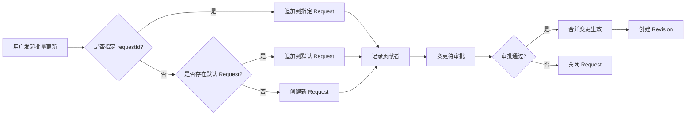
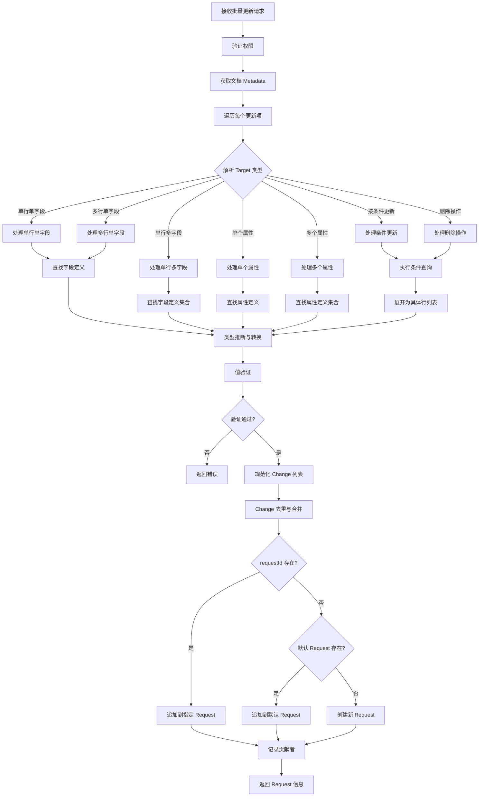
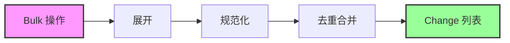
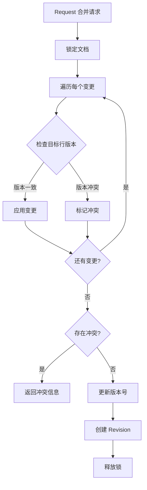
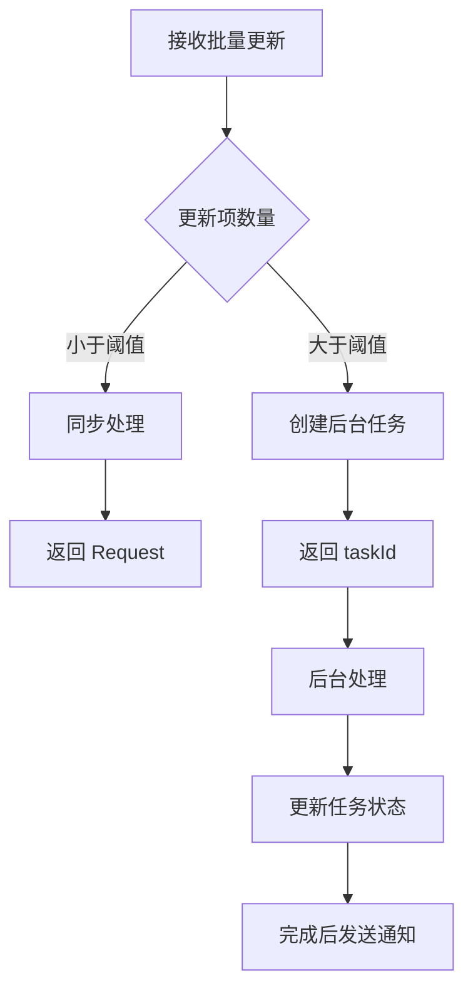
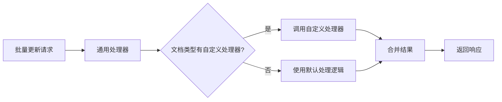
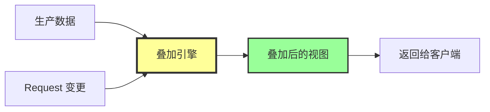
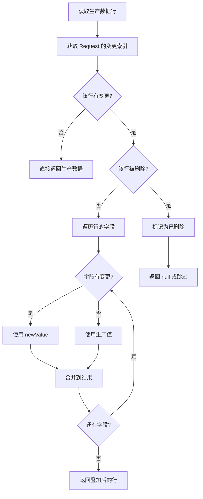

# 文档批量更新 API 设计

## 需求概述

为 NexusBook 文档系统设计一个灵活、统一的批量更新接口，支持以下场景：

1. 更新文档属性（单个或多个）
2. 更新数据行（单行或多行）
3. 更新指定行的指定列
4. 按条件批量更新
5. 支持多人协作（基于 Request 机制）
6. 自动使用默认 Request（如未指定）
7. 灵活的数据结构，由后端推断类型

## 核心设计原则

### 简化客户端负担

客户端只需提供目标（target）和原始值（value），无需关心：
- 字段的具体类型定义
- 值的类型化包装格式
- 复杂的数据转换逻辑

### 统一接口设计

使用单一接口处理所有更新场景，避免接口碎片化：
- 数据行字段更新
- 文档属性更新
- 混合更新（数据 + 属性）

### 基于变更请求工作流

所有更新操作都通过 Request 机制：
- 支持审批流程
- 支持协同编辑
- 支持变更追踪
- 支持冲突检测

### 核心概念强化

**概念 1：所有协同都在同一个 Request 上**

所有用户的协同编辑都作用于同一个 Request：
- 如果指定了 `requestId`，所有变更追加到该 Request
- 如果未指定 `requestId`，系统会自动创建或使用默认 Request
- 多个用户可以同时编辑同一个 Request，变更会实时汇聚
- Request 成为协同的"工作空间"，所有贡献者的修改都在其中

**概念 2：查询数据必须基于生产数据 + Request 叠加**

一旦在查询中附加了 `requestId`：
- 返回的数据不是纯生产数据
- 也不是纯 Request 数据
- 而是**生产数据 + Request 变更**的叠加视图
- 这是用户看到的"预览效果"，展示变更生效后的样子

```
查询逻辑：
- 无 requestId → 返回生产数据（已合并生效的数据）
- 有 requestId → 返回生产数据 ⊕ Request 变更（预览视图）
```

## API 接口定义

### 端点

```
POST /api/v1/doc/{docType}/{docId}/data/bulk
```

### 路径参数

| 参数 | 类型 | 说明 | 示例 |
|------|------|------|------|
| docType | string | 文档类型 | purchaseOrder, product, invoice |
| docId | string | 文档ID | order-123 |

### 查询参数

| 参数 | 类型 | 必填 | 说明 |
|------|------|------|------|
| requestId | string | 否 | 指定追加到的变更请求ID。如不指定，系统会自动创建或使用默认 Request |

### 请求体结构

请求体是一个批量更新项数组，每一项包含 `target` 和 `value`：

```
[
  {
    "target": <目标描述>,
    "value": <原始值>
  },
  ...
]
```

## 目标定义（Target）

Target 是一个灵活的 JSON 对象，用于描述更新的目标范围。

### 目标类型

| 类型 | Target 结构 | 说明 |
|------|-------------|------|
| 单行单字段 | `{row: "row-1", field: "price"}` | 更新指定行的指定字段 |
| 单行多字段 | `{row: "row-1"}` | 更新指定行的多个字段（value 为对象） |
| 多行单字段（同值） | `{rows: ["row-1", "row-2"], field: "status"}` | 多行的同一字段设为相同值 |
| 多行单字段（异值） | `{rows: ["row-1", "row-2"], field: "price"}` | 多行的同一字段设为不同值（value 为数组） |
| 单个属性 | `{property: "amount"}` | 更新单个文档属性 |
| 多个属性 | `{properties: true}` | 更新多个文档属性（value 为对象） |
| 按条件更新 | `{condition: <过滤条件>, field: "status"}` | 按过滤条件批量更新字段 |
| 删除单行 | `{row: "row-1", delete: true}` | 删除指定行 |
| 删除多行 | `{rows: ["row-1", "row-2"], delete: true}` | 删除多行 |
| 按条件删除 | `{condition: <过滤条件>, delete: true}` | 按条件批量删除 |
| 清空字段值 | `{row: "row-1", field: "price", clear: true}` | 清空指定字段的值（设为 null） |

### 条件更新的过滤条件结构

条件更新使用系统已有的 `FilterGroup` 结构：

```
{
  "logic": "and",
  "conditions": [
    {"field": "status", "operator": "eq", "value": "pending"},
    {"field": "amount", "operator": "range", "rangeStart": 1000, "rangeEnd": 5000}
  ]
}
```

## 值定义（Value）

Value 是原始格式的数据，可以是：

| Value 类型 | 适用场景 | 示例 |
|-----------|----------|------|
| 原始值（primitive） | 单字段更新 | `99.99`, `"iPhone 15"`, `true` |
| 对象（object） | 多字段更新 | `{price: 99.99, name: "iPhone"}` |
| 数组（array） | 多行不同值更新 | `[99.99, 88.88, 77.77]` |

## 使用场景与示例

### 场景 1：更新单行单字段

更新 row-1 的价格为 99.99

```json
[
  {
    "target": {"row": "row-1", "field": "price"},
    "value": 99.99
  }
]
```

### 场景 2：更新单行多字段

更新 row-1 的多个字段

```json
[
  {
    "target": {"row": "row-1"},
    "value": {
      "price": 99.99,
      "name": "iPhone 15 Pro",
      "stock": 50,
      "status": "active"
    }
  }
]
```

### 场景 3：更新多行的同一字段（相同值）

将 row-1, row-2, row-3 的状态都设为 active

```json
[
  {
    "target": {"rows": ["row-1", "row-2", "row-3"], "field": "status"},
    "value": "active"
  }
]
```

### 场景 4：更新多行的同一字段（不同值）

分别设置三行的价格

```json
[
  {
    "target": {"rows": ["row-1", "row-2", "row-3"], "field": "price"},
    "value": [99.99, 88.88, 77.77]
  }
]
```

注意：数组长度必须与 rows 数组长度一致，按顺序对应。

### 场景 5：更新单个文档属性

更新订单总金额

```json
[
  {
    "target": {"property": "totalAmount"},
    "value": 5000.00
  }
]
```

### 场景 6：更新多个文档属性

批量更新订单属性

```json
[
  {
    "target": {"properties": true},
    "value": {
      "totalAmount": 5000.00,
      "quantity": 100,
      "orderDate": "2024-12-05",
      "store": "Beijing Branch"
    }
  }
]
```

### 场景 7：按条件批量更新

将所有状态为 pending 且金额在 1000-5000 范围内的行的审核状态设为 reviewing

```json
[
  {
    "target": {
      "condition": {
        "logic": "and",
        "conditions": [
          {"field": "status", "operator": "eq", "value": "pending"},
          {"field": "amount", "operator": "range", "rangeStart": 1000, "rangeEnd": 5000}
        ]
      },
      "field": "reviewStatus"
    },
    "value": "reviewing"
  }
]
```

### 场景 8：混合更新（数据 + 属性）

一次请求同时更新数据行和文档属性

```json
[
  {
    "target": {"row": "row-1", "field": "price"},
    "value": 99.99
  },
  {
    "target": {"row": "row-2", "field": "price"},
    "value": 88.88
  },
  {
    "target": {"property": "totalAmount"},
    "value": 188.87
  },
  {
    "target": {"property": "updatedReason"},
    "value": "价格调整"
  }
]
```

### 场景 9：删除单行

删除指定的数据行

```json
[
  {
    "target": {"row": "row-1", "delete": true}
  }
]
```

**注意**：删除操作不需要提供 `value` 字段。

### 场景 10：批量删除多行

删除多个数据行

```json
[
  {
    "target": {"rows": ["row-1", "row-2", "row-3"], "delete": true}
  }
]
```

### 场景 11：按条件删除

删除所有状态为 inactive 的行

```json
[
  {
    "target": {
      "condition": {
        "logic": "and",
        "conditions": [
          {"field": "status", "operator": "eq", "value": "inactive"}
        ]
      },
      "delete": true
    }
  }
]
```

### 场景 12：清空字段值

将某个字段的值清空（设为 null）

```json
[
  {
    "target": {"row": "row-1", "field": "remark", "clear": true}
  }
]
```

**区别说明**：
- `delete: true` - 删除整行
- `clear: true` - 清空字段值，行仍然存在
- `value: null` - 与 `clear: true` 效果相同

### 场景 13：混合操作（更新 + 删除）

同时进行更新和删除操作

```json
[
  {
    "target": {"row": "row-1", "field": "price"},
    "value": 99.99
  },
  {
    "target": {"row": "row-2", "delete": true}
  },
  {
    "target": {"row": "row-3", "field": "stock"},
    "value": 0
  }
]
```

## 多人协作机制

### Request 工作流

所有批量更新操作都基于 Request（变更请求）机制：



**核心理念：Request 是协同的统一入口**

- **单一协同空间**：所有协作者的变更都汇聚到同一个 Request 中
- **自动创建机制**：如果用户未指定 requestId，系统智能创建或使用默认 Request
- **无缝协作**：用户无需关心 Request 的创建和管理，系统自动处理
- **统一审批**：一个 Request 中的所有变更作为整体进行审批和合并

### 协作场景

#### 场景 A：多人编辑同一 Request

用户 A 创建 Request：
```bash
POST /api/v1/doc/product/123/data/bulk
# 返回 requestId: req-abc
[
  {"target": {"row": "row-1", "field": "price"}, "value": 99.99}
]
```

用户 B 追加到同一 Request：
```bash
POST /api/v1/doc/product/123/data/bulk?requestId=req-abc
[
  {"target": {"row": "row-2", "field": "stock"}, "value": 50}
]
```

用户 C 继续追加：
```bash
POST /api/v1/doc/product/123/data/bulk?requestId=req-abc
[
  {"target": {"property": "totalAmount"}, "value": 5000.00}
]
```

最终 Request 包含所有变更，记录所有贡献者（用户 A、B、C）。

#### 场景 B：使用默认 Request

如果组织配置了自动使用默认 Request，用户无需指定 requestId：

```bash
POST /api/v1/doc/product/123/data/bulk
[
  {"target": {"row": "row-1", "field": "price"}, "value": 99.99}
]
```

系统自动追加到默认 Request，多人的修改自动汇聚。

## 后端处理流程



### 核心处理逻辑

#### 1. Bulk 操作到 Change 的转换原则

**关键概念：Bulk 操作是用户接口，Change 是内部存储**

- **Bulk 操作**：面向用户，灵活多样，支持批量、条件、组合
- **Change 对象**：内部存储，规范化，一条 Change 对应一个原子变更
- **转换规则**：将灵活的 Bulk 操作展开为规范的 Change 列表



#### 2. 展开规则

不同类型的 Bulk 操作展开为不同数量的 Change：

| Bulk 操作类型 | 展开结果 | 示例 |
|--------------|---------|------|
| 单行单字段 | 1 个 Change | `{row: "row-1", field: "price"}` → 1 个 Change |
| 单行多字段 | N 个 Change | `{row: "row-1"}` + `{price: 99, stock: 50}` → 2 个 Change |
| 多行单字段（同值） | M 个 Change | `{rows: ["row-1", "row-2"], field: "status"}` → 2 个 Change |
| 多行单字段（异值） | M 个 Change | `{rows: ["row-1", "row-2"], field: "price"}` + `[99, 88]` → 2 个 Change |
| 按条件更新 | 查询结果数量个 Change | 条件匹配 3 行 → 3 个 Change |
| 删除单行 | 1 个 Change | `{row: "row-1", delete: true}` → 1 个 Change (delete) |
| 删除多行 | M 个 Change | `{rows: ["row-1", "row-2"], delete: true}` → 2 个 Change (delete) |
| 按条件删除 | 查询结果数量个 Change | 条件匹配 3 行 → 3 个 Change (delete) |

#### 3. 去重与合并规则

**规则 1：同一行同一字段的多次更新，只保留最后一次**

```
Bulk 操作：
[
  {"target": {"row": "row-1", "field": "price"}, "value": 99.99},
  {"target": {"row": "row-1", "field": "price"}, "value": 88.88}
]

最终 Change：
只保留 1 个 Change：row-1.price = 88.88
```

**规则 2：先更新后删除，只保留删除**

```
Bulk 操作：
[
  {"target": {"row": "row-1", "field": "price"}, "value": 99.99},
  {"target": {"row": "row-1", "field": "stock"}, "value": 50},
  {"target": {"row": "row-1", "delete": true}}
]

最终 Change：
只保留 1 个 Change：delete row-1
（前面的字段更新被删除操作覆盖）
```

**规则 3：先删除后更新，删除失效，保留更新**

```
Bulk 操作：
[
  {"target": {"row": "row-1", "delete": true}},
  {"target": {"row": "row-1", "field": "price"}, "value": 99.99}
]

最终 Change：
删除被取消，保留字段更新：row-1.price = 99.99
（后续更新表明该行不应被删除）
```

**规则 4：删除操作吸收同行的所有字段变更**

```
Bulk 操作：
[
  {"target": {"row": "row-1"}, "value": {"price": 99, "stock": 50}},
  {"target": {"row": "row-2", "field": "price"}, "value": 88},
  {"target": {"rows": ["row-1", "row-2"], "delete": true}}
]

最终 Change：
2 个 Change：
- delete row-1（吸收了 price 和 stock 的更新）
- delete row-2（吸收了 price 的更新）
```

#### 4. Change 生成算法

```
function generateChanges(bulkUpdates, metadata, request) {
  changeMap = new Map()  // key: "rowId.fieldId" 或 "rowId._delete"
  
  // 步骤1：遍历所有 Bulk 操作，展开并记录
  for (bulkUpdate in bulkUpdates) {
    target = bulkUpdate.target
    
    // 展开目标（条件查询、多行等）
    expandedTargets = expandTarget(target)
    
    for (expandedTarget in expandedTargets) {
      if (expandedTarget.delete) {
        // 删除操作
        key = expandedTarget.row + "._delete"
        changeMap.set(key, {
          type: "data",
          operation: "delete",
          targetId: expandedTarget.row,
          data: {deletedRow: getRowSnapshot(expandedTarget.row)}
        })
        
        // 清除该行的所有字段更新
        removeFieldChangesForRow(changeMap, expandedTarget.row)
        
      } else {
        // 更新操作
        fields = expandFields(expandedTarget, bulkUpdate.value)
        
        for (field in fields) {
          key = expandedTarget.row + "." + field.fieldId
          
          // 检查该行是否已标记为删除
          deleteKey = expandedTarget.row + "._delete"
          if (changeMap.has(deleteKey)) {
            // 该行将被删除，取消删除标记
            changeMap.delete(deleteKey)
          }
          
          // 记录字段更新（覆盖之前的值）
          changeMap.set(key, {
            type: "data",
            operation: "update",
            targetId: expandedTarget.row,
            data: {
              fieldId: field.fieldId,
              oldValue: getOldValue(expandedTarget.row, field.fieldId),
              newValue: convertValue(field.value, field.type, metadata)
            }
          })
        }
      }
    }
  }
  
  // 步骤2：将 Map 转换为数组
  changes = Array.from(changeMap.values())
  
  // 步骤3：追加到 Request
  request.addChanges(changes)
  
  return changes
}
```

#### 5. 辅助函数

**展开目标**

```
function expandTarget(target) {
  results = []
  
  if (target.condition) {
    // 按条件查询，获取符合条件的行ID列表
    rowIds = executeQuery(target.condition)
    for (rowId in rowIds) {
      results.push({row: rowId, field: target.field, delete: target.delete})
    }
  } else if (target.rows) {
    // 多行
    for (rowId in target.rows) {
      results.push({row: rowId, field: target.field, delete: target.delete})
    }
  } else if (target.row) {
    // 单行
    results.push({row: target.row, field: target.field, delete: target.delete})
  }
  
  return results
}
```

**展开字段**

```
function expandFields(target, value) {
  fields = []
  
  if (target.field) {
    // 单字段
    fields.push({fieldId: target.field, value: value})
  } else {
    // 多字段（value 是对象）
    for (fieldId, fieldValue in value) {
      fields.push({fieldId: fieldId, value: fieldValue})
    }
  }
  
  return fields
}
```

**清除行的字段更新**

```
function removeFieldChangesForRow(changeMap, rowId) {
  keysToRemove = []
  
  for (key in changeMap.keys()) {
    if (key.startsWith(rowId + ".")) {
      keysToRemove.push(key)
    }
  }
  
  for (key in keysToRemove) {
    changeMap.delete(key)
  }
}
```

#### 6. 类型推断与转换

根据 Metadata 中的字段定义，将原始值转换为类型化值：

| 字段类型 | 原始值示例 | 转换后 Value |
|---------|-----------|-------------|
| text | `"iPhone 15"` | `{text: "iPhone 15"}` |
| number | `99.99` | `{number: 99.99}` |
| currency | `99.99` | `{currency: 99.99}` |
| date | `"2024-12-05"` | `{date: "2024-12-05"}` |
| boolean | `true` | `{boolean: true}` |
| single_select | `"active"` 或 `{id: "opt-1", label: "Active"}` | `{single_select: {id: "opt-1", label: "Active"}}` |
| multi_select | `["opt-1", "opt-2"]` 或 对象数组 | `{multi_select: [{...}, {...}]}` |
| attachment | 文件ID数组 | `{attachment: [{id, fileName, url, ...}]}` |

#### 7. 值验证

基于字段定义进行验证：
- 必填性检查（required）
- 唯一性检查（unique）
- 只读性检查（readOnly）
- 自定义验证规则（validations）

#### 8. 条件更新处理

对于条件更新：
1. 使用 FilterGroup 执行查询，获取符合条件的行ID列表
2. 每个匹配的行生成一个独立的 Change
3. 按正常流程处理

**示例**：

```
条件：status = "pending" AND amount > 1000
匹配结果：row-1, row-3, row-5

生成 3 个 Change：
- Change 1: update row-1.status = "approved"
- Change 2: update row-3.status = "approved"
- Change 3: update row-5.status = "approved"
```

#### 9. Request 管理

- 如果指定 requestId，追加变更到该 Request
- 如果未指定但存在默认 Request（如工作区或文档级别配置），追加到默认 Request
- 如果都不存在，创建新 Request
- 记录当前用户为贡献者（contributors）

## 处理示例详解

### 示例 1：按条件删除的展开

**用户请求**：

```json
[
  {
    "target": {
      "condition": {
        "logic": "and",
        "conditions": [
          {"field": "status", "operator": "eq", "value": "inactive"}
        ]
      },
      "delete": true
    }
  }
]
```

**后端处理**：

1. 执行条件查询：匹配到 row-2, row-5, row-7
2. 展开为 3 个删除目标
3. 生成 3 个 Change：

```json
[
  {
    "id": "change-1",
    "type": "data",
    "operation": "delete",
    "targetId": "row-2",
    "data": {"deletedRow": {...}}
  },
  {
    "id": "change-2",
    "type": "data",
    "operation": "delete",
    "targetId": "row-5",
    "data": {"deletedRow": {...}}
  },
  {
    "id": "change-3",
    "type": "data",
    "operation": "delete",
    "targetId": "row-7",
    "data": {"deletedRow": {...}}
  }
]
```

**Request 中的结果**：3 个独立的 delete Change

### 示例 2：先修改后删除的去重

**用户请求**：

```json
[
  {
    "target": {"row": "row-1", "field": "price"},
    "value": 99.99
  },
  {
    "target": {"row": "row-1", "field": "stock"},
    "value": 50
  },
  {
    "target": {"row": "row-1", "delete": true}
  }
]
```

**后端处理**：

1. 处理第 1 个操作：记录 `row-1.price` 更新
2. 处理第 2 个操作：记录 `row-1.stock` 更新
3. 处理第 3 个操作：
   - 记录 `row-1._delete`
   - 清除 `row-1.price` 和 `row-1.stock` 的更新

**最终 Change**：

```json
[
  {
    "id": "change-1",
    "type": "data",
    "operation": "delete",
    "targetId": "row-1",
    "data": {"deletedRow": {...}}
  }
]
```

**Request 中的结果**：只有 1 个 delete Change，字段更新被吸收

### 示例 3：先删除后修改的覆盖

**用户请求**：

```json
[
  {
    "target": {"row": "row-1", "delete": true}
  },
  {
    "target": {"row": "row-1", "field": "price"},
    "value": 99.99
  },
  {
    "target": {"row": "row-1", "field": "stock"},
    "value": 50
  }
]
```

**后端处理**：

1. 处理第 1 个操作：记录 `row-1._delete`
2. 处理第 2 个操作：
   - 检测到 `row-1._delete` 存在
   - 删除 `row-1._delete`（取消删除）
   - 记录 `row-1.price` 更新
3. 处理第 3 个操作：记录 `row-1.stock` 更新

**最终 Change**：

```json
[
  {
    "id": "change-1",
    "type": "data",
    "operation": "update",
    "targetId": "row-1",
    "data": {
      "fieldId": "price",
      "oldValue": {"currency": 88.88},
      "newValue": {"currency": 99.99}
    }
  },
  {
    "id": "change-2",
    "type": "data",
    "operation": "update",
    "targetId": "row-1",
    "data": {
      "fieldId": "stock",
      "oldValue": {"number": 30},
      "newValue": {"number": 50}
    }
  }
]
```

**Request 中的结果**：2 个 update Change，删除被取消

### 示例 4：同一字段多次修改的去重

**用户请求**：

```json
[
  {
    "target": {"row": "row-1", "field": "price"},
    "value": 99.99
  },
  {
    "target": {"row": "row-1", "field": "price"},
    "value": 88.88
  },
  {
    "target": {"row": "row-1", "field": "price"},
    "value": 77.77
  }
]
```

**后端处理**：

1. 处理第 1 个操作：记录 `row-1.price = 99.99`
2. 处理第 2 个操作：覆盖 `row-1.price = 88.88`
3. 处理第 3 个操作：覆盖 `row-1.price = 77.77`

**最终 Change**：

```json
[
  {
    "id": "change-1",
    "type": "data",
    "operation": "update",
    "targetId": "row-1",
    "data": {
      "fieldId": "price",
      "oldValue": {"currency": 88.88},
      "newValue": {"currency": 77.77}
    }
  }
]
```

**Request 中的结果**：只有 1 个 update Change，保留最后一次的值

### 示例 5：批量删除的展开

**用户请求**：

```json
[
  {
    "target": {"row": "row-1"}, 
    "value": {"price": 99.99, "stock": 50}
  },
  {
    "target": {"row": "row-2", "field": "price"}, 
    "value": 88.88
  },
  {
    "target": {"rows": ["row-1", "row-2", "row-3"], "delete": true}
  }
]
```

**后端处理**：

1. 处理第 1 个操作：记录 `row-1.price` 和 `row-1.stock`
2. 处理第 2 个操作：记录 `row-2.price`
3. 处理第 3 个操作：
   - 展开为 3 个删除目标：row-1, row-2, row-3
   - 对于 row-1：删除之前的 price 和 stock 更新，记录删除
   - 对于 row-2：删除之前的 price 更新，记录删除
   - 对于 row-3：直接记录删除

**最终 Change**：

```json
[
  {
    "id": "change-1",
    "type": "data",
    "operation": "delete",
    "targetId": "row-1",
    "data": {"deletedRow": {...}}
  },
  {
    "id": "change-2",
    "type": "data",
    "operation": "delete",
    "targetId": "row-2",
    "data": {"deletedRow": {...}}
  },
  {
    "id": "change-3",
    "type": "data",
    "operation": "delete",
    "targetId": "row-3",
    "data": {"deletedRow": {...}}
  }
]
```

**Request 中的结果**：3 个 delete Change，所有字段更新被吸收

## 响应格式

### 成功响应

```json
{
  "success": true,
  "payload": {
    "id": "req-abc123",
    "title": "批量更新",
    "status": "open",
    "author": {
      "id": "user-1",
      "displayName": "张三",
      "email": "[email]"
    },
    "contributors": [
      {"id": "user-1", "displayName": "张三"},
      {"id": "user-2", "displayName": "李四"}
    ],
    "changes": [
      {
        "id": "change-1",
        "type": "data",
        "operation": "update",
        "targetId": "row-1",
        "data": {...},
        "changedAt": "2024-12-07T10:00:00Z",
        "changedBy": {"id": "user-1", "displayName": "张三"}
      },
      {
        "id": "change-2",
        "type": "properties",
        "operation": "update",
        "data": {...},
        "changedAt": "2024-12-07T10:00:00Z",
        "changedBy": {"id": "user-1", "displayName": "张三"}
      }
    ],
    "createdAt": "2024-12-07T10:00:00Z",
    "updatedAt": "2024-12-07T10:00:00Z"
  }
}
```

### 失败响应

#### 验证失败

```json
{
  "success": false,
  "code": "FIELD_TYPE_MISMATCH",
  "message": {
    "zh": "字段类型不匹配：price 期望 number，得到 string",
    "en": "Field type mismatch: price expects number, got string"
  },
  "payload": {
    "errors": [
      {
        "target": {"row": "row-1", "field": "price"},
        "value": "invalid",
        "error": "类型错误：期望数字，得到字符串"
      }
    ]
  }
}
```

#### 约束违反

```json
{
  "success": false,
  "code": "CONSTRAINT_VIOLATION",
  "message": {
    "zh": "唯一性约束违反",
    "en": "Unique constraint violation"
  },
  "payload": {
    "errors": [
      {
        "target": {"row": "row-2", "field": "sku"},
        "value": "SKU-001",
        "error": "SKU 已存在"
      }
    ]
  }
}
```

## 并发控制

### 乐观锁机制

虽然更新进入 Request 不会立即生效，但在 Request 合并时需要进行并发检查：

- 每个数据行有版本号（version）
- Request 记录创建时的版本号
- 合并时检查版本是否一致
- 如有冲突，标记冲突并要求解决

### 冲突检测



## 权限控制

### 权限检查点

| 操作 | 所需权限 |
|------|---------|
| 创建批量更新 Request | 文档编辑权限 |
| 追加到他人的 Request | Request 协作权限 |
| 合并 Request | 文档管理权限或审批权限 |
| 查看 Request | 文档查看权限 |

### 权限验证流程

1. 验证用户对文档的基础权限（读/写/管理）
2. 如果追加到已有 Request，验证是否有协作权限
3. 如果更新只读字段，拒绝操作
4. 如果涉及敏感属性，验证特殊权限

## 性能优化策略

### 批量操作优化

- 批量查询 Metadata，避免重复获取
- 批量验证，减少数据库往返
- 使用事务确保原子性
- 异步处理大批量更新（超过阈值）

### 条件更新优化

- 限制条件查询结果数量（如最大 1000 行）
- 支持分批更新（返回 taskId，异步处理）
- 提供进度查询接口

### 大批量更新流程



## 扩展性设计

### 支持自定义处理器

允许特定文档类型注册自定义的值转换和验证逻辑：



### 支持插件式验证

允许注册额外的验证规则，例如：
- 业务逻辑验证
- 跨字段验证
- 外部系统集成验证

## 错误处理

### 错误类型

| 错误码 | 说明 | 处理方式 |
|--------|------|---------|
| FIELD_TYPE_MISMATCH | 字段类型不匹配 | 返回详细的类型错误信息 |
| CONSTRAINT_VIOLATION | 约束违反（唯一性、必填性等） | 返回违反的约束详情 |
| ROW_NOT_FOUND | 行不存在 | 返回不存在的行ID |
| REQUEST_NOT_FOUND | Request 不存在 | 提示 Request 已删除或不存在 |
| REQUEST_CONFLICT | Request 合并冲突 | 返回冲突详情 |
| DOC_ACCESS_DENIED | 文档访问被拒绝 | 返回权限不足信息 |

### 部分成功处理策略

对于批量更新，支持部分成功模式（可选）：
- 验证所有项，失败则全部拒绝（默认）
- 验证所有项，成功的项应用，失败的项返回错误列表（可选）

## 审计与追踪

### 变更记录

每个批量更新操作都会记录：
- 操作时间
- 操作用户
- 更新内容（target + value）
- 关联的 Request ID
- 操作结果（成功/失败）

### 修订历史

Request 合并后，创建 Revision 记录：
- 所有变更的快照
- 所有贡献者列表
- 合并时间和合并者
- 审批流程信息（如果有）

## 兼容性考虑

### 向后兼容

- 保持现有的单行更新接口（PUT /data/{rowId}）
- 保持现有的属性更新接口（PATCH /properties）
- 批量接口作为增强功能存在

### 渐进式采用

客户端可以选择：
- 继续使用旧接口（单条更新）
- 逐步迁移到批量接口
- 混合使用（根据场景选择）

## Request 数据存储机制

### 变更数据结构

批量更新操作的变更会以结构化的方式存储在 Request 的 `changes` 数组中：

```
{
  "id": "req-abc123",
  "status": "open",
  "changes": [
    {
      "id": "change-1",
      "type": "data",
      "operation": "update",
      "targetId": "row-1",
      "data": {
        "fieldId": "price",
        "oldValue": {"currency": 88.88},
        "newValue": {"currency": 99.99}
      },
      "changedAt": "2024-12-07T10:00:00Z",
      "changedBy": {"id": "user-1", "displayName": "张三"}
    },
    {
      "id": "change-2",
      "type": "properties",
      "operation": "update",
      "data": {
        "fieldId": "totalAmount",
        "oldValue": {"currency": 4000.00},
        "newValue": {"currency": 5000.00}
      },
      "changedAt": "2024-12-07T10:01:00Z",
      "changedBy": {"id": "user-2", "displayName": "李四"}
    },
    {
      "id": "change-3",
      "type": "data",
      "operation": "delete",
      "targetId": "row-3",
      "data": {
        "deletedRow": {
          "id": "row-3",
          "values": [...]
        }
      },
      "changedAt": "2024-12-07T10:02:00Z",
      "changedBy": {"id": "user-1", "displayName": "张三"}
    }
  ]
}
```

### Change 存储格式

每个 Change 对象包含完整的变更信息：

| 字段 | 类型 | 说明 |
|------|------|------|
| id | string | 变更唯一标识 |
| type | string | 变更类型：data（数据行）、properties（文档属性）、metadata（元数据）等 |
| operation | string | 操作类型：create、update、delete |
| targetId | string | 目标ID（行ID、属性ID等） |
| data | object | 变更数据详情 |
| changedAt | string | 变更时间 |
| changedBy | UserRef | 变更人 |

### 不同操作的存储格式

#### 更新操作（update）

对于数据行的变更，data 字段存储：

```
{
  "fieldId": "price",
  "oldValue": {"currency": 88.88},
  "newValue": {"currency": 99.99}
}
```

多字段变更会拆分为多个 Change 对象，便于追踪和冲突检测。

#### 删除操作（delete）

对于删除操作，data 字段存储被删除的完整数据快照：

```
{
  "deletedRow": {
    "id": "row-3",
    "values": [
      {"fieldId": "name", "value": {"text": "已删除的产品"}},
      {"fieldId": "price", "value": {"currency": 50.00}}
    ],
    "version": 5
  }
}
```

**删除操作的特点**：
- operation 为 "delete"
- targetId 为被删除行的ID
- data 中保存完整的行数据快照，用于支持撤销操作
- 不需要 oldValue 和 newValue

#### 创建操作（create）

对于新建操作，data 字段存储新建的完整数据：

```
{
  "newRow": {
    "id": "row-new-1",
    "values": [
      {"fieldId": "name", "value": {"text": "新产品"}},
      {"fieldId": "price", "value": {"currency": 100.00}}
    ]
  }
}
```

### 变更索引设计

Request 内部维护变更索引，便于快速查询和合并：

```
{
  "changeIndex": {
    "data": {
      "row-1": {
        "price": "change-1",
        "stock": "change-3"
      },
      "row-2": {
        "price": "change-5"
      },
      "row-3": {
        "_deleted": "change-7"
      }
    },
    "properties": {
      "totalAmount": "change-2",
      "quantity": "change-4"
    },
    "deleted": ["row-3", "row-5"]
  }
}
```

**索引说明**：
- 字段变更：以 `rowId.fieldId` 映射到 changeId
- 删除标记：使用特殊键 `_deleted` 标记该行被删除
- 删除列表：单独维护被删除行的ID列表，便于快速判断

## 数据叠加读取机制

### 核心概念

在 Request 未合并之前，系统需要提供「生产数据 + Request 变更」的叠加视图，让用户能够预览变更效果。

**关键原则：附加 requestId 的查询必须返回叠加后的数据**

这是一个强制性的设计约束：
- 查询参数中包含 `requestId` 时，不能只返回生产数据
- 也不能只返回 Request 中的变更
- 必须返回两者叠加后的完整视图
- 这样用户才能看到变更生效后的真实效果



### 数据读取接口

#### 接口定义

```
GET /api/v1/doc/{docType}/{docId}/data?requestId={requestId}
GET /api/v1/doc/{docType}/{docId}/data/{rowId}?requestId={requestId}
GET /api/v1/doc/{docType}/{docId}/properties?requestId={requestId}
```

#### 查询参数

| 参数 | 类型 | 必填 | 说明 |
|------|------|------|------|
| requestId | string | 否 | 指定要叠加的 Request ID。**如不指定，返回纯生产数据；如指定，必须返回生产数据与 Request 叠加后的视图** |
| includeChanges | boolean | 否 | 是否在响应中包含变更详情（默认 false） |

#### 数据返回逻辑对照

| 场景 | 查询参数 | 返回数据 | 说明 |
|------|----------|----------|------|
| 查看生产数据 | 无 requestId | 纯生产数据 | 已合并生效的数据 |
| 预览变更效果 | 有 requestId | 生产数据 ⊕ Request | 叠加后的预览视图 |
| 查看变更详情 | requestId + includeChanges=true | 生产数据 ⊕ Request + 变更标记 | 叠加视图 + 每个字段的变更详情 |

**⊕ 表示叠加运算：对于每个字段，如果 Request 中有变更，使用 newValue；否则使用生产值**

### 数据叠加算法

#### 单行数据叠加



#### 伪代码逻辑

```
function mergeRowWithRequest(productionRow, requestChanges) {
  result = clone(productionRow)
  
  // 获取该行的所有变更
  rowChanges = requestChanges.getChangesForRow(productionRow.id)
  
  if (rowChanges.isEmpty()) {
    return result
  }
  
  // 检查是否被删除
  deleteChange = rowChanges.find(c => c.operation == "delete")
  if (deleteChange) {
    return null  // 或标记为 {deleted: true}
  }
  
  // 应用每个字段的变更
  for (change in rowChanges) {
    if (change.operation == "update") {
      // 更新字段值为新值
      result.updateField(change.data.fieldId, change.data.newValue)
    }
  }
  
  return result
}
```

#### 列表数据叠加

```
function mergeListWithRequest(productionRows, request) {
  result = []
  processedRowIds = new Set()
  deletedRowIds = request.getDeletedRowIds()
  
  // 1. 处理生产数据中的行
  for (row in productionRows) {
    // 如果该行在 Request 中被删除，跳过
    if (deletedRowIds.has(row.id)) {
      processedRowIds.add(row.id)
      continue
    }
    
    mergedRow = mergeRowWithRequest(row, request.changes)
    
    // 如果合并后为 null（被删除），跳过
    if (mergedRow != null) {
      result.push(mergedRow)
    }
    
    processedRowIds.add(row.id)
  }
  
  // 2. 添加 Request 中新创建的行
  createChanges = request.changes.filter(c => c.operation == "create")
  for (change in createChanges) {
    if (!processedRowIds.has(change.targetId)) {
      newRow = buildRowFromChange(change)
      result.push(newRow)
    }
  }
  
  return result
}
```

**关键处理**：
- 首先获取所有被删除的行ID列表
- 遍历生产数据时，跳过被删除的行
- 新创建的行追加到结果列表

### 属性数据叠加

文档属性的叠加逻辑类似：

```
function mergePropertiesWithRequest(productionProps, request) {
  result = clone(productionProps)
  
  // 获取属性变更
  propChanges = request.changes.filter(c => c.type == "properties")
  
  for (change in propChanges) {
    if (change.operation == "update") {
      result.updateProperty(change.data.fieldId, change.data.newValue)
    }
  }
  
  return result
}
```

### 响应格式

#### 不包含变更详情

```json
{
  "success": true,
  "payload": {
    "items": [
      {
        "id": "row-1",
        "values": [
          {"fieldId": "price", "value": {"currency": 99.99}},
          {"fieldId": "name", "value": {"text": "iPhone 15"}}
        ]
      }
    ],
    "page": 1,
    "pageSize": 20,
    "total": 100
  }
}
```

**注意**：被删除的行不会出现在返回结果中。

#### 包含变更详情（includeChanges=true）

```json
{
  "success": true,
  "payload": {
    "items": [
      {
        "id": "row-1",
        "values": [
          {"fieldId": "price", "value": {"currency": 99.99}},
          {"fieldId": "name", "value": {"text": "iPhone 15"}}
        ],
        "changes": [
          {
            "fieldId": "price",
            "oldValue": {"currency": 88.88},
            "newValue": {"currency": 99.99},
            "changedBy": {"id": "user-1", "displayName": "张三"},
            "changedAt": "2024-12-07T10:00:00Z"
          }
        ]
      }
    ],
    "deletedRows": [
      {
        "id": "row-3",
        "deletedBy": {"id": "user-2", "displayName": "李四"},
        "deletedAt": "2024-12-07T10:05:00Z",
        "snapshot": {
          "values": [
            {"fieldId": "name", "value": {"text": "已删除的产品"}},
            {"fieldId": "price", "value": {"currency": 50.00}}
          ]
        }
      }
    ],
    "page": 1,
    "pageSize": 20,
    "total": 100,
    "requestInfo": {
      "id": "req-abc123",
      "status": "open",
      "totalChanges": 5,
      "contributors": [
        {"id": "user-1", "displayName": "张三"},
        {"id": "user-2", "displayName": "李四"}
      ]
    }
  }
}
```

**删除行的展示**：
- 当 `includeChanges=true` 时，单独返回 `deletedRows` 数组
- 包含被删除行的完整快照
- 显示删除操作的执行者和时间
- 用户可以看到哪些行在 Request 中被删除了

### 多 Request 叠加

支持同时叠加多个 Request 的场景（用于对比不同方案）：

```
GET /api/v1/doc/{docType}/{docId}/data?requestIds=req-1,req-2,req-3
```

叠加顺序：生产数据 → req-1 → req-2 → req-3

后面的 Request 变更会覆盖前面的。

### 性能优化策略

#### 变更索引缓存

Request 的变更索引会缓存在内存中：

```
{
  "req-abc123": {
    "data": {
      "row-1": {"price": "change-1", "stock": "change-3"},
      "row-2": {"price": "change-5"}
    },
    "properties": {
      "totalAmount": "change-2"
    }
  }
}
```

#### 分页叠加优化

对于列表查询，只对当前页的数据进行叠加：

1. 先查询生产数据（分页）
2. 提取当前页的行ID
3. 仅加载这些行ID相关的变更
4. 进行叠加
5. 检查 Request 中的新建行是否应出现在当前页

#### 增量更新

客户端可以订阅 Request 的变更事件，实现增量更新：

```
WebSocket /api/v1/doc/{docType}/{docId}/subscribe?requestId=req-abc

接收消息：
{
  "type": "request.change.added",
  "requestId": "req-abc",
  "change": {
    "id": "change-10",
    "type": "data",
    "operation": "update",
    "targetId": "row-5",
    "data": {...}
  }
}
```

### 冲突可视化

当多个 Request 叠加时，可能出现冲突。系统需要标记冲突字段：

```json
{
  "id": "row-1",
  "values": [
    {
      "fieldId": "price",
      "value": {"currency": 99.99},
      "conflict": true,
      "conflictInfo": {
        "sources": [
          {
            "requestId": "req-1",
            "value": {"currency": 99.99},
            "changedBy": {"id": "user-1", "displayName": "张三"}
          },
          {
            "requestId": "req-2",
            "value": {"currency": 88.88},
            "changedBy": {"id": "user-2", "displayName": "李四"}
          }
        ]
      }
    }
  ]
}
```

### 数据一致性保证

#### 读取时快照

叠加读取时，使用 Request 的快照版本，避免读取过程中 Request 被修改：

1. 获取 Request 的当前版本号
2. 基于该版本进行叠加
3. 返回数据时附带版本号

#### 事务隔离

生产数据和 Request 数据的读取在同一事务内完成，确保一致性。

### 使用场景示例

#### 场景 1：预览变更效果

用户在编辑界面修改数据，所有修改进入 Request，通过叠加读取实时预览：

```bash
# 用户修改价格
POST /api/v1/doc/product/123/data/bulk?requestId=req-draft
[{"target": {"row": "row-1", "field": "price"}, "value": 99.99}]

# 刷新界面，读取叠加数据
GET /api/v1/doc/product/123/data?requestId=req-draft
# 返回的数据中 row-1 的 price 已是 99.99
```

#### 场景 2：审批人查看变更

审批人查看待审批的 Request 效果：

```bash
# 读取叠加后的数据，并显示变更详情
GET /api/v1/doc/product/123/data?requestId=req-pending-001&includeChanges=true

# 返回数据中每个字段标注是否有变更
```

#### 场景 3：方案对比

对比多个 Request 的效果：

```bash
# 方案 A
GET /api/v1/doc/product/123/data?requestId=req-plan-a

# 方案 B
GET /api/v1/doc/product/123/data?requestId=req-plan-b

# 并排显示两个方案的数据
```

#### 场景 4：协同编辑

多人同时编辑同一 Request，实时看到彼此的修改：

```bash
# 用户 A 订阅
WebSocket /api/v1/doc/product/123/subscribe?requestId=req-team

# 用户 B 修改
POST /api/v1/doc/product/123/data/bulk?requestId=req-team
[{"target": {"row": "row-2", "field": "stock"}, "value": 100}]

# 用户 A 收到通知，刷新数据
GET /api/v1/doc/product/123/data?requestId=req-team
```

## 总结

本设计提供了一个灵活、统一的文档批量更新接口，具有以下特点：

### 核心优势

- **简化客户端**：只需提供 target 和原始 value，无需了解类型细节
- **统一接口**：一个接口处理所有更新场景（数据、属性、混合）
- **灵活目标**：支持单行、多行、单字段、多字段、条件更新
- **协作友好**：基于 Request 机制，支持多人协同编辑
- **自动推断**：后端根据 Metadata 自动进行类型转换和验证
- **审批流程**：所有变更通过 Request 审批后生效，确保数据安全
- **可追溯性**：完整的变更历史和贡献者记录
- **数据叠加**：支持生产数据与 Request 变更的实时叠加预览
- **冲突检测**：多 Request 叠加时自动检测和标记冲突

### 适用场景

- 批量数据导入和更新
- 表格式数据编辑
- 工作流驱动的数据变更
- 多人协作的数据编辑
- 需要审批的数据修改
- 按条件批量调整数据
- 变更预览和方案对比
- 实时协同编辑

## 多级分组查询设计

### 概述

NexusBook 支持多级分组查询,允许用户按照多个字段进行层级分组,并在每个层级计算聚合值。返回的结果为树状结构,清晰地展示分组层次。

### API 接口

```
POST /api/v1/doc/{docType}/{docId}/data/query/group
```

### GroupBy 模型

```typescript
model GroupBy {
    /**
     * 分组字段列表（按顺序定义分组层级）
     * 第一个字段为第一级分组，第二个字段为第二级分组，以此类推
     */
    fields: string[];

    /**
     * 聚合函数集合
     * 聚合计算会应用到每个分组层级
     */
    aggregations?: Aggregation[];
}

model Aggregation {
    kind: AggregationFn;  // count, sum, avg, min, max
    field: string;
}
```

### GroupNode 模型（分组结果节点）

```typescript
model GroupNode {
    /**
     * 分组键值
     * 当前层级的分组字段值
     */
    key: unknown;

    /**
     * 分组字段名
     * 当前层级的分组字段名称
     */
    field: string;

    /**
     * 数据行数
     * 当前分组包含的数据行数量
     */
    count: int64;

    /**
     * 聚合结果
     * 键为聚合名称（如 "sum_amount", "avg_price"），值为聚合结果
     * 命名规则：{function}_{field}
     */
    aggregations?: Record<unknown>;

    /**
     * 子分组
     * 下一级分组的结果列表。如果是最后一级分组，则为空
     */
    children?: GroupNode[];

    /**
     * 数据行（可选）
     * 如果请求包含数据行，则此字段包含当前分组的实际数据
     * 通常只在最后一级分组或明确请求时返回
     */
    rows?: Record<unknown>[];
}
```

### GroupedResult 模型（分组查询结果）

```typescript
model GroupedResult {
    /**
     * 分组树
     * 顶层分组节点列表
     */
    groups: GroupNode[];

    /**
     * 总行数
     * 所有分组的总数据行数
     */
    total: int64;

    /**
     * 分组定义
     * 返回使用的分组定义，便于客户端理解结果结构
     */
    groupBy: GroupBy;
}
```

### 分组查询示例

#### 示例 1：单级分组

按类目分组,统计每个类目的数量和总金额：

```json
// 请求
POST /api/v1/doc/product/123/data/query/group
{
  "group": {
    "fields": ["category"],
    "aggregations": [
      {"kind": "count", "field": "*"},
      {"kind": "sum", "field": "amount"}
    ]
  }
}

// 响应
{
  "success": true,
  "payload": {
    "groups": [
      {
        "key": "Electronics",
        "field": "category",
        "count": 150,
        "aggregations": {
          "count_*": 150,
          "sum_amount": 45000
        }
      },
      {
        "key": "Clothing",
        "field": "category",
        "count": 80,
        "aggregations": {
          "count_*": 80,
          "sum_amount": 12000
        }
      }
    ],
    "total": 230,
    "groupBy": {...}
  }
}
```

#### 示例 2：二级分组

按区域和类目进行二级分组：

```json
// 请求
POST /api/v1/doc/sales/456/data/query/group
{
  "group": {
    "fields": ["region", "category"],
    "aggregations": [
      {"kind": "count", "field": "*"},
      {"kind": "sum", "field": "revenue"},
      {"kind": "avg", "field": "price"}
    ]
  }
}

// 响应
{
  "success": true,
  "payload": {
    "groups": [
      {
        "key": "North",
        "field": "region",
        "count": 100,
        "aggregations": {
          "count_*": 100,
          "sum_revenue": 50000,
          "avg_price": 500
        },
        "children": [
          {
            "key": "Electronics",
            "field": "category",
            "count": 60,
            "aggregations": {
              "count_*": 60,
              "sum_revenue": 30000,
              "avg_price": 500
            }
          },
          {
            "key": "Clothing",
            "field": "category",
            "count": 40,
            "aggregations": {
              "count_*": 40,
              "sum_revenue": 20000,
              "avg_price": 500
            }
          }
        ]
      },
      {
        "key": "South",
        "field": "region",
        "count": 80,
        "aggregations": {
          "count_*": 80,
          "sum_revenue": 35000,
          "avg_price": 437.5
        },
        "children": [
          {
            "key": "Electronics",
            "field": "category",
            "count": 50,
            "aggregations": {
              "count_*": 50,
              "sum_revenue": 22000,
              "avg_price": 440
            }
          },
          {
            "key": "Clothing",
            "field": "category",
            "count": 30,
            "aggregations": {
              "count_*": 30,
              "sum_revenue": 13000,
              "avg_price": 433.33
            }
          }
        ]
      }
    ],
    "total": 180,
    "groupBy": {...}
  }
}
```

#### 示例 3：三级分组

按区域、类目、状态进行三级分组：

```json
// 请求
POST /api/v1/doc/orders/789/data/query/group
{
  "filters": {
    "logic": "and",
    "conditions": [
      {"field": "date", "operator": "range", "rangeStart": "2024-01-01", "rangeEnd": "2024-12-31"}
    ]
  },
  "group": {
    "fields": ["region", "category", "status"],
    "aggregations": [
      {"kind": "count", "field": "*"},
      {"kind": "sum", "field": "amount"}
    ]
  }
}

// 响应（简化）
{
  "success": true,
  "payload": {
    "groups": [
      {
        "key": "North",
        "field": "region",
        "count": 100,
        "aggregations": {"count_*": 100, "sum_amount": 50000},
        "children": [
          {
            "key": "Electronics",
            "field": "category",
            "count": 60,
            "aggregations": {"count_*": 60, "sum_amount": 30000},
            "children": [
              {
                "key": "Completed",
                "field": "status",
                "count": 50,
                "aggregations": {"count_*": 50, "sum_amount": 25000}
              },
              {
                "key": "Pending",
                "field": "status",
                "count": 10,
                "aggregations": {"count_*": 10, "sum_amount": 5000}
              }
            ]
          }
        ]
      }
    ],
    "total": 100,
    "groupBy": {...}
  }
}
```

### 分组查询与数据叠加

分组查询同样支持数据叠加读取：

```bash
# 基于生产数据的分组查询
POST /api/v1/doc/product/123/data/query/group

# 基于生产数据 + Request 变更的分组查询
POST /api/v1/doc/product/123/data/query/group?requestId=req-abc
```

### 后端处理逻辑

1. **接收分组查询请求**
2. **解析分组字段**：根据 `fields` 数组确定分组层级
3. **执行分组查询**：
   - 如果有 `requestId`，先叠加 Request 变更
   - 按层级执行 SQL GROUP BY 或等效聚合
4. **构建树状结构**：
   - 递归构建 GroupNode 树
   - 每个层级计算聚合值
   - 填充 children 字段
5. **返回 GroupedResult**

### 查询参数

| 参数 | 类型 | 说明 |
|------|------|------|
| requestId | string | 可选，附加 Request 变更后进行分组 |
| includeChanges | boolean | 可选，是否包含变更标记 |
| includeRows | boolean | 可选，是否在分组结果中包含原始数据行 |

### 使用场景

1. **销售数据分析**：按区域、产品类别、时间维度统计销售额
2. **库存统计**：按仓库、类目统计库存数量
3. **财务报表**：按部门、项目统计费用
4. **数据仪表盘**：多维度数据展示
5. **方案对比**：对比不同 Request 的分组统计结果
