# Catalog-Connection-OrderBook API 扩展与架构设计

## 一、业务背景与核心概念

### 1.1 业务场景

在供应链协作场景中,供应商维护产品目录(Catalog),采购商维护订货本(OrderBook),双方通过连接(Connection)建立数据共享与同步关系。核心业务流程如下:

- **供应商侧**: 维护产品目录(Catalog 文档),包含所有可供销售的商品信息
- **分享机制**: 供应商创建 Connection,可选择分享全部商品、特定视图或满足特定规则的商品子集
- **采购商侧**: 采购商接收 Connection,选择性接受部分或全部商品,建立自己的 OrderBook 文档
- **数据联动**: 供应商对 Catalog 的变更通过 Connection 传播到 OrderBook,采购商决定是否接受变更
- **级联传播**: 采购商作为中间商时,可将自己的 OrderBook 作为 Catalog 继续向下游分享

### 1.2 核心概念定义

**Catalog(产品目录)**
- 本质是特定 docType 的 Document 文档
- **组织级别资源**,由 Organization 拥有,可被组织内多个 Workspace 共享访问
- 用于跨组织数据协同,包含产品的完整信息(元数据、数据行、属性等)
- 可作为数据源向外分享
- 供应商组织维护和管理

**OrderBook(订货本)**
- 本质也是 Document 文档
- **组织级别资源**,由 Organization 拥有,可被组织内多个 Workspace 共享访问
- 用于跨组织数据协同,内容来源于一个或多个 Connection 的商品合集
- 可包含采购商自建的商品
- 可作为 Catalog 继续向下游分享(中间商场景)
- 采购商组织维护和管理

**Connection(跨组织连接)**
- 建立**不同组织**之间 Catalog 与 OrderBook 的数据流通道
- **Outbound 侧**: 定义供应商的分享范围(全部/视图/规则)
- **Inbound 侧**: 每个采购商在 Binding 时定义自己的接收规则
- 数据流向: `Catalog → Connection(Outbound) → Binding → Connection(Inbound) → OrderBook`
- **组织级别资源**,表示两个 Organization 之间的协作关系
- **一对多关系**: 一个 Connection 可被多个采购商组织关联使用
- **访问控制**: 可指定特定组织或用户访问

**Connector(组织内连接)**
- 建立**同一组织**内部文档之间的关联和联动关系
- 支持 Catalog 到 Catalog 的复制与联动
- 支持 OrderBook 到 Catalog 的转换与联动
- 支持文档克隆、部分同步、自动计算等高级功能
- **组织内部资源**,仅在单一 Organization 内生效
- 简化的权限模型(同组织内共享权限)

### 1.3 跨组织与组织内关系对比

| 特性 | Connection(跨组织) | Connector(组织内) |
|------|-------------------|------------------|
| 适用场景 | 供应商↔采购商 | 文档复制、转换、联动 |
| 组织关系 | 不同 Organization | 同一 Organization |
| 权限控制 | 严格的跨组织访问控制 | 简化的组织内权限 |
| 审批流程 | 需要跨组织审批 | 可选的内部审批 |
| 数据隔离 | 强隔离,仅传播分享数据 | 弱隔离,可访问全量数据 |
| 典型用例 | 供应链协作、数据分享 | 模板复用、业务转换 |

### 1.4 组织级别关系模型

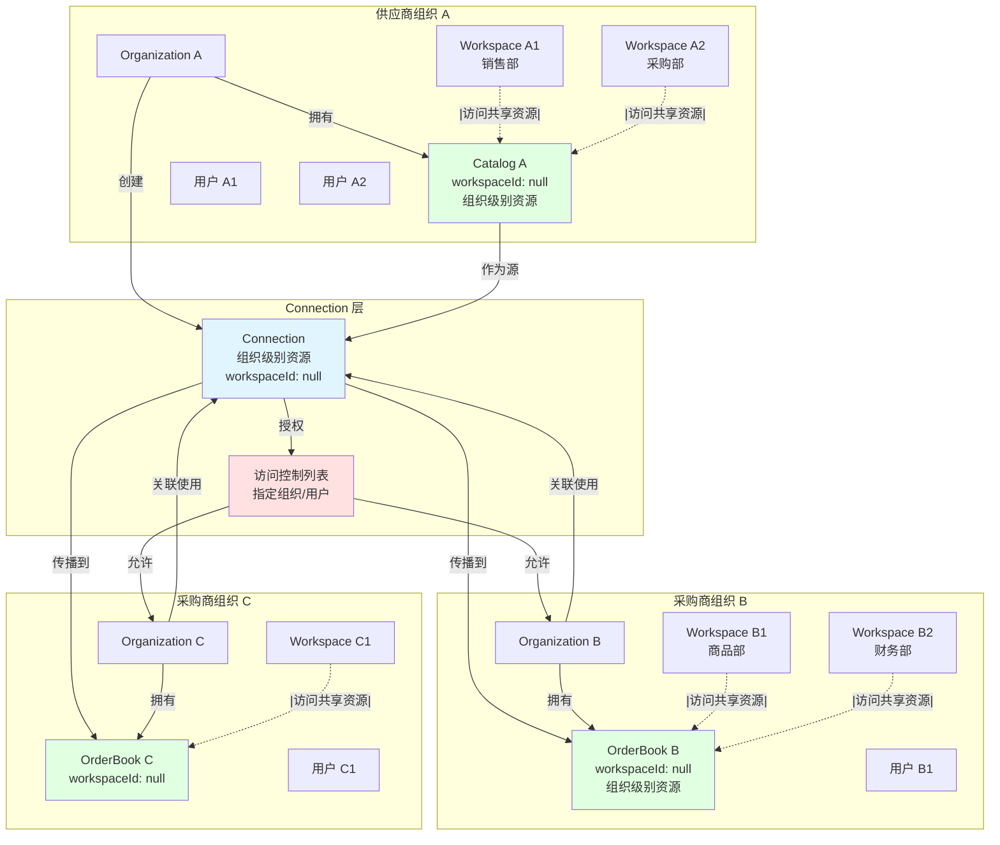

**关系说明**:
1. **Catalog 属于供应商组织**: 由 organizationId 标识所有权,workspaceId 为 null 表示组织级别
2. **多 Workspace 共享**: 组织内所有 Workspace(销售部、采购部等)均可访问同一个 Catalog
3. **Connection 属于供应商组织**: 由创建组织拥有和管理,也是组织级别资源
4. **OrderBook 属于采购商组织**: 由 organizationId 标识所有权,组织内多个 Workspace 共享
5. **多对多关系**: 一个 Connection 可被多个采购商组织关联
6. **访问控制**: Connection 通过 ACL 控制哪些组织可以访问
7. **跨组织协同**: 组织级别资源使得跨组织数据分享更加高效

### 1.5 跨组织数据传播链路

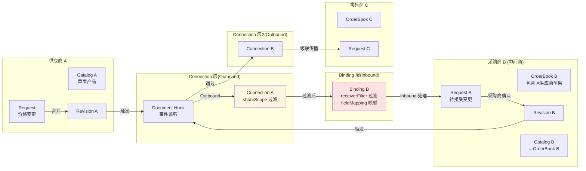

**传播流程说明**:
1. 供应商在 Catalog 中发起 Request(变更请求)
2. Request 合并后生成 Revision(修订记录)
3. Revision 触发 Document Hook 事件
4. **Outbound 阶段**: Connection.shareScope 过滤供应商分享的商品范围
5. **Inbound 阶段**: Binding.receiverFilter 过滤采购商关心的商品,并应用 fieldMapping 映射
6. 在下游 OrderBook 中创建 Request
7. 下游采购商审核 Request,决定接受或拒绝
8. 若采购商本身也是中间商,变更继续向其下游传播

### 1.6 组织内数据联动链路

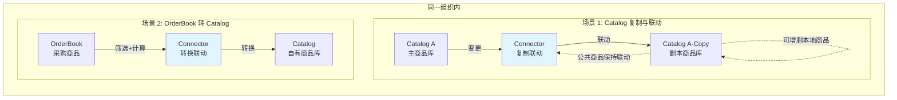

**联动说明**:
1. **Catalog 复制**: 创建源 Catalog 的副本,副本可以独立增删商品,但源 Catalog 中的公共商品变更会自动联动到副本
2. **OrderBook 转 Catalog**: 将 OrderBook(可能来自多个上游 Connection)转换为自己的 Catalog,支持价格计算、商品筛选等转换规则

## 二、数据模型设计

### 2.1 Catalog 模型

Catalog 本质是现有 Document 的特化应用,作为**组织级别资源**存在:

| 属性 | 说明 | 示例 |
|------|------|------|
| docType | 文档类型标识 | `"catalog"` 或 `"product_catalog"` |
| docId | 文档唯一标识 | `"catalog-supplier-a-001"` |
| **organizationId** | **所属组织 ID**(必填) | `"org-supplier-a"` |
| **workspaceId** | **所属工作区 ID**(可选,null 表示组织级别) | `null` 或 `"workspace-001"` |
| metadata | 字段定义(产品属性) | 产品名称、价格、库存、SKU 等字段 |
| data | 数据行集合(产品列表) | 每行代表一个产品 |
| properties | 文档级属性 | 供应商名称、分类、有效期等 |
| views | 视图配置 | 全部产品、热销产品、促销产品等视图 |

**业务语义增强**:
- 通过 properties 记录 `catalogType`(如 `"supplier_catalog"`)
- 通过 properties 记录 `sharingEnabled`(是否允许分享)
- **organizationId 必填**,标识所属组织
- **workspaceId 为 null** 时表示组织级别资源,可被组织内所有 Workspace 访问
- **workspaceId 有值** 时表示该 Catalog 仅在特定 Workspace 可见(私有 Catalog)

**组织级别资源的优势**:
1. **多 Workspace 共享**: 同一个 Catalog 可以在组织内的销售部门、采购部门等不同 Workspace 中访问
2. **统一数据源**: 避免在不同 Workspace 中重复维护相同的产品目录
3. **跨组织协同**: 作为组织级别资源,更适合跨组织的数据分享场景
4. **权限继承**: 基于组织的权限控制,简化权限管理

### 2.2 OrderBook 模型

OrderBook 同样基于 Document,作为**组织级别资源**存在:

| 属性 | 说明 | 示例 |
|------|------|------|
| docType | 文档类型标识 | `"orderbook"` 或 `"buyer_catalog"` |
| docId | 文档唯一标识 | `"orderbook-buyer-b-001"` |
| **organizationId** | **所属组织 ID**(必填) | `"org-buyer-b"` |
| **workspaceId** | **所属工作区 ID**(可选,null 表示组织级别) | `null` 或 `"workspace-002"` |
| metadata | 字段定义 | 继承自上游 Catalog,可扩展采购商自定义字段 |
| data | 数据行集合 | 来自多个 Connection 的商品 + 自建商品 |
| properties | 文档级属性 | 采购商名称、订货周期、优先级等 |
| views | 视图配置 | 按供应商分组、按分类筛选等视图 |

**数据行来源标识**:

每个数据行需记录其来源,通过扩展 Row 模型的 metadata 或使用独立关联表:

| 字段 | 说明 | 示例 |
|------|------|------|
| sourceType | 来源类型 | `"connection"` / `"manual"` / `"merged"` |
| sourceConnectionId | 来源连接 ID(若来自 Connection) | `"conn-a-to-b-001"` |
| sourceCatalogId | 源 Catalog 文档 ID | `"catalog-supplier-a-001"` |
| sourceRowId | 源 Catalog 中的行 ID | `"row-apple-001"` |
| mergedSourceIds | 合并的多个源行 ID(复杂场景) | `["conn-a-row-001", "conn-b-row-002"]` |

### 2.3 Connection 模型(跨组织)

Connection 是**跨组织**传播控制对象,定义不同组织的 Catalog 与 OrderBook 之间的数据流规则。

#### 2.3.1 基础字段

| 字段 | 类型 | 说明 |
|------|------|------|
| id | string | 连接唯一标识 |
| name | string | 连接名称 |
| description | string | 连接描述 |
| sourceCatalogId | string | 源 Catalog 文档 ID |
| sourceCatalogType | string | 源 Catalog 文档类型 |
| sourceOrganizationId | string | 供应商组织 ID |
| shareMode | enum | 分享模式:`single` / `multiple` / `public` |
| organizationId | string | Connection 所属组织(创建者组织) |
| **workspaceId** | **string \| null** | **所属工作区 ID**(null 表示组织级别) |
| status | enum | 连接状态:`active` / `paused` / `disabled` |
| createdAt | string | 创建时间 |
| createdBy | UserRef | 创建人 |
| updatedAt | string | 更新时间 |
| lastSyncAt | string | 最后同步时间 |

**分享模式说明**:

| 模式 | 说明 |
|------|------|
| single | 单一采购商,需指定 targetOrganizationId |
| multiple | 多个采购商,通过 accessControl 指定组织列表 |
| public | 公开分享,任何组织均可关联(需审核) |

#### 2.3.2 分享范围配置(shareScope)

定义供应商分享哪些商品:

```typescript
shareScope: {
  // 分享模式
  mode: "all" | "view" | "filter" | "rows",
  
  // 视图模式:分享特定视图中的商品
  viewId?: string,
  
  // 过滤器模式:分享满足条件的商品
  filterGroup?: FilterGroup,
  
  // 行模式:明确指定分享的行 ID 列表
  rowIds?: string[]
}
```

**示例**:

| 场景 | 配置 |
|------|------|
| 分享全部商品 | `{ mode: "all" }` |
| 分享"热销产品"视图 | `{ mode: "view", viewId: "view-hot-products" }` |
| 分享价格>100 的商品 | `{ mode: "filter", filterGroup: {...} }` |
| 分享指定商品 | `{ mode: "rows", rowIds: ["row-001", "row-002"] }` |

#### 2.3.3 默认接收方配置(defaultReceiverConfig)

供应商可以为 Connection 设置默认的接收方配置,作为采购商创建 Binding 时的参考模板(采购商可覆盖):

```typescript
defaultReceiverConfig?: {
  // 默认字段映射建议
  suggestedFieldMapping?: FieldMapping,
  
  // 默认冲突策略建议
  suggestedConflictResolution?: ConflictResolution,
  
  // 建议的接受模式
  suggestedAcceptMode?: "auto" | "manual" | "selective"
}
```

**说明**: 这些配置仅作为建议,采购商在创建 Binding 时可完全自定义。

#### 2.3.4 默认字段映射(defaultFieldMapping)

供应商可以定义默认的字段映射规则,作为采购商的参考模板:

```typescript
defaultFieldMapping?: {
  // 字段映射规则数组
  rules: [
    {
      sourceFieldId: string,      // 源字段 ID
      targetFieldId: string,      // 目标字段 ID
      transformType?: string,     // 转换类型(可选)
      transformConfig?: unknown,  // 转换配置(可选)
      propagationMode: "sync" | "oneway" | "initial" | "disabled"
    }
  ],
  
  // 未映射字段的处理
  unmappedFields: "ignore" | "create" | "error"
}
```

**传播模式说明**:

| 模式 | 说明 |
|------|------|
| sync | 双向同步(若上游变更则更新下游) |
| oneway | 单向传播(仅上游→下游,下游可覆盖但不回传) |
| initial | 仅初始接入时传播,后续不同步 |
| disabled | 该字段不传播 |

**示例**:

```json
{
  "rules": [
    {
      "sourceFieldId": "price",
      "targetFieldId": "supplier_price",
      "propagationMode": "sync"
    },
    {
      "sourceFieldId": "stock",
      "targetFieldId": "available_stock",
      "propagationMode": "oneway"
    },
    {
      "sourceFieldId": "product_name",
      "targetFieldId": "product_name",
      "propagationMode": "initial"
    }
  ],
  "unmappedFields": "ignore"
}
```

#### 2.3.5 默认冲突策略(defaultConflictResolution)

供应商可以定义默认的冲突处理策略建议:

```typescript
defaultConflictResolution?: {
  // 默认策略
  defaultStrategy: "keep_upstream" | "keep_local" | "merge" | "ask_user" | "latest_wins",
  
  // 字段级策略覆盖
  fieldStrategies?: {
    [fieldId: string]: {
      strategy: "keep_upstream" | "keep_local" | "merge" | "ask_user" | "latest_wins",
      mergeRules?: {
        // merge 策略的具体规则
        type: "sum" | "max" | "min" | "custom",
        customLogic?: string
      }
    }
  }
}
```

**策略说明**:

| 策略 | 说明 | 适用场景 |
|------|------|----------|
| keep_upstream | 保留上游值,覆盖本地修改 | 价格、库存等强制同步字段 |
| keep_local | 保留本地值,忽略上游变更 | 本地备注、内部编码等 |
| merge | 合并双方值 | 多源聚合场景(如多供应商库存求和) |
| ask_user | 创建冲突待人工解决 | 重要字段或不确定场景 |
| latest_wins | 比较时间戳,保留最新值 | 一般性字段 |

#### 2.3.6 传播事件订阅(propagationEvents)

定义监听上游的哪些事件类型:

```typescript
propagationEvents: {
  // 订阅的事件类型
  eventTypes: [
    "data_row_created",      // 新增行
    "data_row_updated",      // 更新行
    "data_row_deleted",      // 删除行
    "metadata_field_added",  // 新增字段
    "metadata_field_updated",// 字段定义变更
    "properties_updated"     // 属性变更
  ],
  
  // 是否启用批量合并
  batchMerge: boolean,
  
  // 批量窗口时间(秒)
  batchWindowSeconds?: number
}
```

#### 2.3.7 访问控制配置(accessControl)

定义哪些组织或用户可以关联使用此 Connection:

```typescript
accessControl: {
  // 访问模式
  mode: "whitelist" | "blacklist" | "approval",
  
  // 白名单模式:允许的组织列表
  allowedOrganizations?: string[],
  
  // 白名单模式:允许的用户列表
  allowedUsers?: string[],
  
  // 黑名单模式:禁止的组织列表
  deniedOrganizations?: string[],
  
  // 审批模式:关联请求需要审批
  requireApproval?: boolean,
  
  // 审批人列表
  approvers?: UserRef[]
}
```

**访问模式说明**:

| 模式 | 说明 |
|------|------|
| whitelist | 仅白名单中的组织/用户可以关联 |
| blacklist | 除黑名单外的所有组织可以关联 |
| approval | 任何组织都可以申请,但需审批 |

**示例场景**:

| 场景 | 配置 |
|------|------|
| 仅分享给组织 B | `{mode: "whitelist", allowedOrganizations: ["org-b"]}` |
| 分享给组织 B 和 C | `{mode: "whitelist", allowedOrganizations: ["org-b", "org-c"]}` |
| 公开分享但需审批 | `{mode: "approval", requireApproval: true, approvers: [...]}` |
| 禁止组织 D 访问 | `{mode: "blacklist", deniedOrganizations: ["org-d"]}` |

#### 2.3.8 Connection 关联记录(ConnectionBinding)

**Inbound vs Outbound 概念**:

- **Outbound Binding**: 从供应商角度,Connection 分享出去后产生的 Binding(向外分享)
- **Inbound Binding**: 从采购商角度,接收 Connection 时创建的 Binding(接收数据)
- **同一个 ConnectionBinding,两种视角**: 供应商看到的是 Outbound,采购商看到的是 Inbound

**视角示意图**:

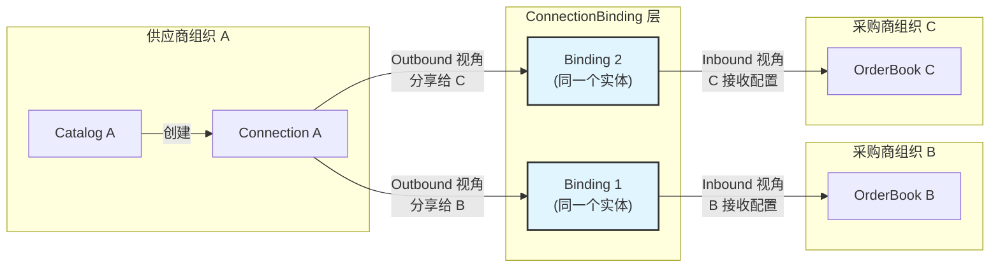

**核心模型**:

当采购商组织关联 Connection 时,创建 ConnectionBinding 记录。该 Binding 从不同角度有不同的命名:
- 供应商角度: **Outbound Binding**(我分享给谁)
- 采购商角度: **Inbound Binding**(我从哪里接收)

| 字段 | 类型 | 说明 |
|------|------|------|
| id | string | 关联记录 ID |
| connectionId | string | Connection ID |
| **bindingDirection** | **enum** | **绑定方向:`outbound` / `inbound`**<br/>供应商角度为 `outbound`,采购商角度为 `inbound` |
| targetOrganizationId | string | 采购商组织 ID |
| targetOrderBookId | string | 目标 OrderBook ID |
| targetOrderBookType | string | 目标 OrderBook 类型 |
| bindingStatus | enum | 关联状态:`pending` / `active` / `paused` / `rejected` |
| **receiverFilter** | **ReceiverFilter** | **Inbound 接收过滤规则(采购商定义)** |
| **fieldMapping** | **FieldMapping** | **Inbound 字段映射规则(采购商定义)** |
| **conflictResolution** | **ConflictResolution** | **Inbound 冲突策略(采购商定义)** |
| requestedAt | string | 申请时间 |
| requestedBy | UserRef | 申请人 |
| approvedAt | string | 批准时间 |
| approvedBy | UserRef | 批准人 |
| activatedAt | string | 激活时间 |

**核心设计原则**:

| 角色 | 视角 | 职责 |
|------|------|------|
| **Connection** | Outbound | 供应商定义分享什么(shareScope)和谁可以访问(accessControl) |
| **ConnectionBinding** | Outbound | 供应商角度:看到分享给了哪些采购商 |
| **ConnectionBinding** | Inbound | 采购商角度:定义接收什么(receiverFilter)、如何映射(fieldMapping)、如何处理冲突(conflictResolution) |

**数据流向**:
```
Catalog(供应商) 
  → Connection(Outbound 分享配置) 
  → ConnectionBinding(Outbound 视角:分享给采购商 B)
  → ConnectionBinding(Inbound 视角:采购商 B 接收配置) 
  → OrderBook(采购商)
```

**采购商可参考 Connection 的 defaultReceiverConfig,但可完全自定义 Inbound 配置**。

**ReceiverFilter 结构**:

```typescript
receiverFilter: {
  // 过滤条件
  filterGroup?: FilterGroup,
  
  // 接受模式
  acceptMode: "auto" | "manual" | "selective",
  
  // 手动接受时的规则
  manualAcceptRules?: {
    // 需要人工确认的条件
    requireApprovalIf?: FilterGroup,
    
    // 自动拒绝的条件
    autoRejectIf?: FilterGroup
  }
}
```

**接受模式说明**:

| 模式 | 说明 |
|------|------|
| auto | 自动接受所有传播的变更 |
| manual | 所有变更需人工确认 |
| selective | 根据规则部分自动接受、部分需确认 |

**关联流程**:

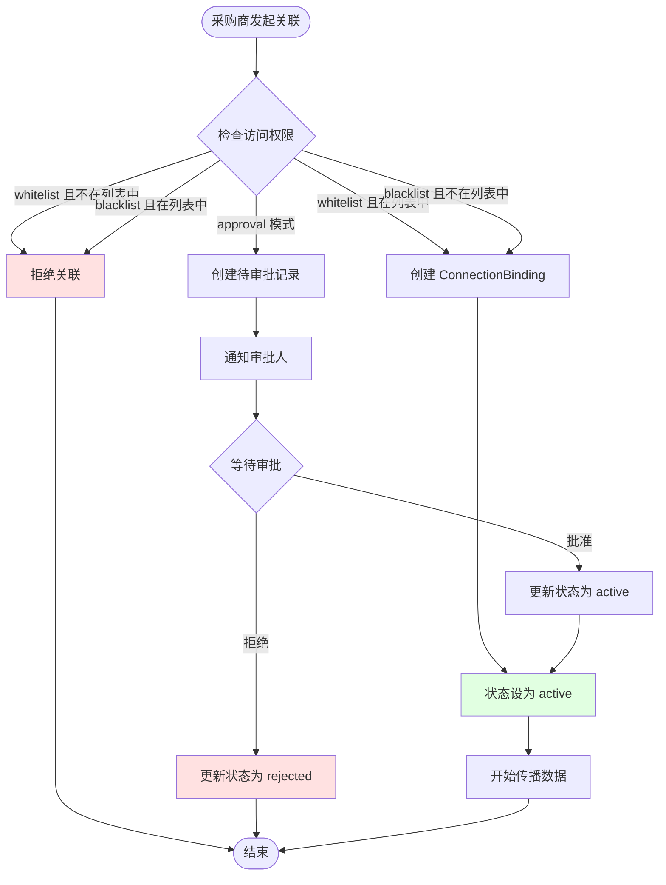

#### 2.3.9 完整 Connection 模型示例

```json
{
  "id": "conn-supplier-a-shared-001",
  "name": "供应商 A 电子产品分享",
  "description": "供应商 A 向多个采购商分享电子产品目录",
  "sourceCatalogId": "catalog-supplier-a-001",
  "sourceCatalogType": "product_catalog",
  "sourceOrganizationId": "org-supplier-a",
  "shareMode": "multiple",
  "organizationId": "org-supplier-a",
  "status": "active",
  
  "accessControl": {
    "mode": "whitelist",
    "allowedOrganizations": [
      "org-buyer-b",
      "org-buyer-c",
      "org-buyer-d"
    ]
  },
  
  "shareScope": {
    "mode": "filter",
    "filterGroup": {
      "logic": "and",
      "conditions": [
        {
          "field": "category",
          "operator": "eq",
          "value": {"text": "电子产品"}
        },
        {
          "field": "stock",
          "operator": "range",
          "rangeStart": 10,
          "rangeEnd": 999999
        }
      ]
    }
  },
  
  "defaultReceiverConfig": {
    "suggestedAcceptMode": "selective",
    "suggestedFieldMapping": {
      "rules": [
        {
          "sourceFieldId": "price",
          "targetFieldId": "supplier_price",
          "propagationMode": "sync"
        },
        {
          "sourceFieldId": "stock",
          "targetFieldId": "available_stock",
          "propagationMode": "oneway"
        }
      ],
      "unmappedFields": "ignore"
    },
    "suggestedConflictResolution": {
      "defaultStrategy": "keep_upstream",
      "fieldStrategies": {
        "supplier_price": {
          "strategy": "keep_upstream"
        },
        "internal_note": {
          "strategy": "keep_local"
        }
      }
    }
  },
  
  "propagationEvents": {
    "eventTypes": [
      "data_row_created",
      "data_row_updated",
      "data_row_deleted"
    ],
    "batchMerge": true,
    "batchWindowSeconds": 300
  },
  
  "createdAt": "2024-12-10T10:00:00Z",
  "createdBy": {
    "id": "user-supplier-a-admin",
    "displayName": "供应商 A 管理员"
  },
  "lastSyncAt": "2024-12-12T15:30:00Z"
}
```

**对应的 ConnectionBinding 示例**(采购商 B 创建 - Inbound 视角):

```json
{
  "id": "binding-buyer-b-001",
  "connectionId": "conn-supplier-a-shared-001",
  "bindingDirection": "inbound",  // 采购商角度
  "targetOrganizationId": "org-buyer-b",
  "targetOrderBookId": "orderbook-buyer-b-001",
  "targetOrderBookType": "orderbook",
  "bindingStatus": "active",
  
  "receiverFilter": {
    "acceptMode": "selective",
    "filterGroup": {
      "logic": "and",
      "conditions": [
        {
          "field": "price",
          "operator": "range",
          "rangeStart": 0,
          "rangeEnd": 5000
        }
      ]
    },
    "manualAcceptRules": {
      "requireApprovalIf": {
        "logic": "or",
        "conditions": [
          {
            "field": "price_change_percent",
            "operator": "range",
            "rangeStart": 10,
            "rangeEnd": 999
          }
        ]
      }
    }
  },
  
  "fieldMapping": {
    "rules": [
      {
        "sourceFieldId": "price",
        "targetFieldId": "supplier_price",
        "propagationMode": "sync"
      },
      {
        "sourceFieldId": "stock",
        "targetFieldId": "available_stock",
        "propagationMode": "oneway"
      }
    ],
    "unmappedFields": "ignore"
  },
  
  "conflictResolution": {
    "defaultStrategy": "keep_upstream",
    "fieldStrategies": {
      "supplier_price": {
        "strategy": "keep_upstream"
      },
      "internal_note": {
        "strategy": "keep_local"
      }
    }
  },
  
  "requestedAt": "2024-12-11T08:00:00Z",
  "requestedBy": {
    "id": "user-buyer-b-admin",
    "displayName": "采购商 B 管理员"
  },
  "approvedAt": "2024-12-11T09:00:00Z",
  "approvedBy": {
    "id": "user-supplier-a-admin",
    "displayName": "供应商 A 管理员"
  },
  "activatedAt": "2024-12-11T09:00:00Z"
}
}
```

### 2.4 Connector 模型(组织内)

Connector 是**组织内部**联动控制对象,定义同一组织内文档之间的关联和同步规则。

**说明**: 与 Connection 不同,Connector 连接的文档(源文档和目标文档)可以是 Workspace 级别也可以是组织级别。但 Connector 自身通常为 Workspace 级别资源。

#### 2.4.1 基础字段

| 字段 | 类型 | 说明 |
|------|------|------|
| id | string | 连接器唯一标识 |
| name | string | 连接器名称 |
| description | string | 连接器描述 |
| connectorType | enum | 连接器类型:`catalog_clone` / `orderbook_to_catalog` |
| sourceDocId | string | 源文档 ID |
| sourceDocType | string | 源文档类型 |
| targetDocId | string | 目标文档 ID |
| targetDocType | string | 目标文档类型 |
| organizationId | string | 所属组织 ID |
| workspaceId | string \| null | 所属工作区 ID(null 表示组织级别 Connector) |
| status | enum | 状态:`active` / `paused` / `disabled` |
| createdAt | string | 创建时间 |
| createdBy | UserRef | 创建人 |
| updatedAt | string | 更新时间 |
| lastSyncAt | string | 最后同步时间 |

**连接器类型说明**:

| 类型 | 说明 | 源文档 | 目标文档 |
|------|------|--------|----------|
| catalog_clone | Catalog 复制与联动 | Catalog | Catalog |
| orderbook_to_catalog | OrderBook 转 Catalog | OrderBook | Catalog |

#### 2.4.2 Catalog 复制配置(catalogCloneConfig)

用于 `catalog_clone` 类型的 Connector:

```typescript
catalogCloneConfig: {
  // 同步模式
  syncMode: "full" | "partial",
  
  // 同步方向
  syncDirection: "one_way" | "bi_directional",
  
  // 联动范围
  linkedScope: {
    // 联动模式
    mode: "all" | "filter" | "rows",
    
    // 过滤条件(mode=filter 时)
    filterGroup?: FilterGroup,
    
    // 指定行(mode=rows 时)
    rowIds?: string[]
  },
  
  // 本地增强
  localEnhancements: {
    // 允许本地新增商品
    allowLocalAdd: boolean,
    
    // 允许本地删除商品(仅删除本地新增的)
    allowLocalDelete: boolean,
    
    // 允许本地修改非联动字段
    allowLocalModify: boolean,
    
    // 非联动字段列表(可本地修改)
    nonLinkedFields?: string[]
  },
  
  // 字段映射(可选,默认 1:1 映射)
  fieldMapping?: FieldMapping,
  
  // 冲突策略
  conflictResolution: ConflictResolution
}
```

**同步模式说明**:

| 模式 | 说明 |
|------|------|
| full | 完全同步,目标 Catalog 是源的完整副本 + 本地新增 |
| partial | 部分同步,仅同步 linkedScope 定义的商品 |

**同步方向说明**:

| 方向 | 说明 |
|------|------|
| one_way | 单向同步,源→目标,目标的修改不回传 |
| bi_directional | 双向同步,源↔目标,双方修改互相同步(仅联动字段) |

**联动逻辑**:

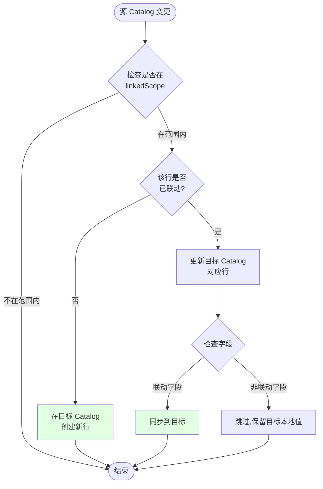

#### 2.4.3 OrderBook 转 Catalog 配置(orderbookToCatalogConfig)

用于 `orderbook_to_catalog` 类型的 Connector:

```typescript
orderbookToCatalogConfig: {
  // 转换规则
  transformRules: {
    // 商品筛选
    filterGroup?: FilterGroup,
    
    // 字段映射与计算
    fieldTransforms: [
      {
        sourceFieldId: string,
        targetFieldId: string,
        transformType: "copy" | "formula" | "lookup" | "constant",
        transformConfig?: {
          // formula 类型:计算公式
          formula?: string,  // 例: "supplier_price * 1.2" (加价 20%)
          
          // lookup 类型:查找表
          lookupTable?: Record<string, Value>,
          
          // constant 类型:固定值
          constantValue?: Value
        }
      }
    ],
    
    // 聚合规则(多源商品聚合)
    aggregationRules?: [
      {
        fieldId: string,
        aggregationType: "sum" | "avg" | "min" | "max" | "first",
        groupByField?: string
      }
    ]
  },
  
  // 同步触发条件
  syncTrigger: {
    // 触发模式
    mode: "manual" | "auto" | "scheduled",
    
    // 自动触发条件(mode=auto 时)
    autoTriggerOn?: [
      "orderbook_row_created",
      "orderbook_row_updated",
      "orderbook_row_deleted"
    ],
    
    // 定时触发(mode=scheduled 时)
    schedule?: string  // Cron 表达式
  },
  
  // 冲突策略
  conflictResolution: ConflictResolution
}
```

**转换示例场景**:

| 场景 | 源(OrderBook) | 转换规则 | 目标(Catalog) |
|------|--------------|----------|---------------|
| 加价销售 | supplier_price: 100 | formula: "supplier_price * 1.2" | retail_price: 120 |
| 筛选高价值商品 | 所有商品 | filter: price > 500 | 仅高价值商品 |
| 多源库存聚合 | 3 个供应商库存 | aggregation: sum(stock) | 总库存 |

#### 2.4.4 Connector 完整示例

**示例 1: Catalog 复制与联动**

```json
{
  "id": "connector-catalog-clone-001",
  "name": "主商品库 → 分店商品库",
  "description": "总部主商品库复制到分店,分店可增加本地商品",
  "connectorType": "catalog_clone",
  "sourceDocId": "catalog-headquarter-001",
  "sourceDocType": "catalog",
  "targetDocId": "catalog-branch-001",
  "targetDocType": "catalog",
  "organizationId": "org-company-a",
  "status": "active",
  
  "catalogCloneConfig": {
    "syncMode": "full",
    "syncDirection": "one_way",
    "linkedScope": {
      "mode": "all"
    },
    "localEnhancements": {
      "allowLocalAdd": true,
      "allowLocalDelete": true,
      "allowLocalModify": true,
      "nonLinkedFields": ["local_note", "local_category"]
    },
    "conflictResolution": {
      "defaultStrategy": "keep_upstream",
      "fieldStrategies": {
        "local_note": {"strategy": "keep_local"}
      }
    }
  }
}
```

**示例 2: OrderBook 转 Catalog**

```json
{
  "id": "connector-ob-to-catalog-001",
  "name": "采购商品 → 零售商品库",
  "description": "将采购的商品转换为零售商品,自动加价 20%",
  "connectorType": "orderbook_to_catalog",
  "sourceDocId": "orderbook-buyer-b-001",
  "sourceDocType": "orderbook",
  "targetDocId": "catalog-retail-001",
  "targetDocType": "catalog",
  "organizationId": "org-buyer-b",
  "status": "active",
  
  "orderbookToCatalogConfig": {
    "transformRules": {
      "filterGroup": {
        "logic": "and",
        "conditions": [
          {"field": "supplier_price", "operator": "range", "rangeStart": 100, "rangeEnd": 10000}
        ]
      },
      "fieldTransforms": [
        {
          "sourceFieldId": "product_name",
          "targetFieldId": "product_name",
          "transformType": "copy"
        },
        {
          "sourceFieldId": "supplier_price",
          "targetFieldId": "retail_price",
          "transformType": "formula",
          "transformConfig": {
            "formula": "supplier_price * 1.2"
          }
        },
        {
          "sourceFieldId": "available_stock",
          "targetFieldId": "stock",
          "transformType": "copy"
        }
      ],
      "aggregationRules": [
        {
          "fieldId": "stock",
          "aggregationType": "sum",
          "groupByField": "product_name"
        }
      ]
    },
    "syncTrigger": {
      "mode": "auto",
      "autoTriggerOn": [
        "orderbook_row_created",
        "orderbook_row_updated"
      ]
    },
    "conflictResolution": {
      "defaultStrategy": "keep_upstream"
    }
  }
}
```

### 2.5 商品折叠模型(ProductMerge)

在复杂场景下,采购商可能连接多个供应商,且自己也有同一商品。此时需要将多个来源的商品折叠显示。

#### 2.4.1 折叠关系模型

| 字段 | 类型 | 说明 |
|------|------|------|
| id | string | 折叠关系 ID |
| orderBookId | string | 所属 OrderBook |
| primaryRowId | string | 主行 ID(采购商视角的商品行) |
| mergedRows | array | 被折叠的源行列表 |
| displayStrategy | enum | 显示策略:`primary_only` / `show_all` / `custom` |
| fieldMergeRules | object | 字段级合并规则 |

**mergedRows 结构**:

```typescript
mergedRows: [
  {
    connectionId: string,     // 来源 Connection
    catalogId: string,        // 来源 Catalog
    sourceRowId: string,      // 源行 ID
    isPrimary: boolean,       // 是否为主源
    displayOrder: number      // 显示顺序
  }
]
```

#### 2.4.2 字段合并规则(fieldMergeRules)

定义折叠后各字段如何聚合显示:

```typescript
fieldMergeRules: {
  [fieldId: string]: {
    // 合并策略
    strategy: "use_primary" | "sum" | "avg" | "max" | "min" | "concat" | "custom",
    
    // 显示格式
    displayFormat?: "single" | "multi_source",
    
    // 自定义逻辑(可选)
    customLogic?: string
  }
}
```

**示例**:

| 字段 | 策略 | 说明 |
|------|------|------|
| product_name | use_primary | 使用主行的商品名称 |
| supplier_price | multi_source | 显示所有供应商的价格 |
| total_stock | sum | 库存求和 |
| min_price | min | 显示最低价格 |

#### 2.4.3 折叠示例

**场景**: 采购商 B 连接了供应商 A 和供应商 C,两者都提供"苹果"产品,采购商自己也有"苹果"。

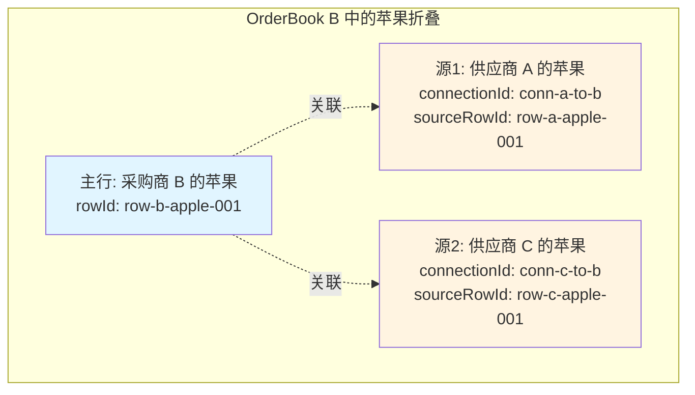

**折叠关系数据**:

```json
{
  "id": "merge-b-apple-001",
  "orderBookId": "orderbook-buyer-b-001",
  "primaryRowId": "row-b-apple-001",
  "mergedRows": [
    {
      "connectionId": null,
      "catalogId": null,
      "sourceRowId": "row-b-apple-001",
      "isPrimary": true,
      "displayOrder": 1
    },
    {
      "connectionId": "conn-a-to-b-001",
      "catalogId": "catalog-supplier-a-001",
      "sourceRowId": "row-a-apple-001",
      "isPrimary": false,
      "displayOrder": 2
    },
    {
      "connectionId": "conn-c-to-b-001",
      "catalogId": "catalog-supplier-c-001",
      "sourceRowId": "row-c-apple-001",
      "isPrimary": false,
      "displayOrder": 3
    }
  ],
  "displayStrategy": "show_all",
  "fieldMergeRules": {
    "product_name": {
      "strategy": "use_primary"
    },
    "supplier_price": {
      "strategy": "custom",
      "displayFormat": "multi_source"
    },
    "stock": {
      "strategy": "sum"
    },
    "min_price": {
      "strategy": "min"
    }
  }
}
```

**UI 显示效果**(表格视图):

| 产品名称 | 供应商 | 价格 | 库存 | 最低价 |
|---------|--------|------|------|--------|
| 🍎 苹果 | 采购商 B(自建) | ¥5.0 | 150 | ¥4.5 |
| ↳ 供应商 A | ¥4.8 | 100 | - |
| ↳ 供应商 C | ¥4.5 | 200 | - |

## 三、数据传播链路详细设计

### 3.1 传播触发机制

基于现有 Document Webhook 机制,在 Catalog 文档上注册 Hook 监听器。

#### 3.1.1 Webhook 配置

```json
{
  "name": "Catalog 变更传播监听",
  "docType": "catalog",
  "docId": "catalog-supplier-a-001",
  "events": [
    "revision_created"
  ],
  "filters": {
    "docTypes": ["catalog", "product_catalog"]
  },
  "url": "https://internal-service/propagation-handler"
}
```

#### 3.1.2 事件处理流程

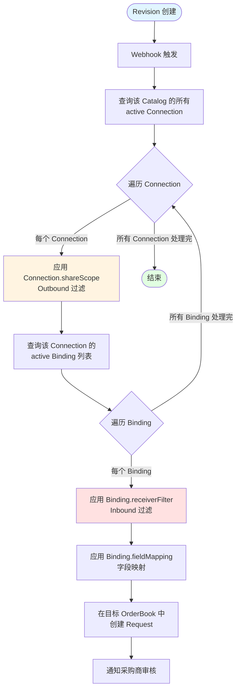

**处理流程说明**:
1. **Outbound 阶段**: Connection.shareScope 过滤供应商分享的商品范围
2. **Inbound 阶段**: 每个 Binding 的 receiverFilter 过滤采购商关心的商品
3. **字段映射**: 使用 Binding 定义的 fieldMapping 进行字段转换
4. **创建请求**: 在采购商的 OrderBook 中创建 Request 等待审核

### 3.2 分享范围过滤逻辑

根据 Connection.shareScope 配置,从 Revision.changes 中筛选符合条件的变更。

#### 3.2.1 过滤算法

| shareScope.mode | 过滤逻辑 |
|-----------------|----------|
| all | 所有变更均通过 |
| view | 查询 viewId 对应的视图配置,应用 filters 条件筛选 Revision 中涉及的 rowId |
| filter | 应用 filterGroup 条件筛选 Revision 中涉及的 rowId |
| rows | 仅保留 rowIds 列表中的行变更 |

**输入**: Revision 对象
**输出**: 过滤后的 ChangeOperation 列表

#### 3.2.2 示例

**Revision 内容**:
```json
{
  "id": "rev-001",
  "changes": [
    {
      "type": "data_row",
      "operation": "update",
      "target": {"rowId": "row-apple-001"},
      "oldValue": {"price": 5.0},
      "newValue": {"price": 4.8}
    },
    {
      "type": "data_row",
      "operation": "update",
      "target": {"rowId": "row-banana-001"},
      "oldValue": {"price": 3.0},
      "newValue": {"price": 2.8}
    }
  ]
}
```

**Connection shareScope**:
```json
{
  "mode": "filter",
  "filterGroup": {
    "logic": "and",
    "conditions": [
      {"field": "category", "operator": "eq", "value": {"text": "水果"}}
    ]
  }
}
```

**假设**: row-apple-001 属于"水果",row-banana-001 属于"蔬菜"

**过滤结果**: 仅保留 row-apple-001 的变更

### 3.3 接收方过滤逻辑

根据 **Binding.receiverFilter** 进一步筛选采购商关心的变更。

#### 3.3.1 过滤流程

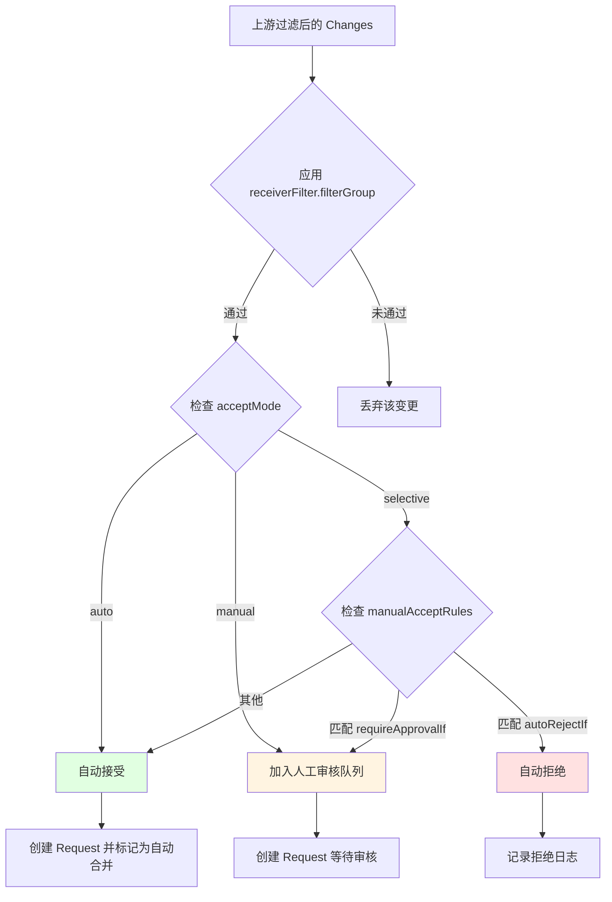

### 3.4 字段映射与转换

根据 Connection.fieldMapping 将上游字段映射到下游字段。

#### 3.4.1 映射算法

**输入**: 上游 ChangeOperation(包含 oldValue、newValue)
**输出**: 转换后的 ChangeOperation(下游字段 ID 和值)

**步骤**:
1. 遍历 ChangeOperation 中涉及的每个字段
2. 在 fieldMapping.rules 中查找对应的映射规则
3. 根据 propagationMode 判断是否传播:
   - `disabled`: 跳过该字段
   - `initial`: 检查目标行是否已存在,若已存在则跳过
   - `oneway` / `sync`: 执行映射转换
4. 应用 transformType 和 transformConfig 进行值转换(若有)
5. 生成新的 ChangeOperation,使用 targetFieldId

#### 3.4.2 示例

**上游 Change**:
```json
{
  "type": "data_row",
  "operation": "update",
  "target": {"rowId": "row-apple-001"},
  "oldValue": {
    "price": {"currency": 5.0},
    "stock": {"number": 100}
  },
  "newValue": {
    "price": {"currency": 4.8},
    "stock": {"number": 150}
  }
}
```

**映射规则**:
```json
{
  "rules": [
    {
      "sourceFieldId": "price",
      "targetFieldId": "supplier_price",
      "propagationMode": "sync"
    },
    {
      "sourceFieldId": "stock",
      "targetFieldId": "available_stock",
      "propagationMode": "oneway"
    }
  ]
}
```

**转换后 Change**:
```json
{
  "type": "data_row",
  "operation": "update",
  "target": {"rowId": "mapped-row-apple-001"},
  "oldValue": {
    "supplier_price": {"currency": 5.0},
    "available_stock": {"number": 100}
  },
  "newValue": {
    "supplier_price": {"currency": 4.8},
    "available_stock": {"number": 150}
  }
}
```

### 3.5 冲突检测与解决

当上游变更的字段在下游已被本地修改时,产生冲突。

#### 3.5.1 冲突检测逻辑

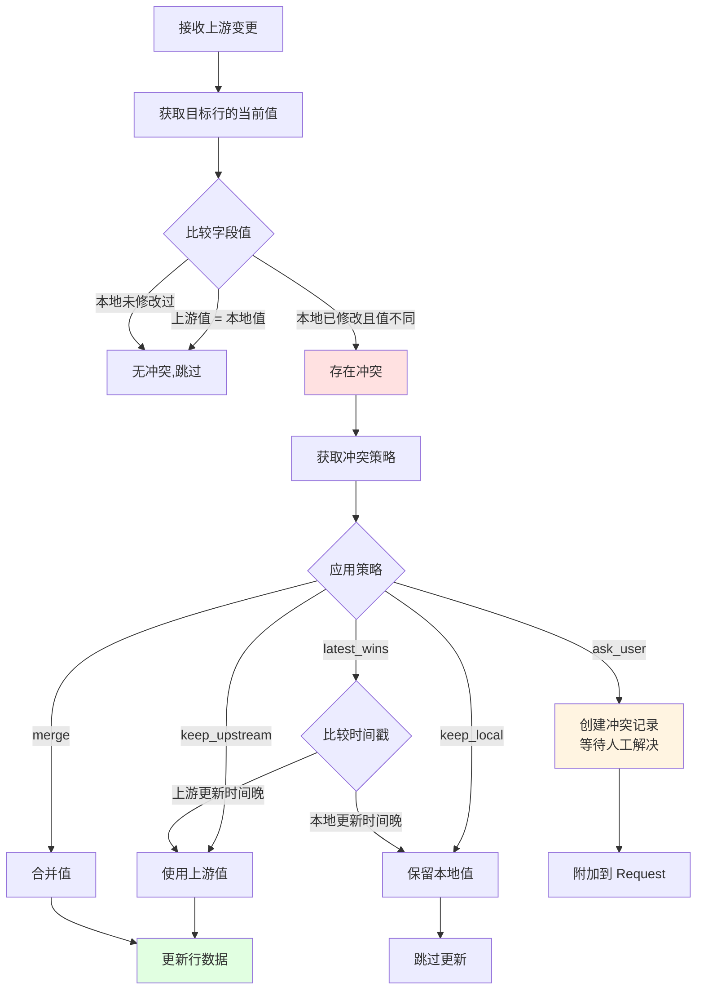

#### 3.5.2 冲突记录模型

基于现有 SyncConflict 模型扩展:

| 字段 | 说明 |
|------|------|
| id | 冲突 ID |
| requestId | 关联的 Request ID |
| connectionId | 来源 Connection ID |
| rowId | 目标行 ID |
| fieldId | 冲突字段 ID |
| upstreamValue | 上游值 |
| localValue | 本地值 |
| upstreamModifiedAt | 上游修改时间 |
| localModifiedAt | 本地修改时间 |
| resolution | 解决策略 |
| resolved | 是否已解决 |
| resolvedBy | 解决人 |
| resolvedAt | 解决时间 |

### 3.6 下游 Request 创建

将过滤、映射、冲突处理后的变更,在目标 OrderBook 中创建 Request。

#### 3.6.1 Request 结构

```json
{
  "id": "req-orderbook-b-001",
  "title": "接收供应商 A 的商品变更",
  "description": "来自 Connection: conn-a-to-b-001",
  "docType": "orderbook",
  "docId": "orderbook-buyer-b-001",
  "status": "open",
  "metadata": {
    "propagationSource": {
      "connectionId": "conn-a-to-b-001",
      "sourceCatalogId": "catalog-supplier-a-001",
      "sourceRevisionId": "rev-supplier-a-001",
      "propagatedAt": "2024-12-12T16:00:00Z"
    },
    "autoMerge": false,
    "conflicts": [
      {
        "conflictId": "conflict-001",
        "rowId": "row-apple-001",
        "fieldId": "supplier_price"
      }
    ]
  },
  "changes": [
    {
      "id": "change-001",
      "type": "data_row",
      "operation": "update",
      "targetId": "row-apple-001",
      "data": {
        "supplier_price": {"currency": 4.8}
      }
    }
  ],
  "author": {
    "id": "system",
    "displayName": "系统自动传播"
  },
  "createdAt": "2024-12-12T16:00:00Z"
}
```

#### 3.6.2 自动合并与人工审核

根据 receiverFilter.acceptMode 和冲突情况决定:

| 条件 | 行为 |
|------|------|
| acceptMode = "auto" 且无冲突 | Request 创建后自动合并 |
| acceptMode = "auto" 但有 ask_user 冲突 | Request 等待人工处理冲突后合并 |
| acceptMode = "manual" | Request 等待采购商审核 |
| acceptMode = "selective" | 根据 manualAcceptRules 判断 |

### 3.7 级联传播机制

当 OrderBook 本身也作为 Catalog 向下游分享时,需要继续传播变更。

#### 3.7.1 级联触发条件

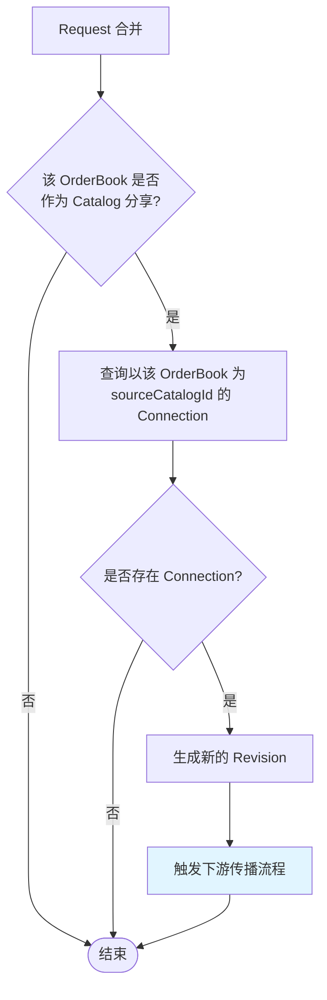

#### 3.7.2 级联传播示例

**场景**: 供应商 A → 采购商 B (中间商) → 零售商 C

1. 供应商 A 修改苹果价格 5.0 → 4.8,生成 Revision A
2. Revision A 通过 Connection A→B 传播到采购商 B 的 OrderBook
3. 采购商 B 审核并接受,Request 合并,生成 Revision B
4. 系统检测到 OrderBook B 同时作为 Catalog B,且存在 Connection B→C
5. Revision B 触发下游传播,通过 Connection B→C 传播到零售商 C 的 OrderBook
6. 零售商 C 收到 Request C,审核后接受

**传播链路**:
```
Catalog A (Revision A)
    ↓ [Connection A→B]
OrderBook B (Request B → Revision B)
    ↓ [Connection B→C]
OrderBook C (Request C → Revision C)
```

## 四、文档管理与关联逻辑

### 4.1 文档关联关系

使用现有 Relation 模型建立文档间的关联。

#### 4.1.1 Connection 与 Catalog/OrderBook 的关联

| 关联类型 | 说明 |
|---------|------|
| Connection → Catalog | 一个 Connection 关联一个源 Catalog |
| Connection → OrderBook | 一个 Connection 关联一个目标 OrderBook |
| OrderBook → Connection | 一个 OrderBook 可被多个 Connection 关联(多供应商) |
| Catalog → Connection | 一个 Catalog 可有多个 Connection(多采购商) |

**关联边定义**:

```json
{
  "id": "rel-conn-to-catalog-001",
  "type": "connects_to",
  "direction": "uni",
  "source": {
    "docType": "connection",
    "docId": "conn-a-to-b-001"
  },
  "target": {
    "docType": "catalog",
    "docId": "catalog-supplier-a-001"
  }
}
```

#### 4.1.2 OrderBook 数据行与源 Catalog 行的关联

对于来自 Connection 的数据行,建立行级关联:

```json
{
  "id": "rel-row-source-001",
  "type": "sourced_from",
  "direction": "uni",
  "source": {
    "docType": "orderbook",
    "docId": "orderbook-buyer-b-001",
    "rowId": "row-apple-b-001"
  },
  "target": {
    "docType": "catalog",
    "docId": "catalog-supplier-a-001",
    "rowId": "row-apple-a-001"
  },
  "metadata": {
    "connectionId": "conn-a-to-b-001",
    "syncedAt": "2024-12-12T16:00:00Z"
  }
}
```

#### 4.1.3 折叠商品的多源关联

当商品折叠时,主行与多个源行建立关联:

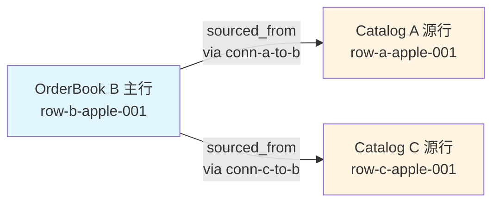

### 4.2 文档生命周期管理

#### 4.2.1 Catalog 生命周期

| 阶段 | 说明 | 操作 |
|------|------|------|
| 创建 | 供应商创建 Catalog 文档 | 初始化 properties、metadata、views |
| 维护 | 供应商管理商品数据 | 通过 Request/Revision 工作流修改 |
| 分享 | 创建 Connection 向采购商分享 | 配置 shareScope、fieldMapping 等 |
| 变更传播 | 修订后自动触发传播 | Webhook 监听 revision_created |
| 停用 | 停止分享或删除 | 更新 Connection.status 或删除 Connection |

#### 4.2.2 OrderBook 生命周期

| 阶段 | 说明 | 操作 |
|------|------|------|
| 创建 | 采购商创建 OrderBook 文档 | 初始化基础结构 |
| 接入 Connection | 接受供应商分享的 Connection | 配置 receiverFilter、字段映射 |
| 接收变更 | 收到上游传播的 Request | 审核并决定接受/拒绝 |
| 本地修改 | 采购商自行修改商品数据 | 通过 Request/Revision 工作流 |
| 冲突解决 | 处理上下游冲突 | 人工选择策略或合并 |
| 继续分享 | 作为中间商向下游分享 | 创建新的 Connection |

#### 4.2.3 Connection 生命周期

| 阶段 | 说明 | 操作 |
|------|------|------|
| 创建 | 供应商或采购商创建连接 | 配置分享范围、映射规则等 |
| 激活 | 启用连接,开始传播 | status = "active" |
| 运行 | 持续监听并传播变更 | Webhook 触发传播流程 |
| 暂停 | 临时停止传播 | status = "paused" |
| 停用 | 永久停止传播 | status = "disabled" |
| 删除 | 删除连接 | 清理关联关系,可选保留历史数据 |

### 4.3 数据一致性保障

#### 4.3.1 并发控制

- **Catalog 修改**: 遵循现有 Request/Revision 工作流,使用版本号乐观锁
- **OrderBook 修改**: 同样使用版本号控制
- **Connection 配置**: 修改 Connection 时加锁,避免并发修改配置导致传播异常

#### 4.3.2 事务性保障

**传播流程的原子性**:
1. 过滤、映射、冲突检测作为一个逻辑单元
2. 创建下游 Request 成功后,记录传播日志
3. 若创建 Request 失败,记录错误并重试(幂等性设计)

**幂等性设计**:
- 每次传播携带唯一的 `propagationId`
- 下游检查是否已存在该 propagationId 的 Request,避免重复创建

#### 4.3.3 数据溯源

通过以下机制实现完整溯源:

| 溯源维度 | 实现方式 |
|---------|---------|
| 变更来源 | Request.metadata 记录 propagationSource |
| 传播路径 | 记录 connectionId、sourceRevisionId |
| 时间轴 | Revision.createdAt、Request.createdAt、propagatedAt |
| 责任人 | Revision.mergedBy、Request.author |
| 冲突历史 | SyncConflict 记录冲突及解决过程 |

## 五、API 接口设计

### 5.1 Connection 管理接口(跨组织)

#### 5.1.1 创建 Connection

**端点**: `POST /connections`

**请求体**:
```json
{
  "name": "供应商 A 电子产品分享",
  "sourceCatalogId": "catalog-supplier-a-001",
  "sourceCatalogType": "catalog",
  "shareMode": "multiple",
  "accessControl": {
    "mode": "whitelist",
    "allowedOrganizations": ["org-buyer-b", "org-buyer-c"]
  },
  "shareScope": { ... },
  "fieldMapping": { ... },
  "conflictResolution": { ... },
  "propagationEvents": { ... }
}
```

**响应**:
```json
{
  "success": true,
  "data": {
    "id": "conn-supplier-a-shared-001",
    "shareMode": "multiple",
    "status": "active",
    "createdAt": "2024-12-12T16:00:00Z"
  }
}
```

#### 5.1.2 关联 Connection(采购商)

**端点**: `POST /connections/{connectionId}/bind`

**说明**: 采购商通过此接口关联 Connection,**并在 Binding 中定义自己的接收规则(Inbound 配置)**。

**请求体**:
```json
{
  "targetOrderBookId": "orderbook-buyer-b-001",
  "targetOrderBookType": "orderbook",
  
  // Inbound 接收规则(采购商定义)
  "receiverFilter": {
    "acceptMode": "selective",
    "filterGroup": {
      "logic": "and",
      "conditions": [
        {
          "field": "price",
          "operator": "range",
          "rangeStart": 0,
          "rangeEnd": 5000
        }
      ]
    },
    "manualAcceptRules": {
      "requireApprovalIf": {
        "logic": "or",
        "conditions": [
          {
            "field": "price_change_percent",
            "operator": "range",
            "rangeStart": 10,
            "rangeEnd": 999
          }
        ]
      }
    }
  },
  
  // 字段映射(采购商定义)
  "fieldMapping": {
    "rules": [
      {
        "sourceFieldId": "price",
        "targetFieldId": "supplier_price",
        "propagationMode": "sync"
      },
      {
        "sourceFieldId": "stock",
        "targetFieldId": "available_stock",
        "propagationMode": "oneway"
      }
    ],
    "unmappedFields": "ignore"
  },
  
  // 冲突策略(采购商定义)
  "conflictResolution": {
    "defaultStrategy": "keep_upstream",
    "fieldStrategies": {
      "supplier_price": {
        "strategy": "keep_upstream"
      },
      "internal_note": {
        "strategy": "keep_local"
      }
    }
  }
}
```

**流程说明**:
1. 系统检查 Connection.accessControl 权限
2. 若需审批,创建 `pending` 状态的 ConnectionBinding
3. 若自动批准,创建 `active` 状态的 ConnectionBinding
4. **Binding 中存储的 receiverFilter、fieldMapping、conflictResolution 将在数据传播时使用**
5. 采购商可参考 Connection.defaultReceiverConfig,但可完全自定义

**响应**:
```json
{
  "success": true,
  "data": {
    "bindingId": "binding-b-to-conn-001",
    "connectionId": "conn-supplier-a-shared-001",
    "status": "active",
    "bindingStatus": "active",
    "requestedAt": "2024-12-12T16:00:00Z"
  }
}
```

#### 5.1.3 审批关联请求(供应商)

**端点**: `POST /connections/{connectionId}/bindings/{bindingId}/approve`

**请求体**:
```json
{
  "action": "approve",
  "comment": "批准关联"
}
```

**说明**:
- 仅当 accessControl.mode = "approval" 时需要
- 供应商组织的审批人可执行此操作

#### 5.1.4 列出 Connection

**端点**: `GET /connections`

**查询参数**:
- `sourceCatalogId`: 按源 Catalog 筛选
- `sourceOrganizationId`: 按供应商组织筛选
- `shareMode`: 按分享模式筛选
- `status`: 按状态筛选
- `page`: 分页页码
- `pageSize`: 每页数量

**说明**:
- 供应商看到自己创建的 Connection
- 采购商看到已关联的 Connection

**响应**:
```json
{
  "success": true,
  "data": {
    "items": [ ... ],
    "total": 10,
    "page": 1,
    "pageSize": 20
  }
}
```

#### 5.1.5 列出 Connection 的 Outbound Binding(供应商)

**端点**: `GET /connections/{connectionId}/bindings?direction=outbound`

**说明**: 供应商查看该 Connection 分享给了哪些采购商(Outbound 视角)。

**响应**:
```json
{
  "success": true,
  "data": {
    "items": [
      {
        "bindingId": "binding-b-to-conn-001",
        "bindingDirection": "outbound",
        "targetOrganizationId": "org-buyer-b",
        "targetOrderBookId": "orderbook-buyer-b-001",
        "bindingStatus": "active",
        "requestedAt": "2024-12-12T16:00:00Z"
      },
      {
        "bindingId": "binding-c-to-conn-001",
        "bindingDirection": "outbound",
        "targetOrganizationId": "org-buyer-c",
        "targetOrderBookId": "orderbook-buyer-c-001",
        "bindingStatus": "pending",
        "requestedAt": "2024-12-12T17:00:00Z"
      }
    ]
  }
}
```

#### 5.1.6 列出自己的 Inbound Binding(采购商)

**端点**: `GET /bindings?direction=inbound`

**说明**: 采购商查看自己从哪些 Connection 接收数据(Inbound 视角)。

#### 5.1.7 更新 Inbound Binding(采购商)

**端点**: `PUT /connections/{connectionId}/bindings/{bindingId}`

**请求体**:
```json
{
  "receiverFilter": { ... },
  "fieldMapping": { ... },
  "conflictResolution": { ... }
}
```

**说明**: 采购商可以更新自己的 Inbound Binding 接收配置,从下次传播开始生效。

#### 5.1.8 更新 Connection(供应商)

**端点**: `PUT /connections/{connectionId}`

**请求体**: 与创建接口相同(部分字段可选)

**说明**: 仅供应商组织可更新 Connection 的 Outbound 配置(分享范围、访问控制等)。

#### 5.1.9 解绑 Inbound Binding(采购商)

**端点**: `DELETE /connections/{connectionId}/bindings/{bindingId}`

**查询参数**:
- `preserveData`: 是否保留已传播的数据(默认 true)

**说明**: 采购商解除 Inbound Binding,停止接收数据传播。

#### 5.1.10 删除 Connection(供应商)

**端点**: `DELETE /connections/{connectionId}`

**查询参数**:
- `preserveData`: 是否保留已传播的数据(默认 true)

**说明**: 
- 仅供应商组织可删除
- 删除后所有关联的 Outbound Binding 失效,采购商停止接收传播

#### 5.1.11 暂停/恢复 Connection

**端点**: `POST /connections/{connectionId}/pause`
**端点**: `POST /connections/{connectionId}/resume`

**说明**: 暂停后所有关联的采购商停止接收传播

### 5.2 Connector 管理接口(组织内)

#### 5.2.1 创建 Connector

**端点**: `POST /connectors`

**请求体**:
```json
{
  "name": "主商品库 → 分店商品库",
  "connectorType": "catalog_clone",
  "sourceDocId": "catalog-headquarter-001",
  "sourceDocType": "catalog",
  "targetDocId": "catalog-branch-001",
  "targetDocType": "catalog",
  "catalogCloneConfig": { ... }
}
```

**响应**:
```json
{
  "success": true,
  "data": {
    "id": "connector-catalog-clone-001",
    "status": "active",
    "createdAt": "2024-12-12T16:00:00Z"
  }
}
```

#### 5.2.2 列出 Connector

**端点**: `GET /connectors`

**查询参数**:
- `sourceDocId`: 按源文档筛选
- `targetDocId`: 按目标文档筛选
- `connectorType`: 按类型筛选
- `status`: 按状态筛选

#### 5.2.3 更新 Connector

**端点**: `PUT /connectors/{connectorId}`

#### 5.2.4 删除 Connector

**端点**: `DELETE /connectors/{connectorId}`

**查询参数**:
- `preserveTarget`: 是否保留目标文档数据(默认 true)
- `unlinkOnly`: 仅解除联动关系,不删除已同步数据(默认 false)

#### 5.2.5 手动触发同步

**端点**: `POST /connectors/{connectorId}/sync`

**请求体**:
```json
{
  "syncMode": "full",  // full | incremental
  "dryRun": false
}
```

**响应**:
```json
{
  "success": true,
  "data": {
    "syncTaskId": "sync-task-001",
    "status": "running",
    "stats": {
      "rowsToCreate": 10,
      "rowsToUpdate": 5,
      "rowsToDelete": 2
    }
  }
}
```

#### 5.2.6 查询同步历史

**端点**: `GET /connectors/{connectorId}/sync-history`

**响应**:
```json
{
  "success": true,
  "data": {
    "items": [
      {
        "syncTaskId": "sync-task-001",
        "syncMode": "full",
        "status": "completed",
        "stats": {
          "rowsCreated": 10,
          "rowsUpdated": 5,
          "rowsDeleted": 2
        },
        "startedAt": "2024-12-12T16:00:00Z",
        "completedAt": "2024-12-12T16:00:10Z"
      }
    ]
  }
}
```

#### 5.2.7 查询联动关系

**端点**: `GET /connectors/{connectorId}/linked-rows`

**说明**: 查询源文档与目标文档之间的行级联动关系

**响应**:
```json
{
  "success": true,
  "data": {
    "items": [
      {
        "sourceRowId": "row-source-001",
        "targetRowId": "row-target-001",
        "linkType": "synced",  // synced | local
        "lastSyncAt": "2024-12-12T16:00:00Z"
      }
    ]
  }
}
```

### 5.3 传播管理接口(跨组织)

#### 5.2.1 手动触发传播

**端点**: `POST /connections/{connectionId}/propagate`

**请求体**:
```json
{
  "revisionId": "rev-supplier-a-001",
  "dryRun": false
}
```

**说明**:
- `dryRun`: 预演模式,返回传播计划但不实际执行
- 用于补偿性传播或测试

#### 5.2.2 查询传播历史

**端点**: `GET /connections/{connectionId}/propagations`

**响应**:
```json
{
  "success": true,
  "data": {
    "items": [
      {
        "id": "prop-001",
        "sourceRevisionId": "rev-supplier-a-001",
        "targetRequestId": "req-orderbook-b-001",
        "status": "completed",
        "propagatedAt": "2024-12-12T16:00:00Z",
        "stats": {
          "rowsCreated": 2,
          "rowsUpdated": 5,
          "rowsDeleted": 1,
          "conflictsDetected": 3,
          "conflictsResolved": 2
        }
      }
    ]
  }
}
```

#### 5.2.3 取消传播(Request 未合并时)

**端点**: `POST /propagations/{propagationId}/cancel`

### 5.4 冲突管理接口

#### 5.3.1 列出冲突

**端点**: `GET /connections/{connectionId}/conflicts`

**查询参数**:
- `resolved`: 是否已解决
- `requestId`: 按 Request 筛选

#### 5.3.2 解决冲突

**端点**: `POST /conflicts/{conflictId}/resolve`

**请求体**:
```json
{
  "resolution": "keep_upstream",
  "customValue": { ... }
}
```

### 5.5 商品折叠管理接口

#### 5.4.1 创建折叠关系

**端点**: `POST /orderbooks/{orderBookId}/merges`

**请求体**:
```json
{
  "primaryRowId": "row-b-apple-001",
  "mergedRows": [ ... ],
  "fieldMergeRules": { ... }
}
```

#### 5.4.2 更新折叠关系

**端点**: `PUT /orderbooks/{orderBookId}/merges/{mergeId}`

#### 5.4.3 删除折叠关系(展开商品)

**端点**: `DELETE /orderbooks/{orderBookId}/merges/{mergeId}`

#### 5.4.4 查询折叠关系

**端点**: `GET /orderbooks/{orderBookId}/merges/{mergeId}`

## 六、复杂场景处理策略

### 6.0 组织内 Connector 场景

#### 6.0.1 Catalog 复制场景

**场景**: 总部主商品库复制到各分店,分店可增加本地特色商品

**处理策略**:

1. **初始克隆**:
   - 创建 Connector,设置 `syncMode: "full"`, `syncDirection: "one_way"`
   - 首次同步时完整复制主商品库到分店
   - 标记所有商品为"联动商品"

2. **本地新增商品**:
   - 分店在目标 Catalog 中新增商品,标记为"本地商品"
   - 本地商品不受源 Catalog 影响
   - 本地商品可自由修改和删除

3. **联动商品变更**:
   - 源 Catalog 中联动商品的价格、库存等字段变更
   - 通过 Connector 自动同步到分店对应商品
   - 分店的 `nonLinkedFields`(如本地备注)保持不变

4. **联动商品删除**:
   - 源 Catalog 删除某商品
   - 根据配置决定是否同步删除分店对应商品
   - 若分店有该商品的订单历史,可转为"本地商品"

**数据流**:

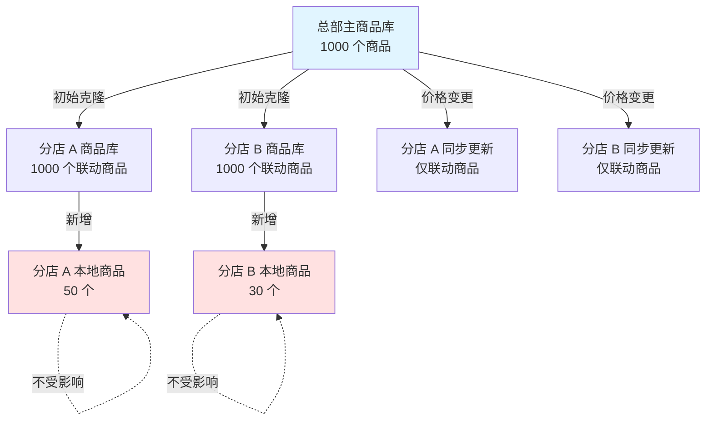

#### 6.0.2 OrderBook 转 Catalog 场景

**场景**: 中间商将采购的商品(OrderBook)转换为自己的销售目录(Catalog),自动加价 20%

**处理策略**:

1. **创建 Connector**:
   - 类型: `orderbook_to_catalog`
   - 源: OrderBook(包含多个供应商的商品)
   - 目标: Catalog(零售商品库)

2. **配置转换规则**:
   ```json
   {
     "fieldTransforms": [
       {
         "sourceFieldId": "supplier_price",
         "targetFieldId": "retail_price",
         "transformType": "formula",
         "transformConfig": {"formula": "supplier_price * 1.2"}
       },
       {
         "sourceFieldId": "available_stock",
         "targetFieldId": "stock",
         "transformType": "copy"
       }
     ],
     "aggregationRules": [
       {
         "fieldId": "stock",
         "aggregationType": "sum",
         "groupByField": "product_name"
       }
     ]
   }
   ```

3. **自动同步触发**:
   - OrderBook 中商品价格更新 → 自动重新计算 retail_price
   - OrderBook 中库存变化 → 自动更新 Catalog 库存
   - OrderBook 中新增商品 → 自动转换并添加到 Catalog

4. **多源聚合**:
   - 若 OrderBook 中有多个供应商提供同一商品
   - 聚合规则按商品名称分组,库存求和
   - 价格取平均值后加价 20%

**数据流**:

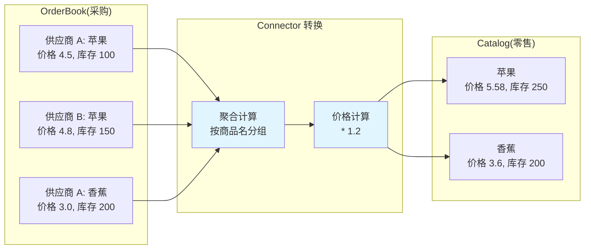

#### 6.0.3 双向联动场景

**场景**: A 部门和 B 部门共享商品库,双方修改互相同步

**处理策略**:

1. **创建双向 Connector**:
   - `syncDirection: "bi_directional"`
   - 定义联动字段和非联动字段

2. **冲突检测**:
   - 双方同时修改同一商品的同一字段
   - 触发冲突检测机制

3. **冲突解决**:
   - `latest_wins`: 使用最后修改的值
   - `ask_user`: 提示人工解决
   - `merge`: 根据规则合并(如数值求平均)

**限制**: 双向联动场景复杂度高,建议优先使用单向联动 + 人工审批

### 6.1 多供应商同商品场景

**场景**: 采购商 B 连接供应商 A 和 C,两者都提供"苹果"。

**处理策略**:

1. **初始接入**:
   - 供应商 A 的苹果通过 Connection A 传播,创建 row-a-apple-b
   - 供应商 C 的苹果通过 Connection C 传播,创建 row-c-apple-b
   - 系统检测到商品名称相同,建议创建折叠关系

2. **创建折叠关系**:
   - 采购商创建 ProductMerge,设置 primaryRowId = row-b-apple-001(自建主行)
   - 关联 row-a-apple-b 和 row-c-apple-b

3. **字段合并**:
   - `product_name`: 使用主行名称
   - `supplier_price`: 显示多源价格列表
   - `stock`: 库存求和
   - `min_price`: 取最小值

4. **变更传播**:
   - 供应商 A 修改价格 → 更新 row-a-apple-b → 触发折叠关系重新计算 `min_price`
   - 供应商 C 修改库存 → 更新 row-c-apple-b → 重新计算 `stock` 总和

### 6.2 部分字段同步场景

**场景**: 采购商希望同步供应商的价格和库存,但本地维护自己的备注和分类。

**处理策略**:

1. **字段映射配置**:
```json
{
  "rules": [
    {
      "sourceFieldId": "price",
      "targetFieldId": "supplier_price",
      "propagationMode": "sync"
    },
    {
      "sourceFieldId": "stock",
      "targetFieldId": "available_stock",
      "propagationMode": "sync"
    },
    {
      "sourceFieldId": "description",
      "targetFieldId": "description",
      "propagationMode": "initial"
    }
  ]
}
```

2. **冲突策略**:
```json
{
  "defaultStrategy": "keep_upstream",
  "fieldStrategies": {
    "supplier_price": {"strategy": "keep_upstream"},
    "available_stock": {"strategy": "keep_upstream"},
    "internal_note": {"strategy": "keep_local"},
    "internal_category": {"strategy": "keep_local"}
  }
}
```

3. **传播效果**:
   - 价格、库存变更: 强制同步到下游
   - 描述: 仅初次传播,后续不同步
   - 内部备注、分类: 始终保留本地值

### 6.3 级联传播多层场景

**场景**: 供应商 A → 采购商 B (中间商) → 零售商 C → 门店 D

**处理策略**:

1. **防止循环传播**:
   - Request.metadata 记录 `propagationPath`: ["catalog-a", "orderbook-b", "catalog-b"]
   - 传播时检查目标是否已在 path 中,若存在则阻止传播

2. **传播衰减**:
   - Connection 配置 `maxPropagationDepth`: 限制传播层数
   - 每层传播时 depth + 1,超过限制则停止

3. **批量优化**:
   - 中间层收集多个上游变更,在窗口时间内批量合并为一个 Request
   - 减少下游接收的 Request 数量

### 6.4 大批量变更传播

**场景**: 供应商一次性修改 10000 个商品的价格。

**处理策略**:

1. **分批传播**:
   - 将 Revision 中的 10000 个 ChangeOperation 分批处理
   - 每批 500 个,分 20 次创建 Request

2. **异步处理**:
   - 传播流程放入消息队列异步执行
   - 避免阻塞主流程

3. **进度通知**:
   - 通过 Webhook 或轮询接口获取传播进度
   - 返回 `{ processed: 5000, total: 10000, status: "in_progress" }`

4. **失败重试**:
   - 记录传播失败的行 ID
   - 提供重试接口: `POST /propagations/{propagationId}/retry`

### 6.5 权限与安全控制

**场景**: 确保只有授权用户才能创建 Connection 和审核 Request。

**处理策略**:

1. **Connection 创建权限**:
   - 源 Catalog 的所有者或管理员才能创建 Connection
   - 目标 OrderBook 的所有者需确认接受 Connection

2. **Request 审核权限**:
   - OrderBook 的所有者或指定审核人才能合并 Request
   - 自动合并的 Request 需配置白名单(可信 Connection)

3. **数据访问控制**:
   - Connection 分享的数据遵循 Catalog 的访问权限
   - 采购商无法访问 Catalog 中未分享的数据

4. **审计日志**:
   - 记录所有 Connection 创建、修改、删除操作
   - 记录所有传播、冲突解决操作
   - 支持审计查询: `GET /audit/connections` 和 `GET /audit/propagations`

## 七、架构设计

### 7.1 整体架构

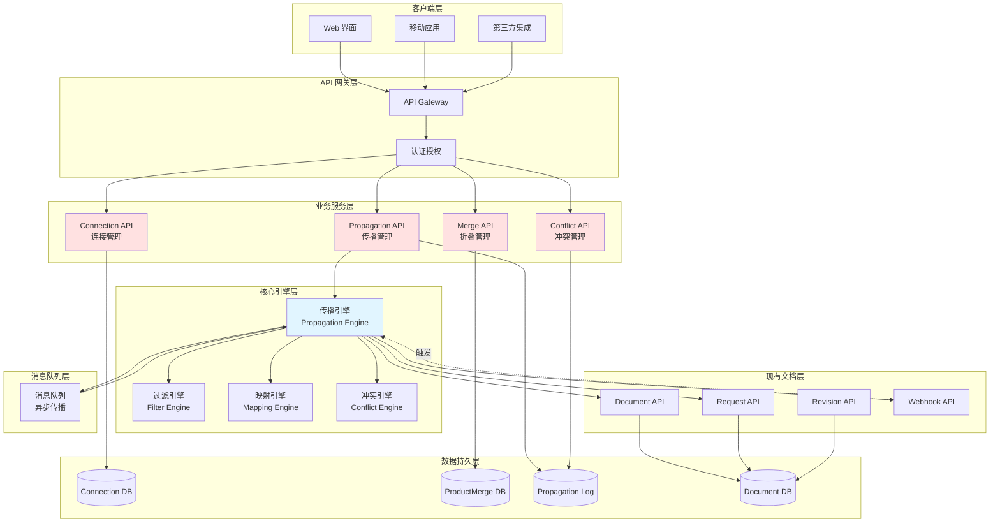

### 7.2 核心模块设计

#### 7.2.1 Connection 管理模块(跨组织)

**职责**:
- 管理 Catalog 与 OrderBook 之间的连接配置
- 提供 Connection 的 CRUD 操作
- 管理连接状态(active/paused/disabled)

**依赖**:
- Document API(验证 Catalog 和 OrderBook 是否存在)
- Webhook API(注册传播监听器)

#### 7.2.2 Connector 管理模块(组织内)

**职责**:
- 管理组织内部文档之间的联动配置
- 提供 Connector 的 CRUD 操作
- 管理联动状态和同步任务

**依赖**:
- Document API(访问源和目标文档)
- Sync Engine(执行同步逻辑)

#### 7.2.3 传播引擎模块(跨组织)

**职责**:
- 监听 Catalog 的 Revision 事件
- 执行分享范围过滤
- 执行接收方过滤
- 执行字段映射转换
- 检测和处理冲突
- 在下游创建 Request

**依赖**:
- Connection 管理模块(获取配置)
- Filter 引擎(过滤逻辑)
- Mapping 引擎(映射逻辑)
- Conflict 引擎(冲突处理)
- Request API(创建下游 Request)
- 消息队列(异步处理)

#### 7.2.4 同步引擎模块(组织内)

**职责**:
- 执行 Connector 的同步逻辑
- 处理 Catalog 复制与联动
- 处理 OrderBook 到 Catalog 转换
- 执行字段转换和聚合计算

**依赖**:
- Connector 管理模块(获取配置)
- Document API(读写文档数据)
- Formula Engine(计算公式字段)

#### 7.2.5 商品折叠模块

**职责**:
- 管理多源商品的折叠关系
- 执行字段聚合计算
- 提供折叠视图查询

**依赖**:
- Document API(查询行数据)
- Connection 管理模块(追溯数据来源)

#### 7.2.6 冲突管理模块

**职责**:
- 记录传播过程中的冲突
- 提供冲突查询和解决接口
- 执行冲突解决策略

**依赖**:
- Sync 模块(复用 SyncConflict 模型)
- Request API(更新 Request)

### 7.3 数据模型设计

#### 7.3.1 Connection 实体(跨组织)

```typescript
model Connection {
  // 基础字段
  id: string
  name: string
  description?: string
  status: ConnectionStatus
  
  // 关联关系
  sourceCatalogId: string
  sourceCatalogType: string
  targetOrderBookId: string
  targetOrderBookType: string
  
  // 配置字段
  shareScope: ShareScope
  receiverFilter?: ReceiverFilter
  fieldMapping: FieldMapping
  conflictResolution: ConflictResolution
  propagationEvents: PropagationEvents
  
  // 元数据
  organizationId?: string
  workspaceId?: string
  createdAt: string
  createdBy: UserRef
  updatedAt?: string
  lastSyncAt?: string
}
```

#### 7.3.2 Connector 实体(组织内)

```typescript
model Connector {
  // 基础字段
  id: string
  name: string
  description?: string
  connectorType: ConnectorType
  status: ConnectorStatus
  
  // 关联关系
  sourceDocId: string
  sourceDocType: string
  targetDocId: string
  targetDocType: string
  
  // 配置字段(根据 connectorType 选择)
  catalogCloneConfig?: CatalogCloneConfig
  orderbookToCatalogConfig?: OrderbookToCatalogConfig
  
  // 元数据
  organizationId: string
  workspaceId?: string
  createdAt: string
  createdBy: UserRef
  updatedAt?: string
  lastSyncAt?: string
}
```

#### 7.3.3 LinkedRow 实体(联动关系)

```typescript
model LinkedRow {
  id: string
  connectorId: string
  sourceRowId: string
  targetRowId: string
  linkType: "synced" | "local"  // synced: 联动商品, local: 本地商品
  linkedFields?: string[]  // 联动字段列表
  lastSyncAt?: string
  createdAt: string
}
```

#### 7.3.4 ProductMerge 实体

```typescript
model ProductMerge {
  id: string
  orderBookId: string
  primaryRowId: string
  mergedRows: MergedRowSource[]
  displayStrategy: DisplayStrategy
  fieldMergeRules: Record<string, FieldMergeRule>
  createdAt: string
  updatedAt?: string
}
```

#### 7.3.5 PropagationLog 实体(跨组织)

```typescript
model PropagationLog {
  id: string
  connectionId: string
  sourceRevisionId: string
  targetRequestId: string
  status: PropagationStatus
  stats: PropagationStats
  errors?: PropagationError[]
  propagatedAt: string
  completedAt?: string
}
```

#### 7.3.6 SyncTask 实体(组织内)

```typescript
model SyncTask {
  id: string
  connectorId: string
  syncMode: "full" | "incremental"
  status: SyncTaskStatus
  stats: {
    rowsCreated: number
    rowsUpdated: number
    rowsDeleted: number
    rowsSkipped: number
  }
  errors?: SyncError[]
  startedAt: string
  completedAt?: string
}
```

### 7.4 扩展点设计

#### 7.4.1 字段转换器扩展

**适用于**: Connection(跨组织) 和 Connector(组织内)

```typescript
interface FieldTransformer {
  type: string
  transform(sourceValue: Value, config: unknown): Value
  validate(config: unknown): boolean
}
```

**内置转换器**:
- `identity`: 原样传递
- `constant`: 常量值
- `expression`: 表达式计算
- `lookup`: 查找表映射

**扩展方式**: 注册自定义转换器到转换器注册表

**内置转换器**:
- `identity`: 原样传递
- `constant`: 常量值
- `expression`: 表达式计算(支持 Connector 的公式字段)
- `lookup`: 查找表映射

**扩展方式**: 注册自定义转换器到转换器注册表

#### 7.4.2 公式引擎扩展(Connector)

**适用于**: Connector 的 OrderBook 转 Catalog 场景

```typescript
interface FormulaEngine {
  // 计算公式
  evaluate(formula: string, context: Record<string, Value>): Value
  
  // 验证公式语法
  validate(formula: string): boolean
  
  // 注册自定义函数
  registerFunction(name: string, fn: Function): void
}
```

**内置函数**:
- 数学: `SUM`, `AVG`, `MIN`, `MAX`, `ROUND`
- 字符串: `CONCAT`, `SUBSTRING`, `REPLACE`
- 逻辑: `IF`, `AND`, `OR`, `NOT`
- 日期: `TODAY`, `DATE_ADD`, `DATE_DIFF`

**示例公式**:
- `supplier_price * 1.2`: 加价 20%
- `IF(stock > 100, "充足", "紧张")`: 库存状态判断
- `ROUND(AVG(supplier_price_a, supplier_price_b), 2)`: 多源价格平均

#### 7.4.3 冲突策略扩展

```typescript
interface ConflictStrategy {
  type: string
  resolve(
    upstreamValue: Value,
    localValue: Value,
    context: ConflictContext
  ): ResolvedValue
}
```

**内置策略**:
- `keep_upstream`: 使用上游值
- `keep_local`: 保留本地值
- `latest_wins`: 比较时间戳
- `merge`: 合并值
- `ask_user`: 人工介入

**扩展方式**: 注册自定义策略到策略注册表

#### 7.4.4 过滤器扩展

基于现有 FilterGroup 模型,支持自定义操作符:

```typescript
interface FilterOperator {
  name: string
  evaluate(fieldValue: Value, condition: Filter): boolean
}
```

#### 7.4.5 聚合函数扩展(Connector)

**适用于**: Connector 的多源数据聚合

```typescript
interface AggregationFunction {
  name: string
  aggregate(values: Value[]): Value
}
```

**内置聚合函数**:
- `sum`: 求和
- `avg`: 平均值
- `min`: 最小值
- `max`: 最大值
- `count`: 计数
- `first`: 第一个值
- `last`: 最后一个值

### 7.5 性能与可扩展性考虑

#### 7.5.1 异步处理

**跨组织(Connection)**:
- 传播流程通过消息队列异步执行
- 支持批量传播窗口聚合
- 避免阻塞主业务流程

**组织内(Connector)**:
- 同步任务可选同步/异步执行
- 小规模同步(< 100 行)同步执行,大规模异步执行
- 支持定时同步任务

#### 7.5.2 分片与限流

**跨组织(Connection)**:
- 大批量传播自动分批处理
- Connection 级别的传播限流
- 防止单个 Connection 占用过多资源

**组织内(Connector)**:
- 同步任务自动分批(每批 500 行)
- Connector 级别的同步频率限制
- 避免频繁同步影响性能

#### 7.5.3 缓存策略

**跨组织(Connection)**:
- Connection 配置缓存
- 字段映射规则缓存
- Document 元数据缓存
- 减少数据库查询

**组织内(Connector)**:
- Connector 配置缓存
- LinkedRow 关系缓存(内存索引)
- 公式编译结果缓存
- 减少重复计算

#### 7.5.4 水平扩展

**跨组织(Connection)**:
- 传播引擎无状态设计,支持多实例部署
- 基于 connectionId 分片处理
- 消息队列支持分区并行消费

**组织内(Connector)**:
- 同步引擎无状态设计
- 基于 connectorId 分片处理
- 支持多租户并行同步

### 7.6 安全与权限设计

#### 7.6.1 权限模型

**跨组织(Connection)**:

| 操作 | 所需权限 | 检查点 |
|------|---------|--------|
| 创建 Connection | Catalog 所属组织的管理员 | Connection API |
| 查看 Connection | Connection 创建组织或关联组织成员 | Connection API |
| 更新 Connection | Connection 所属组织的管理员 | Connection API |
| 删除 Connection | Connection 所属组织的管理员 | Connection API |
| 关联 Connection | 目标 OrderBook 所属组织的成员 | Connection API |
| 审批关联请求 | Connection 配置的审批人 | Connection API |
| 解绑 Connection | 关联组织的管理员 | Connection API |
| 审核 Request | OrderBook 所属组织的审核人 | Request API |
| 解决冲突 | OrderBook 所属组织的管理员或审核人 | Conflict API |

**组织内(Connector)**:

| 操作 | 所需权限 | 检查点 |
|------|---------|--------|
| 创建 Connector | 源文档和目标文档的编辑权限 | Connector API |
| 查看 Connector | 源文档或目标文档的查看权限 | Connector API |
| 更新 Connector | Connector 创建者或组织管理员 | Connector API |
| 删除 Connector | Connector 创建者或组织管理员 | Connector API |
| 触发同步 | Connector 创建者或组织管理员 | Connector API |
| 解除联动 | 目标文档的编辑权限 | Connector API |

**组织级别权限检查**:

```typescript
interface PermissionCheck {
  // 检查用户是否属于指定组织
  isMemberOf(userId: string, organizationId: string): boolean
  
  // 检查用户在组织中的角色
  hasRole(userId: string, organizationId: string, role: string): boolean
  
  // 检查组织是否有权访问 Connection
  canAccessConnection(organizationId: string, connectionId: string): boolean
  
  // 检查用户是否可以审批关联
  canApproveBinding(userId: string, connectionId: string): boolean
}
```

#### 7.6.2 数据访问控制

**跨组织(Connection)**:

- **组织级别隔离**:
  - Catalog 仅对所属组织成员可见
  - OrderBook 仅对所属组织成员可见
  - Connection 对创建组织和授权组织可见

- **分享范围控制**:
  - Connection 仅能访问 shareScope 定义的数据范围
  - 传播时遵循源 Catalog 的访问权限
  - 下游无法访问上游未分享的数据

- **跨组织访问**:
  - 采购商仅能通过 Connection 访问供应商数据
  - 采购商无法直接访问供应商的 Catalog
  - 访问范围受 shareScope 和 receiverFilter 双重限制

**组织内(Connector)**:

- **文档级别权限**:
  - Connector 访问源文档需要查看权限
  - Connector 修改目标文档需要编辑权限
  - 用户查看联动关系需要至少一个文档的查看权限

- **同步范围控制**:
  - Connector 仅能同步 linkedScope 定义的数据范围
  - 本地新增的数据不受 Connector 控制
  - 非联动字段保持独立,不受同步影响

#### 7.6.3 审计追溯

**跨组织(Connection)**:
- 所有 Connection 操作记录审计日志
- 所有传播操作记录 PropagationLog
- 所有冲突及解决记录 ConflictLog
- 支持完整的操作回溯和责任追踪

**组织内(Connector)**:
- 所有 Connector 操作记录审计日志
- 所有同步任务记录 SyncTask
- 联动关系变更记录 LinkedRowHistory
- 支持同步历史查询和数据溯源
