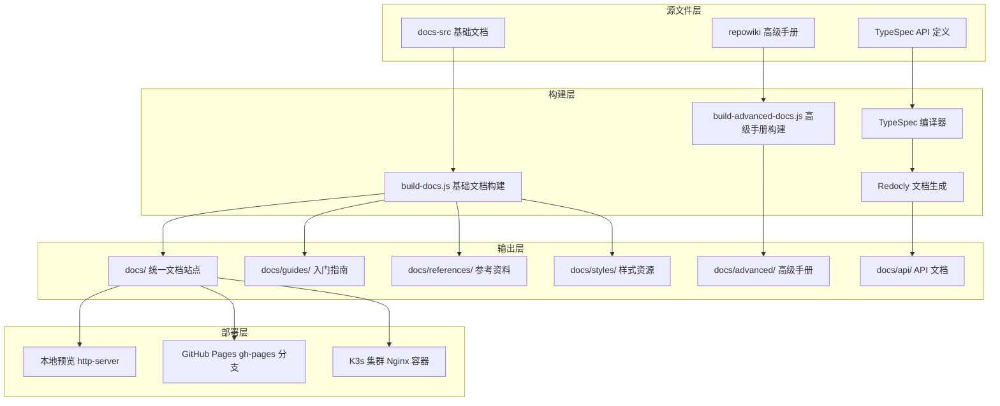
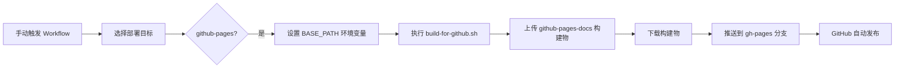
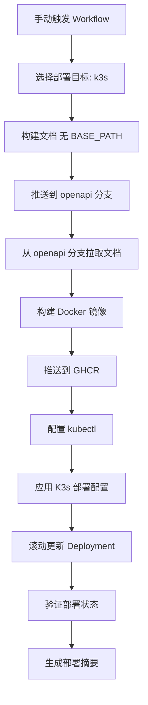
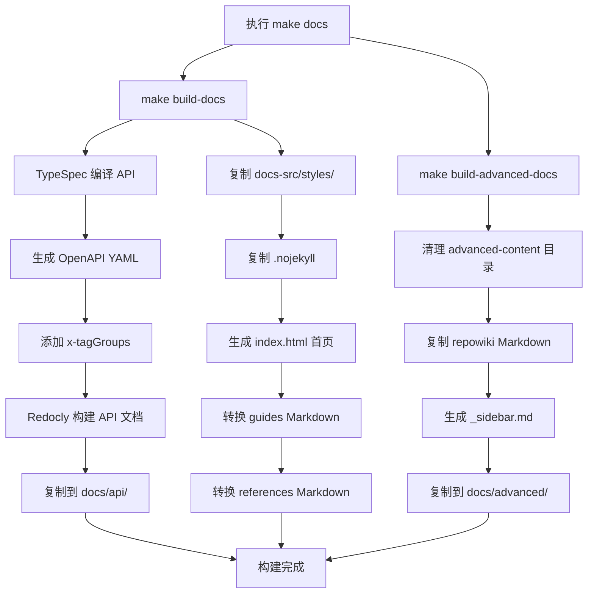
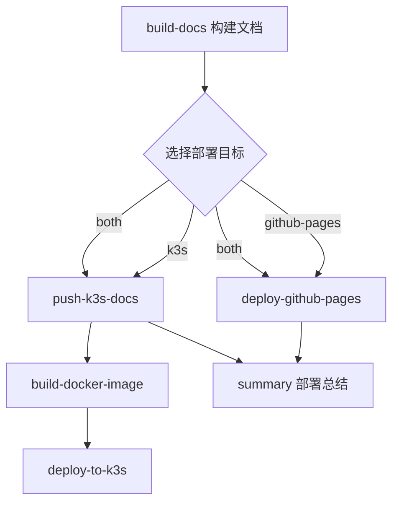

# 文档站点构建设计

## 需求概述

构建一个完整的文档站点，支持本地预览、GitHub Pages 展示以及自动发布到 open.nexusbook.app 生产环境。文档站点需要整合三部分内容：

1. **docs-src（入口文档）**：提供快速开始、核心概念、开发指南等基础文档
2. **repowiki（高级开发）**：深入的架构设计、技术细节和最佳实践
3. **OpenAPI（API 文档）**：完整的 API 接口参考和规范

文档组织清晰、导航便捷，样式美观符合 SaaS 网站标准。

## 架构设计

### 整体架构

文档站点采用三层架构：



### 目录结构设计

输出文档站点的目录结构：

```
docs/
├── index.html                    # 站点首页（入口导航）
├── api/                          # API 文档目录
│   ├── index.html               # Redocly 生成的 API 文档
│   └── openapi.yaml             # OpenAPI 规范文件
├── guides/                       # 开发指南目录
│   ├── getting-started.html     # 快速开始
│   ├── authentication.html      # 认证授权
│   ├── document-model.html      # 文档模型
│   ├── document-model-complete.html # 文档模型完整版
│   ├── data-operations.html     # 数据操作
│   ├── webhooks.html            # Webhook 指南
│   ├── realtime-collaboration.html # 实时协同
│   ├── architecture.html        # 架构设计
│   ├── best-practices.html      # 最佳实践
│   ├── examples.html            # 完整示例
│   └── development.html         # 开发指南
├── references/                   # 参考文档目录
│   ├── error-codes.html         # 错误码
│   ├── field-types.html         # 字段类型
│   ├── i18n.html                # 国际化
│   ├── changelog.html           # 变更日志
│   └── api-reference.html       # API 参考手册
├── advanced/                     # 高级手册目录（Docsify）
│   ├── index.html               # Docsify 主页
│   ├── _sidebar.md              # 侧边栏配置
│   ├── README.md                # 高级手册首页
│   └── **/*.md                  # repowiki 所有文档
├── styles/                       # 样式文件目录
│   └── main.css                 # 统一样式表
└── .nojekyll                     # GitHub Pages 配置
```

### 文档内容来源映射

| 目标路径 | 源路径 | 转换方式 |
|---------|--------|---------|
| `docs/index.html` | 动态生成 | build-docs.js 生成导航首页 |
| `docs/guides/*.html` | `docs-src/guides/*.md` | Markdown → HTML（marked） |
| `docs/references/*.html` | `docs-src/references/*.md` | Markdown → HTML（marked） |
| `docs/api/index.html` | `api/**/*.tsp` | TypeSpec → OpenAPI → Redocly |
| `docs/api/openapi.yaml` | `dist/openapi/openapi.yaml` | 复制构建产物 |
| `docs/advanced/**/*.md` | `.qoder/repowiki/zh/content/**/*.md` | 直接复制 |
| `docs/advanced/index.html` | 动态生成 | Docsify HTML 模板 |
| `docs/advanced/_sidebar.md` | 动态生成 | 遍历 repowiki 目录结构 |
| `docs/styles/main.css` | `docs-src/styles/main.css` | 直接复制 |

## 核心功能设计

### 1. 本地预览支持

#### 预览服务器

使用 http-server 提供本地预览服务：

- 服务端口：默认 8091（可通过 PORT 环境变量配置）
- 自动打开浏览器
- 支持热刷新（需手动刷新浏览器）

#### 预览命令

提供便捷的 Makefile 命令：

| 命令 | 功能 | 说明 |
|------|------|------|
| `make serve` | 构建并启动文档服务 | 完整构建后启动预览 |
| `make docs` | 仅构建文档站点 | 不启动服务器 |
| `make clean-docs` | 清理构建产物 | 删除 docs 目录 |

访问路径示例：
- 首页：`http://localhost:8091/`
- API 文档：`http://localhost:8091/api/`
- 开发指南：`http://localhost:8091/guides/getting-started.html`
- 高级手册：`http://localhost:8091/advanced/`

### 2. GitHub Pages 部署

#### 部署分支策略

采用独立分支管理 GitHub Pages 内容：

- **gh-pages 分支**：存储 GitHub Pages 静态文件
- **构建路径配置**：BASE_PATH=/nexusbook-api/（支持 GitHub 仓库子路径）

#### 部署流程



#### 路径处理机制

通过 BASE_PATH 环境变量支持子路径部署：

- **本地预览**：BASE_PATH=/（根路径访问）
- **GitHub Pages**：BASE_PATH=/nexusbook-api/（仓库名子路径）

所有链接通过 `resolvePath()` 函数动态生成，确保路径正确：

```
resolvePath('api/index.html')
→ 本地: /api/index.html
→ GitHub Pages: /nexusbook-api/api/index.html
```

#### GitHub Pages 访问地址

```
https://{username}.github.io/nexusbook-api/
```

### 3. K3s 集群自动部署

#### 部署架构



#### Docker 镜像构建

**基础镜像**：nginx:alpine

**镜像内容**：
- 静态文档文件（来自 openapi 分支）
- Nginx 配置文件
- 健康检查端点

**镜像仓库**：ghcr.io/{organization}/nexusbook-api-docs

**版本标签策略**：
- 语义化版本：如 1.2.3（去除 v 前缀）
- SHA 标签：sha-{commit_hash}
- latest 标签：主分支最新版本

#### Kubernetes 资源配置

**Deployment 配置**：

| 配置项 | 值 | 说明 |
|--------|-----|------|
| 副本数 | 1 | 单实例部署 |
| 更新策略 | RollingUpdate | 零停机更新 |
| 资源请求 | CPU: 50m, Memory: 64Mi | 最小资源保证 |
| 资源限制 | CPU: 200m, Memory: 128Mi | 防止资源过度占用 |
| 存活探测 | HTTP GET /health | 每 30 秒检查一次 |
| 就绪探测 | HTTP GET /health | 每 10 秒检查一次 |

**Service 配置**：

| 配置项 | 值 | 说明 |
|--------|-----|------|
| 类型 | ClusterIP | 集群内部服务 |
| 端口 | 80 | HTTP 服务端口 |

**Ingress 配置**：

| 配置项 | 值 | 说明 |
|--------|-----|------|
| 域名 | open.nexusbook.app | 生产环境访问域名 |
| Ingress 类 | traefik | K3s 默认 Ingress Controller |
| TLS 证书 | Let's Encrypt | 自动 HTTPS 证书 |
| 证书颁发器 | letsencrypt-prod | Cert-Manager 配置 |

#### 部署验证机制

自动执行以下验证步骤：

1. **滚动更新等待**：等待最多 5 分钟直到新版本就绪
2. **Pod 状态检查**：确认 Pod 运行正常
3. **Ingress 配置检查**：验证域名和路由配置
4. **部署摘要生成**：输出版本、镜像、URL 等关键信息

#### 访问地址

```
https://open.nexusbook.app
```

### 4. 文档组织逻辑

#### 首页导航设计

首页采用分层导航结构：

**顶部导航栏**：
- 首页
- API 参考
- 开发指南
- 高级手册
- 参考文档
- GitHub 仓库链接

**英雄区（Hero Section）**：
- 项目标题和描述
- 快速开始按钮（跳转到入门指南）
- 查看 API 文档按钮（跳转到 API 参考）

**核心特性卡片区**：

| 卡片 | 标题 | 描述 | 链接 |
|------|------|------|------|
| 1 | OpenAPI 文档 | 完整的 API 接口参考 | api/index.html |
| 2 | 开发指南 | 从快速开始到高级用法 | guides/getting-started.html |
| 3 | 高级手册 | 深入的架构设计和最佳实践 | advanced/ |
| 4 | Webhook 指南 | 事件驱动的通知机制 | guides/webhooks.html |
| 5 | 参考文档 | 错误码、字段类型等参考 | references/error-codes.html |

**完整文档列表区**：

按类别展开的详细文档链接：

**🚀 开发指南（11 篇文档）**：
1. 快速开始 - 5分钟了解如何使用 API
2. 认证授权指南 - OAuth2、OIDC 和 JWT 详解
3. 文档模型详解 - 统一文档抽象和字段类型
4. 文档模型完整版 - 文档模型的完整详细说明
5. 数据操作指南 - CRUD 操作和高级查询
6. Webhook 使用指南 - 事件驱动通知机制
7. 实时协同开发指南 - 实时协作功能和使用
8. 架构设计 - 系统架构和设计原则
9. 最佳实践 - 性能优化和安全建议
10. 完整示例 - 常见场景的代码示例
11. 开发指南 - 项目开发和贡献指南

**📖 高级手册**：
Docsify 独立站点，提供完整的目录树导航和全文搜索功能

**📖 参考文档（5 篇文档）**：
1. API 参考手册 - 所有端点的详细文档
2. 错误码参考 - 完整的错误码列表
3. 字段类型参考 - 25+ 种字段类型说明
4. 国际化说明 - 多语言支持文档
5. 变更日志 - 版本更新记录

**核心特性展示区**：

四列展示核心功能亮点：
- 📊 文档与数据管理
- 👁️ 多视图支持
- 💬 协作与工作流
- 🔐 认证与授权

**相关资源区**：
- GitHub 仓库链接
- 问题反馈链接
- 变更日志链接

#### 文档分类逻辑

| 分类 | 目标用户 | 内容特征 | 典型文档 |
|------|---------|---------|---------|
| 入门指南 | 新用户 | 快速上手、基本概念 | getting-started.md |
| 核心概念 | 初级开发者 | 功能详解、使用指南 | document-model.md, webhooks.md |
| API 参考 | 集成开发者 | 接口规范、请求响应 | OpenAPI 文档 |
| 高级手册 | 高级开发者 | 架构设计、源码分析 | repowiki 文档 |
| 参考资料 | 所有用户 | 查询工具、速查表 | error-codes.md, field-types.md |
| 开发指南 | 贡献者 | 开发流程、贡献规范 | development.md |

#### 侧边栏导航（Redocly 配置）

基础文档页面使用统一侧边栏导航：

**导航分组结构**：

```
├── 开始使用（展开）
│   ├── 概览
│   ├── 快速开始
│   └── 认证授权
├── 核心概念（展开）
│   ├── 文档模型
│   ├── 数据操作
│   ├── Webhook 事件
│   └── 实时协同
├── API 参考（展开）
│   ├── API 端点
│   ├── 字段类型
│   └── 错误码
├── 开发指南（折叠）
│   ├── 开发环境
│   ├── 架构设计
│   ├── 最佳实践
│   └── 完整示例
└── 其他资源（折叠）
    ├── 国际化
    ├── 更新日志
    ├── 贡献指南
    └── 问题排查
```

高级手册使用 Docsify 动态生成侧边栏（基于目录结构）。

### 5. 样式设计规范

#### 设计风格定位

符合现代 SaaS 产品的设计语言：

- **简洁清爽**：大量留白、层次分明
- **专业可靠**：偏商务风格，避免过于花哨
- **易读性优先**：清晰的字体、合理的行高和间距
- **移动端友好**：响应式设计，支持各种设备

#### 色彩系统

**主题色**：

| 颜色 | 色值 | 用途 |
|------|------|------|
| 主色 | #1976d2（蓝色） | 按钮、链接、导航高亮 |
| 主色深 | #1565c0 | 按钮悬停、渐变背景 |
| 主色浅 | #42a5f5 | 背景高亮、轻量按钮 |
| 辅助色 | #424242（深灰） | 次要文本 |
| 强调色 | #ff5722（橙红） | 重要提示、警告 |

**文本色**：

| 颜色 | 色值 | 用途 |
|------|------|------|
| 主文本 | #212121 | 正文、标题 |
| 次文本 | #757575 | 辅助说明 |
| 提示文本 | #9e9e9e | 占位符、禁用状态 |

**背景色**：

| 颜色 | 色值 | 用途 |
|------|------|------|
| 主背景 | #ffffff | 页面主体 |
| 次背景 | #f5f5f5 | 区块分隔 |
| 代码背景 | #f8f9fa | 代码块、预览 |
| 卡片背景 | #ffffff | 卡片、面板 |

**深色模式支持**：

通过 CSS `prefers-color-scheme: dark` 自动适配：
- 背景色反转为深色调
- 文本色调整为浅色
- 保持对比度符合 WCAG 标准

#### 排版规范

**字体族**：

- 西文字体：-apple-system, BlinkMacSystemFont, Segoe UI, Roboto
- 中文字体：Microsoft YaHei, sans-serif
- 代码字体：SFMono-Regular, Consolas, Monaco, Menlo

**字号系统**：

| 用途 | 字号 | 行高 |
|------|------|------|
| 大标题（h1） | 2.5rem (40px) | 1.2 |
| 次标题（h2） | 2rem (32px) | 1.3 |
| 小标题（h3） | 1.5rem (24px) | 1.4 |
| 正文 | 1rem (16px) | 1.6 |
| 小字 | 0.875rem (14px) | 1.5 |

**间距系统**：

| 级别 | 值 | 用途 |
|------|-----|------|
| xs | 8px | 行内元素间距 |
| sm | 16px | 段落、列表间距 |
| md | 24px | 小区块间距 |
| lg | 32px | 大区块间距 |
| xl | 48px | 主要区块间距 |

#### 组件样式

**按钮样式**：

- 主按钮：白底蓝字，悬停上浮阴影效果
- 次按钮：蓝底白字，悬停加深背景
- 圆角：8px（中等圆角）
- 内边距：12px 24px

**卡片样式**：

- 背景：白色
- 边框：1px 实线边框（浅灰）
- 圆角：8px
- 阴影：轻微阴影 0 2px 4px rgba(0,0,0,0.1)
- 悬停：阴影加深 0 4px 8px rgba(0,0,0,0.15)

**代码块样式**：

- 背景：#f8f9fa（浅灰）
- 边框：1px 浅灰色
- 圆角：4px
- 字体：等宽字体
- 语法高亮：使用 highlight.js（GitHub 风格）

**导航栏样式**：

- 固定顶部，高度 64px
- 白色背景，底部细线阴影
- 导航项圆角背景高亮
- 激活状态浅蓝背景

**侧边栏样式**（基础文档页面）：

- 左侧固定，宽度 280px
- 分组标题加粗深灰色
- 链接项悬停浅色背景
- 激活项蓝色文字和左侧边条

#### 响应式设计

**断点设置**：

| 设备 | 宽度范围 | 布局调整 |
|------|---------|---------|
| 桌面 | ≥1200px | 完整布局，侧边栏显示 |
| 平板 | 768px - 1199px | 侧边栏可折叠 |
| 手机 | <768px | 单列布局，侧边栏抽屉式 |

**移动端优化**：

- 导航栏折叠为汉堡菜单
- 卡片堆叠为单列
- 字号适当调大（最小 14px）
- 触摸区域扩大到至少 44x44px

## 构建流程设计

### 构建脚本组织

| 脚本文件 | 功能职责 | 输入 | 输出 |
|---------|---------|------|------|
| scripts/build-docs.js | 构建基础文档（guides、references） | docs-src/**/*.md | docs/**/*.html |
| scripts/build-advanced-docs.js | 构建高级手册（Docsify） | .qoder/repowiki/**/*.md | docs/advanced/**/*.md |
| scripts/build-for-github.sh | 构建 GitHub Pages 版本 | 所有源文件 | docs/（带 BASE_PATH） |
| Makefile | 统一构建入口 | - | 调度各脚本执行 |

**重要说明**：

build-docs.js 中需要明确定义所有需要转换的文档列表，确保 guides 目录下的所有 11 个 Markdown 文件都被包含：

**guides 目录文档列表**：
1. getting-started.md - 快速开始
2. authentication.md - 认证授权指南
3. document-model.md - 文档模型详解
4. document-model-complete.md - 文档模型完整版
5. data-operations.md - 数据操作指南
6. webhooks.md - Webhook 使用指南
7. realtime-collaboration.md - 实时协同开发指南
8. architecture.md - 架构设计
9. best-practices.md - 最佳实践
10. examples.md - 完整示例
11. development.md - 开发指南

**references 目录文档列表**：
1. error-codes.md - 错误码参考
2. field-types.md - 字段类型参考
3. i18n.md - 国际化说明
4. changelog.md - 变更日志
5. api-reference.md - API 参考手册

### 构建执行流程



### Markdown 转换处理

#### 转换引擎

使用 marked 库进行 Markdown 到 HTML 转换：

**配置选项**：
- gfm: true（GitHub Flavored Markdown）
- breaks: false（不自动换行）
- headerIds: true（生成标题 ID）
- mangle: false（不混淆邮箱地址）

#### 特殊内容处理

**Mermaid 图表支持**：

1. 转换前提取 Mermaid 代码块，用占位符替换
2. 执行 Markdown 转换
3. 将占位符还原为 `<div class="mermaid">` 标签
4. 页面加载时 Mermaid.js 自动渲染

**代码高亮支持**：

- 使用 highlight.js 库
- 主题：GitHub 风格
- 支持常见语言：JavaScript, Python, Java, Shell, YAML 等

**页面模板封装**：

每个转换后的 HTML 文件包含：
- 统一的 header 导航栏
- 可选的 sidebar 侧边栏（基于配置生成）
- 主内容区（转换后的 Markdown）
- 统一的 footer 页脚

### 构建产物管理

#### 产物目录

所有构建产物输出到 `docs/` 目录。

#### 版本控制策略

**纳入版本控制**：
- `docs/styles/main.css`（样式源文件）
- `.nojekyll`（GitHub Pages 配置）

**忽略版本控制**（.gitignore）：
- `docs/**/*.html`（生成的 HTML 文件）
- `docs/api/`（生成的 API 文档）
- `docs/advanced-content/`（临时目录）
- `dist/`（构建中间产物）
- `tsp-output/`（TypeSpec 临时输出）

**原因**：
- 生成的文件可通过构建重建
- 减少仓库体积
- 避免合并冲突
- 部署通过 CI/CD 自动构建

### 高级手册集成方式

#### Docsify 集成方案

**技术选型**：Docsify（轻量级文档站点生成器）

**优势**：
- 无需预编译，运行时渲染 Markdown
- 内置全文搜索功能
- 自动生成侧边栏
- 支持插件扩展

**集成方式**：

在 `docs/advanced/` 目录下创建独立的 Docsify 站点：

**index.html 模板结构**：

```
<!DOCTYPE html>
<html>
<head>
  <meta charset="UTF-8">
  <title>NexusBook API 高级手册</title>
  <link rel="stylesheet" href="//cdn.jsdelivr.net/npm/docsify/lib/themes/vue.css">
</head>
<body>
  <div id="app"></div>
  <script>
    window.$docsify = {
      name: 'NexusBook API 高级手册',
      repo: 'https://github.com/NexusBook/nexusbook-api',
      loadSidebar: true,
      subMaxLevel: 3,
      search: { ... },
      pagination: { ... }
    }
  </script>
  <script src="//cdn.jsdelivr.net/npm/docsify/lib/docsify.min.js"></script>
  <script src="//cdn.jsdelivr.net/npm/docsify/lib/plugins/search.min.js"></script>
</body>
</html>
```

**关键配置**：

| 配置项 | 值 | 说明 |
|--------|-----|------|
| loadSidebar | true | 加载 _sidebar.md |
| subMaxLevel | 3 | 侧边栏层级深度 |
| search | 启用 | 全文搜索功能 |
| pagination | 启用 | 上下页导航 |

#### 侧边栏自动生成

`build-advanced-docs.js` 遍历 repowiki 目录结构，生成 Markdown 格式侧边栏：

**生成规则**：

1. 根目录 README.md 作为首页
2. 根目录其他 Markdown 文件作为核心文档分组
3. 子目录作为分组标题（带文件夹图标）
4. 递归处理子目录，保持层级结构

**示例输出**：

```markdown
* [首页](README.md)

* 📖 核心文档
  * [概述](overview.md)

* 📂 架构设计
  * [系统架构](architecture/system.md)
  * 📁 数据模型
    * [实体设计](architecture/model/entity.md)
```

## 部署策略设计

### 手动触发部署

所有部署流程均通过 GitHub Actions 手动触发，避免自动部署带来的风险。

#### Workflow 输入参数

| 参数名 | 类型 | 选项 | 默认值 | 说明 |
|--------|------|------|--------|------|
| deploy_target | choice | github-pages, k3s, both | github-pages | 选择部署目标环境 |

#### 触发方式

在 GitHub 仓库页面：
1. 进入 Actions 标签
2. 选择 "Build and Deploy API Docs" 工作流
3. 点击 "Run workflow"
4. 选择部署目标
5. 确认执行

### 多环境构建策略

为不同部署目标构建不同版本的文档：

#### GitHub Pages 构建

**特点**：
- 设置 BASE_PATH=/nexusbook-api/
- 所有链接适配子路径
- 生成产物上传为 github-pages-docs

**执行脚本**：scripts/build-for-github.sh

**产物分支**：gh-pages

#### K3s 构建

**特点**：
- 不设置 BASE_PATH（根路径部署）
- 链接使用相对路径
- 生成产物上传为 k3s-docs

**执行命令**：make docs

**产物分支**：openapi

### 部署流程编排

#### Job 依赖关系



#### 条件执行逻辑

**GitHub Pages 部署条件**：
```
github.event_name == 'workflow_dispatch' && 
(inputs.deploy_target == 'github-pages' || inputs.deploy_target == 'both')
```

**K3s 部署条件**：
```
github.event_name == 'workflow_dispatch' && 
(inputs.deploy_target == 'k3s' || inputs.deploy_target == 'both')
```

### 部署验证机制

#### GitHub Pages 验证

自动验证步骤：
1. 推送到 gh-pages 分支成功
2. GitHub Pages 自动构建完成
3. 访问 URL 返回 200 状态码

#### K3s 验证

自动验证步骤：
1. Docker 镜像推送成功
2. kubectl apply 执行成功
3. Deployment 滚动更新完成（最多等待 5 分钟）
4. Pod 状态检查为 Running
5. Ingress 配置正确
6. 健康检查端点返回 200

#### 部署摘要输出

在 GitHub Actions Summary 中展示：

**GitHub Pages 摘要**：
- 部署状态（成功/失败/跳过）
- 访问 URL
- 部署时间

**K3s 摘要**：
- 部署版本号
- Docker 镜像完整路径
- 访问 URL
- 命名空间
- Pod 运行状态

### 回滚策略

#### GitHub Pages 回滚

通过 Git 操作回滚 gh-pages 分支：

```bash
git checkout gh-pages
git reset --hard <previous-commit>
git push -f origin gh-pages
```

#### K3s 回滚

通过 kubectl 回滚到上一个版本：

```bash
kubectl rollout undo deployment/nexusbook-api-docs -n nexusbook
```

或指定历史版本：

```bash
kubectl rollout history deployment/nexusbook-api-docs -n nexusbook
kubectl rollout undo deployment/nexusbook-api-docs -n nexusbook --to-revision=2
```

## 技术依赖

### 运行时依赖

| 依赖 | 版本 | 用途 |
|------|------|------|
| Node.js | 20.x | 运行构建脚本 |
| TypeSpec 编译器 | ^1.7.0 | 编译 TypeSpec 定义 |
| @typespec/http | ^1.7.0 | HTTP 协议支持 |
| @typespec/openapi3 | ^1.7.0 | 生成 OpenAPI 3.0 |
| @redocly/cli | ^2.12.6 | 生成 API 文档 |
| marked | ^11.1.1 | Markdown 转 HTML |
| js-yaml | ^4.1.0 | 解析 YAML 配置 |
| fs-extra | ^11.2.0 | 文件系统操作 |

### 前端依赖（CDN）

| 依赖 | 版本 | 用途 |
|------|------|------|
| Docsify | 最新 | 高级手册渲染 |
| highlight.js | 11.9.0 | 代码语法高亮 |
| Mermaid.js | 10.x | 图表渲染 |

### 部署依赖

| 工具 | 版本 | 用途 |
|------|------|------|
| kubectl | 最新 | K3s 部署管理 |
| Docker | - | 镜像构建 |
| http-server | 最新 | 本地预览服务 |

## 配置文件说明

### redocly.yaml

Redocly 文档生成配置：

**主题配置**：
- 禁用搜索：false（启用搜索）
- 隐藏下载按钮：false（显示下载）
- 展开响应：200, 201（默认展开成功响应）
- JSON 示例展开级别：2
- 代码示例语言：cURL, JavaScript, Python, Java

**侧边栏配置**：
- 5 个主要分组
- 共 17 个导航项
- 支持展开/折叠状态

### package.json 脚本

| 脚本名 | 命令 | 说明 |
|--------|------|------|
| build:docs | make docs | 完整文档构建 |
| build:openapi | make openapi | 仅构建 OpenAPI |
| build-docs | node scripts/build-docs.js | 基础文档构建 |
| build-advanced-docs | node scripts/build-advanced-docs.js | 高级手册构建 |
| build-for-github | ./scripts/build-for-github.sh | GitHub Pages 构建 |

### Makefile 目标

| 目标 | 依赖 | 功能 |
|------|------|------|
| deps | - | 安装 NPM 依赖 |
| openapi | deps | 编译 TypeSpec 生成 OpenAPI |
| build-docs | openapi | 生成 Redocly API 文档 |
| build-advanced-docs | - | 构建 Docsify 高级手册 |
| docs | build-docs, build-advanced-docs | 完整文档构建 |
| serve | docs | 启动本地预览服务 |
| clean-docs | - | 清理构建产物 |
| docker-build | - | 构建 Docker 镜像 |
| docker-push | - | 推送 Docker 镜像 |
| k3s-deploy | - | 部署到 K3s |
| release | docker-release, k3s-deploy | 完整发布流程 |

## 性能优化

### 构建性能优化

**并行构建**：
- API 文档和高级手册可并行构建
- Markdown 转 HTML 可批量并行处理

**增量构建**：
- 仅重新构建变更的 Markdown 文件
- TypeSpec 编译使用缓存

**资源优化**：
- 样式文件压缩
- 图片优化（如需要）

### 加载性能优化

**CDN 加速**：
- Docsify、highlight.js、Mermaid.js 使用 CDN
- 国内可选用 jsdelivr、unpkg 等 CDN

**资源懒加载**：
- Docsify 按需加载 Markdown
- highlight.js 只加载常用语言

**缓存策略**：
- 静态资源添加版本号查询参数（如 main.css?v=timestamp）
- 浏览器缓存控制

### 网络性能优化

**Nginx 配置**（K3s 环境）：
- 启用 Gzip 压缩
- 设置合理的缓存头
- HTTP/2 支持

## 安全考虑

### 内容安全

**XSS 防护**：
- Markdown 转换时对 HTML 标签进行转义
- 仅允许安全的 HTML 标签
- Docsify 自动处理 XSS

**HTTPS 强制**：
- K3s 环境通过 Ingress 强制 HTTPS
- GitHub Pages 默认 HTTPS

### 访问控制

**GitHub Pages**：
- 公开访问（文档性质）
- 通过 GitHub 私有仓库可限制访问

**K3s 环境**：
- 域名访问控制
- 可通过 Ingress 添加认证（如需要）

### 敏感信息保护

**配置管理**：
- Kubernetes Secrets 存储敏感配置
- GitHub Secrets 存储部署凭证
- KUBECONFIG 通过 base64 编码存储

**日志安全**：
- 构建日志不输出敏感信息
- 部署日志避免暴露集群细节

## 监控与维护

### 构建监控

**GitHub Actions**：
- 构建状态通知（成功/失败）
- 构建时间监控
- 产物大小检查

**失败告警**：
- GitHub Actions 自动发送邮件通知
- 可集成 Slack、企业微信等

### 运行监控

**K3s 环境**：
- Kubernetes 健康检查（Liveness/Readiness Probe）
- Ingress 可用性监控
- 可集成 Prometheus + Grafana

**GitHub Pages**：
- GitHub Status 页面监控
- 第三方可用性监控（如需要）

### 日志管理

**构建日志**：
- GitHub Actions 保留 90 天
- 关键步骤输出摘要

**运行日志**：
- Nginx 访问日志和错误日志
- 通过 kubectl logs 查看
- 可集成日志聚合系统（如 Loki）

### 更新维护

**依赖更新**：
- 定期更新 Node.js 依赖
- TypeSpec、Redocly、Docsify 版本升级
- 安全补丁及时应用

**文档内容更新**：
- API 变更时同步更新文档
- repowiki 内容持续完善
- 及时修正文档错误

## 扩展性设计

### 多语言支持

**预留扩展点**：
- 目录结构支持语言前缀（如 `/zh/`, `/en/`）
- 构建脚本支持多语言源文件
- Docsify 内置多语言切换

**实施方案**：
- docs-src 下创建 zh/、en/ 子目录
- 构建时为每种语言生成独立站点
- 首页添加语言切换器

### 版本化文档

**预留扩展点**：
- 支持为不同 API 版本生成独立文档
- 目录结构：`docs/v1/`, `docs/v2/`
- 版本切换下拉菜单

**实施方案**：
- 通过 Git 分支管理不同版本源文件
- 构建时指定版本参数
- 生成版本选择器组件

### 搜索功能增强

**当前能力**：
- Docsify 内置全文搜索（高级手册）
- Redocly 内置 API 搜索

**扩展方向**：
- 集成 Algolia DocSearch（全站搜索）
- 自建索引服务（ElasticSearch）
- AI 辅助搜索（语义搜索）

### 交互功能扩展

**可扩展功能**：
- API 在线测试（Try It Out）
- 代码示例复制按钮
- 文档反馈评分
- 评论和讨论区
- 文档内嵌视频教程

## 故障排查

### 常见问题

#### 本地预览端口冲突

**现象**：执行 `make serve` 时提示端口已被占用

**解决方案**：
```bash
# 指定其他端口
make serve PORT=8092
```

#### GitHub Pages 404 错误

**现象**：访问 GitHub Pages 出现 404

**排查步骤**：
1. 检查 gh-pages 分支是否存在
2. 确认 GitHub Pages 设置启用（Settings → Pages）
3. 检查 BASE_PATH 配置是否正确
4. 确认 .nojekyll 文件存在

#### K3s 部署 ImagePullBackOff

**现象**：Pod 状态为 ImagePullBackOff

**排查步骤**：
1. 检查镜像名称和标签是否正确
2. 确认 GHCR 镜像权限（公开或配置 imagePullSecrets）
3. 检查网络连接（国内可能需要镜像代理）
4. 查看 Pod 日志：`kubectl describe pod -n nexusbook`

#### 样式文件丢失

**现象**：文档页面样式错乱

**排查步骤**：
1. 检查 docs/styles/main.css 是否存在
2. 确认构建日志中是否复制样式文件
3. 检查浏览器控制台是否有 404 错误
4. 验证 CSS 路径是否正确（BASE_PATH）

#### Mermaid 图表不渲染

**现象**：文档中流程图不显示

**排查步骤**：
1. 检查 Mermaid.js CDN 是否加载成功
2. 查看浏览器控制台错误信息
3. 确认 Markdown 代码块格式正确（\`\`\`mermaid）
4. 检查 build-docs.js 中占位符替换逻辑

### 调试技巧

**构建调试**：
- 在构建脚本中添加 console.log 输出
- 检查中间产物（dist/、tsp-output/）
- 逐步执行 Makefile 目标

**部署调试**：
- 查看 GitHub Actions 详细日志
- 下载构建产物本地验证
- 使用 kubectl describe/logs 查看 K3s 状态

**样式调试**：
- 使用浏览器开发者工具检查 CSS
- 检查 CSS 变量值是否生效
- 验证响应式断点是否触发

## 成功标准

### 功能完整性

- ✅ 本地预览正常启动，所有页面可访问
- ✅ GitHub Pages 部署成功，链接跳转正确
- ✅ K3s 环境部署成功，域名访问正常
- ✅ API 文档、开发指南、高级手册三部分内容完整
- ✅ 导航、侧边栏、搜索功能正常工作

### 样式美观性

- ✅ 整体风格统一，符合 SaaS 产品设计语言
- ✅ 排版清晰，层次分明，易于阅读
- ✅ 响应式设计，移动端体验良好
- ✅ 代码高亮、图表渲染效果正常
- ✅ 深色模式自动适配

### 性能指标

- ✅ 首页加载时间 < 2 秒
- ✅ 文档页面加载时间 < 1.5 秒
- ✅ 完整构建时间 < 3 分钟
- ✅ Docker 镜像大小 < 50MB

### 可用性指标

- ✅ GitHub Pages 可用性 > 99%
- ✅ K3s 环境可用性 > 99.5%
- ✅ 健康检查响应时间 < 100ms
- ✅ 文档内容准确，无死链

### 维护性指标

- ✅ 文档更新后 5 分钟内完成构建部署
- ✅ 构建失败能及时告警
- ✅ 回滚操作 10 分钟内完成
- ✅ 新增文档无需修改构建脚本（自动发现）
