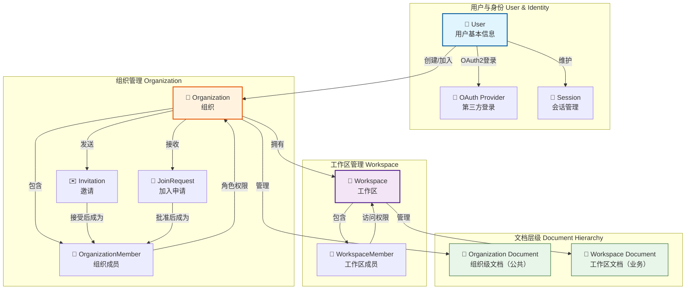
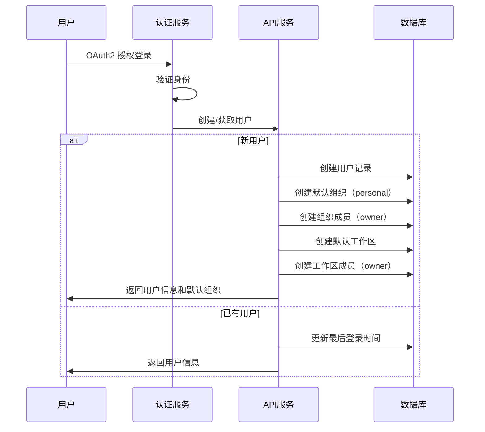
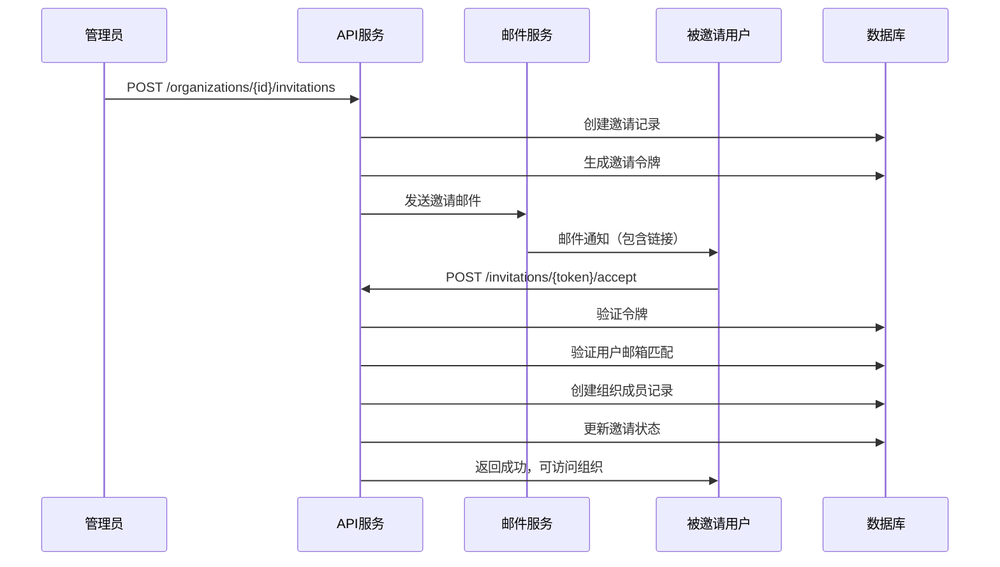
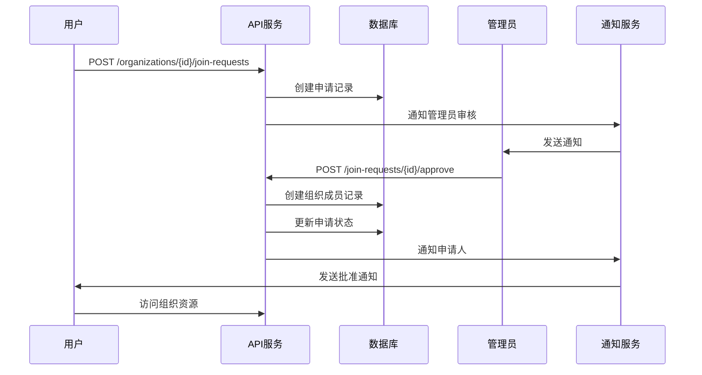
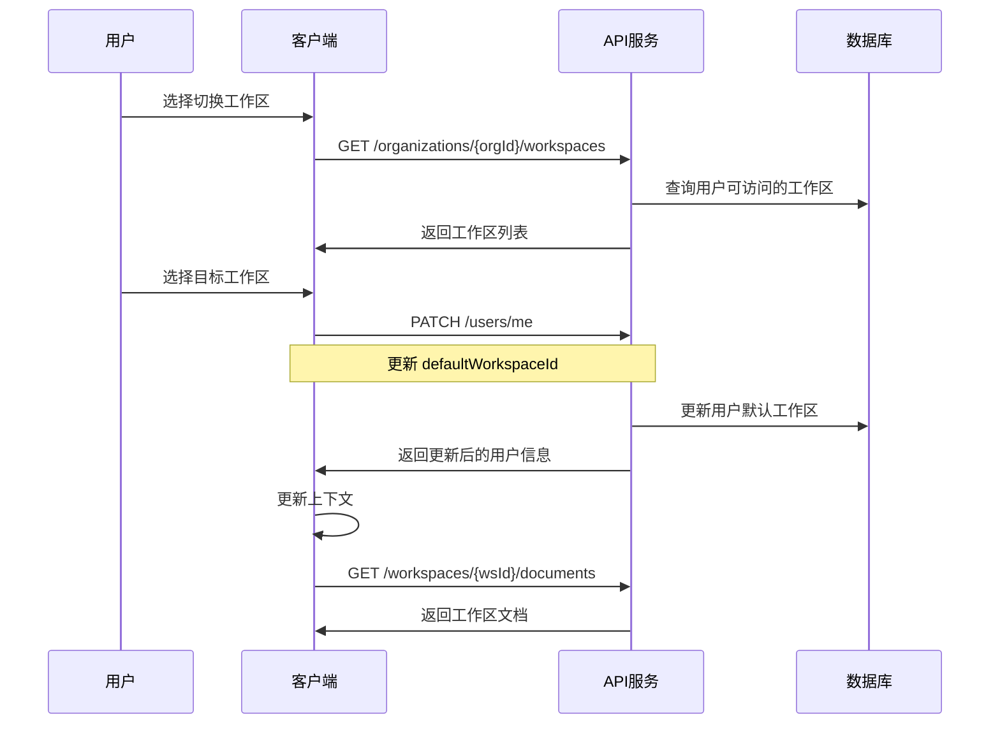

# 用户模型与组织工作区管理设计

## 背景与目标

### 业务需求
1. **用户注册与登录** - 支持 OAuth2 快速登录，用户可通过第三方身份提供商进行认证
2. **组织管理** - 用户注册后自动创建默认组织，支持用户加入多个组织
3. **工作区管理** - 每个组织默认包含一个工作区，支持创建多个工作区
4. **组织成员管理** - 支持通过邀请和申请两种方式加入组织
5. **文档隔离** - 文档分为组织级（公共）和工作区级（私有），大部分业务（如订货单、收货单、采购单等）在工作区内进行

### 设计目标
- 基于现有的 Document 抽象模型，扩展多租户能力
- 生成 TypeSpec 格式的 API 设计
- 与现有认证授权体系整合
- 保持 API 设计的简洁性和一致性

## 核心概念架构



## 数据模型设计

### 1. 用户模型（User）

用户是系统中最基础的身份实体，支持多种登录方式。

| 字段名 | 类型 | 必填 | 说明 |
|--------|------|------|------|
| id | string | 是 | 用户唯一标识 |
| username | string | 否 | 用户名（可用于登录） |
| email | string | 是 | 邮箱地址（主要标识） |
| emailVerified | boolean | 否 | 邮箱是否已验证 |
| displayName | string | 否 | 显示名称 |
| avatarUrl | string | 否 | 头像URL |
| locale | string | 否 | 语言偏好（zh-CN, en-US等） |
| timezone | string | 否 | 时区 |
| status | enum | 是 | 用户状态（active, suspended, deleted） |
| defaultOrganizationId | string | 否 | 默认组织ID |
| defaultWorkspaceId | string | 否 | 当前活动工作区ID |
| createdAt | string | 是 | 创建时间（ISO 8601） |
| updatedAt | string | 是 | 更新时间（ISO 8601） |
| lastLoginAt | string | 否 | 最后登录时间 |

**OAuth2 关联信息**（独立存储）

| 字段名 | 类型 | 必填 | 说明 |
|--------|------|------|------|
| userId | string | 是 | 关联的用户ID |
| provider | string | 是 | 提供商（google, github, wechat等） |
| providerId | string | 是 | 提供商的用户ID |
| providerEmail | string | 否 | 提供商的邮箱 |
| accessToken | string | 否 | 访问令牌（加密存储） |
| refreshToken | string | 否 | 刷新令牌（加密存储） |
| expiresAt | string | 否 | 令牌过期时间 |
| linkedAt | string | 是 | 关联时间 |

### 2. 组织模型（Organization）

组织是用户协作的基本单元，每个用户注册后自动创建一个个人组织。

| 字段名 | 类型 | 必填 | 说明 |
|--------|------|------|------|
| id | string | 是 | 组织唯一标识 |
| name | string | 是 | 组织名称 |
| displayName | string | 否 | 显示名称 |
| slug | string | 是 | URL友好的唯一标识 |
| description | string | 否 | 组织描述 |
| logoUrl | string | 否 | 组织Logo |
| type | enum | 是 | 组织类型（personal, team, enterprise） |
| ownerId | string | 是 | 组织所有者用户ID |
| status | enum | 是 | 状态（active, suspended, archived） |
| settings | object | 否 | 组织设置（JSON对象） |
| memberCount | int32 | 否 | 成员数量 |
| workspaceCount | int32 | 否 | 工作区数量 |
| createdAt | string | 是 | 创建时间 |
| updatedAt | string | 是 | 更新时间 |

**组织设置示例结构**

| 设置项 | 类型 | 说明 |
|--------|------|------|
| allowPublicJoin | boolean | 是否允许公开加入 |
| requireApproval | boolean | 加入是否需要审批 |
| inviteExpireDays | int32 | 邀请链接有效期（天） |
| defaultRole | string | 新成员默认角色 |
| allowedDomains | string[] | 允许的邮箱域名白名单 |

### 3. 组织成员模型（OrganizationMember）

表示用户在组织中的成员关系和权限。

| 字段名 | 类型 | 必填 | 说明 |
|--------|------|------|------|
| id | string | 是 | 成员记录唯一标识 |
| organizationId | string | 是 | 所属组织ID |
| userId | string | 是 | 用户ID |
| role | enum | 是 | 角色（owner, admin, member, guest） |
| status | enum | 是 | 状态（active, suspended） |
| joinedAt | string | 是 | 加入时间 |
| invitedBy | string | 否 | 邀请人用户ID |
| approvedBy | string | 否 | 批准人用户ID |
| updatedAt | string | 是 | 更新时间 |

**角色权限说明**

| 角色 | 权限描述 |
|------|----------|
| owner | 组织拥有者，拥有所有权限，包括删除组织 |
| admin | 管理员，可管理成员、工作区、组织设置 |
| member | 普通成员，可访问被授权的工作区 |
| guest | 访客，仅能访问特定资源 |

### 4. 工作区模型（Workspace）

工作区是实际业务开展的容器，大部分文档操作在工作区内进行。

| 字段名 | 类型 | 必填 | 说明 |
|--------|------|------|------|
| id | string | 是 | 工作区唯一标识 |
| organizationId | string | 是 | 所属组织ID |
| name | string | 是 | 工作区名称 |
| slug | string | 是 | URL友好标识（组织内唯一） |
| description | string | 否 | 工作区描述 |
| icon | string | 否 | 工作区图标 |
| color | string | 否 | 主题颜色 |
| isDefault | boolean | 是 | 是否为默认工作区 |
| visibility | enum | 是 | 可见性（public, private） |
| ownerId | string | 是 | 工作区负责人 |
| settings | object | 否 | 工作区设置 |
| memberCount | int32 | 否 | 成员数量 |
| documentCount | int32 | 否 | 文档数量 |
| createdAt | string | 是 | 创建时间 |
| updatedAt | string | 是 | 更新时间 |
| archivedAt | string | 否 | 归档时间 |

### 5. 工作区成员模型（WorkspaceMember）

表示用户在特定工作区中的访问权限。

| 字段名 | 类型 | 必填 | 说明 |
|--------|------|------|------|
| id | string | 是 | 成员记录唯一标识 |
| workspaceId | string | 是 | 工作区ID |
| userId | string | 是 | 用户ID |
| role | enum | 是 | 角色（owner, editor, viewer） |
| status | enum | 是 | 状态（active, suspended） |
| joinedAt | string | 是 | 加入时间 |
| addedBy | string | 否 | 添加者用户ID |

**工作区角色权限**

| 角色 | 权限描述 |
|------|----------|
| owner | 工作区负责人，可管理工作区和成员 |
| editor | 编辑者，可创建和编辑文档 |
| viewer | 查看者，只读权限 |

### 6. 邀请模型（Invitation）

用于邀请用户加入组织。

| 字段名 | 类型 | 必填 | 说明 |
|--------|------|------|------|
| id | string | 是 | 邀请唯一标识 |
| organizationId | string | 是 | 目标组织ID |
| email | string | 是 | 被邀请人邮箱 |
| inviterUserId | string | 是 | 邀请人用户ID |
| role | enum | 是 | 邀请角色 |
| token | string | 是 | 邀请令牌（用于链接） |
| message | string | 否 | 邀请留言 |
| status | enum | 是 | 状态（pending, accepted, expired, revoked） |
| expiresAt | string | 是 | 过期时间 |
| acceptedAt | string | 否 | 接受时间 |
| acceptedByUserId | string | 否 | 接受者用户ID |
| createdAt | string | 是 | 创建时间 |

### 7. 加入申请模型（JoinRequest）

用户申请加入组织的记录。

| 字段名 | 类型 | 必填 | 说明 |
|--------|------|------|------|
| id | string | 是 | 申请唯一标识 |
| organizationId | string | 是 | 目标组织ID |
| userId | string | 是 | 申请人用户ID |
| message | string | 否 | 申请说明 |
| status | enum | 是 | 状态（pending, approved, rejected, cancelled） |
| reviewedBy | string | 否 | 审核人用户ID |
| reviewNote | string | 否 | 审核备注 |
| createdAt | string | 是 | 创建时间 |
| reviewedAt | string | 否 | 审核时间 |

## 文档访问控制模型

### 文档层级划分

**组织级文档（Organization Document）**
- 路径格式：`/org/{organizationId}/doc/{docType}/{docId}`
- 适用场景：公司政策、通用模板、公告等组织内所有成员可见的文档
- 权限：组织成员自动拥有访问权限（基于组织角色）

**工作区级文档（Workspace Document）**
- 路径格式：`/org/{organizationId}/workspace/{workspaceId}/doc/{docType}/{docId}`
- 适用场景：订货单、收货单、采购单、项目管理等具体业务文档
- 权限：需要是工作区成员才能访问（基于工作区角色）

### 权限矩阵

| 操作 | organization.owner | organization.admin | organization.member | workspace.owner | workspace.editor | workspace.viewer |
|------|-------------------|-------------------|---------------------|----------------|-----------------|-----------------|
| 查看组织文档 | ✓ | ✓ | ✓ | - | - | - |
| 编辑组织文档 | ✓ | ✓ | × | - | - | - |
| 查看工作区文档 | - | - | - | ✓ | ✓ | ✓ |
| 编辑工作区文档 | - | - | - | ✓ | ✓ | × |
| 管理工作区成员 | - | - | - | ✓ | × | × |
| 创建工作区 | ✓ | ✓ | × | - | - | - |
| 管理组织成员 | ✓ | ✓ | × | - | - | - |

## API 接口设计

### 1. 用户相关接口

#### 1.1 获取当前用户信息
```
GET /api/v1/users/me
```

**响应**
- 返回当前登录用户的完整信息，包括默认组织和工作区

#### 1.2 更新用户信息
```
PATCH /api/v1/users/me
```

**请求体**
- displayName: 显示名称
- avatarUrl: 头像URL
- locale: 语言偏好
- timezone: 时区
- defaultOrganizationId: 默认组织ID
- defaultWorkspaceId: 默认工作区ID

#### 1.3 绑定 OAuth 提供商
```
POST /api/v1/users/me/oauth/{provider}
```

**路径参数**
- provider: 提供商名称（google, github, wechat等）

**请求体**
- authorizationCode: OAuth 授权码

#### 1.4 解绑 OAuth 提供商
```
DELETE /api/v1/users/me/oauth/{provider}
```

#### 1.5 列出用户加入的组织
```
GET /api/v1/users/me/organizations?page=1&pageSize=20
```

**响应**
- 返回用户作为成员的所有组织列表，包含角色信息

### 2. 组织相关接口

#### 2.1 创建组织
```
POST /api/v1/organizations
```

**请求体**
- name: 组织名称（必填）
- slug: URL标识（必填，全局唯一）
- displayName: 显示名称
- description: 组织描述
- type: 组织类型（team, enterprise）
- settings: 组织设置

**业务逻辑**
- 创建者自动成为 owner
- 自动创建一个默认工作区

#### 2.2 获取组织详情
```
GET /api/v1/organizations/{organizationId}
```

**响应**
- 组织基本信息
- 当前用户在该组织的角色
- 成员数量、工作区数量等统计信息

#### 2.3 更新组织信息
```
PATCH /api/v1/organizations/{organizationId}
```

**权限要求**
- owner 或 admin

**请求体**
- name: 组织名称
- displayName: 显示名称
- description: 描述
- logoUrl: Logo
- settings: 设置

#### 2.4 删除组织
```
DELETE /api/v1/organizations/{organizationId}
```

**权限要求**
- 仅 owner

**业务逻辑**
- 软删除（标记为 archived）
- 需要确认操作（防止误删）

#### 2.5 列出组织成员
```
GET /api/v1/organizations/{organizationId}/members?page=1&pageSize=20&role=admin
```

**查询参数**
- role: 按角色过滤
- status: 按状态过滤
- search: 搜索成员（名称、邮箱）

#### 2.6 添加组织成员（直接添加）
```
POST /api/v1/organizations/{organizationId}/members
```

**权限要求**
- owner 或 admin

**请求体**
- userId: 用户ID（必填）
- role: 角色（默认 member）

#### 2.7 更新成员角色
```
PATCH /api/v1/organizations/{organizationId}/members/{memberId}
```

**权限要求**
- owner 或 admin

**请求体**
- role: 新角色
- status: 状态（active, suspended）

#### 2.8 移除组织成员
```
DELETE /api/v1/organizations/{organizationId}/members/{memberId}
```

**权限要求**
- owner 或 admin（不能移除 owner）

#### 2.9 离开组织（用户主动）
```
POST /api/v1/organizations/{organizationId}/leave
```

**业务逻辑**
- owner 不能离开（需先转让所有权）

### 3. 邀请相关接口

#### 3.1 创建邀请
```
POST /api/v1/organizations/{organizationId}/invitations
```

**权限要求**
- owner 或 admin

**请求体**
- email: 被邀请人邮箱（必填）
- role: 邀请角色（默认 member）
- message: 邀请留言
- expiresInDays: 有效期（天数，默认7天）

**业务逻辑**
- 生成唯一邀请令牌
- 发送邀请邮件

#### 3.2 列出组织邀请
```
GET /api/v1/organizations/{organizationId}/invitations?status=pending
```

**查询参数**
- status: 邀请状态

#### 3.3 撤销邀请
```
DELETE /api/v1/organizations/{organizationId}/invitations/{invitationId}
```

**权限要求**
- owner 或 admin 或邀请创建者

#### 3.4 接受邀请
```
POST /api/v1/invitations/{token}/accept
```

**业务逻辑**
- 验证令牌有效性
- 验证邮箱匹配（当前用户邮箱需与邀请邮箱一致）
- 创建组织成员记录
- 更新邀请状态为 accepted

#### 3.5 拒绝邀请
```
POST /api/v1/invitations/{token}/decline
```

### 4. 加入申请相关接口

#### 4.1 申请加入组织
```
POST /api/v1/organizations/{organizationId}/join-requests
```

**请求体**
- message: 申请说明

**前置条件**
- 用户未加入该组织
- 组织允许申请加入

#### 4.2 列出加入申请
```
GET /api/v1/organizations/{organizationId}/join-requests?status=pending
```

**权限要求**
- owner 或 admin

**查询参数**
- status: 申请状态

#### 4.3 批准加入申请
```
POST /api/v1/organizations/{organizationId}/join-requests/{requestId}/approve
```

**权限要求**
- owner 或 admin

**请求体**
- role: 授予的角色（默认使用组织默认角色）
- reviewNote: 审核备注

**业务逻辑**
- 创建组织成员记录
- 更新申请状态为 approved
- 发送通知给申请人

#### 4.4 拒绝加入申请
```
POST /api/v1/organizations/{organizationId}/join-requests/{requestId}/reject
```

**权限要求**
- owner 或 admin

**请求体**
- reviewNote: 拒绝原因

#### 4.5 取消加入申请（用户主动）
```
DELETE /api/v1/organizations/{organizationId}/join-requests/{requestId}
```

**权限要求**
- 申请创建者本人

### 5. 工作区相关接口

#### 5.1 创建工作区
```
POST /api/v1/organizations/{organizationId}/workspaces
```

**权限要求**
- organization.owner 或 organization.admin

**请求体**
- name: 工作区名称（必填）
- slug: URL标识（组织内唯一，必填）
- description: 描述
- icon: 图标
- color: 颜色
- visibility: 可见性（public, private，默认 private）

**业务逻辑**
- 创建者自动成为工作区 owner

#### 5.2 列出组织的工作区
```
GET /api/v1/organizations/{organizationId}/workspaces?page=1&pageSize=20
```

**查询参数**
- visibility: 过滤可见性
- archived: 是否包含归档的工作区

**响应**
- 仅返回用户有权限访问的工作区

#### 5.3 获取工作区详情
```
GET /api/v1/organizations/{organizationId}/workspaces/{workspaceId}
```

**权限要求**
- 工作区成员

#### 5.4 更新工作区信息
```
PATCH /api/v1/organizations/{organizationId}/workspaces/{workspaceId}
```

**权限要求**
- workspace.owner

**请求体**
- name: 工作区名称
- description: 描述
- icon: 图标
- color: 颜色
- visibility: 可见性

#### 5.5 归档工作区
```
POST /api/v1/organizations/{organizationId}/workspaces/{workspaceId}/archive
```

**权限要求**
- workspace.owner 或 organization.owner/admin

#### 5.6 删除工作区
```
DELETE /api/v1/organizations/{organizationId}/workspaces/{workspaceId}
```

**权限要求**
- workspace.owner 或 organization.owner

**业务逻辑**
- 软删除
- 需要确认操作

#### 5.7 列出工作区成员
```
GET /api/v1/organizations/{organizationId}/workspaces/{workspaceId}/members
```

**权限要求**
- 工作区成员

#### 5.8 添加工作区成员
```
POST /api/v1/organizations/{organizationId}/workspaces/{workspaceId}/members
```

**权限要求**
- workspace.owner

**请求体**
- userId: 用户ID（必填，必须是组织成员）
- role: 角色（owner, editor, viewer，默认 editor）

#### 5.9 更新工作区成员角色
```
PATCH /api/v1/organizations/{organizationId}/workspaces/{workspaceId}/members/{memberId}
```

**权限要求**
- workspace.owner

**请求体**
- role: 新角色
- status: 状态

#### 5.10 移除工作区成员
```
DELETE /api/v1/organizations/{organizationId}/workspaces/{workspaceId}/members/{memberId}
```

**权限要求**
- workspace.owner

### 6. 文档访问接口（扩展）

#### 6.1 组织级文档聚合查询
```
GET /api/v1/organizations/{organizationId}/doc/{docType}/{docId}?include=metadata,views,data
```

**权限要求**
- 组织成员

**说明**
- 复用现有 Document 模型的聚合查询能力
- 通过 organizationId 限定文档所属范围

#### 6.2 工作区级文档聚合查询
```
GET /api/v1/organizations/{organizationId}/workspaces/{workspaceId}/doc/{docType}/{docId}?include=metadata,views,data
```

**权限要求**
- 工作区成员

**说明**
- 复用现有 Document 模型的聚合查询能力
- 通过 organizationId + workspaceId 限定文档所属范围

#### 6.3 列出组织文档
```
GET /api/v1/organizations/{organizationId}/documents?docType=policy&page=1&pageSize=20
```

**查询参数**
- docType: 文档类型过滤
- search: 搜索关键词
- createdBy: 创建者过滤
- sort: 排序（createdAt, updatedAt, name）

#### 6.4 列出工作区文档
```
GET /api/v1/organizations/{organizationId}/workspaces/{workspaceId}/documents?docType=purchaseOrder&page=1&pageSize=20
```

**查询参数**
- 同上

#### 6.5 创建组织文档
```
POST /api/v1/organizations/{organizationId}/doc/{docType}
```

**权限要求**
- organization.admin 或 organization.owner

**请求体**
- 复用现有 Document 创建接口的请求体结构

#### 6.6 创建工作区文档
```
POST /api/v1/organizations/{organizationId}/workspaces/{workspaceId}/doc/{docType}
```

**权限要求**
- workspace.editor 或 workspace.owner

**请求体**
- 复用现有 Document 创建接口的请求体结构

**业务逻辑**
- 文档自动关联到指定工作区
- 继承工作区的访问控制

## 用户工作流程

### 用户注册流程



### 邀请加入组织流程



### 申请加入组织流程



### 切换工作区流程



## TypeSpec 模型设计

### 命名空间结构

建议在现有的 TypeSpec 项目中新增 `tenant` 命名空间（已存在空目录）：

```
api/
├── tenant/
│   ├── index.tsp          # 导出所有子模块
│   ├── models.tsp         # 用户、组织、工作区等模型定义
│   ├── users.tsp          # 用户相关接口
│   ├── organizations.tsp  # 组织相关接口
│   ├── workspaces.tsp     # 工作区相关接口
│   └── invitations.tsp    # 邀请和申请相关接口
```

### 核心模型定义（models.tsp）

#### 用户状态枚举
```
enum UserStatus {
  active,      // 活跃
  suspended,   // 暂停
  deleted,     // 已删除
}
```

#### 用户模型
```
model User {
  id: string;
  username?: string;
  email: string;
  emailVerified?: boolean;
  displayName?: string;
  avatarUrl?: string;
  locale?: string;
  timezone?: string;
  status: UserStatus;
  defaultOrganizationId?: string;
  defaultWorkspaceId?: string;
  createdAt: string;
  updatedAt: string;
  lastLoginAt?: string;
}
```

#### OAuth 提供商枚举
```
enum OAuthProvider {
  google,
  github,
  wechat,
  dingtalk,
  feishu,
}
```

#### OAuth 连接模型
```
model OAuthConnection {
  userId: string;
  provider: OAuthProvider;
  providerId: string;
  providerEmail?: string;
  linkedAt: string;
}
```

#### 组织类型枚举
```
enum OrganizationType {
  personal,    // 个人组织
  team,        // 团队
  enterprise,  // 企业
}
```

#### 组织状态枚举
```
enum OrganizationStatus {
  active,
  suspended,
  archived,
}
```

#### 组织模型
```
model Organization {
  id: string;
  name: string;
  displayName?: string;
  slug: string;
  description?: string;
  logoUrl?: string;
  type: OrganizationType;
  ownerId: string;
  status: OrganizationStatus;
  settings?: OrganizationSettings;
  memberCount?: int32;
  workspaceCount?: int32;
  createdAt: string;
  updatedAt: string;
}
```

#### 组织设置模型
```
model OrganizationSettings {
  allowPublicJoin?: boolean;
  requireApproval?: boolean;
  inviteExpireDays?: int32;
  defaultRole?: OrganizationRole;
  allowedDomains?: string[];
}
```

#### 组织角色枚举
```
enum OrganizationRole {
  owner,
  admin,
  member,
  guest,
}
```

#### 组织成员状态枚举
```
enum MemberStatus {
  active,
  suspended,
}
```

#### 组织成员模型
```
model OrganizationMember {
  id: string;
  organizationId: string;
  userId: string;
  user?: User;  // 关联用户信息（可选包含）
  role: OrganizationRole;
  status: MemberStatus;
  joinedAt: string;
  invitedBy?: string;
  approvedBy?: string;
  updatedAt: string;
}
```

#### 工作区可见性枚举
```
enum WorkspaceVisibility {
  public,   // 组织内所有成员可见
  private,  // 仅成员可见
}
```

#### 工作区模型
```
model Workspace {
  id: string;
  organizationId: string;
  name: string;
  slug: string;
  description?: string;
  icon?: string;
  color?: string;
  isDefault: boolean;
  visibility: WorkspaceVisibility;
  ownerId: string;
  settings?: {};  // 扩展设置
  memberCount?: int32;
  documentCount?: int32;
  createdAt: string;
  updatedAt: string;
  archivedAt?: string;
}
```

#### 工作区角色枚举
```
enum WorkspaceRole {
  owner,
  editor,
  viewer,
}
```

#### 工作区成员模型
```
model WorkspaceMember {
  id: string;
  workspaceId: string;
  userId: string;
  user?: User;
  role: WorkspaceRole;
  status: MemberStatus;
  joinedAt: string;
  addedBy?: string;
}
```

#### 邀请状态枚举
```
enum InvitationStatus {
  pending,
  accepted,
  expired,
  revoked,
}
```

#### 邀请模型
```
model Invitation {
  id: string;
  organizationId: string;
  email: string;
  inviterUserId: string;
  inviter?: User;
  role: OrganizationRole;
  token: string;
  message?: string;
  status: InvitationStatus;
  expiresAt: string;
  acceptedAt?: string;
  acceptedByUserId?: string;
  createdAt: string;
}
```

#### 加入申请状态枚举
```
enum JoinRequestStatus {
  pending,
  approved,
  rejected,
  cancelled,
}
```

#### 加入申请模型
```
model JoinRequest {
  id: string;
  organizationId: string;
  userId: string;
  user?: User;
  message?: string;
  status: JoinRequestStatus;
  reviewedBy?: string;
  reviewer?: User;
  reviewNote?: string;
  createdAt: string;
  reviewedAt?: string;
}
```

### 接口定义示例（organizations.tsp）

#### 创建组织请求
```
model CreateOrganizationRequest {
  name: string;
  slug: string;
  displayName?: string;
  description?: string;
  type: OrganizationType;
  settings?: OrganizationSettings;
}
```

#### 更新组织请求
```
model UpdateOrganizationRequest {
  name?: string;
  displayName?: string;
  description?: string;
  logoUrl?: string;
  settings?: OrganizationSettings;
}
```

#### 组织详情响应
```
model OrganizationDetail extends Organization {
  currentUserRole?: OrganizationRole;  // 当前用户的角色
  owner?: User;  // 所有者信息
}
```

#### 组织 API 接口定义
```
@tag("Organizations")
@route("/api/v1/organizations")
interface OrganizationApi {
  // 创建组织
  @post
  @summary("创建组织")
  create(@body request: CreateOrganizationRequest): 
    NexusBook.Common.ApiResponse<Organization>;
  
  // 获取组织详情
  @get
  @route("/{organizationId}")
  @summary("获取组织详情")
  get(@path organizationId: string): 
    NexusBook.Common.ApiResponse<OrganizationDetail>;
  
  // 更新组织
  @patch
  @route("/{organizationId}")
  @summary("更新组织")
  update(
    @path organizationId: string,
    @body request: UpdateOrganizationRequest
  ): NexusBook.Common.ApiResponse<Organization>;
  
  // 列出组织成员
  @get
  @route("/{organizationId}/members")
  @summary("列出组织成员")
  listMembers(
    @path organizationId: string,
    @query page?: int32,
    @query pageSize?: int32,
    @query role?: OrganizationRole,
    @query search?: string
  ): NexusBook.Common.ApiResponse<NexusBook.Common.Page<OrganizationMember>>;
  
  // ... 其他接口
}
```

## 与现有系统的整合方案

### 1. 认证流程整合

**现有认证**（`/auth/token`）
- 返回 JWT access_token
- 包含 sub（用户ID）、roles、tenants 等声明

**整合方式**
- 在 `UserInfo` 模型中已包含 `tenants` 字段
- JWT 令牌中应包含：
  - `sub`: 用户ID
  - `org`: 当前组织ID
  - `workspace`: 当前工作区ID（可选）
  - `org_role`: 组织角色
  - `ws_role`: 工作区角色（如适用）

**建议的令牌声明结构**
```
{
  "sub": "user-123",
  "email": "user@example.com",
  "org": "org-456",
  "workspace": "ws-789",
  "org_role": "admin",
  "ws_role": "editor",
  "scope": "doc:read doc:write data:read data:write",
  "iat": 1234567890,
  "exp": 1234571490
}
```

### 2. 文档模型整合

**现有路径**
```
/api/v1/doc/{docType}/{docId}
```

**新增路径**
```
# 组织级文档
/api/v1/organizations/{organizationId}/doc/{docType}/{docId}

# 工作区级文档
/api/v1/organizations/{organizationId}/workspaces/{workspaceId}/doc/{docType}/{docId}
```

**整合策略**
- 保留现有 `/doc/{docType}/{docId}` 路径用于向后兼容
- 新路径通过中间件自动注入组织和工作区上下文
- Document 模型扩展字段：
  - `organizationId`: 所属组织
  - `workspaceId`: 所属工作区（可选，为空表示组织级）
  - `scope`: 文档作用域（organization, workspace）

**DocumentProperties 扩展**
```
model DocumentProperties {
  // ... 现有字段
  organizationId?: string;  // 所属组织
  workspaceId?: string;     // 所属工作区（可选）
  scope?: DocumentScope;    // 文档作用域
}
```

**DocumentScope 枚举**
```
enum DocumentScope {
  organization,  // 组织级（公共）
  workspace,     // 工作区级（业务）
}
```

### 3. 权限检查中间件

**组织权限检查**
- 检查用户是否为组织成员
- 检查用户组织角色是否满足要求

**工作区权限检查**
- 检查用户是否为工作区成员
- 检查用户工作区角色是否满足要求

**文档访问权限检查**
- 组织级文档：检查组织成员身份
- 工作区级文档：检查工作区成员身份
- 基于角色控制读写权限

### 4. 错误码扩展

在 `NexusBook.Common.ErrorCode` 中新增：

```
enum ErrorCode {
  // ... 现有错误码
  
  // 用户相关
  USER_NOT_FOUND,
  USER_ALREADY_EXISTS,
  EMAIL_ALREADY_USED,
  OAUTH_PROVIDER_NOT_SUPPORTED,
  
  // 组织相关
  ORG_NOT_FOUND,
  ORG_SLUG_ALREADY_EXISTS,
  ORG_PERMISSION_DENIED,
  ORG_ALREADY_MEMBER,
  ORG_NOT_MEMBER,
  ORG_CANNOT_LEAVE_AS_OWNER,
  
  // 工作区相关
  WORKSPACE_NOT_FOUND,
  WORKSPACE_SLUG_ALREADY_EXISTS,
  WORKSPACE_PERMISSION_DENIED,
  WORKSPACE_NOT_MEMBER,
  
  // 邀请相关
  INVITATION_NOT_FOUND,
  INVITATION_EXPIRED,
  INVITATION_ALREADY_ACCEPTED,
  INVITATION_EMAIL_MISMATCH,
  
  // 申请相关
  JOIN_REQUEST_NOT_FOUND,
  JOIN_REQUEST_ALREADY_EXISTS,
  JOIN_REQUEST_ALREADY_PROCESSED,
}
```

## 数据库设计建议

### 表结构

虽然本设计仅定义 API 接口，但为实施者提供参考的表结构：

**users 表**
- 主键：id
- 唯一索引：email
- 索引：status, createdAt

**oauth_connections 表**
- 主键：(userId, provider)
- 索引：provider, providerId

**organizations 表**
- 主键：id
- 唯一索引：slug
- 索引：ownerId, type, status, createdAt

**organization_members 表**
- 主键：id
- 唯一索引：(organizationId, userId)
- 索引：userId, role, status

**workspaces 表**
- 主键：id
- 唯一索引：(organizationId, slug)
- 索引：organizationId, ownerId, isDefault

**workspace_members 表**
- 主键：id
- 唯一索引：(workspaceId, userId)
- 索引：userId, role

**invitations 表**
- 主键：id
- 唯一索引：token
- 索引：organizationId, email, status, expiresAt

**join_requests 表**
- 主键：id
- 唯一索引：(organizationId, userId)（状态为 pending 时）
- 索引：organizationId, userId, status

### 级联删除策略

- 删除用户：软删除，保留关联记录
- 删除组织：软删除（archived），级联归档工作区和文档
- 删除工作区：软删除，级联归档文档
- 移除组织成员：级联移除其在组织所有工作区的成员身份

## 实施优先级建议

### 第一阶段：核心用户和组织管理
1. 用户模型和认证整合
2. 组织创建和基本管理
3. 组织成员管理（添加、移除、角色）
4. 默认工作区自动创建

### 第二阶段：工作区管理
1. 工作区创建、编辑、删除
2. 工作区成员管理
3. 工作区切换功能
4. 文档路径整合（组织级、工作区级）

### 第三阶段：邀请和申请流程
1. 邀请功能（创建、接受、撤销）
2. 邀请邮件通知
3. 加入申请（提交、审批、拒绝）
4. 通知系统整合

### 第四阶段：权限和安全增强
1. 细粒度权限控制
2. 审计日志
3. 组织和工作区设置完善
4. 数据隔离验证

## 安全考虑

### 1. 数据隔离
- 所有查询必须包含组织或工作区过滤条件
- 中间件层面强制校验用户访问权限
- 防止跨组织/工作区的数据泄露

### 2. 令牌安全
- 邀请令牌使用加密随机字符串（至少 32 字节）
- 设置合理的过期时间（默认 7 天）
- 一次性使用（接受后失效）

### 3. 角色权限校验
- 每个操作都需明确的权限要求
- 防止权限提升攻击
- owner 角色不可直接移除（需转让）

### 4. 输入验证
- slug 格式验证（仅允许小写字母、数字、连字符）
- 邮箱格式验证
- 防止 SQL 注入和 XSS

### 5. 速率限制
- 邀请创建频率限制（防止滥用）
- 加入申请频率限制
- API 调用总体速率限制

## 监控和可观测性

### 关键指标
- 用户注册数量和趋势
- 组织创建数量
- 工作区创建数量
- 平均每组织成员数
- 邀请接受率
- 申请批准率
- API 响应时间（按端点）

### 审计事件
- 用户注册和登录
- 组织创建、更新、删除
- 成员添加、移除、角色变更
- 工作区创建、归档、删除
- 邀请发送和接受
- 申请提交和审批

## 未来扩展方向

### 1. 高级权限管理
- 自定义角色和权限
- 基于资源的细粒度权限（RBAC/ABAC）
- 权限模板

### 2. 单点登录（SSO）
- SAML 2.0 支持
- LDAP/AD 集成
- 企业身份提供商集成

### 3. 团队管理
- 团队（Team）作为组织内的子单位
- 团队级别的权限管理
- 跨团队协作

### 4. 文档共享
- 外部用户只读共享
- 公开链接分享
- 嵌入式访问

### 5. 多语言支持
- 组织和工作区界面语言设置
- 邀请邮件多语言
- 错误消息本地化增强
