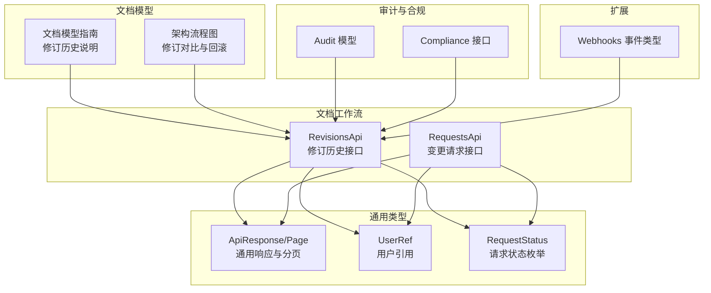
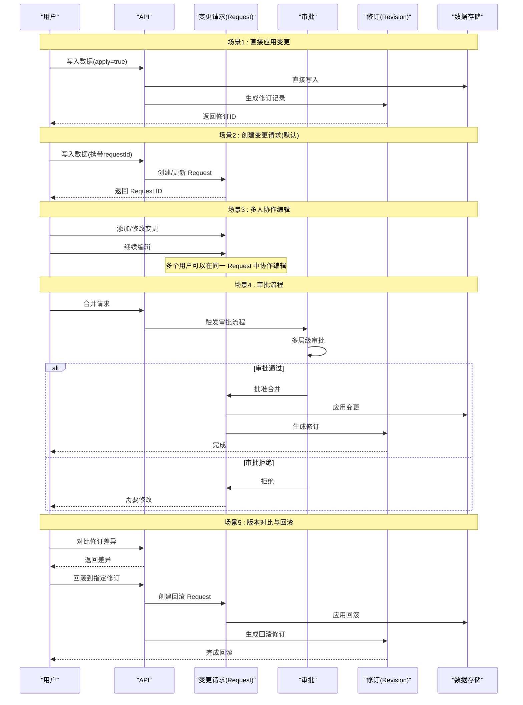
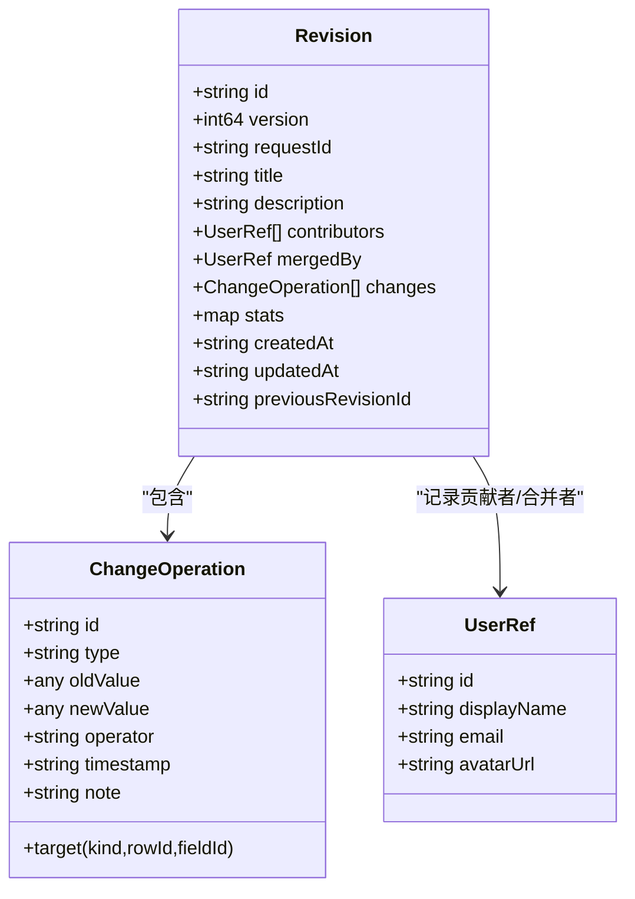
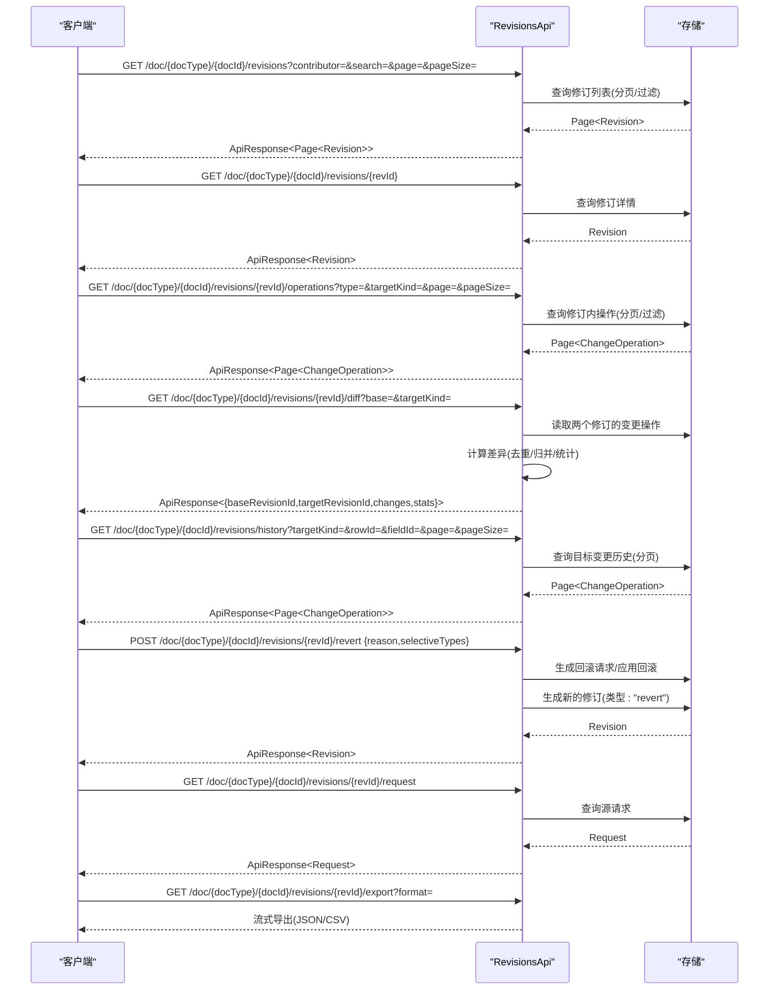
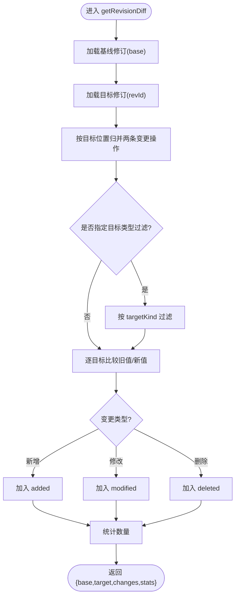
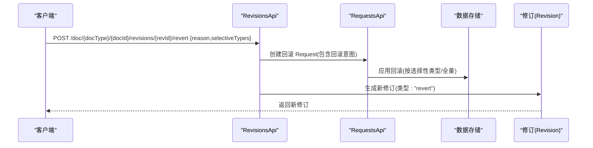
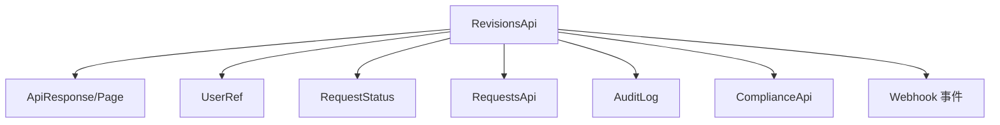

# 修订历史

<cite>
**本文引用的文件**
- [revisions.tsp](file://api/document/workflow/revisions.tsp)
- [requests.tsp](file://api/document/workflow/requests.tsp)
- [common.tsp](file://api/shared/common.tsp)
- [constants.tsp](file://api/shared/constants.tsp)
- [document-model.md](file://docs-src/guides/document-model.md)
- [architecture.md](file://docs-src/guides/architecture.md)
- [models.tsp](file://api/audit/models.tsp)
- [compliance.tsp](file://api/audit/compliance.tsp)
- [models.tsp](file://api/extensions/webhooks/models.tsp)
</cite>

## 目录
1. [简介](#简介)
2. [项目结构](#项目结构)
3. [核心组件](#核心组件)
4. [架构总览](#架构总览)
5. [详细组件分析](#详细组件分析)
6. [依赖分析](#依赖分析)
7. [性能考量](#性能考量)
8. [故障排查指南](#故障排查指南)
9. [结论](#结论)
10. [附录](#附录)

## 简介
本章节面向希望理解并使用修订历史能力的开发者与运维人员，围绕 Revision 模型、变更操作 ChangeOperation、RevisionsApi 接口族，以及与变更请求（Request）的关联关系展开。重点覆盖：
- Revision 与 Request 的生成与关联
- 多人贡献者追踪与变更操作集合
- 列表/详情/对比/回滚等 API 的行为与参数
- getRevisionDiff 如何计算两个修订之间的差异
- revertRevision 如何安全回滚并生成新的修订记录
- 分页查询、变更历史追踪与数据导出
- 版本控制系统如何确保完整的审计追踪
- 性能优化建议（分页与过滤）

## 项目结构
修订历史能力位于文档工作流模块，核心文件如下：
- Revisions API 定义：api/document/workflow/revisions.tsp
- 变更请求（Request）定义：api/document/workflow/requests.tsp
- 通用模型与分页/Page 定义：api/shared/common.tsp
- 请求状态枚举：api/shared/constants.tsp
- 文档模型与修订历史说明：docs-src/guides/document-model.md
- 架构流程图（含修订对比与回滚）：docs-src/guides/architecture.md
- 审计与合规模型：api/audit/models.tsp
- 合规性报告接口：api/audit/compliance.tsp
- Webhook 事件类型（含修订相关事件）：api/extensions/webhooks/models.tsp

图表来源
- [revisions.tsp](file://api/document/workflow/revisions.tsp#L316-L547)
- [requests.tsp](file://api/document/workflow/requests.tsp#L202-L391)
- [common.tsp](file://api/shared/common.tsp#L153-L203)
- [constants.tsp](file://api/shared/constants.tsp#L9-L31)
- [document-model.md](file://docs-src/guides/document-model.md#L459-L553)
- [architecture.md](file://docs-src/guides/architecture.md#L254-L304)
- [models.tsp](file://api/audit/models.tsp#L1-L120)
- [compliance.tsp](file://api/audit/compliance.tsp#L1-L111)
- [models.tsp](file://api/extensions/webhooks/models.tsp#L89-L135)

章节来源
- [revisions.tsp](file://api/document/workflow/revisions.tsp#L316-L547)
- [requests.tsp](file://api/document/workflow/requests.tsp#L202-L391)
- [common.tsp](file://api/shared/common.tsp#L153-L203)
- [constants.tsp](file://api/shared/constants.tsp#L9-L31)
- [document-model.md](file://docs-src/guides/document-model.md#L459-L553)
- [architecture.md](file://docs-src/guides/architecture.md#L254-L304)
- [models.tsp](file://api/audit/models.tsp#L1-L120)
- [compliance.tsp](file://api/audit/compliance.tsp#L1-L111)
- [models.tsp](file://api/extensions/webhooks/models.tsp#L89-L135)

## 核心组件
- Revision（修订记录）
  - 唯一标识、版本号、源请求 ID、标题/描述、贡献者、合并者、变更操作集合、统计信息、创建/更新时间、前置修订 ID
  - 关键字段路径参考：[revisions.tsp](file://api/document/workflow/revisions.tsp#L158-L314)
- ChangeOperation（变更操作）
  - 操作 ID、类型、目标（kind/rowId/fieldId）、旧值/新值、操作人、时间戳、备注
  - 关键字段路径参考：[revisions.tsp](file://api/document/workflow/revisions.tsp#L51-L149)
- RevisionsApi（修订历史接口族）
  - 列表、详情、修订内操作列表、修订差异对比、特定目标变更历史、回滚到指定修订、获取源请求、导出修订
  - 关键接口路径参考：[revisions.tsp](file://api/document/workflow/revisions.tsp#L323-L547)
- Request（变更请求）
  - 状态、作者/评审人/贡献者、变更集、生成的修订 ID、创建/更新/合并时间/合并者
  - 关键字段路径参考：[requests.tsp](file://api/document/workflow/requests.tsp#L83-L200)
- 通用模型与分页
  - ApiResponse、Page、UserRef、RequestStatus
  - 关键定义路径参考：[common.tsp](file://api/shared/common.tsp#L153-L203)、[constants.tsp](file://api/shared/constants.tsp#L9-L31)

章节来源
- [revisions.tsp](file://api/document/workflow/revisions.tsp#L51-L314)
- [revisions.tsp](file://api/document/workflow/revisions.tsp#L323-L547)
- [requests.tsp](file://api/document/workflow/requests.tsp#L83-L200)
- [common.tsp](file://api/shared/common.tsp#L153-L203)
- [constants.tsp](file://api/shared/constants.tsp#L9-L31)

## 架构总览
修订历史贯穿“变更请求 -> 合并 -> 生成修订”的闭环，支持对比与回滚，配合审计与合规能力，形成完整的审计追踪。

图表来源
- [architecture.md](file://docs-src/guides/architecture.md#L254-L304)
- [requests.tsp](file://api/document/workflow/requests.tsp#L244-L347)
- [revisions.tsp](file://api/document/workflow/revisions.tsp#L323-L547)

章节来源
- [architecture.md](file://docs-src/guides/architecture.md#L254-L304)
- [requests.tsp](file://api/document/workflow/requests.tsp#L244-L347)
- [revisions.tsp](file://api/document/workflow/revisions.tsp#L323-L547)

## 详细组件分析

### Revision 模型与 ChangeOperation
- Revision
  - 由合并请求（Request）生成，包含变更操作集合与统计信息，记录贡献者与合并者，支持链式历史（previousRevisionId）
  - 关键字段路径参考：[revisions.tsp](file://api/document/workflow/revisions.tsp#L158-L314)
- ChangeOperation
  - 记录单次增删改操作，包含目标位置（kind/rowId/fieldId）、旧值/新值、操作人、时间戳、备注
  - 关键字段路径参考：[revisions.tsp](file://api/document/workflow/revisions.tsp#L51-L149)

图表来源
- [revisions.tsp](file://api/document/workflow/revisions.tsp#L51-L314)
- [common.tsp](file://api/shared/common.tsp#L451-L487)

章节来源
- [revisions.tsp](file://api/document/workflow/revisions.tsp#L51-L314)
- [common.tsp](file://api/shared/common.tsp#L451-L487)

### RevisionsApi 接口族
- listRevisions
  - 按时间逆序返回修订列表，支持分页与过滤（contributor/search）
  - 关键接口路径参考：[revisions.tsp](file://api/document/workflow/revisions.tsp#L346-L355)
- getRevision
  - 返回修订完整详情（包含所有操作与统计）
  - 关键接口路径参考：[revisions.tsp](file://api/document/workflow/revisions.tsp#L365-L372)
- listOperations
  - 分页返回修订内的变更操作，支持按操作类型与目标类型过滤
  - 关键接口路径参考：[revisions.tsp](file://api/document/workflow/revisions.tsp#L382-L393)
- getRevisionDiff
  - 对比两个修订之间的差异，支持按目标类型过滤
  - 关键接口路径参考：[revisions.tsp](file://api/document/workflow/revisions.tsp#L410-L447)
- queryChangeHistory
  - 查询特定目标（行/字段）在所有修订中的变更历史
  - 关键接口路径参考：[revisions.tsp](file://api/document/workflow/revisions.tsp#L463-L474)
- revertRevision
  - 回滚到指定修订，生成新的修订记录（类型为 "revert"），支持选择性回滚
  - 关键接口路径参考：[revisions.tsp](file://api/document/workflow/revisions.tsp#L487-L510)
- getSourceRequest
  - 获取生成该修订的原始合并请求
  - 关键接口路径参考：[revisions.tsp](file://api/document/workflow/revisions.tsp#L520-L527)
- exportRevision
  - 导出修订的完整数据为 JSON、CSV 等格式
  - 关键接口路径参考：[revisions.tsp](file://api/document/workflow/revisions.tsp#L537-L546)

图表来源
- [revisions.tsp](file://api/document/workflow/revisions.tsp#L346-L546)

章节来源
- [revisions.tsp](file://api/document/workflow/revisions.tsp#L346-L546)

### getRevisionDiff：差异计算流程
- 输入
  - 目标修订 revId、基线修订 base（可选，默认最新）
  - 目标类型过滤 targetKind（可选）
- 输出
  - baseRevisionId、targetRevisionId、变更操作集合 changes、统计信息 stats（added/modified/deleted）
- 计算思路（概念流程）
  - 读取目标修订与基线修订的变更操作集合
  - 按目标（kind/rowId/fieldId）归并两条历史
  - 对每个目标位置，比较新旧值，输出新增/修改/删除
  - 统计各类变更数量
  - 支持按目标类型过滤

图表来源
- [revisions.tsp](file://api/document/workflow/revisions.tsp#L410-L447)

章节来源
- [revisions.tsp](file://api/document/workflow/revisions.tsp#L410-L447)

### revertRevision：安全回滚与新修订生成
- 输入
  - reason（回滚原因，可选）
  - selectiveTypes（选择性回滚的变更类型集合，可选）
- 行为
  - 创建回滚变更请求（Request），将目标修订的状态应用到当前文档
  - 生成新的修订（类型为 "revert"），记录回滚原因、选择性回滚类型、回滚时间与回滚者
  - 该修订包含回滚操作的变更历史，便于审计
- 关键路径参考：[revisions.tsp](file://api/document/workflow/revisions.tsp#L487-L510)

图表来源
- [revisions.tsp](file://api/document/workflow/revisions.tsp#L487-L510)
- [requests.tsp](file://api/document/workflow/requests.tsp#L244-L347)

章节来源
- [revisions.tsp](file://api/document/workflow/revisions.tsp#L487-L510)
- [requests.tsp](file://api/document/workflow/requests.tsp#L244-L347)

### 与变更请求（Request）的关联
- 合并请求（Request）生成修订（Revision）
  - 合并时冻结请求中的所有变更，应用到文档，生成修订并记录贡献者与合并者
  - 关键说明路径参考：[requests.tsp](file://api/document/workflow/requests.tsp#L244-L280)
- Revision 的源请求 ID（requestId）
  - 关键字段路径参考：[revisions.tsp](file://api/document/workflow/revisions.tsp#L177-L184)
- 获取源请求
  - 关键接口路径参考：[revisions.tsp](file://api/document/workflow/revisions.tsp#L520-L527)

章节来源
- [requests.tsp](file://api/document/workflow/requests.tsp#L244-L280)
- [revisions.tsp](file://api/document/workflow/revisions.tsp#L177-L184)
- [revisions.tsp](file://api/document/workflow/revisions.tsp#L520-L527)

### 分页查询、变更历史追踪与数据导出
- 分页与过滤
  - listRevisions/listOperations/queryChangeHistory 支持 page/pageSize、contributor、search、type、targetKind 等参数
  - 关键接口路径参考：[revisions.tsp](file://api/document/workflow/revisions.tsp#L346-L393)
- 变更历史追踪
  - queryChangeHistory 支持按行/字段维度追踪变更历史
  - 关键接口路径参考：[revisions.tsp](file://api/document/workflow/revisions.tsp#L463-L474)
- 数据导出
  - exportRevision 支持导出修订的完整数据（JSON/CSV 等）
  - 关键接口路径参考：[revisions.tsp](file://api/document/workflow/revisions.tsp#L537-L546)

章节来源
- [revisions.tsp](file://api/document/workflow/revisions.tsp#L346-L393)
- [revisions.tsp](file://api/document/workflow/revisions.tsp#L463-L474)
- [revisions.tsp](file://api/document/workflow/revisions.tsp#L537-L546)

### 审计追踪与合规
- 审计日志模型（AuditLog）
  - 操作者、操作分类、资源、结果、变更详情、上下文、时间戳等
  - 关键模型路径参考：[models.tsp](file://api/audit/models.tsp#L155-L245)
- 合规性报告
  - 支持生成合规性报告、数据访问记录、数据保留策略等
  - 关键接口路径参考：[compliance.tsp](file://api/audit/compliance.tsp#L1-L111)
- Webhook 事件（修订相关）
  - revision.created、revision.reverted
  - 关键事件类型路径参考：[models.tsp](file://api/extensions/webhooks/models.tsp#L132-L135)

章节来源
- [models.tsp](file://api/audit/models.tsp#L155-L245)
- [compliance.tsp](file://api/audit/compliance.tsp#L1-L111)
- [models.tsp](file://api/extensions/webhooks/models.tsp#L132-L135)

## 依赖分析
- RevisionsApi 依赖
  - ApiResponse/Page：统一响应与分页
  - UserRef：贡献者与合并者引用
  - RequestStatus：与变更请求状态一致
- RevisionsApi 与 RequestsApi 的协作
  - 合并请求完成后生成修订，修订记录源请求 ID
- 审计与合规
  - 审计日志模型与合规接口可用于生成合规报告与访问记录

图表来源
- [revisions.tsp](file://api/document/workflow/revisions.tsp#L323-L547)
- [common.tsp](file://api/shared/common.tsp#L153-L203)
- [constants.tsp](file://api/shared/constants.tsp#L9-L31)
- [requests.tsp](file://api/document/workflow/requests.tsp#L202-L391)
- [models.tsp](file://api/audit/models.tsp#L155-L245)
- [compliance.tsp](file://api/audit/compliance.tsp#L1-L111)
- [models.tsp](file://api/extensions/webhooks/models.tsp#L132-L135)

章节来源
- [revisions.tsp](file://api/document/workflow/revisions.tsp#L323-L547)
- [common.tsp](file://api/shared/common.tsp#L153-L203)
- [constants.tsp](file://api/shared/constants.tsp#L9-L31)
- [requests.tsp](file://api/document/workflow/requests.tsp#L202-L391)
- [models.tsp](file://api/audit/models.tsp#L155-L245)
- [compliance.tsp](file://api/audit/compliance.tsp#L1-L111)
- [models.tsp](file://api/extensions/webhooks/models.tsp#L132-L135)

## 性能考量
- 分页与限制
  - 使用 page/pageSize 控制返回量，避免一次性拉取大量修订或操作
  - 在聚合查询中限制评论/修订数量，减少响应体积
  - 参考路径：[document-model.md](file://docs-src/guides/document-model.md#L976-L999)
- 过滤查询
  - 使用 contributor、search、type、targetKind 等参数缩小结果集
  - 参考路径：[revisions.tsp](file://api/document/workflow/revisions.tsp#L346-L393)
- 选择性回滚
  - revertRevision 支持 selectiveTypes，避免不必要的回滚范围
  - 参考路径：[revisions.tsp](file://api/document/workflow/revisions.tsp#L487-L510)
- 缓存策略
  - 元数据变化较少，可长期缓存；修订通常不可变，适合缓存
  - 参考路径：[document-model.md](file://docs-src/guides/document-model.md#L995-L999)

章节来源
- [document-model.md](file://docs-src/guides/document-model.md#L976-L999)
- [revisions.tsp](file://api/document/workflow/revisions.tsp#L346-L393)
- [revisions.tsp](file://api/document/workflow/revisions.tsp#L487-L510)

## 故障排查指南
- 常见错误码
  - REQUEST_NOT_FOUND、REQUEST_CONFLICT、REQUEST_ALREADY_CLOSED 等与请求相关错误
  - PAGE_OUT_OF_RANGE 等分页相关错误
  - 参考路径：[common.tsp](file://api/shared/common.tsp#L80-L151)
- 审批与合并异常
  - 合并请求冲突检测与关闭/重新打开
  - 参考路径：[requests.tsp](file://api/document/workflow/requests.tsp#L377-L390)
- 审计与合规
  - 合规性报告生成、数据访问记录查询、保留策略
  - 参考路径：[compliance.tsp](file://api/audit/compliance.tsp#L1-L111)

章节来源
- [common.tsp](file://api/shared/common.tsp#L80-L151)
- [requests.tsp](file://api/document/workflow/requests.tsp#L377-L390)
- [compliance.tsp](file://api/audit/compliance.tsp#L1-L111)

## 结论
修订历史通过 Revision 与 ChangeOperation 记录完整的变更轨迹，RevisionsApi 提供了从列表、详情、对比到回滚的全链路能力。与变更请求（Request）的紧密关联确保了“先请求、后合并、再生成修订”的审计闭环。配合审计日志、合规报告与 Webhook 事件，系统实现了可追溯、可审计、可联动的企业级版本控制与合规保障。通过合理的分页与过滤策略，可在大规模数据场景下保持良好的性能表现。

## 附录
- 示例端点与参数
  - 列表修订：GET /doc/{docType}/{docId}/revisions?contributor=&search=&page=&pageSize=
  - 修订详情：GET /doc/{docType}/{docId}/revisions/{revId}
  - 修订内操作：GET /doc/{docType}/{docId}/revisions/{revId}/operations?type=&targetKind=&page=&pageSize=
  - 对比差异：GET /doc/{docType}/{docId}/revisions/{revId}/diff?base=&targetKind=
  - 目标变更历史：GET /doc/{docType}/{docId}/revisions/history?targetKind=&rowId=&fieldId=&page=&pageSize=
  - 回滚修订：POST /doc/{docType}/{docId}/revisions/{revId}/revert {reason,selectiveTypes}
  - 源请求：GET /doc/{docType}/{docId}/revisions/{revId}/request
  - 导出修订：GET /doc/{docType}/{docId}/revisions/{revId}/export?format=
  - 参考路径：[revisions.tsp](file://api/document/workflow/revisions.tsp#L346-L546)

章节来源
- [revisions.tsp](file://api/document/workflow/revisions.tsp#L346-L546)