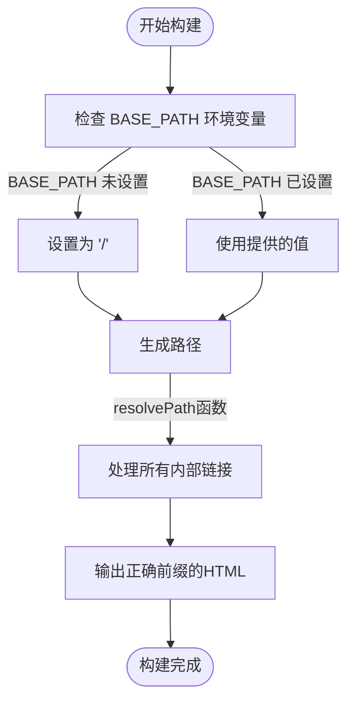
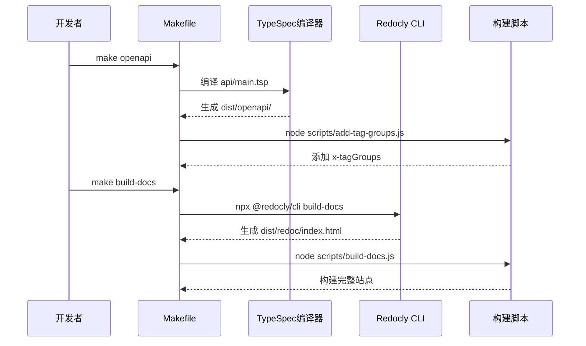
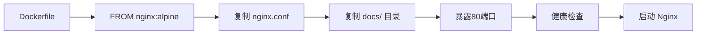
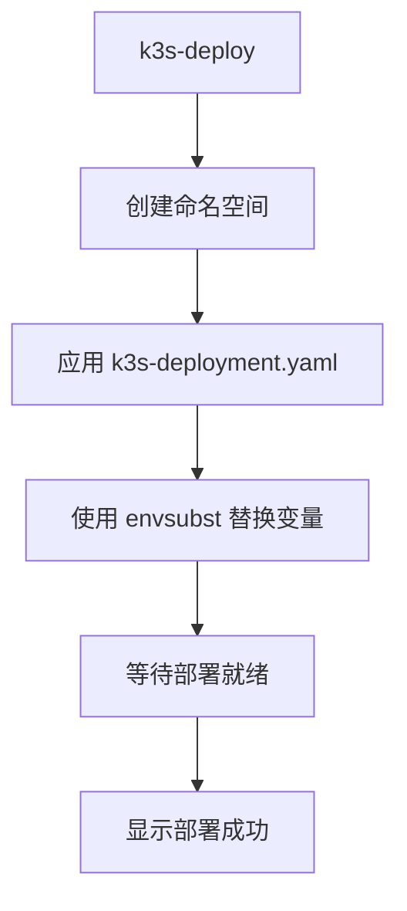
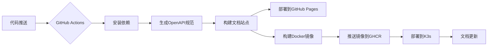
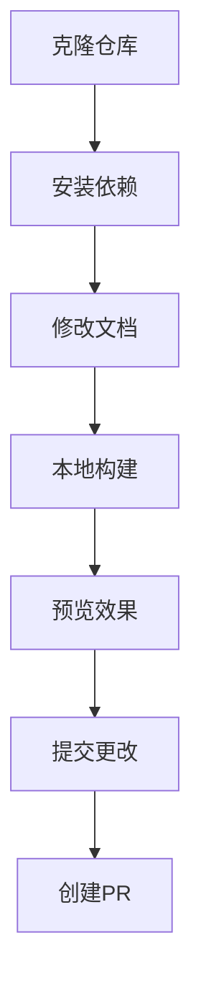

# 开发与部署

<cite>
**本文档引用的文件**   
- [Makefile](file://Makefile)
- [package.json](file://package.json)
- [redocly.yaml](file://redocly.yaml)
- [scripts/build-docs.js](file://scripts/build-docs.js)
- [scripts/build-for-github.sh](file://scripts/build-for-github.sh)
- [scripts/add-tag-groups.js](file://scripts/add-tag-groups.js)
- [scripts/build-advanced-docs.js](file://scripts/build-advanced-docs.js)
- [docs-src/GITHUB_PAGES.md](file://docs-src/GITHUB_PAGES.md)
- [docs-src/CONTRIBUTING.md](file://docs-src/CONTRIBUTING.md)
- [README.md](file://README.md)
- [Dockerfile](file://Dockerfile)
- [deployment/k3s-deployment.yaml](file://deployment/k3s-deployment.yaml)
- [deployment/README.md](file://deployment/README.md)
</cite>

## 更新摘要
**已做更改**   
- 新增了 Docker 构建流程和 K3s 部署配置的详细说明
- 更新了 Makefile 中的 docker-build、k3s-deploy 等新目标
- 增加了高级文档系统构建脚本的描述
- 扩展了 GitHub Actions 自动化部署流程的细节
- 补充了完整的发布流程和监控管理指南

## 目录
1. [开发环境设置](#开发环境设置)
2. [构建脚本与路径处理](#构建脚本与路径处理)
3. [文档生成流程](#文档生成流程)
4. [Docker 与 K3s 部署](#docker-与-k3s-部署)
5. [GitHub Actions自动化](#github-actions自动化)
6. [贡献者指南](#贡献者指南)
7. [最佳实践](#最佳实践)

## 开发环境设置

本项目使用Makefile作为主要的开发工具，提供了一套标准化的命令来设置开发环境和构建文档。开发者可以通过简单的命令完成依赖安装、文档生成和本地预览。

### 依赖安装

通过`make deps`命令安装项目所需的开发依赖：

**Section sources**
- [Makefile](file://Makefile#L7-L8)
- [package.json](file://package.json#L6-L14)

### OpenAPI规范生成

使用`make openapi`命令生成OpenAPI规范文件，该命令会编译TypeSpec定义并输出YAML格式的API规范：

**Section sources**
- [Makefile](file://Makefile#L10-L13)
- [scripts/add-tag-groups.js](file://scripts/add-tag-groups.js)

### 文档构建与预览

通过`make docs`和`make serve`命令构建完整的文档站点并在本地预览：

**Section sources**
- [Makefile](file://Makefile#L43-L58)
- [README.md](file://README.md#L30-L51)

## 构建脚本与路径处理

项目通过环境变量`BASE_PATH`巧妙地处理本地开发和GitHub Pages部署之间的路径前缀差异，确保文档在不同环境下都能正确访问。

### BASE_PATH环境变量

构建系统使用`BASE_PATH`环境变量来控制生成的文档链接前缀：
- **本地开发**: `BASE_PATH=/` (默认值)
- **GitHub Pages部署**: `BASE_PATH=/nexusbook-api/`



**Diagram sources**
- [scripts/build-docs.js](file://scripts/build-docs.js#L14-L24)
- [docs-src/GITHUB_PAGES.md](file://docs-src/GITHUB_PAGES.md#L42-L58)

### 路径解析函数

`resolvePath()`函数是路径处理的核心，它确保所有链接都能根据`BASE_PATH`正确生成：

**Section sources**
- [scripts/build-docs.js](file://scripts/build-docs.js#L19-L24)

## 文档生成流程

文档生成是一个多步骤的自动化流程，从TypeSpec定义开始，最终生成完整的静态文档站点。

### Redocly CLI文档生成

项目使用Redocly CLI将OpenAPI规范转换为美观的交互式文档站点：



**Diagram sources**
- [Makefile](file://Makefile#L15-L30)
- [scripts/build-docs.js](file://scripts/build-docs.js)
- [redocly.yaml](file://redocly.yaml)

### 构建流程步骤

文档生成流程包含以下关键步骤：
1. 编译TypeSpec定义为OpenAPI规范
2. 为OpenAPI文件添加`x-tagGroups`组织API结构
3. 使用Redocly CLI生成API文档页面
4. 构建完整的文档站点，整合指南和参考文档

**Section sources**
- [Makefile](file://Makefile#L10-L30)
- [scripts/build-for-github.sh](file://scripts/build-for-github.sh)

## Docker 与 K3s 部署

项目引入了Docker和K3s部署流程，支持在生产环境中部署文档站点。

### Docker镜像构建

通过`docker-build`目标构建轻量级Nginx镜像，包含预生成的文档静态文件：



**Diagram sources**
- [Dockerfile](file://Dockerfile)
- [Makefile](file://Makefile#L78-L81)

### K3s部署配置

使用`k3s-deploy`目标将应用部署到K3s集群，包含Deployment、Service和Ingress资源：



**Diagram sources**
- [Makefile](file://Makefile#L93-L98)
- [deployment/k3s-deployment.yaml](file://deployment/k3s-deployment.yaml)

### 部署流程详解

**Section sources**
- [Makefile](file://Makefile#L71-L126)
- [deployment/k3s-deployment.yaml](file://deployment/k3s-deployment.yaml)
- [deployment/README.md](file://deployment/README.md)

#### Docker构建目标

`docker-build`目标负责构建Docker镜像：
```makefile
docker-build:
	@echo "Building Docker image..."
	docker build -t $(DOCKER_REGISTRY)/$(IMAGE_NAME):$(VERSION) .
	@echo "✅ Docker image built: $(DOCKER_REGISTRY)/$(IMAGE_NAME):$(VERSION)"
```

#### K3s部署目标

`k3s-deploy`目标执行完整的K3s部署流程：
```makefile
k3s-deploy:
	@echo "Deploying to K3s cluster..."
	@kubectl create namespace $(NAMESPACE) --dry-run=client -o yaml | kubectl apply -f -
	@export DOCKER_REGISTRY=$(DOCKER_REGISTRY) VERSION=$(VERSION) && \
		cat deployment/k3s-deployment.yaml | envsubst | kubectl apply -f -
	@kubectl rollout status deployment/nexusbook-api-docs -n $(NAMESPACE) --timeout=5m
	@echo "✅ Deployment successful!"
```

#### 完整发布流程

`release`目标组合了镜像构建、推送和K3s部署：
```makefile
release: docker-release k3s-deploy k3s-status
```

## GitHub Actions自动化

项目配置了GitHub Actions自动化工作流，实现文档的自动构建和部署到GitHub Pages和K3s集群。

### 自动化部署流程



**Section sources**
- [scripts/build-for-github.sh](file://scripts/build-for-github.sh)
- [docs-src/GITHUB_PAGES.md](file://docs-src/GITHUB_PAGES.md)
- [scripts/check-github-pages.sh](file://scripts/check-github-pages.sh)
- [deployment/README.md](file://deployment/README.md)

### 部署脚本分析

`build-for-github.sh`脚本专门用于GitHub Pages部署，它设置了正确的`BASE_PATH`并执行完整的构建流程：

**Section sources**
- [scripts/build-for-github.sh](file://scripts/build-for-github.sh)

### 多环境部署策略

项目支持双环境部署：
1. **GitHub Pages**: `https://apexroc.github.io/nexusbook-api` (公开访问)
2. **K3s 集群**: `https://open.nexusbook.app` (生产环境)

**Section sources**
- [deployment/README.md](file://deployment/README.md)

## 贡献者指南

为帮助贡献者有效参与项目开发，以下是构建和预览文档更改的完整指南。

### 本地开发流程

贡献者可以按照以下步骤进行本地开发和预览：



**Section sources**
- [README.md](file://README.md#L30-L51)
- [docs-src/CONTRIBUTING.md](file://docs-src/CONTRIBUTING.md)

### 预览文档更改

使用以下命令组合可以快速预览文档更改：

**Section sources**
- [Makefile](file://Makefile#L55-L58)
- [README.md](file://README.md#L145-L158)

## 最佳实践

本项目遵循一系列最佳实践，确保代码质量和开发效率。

### 代码生成

项目充分利用代码生成技术，从TypeSpec定义自动生成OpenAPI规范和文档：

**Section sources**
- [Makefile](file://Makefile#L10-L13)
- [tspconfig.yaml](file://tspconfig.yaml)

### 文档版本控制

文档版本控制策略包括：
- Markdown源文件纳入版本控制
- 生成的静态文件也提交到Git（用于GitHub Pages部署）
- 使用`.nojekyll`文件防止Jekyll处理

**Section sources**
- [docs-src/GITHUB_PAGES.md](file://docs-src/GITHUB_PAGES.md)
- [scripts/build-docs.js](file://scripts/build-docs.js#L371-L377)

### 持续集成

持续集成流程确保每次代码更改都能自动验证和部署文档：

**Section sources**
- [scripts/check-github-pages.sh](file://scripts/check-github-pages.sh)
- [docs-src/GITHUB_PAGES.md](file://docs-src/GITHUB_PAGES.md)

### 高级文档系统

项目使用`build-advanced-docs.js`脚本构建高级手册，支持完整的目录树导航和全文搜索：

**Section sources**
- [scripts/build-advanced-docs.js](file://scripts/build-advanced-docs.js)
- [Makefile](file://Makefile#L44-L47)