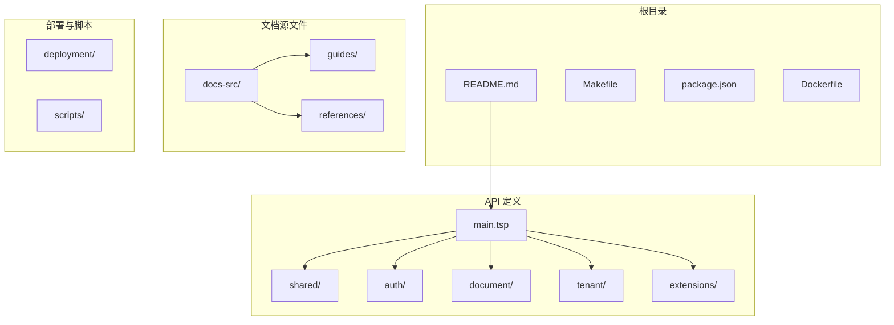
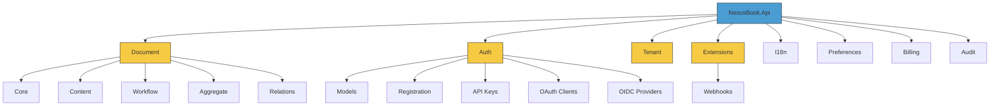
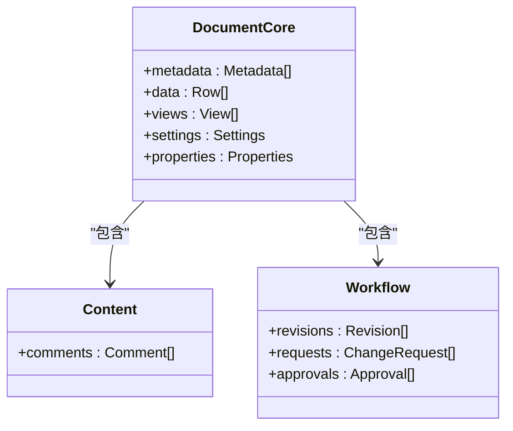
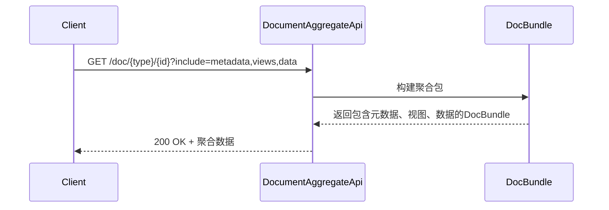
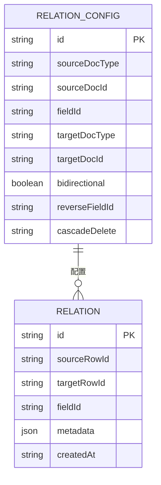
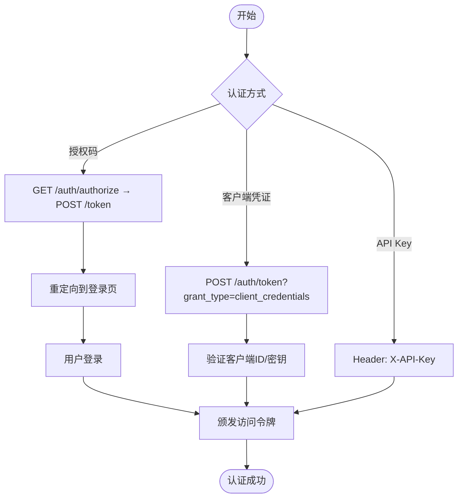
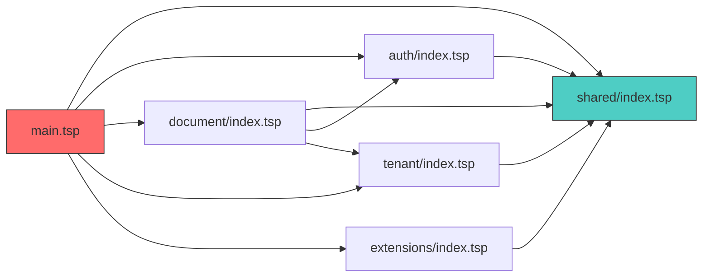

# 高级文档系统

<cite>
**本文档中引用的文件**  
- [main.tsp](file://api/main.tsp)
- [README.md](file://README.md)
- [STORY.md](file://STORY.md)
- [shared/index.tsp](file://api/shared/index.tsp)
- [document/index.tsp](file://api/document/index.tsp)
- [auth/index.tsp](file://api/auth/index.tsp)
- [tenant/index.tsp](file://api/tenant/index.tsp)
- [extensions/index.tsp](file://api/extensions/index.tsp)
- [document/core/index.tsp](file://api/document/core/index.tsp)
- [document/content/index.tsp](file://api/document/content/index.tsp)
- [document/workflow/index.tsp](file://api/document/workflow/index.tsp)
- [document/aggregate/index.tsp](file://api/document/aggregate/index.tsp)
- [document/relations/index.tsp](file://api/document/relations/index.tsp)
</cite>

## 目录
1. [简介](#简介)
2. [项目结构](#项目结构)
3. [核心组件](#核心组件)
4. [架构概览](#架构概览)
5. [详细组件分析](#详细组件分析)
6. [依赖分析](#依赖分析)
7. [性能考虑](#性能考虑)
8. [故障排除指南](#故障排除指南)
9. [结论](#结论)

## 简介

NexusBook API 是一个功能完整的开源文档管理和数据协作平台，使用 TypeSpec 定义并生成符合 OpenAPI 3.0 规范的 API 接口。该系统支持统一的文档抽象、强大的数据管理、灵活的视图系统、完整的协作功能以及事件驱动的通知机制。API 设计遵循模块化原则，支持 OAuth2 和 OIDC 认证，并通过 Webhook 实现扩展集成。

**Section sources**
- [README.md](file://README.md#L1-L187)
- [STORY.md](file://STORY.md#L1-L102)

## 项目结构

项目采用模块化设计，主要分为 API 定义、文档源文件、部署配置和脚本工具四大部分。API 使用 TypeSpec（`.tsp` 文件）进行声明式定义，文档使用 Markdown 编写并通过自动化脚本生成静态站点。

**Diagram sources**
- [README.md](file://README.md#L126-L141)
- [main.tsp](file://api/main.tsp#L1-L136)

**Section sources**
- [README.md](file://README.md#L126-L141)
- [project_structure](file://project_structure#L1-L100)

## 核心组件

NexusBook API 的核心组件包括文档管理、认证授权、租户管理、扩展功能等模块。这些模块通过 TypeSpec 的命名空间和导入机制组织，确保高内聚、低耦合。

**Section sources**
- [main.tsp](file://api/main.tsp#L4-L13)
- [README.md](file://README.md#L21-L29)

## 架构概览

系统采用分层架构，顶层为服务入口，各功能模块独立封装并通过主入口聚合。API 遵循 RESTful 设计原则，所有端点以 `/api/v1` 开头，支持统一的响应格式和错误处理机制。

**Diagram sources**
- [main.tsp](file://api/main.tsp#L4-L13)
- [document/index.tsp](file://api/document/index.tsp#L1-L31)
- [auth/index.tsp](file://api/auth/index.tsp#L1-L48)

## 详细组件分析

### 文档模块分析

文档模块是 NexusBook 的核心，提供元数据、数据、视图、评论、审批等全方位管理能力。

#### 核心子模块

**Diagram sources**
- [document/core/index.tsp](file://api/document/core/index.tsp#L1-L21)
- [document/content/index.tsp](file://api/document/content/index.tsp#L1-L13)
- [document/workflow/index.tsp](file://api/document/workflow/index.tsp#L1-L17)

#### 聚合查询流程

**Diagram sources**
- [document/aggregate/index.tsp](file://api/document/aggregate/index.tsp#L1-L127)

#### 文档关联模型

**Diagram sources**
- [document/relations/index.tsp](file://api/document/relations/index.tsp#L1-L526)

**Section sources**
- [document/index.tsp](file://api/document/index.tsp#L1-L31)
- [document/aggregate/index.tsp](file://api/document/aggregate/index.tsp#L1-L127)
- [document/relations/index.tsp](file://api/document/relations/index.tsp#L1-L526)

### 认证模块分析

认证模块提供 OAuth2、OIDC 兼容的身份认证服务，支持客户端凭证、授权码等多种流程。

**Diagram sources**
- [auth/index.tsp](file://api/auth/index.tsp#L1-L48)

**Section sources**
- [auth/index.tsp](file://api/auth/index.tsp#L1-L48)
- [main.tsp](file://api/main.tsp#L128-L135)

## 依赖分析

系统各模块通过明确的导入关系建立依赖，主入口文件 `main.tsp` 导入所有功能模块，各子模块导入共享基础类型。

**Diagram sources**
- [main.tsp](file://api/main.tsp#L4-L13)
- [shared/index.tsp](file://api/shared/index.tsp#L1-L16)

**Section sources**
- [main.tsp](file://api/main.tsp#L4-L13)
- [shared/index.tsp](file://api/shared/index.tsp#L4-L5)

## 性能考虑

系统设计中已考虑性能优化，包括：
- 聚合查询减少多次往返
- 支持分页和游标避免大数据集加载
- 并发控制通过版本号防止冲突
- Webhook 异步通知解耦核心流程

[无来源，此为通用性能建议]

## 故障排除指南

常见问题可通过查阅文档或检查以下方面解决：
- 认证令牌是否正确且未过期
- 请求头是否包含 `Authorization: Bearer <token>`
- API 路径是否以 `/api/v1` 开头
- 请求参数是否符合 OpenAPI 规范

**Section sources**
- [README.md](file://README.md#L65-L95)
- [main.tsp](file://api/main.tsp#L62-L65)

## 结论

NexusBook API 通过 TypeSpec 实现了高度结构化和可维护的 API 定义，模块化设计使得功能扩展和维护更加便捷。系统支持完整的文档生命周期管理，适用于供应链、项目管理等多种业务场景。建议开发者参考完整文档站点进行集成开发。

[无来源，此为总结性内容]