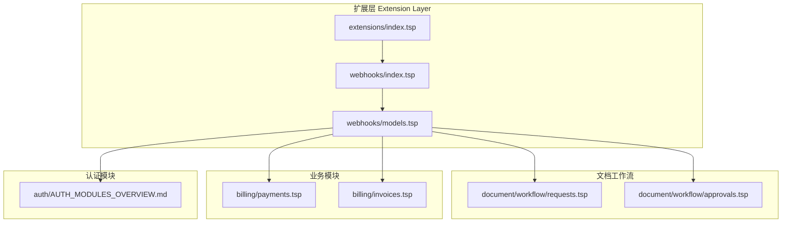
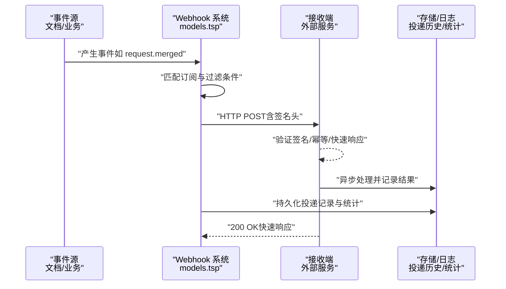
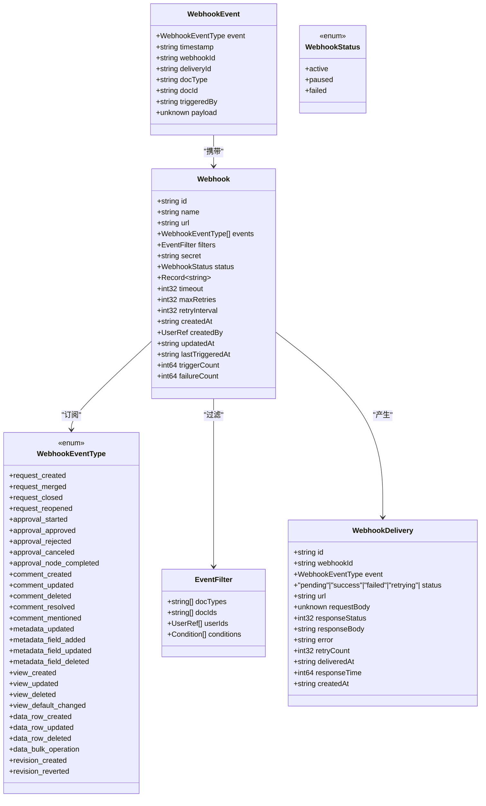
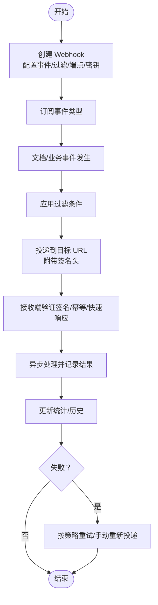
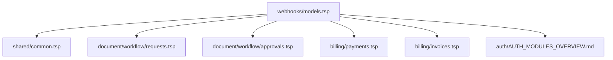

# 扩展与集成

<cite>
**本文引用的文件**
- [api/extensions/webhooks/index.tsp](file://api/extensions/webhooks/index.tsp)
- [api/extensions/webhooks/models.tsp](file://api/extensions/webhooks/models.tsp)
- [api/extensions/webhooks/WEBHOOK_GUIDE.md](file://api/extensions/webhooks/WEBHOOK_GUIDE.md)
- [docs-src/guides/webhooks.md](file://docs-src/guides/webhooks.md)
- [api/extensions/index.tsp](file://api/extensions/index.tsp)
- [api/document/workflow/requests.tsp](file://api/document/workflow/requests.tsp)
- [api/document/workflow/approvals.tsp](file://api/document/workflow/approvals.tsp)
- [api/billing/payments.tsp](file://api/billing/payments.tsp)
- [api/billing/invoices.tsp](file://api/billing/invoices.tsp)
- [api/auth/AUTH_MODULES_OVERVIEW.md](file://api/auth/AUTH_MODULES_OVERVIEW.md)
- [docs-src/guides/architecture.md](file://docs-src/guides/architecture.md)
</cite>

## 目录
1. [简介](#简介)
2. [项目结构](#项目结构)
3. [核心组件](#核心组件)
4. [架构总览](#架构总览)
5. [详细组件分析](#详细组件分析)
6. [依赖分析](#依赖分析)
7. [性能考虑](#性能考虑)
8. [故障排查指南](#故障排查指南)
9. [结论](#结论)
10. [附录](#附录)

## 简介
本文件聚焦于扩展与集成功能，特别是基于事件驱动的 Webhooks 通知机制。系统支持 20+ 种事件类型（如 Request、Approval、Comment、Metadata、View、Data、Revision），提供订阅、配置端点、事件投递、自动重试、签名验证、投递历史与统计、以及与外部系统的集成模式（如支付网关、第三方身份提供商）。本文将结合代码与文档，给出架构、流程、最佳实践与示例，帮助开发者快速搭建可靠的自动化工作流。

## 项目结构
扩展模块位于 api/extensions，其中 webhooks 子模块提供事件驱动通知能力；文档工作流模块（requests、approvals）与业务模块（billing、auth）共同构成可被 Webhooks 触发的事件源。

图表来源
- [api/extensions/index.tsp](file://api/extensions/index.tsp#L1-L13)
- [api/extensions/webhooks/index.tsp](file://api/extensions/webhooks/index.tsp#L1-L15)
- [api/extensions/webhooks/models.tsp](file://api/extensions/webhooks/models.tsp#L1-L120)
- [api/document/workflow/requests.tsp](file://api/document/workflow/requests.tsp#L1-L120)
- [api/document/workflow/approvals.tsp](file://api/document/workflow/approvals.tsp#L1-L120)
- [api/billing/payments.tsp](file://api/billing/payments.tsp#L1-L75)
- [api/billing/invoices.tsp](file://api/billing/invoices.tsp#L1-L75)
- [api/auth/AUTH_MODULES_OVERVIEW.md](file://api/auth/AUTH_MODULES_OVERVIEW.md#L1-L120)

章节来源
- [api/extensions/index.tsp](file://api/extensions/index.tsp#L1-L13)
- [docs-src/guides/architecture.md](file://docs-src/guides/architecture.md#L121-L220)

## 核心组件
- Webhooks 扩展模块：提供事件订阅、自动通知、重试、签名验证、事件过滤、测试、投递历史、统计与密钥管理等能力。
- 文档工作流模块：变更请求（Request）与审批（Approval）作为高频事件源，可被 Webhooks 订阅。
- 业务模块：支付（Payments）、发票（Invoices）等业务动作也可作为事件源，配合 Webhooks 实现自动化流程。
- 认证模块：提供 OAuth2/OIDC、API Key 等能力，便于与第三方身份提供商对接或为集成服务提供鉴权。

章节来源
- [api/extensions/webhooks/models.tsp](file://api/extensions/webhooks/models.tsp#L1-L120)
- [api/document/workflow/requests.tsp](file://api/document/workflow/requests.tsp#L1-L120)
- [api/document/workflow/approvals.tsp](file://api/document/workflow/approvals.tsp#L1-L120)
- [api/billing/payments.tsp](file://api/billing/payments.tsp#L1-L75)
- [api/billing/invoices.tsp](file://api/billing/invoices.tsp#L1-L75)
- [api/auth/AUTH_MODULES_OVERVIEW.md](file://api/auth/AUTH_MODULES_OVERVIEW.md#L1-L120)

## 架构总览
Webhooks 采用“事件驱动 + 推送”的架构：当文档或业务发生变更时，系统根据订阅规则筛选并生成事件，按配置投递到目标端点，并通过签名与重试保障可靠性。接收端可快速响应并在后台异步处理，同时通过投递历史与统计进行可观测性。

图表来源
- [api/extensions/webhooks/models.tsp](file://api/extensions/webhooks/models.tsp#L503-L761)
- [docs-src/guides/webhooks.md](file://docs-src/guides/webhooks.md#L1-L20)

## 详细组件分析

### Webhooks 数据模型与 API
- 事件类型：涵盖 Request、Approval、Comment、Metadata、View、Data、Revision 等 20+ 类型，满足文档与业务变更的广泛场景。
- Webhook 配置：支持目标 URL、事件订阅、过滤条件（文档类型/ID/用户/自定义 JSONPath）、自定义请求头、超时、最大重试次数、重试间隔、密钥等。
- 事件载荷：包含事件类型、时间戳、Webhook ID、投递 ID、文档类型/ID、触发用户、事件载荷等。
- 投递记录：包含投递 ID、事件类型、状态、请求 URL、请求体、响应状态码/体、错误信息、重试次数、投递时间、响应时间等。
- 管理接口：列出、创建、获取、更新、删除、暂停/恢复、测试、重新生成密钥、投递历史、投递详情、重新投递、统计等。

图表来源
- [api/extensions/webhooks/models.tsp](file://api/extensions/webhooks/models.tsp#L89-L173)
- [api/extensions/webhooks/models.tsp](file://api/extensions/webhooks/models.tsp#L221-L342)
- [api/extensions/webhooks/models.tsp](file://api/extensions/webhooks/models.tsp#L344-L483)
- [api/extensions/webhooks/models.tsp](file://api/extensions/webhooks/models.tsp#L503-L761)

章节来源
- [api/extensions/webhooks/models.tsp](file://api/extensions/webhooks/models.tsp#L1-L761)

### Webhooks 管理与使用流程
- 订阅与配置：创建 Webhook，选择事件类型与过滤条件，配置目标 URL、超时、重试策略与密钥。
- 事件投递：系统在事件发生时按订阅规则筛选并投递，携带签名头以确保来源可信。
- 重试与失败处理：支持最大重试次数与间隔，失败后可在投递历史中查看并手动重新投递。
- 统计与可观测性：提供统计接口，查看总触发次数、成功/失败次数、成功率、平均响应时间等。
- 测试与调试：提供测试端点，快速验证配置；可通过投递历史与详细日志定位问题。

图表来源
- [api/extensions/webhooks/models.tsp](file://api/extensions/webhooks/models.tsp#L503-L761)
- [docs-src/guides/webhooks.md](file://docs-src/guides/webhooks.md#L377-L547)

章节来源
- [api/extensions/webhooks/WEBHOOK_GUIDE.md](file://api/extensions/webhooks/WEBHOOK_GUIDE.md#L201-L381)
- [docs-src/guides/webhooks.md](file://docs-src/guides/webhooks.md#L377-L547)

### 事件类型与典型使用场景
- Request 相关：创建、合并、关闭、重新打开，适合触发通知、CI/CD、审计等。
- Approval 相关：开始、通过、拒绝、取消、节点完成，适合触发后续流程或通知。
- Comment 相关：创建、更新、删除、解决、提及，适合通知与协作提醒。
- Metadata/View/Data/Revision 相关：适合 Schema 变更、视图变更、数据同步、版本回滚等。

章节来源
- [api/extensions/webhooks/models.tsp](file://api/extensions/webhooks/models.tsp#L89-L135)
- [api/extensions/webhooks/WEBHOOK_GUIDE.md](file://api/extensions/webhooks/WEBHOOK_GUIDE.md#L1-L200)
- [docs-src/guides/webhooks.md](file://docs-src/guides/webhooks.md#L1-L120)

### 签名验证与安全最佳实践
- 签名验证：接收端必须验证签名头，确保请求来自系统；建议同时校验时间戳防止重放攻击。
- 快速响应：在 30 秒内返回 200，避免触发不必要的重试。
- 幂等性：使用投递 ID 做幂等键，避免重复处理。
- 错误处理：业务逻辑错误返回 200 并记录日志，避免因业务错误导致系统重试。

章节来源
- [docs-src/guides/webhooks.md](file://docs-src/guides/webhooks.md#L446-L688)
- [api/extensions/webhooks/WEBHOOK_GUIDE.md](file://api/extensions/webhooks/WEBHOOK_GUIDE.md#L435-L509)

### 与文档工作流的集成
- 变更请求（Request）：合并、关闭、重新打开等事件可用于触发通知、审计、CI/CD 等。
- 审批（Approval）：开始、通过、拒绝、取消、节点完成等事件可用于触发通知与后续流程。

章节来源
- [api/document/workflow/requests.tsp](file://api/document/workflow/requests.tsp#L202-L391)
- [api/document/workflow/approvals.tsp](file://api/document/workflow/approvals.tsp#L96-L156)
- [docs-src/guides/webhooks.md](file://docs-src/guides/webhooks.md#L573-L633)

### 与支付网关和第三方身份提供商的集成
- 支付网关：通过 Webhooks 订阅支付方式变更、发票支付状态等事件，触发对账、通知与后续流程。
- 第三方身份提供商：通过认证模块提供的 OAuth2/OIDC 能力，实现统一登录与令牌管理，便于与外部系统对接。

章节来源
- [api/billing/payments.tsp](file://api/billing/payments.tsp#L1-L75)
- [api/billing/invoices.tsp](file://api/billing/invoices.tsp#L1-L75)
- [api/auth/AUTH_MODULES_OVERVIEW.md](file://api/auth/AUTH_MODULES_OVERVIEW.md#L1-L120)

## 依赖分析
- Webhooks 依赖共享类型与通用模型，确保跨模块一致性。
- Webhooks 与文档工作流（Request/Approval）耦合度高，事件丰富且可控。
- Webhooks 与业务模块（Billing）结合，可实现支付与发票状态的自动化联动。
- Webhooks 与认证模块结合，可为外部系统提供受控的访问与鉴权。

图表来源
- [api/extensions/webhooks/models.tsp](file://api/extensions/webhooks/models.tsp#L1-L20)
- [api/document/workflow/requests.tsp](file://api/document/workflow/requests.tsp#L1-L20)
- [api/document/workflow/approvals.tsp](file://api/document/workflow/approvals.tsp#L1-L20)
- [api/billing/payments.tsp](file://api/billing/payments.tsp#L1-L20)
- [api/billing/invoices.tsp](file://api/billing/invoices.tsp#L1-L20)
- [api/auth/AUTH_MODULES_OVERVIEW.md](file://api/auth/AUTH_MODULES_OVERVIEW.md#L1-L20)

章节来源
- [api/extensions/webhooks/models.tsp](file://api/extensions/webhooks/models.tsp#L1-L20)
- [docs-src/guides/architecture.md](file://docs-src/guides/architecture.md#L121-L220)

## 性能考虑
- 重试策略：建议采用指数退避加抖动，避免网络拥塞；合理设置最大重试次数与间隔。
- 幂等性：以投递 ID 为幂等键，结合持久化存储，确保“至多一次”。
- 响应约定：业务可重试错误返回非 2xx，业务逻辑错误返回 200 并记录日志。
- 过滤优化：尽量精确限定文档类型/ID/用户与自定义条件，减少无关流量与下游压力。

章节来源
- [docs-src/guides/webhooks.md](file://docs-src/guides/webhooks.md#L675-L688)

## 故障排查指南
- 使用测试端点发送测试事件，验证配置是否正确。
- 查看投递历史与详细日志，定位失败原因与重试情况。
- 通过统计接口观察成功率、失败率与平均响应时间，评估健康状况。
- 如需修复，可暂停/恢复 Webhook，重新生成密钥，或手动重新投递失败的事件。

章节来源
- [api/extensions/webhooks/WEBHOOK_GUIDE.md](file://api/extensions/webhooks/WEBHOOK_GUIDE.md#L500-L547)
- [docs-src/guides/webhooks.md](file://docs-src/guides/webhooks.md#L511-L547)

## 结论
Webhooks 为系统提供了强大的事件驱动集成能力，覆盖文档与业务变更的多个关键环节。通过完善的事件类型、灵活的过滤、可靠的重试与签名验证、可观测的投递历史与统计，以及与文档工作流、支付与认证模块的深度结合，开发者可以快速构建稳定高效的自动化工作流，实现与支付网关、第三方身份提供商等外部系统的无缝集成。

## 附录
- 快速开始与示例：参考 Webhook 使用指南与示例文档，了解创建、接收、测试与调试的完整流程。
- 事件过滤最佳实践：精确限定过滤条件，减少无关流量，提升系统整体性能与稳定性。

章节来源
- [api/extensions/webhooks/WEBHOOK_GUIDE.md](file://api/extensions/webhooks/WEBHOOK_GUIDE.md#L201-L381)
- [docs-src/guides/webhooks.md](file://docs-src/guides/webhooks.md#L393-L444)