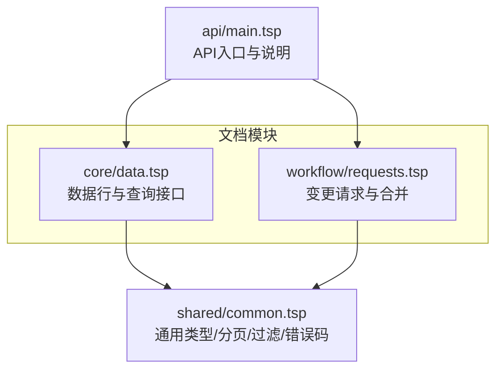
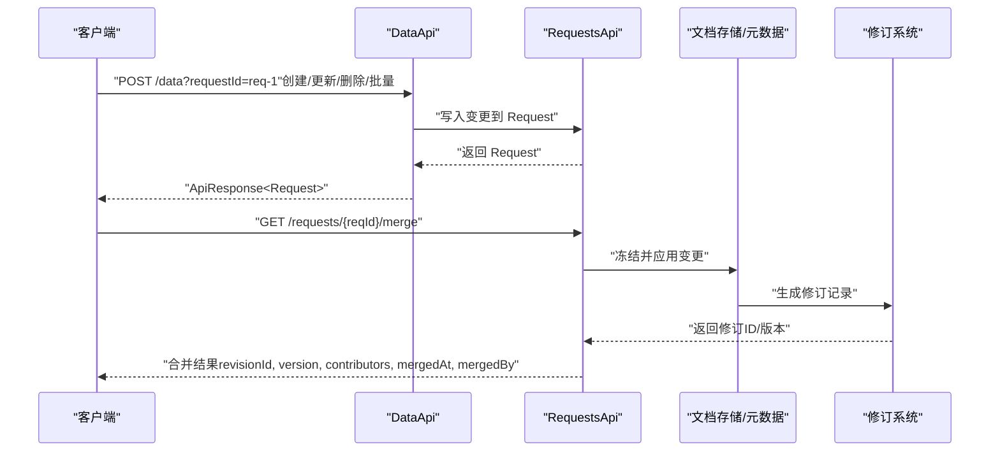
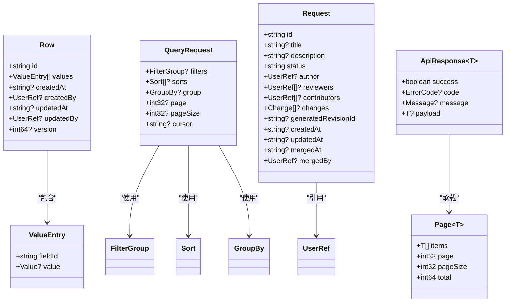

# CRUD操作

<cite>
**本文引用的文件**
- [api/main.tsp](file://api/main.tsp)
- [api/document/index.tsp](file://api/document/index.tsp)
- [api/document/core/data.tsp](file://api/document/core/data.tsp)
- [api/document/workflow/requests.tsp](file://api/document/workflow/requests.tsp)
- [api/shared/common.tsp](file://api/shared/common.tsp)
- [docs-src/guides/data-operations.md](file://docs-src/guides/data-operations.md)
- [docs-src/references/error-codes.md](file://docs-src/references/error-codes.md)
</cite>

## 目录
1. [简介](#简介)
2. [项目结构](#项目结构)
3. [核心组件](#核心组件)
4. [架构总览](#架构总览)
5. [详细组件分析](#详细组件分析)
6. [依赖分析](#依赖分析)
7. [性能考虑](#性能考虑)
8. [故障排查指南](#故障排查指南)
9. [结论](#结论)

## 简介
本文件围绕数据行的CRUD操作进行系统化说明，覆盖创建、读取、更新、删除的API端点、请求参数与响应格式；解释变更请求（requestId）如何将写操作纳入变更工作流；详述读取侧的分页机制（page/pageSize/cursor）与结构化查询能力；阐述更新侧的乐观锁（version）并发控制与冲突处理；并提供基于仓库文档的cURL示例与服务端处理逻辑说明。

## 项目结构
- 文档模块（Document）下包含核心数据模型与工作流：
  - 核心数据行与查询：位于 data.tsp
  - 变更请求与合并：位于 requests.tsp
  - 通用类型与分页/过滤模型：位于 shared/common.tsp
- 文档入口与API概览：位于 api/main.tsp
- 数据操作指南与错误码参考：位于 docs-src/guides/data-operations.md 与 docs-src/references/error-codes.md

图表来源
- [api/document/core/data.tsp](file://api/document/core/data.tsp#L375-L627)
- [api/document/workflow/requests.tsp](file://api/document/workflow/requests.tsp#L202-L390)
- [api/shared/common.tsp](file://api/shared/common.tsp#L153-L203)
- [api/main.tsp](file://api/main.tsp#L96-L134)

章节来源
- [api/document/index.tsp](file://api/document/index.tsp#L1-L31)
- [api/main.tsp](file://api/main.tsp#L96-L134)

## 核心组件
- 数据行与查询接口（DataApi）
  - 列表与分页：GET /doc/{docType}/{docId}/data
  - 结构化查询：POST /doc/{docType}/{docId}/data/query
  - 单行读取：GET /doc/{docType}/{docId}/data/{rowId}
  - 创建行：POST /doc/{docType}/{docId}/data?requestId={reqId}
  - 批量更新：POST /doc/{docType}/{docId}/data/bulk?requestId={reqId}
  - 更新行：PUT /doc/{docType}/{docId}/data/{rowId}?requestId={reqId}
  - 删除行：DELETE /doc/{docType}/{docId}/data/{rowId}?requestId={reqId}
- 变更请求（Request）
  - 列表/创建/详情：/doc/{docType}/{docId}/requests
  - 合并：/doc/{docType}/{docId}/requests/{reqId}/merge
  - 关闭/重新打开/冲突检查
- 通用类型
  - ApiResponse<T>、Page<T>、分页参数、过滤/排序/分组/聚合模型、值类型与用户引用等

章节来源
- [api/document/core/data.tsp](file://api/document/core/data.tsp#L375-L627)
- [api/document/workflow/requests.tsp](file://api/document/workflow/requests.tsp#L202-L390)
- [api/shared/common.tsp](file://api/shared/common.tsp#L153-L203)

## 架构总览
数据行CRUD通过“变更请求工作流”实现：所有写操作（创建/更新/删除/批量更新）均进入Request，经审批合并后才真正生效，并生成修订记录。读取操作支持两种视图：
- 生产数据视图（默认）
- 叠加视图（通过requestId将生产数据与Request变更合并展示）

图表来源
- [api/document/core/data.tsp](file://api/document/core/data.tsp#L440-L627)
- [api/document/workflow/requests.tsp](file://api/document/workflow/requests.tsp#L202-L390)

## 详细组件分析

### 创建数据行（进入变更请求）
- 端点
  - POST /api/v1/doc/{docType}/{docId}/data?requestId={reqId}
- 请求参数
  - 路径参数：docType、docId
  - 查询参数：requestId（必填，变更请求ID）
  - 请求体：Row（包含id、values、可选版本号等）
- 响应
  - ApiResponse<Request>：返回变更请求对象
- 服务端处理逻辑要点
  - 解析Row.values，按字段定义进行类型转换与校验
  - 将变更写入指定Request
  - 返回Request对象供后续合并

章节来源
- [api/document/core/data.tsp](file://api/document/core/data.tsp#L440-L474)
- [docs-src/guides/data-operations.md](file://docs-src/guides/data-operations.md#L40-L67)

### 读取数据行
- 端点
  - GET /api/v1/doc/{docType}/{docId}/data
  - POST /api/v1/doc/{docType}/{docId}/data/query
  - GET /api/v1/doc/{docType}/{docId}/data/{rowId}
- 查询参数（列表）
  - page、pageSize、sort、filter、group、cursor、requestId、includeChanges
- 结构化查询体（POST /query）
  - QueryRequest：filters、sorts、group、page、pageSize、cursor
- 响应
  - 列表：ApiResponse<Page<Row>>
  - 单行：ApiResponse<Row>
- 读取叠加视图
  - 通过requestId参数将生产数据与Request变更合并，includeChanges可返回变更标记

章节来源
- [api/document/core/data.tsp](file://api/document/core/data.tsp#L404-L438)
- [api/shared/common.tsp](file://api/shared/common.tsp#L197-L203)
- [docs-src/guides/data-operations.md](file://docs-src/guides/data-operations.md#L69-L103)

### 更新数据行（进入变更请求）
- 端点
  - PUT /api/v1/doc/{docType}/{docId}/data/{rowId}?requestId={reqId}
- 请求参数
  - 路径参数：docType、docId、rowId
  - 查询参数：requestId（必填）
  - 请求体：Row（values为增量或全量，version为乐观锁版本号）
- 响应
  - ApiResponse<Request>：返回变更请求对象
- 乐观锁与并发冲突
  - 更新时需提供当前version，若与服务端不一致则返回版本冲突错误

章节来源
- [api/document/core/data.tsp](file://api/document/core/data.tsp#L591-L609)
- [docs-src/guides/data-operations.md](file://docs-src/guides/data-operations.md#L105-L134)
- [docs-src/references/error-codes.md](file://docs-src/references/error-codes.md#L116-L120)

### 删除数据行（进入变更请求）
- 端点
  - DELETE /api/v1/doc/{docType}/{docId}/data/{rowId}?requestId={reqId}
- 请求参数
  - 路径参数：docType、docId、rowId
  - 查询参数：requestId（必填）
- 响应
  - ApiResponse<Request>：返回变更请求对象

章节来源
- [api/document/core/data.tsp](file://api/document/core/data.tsp#L610-L627)
- [docs-src/guides/data-operations.md](file://docs-src/guides/data-operations.md#L136-L144)

### 批量更新（进入变更请求）
- 端点
  - POST /api/v1/doc/{docType}/{docId}/data/bulk?requestId={reqId}
- 请求参数
  - 路径参数：docType、docId
  - 查询参数：requestId（必填）
  - 请求体：BulkUpdate[]（target灵活结构，value为原始值）
- 服务端处理逻辑
  - 根据docId获取metadata
  - 解析每个target，识别目标类型（行/属性）
  - 查找字段定义获取类型
  - 将原始值转换为类型化值并校验
  - 写入指定Request

章节来源
- [api/document/core/data.tsp](file://api/document/core/data.tsp#L560-L568)
- [docs-src/guides/data-operations.md](file://docs-src/guides/data-operations.md#L156-L196)

### 变更请求工作流（Request）
- 列表/创建/详情：/doc/{docType}/{docId}/requests
- 合并：/doc/{docType}/{docId}/requests/{reqId}/merge
  - 返回：revisionId、version、changesApplied、contributors、mergedAt、mergedBy
- 关闭/重新打开/冲突检查

章节来源
- [api/document/workflow/requests.tsp](file://api/document/workflow/requests.tsp#L202-L390)

### 分页机制与结构化查询
- 列表分页
  - page、pageSize（默认20，最大200）
  - cursor用于深分页
- 结构化查询
  - filters（FilterGroup）、sorts（Sort[]）、group（GroupBy）
  - 支持嵌套逻辑与区间、包含等操作符

章节来源
- [api/document/core/data.tsp](file://api/document/core/data.tsp#L313-L373)
- [api/shared/common.tsp](file://api/shared/common.tsp#L205-L331)
- [docs-src/guides/data-operations.md](file://docs-src/guides/data-operations.md#L294-L359)

### 乐观锁与并发冲突
- 更新请求体需包含version
- 若version不匹配，返回VERSION_CONFLICT错误
- 建议流程：先读取最新数据，再提交更新并携带最新version

章节来源
- [api/document/core/data.tsp](file://api/document/core/data.tsp#L303-L311)
- [docs-src/guides/data-operations.md](file://docs-src/guides/data-operations.md#L234-L272)
- [docs-src/references/error-codes.md](file://docs-src/references/error-codes.md#L116-L120)

## 依赖分析
- DataApi依赖
  - Row、ValueEntry、Value、UserRef、Attachment、RelationRef等通用类型
  - QueryRequest（filters/sorts/group/page/pageSize/cursor）
  - ApiResponse<T>、Page<T>
- RequestsApi依赖
  - Request、Change、UserRef、Page等
- 变更工作流
  - 所有写操作最终写入Request，合并后生成修订

图表来源
- [api/shared/common.tsp](file://api/shared/common.tsp#L153-L331)
- [api/document/core/data.tsp](file://api/document/core/data.tsp#L241-L373)
- [api/document/workflow/requests.tsp](file://api/document/workflow/requests.tsp#L83-L200)

## 性能考虑
- 优先使用批量操作（POST /data/bulk）以减少往返
- 合理设置pageSize（建议20-100）
- 使用过滤减少数据量，避免客户端二次过滤
- 使用cursor进行深分页，避免跳页导致的性能问题

章节来源
- [docs-src/guides/data-operations.md](file://docs-src/guides/data-operations.md#L273-L337)

## 故障排查指南
- 常见错误码
  - VERSION_CONFLICT：版本冲突，需刷新数据后重试
  - ROW_NOT_FOUND：行不存在
  - INVALID_FIELD_ID：字段ID无效
  - REQUEST_NOT_FOUND：变更请求不存在
  - REQUEST_CONFLICT：请求冲突
- HTTP状态码映射
  - 400：参数错误/验证失败
  - 401：未认证/令牌无效
  - 403：权限不足
  - 404：资源不存在
  - 409：资源冲突（版本冲突/重复ID等）
  - 429：请求过于频繁
  - 500：服务器内部错误

章节来源
- [docs-src/references/error-codes.md](file://docs-src/references/error-codes.md#L1-L312)

## 结论
本CRUD体系以“变更请求工作流”为核心，所有写操作均进入Request并通过审批合并后生效，确保可审计、可回滚与协同编辑。读取侧提供简单分页与结构化查询，并支持通过requestId叠加视图。更新侧采用乐观锁（version）防止并发冲突。配合批量更新与合理的分页/过滤策略，可在保证一致性的同时提升性能与可用性。