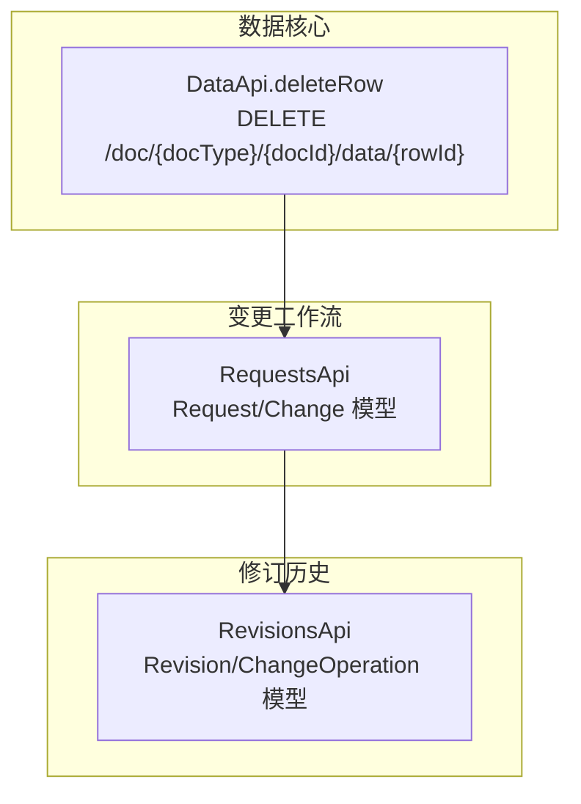
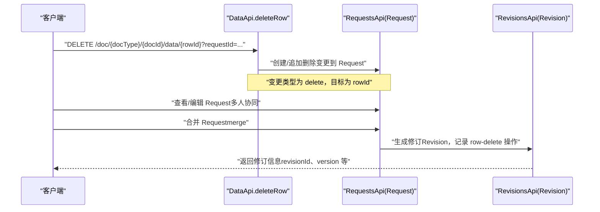
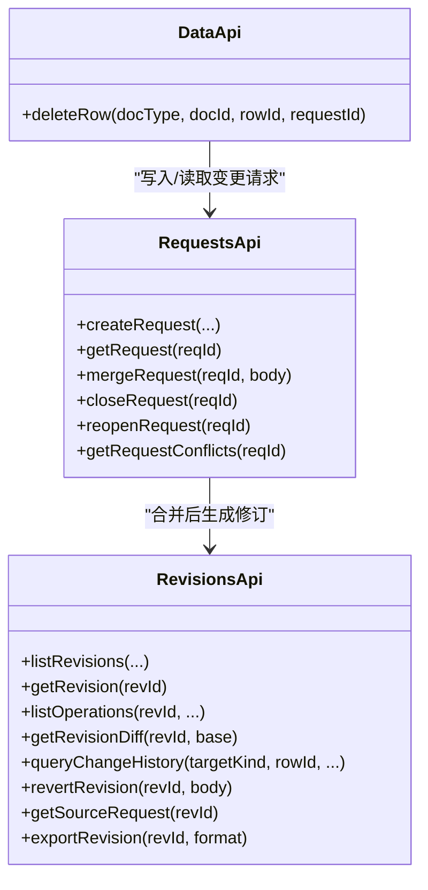
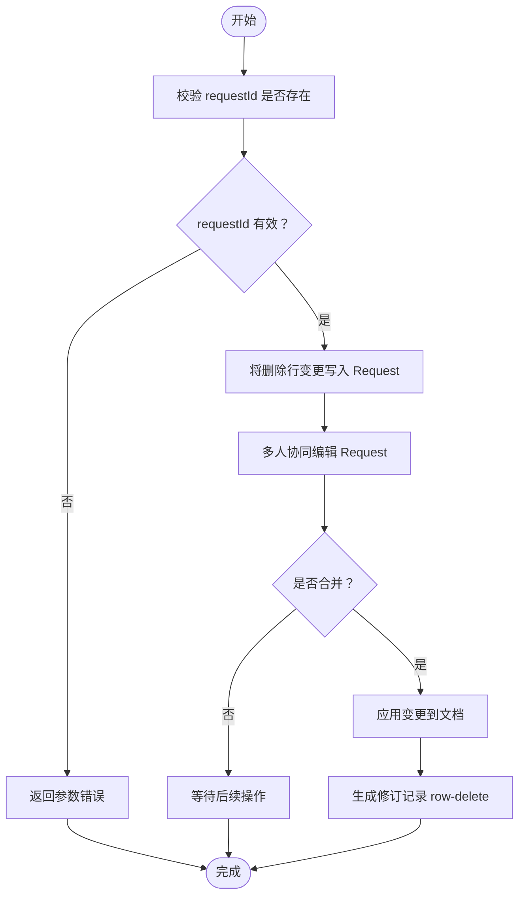

# 删除数据行

<cite>
**本文引用的文件**
- [api/document/core/data.tsp](file://api/document/core/data.tsp)
- [api/document/workflow/requests.tsp](file://api/document/workflow/requests.tsp)
- [api/document/workflow/revisions.tsp](file://api/document/workflow/revisions.tsp)
- [docs-src/guides/data-operations.md](file://docs-src/guides/data-operations.md)
- [docs-src/guides/document-model.md](file://docs-src/guides/document-model.md)
</cite>

## 目录
1. [简介](#简介)
2. [项目结构](#项目结构)
3. [核心组件](#核心组件)
4. [架构总览](#架构总览)
5. [详细组件分析](#详细组件分析)
6. [依赖分析](#依赖分析)
7. [性能考虑](#性能考虑)
8. [故障排查指南](#故障排查指南)
9. [结论](#结论)
10. [附录](#附录)

## 简介
本篇文档围绕“删除数据行”的完整流程展开，重点说明通过 DELETE /doc/{docType}/{docId}/data/{rowId} 接口进行单行删除的操作路径。删除操作必须通过 requestId 参数进入变更请求工作流，不会立即生效；服务端会将删除意图记录在变更请求中，待请求合并后才会真正删除，并生成修订历史。文档还提供 cURL 示例，对比单行删除与批量删除（bulk）的差异，并说明删除后的数据恢复机制与修订历史的关联。

## 项目结构
- 删除接口定义位于数据核心模块，删除行为与变更请求、修订历史紧密耦合。
- 变更请求模块负责记录变更意图、状态流转与合并。
- 修订历史模块负责记录合并产生的完整变更序列，支持审计、对比与回滚。

图表来源
- [api/document/core/data.tsp](file://api/document/core/data.tsp#L708-L725)
- [api/document/workflow/requests.tsp](file://api/document/workflow/requests.tsp#L83-L200)
- [api/document/workflow/revisions.tsp](file://api/document/workflow/revisions.tsp#L151-L315)

章节来源
- [api/document/core/data.tsp](file://api/document/core/data.tsp#L708-L725)
- [api/document/workflow/requests.tsp](file://api/document/workflow/requests.tsp#L83-L200)
- [api/document/workflow/revisions.tsp](file://api/document/workflow/revisions.tsp#L151-L315)

## 核心组件
- 删除接口（单行）：DELETE /doc/{docType}/{docId}/data/{rowId}，参数包含 requestId，返回变更请求对象。
- 变更请求（Request）：承载待合并的变更项（Change），支持多人协同编辑与合并。
- 修订历史（Revision）：合并后生成修订，记录 row-delete 等变更操作，支持对比与回滚。

章节来源
- [api/document/core/data.tsp](file://api/document/core/data.tsp#L708-L725)
- [api/document/workflow/requests.tsp](file://api/document/workflow/requests.tsp#L83-L200)
- [api/document/workflow/revisions.tsp](file://api/document/workflow/revisions.tsp#L151-L315)

## 架构总览
删除操作的端到端流程如下：

图表来源
- [api/document/core/data.tsp](file://api/document/core/data.tsp#L708-L725)
- [api/document/workflow/requests.tsp](file://api/document/workflow/requests.tsp#L202-L391)
- [api/document/workflow/revisions.tsp](file://api/document/workflow/revisions.tsp#L316-L547)

## 详细组件分析

### 单行删除接口（DELETE /doc/{docType}/{docId}/data/{rowId}）
- 接口职责：删除指定数据行，但不立即生效，而是写入变更请求。
- 关键参数：
  - docType、docId：文档类型与文档标识。
  - rowId：要删除的行标识。
  - requestId：变更请求标识，必填，用于将删除意图写入该请求。
- 返回：变更请求对象（包含变更项、状态等）。

章节来源
- [api/document/core/data.tsp](file://api/document/core/data.tsp#L708-L725)

### 变更请求（Request）与变更项（Change）
- Request：记录待合并的变更集合，支持 open/merged/closed 三种状态。
- Change：单个变更项，包含类型（create/update/delete）、目标（targetId）、数据等。
- 删除行属于 operation 为 delete 的变更项，目标为 rowId。

章节来源
- [api/document/workflow/requests.tsp](file://api/document/workflow/requests.tsp#L35-L82)
- [api/document/workflow/requests.tsp](file://api/document/workflow/requests.tsp#L83-L200)

### 合并与修订（Merge & Revision）
- 合并（merge）：当请求被合并时，系统冻结请求中的所有变更，应用到文档并生成修订。
- 修订（Revision）：记录一次完整的变更集合，包含变更操作（ChangeOperation），支持统计与对比。
- 删除行在修订中体现为 row-delete 类型的变更操作。

章节来源
- [api/document/workflow/requests.tsp](file://api/document/workflow/requests.tsp#L202-L391)
- [api/document/workflow/revisions.tsp](file://api/document/workflow/revisions.tsp#L151-L315)
- [api/document/workflow/revisions.tsp](file://api/document/workflow/revisions.tsp#L316-L547)

### 删除意图记录与合并后执行
- 删除意图：deleteRow 接口将删除行的变更写入 Request；此时数据仍存在，仅在请求层面标记删除。
- 合并生效：合并请求后，系统应用变更，删除行从生产数据中移除，并生成修订记录。
- 叠加读取：若在查询时携带 requestId，则返回“生产数据 + Request 变更”的叠加视图，删除行在叠加视图中不再可见。

章节来源
- [api/document/core/data.tsp](file://api/document/core/data.tsp#L375-L418)
- [api/document/core/data.tsp](file://api/document/core/data.tsp#L708-L725)
- [api/document/workflow/requests.tsp](file://api/document/workflow/requests.tsp#L202-L391)

### cURL 使用示例（单行删除）
- 使用 DELETE /doc/{docType}/{docId}/data/{rowId}，携带 ?requestId=...
- 示例路径参考：[docs-src/guides/data-operations.md](file://docs-src/guides/data-operations.md#L136-L155)

章节来源
- [docs-src/guides/data-operations.md](file://docs-src/guides/data-operations.md#L136-L155)

### 与批量删除（bulk）的差异
- 单行删除：DELETE /doc/{docType}/{docId}/data/{rowId}?requestId=...
- 批量删除：POST /doc/{docType}/{docId}/data/bulk（支持批量删除多行，同样需 requestId）
- 两者均不直接写入生产数据，而是写入变更请求；批量删除适合一次性删除多行，提升效率。

章节来源
- [docs-src/guides/data-operations.md](file://docs-src/guides/data-operations.md#L136-L155)
- [docs-src/guides/document-model.md](file://docs-src/guides/document-model.md#L239-L250)

### 删除后的数据恢复机制与修订历史关联
- 修订记录：合并后生成 Revision，记录 row-delete 等操作，支持查看变更历史与对比差异。
- 回滚能力：可通过 RevisionsApi.revertRevision 将文档回滚到指定修订，从而恢复被删除的行。
- 历史追踪：RevisionsApi.listOperations、RevisionsApi.getRevisionDiff 等接口可用于定位删除发生的具体变更。

章节来源
- [api/document/workflow/revisions.tsp](file://api/document/workflow/revisions.tsp#L316-L547)

## 依赖分析
- 删除接口依赖变更请求模块，用于记录删除意图。
- 合并请求后依赖修订历史模块，用于生成修订并记录删除操作。
- 查询接口支持通过 requestId 叠加读取，使删除在“预览视图”中即时可见。

图表来源
- [api/document/core/data.tsp](file://api/document/core/data.tsp#L708-L725)
- [api/document/workflow/requests.tsp](file://api/document/workflow/requests.tsp#L202-L391)
- [api/document/workflow/revisions.tsp](file://api/document/workflow/revisions.tsp#L316-L547)

章节来源
- [api/document/core/data.tsp](file://api/document/core/data.tsp#L708-L725)
- [api/document/workflow/requests.tsp](file://api/document/workflow/requests.tsp#L202-L391)
- [api/document/workflow/revisions.tsp](file://api/document/workflow/revisions.tsp#L316-L547)

## 性能考虑
- 批量删除优于多次单行删除，减少请求次数与合并成本。
- 删除前建议先通过查询接口叠加读取（携带 requestId）确认影响范围，避免误删。
- 合并请求时尽量合并同类项，减少修订体量与对比复杂度。

## 故障排查指南
- 缺失 requestId：删除接口要求携带 requestId，否则无法写入变更请求。
- 请求不存在：合并请求前需确保 requestId 有效。
- 请求已合并：重复合并同一请求会导致冲突。
- 冲突检测：合并前可调用冲突检查接口评估风险。

章节来源
- [docs-src/guides/data-operations.md](file://docs-src/guides/data-operations.md#L213-L233)
- [api/document/workflow/requests.tsp](file://api/document/workflow/requests.tsp#L202-L391)

## 结论
- 删除数据行必须通过 requestId 进入变更请求工作流，不会立即生效。
- 服务端记录删除意图，合并后才真正删除，并生成修订历史。
- 单行删除与批量删除均遵循相同工作流；批量删除适合多行场景。
- 删除后的数据可通过修订历史回滚恢复，具备完整的审计与追踪能力。

## 附录

### 删除流程算法（概念流程图）

[本图为概念流程示意，不直接映射具体代码文件]