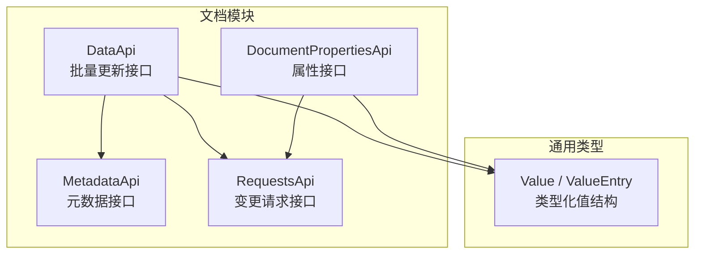
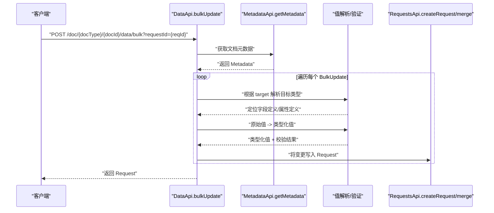
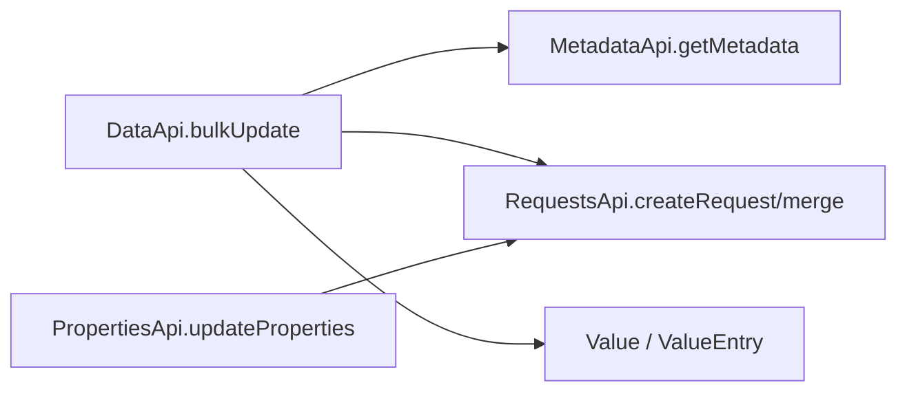

# 批量更新

<cite>
**本文引用的文件**
- [api/document/core/data.tsp](file://api/document/core/data.tsp)
- [api/document/core/metadata.tsp](file://api/document/core/metadata.tsp)
- [api/document/core/properties.tsp](file://api/document/core/properties.tsp)
- [api/document/workflow/requests.tsp](file://api/document/workflow/requests.tsp)
- [api/shared/common.tsp](file://api/shared/common.tsp)
- [docs-src/references/field-types.md](file://docs-src/references/field-types.md)
</cite>

## 目录
1. [简介](#简介)
2. [项目结构](#项目结构)
3. [核心组件](#核心组件)
4. [架构总览](#架构总览)
5. [详细组件分析](#详细组件分析)
6. [依赖分析](#依赖分析)
7. [性能考虑](#性能考虑)
8. [故障排查指南](#故障排查指南)
9. [结论](#结论)
10. [附录](#附录)

## 简介
本篇文档围绕“批量更新”能力展开，系统阐述 BulkUpdate 模型的灵活设计与服务端处理流程，涵盖：
- target 字段的多种指定方式（单行、多行、字段、属性、按条件等）
- value 字段的多种数据格式（单值、对象、数组）
- 服务端如何基于文档 metadata 解析原始值并转换为类型化值
- 数据有效性验证与变更写入变更请求（Request）的完整流程
- 多种使用场景示例（单字段、整行、多行同一字段、多行不同值、属性、混合更新）
- 如何统一处理数据与属性的更新操作

## 项目结构
批量更新能力位于文档模块的“数据层”，通过统一的批量更新接口对接“元数据层”和“工作流层”，并复用“通用类型层”的值结构。

图表来源
- [api/document/core/data.tsp](file://api/document/core/data.tsp#L476-L569)
- [api/document/core/metadata.tsp](file://api/document/core/metadata.tsp#L183-L211)
- [api/document/core/properties.tsp](file://api/document/core/properties.tsp#L200-L441)
- [api/document/workflow/requests.tsp](file://api/document/workflow/requests.tsp#L202-L391)
- [api/shared/common.tsp](file://api/shared/common.tsp#L544-L576)

章节来源
- [api/document/core/data.tsp](file://api/document/core/data.tsp#L476-L569)
- [api/document/core/metadata.tsp](file://api/document/core/metadata.tsp#L183-L211)
- [api/document/core/properties.tsp](file://api/document/core/properties.tsp#L200-L441)
- [api/document/workflow/requests.tsp](file://api/document/workflow/requests.tsp#L202-L391)
- [api/shared/common.tsp](file://api/shared/common.tsp#L544-L576)

## 核心组件
- BulkUpdate：批量更新项模型，定义 target 与 value 的灵活结构
- DataApi.bulkUpdate：统一入口，接收 BulkUpdate[]，返回 Request
- Metadata：提供字段定义与类型信息，驱动值解析与验证
- Value / ValueEntry：类型化值结构，承载各字段类型的值容器
- Request：变更请求模型，承载变更项并支持合并生效

章节来源
- [api/document/core/data.tsp](file://api/document/core/data.tsp#L189-L239)
- [api/document/core/data.tsp](file://api/document/core/data.tsp#L476-L569)
- [api/document/core/metadata.tsp](file://api/document/core/metadata.tsp#L160-L181)
- [api/shared/common.tsp](file://api/shared/common.tsp#L544-L576)
- [api/document/workflow/requests.tsp](file://api/document/workflow/requests.tsp#L83-L200)

## 架构总览
批量更新的整体流程如下：

图表来源
- [api/document/core/data.tsp](file://api/document/core/data.tsp#L476-L569)
- [api/document/core/metadata.tsp](file://api/document/core/metadata.tsp#L183-L211)
- [api/document/workflow/requests.tsp](file://api/document/workflow/requests.tsp#L202-L391)

## 详细组件分析

### BulkUpdate 模型与灵活设计
- target 支持多种目标指定方式：
  - 单行：{ row: "row-1" }
  - 单行单字段：{ row: "row-1", field: "price" }
  - 多行同一字段：{ rows: ["row-1","row-2"], field: "status" }
  - 单个属性：{ property: "amount" }
  - 多个属性：{ properties: true }
  - 删除单行：{ row: "row-1", delete: true }
  - 删除多行：{ rows: ["row-1","row-2"], delete: true }
  - 按条件更新：{ condition: {...}, field: "status" }
  - 按条件删除：{ condition: {...}, delete: true }
- value 支持三种数据格式：
  - 单个原始值：99.99、"iPhone 15"、true
  - 对象（多个字段）：{ price: 99.99, name: "iPhone 15" }
  - 数组（多行不同值）：[99.99, 88.88, 77.77]
- 删除操作（delete: true）不需要提供 value

章节来源
- [api/document/core/data.tsp](file://api/document/core/data.tsp#L71-L188)
- [api/document/core/data.tsp](file://api/document/core/data.tsp#L189-L239)

### 服务端处理流程（解析、验证、写入）
- 步骤概览：
  1) 根据 docId 获取 metadata
  2) 对每个 target，解析目标类型（行/属性）
  3) 查找字段定义获取类型
  4) 将原始值转换为类型化值
  5) 验证值的有效性
  6) 添加到指定的 Request
- 元数据来源：
  - 字段定义：Field.type、Field.validations、Field.selectOptions 等
  - 属性定义：Metadata.properties（文档级属性字段定义）
- 类型化值来源：
  - Value.union 与 ValueEntry.value 用于承载各字段类型的值
- 变更写入：
  - 所有更新均进入变更请求（Request），支持多人协同编辑与审批合并

章节来源
- [api/document/core/data.tsp](file://api/document/core/data.tsp#L476-L569)
- [api/document/core/metadata.tsp](file://api/document/core/metadata.tsp#L160-L181)
- [api/shared/common.tsp](file://api/shared/common.tsp#L544-L576)
- [api/document/workflow/requests.tsp](file://api/document/workflow/requests.tsp#L83-L200)

### 值解析与类型转换（从原始值到类型化值）
- 原始值到类型化值的映射由字段类型决定：
  - text/long_text → {"text": string}
  - number → {"number": float64}
  - currency → {"currency": float64}
  - percent → {"percent": float64}
  - boolean → {"boolean": boolean}
  - date → {"date": string}
  - datetime → {"datetime": string}
  - single_select → {"single_select": SelectOption}
  - multi_select → {"multi_select": SelectOption[]}
  - attachment → {"attachment": Attachment[]}
  - user → {"user": UserRef}
  - collaborator → {"collaborator": CollaboratorRef}
  - relation → {"relation": RelationRef[]}
  - rating → {"rating": int32}
  - duration → {"duration": int64}
- 文档参考：字段类型与值结构的详细说明

章节来源
- [api/shared/common.tsp](file://api/shared/common.tsp#L544-L576)
- [docs-src/references/field-types.md](file://docs-src/references/field-types.md#L98-L200)

### 数据有效性验证
- 字段级验证：
  - 必填 required
  - 唯一 unique
  - 只读 readOnly
  - 自定义 validations（规则类型 + 配置 + 多语言消息）
- 选择类字段：
  - 依据 Field.selectOptions 校验选项合法性
- 日期/时间：
  - 依据 date/datetime 的字符串格式要求
- 布尔/数值/百分比/货币：
  - 依据对应类型的数值范围与精度约束
- 属性更新：
  - 属性值同样遵循上述规则，因为属性值也采用 ValueEntry.value 的类型化结构

章节来源
- [api/document/core/metadata.tsp](file://api/document/core/metadata.tsp#L54-L105)
- [api/shared/common.tsp](file://api/shared/common.tsp#L544-L576)
- [docs-src/references/field-types.md](file://docs-src/references/field-types.md#L98-L200)

### 写入变更请求（Request）
- 批量更新的所有变更最终写入 Request：
  - Request.changes 中记录变更项（类型、操作、目标ID、数据）
  - 支持 open/merged/closed 状态流转
  - 合并后生成修订（Revision）并记录贡献者
- 批量更新接口支持指定 requestId，将变更追加到既有请求或创建新请求

章节来源
- [api/document/workflow/requests.tsp](file://api/document/workflow/requests.tsp#L33-L200)
- [api/document/core/data.tsp](file://api/document/core/data.tsp#L476-L569)

### 使用场景与示例（统一处理数据与属性）
- 修改单个字段
  - target: { row: "row-1", field: "price" }, value: 99.99
- 修改整行（多个字段）
  - target: { row: "row-1" }, value: { price: 99.99, name: "iPhone 15", stock: 50 }
- 修改多行的同一字段
  - target: { rows: ["row-1","row-2","row-3"], field: "status" }, value: "active"
- 修改多行的同一字段（不同值）
  - target: { rows: ["row-1","row-2","row-3"], field: "price" }, value: [99.99, 88.88, 77.77]
- 修改单个属性
  - target: { property: "amount" }, value: 5000.00
- 修改多个属性
  - target: { properties: true }, value: { amount: 5000.00, quantity: 100, date: "2024-12-05" }
- 删除单行
  - target: { row: "row-1", delete: true }
- 按条件删除
  - target: { condition: { logic: "and", conditions: [{ field: "status", operator: "eq", value: "inactive" }] }, delete: true }
- 按条件更新
  - target: { condition: { logic: "and", conditions: [{ field: "status", operator: "eq", value: "pending" }] }, field: "reviewStatus" }, value: "reviewing"
- 混合更新（数据 + 属性）
  - 两条 BulkUpdate：一条针对行字段，一条针对属性

章节来源
- [api/document/core/data.tsp](file://api/document/core/data.tsp#L96-L188)
- [api/document/core/data.tsp](file://api/document/core/data.tsp#L476-L569)
- [api/document/core/properties.tsp](file://api/document/core/properties.tsp#L33-L62)

### 统一处理数据与属性的更新
- 数据更新（行字段）与属性更新（文档级）共享同一批量更新入口：
  - target 支持 row/rows/property/properties/condition/delete 等多种形态
  - value 支持单值、对象、数组三种形态
  - 服务端根据 metadata 自动解析类型并写入 Request
- 属性更新也可通过统一接口完成，避免重复实现

章节来源
- [api/document/core/data.tsp](file://api/document/core/data.tsp#L189-L239)
- [api/document/core/properties.tsp](file://api/document/core/properties.tsp#L33-L62)

## 依赖分析
- 组件耦合与内聚
  - DataApi.bulkUpdate 依赖 MetadataApi.getMetadata 与 Request 接口
  - 值结构依赖 shared.common.Value / ValueEntry
  - 属性更新与数据更新在接口层面统一，降低重复实现
- 外部依赖与集成点
  - OpenAPI 生成：TypeSpec 定义统一导出 OpenAPI，便于客户端生成与测试
  - 错误码与响应格式：统一 ApiResponse 与 ErrorCode

图表来源
- [api/document/core/data.tsp](file://api/document/core/data.tsp#L476-L569)
- [api/document/core/metadata.tsp](file://api/document/core/metadata.tsp#L183-L211)
- [api/document/workflow/requests.tsp](file://api/document/workflow/requests.tsp#L202-L391)
- [api/shared/common.tsp](file://api/shared/common.tsp#L544-L576)

章节来源
- [api/document/core/data.tsp](file://api/document/core/data.tsp#L476-L569)
- [api/document/core/metadata.tsp](file://api/document/core/metadata.tsp#L183-L211)
- [api/document/workflow/requests.tsp](file://api/document/workflow/requests.tsp#L202-L391)
- [api/shared/common.tsp](file://api/shared/common.tsp#L544-L576)

## 性能考虑
- 批量更新的批量性体现在一次请求中提交多条变更，减少往返次数
- 服务端解析与验证发生在单次请求内，建议：
  - 控制单次批量更新的条目数量，避免过长的处理链路
  - 对大数组（多行不同值）的场景，注意内存占用与序列化成本
  - 合理使用 requestId，将相关变更合并到同一 Request，减少后续合并成本

## 故障排查指南
- 常见错误码
  - DOC_NOT_FOUND / DOC_TYPE_UNKNOWN：文档不存在或类型未知
  - FIELD_TYPE_MISMATCH：字段类型不匹配
  - CONSTRAINT_VIOLATION：违反字段约束（必填、唯一、只读等）
  - REQUEST_NOT_FOUND / REQUEST_CONFLICT / REQUEST_ALREADY_CLOSED：变更请求状态异常
- 建议排查步骤
  - 确认 docId/docType 正确
  - 检查 target 的形态是否符合预期（row/rows/property/properties/condition/delete）
  - 检查 value 的原始格式与字段类型是否匹配
  - 若涉及属性更新，确认 Metadata.properties 中存在对应字段定义
  - 若涉及条件更新/删除，确认 condition 的逻辑与字段运算符正确

章节来源
- [api/shared/common.tsp](file://api/shared/common.tsp#L80-L152)
- [api/document/core/metadata.tsp](file://api/document/core/metadata.tsp#L160-L181)
- [api/document/workflow/requests.tsp](file://api/document/workflow/requests.tsp#L202-L391)

## 结论
批量更新通过统一的 BulkUpdate 模型与服务端解析流程，实现了对数据行字段与文档属性的统一更新入口。其灵活性体现在 target 的多样化与 value 的多形态；其可靠性体现在基于 metadata 的类型解析、严格的字段验证与变更请求的协同工作流。通过 requestId 与 Request 的设计，批量更新既满足高效提交，又保障了变更的可控与可追溯。

## 附录
- 字段类型与值结构参考：见字段类型文档
- 批量更新接口参考：见 DataApi.bulkUpdate 与 PropertiesApi.updateProperties

章节来源
- [docs-src/references/field-types.md](file://docs-src/references/field-types.md#L98-L200)
- [api/document/core/data.tsp](file://api/document/core/data.tsp#L476-L569)
- [api/document/core/properties.tsp](file://api/document/core/properties.tsp#L339-L376)