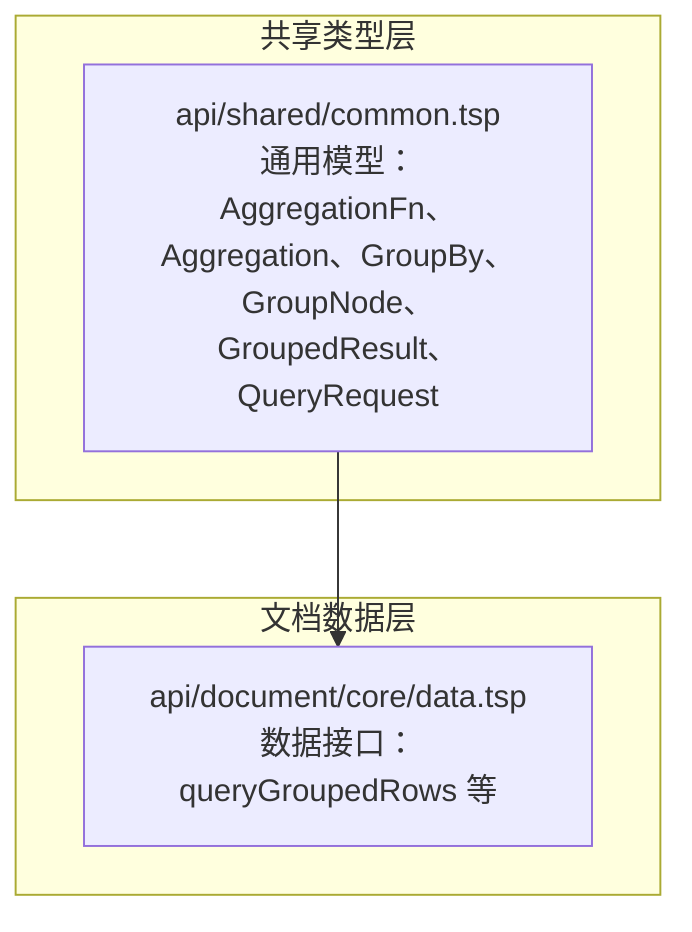
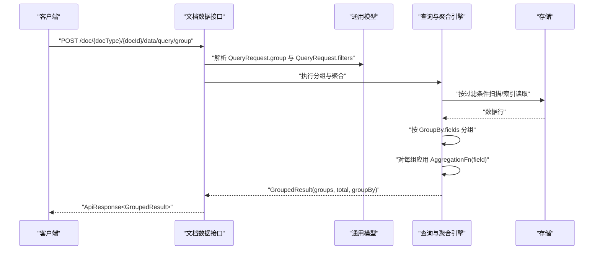
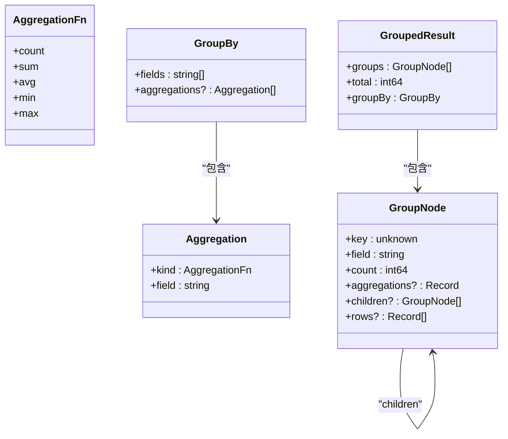
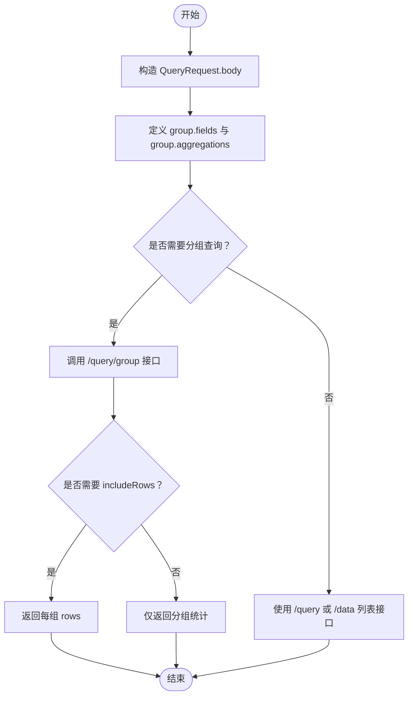
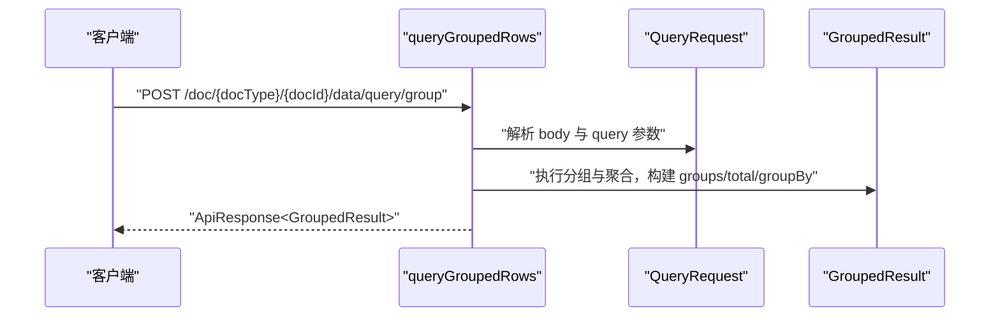
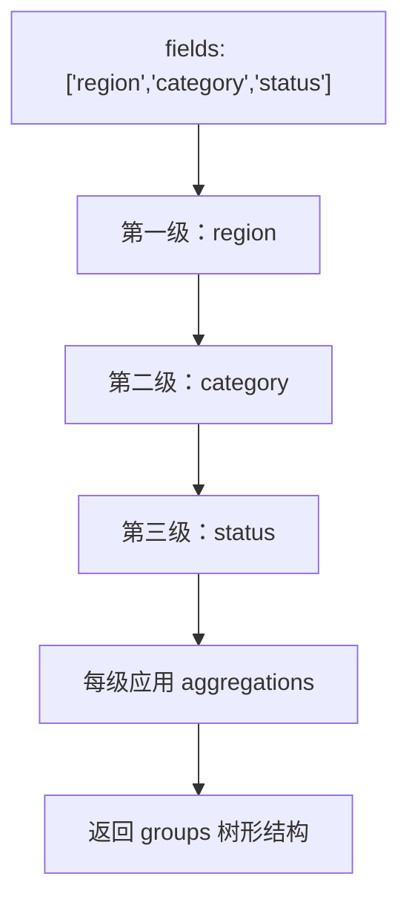
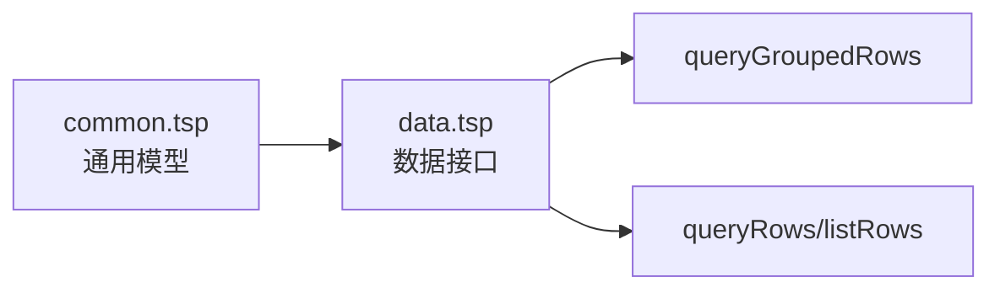

# 分组与聚合

<cite>
**本文引用的文件**
- [api/shared/common.tsp](file://api/shared/common.tsp)
- [api/document/core/data.tsp](file://api/document/core/data.tsp)
- [docs-src/guides/data-operations.md](file://docs-src/guides/data-operations.md)
</cite>

## 目录
1. [简介](#简介)
2. [项目结构](#项目结构)
3. [核心组件](#核心组件)
4. [架构概览](#架构概览)
5. [详细组件分析](#详细组件分析)
6. [依赖分析](#依赖分析)
7. [性能考虑](#性能考虑)
8. [故障排查指南](#故障排查指南)
9. [结论](#结论)
10. [附录](#附录)

## 简介
本章节面向希望在文档数据上进行“分组与聚合”的开发者，系统性说明分组模型、聚合函数、查询请求的定义方式，以及服务端如何执行分组聚合操作。重点覆盖：
- GroupBy 模型的结构与使用方法（分组字段、聚合函数）
- 在 QueryRequest 中如何定义分组条件与聚合计算，支持多维度分组与多种聚合函数组合
- 实际 API 调用示例，展示分组统计的构建方式
- 分组聚合查询的性能特点与适用场景，以及与简单列表查询的差异
- 服务端执行分组聚合的流程与关键点

## 项目结构
分组与聚合能力由 TypeSpec 定义的公共类型与文档数据模块共同构成：
- 公共类型层：在共享模块中定义通用的分组、聚合、查询请求与结果模型
- 文档数据层：在文档核心模块中暴露分组查询接口，并将其与通用模型绑定

**图表来源**
- [api/shared/common.tsp](file://api/shared/common.tsp#L297-L518)
- [api/document/core/data.tsp](file://api/document/core/data.tsp#L319-L536)

**章节来源**
- [api/shared/common.tsp](file://api/shared/common.tsp#L297-L518)
- [api/document/core/data.tsp](file://api/document/core/data.tsp#L319-L536)

## 核心组件
- 聚合函数枚举：count、sum、avg、min、max
- 聚合定义：Aggregation（包含 kind 与 field）
- 分组定义：GroupBy（fields 为分组字段数组；aggregations 为聚合函数集合）
- 分组结果节点：GroupNode（包含 key、field、count、aggregations、children、rows）
- 分组查询结果：GroupedResult（groups、total、groupBy）

这些模型共同构成分组与聚合的请求与响应契约，支撑多维分组与树形结果返回。

**章节来源**
- [api/shared/common.tsp](file://api/shared/common.tsp#L297-L518)

## 架构概览
下图展示了从客户端发起分组查询到服务端返回树形分组结果的整体流程。

**图表来源**
- [api/document/core/data.tsp](file://api/document/core/data.tsp#L443-L536)
- [api/shared/common.tsp](file://api/shared/common.tsp#L297-L518)

## 详细组件分析

### GroupBy 模型与聚合函数
- 分组字段（fields）：按顺序定义分组层级，第一个字段为第一级，第二个为第二级，依此类推
- 聚合函数（aggregations）：支持 count、sum、avg、min、max；当 field 为 "*" 时表示对计数的聚合
- 命名约定：聚合结果键名遵循 {function}_{field} 的命名规则，便于客户端识别

**图表来源**
- [api/shared/common.tsp](file://api/shared/common.tsp#L297-L518)

**章节来源**
- [api/shared/common.tsp](file://api/shared/common.tsp#L297-L518)

### QueryRequest 中的分组与聚合
- QueryRequest 支持 filters、sorts、page、pageSize、cursor 等通用查询参数
- 新增 group 字段：用于定义分组与聚合
- 当需要分组查询时，应使用专用的分组查询接口，而非通用查询接口

**图表来源**
- [api/document/core/data.tsp](file://api/document/core/data.tsp#L319-L536)

**章节来源**
- [api/document/core/data.tsp](file://api/document/core/data.tsp#L319-L536)

### 分组查询接口与返回结构
- 接口：POST /doc/{docType}/{docId}/data/query/group
- 请求体：QueryRequest（包含 filters、sorts、group、page、pageSize、cursor）
- 查询参数：
  - requestId：获取叠加后的数据视图（生产数据 + Request 变更）
  - includeChanges：在叠加视图下包含变更标记
  - includeRows：在分组结果中返回每组的实际数据行
- 返回：ApiResponse<GroupedResult>，包含 groups（树形分组）、total（总行数）、groupBy（分组定义）

**图表来源**
- [api/document/core/data.tsp](file://api/document/core/data.tsp#L443-L536)

**章节来源**
- [api/document/core/data.tsp](file://api/document/core/data.tsp#L443-L536)

### 多维度分组与聚合组合示例
- 单级分组：fields = ["category"]，aggregations = [{kind: count, field: "*"}, {kind: sum, field: "amount"}]
- 二级分组：fields = ["region", "category"]，aggregations = [{kind: count, field: "*"}, {kind: sum, field: "revenue"}]
- 三级分组：fields = ["region", "category", "status"]，aggregations = [{kind: count, field: "*"}]
- 返回结构：顶层 groups 为第一级分组节点列表；每个节点包含 key、field、count、aggregations、children（下一级分组）、rows（可选）

**图表来源**
- [api/document/core/data.tsp](file://api/document/core/data.tsp#L443-L536)
- [api/shared/common.tsp](file://api/shared/common.tsp#L319-L518)

**章节来源**
- [api/document/core/data.tsp](file://api/document/core/data.tsp#L443-L536)
- [api/shared/common.tsp](file://api/shared/common.tsp#L319-L518)

### 与简单列表查询的差异
- 简单列表查询：返回 Page<Row>，适合逐行浏览与分页
- 分组查询：返回 GroupedResult，返回树形分组与聚合统计，适合汇总分析与多维透视
- 列表查询支持 filters、sorts、page、pageSize、cursor；分组查询在 QueryRequest 中新增 group 字段
- 分组查询支持 includeRows 参数，可在最后一级或明确请求时返回每组数据行

**章节来源**
- [api/document/core/data.tsp](file://api/document/core/data.tsp#L319-L536)

## 依赖分析
- 文档数据模块依赖共享模块的通用模型（AggregationFn、Aggregation、GroupBy、GroupNode、GroupedResult、QueryRequest）
- 分组查询接口与通用查询接口分离，避免将分组语义混入列表查询

**图表来源**
- [api/shared/common.tsp](file://api/shared/common.tsp#L297-L518)
- [api/document/core/data.tsp](file://api/document/core/data.tsp#L319-L536)

**章节来源**
- [api/shared/common.tsp](file://api/shared/common.tsp#L297-L518)
- [api/document/core/data.tsp](file://api/document/core/data.tsp#L319-L536)

## 性能考虑
- 过滤先行：在 QueryRequest.filters 中尽可能缩小数据集，减少分组与聚合的计算量
- 合理分页：分组查询支持 page、pageSize、cursor；建议结合 filters 控制返回规模
- includeRows 的权衡：includeRows 会在最后一级或明确请求时返回每组数据行，可能显著增加响应体积与序列化开销
- 聚合函数选择：count、sum、avg、min、max 的计算复杂度与字段类型有关，数值型字段更适合 sum/avg/min/max
- 索引与扫描：服务端会基于 filters 与分组字段进行索引或扫描，建议在高频分组字段上建立合适索引（实现依赖服务端策略）

[本节为通用性能指导，不直接分析具体文件]

## 故障排查指南
- 未使用分组查询接口：若需要分组与聚合，请使用 /query/group 接口，不要在通用查询接口中传递 group 字段
- includeRows 未生效：includeRows 通常在最后一级分组或明确请求时返回；确认请求参数与分组层级
- 聚合命名不一致：聚合结果键名遵循 {function}_{field} 的命名规则；若出现键名异常，检查 Aggregation.field 与聚合函数
- 叠加视图与变更标记：通过 requestId 获取叠加视图，通过 includeChanges 获取变更标记；确认请求参数与变更请求状态

**章节来源**
- [api/document/core/data.tsp](file://api/document/core/data.tsp#L443-L536)

## 结论
分组与聚合通过通用模型与专用接口实现，具备以下特点：
- 支持多维度分组与多种聚合函数组合
- 返回树形分组结果，便于多层透视与汇总
- 与简单列表查询解耦，职责清晰
- 通过 filters、page、pageSize、cursor、includeRows 等参数灵活控制性能与返回内容

[本节为总结性内容，不直接分析具体文件]

## 附录

### API 调用示例（路径与要点）
- 分组查询接口
  - 方法与路径：POST /doc/{docType}/{docId}/data/query/group
  - 请求体：QueryRequest（包含 filters、sorts、group、page、pageSize、cursor）
  - 查询参数：requestId、includeChanges、includeRows
  - 返回：ApiResponse<GroupedResult>
- 叠加视图
  - 通过 requestId 获取生产数据 + Request 变更的叠加视图
  - 通过 includeChanges 在叠加视图下包含变更标记
- includeRows
  - 在分组结果中返回每组的实际数据行，通常在最后一级或明确请求时返回

**章节来源**
- [api/document/core/data.tsp](file://api/document/core/data.tsp#L443-L536)

### 与 data-operations.md 的关系
- data-operations.md 提供了数据行的基本 CRUD、批量更新与变更请求工作流说明
- 分组与聚合属于高级查询能力，与数据行操作同属文档数据模块，但使用独立接口与模型

**章节来源**
- [docs-src/guides/data-operations.md](file://docs-src/guides/data-operations.md#L1-L403)