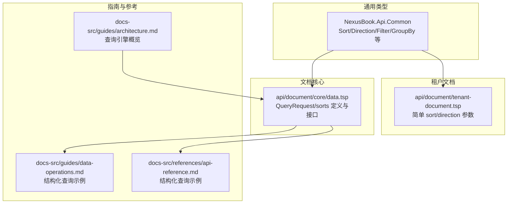
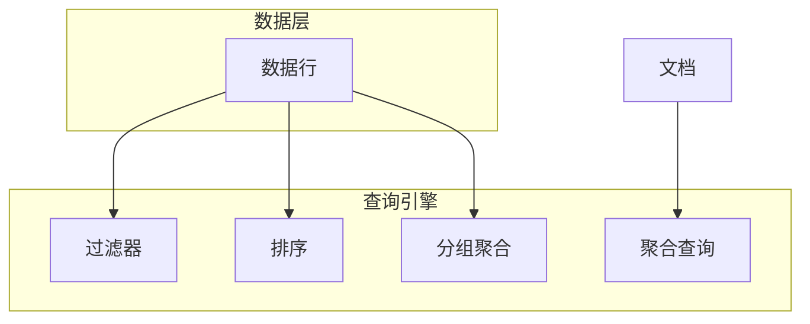
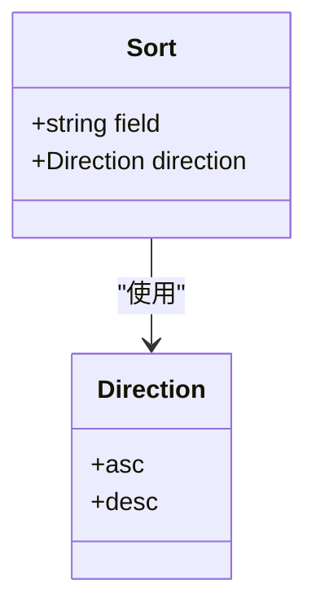
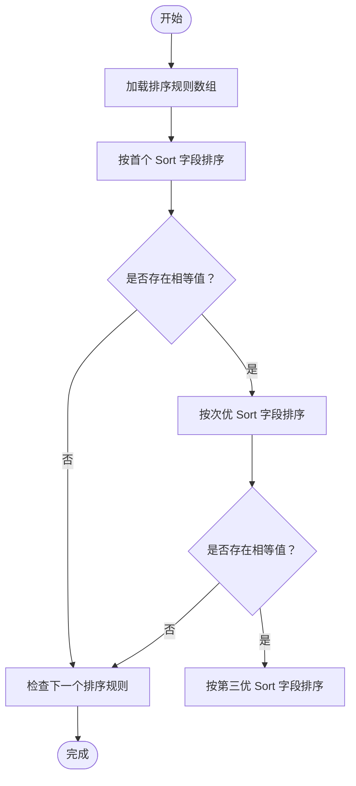
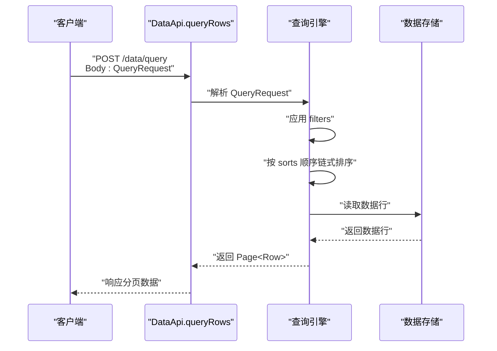
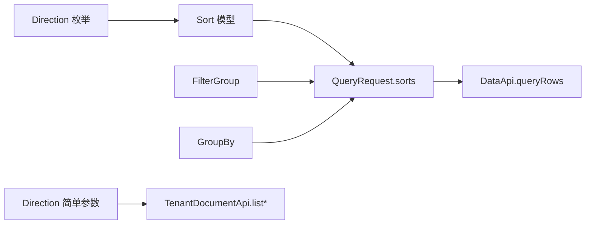

# 排序规则

<cite>
**本文引用的文件**
- [api/document/core/data.tsp](file://api/document/core/data.tsp)
- [api/shared/common.tsp](file://api/shared/common.tsp)
- [docs-src/guides/data-operations.md](file://docs-src/guides/data-operations.md)
- [docs-src/references/api-reference.md](file://docs-src/references/api-reference.md)
- [docs-src/guides/architecture.md](file://docs-src/guides/architecture.md)
- [api/document/tenant-document.tsp](file://api/document/tenant-document.tsp)
</cite>

## 目录
1. [简介](#简介)
2. [项目结构](#项目结构)
3. [核心组件](#核心组件)
4. [架构概览](#架构概览)
5. [详细组件分析](#详细组件分析)
6. [依赖分析](#依赖分析)
7. [性能考虑](#性能考虑)
8. [故障排查指南](#故障排查指南)
9. [结论](#结论)
10. [附录](#附录)

## 简介
本章节聚焦于排序规则功能的设计与实现，围绕以下目标展开：
- 解释 Sort 模型的组成：字段名与排序方向（升序/降序）的定义
- 说明如何在 QueryRequest 中指定单字段与多字段排序，并阐述排序优先级的处理方式
- 提供实际 API 调用示例，展示多字段排序的构建方法
- 对比排序功能与 URL 查询字符串参数中简单 sort 的差异及性能影响
- 结合 data.tsp 中的 sorts 字段定义与 data-operations.md 示例，说明服务端如何处理排序请求

## 项目结构
排序规则涉及的代码主要分布在以下文件：
- 通用查询模型与排序方向定义：api/shared/common.tsp
- 数据行查询接口与 QueryRequest 定义：api/document/core/data.tsp
- 文档列表接口的简单排序参数：api/document/tenant-document.tsp
- 使用示例与结构化查询示例：docs-src/guides/data-operations.md、docs-src/references/api-reference.md
- 架构图中对查询引擎的说明：docs-src/guides/architecture.md

图表来源
- [api/shared/common.tsp](file://api/shared/common.tsp#L205-L232)
- [api/document/core/data.tsp](file://api/document/core/data.tsp#L319-L373)
- [api/document/tenant-document.tsp](file://api/document/tenant-document.tsp#L394-L417)
- [docs-src/guides/data-operations.md](file://docs-src/guides/data-operations.md#L85-L103)
- [docs-src/references/api-reference.md](file://docs-src/references/api-reference.md#L227-L247)
- [docs-src/guides/architecture.md](file://docs-src/guides/architecture.md#L7-L68)

章节来源
- [api/shared/common.tsp](file://api/shared/common.tsp#L205-L232)
- [api/document/core/data.tsp](file://api/document/core/data.tsp#L319-L373)
- [api/document/tenant-document.tsp](file://api/document/tenant-document.tsp#L394-L417)
- [docs-src/guides/data-operations.md](file://docs-src/guides/data-operations.md#L85-L103)
- [docs-src/references/api-reference.md](file://docs-src/references/api-reference.md#L227-L247)
- [docs-src/guides/architecture.md](file://docs-src/guides/architecture.md#L7-L68)

## 核心组件
- Sort 模型
  - 字段名：field（string）
  - 排序方向：direction（Direction 枚举，asc/desc）
- Direction 枚举
  - asc：升序
  - desc：降序
- QueryRequest
  - sorts：Sort[]（可选），用于声明多字段排序规则
  - filters：FilterGroup（可选），用于过滤
  - group：GroupBy（可选），用于分组与聚合
  - page/pageSize/cursor：分页参数
- 文档列表接口的简单排序参数
  - sort：string（默认值 updatedAt）
  - direction：Direction（默认值 desc）

章节来源
- [api/shared/common.tsp](file://api/shared/common.tsp#L205-L232)
- [api/document/core/data.tsp](file://api/document/core/data.tsp#L319-L373)
- [api/document/tenant-document.tsp](file://api/document/tenant-document.tsp#L394-L417)

## 架构概览
排序能力属于查询引擎的一部分，与过滤、分组、聚合共同构成强大的查询子系统。

图表来源
- [docs-src/guides/architecture.md](file://docs-src/guides/architecture.md#L7-L68)

章节来源
- [docs-src/guides/architecture.md](file://docs-src/guides/architecture.md#L7-L68)

## 详细组件分析

### Sort 模型与 Direction 枚举
- Sort 字段
  - field：排序依据的字段名，字符串类型
  - direction：排序方向，取值来自 Direction 枚举
- Direction 枚举
  - asc：升序
  - desc：降序

图表来源
- [api/shared/common.tsp](file://api/shared/common.tsp#L205-L232)

章节来源
- [api/shared/common.tsp](file://api/shared/common.tsp#L205-L232)

### QueryRequest 与排序优先级
- QueryRequest 中的 sorts 字段为 Sort[]，即多字段排序规则数组
- 排序优先级遵循数组顺序：先按第一个 Sort 字段排序；若值相等，则按第二个 Sort 字段排序，依此类推
- 该优先级关系在服务端执行时体现为“稳定排序”的链式应用

图表来源
- [api/document/core/data.tsp](file://api/document/core/data.tsp#L319-L373)
- [api/shared/common.tsp](file://api/shared/common.tsp#L205-L232)

章节来源
- [api/document/core/data.tsp](file://api/document/core/data.tsp#L319-L373)
- [api/shared/common.tsp](file://api/shared/common.tsp#L205-L232)

### 在 QueryRequest 中指定排序
- 单字段排序
  - 在 QueryRequest.sorts 中放置一个 Sort 元素
  - 示例路径：docs-src/guides/data-operations.md 中的结构化查询示例
- 多字段排序
  - 在 QueryRequest.sorts 中放置多个 Sort 元素，顺序即优先级
  - 示例路径：docs-src/references/api-reference.md 中的结构化查询示例
- 与简单排序的区别
  - 简单排序：仅支持单字段与单方向，适用于快速列表排序
  - 结构化排序：支持多字段链式排序，适合复杂业务排序需求

章节来源
- [docs-src/guides/data-operations.md](file://docs-src/guides/data-operations.md#L85-L103)
- [docs-src/references/api-reference.md](file://docs-src/references/api-reference.md#L227-L247)
- [api/document/core/data.tsp](file://api/document/core/data.tsp#L319-L373)

### URL 查询字符串参数中的简单排序
- 文档列表接口提供简单排序参数：
  - sort：string，默认 updatedAt
  - direction：Direction，默认 desc
- 适用场景
  - 快速列表排序，无需构造复杂的 QueryRequest
- 与结构化排序的差异
  - 简单排序仅支持单字段单方向
  - 结构化排序支持多字段链式排序，优先级由数组顺序决定

章节来源
- [api/document/tenant-document.tsp](file://api/document/tenant-document.tsp#L394-L417)

### 服务端处理排序请求的流程
- 结构化查询接口
  - POST /api/v1/doc/{docType}/{docId}/data/query
  - 请求体：QueryRequest（包含 filters、sorts、group、page、pageSize、cursor）
  - 响应：分页数据 Page<Row>
- 处理要点
  - 先应用 filters 过滤
  - 再按 sorts 的顺序链式排序
  - 最后应用分页参数（page/pageSize/cursor）

图表来源
- [api/document/core/data.tsp](file://api/document/core/data.tsp#L419-L441)
- [api/document/core/data.tsp](file://api/document/core/data.tsp#L319-L373)
- [api/shared/common.tsp](file://api/shared/common.tsp#L205-L232)

章节来源
- [api/document/core/data.tsp](file://api/document/core/data.tsp#L419-L441)
- [api/document/core/data.tsp](file://api/document/core/data.tsp#L319-L373)
- [api/shared/common.tsp](file://api/shared/common.tsp#L205-L232)

### 实际 API 调用示例（多字段排序）
- 结构化查询示例（多字段排序）
  - 示例路径：docs-src/guides/data-operations.md 中的结构化查询示例
  - 示例路径：docs-src/references/api-reference.md 中的结构化查询示例
- 简单排序示例（单字段）
  - 示例路径：api/document/tenant-document.tsp 中的列表接口参数

章节来源
- [docs-src/guides/data-operations.md](file://docs-src/guides/data-operations.md#L85-L103)
- [docs-src/references/api-reference.md](file://docs-src/references/api-reference.md#L227-L247)
- [api/document/tenant-document.tsp](file://api/document/tenant-document.tsp#L394-L417)

## 依赖分析
- Sort 与 Direction 的依赖关系
  - Sort 依赖 Direction 枚举
- QueryRequest 与通用查询模型
  - QueryRequest 使用 Sort[]、FilterGroup、GroupBy 等通用类型
- 接口与模型耦合
  - DataApi.queryRows 依赖 QueryRequest
  - TenantDocumentApi 列表接口依赖简单排序参数

图表来源
- [api/shared/common.tsp](file://api/shared/common.tsp#L205-L232)
- [api/document/core/data.tsp](file://api/document/core/data.tsp#L319-L373)
- [api/document/core/data.tsp](file://api/document/core/data.tsp#L419-L441)
- [api/document/tenant-document.tsp](file://api/document/tenant-document.tsp#L394-L417)

章节来源
- [api/shared/common.tsp](file://api/shared/common.tsp#L205-L232)
- [api/document/core/data.tsp](file://api/document/core/data.tsp#L319-L373)
- [api/document/core/data.tsp](file://api/document/core/data.tsp#L419-L441)
- [api/document/tenant-document.tsp](file://api/document/tenant-document.tsp#L394-L417)

## 性能考虑
- 简单排序 vs 结构化排序
  - 简单排序：仅单字段单方向，服务端解析与执行开销较低
  - 结构化排序：多字段链式排序，排序成本随字段数增加而上升
- 建议
  - 优先使用 filters 减少数据量，再进行排序
  - 控制 sorts 字段数量，避免不必要的多字段排序
  - 合理设置 page/pageSize，避免过大的分页范围

章节来源
- [docs-src/guides/data-operations.md](file://docs-src/guides/data-operations.md#L294-L359)
- [docs-src/guides/architecture.md](file://docs-src/guides/architecture.md#L7-L68)

## 故障排查指南
- 排序字段不存在
  - 现象：排序无效或报错
  - 排查：确认字段名与文档元数据一致
- 排序方向非法
  - 现象：请求被拒绝
  - 排查：确保 direction 为 asc 或 desc
- 多字段排序优先级误解
  - 现象：排序结果不符合预期
  - 排查：核对 sorts 数组顺序，确认优先级链式关系
- 简单排序与结构化排序混用
  - 现象：行为不一致
  - 排查：明确区分两种模式的适用场景与限制

章节来源
- [api/shared/common.tsp](file://api/shared/common.tsp#L205-L232)
- [api/document/core/data.tsp](file://api/document/core/data.tsp#L319-L373)
- [api/document/tenant-document.tsp](file://api/document/tenant-document.tsp#L394-L417)

## 结论
- Sort 模型简洁明确：field + direction
- QueryRequest 的 sorts 支持多字段链式排序，优先级由数组顺序决定
- 简单排序参数适用于快速列表排序，结构化排序适用于复杂业务排序
- 服务端处理流程清晰：先过滤、再排序、最后分页
- 性能优化建议：通过 filters 缩减数据量、合理设置分页、控制排序字段数量

## 附录
- 关键路径参考
  - Sort/Direction 定义：[api/shared/common.tsp](file://api/shared/common.tsp#L205-L232)
  - QueryRequest.sorts 定义与接口：[api/document/core/data.tsp](file://api/document/core/data.tsp#L319-L373), [api/document/core/data.tsp](file://api/document/core/data.tsp#L419-L441)
  - 简单排序参数：[api/document/tenant-document.tsp](file://api/document/tenant-document.tsp#L394-L417)
  - 结构化查询示例（指南）：[docs-src/guides/data-operations.md](file://docs-src/guides/data-operations.md#L85-L103)
  - 结构化查询示例（参考）：[docs-src/references/api-reference.md](file://docs-src/references/api-reference.md#L227-L247)