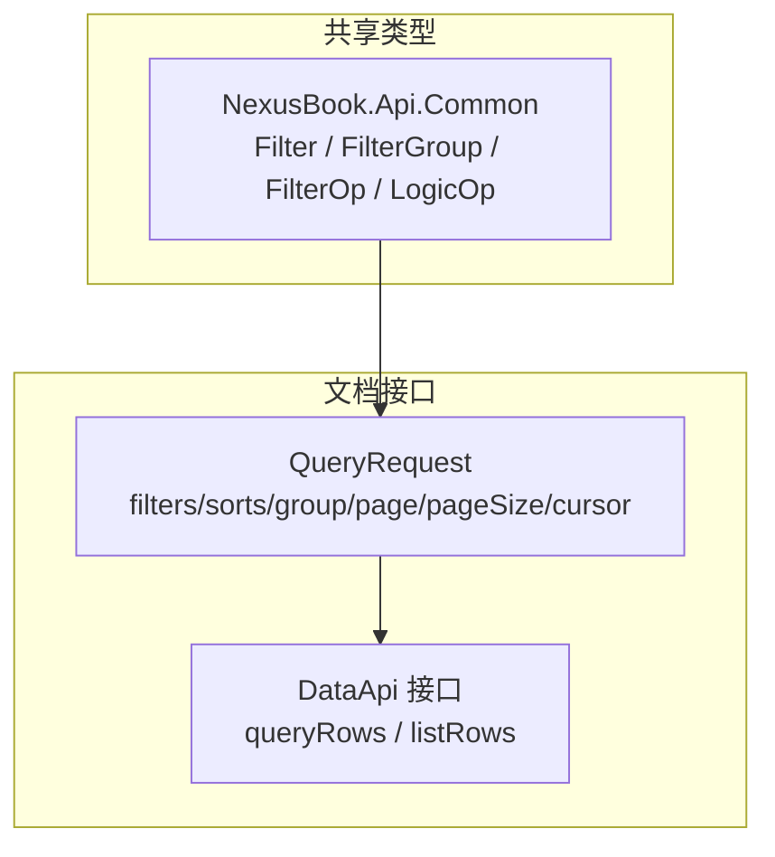
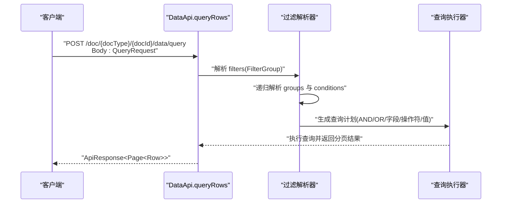
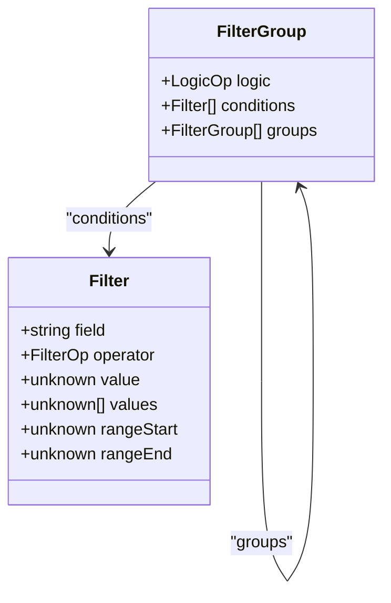
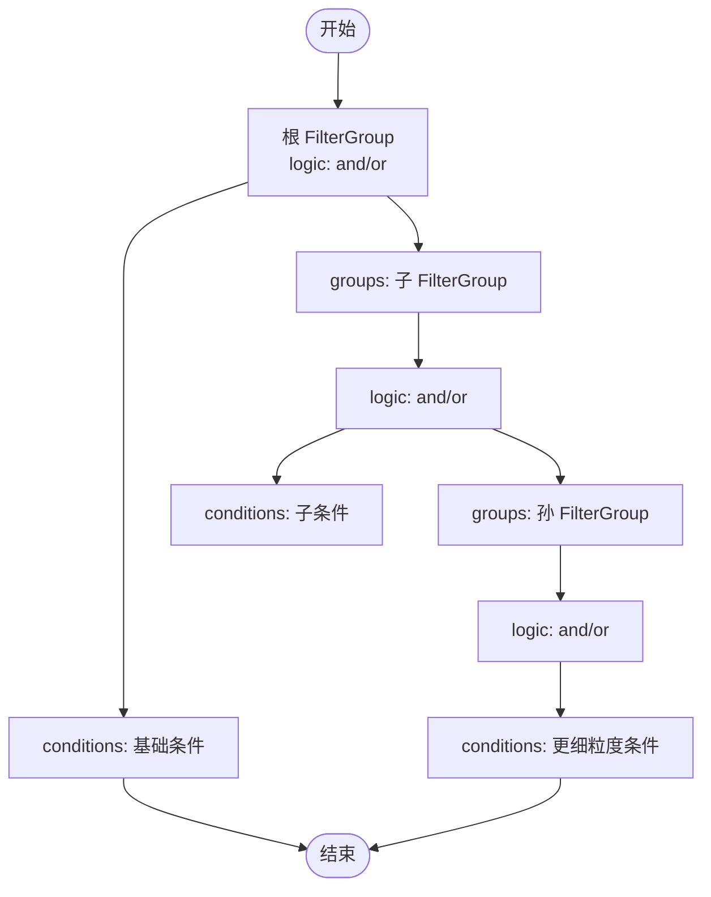
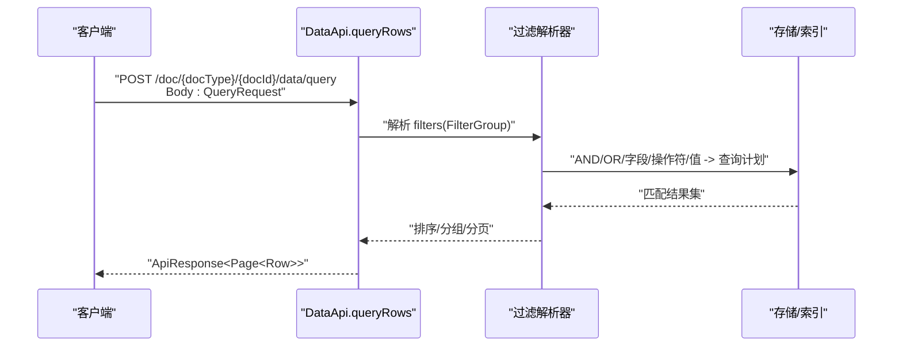
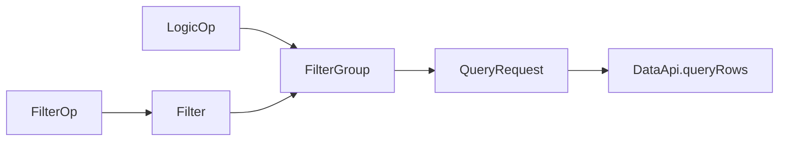

# 过滤条件

<cite>
**本文引用的文件**
- [api/shared/common.tsp](file://api/shared/common.tsp)
- [api/document/core/data.tsp](file://api/document/core/data.tsp)
- [docs-src/guides/data-operations.md](file://docs-src/guides/data-operations.md)
- [docs-src/references/api-reference.md](file://docs-src/references/api-reference.md)
</cite>

## 目录
1. [简介](#简介)
2. [项目结构](#项目结构)
3. [核心组件](#核心组件)
4. [架构概览](#架构概览)
5. [详细组件分析](#详细组件分析)
6. [依赖关系分析](#依赖关系分析)
7. [性能考量](#性能考量)
8. [故障排查指南](#故障排查指南)
9. [结论](#结论)
10. [附录](#附录)

## 简介
本章节聚焦于“过滤条件”能力，围绕 FilterGroup 模型展开，系统性说明其结构、AND/OR 逻辑组合、嵌套条件的使用方法，并给出构建复杂多层级过滤条件的实践路径。同时，对比 URL 查询字符串参数中的简单 filter 与结构化 QueryRequest 的差异与适用场景，结合 data.tsp 中的 QueryRequest 定义与 data-operations.md 的示例，说明服务端如何解析与执行这些过滤条件。

## 项目结构
过滤条件相关的核心定义位于共享类型模块，具体接口与示例在文档模块中暴露：

- 共享类型定义：Filter、FilterGroup、FilterOp、LogicOp 等
- 接口定义：DataApi.queryRows 使用 QueryRequest.body，支持 filters、sorts、group、page、pageSize、cursor
- 指南与示例：data-operations.md 提供结构化查询示例；api-reference.md 提供过滤操作符与组合说明

图表来源
- [api/shared/common.tsp](file://api/shared/common.tsp#L210-L295)
- [api/document/core/data.tsp](file://api/document/core/data.tsp#L319-L441)

章节来源
- [api/shared/common.tsp](file://api/shared/common.tsp#L210-L295)
- [api/document/core/data.tsp](file://api/document/core/data.tsp#L319-L441)

## 核心组件
- Filter：单个过滤条件，包含字段、操作符与值（单值、多值、区间起止）
- FilterGroup：过滤条件组，支持逻辑运算符（AND/OR）与嵌套组
- QueryRequest：结构化查询请求体，包含 filters、sorts、group、page、pageSize、cursor
- DataApi.queryRows：接收 QueryRequest.body，执行复杂查询

章节来源
- [api/shared/common.tsp](file://api/shared/common.tsp#L210-L295)
- [api/document/core/data.tsp](file://api/document/core/data.tsp#L319-L441)

## 架构概览
下图展示了从客户端发起结构化查询到服务端解析执行过滤条件的整体流程。

图表来源
- [api/document/core/data.tsp](file://api/document/core/data.tsp#L432-L441)
- [api/shared/common.tsp](file://api/shared/common.tsp#L210-L295)

## 详细组件分析

### FilterGroup 模型与结构
- 逻辑运算符：logic ∈ {and, or}
- 条件集合：conditions: Filter[]
- 嵌套组合：groups: FilterGroup[]
- 支持无限层级嵌套，满足复杂业务组合需求

图表来源
- [api/shared/common.tsp](file://api/shared/common.tsp#L234-L295)

章节来源
- [api/shared/common.tsp](file://api/shared/common.tsp#L234-L295)

### Filter 操作符与取值语义
- 操作符集合：eq、ne、in、range、contains、is_empty、is_not_empty
- 取值形态：
  - 单值：value
  - 多值：values
  - 区间：rangeStart/rangeEnd
- 适用于不同字段类型与业务场景

章节来源
- [api/shared/common.tsp](file://api/shared/common.tsp#L210-L270)

### QueryRequest 与 DataApi 接口
- QueryRequest.filters：可选的 FilterGroup
- QueryRequest.sorts：可选的排序列表
- QueryRequest.group：可选的分组与聚合
- QueryRequest.page/pageSize/cursor：分页参数
- DataApi.listRows：支持简单 DSL 查询参数（page/pageSize/sort/filter/group/cursor）
- DataApi.queryRows：支持结构化请求体（filters/sorts/group/page/pageSize/cursor）

章节来源
- [api/document/core/data.tsp](file://api/document/core/data.tsp#L319-L441)

### 构建复杂嵌套过滤条件的实践
- 顶层使用 FilterGroup，logic 选择 and/or
- conditions 中放置基础条件（字段、操作符、值）
- groups 中放置子 FilterGroup，实现多层级组合
- 建议遵循“先细后粗”的组合策略：先用 and 组合强约束，再用 or 组合弱约束

图表来源
- [api/shared/common.tsp](file://api/shared/common.tsp#L277-L295)

### API 调用示例与适用场景
- 简单过滤（URL 查询字符串）：适合轻量、固定维度的筛选，例如按状态或单字段范围
- 结构化过滤（QueryRequest.body）：适合复杂、多层级、动态组合的查询，例如多条件 AND/OR 组合、嵌套组

示例参考：
- 结构化查询（AND/OR 与嵌套）：见 data-operations.md 中的“结构化查询”示例
- 简单查询（URL 参数）：见 api-reference.md 中“简单查询”示例

章节来源
- [docs-src/guides/data-operations.md](file://docs-src/guides/data-operations.md#L85-L103)
- [docs-src/references/api-reference.md](file://docs-src/references/api-reference.md#L227-L247)

### 服务端解析与执行流程
- 解析 QueryRequest.body.filters 为 FilterGroup
- 递归遍历 groups 与 conditions，生成查询计划
- 将逻辑运算符映射为 SQL/索引/存储层的 AND/OR
- 将 Filter 中的字段、操作符、值映射为具体查询条件
- 应用 sorts、group、page/pageSize/cursor，最终返回分页结果

图表来源
- [api/document/core/data.tsp](file://api/document/core/data.tsp#L432-L441)
- [api/shared/common.tsp](file://api/shared/common.tsp#L234-L295)

## 依赖关系分析
- FilterGroup 依赖 Filter 与 LogicOp
- QueryRequest 依赖 FilterGroup、Sort、GroupBy
- DataApi.queryRows 依赖 QueryRequest
- 文档示例与参考文档对过滤语法与示例进行补充说明

图表来源
- [api/shared/common.tsp](file://api/shared/common.tsp#L210-L295)
- [api/document/core/data.tsp](file://api/document/core/data.tsp#L319-L441)

章节来源
- [api/shared/common.tsp](file://api/shared/common.tsp#L210-L295)
- [api/document/core/data.tsp](file://api/document/core/data.tsp#L319-L441)

## 性能考量
- 优先使用结构化过滤在服务端完成筛选，避免客户端二次过滤
- 合理设置 page/pageSize，避免过大响应
- 使用索引友好的字段与操作符（如 eq、range），尽量避免全表扫描
- 复杂嵌套条件建议拆分为必要层级，避免过深嵌套导致查询成本过高

## 故障排查指南
- 操作符与取值不匹配：确认操作符与取值形态（单值/多值/区间）一致
- 字段不存在或类型不匹配：检查字段名与字段类型映射
- 逻辑组合错误：核对 and/or 的组合层级与括号等价的嵌套
- 分页游标异常：确保 cursor 正确传递，避免跨游标跳页

## 结论
FilterGroup 提供了强大的嵌套与组合能力，配合丰富的 FilterOp，能够覆盖绝大多数复杂查询场景。建议在需要多条件、多层级组合时优先使用结构化 QueryRequest，以获得更强的表达力与更好的性能表现。同时，结合分页、排序与分组能力，可实现从简单到复杂的全链路查询体验。

## 附录
- 操作符与组合参考：见 api-reference.md 的“过滤操作符/过滤组合/排序/分组与聚合”
- 结构化查询示例：见 data-operations.md 的“结构化查询”示例
- 接口定义参考：见 data.tsp 的 DataApi.queryRows 与 QueryRequest

章节来源
- [docs-src/references/api-reference.md](file://docs-src/references/api-reference.md#L606-L650)
- [docs-src/guides/data-operations.md](file://docs-src/guides/data-operations.md#L85-L103)
- [api/document/core/data.tsp](file://api/document/core/data.tsp#L432-L441)