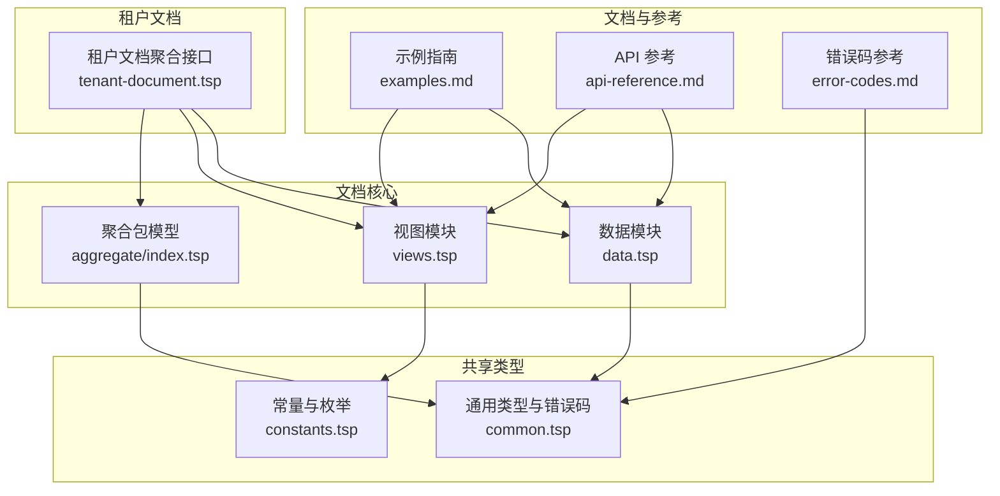
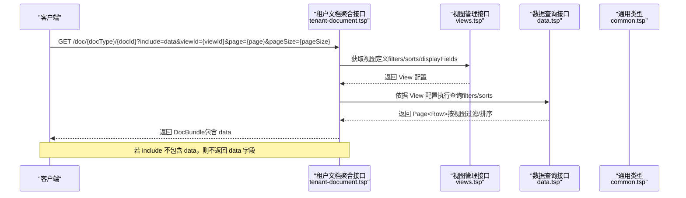
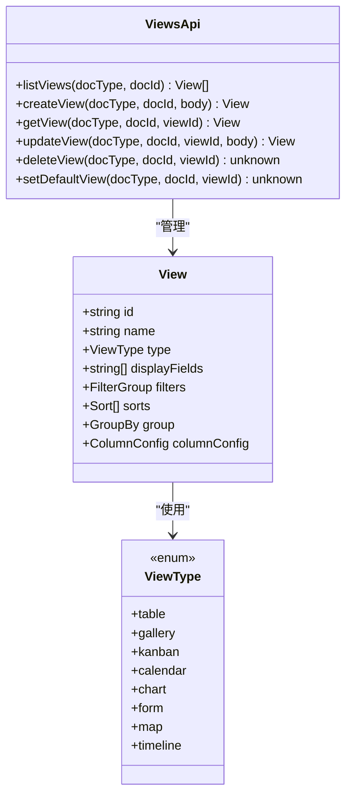
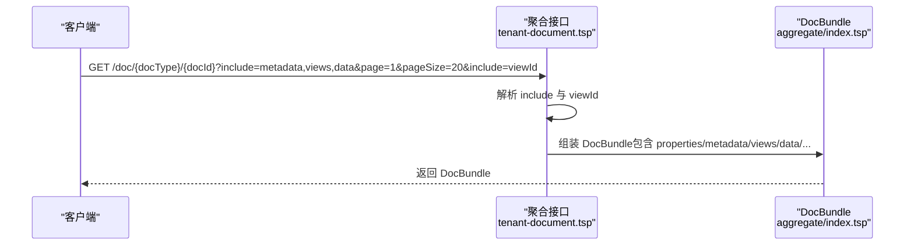
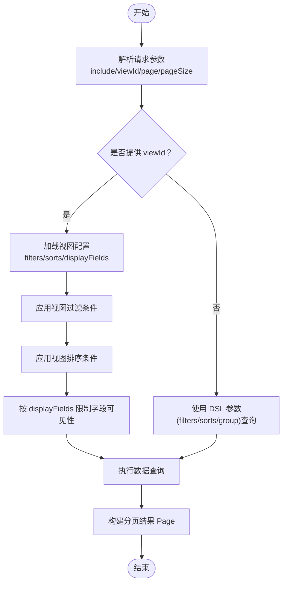
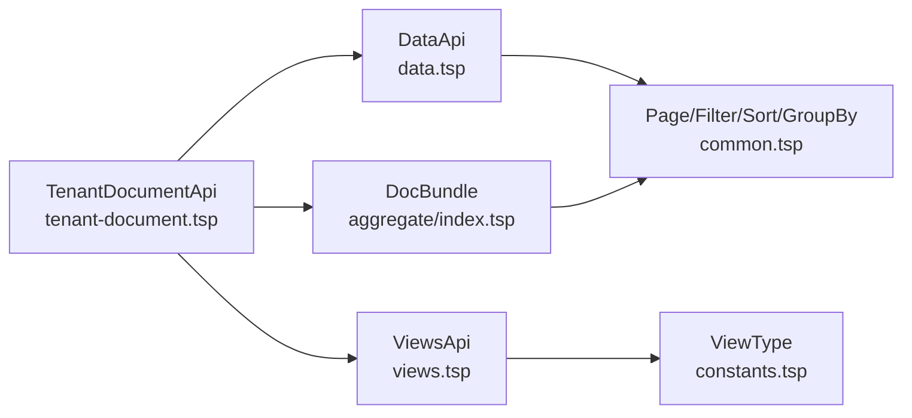

# 视图切换

<cite>
**本文引用的文件**
- [views.tsp](file://api/document/core/views.tsp)
- [data.tsp](file://api/document/core/data.tsp)
- [tenant-document.tsp](file://api/document/tenant-document.tsp)
- [aggregate/index.tsp](file://api/document/aggregate/index.tsp)
- [common.tsp](file://api/shared/common.tsp)
- [constants.tsp](file://api/shared/constants.tsp)
- [examples.md](file://docs-src/guides/examples.md)
- [api-reference.md](file://docs-src/references/api-reference.md)
- [error-codes.md](file://docs-src/references/error-codes.md)
</cite>

## 目录
1. [简介](#简介)
2. [项目结构](#项目结构)
3. [核心组件](#核心组件)
4. [架构概览](#架构概览)
5. [详细组件分析](#详细组件分析)
6. [依赖分析](#依赖分析)
7. [性能考虑](#性能考虑)
8. [故障排查指南](#故障排查指南)
9. [结论](#结论)
10. [附录](#附录)

## 简介
本章节聚焦“视图切换”能力，解释如何通过 viewId 参数指定特定视图进行数据查询，并说明 viewId 与 include=data 选项的协同工作方式。文档将详细描述视图切换对数据返回结果的影响，包括数据过滤、排序和字段可见性变化；提供实际 API 调用示例，展示在不同视图下获取数据的差异；阐述 viewId 参数的验证机制、错误处理和默认视图行为。

## 项目结构
围绕视图切换的相关文件主要分布在以下模块：
- 视图定义与管理：api/document/core/views.tsp
- 数据查询与叠加：api/document/core/data.tsp
- 聚合接口（支持 include 与 viewId）：api/document/tenant-document.tsp、api/document/aggregate/index.tsp
- 通用类型与错误码：api/shared/common.tsp、api/shared/constants.tsp
- 示例与参考文档：docs-src/guides/examples.md、docs-src/references/api-reference.md、docs-src/references/error-codes.md

图表来源
- [views.tsp](file://api/document/core/views.tsp#L1-L170)
- [data.tsp](file://api/document/core/data.tsp#L375-L536)
- [tenant-document.tsp](file://api/document/tenant-document.tsp#L92-L191)
- [aggregate/index.tsp](file://api/document/aggregate/index.tsp#L35-L90)
- [common.tsp](file://api/shared/common.tsp#L1-L177)
- [constants.tsp](file://api/shared/constants.tsp#L87-L139)
- [examples.md](file://docs-src/guides/examples.md#L98-L118)
- [api-reference.md](file://docs-src/references/api-reference.md#L140-L171)
- [error-codes.md](file://docs-src/references/error-codes.md#L82-L97)

章节来源
- [views.tsp](file://api/document/core/views.tsp#L1-L170)
- [data.tsp](file://api/document/core/data.tsp#L375-L536)
- [tenant-document.tsp](file://api/document/tenant-document.tsp#L92-L191)
- [aggregate/index.tsp](file://api/document/aggregate/index.tsp#L35-L90)
- [common.tsp](file://api/shared/common.tsp#L1-L177)
- [constants.tsp](file://api/shared/constants.tsp#L87-L139)
- [examples.md](file://docs-src/guides/examples.md#L98-L118)
- [api-reference.md](file://docs-src/references/api-reference.md#L140-L171)
- [error-codes.md](file://docs-src/references/error-codes.md#L82-L97)

## 核心组件
- 视图模型与接口
  - 视图模型包含 id、name、type、displayFields、filters、sorts、group、columnConfig 等关键字段，用于描述视图的渲染与筛选配置。
  - 视图接口提供 listViews、createView、getView、updateView、deleteView、setDefaultView 等端点，支持对视图的全生命周期管理。
- 数据查询与叠加
  - DataApi 提供 listRows、queryRows、queryGroupedRows 等接口，支持分页、DSL 查询参数以及 requestId 叠加视图。
  - includeChanges 参数用于在 requestId 叠加视图时返回变更标记。
- 聚合接口与视图切换
  - TenantDocumentApi 的聚合接口支持 include 与 viewId 参数，用于一次性拉取 properties、metadata、views、data、comments、revisions、settings 等数据，并按指定视图进行数据过滤与排序。
- 通用类型与错误码
  - 公共类型包含 FilterGroup、Sort、GroupBy、Page、ErrorCode 等，统一了查询与错误处理模型。
  - 错误码中包含 VIEW_NOT_FOUND、VIEW_INVALID_DEFINITION 等视图相关错误，用于定位问题。

章节来源
- [views.tsp](file://api/document/core/views.tsp#L28-L84)
- [views.tsp](file://api/document/core/views.tsp#L86-L170)
- [data.tsp](file://api/document/core/data.tsp#L375-L417)
- [data.tsp](file://api/document/core/data.tsp#L432-L441)
- [data.tsp](file://api/document/core/data.tsp#L526-L536)
- [tenant-document.tsp](file://api/document/tenant-document.tsp#L92-L191)
- [aggregate/index.tsp](file://api/document/aggregate/index.tsp#L35-L90)
- [common.tsp](file://api/shared/common.tsp#L80-L177)
- [error-codes.md](file://docs-src/references/error-codes.md#L82-L97)

## 架构概览
视图切换通过“聚合接口 + 视图配置”的方式实现。客户端在调用聚合接口时传入 viewId，服务端根据该视图的 filters、sorts、displayFields 等配置对数据进行过滤、排序与字段可见性控制，并返回符合视图定义的数据结果。

图表来源
- [tenant-document.tsp](file://api/document/tenant-document.tsp#L92-L191)
- [views.tsp](file://api/document/core/views.tsp#L86-L170)
- [data.tsp](file://api/document/core/data.tsp#L375-L417)
- [common.tsp](file://api/shared/common.tsp#L179-L203)

## 详细组件分析

### 视图模型与配置
- 关键字段
  - id、name：视图标识与显示名称
  - type：视图类型（table、gallery、kanban、calendar、chart、form、map、timeline）
  - displayFields：渲染字段列表，决定字段可见性
  - filters：过滤条件组合，支持嵌套逻辑与多条件
  - sorts：排序条件集合
  - group：分组与聚合配置
  - columnConfig：列展示配置（宽度、顺序、固定、隐藏）
- 视图接口
  - listViews、getView、updateView、deleteView、setDefaultView
  - 默认视图通过 setDefaultView 设定

图表来源
- [views.tsp](file://api/document/core/views.tsp#L28-L84)
- [views.tsp](file://api/document/core/views.tsp#L86-L170)
- [constants.tsp](file://api/shared/constants.tsp#L87-L139)

章节来源
- [views.tsp](file://api/document/core/views.tsp#L28-L84)
- [views.tsp](file://api/document/core/views.tsp#L86-L170)
- [constants.tsp](file://api/shared/constants.tsp#L87-L139)

### 聚合接口与 include=data 协同
- 聚合接口支持 include 参数，用于声明需要返回的数据部分（如 metadata、views、data、comments、revisions、settings）。当 include 包含 data 时，服务端会根据当前上下文（可能由 viewId 指定）对数据进行过滤、排序与字段可见性控制。
- 聚合接口还支持 viewId、page、pageSize、commentsLimit、revisionsLimit 等参数，用于在一次请求中获取完整视图渲染所需的最小数据集。

图表来源
- [tenant-document.tsp](file://api/document/tenant-document.tsp#L92-L191)
- [aggregate/index.tsp](file://api/document/aggregate/index.tsp#L35-L90)

章节来源
- [tenant-document.tsp](file://api/document/tenant-document.tsp#L92-L191)
- [aggregate/index.tsp](file://api/document/aggregate/index.tsp#L35-L90)

### 数据查询与视图过滤、排序、字段可见性
- DataApi 的 listRows/queryRows/queryGroupedRows 支持 filters、sorts、group、page、pageSize、cursor 等参数，用于复杂查询。
- includeChanges 参数用于在 requestId 叠加视图时返回变更标记。
- 当通过聚合接口使用 viewId 时，服务端会基于 View.filters 与 View.sorts 对数据进行过滤与排序；同时基于 View.displayFields 控制字段可见性（仅返回视图定义的字段）。

图表来源
- [data.tsp](file://api/document/core/data.tsp#L375-L417)
- [data.tsp](file://api/document/core/data.tsp#L432-L441)
- [data.tsp](file://api/document/core/data.tsp#L526-L536)
- [views.tsp](file://api/document/core/views.tsp#L28-L84)

章节来源
- [data.tsp](file://api/document/core/data.tsp#L375-L417)
- [data.tsp](file://api/document/core/data.tsp#L432-L441)
- [data.tsp](file://api/document/core/data.tsp#L526-L536)
- [views.tsp](file://api/document/core/views.tsp#L28-L84)

### API 调用示例与差异
- 示例：创建“待处理”视图
  - 通过 ViewsApi 创建视图，配置 filters 与 sorts。
  - 参考示例路径：[示例：创建视图](file://docs-src/guides/examples.md#L98-L118)
- 示例：聚合接口获取数据
  - 通过 TenantDocumentApi 的聚合接口传入 include=data 与 viewId，一次性获取 properties、metadata、views、data 等。
  - 参考示例路径：[API 参考：视图端点](file://docs-src/references/api-reference.md#L140-L171)

章节来源
- [examples.md](file://docs-src/guides/examples.md#L98-L118)
- [api-reference.md](file://docs-src/references/api-reference.md#L140-L171)

### 视图切换对数据返回结果的影响
- 数据过滤
  - 通过 View.filters 将不符合条件的数据从结果集中剔除，确保返回的数据符合视图预期。
- 排序
  - 通过 View.sorts 对数据进行稳定排序，保证视图展示的一致性。
- 字段可见性
  - 通过 View.displayFields 限定返回字段集合，避免无关字段泄露或冗余传输。

章节来源
- [views.tsp](file://api/document/core/views.tsp#L28-L84)
- [common.tsp](file://api/shared/common.tsp#L210-L232)
- [common.tsp](file://api/shared/common.tsp#L234-L270)
- [common.tsp](file://api/shared/common.tsp#L272-L295)

### 参数验证、错误处理与默认视图行为
- 参数验证
  - 聚合接口与视图接口均对 docType、docId、viewId 等路径与查询参数进行解析与校验。
- 错误处理
  - 视图相关错误码：VIEW_NOT_FOUND、VIEW_INVALID_DEFINITION 等，用于指示视图不存在或配置无效。
  - 文档相关错误码：DOC_NOT_FOUND、DOC_TYPE_UNKNOWN、DOC_ACCESS_DENIED 等，用于指示文档层面的问题。
- 默认视图行为
  - 通过 setDefaultView 将指定视图设为默认视图；若请求未显式提供 viewId，可回退至默认视图配置。

章节来源
- [error-codes.md](file://docs-src/references/error-codes.md#L82-L97)
- [views.tsp](file://api/document/core/views.tsp#L157-L170)
- [common.tsp](file://api/shared/common.tsp#L80-L177)

## 依赖分析
- 组件耦合
  - TenantDocumentApi 依赖 DocBundle（聚合包模型）与 ViewsApi/DataApi 的能力，实现“一次请求、多数据聚合”的视图渲染。
  - ViewsApi 依赖 ViewType 枚举与通用查询模型（FilterGroup、Sort、GroupBy）。
  - DataApi 依赖通用分页模型 Page 与变更叠加机制（requestId/includeChanges）。
- 外部依赖
  - 共享类型与错误码为各模块提供统一契约，降低耦合度。

图表来源
- [tenant-document.tsp](file://api/document/tenant-document.tsp#L92-L191)
- [aggregate/index.tsp](file://api/document/aggregate/index.tsp#L35-L90)
- [views.tsp](file://api/document/core/views.tsp#L86-L170)
- [constants.tsp](file://api/shared/constants.tsp#L87-L139)
- [data.tsp](file://api/document/core/data.tsp#L375-L417)
- [common.tsp](file://api/shared/common.tsp#L179-L203)

章节来源
- [tenant-document.tsp](file://api/document/tenant-document.tsp#L92-L191)
- [aggregate/index.tsp](file://api/document/aggregate/index.tsp#L35-L90)
- [views.tsp](file://api/document/core/views.tsp#L86-L170)
- [constants.tsp](file://api/shared/constants.tsp#L87-L139)
- [data.tsp](file://api/document/core/data.tsp#L375-L417)
- [common.tsp](file://api/shared/common.tsp#L179-L203)

## 性能考虑
- 减少往返次数：通过聚合接口一次性返回 properties、metadata、views、data 等，避免多次请求。
- 合理分页：使用 page/pageSize 或 cursor 进行深分页，避免一次性返回大量数据。
- 字段裁剪：利用 displayFields 限制返回字段，降低网络与序列化开销。
- 叠加视图：在需要预览变更效果时使用 requestId，但注意 includeChanges 可能带来额外标记数据。

## 故障排查指南
- 视图不存在
  - 现象：返回 VIEW_NOT_FOUND
  - 排查：确认 viewId 是否正确、是否存在；检查文档权限。
  - 参考：[错误码参考](file://docs-src/references/error-codes.md#L82-L97)
- 视图定义无效
  - 现象：返回 VIEW_INVALID_DEFINITION
  - 排查：检查 filters/sorts/group/displayFields 等配置是否符合规范。
  - 参考：[错误码参考](file://docs-src/references/error-codes.md#L82-L97)
- 文档访问被拒绝
  - 现象：返回 DOC_ACCESS_DENIED
  - 排查：确认用户对文档的访问权限。
  - 参考：[错误码参考](file://docs-src/references/error-codes.md#L60-L97)
- 数据叠加异常
  - 现象：includeChanges 与 requestId 配合使用时出现不一致
  - 排查：确认 requestId 是否存在且处于有效状态；检查 includeChanges 的使用场景。

章节来源
- [error-codes.md](file://docs-src/references/error-codes.md#L60-L97)

## 结论
通过 viewId 参数与 include=data 的协同，系统实现了“以视图为中心”的数据查询与渲染模式。服务端依据视图配置对数据进行过滤、排序与字段可见性控制，从而在一次请求中返回符合视图定义的最小数据集。配合默认视图与错误码体系，开发者可以快速构建稳定的视图切换能力，并在出现问题时高效定位与修复。

## 附录
- 相关示例与参考
  - 视图创建示例：[示例：创建视图](file://docs-src/guides/examples.md#L98-L118)
  - 视图端点参考：[API 参考：视图](file://docs-src/references/api-reference.md#L140-L171)