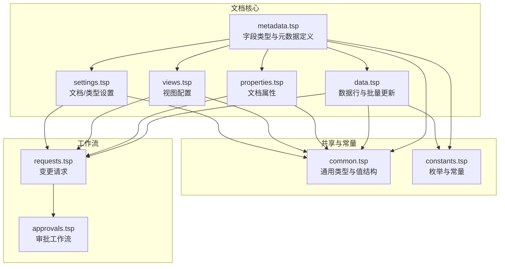
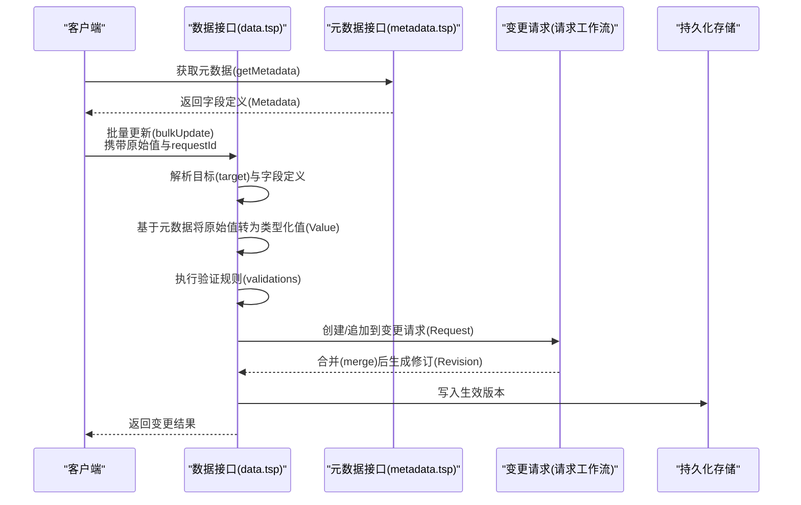
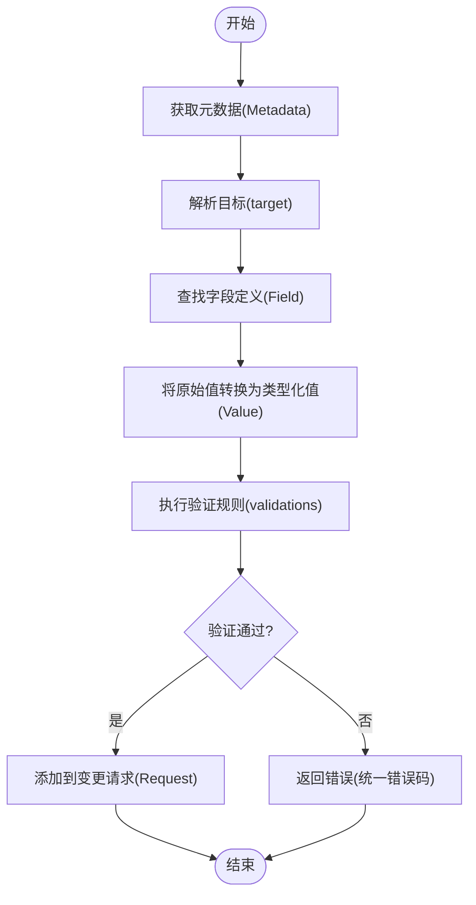
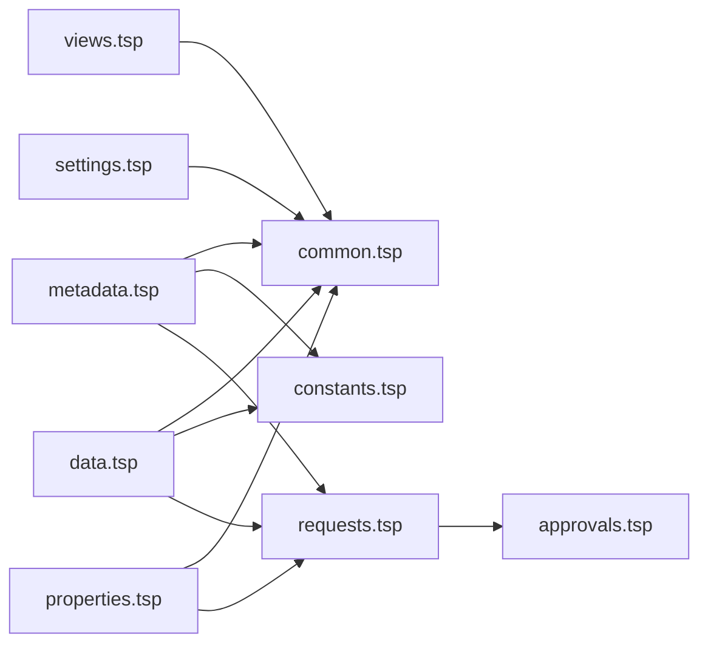

# 元数据管理

<cite>
**本文引用的文件**
- [metadata.tsp](file://api/document/core/metadata.tsp)
- [data.tsp](file://api/document/core/data.tsp)
- [properties.tsp](file://api/document/core/properties.tsp)
- [views.tsp](file://api/document/core/views.tsp)
- [settings.tsp](file://api/document/core/settings.tsp)
- [common.tsp](file://api/shared/common.tsp)
- [constants.tsp](file://api/shared/constants.tsp)
- [field-types.md](file://docs-src/references/field-types.md)
- [document-model.md](file://docs-src/guides/document-model.md)
- [requests.tsp](file://api/document/workflow/requests.tsp)
- [approvals.tsp](file://api/document/workflow/approvals.tsp)
</cite>

## 目录
1. [简介](#简介)
2. [项目结构](#项目结构)
3. [核心组件](#核心组件)
4. [架构总览](#架构总览)
5. [详细组件分析](#详细组件分析)
6. [依赖分析](#依赖分析)
7. [性能考虑](#性能考虑)
8. [故障排查指南](#故障排查指南)
9. [结论](#结论)
10. [附录](#附录)

## 简介
本文件围绕 nexusbook-api 的元数据管理能力，系统梳理字段类型、字段定义、计算字段（公式、查找、汇总）、选项管理、关联关系与验证规则的实现与使用方式，并给出元数据在数据一致性、类型安全与业务规则执行中的作用说明。文档还提供元数据相关 API 的端点定义与调用流程，帮助开发者在实际项目中正确使用与扩展元数据体系。

## 项目结构
元数据管理位于文档核心模块，与数据行、文档属性、视图、设置、工作流等模块共同构成文档模型的完整能力面。下图展示了与元数据相关的主要文件与职责划分。

图表来源
- [metadata.tsp](file://api/document/core/metadata.tsp#L1-L211)
- [data.tsp](file://api/document/core/data.tsp#L1-L628)
- [properties.tsp](file://api/document/core/properties.tsp#L1-L441)
- [views.tsp](file://api/document/core/views.tsp#L1-L171)
- [settings.tsp](file://api/document/core/settings.tsp#L1-L141)
- [common.tsp](file://api/shared/common.tsp#L1-L576)
- [constants.tsp](file://api/shared/constants.tsp#L1-L314)
- [requests.tsp](file://api/document/workflow/requests.tsp#L1-L391)
- [approvals.tsp](file://api/document/workflow/approvals.tsp#L1-L156)

章节来源
- [metadata.tsp](file://api/document/core/metadata.tsp#L1-L211)
- [data.tsp](file://api/document/core/data.tsp#L1-L628)
- [properties.tsp](file://api/document/core/properties.tsp#L1-L441)
- [views.tsp](file://api/document/core/views.tsp#L1-L171)
- [settings.tsp](file://api/document/core/settings.tsp#L1-L141)
- [common.tsp](file://api/shared/common.tsp#L1-L576)
- [constants.tsp](file://api/shared/constants.tsp#L1-L314)
- [requests.tsp](file://api/document/workflow/requests.tsp#L1-L391)
- [approvals.tsp](file://api/document/workflow/approvals.tsp#L1-L156)

## 核心组件
- 字段类型与元数据定义：定义字段类型、字段属性（必填/唯一/只读）、默认值、选项、计算配置（公式/查找/汇总）与验证规则。
- 数据行与批量更新：基于元数据对行值进行类型解析、验证与批量更新，支持变更请求工作流。
- 文档属性：文档级元信息（如订单时间、金额、数量等），支持属性的创建、替换、部分更新与历史查看。
- 视图：定义不同展示方式（表格、看板、日历、图表等）与列配置、过滤、排序、分组。
- 设置：文档级与类型级设置（默认视图、分享、权限策略、保留策略等）。
- 共享类型与常量：统一的值结构、过滤/排序/聚合模型、枚举类型（字段类型、视图类型、请求/审批状态等）。
- 工作流：变更请求与审批流程，确保所有写操作遵循审批与审计。

章节来源
- [metadata.tsp](file://api/document/core/metadata.tsp#L1-L211)
- [data.tsp](file://api/document/core/data.tsp#L1-L628)
- [properties.tsp](file://api/document/core/properties.tsp#L1-L441)
- [views.tsp](file://api/document/core/views.tsp#L1-L171)
- [settings.tsp](file://api/document/core/settings.tsp#L1-L141)
- [common.tsp](file://api/shared/common.tsp#L1-L576)
- [constants.tsp](file://api/shared/constants.tsp#L1-L314)
- [requests.tsp](file://api/document/workflow/requests.tsp#L1-L391)
- [approvals.tsp](file://api/document/workflow/approvals.tsp#L1-L156)

## 架构总览
元数据驱动的数据一致性与类型安全体现在以下关键路径：
- 元数据定义（Metadata.fields）约束数据行值结构；
- 批量更新与单行更新在服务端依据元数据解析原始值为类型化值；
- 验证规则在写入前执行，失败返回统一错误码；
- 变更通过变更请求（Request）协同编辑，审批通过后生成修订（Revision）；
- 文档属性与数据行分离，避免交叉污染，提升一致性。

图表来源
- [metadata.tsp](file://api/document/core/metadata.tsp#L183-L211)
- [data.tsp](file://api/document/core/data.tsp#L560-L628)
- [requests.tsp](file://api/document/workflow/requests.tsp#L202-L391)

章节来源
- [metadata.tsp](file://api/document/core/metadata.tsp#L183-L211)
- [data.tsp](file://api/document/core/data.tsp#L560-L628)
- [requests.tsp](file://api/document/workflow/requests.tsp#L202-L391)

## 详细组件分析

### 字段类型与元数据模型
- 字段类型覆盖文本、数值、日期时间、布尔、选择（单选/多选/评分）、附件、用户、协作者、关系、计算（公式/查找/汇总）、自动编号、系统字段（创建/更新时间与人员）等。
- 字段定义包含：字段ID、名称、类型、必填、唯一、只读、默认值、选项、计算配置（公式/查找/汇总）、验证规则（规则类型+配置+多语言消息）。
- 计算字段：
  - 公式字段：基于表达式计算；
  - 查找字段：从关联字段的目标字段查找值；
  - 汇总字段：对关联字段的目标字段执行聚合函数（计数/求和/平均/最小/最大）。
- 选项管理：通过 SelectOption 定义选项集合（ID、标签、颜色、禁用状态）。
- 关联关系：RelationRef 引用其他文档/行，支持双向/单向关系与权限控制。
- 验证规则：通过 validations 数组定义规则类型、配置与多语言消息，统一错误码与响应结构。

章节来源
- [metadata.tsp](file://api/document/core/metadata.tsp#L29-L110)
- [metadata.tsp](file://api/document/core/metadata.tsp#L112-L145)
- [metadata.tsp](file://api/document/core/metadata.tsp#L160-L181)
- [common.tsp](file://api/shared/common.tsp#L333-L358)
- [common.tsp](file://api/shared/common.tsp#L544-L576)
- [constants.tsp](file://api/shared/constants.tsp#L141-L260)

### 字段类型与值类型的映射关系
- 文档提供了字段类型到 JSON 值格式的映射参考，涵盖文本、数值、布尔、日期、日期时间、时长、选择、评分、附件、用户、协作者、关系等。
- 该映射用于客户端提交原始值时，服务端依据元数据自动解析为类型化值结构，确保类型安全与一致性。

章节来源
- [field-types.md](file://docs-src/references/field-types.md#L439-L461)
- [common.tsp](file://api/shared/common.tsp#L544-L576)

### 计算字段的配置与执行逻辑
- 公式字段：在字段定义中提供表达式字符串，服务端按表达式解析并计算。
- 查找字段：指定关联字段ID与目标字段ID，从关联记录中查找目标字段值。
- 汇总字段：指定关联字段ID、目标字段ID与聚合函数（count/sum/avg/min/max），对关联记录进行聚合。
- 执行时机：在数据写入或查询时，根据字段定义与关联关系计算得出结果，用于展示或进一步计算。

章节来源
- [metadata.tsp](file://api/document/core/metadata.tsp#L112-L145)
- [field-types.md](file://docs-src/references/field-types.md#L316-L387)

### 选项管理与验证规则
- 选项管理：通过 SelectOption 定义选项集合，支持颜色与禁用状态；字段定义中的 selectOptions 用于选择类字段。
- 验证规则：字段定义中的 validations 数组支持多语言消息与规则配置，统一通过 ApiResponse 返回错误码与消息。
- 错误码：统一的错误码枚举覆盖认证、文档、视图、数据、评论、审批、请求、用户、组织、工作区、邀请、加入申请等场景。

章节来源
- [common.tsp](file://api/shared/common.tsp#L80-L152)
- [common.tsp](file://api/shared/common.tsp#L333-L358)
- [metadata.tsp](file://api/document/core/metadata.tsp#L99-L110)

### 文档属性与数据行的分离与一致性
- 文档属性（DocumentProperties）存储文档级元信息，使用类型化值结构与数据行保持一致，便于统一解析与验证。
- 数据行（Row）包含字段值集合与审计信息（创建/更新/版本），版本号用于并发控制。
- 属性与数据分离，避免交叉污染，提升一致性与可审计性。

章节来源
- [properties.tsp](file://api/document/core/properties.tsp#L94-L198)
- [data.tsp](file://api/document/core/data.tsp#L241-L311)

### 视图与显示配置
- 视图模型包含视图ID、名称、类型（表格/相册/看板/文档/日历/图表/表单/地图/时间线）、显示字段、过滤、排序、分组与列配置（宽度/顺序/固定/隐藏）。
- 视图不持有数据，仅保存配置，用于投影数据行。

章节来源
- [views.tsp](file://api/document/core/views.tsp#L28-L85)
- [constants.tsp](file://api/shared/constants.tsp#L87-L140)

### 设置与权限策略
- 文档级设置：默认视图、分享（公开链接开关、密码）、权限策略、保留策略（修订最大条数、最大保留天数）。
- 类型级设置：为该类型的所有文档提供默认配置。
- 设置层级清晰，便于按文档或类型维度进行差异化配置。

章节来源
- [settings.tsp](file://api/document/core/settings.tsp#L33-L84)
- [settings.tsp](file://api/document/core/settings.tsp#L86-L141)

### API 接口文档（元数据相关）

- 获取文档元数据
  - 方法与路径：GET /doc/{docType}/{docId}/metadata
  - 功能：返回字段定义与显示配置，供渲染与校验使用
  - 响应：ApiResponse<Metadata>

- 更新文档元数据
  - 方法与路径：PUT /doc/{docType}/{docId}/metadata
  - 功能：更新字段与显示配置，需具备管理权限
  - 请求体：Metadata
  - 响应：ApiResponse<Metadata>

- 获取/创建/替换/部分更新/删除文档属性
  - 获取属性：GET /doc/{docType}/{docId}/properties
  - 创建属性：POST /doc/{docType}/{docId}/properties
  - 替换属性：PUT /doc/{docType}/{docId}/properties
  - 部分更新属性：PATCH /doc/{docType}/{docId}/properties
  - 删除属性：DELETE /doc/{docType}/{docId}/properties

- 视图管理
  - 列出视图：GET /doc/{docType}/{docId}/views
  - 创建视图：POST /doc/{docType}/{docId}/views
  - 获取视图：GET /doc/{docType}/{docId}/views/{viewId}
  - 更新视图：PUT /doc/{docType}/{docId}/views/{viewId}
  - 删除视图：DELETE /doc/{docType}/{docId}/views/{viewId}
  - 设为默认视图：POST /doc/{docType}/{docId}/views/{viewId}/default

- 设置管理
  - 获取文档设置：GET /doc/{docType}/{docId}/settings
  - 更新文档设置：PUT /doc/{docType}/{docId}/settings
  - 获取类型设置：GET /doc/{docType}/setting
  - 更新类型设置：PUT /doc/{docType}/setting

章节来源
- [metadata.tsp](file://api/document/core/metadata.tsp#L183-L211)
- [properties.tsp](file://api/document/core/properties.tsp#L200-L441)
- [views.tsp](file://api/document/core/views.tsp#L86-L171)
- [settings.tsp](file://api/document/core/settings.tsp#L86-L141)

### 批量更新与类型解析流程
- 批量更新采用灵活的 target + 原始 value 结构，服务端根据 docId 获取元数据，解析目标类型（行/属性），查找字段定义获取类型，将原始值转换为类型化值，执行验证，然后添加到指定的变更请求。
- 支持单行/多行、单字段/多字段、属性与数据混合更新，删除操作无需提供 value。

图表来源
- [data.tsp](file://api/document/core/data.tsp#L560-L628)
- [common.tsp](file://api/shared/common.tsp#L153-L177)

章节来源
- [data.tsp](file://api/document/core/data.tsp#L560-L628)
- [common.tsp](file://api/shared/common.tsp#L153-L177)

## 依赖分析
- 元数据模块依赖共享类型（通用值结构、过滤/排序/聚合、枚举等），确保字段值与查询模型的一致性。
- 数据行与文档属性均使用统一的类型化值结构（ValueEntry/Value），降低解析与验证成本。
- 工作流模块（变更请求与审批）贯穿元数据、数据行与属性的写入过程，保障变更的可审计与可追溯。

图表来源
- [metadata.tsp](file://api/document/core/metadata.tsp#L1-L211)
- [data.tsp](file://api/document/core/data.tsp#L1-L628)
- [properties.tsp](file://api/document/core/properties.tsp#L1-L441)
- [views.tsp](file://api/document/core/views.tsp#L1-L171)
- [settings.tsp](file://api/document/core/settings.tsp#L1-L141)
- [common.tsp](file://api/shared/common.tsp#L1-L576)
- [constants.tsp](file://api/shared/constants.tsp#L1-L314)
- [requests.tsp](file://api/document/workflow/requests.tsp#L1-L391)
- [approvals.tsp](file://api/document/workflow/approvals.tsp#L1-L156)

章节来源
- [metadata.tsp](file://api/document/core/metadata.tsp#L1-L211)
- [data.tsp](file://api/document/core/data.tsp#L1-L628)
- [properties.tsp](file://api/document/core/properties.tsp#L1-L441)
- [views.tsp](file://api/document/core/views.tsp#L1-L171)
- [settings.tsp](file://api/document/core/settings.tsp#L1-L141)
- [common.tsp](file://api/shared/common.tsp#L1-L576)
- [constants.tsp](file://api/shared/constants.tsp#L1-L314)
- [requests.tsp](file://api/document/workflow/requests.tsp#L1-L391)
- [approvals.tsp](file://api/document/workflow/approvals.tsp#L1-L156)

## 性能考虑
- 批量更新采用简化的数据提交方式，减少客户端对字段类型的感知，服务端按元数据解析，避免重复转换与网络传输。
- 查询支持分页与游标，深层分页与复杂聚合可通过结构化查询体进行，降低一次性返回大量数据的压力。
- 视图配置仅保存渲染所需配置，不存储数据，减少冗余与存储压力。
- 通过变更请求与审批流程，集中处理写入，有利于缓存与批量落库优化。

## 故障排查指南
- 字段类型不匹配：当提交的原始值与字段类型不一致时，服务端会返回统一错误码与多语言消息，检查字段定义与提交值格式。
- 验证规则失败：根据字段定义中的验证规则配置，检查规则类型、配置与多语言消息，修正输入后再提交。
- 并发冲突：更新行时需提供当前版本号，若版本不一致将导致冲突，需重新获取最新版本再提交。
- 变更未生效：所有写操作需进入变更请求并通过审批后才生效，确认请求状态与审批流程。

章节来源
- [common.tsp](file://api/shared/common.tsp#L80-L152)
- [data.tsp](file://api/document/core/data.tsp#L61-L110)
- [requests.tsp](file://api/document/workflow/requests.tsp#L202-L391)

## 结论
元数据管理通过统一的字段类型、值结构与验证规则，实现了文档模型在类型安全、数据一致性与业务规则执行方面的强约束。配合变更请求与审批工作流，确保所有写操作可审计、可追溯且可控。视图与设置进一步提升了用户体验与可配置性。建议在实际项目中：
- 明确字段类型与验证规则，避免歧义；
- 使用批量更新与变更请求，统一写入路径；
- 合理配置视图与设置，平衡展示与性能；
- 通过文档属性与数据行分离，确保文档级元信息与行级数据的清晰边界。

## 附录

### 字段类型参考（节选）
- 基础类型：text、long_text、number、currency、percent、boolean
- 日期时间：date、datetime、duration
- 选择类型：single_select、multi_select、rating
- 关联类型：attachment、user、collaborator、relation
- 计算类型：lookup、rollup、formula、auto_number
- 系统字段：created_time、updated_time、created_by、updated_by

章节来源
- [field-types.md](file://docs-src/references/field-types.md#L1-L15)
- [constants.tsp](file://api/shared/constants.tsp#L141-L260)

### 文档模型与生命周期（节选）
- 文档模型包含 Properties、Metadata、Views、Data、Comments、Revisions、Settings 七个层次；
- 生命周期：Draft → Edit → Review → Merge → Audit；
- 所有写操作通过 Request，审批通过后生成 Revision，支持回溯与对比。

章节来源
- [document-model.md](file://docs-src/guides/document-model.md#L1-L120)
- [document-model.md](file://docs-src/guides/document-model.md#L143-L205)
- [document-model.md](file://docs-src/guides/document-model.md#L206-L301)