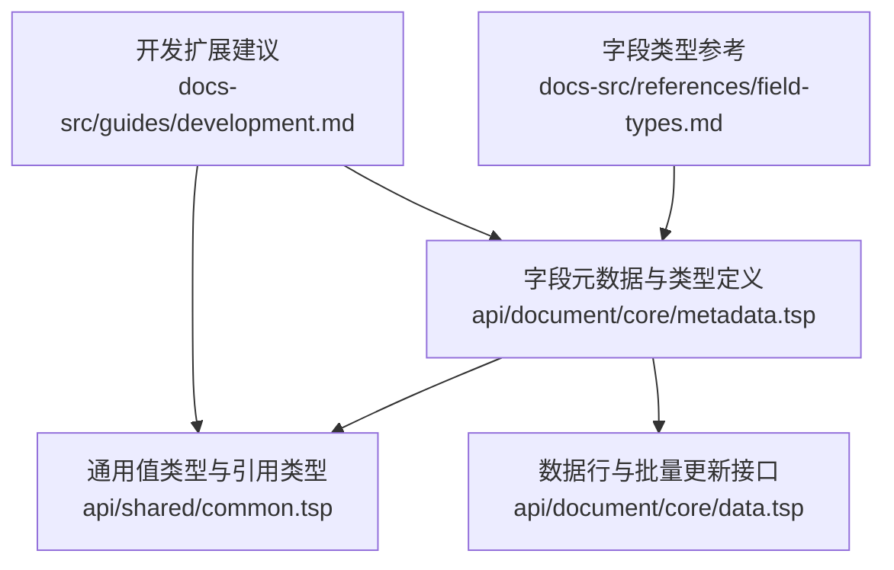
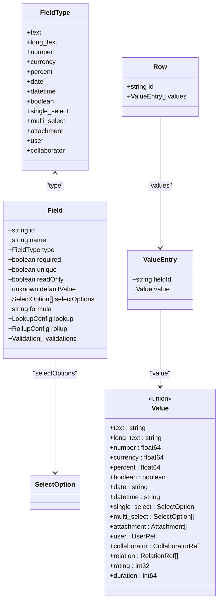
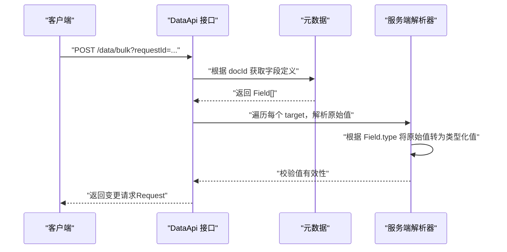

# 基础字段类型

<cite>
**本文引用的文件**
- [field-types.md](file://docs-src/references/field-types.md)
- [metadata.tsp](file://api/document/core/metadata.tsp)
- [common.tsp](file://api/shared/common.tsp)
- [data.tsp](file://api/document/core/data.tsp)
- [development.md](file://docs-src/guides/development.md)
</cite>

## 目录
1. [简介](#简介)
2. [项目结构](#项目结构)
3. [核心组件](#核心组件)
4. [架构总览](#架构总览)
5. [详细组件分析](#详细组件分析)
6. [依赖分析](#依赖分析)
7. [性能考虑](#性能考虑)
8. [故障排查指南](#故障排查指南)
9. [结论](#结论)
10. [附录](#附录)

## 简介
本篇文档聚焦于 nexusbook-api 的“基础字段类型”，系统梳理 FieldType 枚举中的基础类型：text、long_text、number、currency、percent、date、datetime、boolean、single_select、multi_select、attachment、user 和 collaborator。文档将从数据语义、值格式约束、典型使用场景出发，结合代码层面的 Field 模型与 Value 联合类型，说明 required、unique、defaultValue 等通用属性如何影响 UI 渲染、数据验证与 API 交互；同时阐述单选/多选字段的 selectOptions 配置方式及其对前端展示的影响。

## 项目结构
围绕“基础字段类型”的知识主要分布在以下位置：
- 字段类型参考文档：docs-src/references/field-types.md
- 字段元数据与类型定义：api/document/core/metadata.tsp
- 通用值类型与引用类型：api/shared/common.tsp
- 数据行与批量更新接口：api/document/core/data.tsp
- 开发扩展建议（新增字段类型）：docs-src/guides/development.md

图表来源
- [field-types.md](file://docs-src/references/field-types.md#L1-L461)
- [metadata.tsp](file://api/document/core/metadata.tsp#L1-L211)
- [common.tsp](file://api/shared/common.tsp#L710-L742)
- [data.tsp](file://api/document/core/data.tsp#L218-L256)
- [development.md](file://docs-src/guides/development.md#L380-L396)

章节来源
- [field-types.md](file://docs-src/references/field-types.md#L1-L461)
- [metadata.tsp](file://api/document/core/metadata.tsp#L1-L211)
- [common.tsp](file://api/shared/common.tsp#L710-L742)
- [data.tsp](file://api/document/core/data.tsp#L218-L256)
- [development.md](file://docs-src/guides/development.md#L317-L396)

## 核心组件
- FieldType 枚举：定义了基础类型与扩展类型（如 lookup、rollup、formula 等）。基础类型包括 text、long_text、number、currency、percent、date、datetime、boolean、single_select、multi_select、attachment、user、collaborator。
- Field 模型：描述字段的类型、是否必填/唯一/只读、默认值、选择类字段的选项集合、计算字段配置（formula/lookup/rollup）以及验证规则。
- Value 联合类型：统一承载各字段类型的值格式，确保 API 层在序列化/反序列化时遵循一致的结构。
- Row/ValueEntry：数据行的字段值集合，用于 API 的读写交互。
- 批量更新与原始值提交：客户端以“原始值”提交，服务端依据元数据自动解析类型，减少客户端对类型细节的感知。

章节来源
- [metadata.tsp](file://api/document/core/metadata.tsp#L29-L52)
- [metadata.tsp](file://api/document/core/metadata.tsp#L65-L110)
- [common.tsp](file://api/shared/common.tsp#L710-L742)
- [data.tsp](file://api/document/core/data.tsp#L248-L311)
- [data.tsp](file://api/document/core/data.tsp#L218-L256)

## 架构总览
下图展示了“基础字段类型”在系统中的角色与交互关系：字段类型定义来源于元数据，值格式由 Value 联合类型统一约束，Row/ValueEntry 作为 API 传输载体，批量更新接口接收原始值并交由服务端解析。

图表来源
- [metadata.tsp](file://api/document/core/metadata.tsp#L29-L52)
- [metadata.tsp](file://api/document/core/metadata.tsp#L65-L110)
- [common.tsp](file://api/shared/common.tsp#L710-L742)
- [data.tsp](file://api/document/core/data.tsp#L248-L311)

## 详细组件分析

### 基础类型概览与语义
- text：短文本，适用于名称、标题、标签等。值格式为包含字符串的包装对象。
- long_text：长文本，适用于描述、备注等。值格式同 text。
- number：数值，支持浮点数，适用于数量、金额等。
- currency：货币金额，值格式与 number 相同，但可通过配置进行货币符号与精度格式化。
- percent：百分比数值，值格式为小数（如 0.85 表示 85%）。
- date：日期（不含时间），值格式为 ISO 8601 字符串。
- datetime：日期时间，值格式为 ISO 8601 字符串。
- boolean：布尔值，true/false。
- single_select：单选，值为单个选项对象。
- multi_select：多选，值为选项数组。
- attachment：附件，值为附件数组。
- user：用户引用，值为用户引用对象。
- collaborator：协作者引用，值为协作者引用数组。

章节来源
- [field-types.md](file://docs-src/references/field-types.md#L18-L133)
- [field-types.md](file://docs-src/references/field-types.md#L135-L177)
- [field-types.md](file://docs-src/references/field-types.md#L179-L244)
- [field-types.md](file://docs-src/references/field-types.md#L245-L314)
- [field-types.md](file://docs-src/references/field-types.md#L388-L407)
- [common.tsp](file://api/shared/common.tsp#L710-L742)

### 值格式与约束
- text/long_text：值为包含字符串的对象，长度与模式可通过验证规则限制。
- number/currency/percent：值为数值对象，支持最小值、最大值、精度等约束。
- boolean：值为布尔对象。
- date/datetime：值为 ISO 8601 字符串。
- duration：值为毫秒整数。
- single_select/multi_select：值分别为单个选项对象或多选项数组。
- attachment/user/collaborator/relation：值分别为数组或对象，包含引用信息。

章节来源
- [field-types.md](file://docs-src/references/field-types.md#L24-L41)
- [field-types.md](file://docs-src/references/field-types.md#L62-L82)
- [field-types.md](file://docs-src/references/field-types.md#L84-L105)
- [field-types.md](file://docs-src/references/field-types.md#L107-L119)
- [field-types.md](file://docs-src/references/field-types.md#L135-L163)
- [field-types.md](file://docs-src/references/field-types.md#L165-L177)
- [field-types.md](file://docs-src/references/field-types.md#L179-L244)
- [field-types.md](file://docs-src/references/field-types.md#L245-L314)
- [common.tsp](file://api/shared/common.tsp#L710-L742)

### Field 模型中的通用属性
- required：是否必填，影响 UI 必填标记与后端校验。
- unique：是否唯一，影响后端约束与 UI 提示。
- readOnly：是否只读，影响 UI 编辑态与后端写入。
- defaultValue：默认值，用于新建行时的初始值填充。
- selectOptions：单选/多选字段的可用选项集合，决定 UI 下拉/多选框的展示与可选项范围。
- validations：通用验证规则集合，支持自定义规则类型与配置。

章节来源
- [metadata.tsp](file://api/document/core/metadata.tsp#L65-L110)
- [field-types.md](file://docs-src/references/field-types.md#L409-L437)

### 单选/多选字段的 selectOptions 配置
- 配置位置：Field.selectOptions 或旧版 Field.options（兼容保留）。
- 值格式：single_select 对应单个选项对象；multi_select 对应选项数组。
- 影响：前端渲染时根据 options 动态生成下拉/多选控件；后端校验时确保所选值属于已定义选项集合。

章节来源
- [field-types.md](file://docs-src/references/field-types.md#L181-L210)
- [field-types.md](file://docs-src/references/field-types.md#L212-L229)
- [metadata.tsp](file://api/document/core/metadata.tsp#L84-L91)

### API 交互与值解析流程
- 客户端以“原始值”提交（如 99.99、"iPhone 15"、true），服务端根据文档元数据自动解析为类型化值。
- 批量更新接口支持单值、对象（多字段）与数组（多行不同值）三种形式。
- 删除操作无需提供 value 字段。

图表来源
- [data.tsp](file://api/document/core/data.tsp#L580-L657)
- [data.tsp](file://api/document/core/data.tsp#L658-L725)
- [metadata.tsp](file://api/document/core/metadata.tsp#L160-L181)

章节来源
- [data.tsp](file://api/document/core/data.tsp#L218-L256)
- [data.tsp](file://api/document/core/data.tsp#L580-L657)
- [data.tsp](file://api/document/core/data.tsp#L658-L725)

### UI 渲染与交互差异
- 文本类（text/long_text）：输入框/富文本编辑器，支持长度与模式校验。
- 数值类（number/currency/percent）：数字输入框，支持最小/最大/精度约束；currency 支持货币符号与精度展示。
- 日期时间类（date/datetime/duration）：日期/时间选择器或时长输入，值格式严格遵循 ISO 8601 或毫秒。
- 布尔类（boolean）：开关/复选框，值为 true/false。
- 选择类（single_select/multi_select/rating）：下拉/多选/评分组件，值来自 selectOptions。
- 引用类（attachment/user/collaborator/relation）：文件上传/用户选择/关系选择，值为引用数组或对象。

章节来源
- [field-types.md](file://docs-src/references/field-types.md#L18-L133)
- [field-types.md](file://docs-src/references/field-types.md#L135-L314)
- [common.tsp](file://api/shared/common.tsp#L710-L742)

### 新增字段类型的扩展流程
- 在 FieldType 枚举中添加新类型。
- 在 Value 联合类型中添加对应值类型。
- 更新字段类型文档与示例。

章节来源
- [development.md](file://docs-src/guides/development.md#L380-L396)
- [metadata.tsp](file://api/document/core/metadata.tsp#L29-L52)
- [common.tsp](file://api/shared/common.tsp#L710-L742)

## 依赖分析
- 元数据驱动：Field.type 决定 ValueEntry.value 的结构，进而影响 UI 控件与校验策略。
- 通用类型复用：Value 联合类型集中定义所有字段值格式，避免重复与歧义。
- 批量更新解耦：客户端仅传原始值，服务端基于元数据完成类型解析与校验，降低耦合度。

图表来源
- [metadata.tsp](file://api/document/core/metadata.tsp#L29-L52)
- [metadata.tsp](file://api/document/core/metadata.tsp#L65-L110)
- [common.tsp](file://api/shared/common.tsp#L710-L742)
- [data.tsp](file://api/document/core/data.tsp#L248-L311)

章节来源
- [metadata.tsp](file://api/document/core/metadata.tsp#L29-L52)
- [metadata.tsp](file://api/document/core/metadata.tsp#L65-L110)
- [common.tsp](file://api/shared/common.tsp#L710-L742)
- [data.tsp](file://api/document/core/data.tsp#L248-L311)

## 性能考虑
- 原始值提交与服务端解析：批量更新接口允许一次提交多行/多字段，服务端按元数据解析，避免客户端重复处理类型细节。
- 选择类字段的选项缓存：前端可缓存 selectOptions，减少重复请求与渲染成本。
- 日期/时间/时长的格式化：尽量在 UI 层进行本地格式化，避免服务端重复转换。

## 故障排查指南
- 字段类型不匹配：当提交的原始值与 Field.type 不一致时，服务端会拒绝并返回相应错误码。检查 Field.type 与提交值的类型是否一致。
- 唯一性冲突：当 unique 为 true 且提交值违反唯一约束时，服务端会返回约束违规错误。检查是否存在重复值。
- 必填字段缺失：required 为 true 时，空值将导致校验失败。确保必填字段均有有效值。
- 选择类字段值不在选项集合：single_select/multi_select 的值必须来自 selectOptions。检查选项 ID 与值是否匹配。

章节来源
- [common.tsp](file://api/shared/common.tsp#L80-L151)
- [data.tsp](file://api/document/core/data.tsp#L580-L657)

## 结论
基础字段类型构成了 nexusbook-api 数据模型的基石。通过统一的 FieldType 与 Value 联合类型，配合 Field 的通用属性与验证规则，系统实现了“前端低耦合、服务端强约束”的设计：前端仅需关注业务语义与 UI 表现，后端负责严格的类型解析与校验。对于单选/多选字段，selectOptions 的配置直接影响 UI 的可选项与校验范围。随着业务演进，新增字段类型可通过既定流程快速扩展，保持系统一致性与可维护性。

## 附录
- 字段类型参考与示例：参见字段类型参考文档。
- 元数据与字段定义：参见元数据模块。
- 通用值类型与引用类型：参见共享模块。
- 数据行与批量更新接口：参见数据模块。