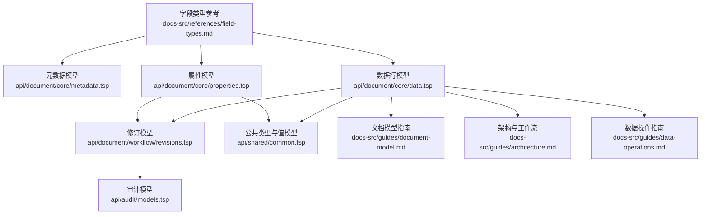
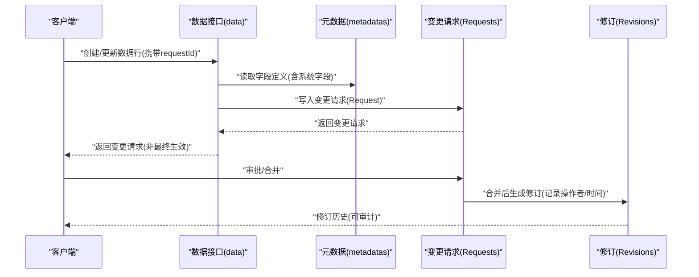
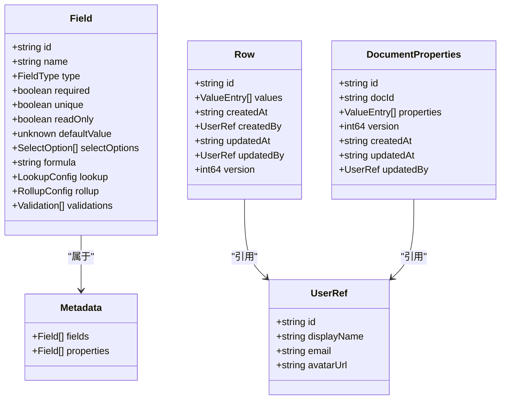

# 系统字段类型

<cite>
**本文引用的文件**
- [字段类型参考.md](file://docs-src/references/field-types.md)
- [文档模型指南.md](file://docs-src/guides/document-model.md)
- [架构与工作流.md](file://docs-src/guides/architecture.md)
- [数据操作指南.md](file://docs-src/guides/data-operations.md)
- [公共类型与值模型.common.tsp](file://api/shared/common.tsp)
- [文档元数据.metadata.tsp](file://api/document/core/metadata.tsp)
- [文档数据.data.tsp](file://api/document/core/data.tsp)
- [文档属性.properties.tsp](file://api/document/core/properties.tsp)
- [修订.revisions.tsp](file://api/document/workflow/revisions.tsp)
- [审计模型.models.tsp](file://api/audit/models.tsp)
- [Webhook指南.WEBHOOK_GUIDE.md](file://api/extensions/webhooks/WEBHOOK_GUIDE.md)
</cite>

## 目录
1. [简介](#简介)
2. [项目结构](#项目结构)
3. [核心组件](#核心组件)
4. [架构总览](#架构总览)
5. [详细组件分析](#详细组件分析)
6. [依赖分析](#依赖分析)
7. [性能考虑](#性能考虑)
8. [故障排查指南](#故障排查指南)
9. [结论](#结论)
10. [附录](#附录)

## 简介
本文件面向 nexusbook-api 的“系统字段类型”，聚焦 auto_number、created_time、updated_time、created_by、updated_by 五类系统自动生成字段。文档从字段定义、值类型、不可变性与自动填充逻辑、审计追踪、API 响应过滤与权限控制等方面，结合仓库中的类型定义与指南，给出权威说明与实操建议。同时，补充字段在数据迁移、API 响应过滤与权限控制方面的特殊处理规则，帮助开发者正确使用与扩展。

## 项目结构
围绕系统字段类型，本仓库的关键文件分布如下：
- 字段类型与值类型参考：docs-src/references/field-types.md
- 文档模型与字段元数据：api/document/core/metadata.tsp、api/document/core/data.tsp、api/document/core/properties.tsp
- 工作流与修订：api/document/workflow/revisions.tsp
- 审计与上下文：api/audit/models.tsp
- 公共类型与值模型：api/shared/common.tsp
- 指南与工作流说明：docs-src/guides/document-model.md、docs-src/guides/architecture.md、docs-src/guides/data-operations.md
- Webhook 审计：api/extensions/webhooks/WEBHOOK_GUIDE.md

图表来源
- [字段类型参考.md](file://docs-src/references/field-types.md#L1-L461)
- [文档元数据.metadata.tsp](file://api/document/core/metadata.tsp#L1-L211)
- [文档数据.data.tsp](file://api/document/core/data.tsp#L1-L726)
- [文档属性.properties.tsp](file://api/document/core/properties.tsp#L64-L198)
- [修订.revisions.tsp](file://api/document/workflow/revisions.tsp#L44-L314)
- [公共类型与值模型.common.tsp](file://api/shared/common.tsp#L617-L742)
- [文档模型指南.md](file://docs-src/guides/document-model.md#L145-L177)
- [架构与工作流.md](file://docs-src/guides/architecture.md#L305-L360)
- [数据操作指南.md](file://docs-src/guides/data-operations.md#L193-L224)

章节来源
- [字段类型参考.md](file://docs-src/references/field-types.md#L1-L461)
- [文档元数据.metadata.tsp](file://api/document/core/metadata.tsp#L1-L211)
- [文档数据.data.tsp](file://api/document/core/data.tsp#L1-L726)
- [文档属性.properties.tsp](file://api/document/core/properties.tsp#L64-L198)
- [修订.revisions.tsp](file://api/document/workflow/revisions.tsp#L44-L314)
- [公共类型与值模型.common.tsp](file://api/shared/common.tsp#L617-L742)
- [文档模型指南.md](file://docs-src/guides/document-model.md#L145-L177)
- [架构与工作流.md](file://docs-src/guides/architecture.md#L305-L360)
- [数据操作指南.md](file://docs-src/guides/data-operations.md#L193-L224)

## 核心组件
本节概述五类系统字段的职责与在系统中的角色定位：
- auto_number：自动编号，用于生成序列号，支持前缀、位数与起始值配置。
- created_time / updated_time：系统自动维护的创建/更新时间戳，值类型为 ISO 8601 字符串。
- created_by / updated_by：系统自动维护的用户上下文，值类型为用户引用 UserRef。

章节来源
- [字段类型参考.md](file://docs-src/references/field-types.md#L370-L406)
- [文档元数据.metadata.tsp](file://api/document/core/metadata.tsp#L29-L52)
- [公共类型与值模型.common.tsp](file://api/shared/common.tsp#L617-L742)
- [文档数据.data.tsp](file://api/document/core/data.tsp#L248-L311)
- [文档属性.properties.tsp](file://api/document/core/properties.tsp#L140-L198)

## 架构总览
系统字段贯穿“元数据定义—数据行/属性—工作流—修订—审计”的全链路，确保不可篡改与可追溯。

图表来源
- [文档数据.data.tsp](file://api/document/core/data.tsp#L538-L726)
- [文档元数据.metadata.tsp](file://api/document/core/metadata.tsp#L160-L181)
- [修订.revisions.tsp](file://api/document/workflow/revisions.tsp#L44-L149)
- [文档模型指南.md](file://docs-src/guides/document-model.md#L771-L822)

## 详细组件分析

### auto_number 自动编号
- 字段类型：auto_number
- 值类型：number（int64）
- 配置选项：prefix（前缀）、digits（位数）、startFrom（起始值）
- 生成规则与格式化：基于配置生成带前缀的零填充序列号
- 不可变性：系统自动生成，客户端不应提交该字段值
- 实际应用示例：可在字段类型参考中查看配置与生成示例

章节来源
- [字段类型参考.md](file://docs-src/references/field-types.md#L370-L387)
- [文档元数据.metadata.tsp](file://api/document/core/metadata.tsp#L29-L52)

### created_time / updated_time 时间戳
- 字段类型：created_time、updated_time
- 值类型：datetime（ISO 8601 字符串）
- 时间精度与时区策略：遵循 ISO 8601 标准；仓库未定义全局时区转换策略，建议统一使用 UTC 存储并在展示层转换
- 自动填充逻辑：系统在创建/更新时自动设置
- 审计追踪：配合 created_by/updated_by 与修订记录，形成完整审计线索

章节来源
- [字段类型参考.md](file://docs-src/references/field-types.md#L392-L399)
- [文档数据.data.tsp](file://api/document/core/data.tsp#L274-L301)
- [文档属性.properties.tsp](file://api/document/core/properties.tsp#L172-L188)
- [架构与工作流.md](file://docs-src/guides/architecture.md#L305-L360)

### created_by / updated_by 用户上下文
- 字段类型：created_by、updated_by
- 值类型：user（UserRef）
- 用户上下文捕获机制：系统在创建/更新时自动填充当前用户引用
- 审计追踪：与 created_time/updated_time、修订记录共同构成审计链路

章节来源
- [字段类型参考.md](file://docs-src/references/field-types.md#L400-L406)
- [公共类型与值模型.common.tsp](file://api/shared/common.tsp#L617-L653)
- [文档数据.data.tsp](file://api/document/core/data.tsp#L283-L301)
- [文档属性.properties.tsp](file://api/document/core/properties.tsp#L190-L198)

### 字段模型中的系统字段
- Field 模型支持 readOnly 字段，系统字段通常应设置为只读，避免被客户端覆盖
- 元数据中定义了系统字段类型枚举，确保字段类型一致性

章节来源
- [文档元数据.metadata.tsp](file://api/document/core/metadata.tsp#L65-L110)
- [字段类型参考.md](file://docs-src/references/field-types.md#L1-L15)

### 审计追踪与修订
- 修订模型包含 createdAt/updatedAt 与变更操作集合，支持审计与回溯
- 审计上下文包含 IP、UA、地理位置与时区等信息，便于审计溯源

章节来源
- [修订.revisions.tsp](file://api/document/workflow/revisions.tsp#L44-L149)
- [审计模型.models.tsp](file://api/audit/models.tsp#L99-L194)

### API 响应与过滤
- 数据行与属性均包含系统字段，查询与分组接口支持 requestId 叠加视图
- 值类型映射与字段类型参考明确了 datetime 的 ISO 8601 格式

章节来源
- [文档数据.data.tsp](file://api/document/core/data.tsp#L40-L63)
- [数据操作指南.md](file://docs-src/guides/data-operations.md#L193-L224)
- [字段类型参考.md](file://docs-src/references/field-types.md#L439-L461)

## 依赖分析
系统字段在类型与模型层面的依赖关系如下：

图表来源
- [文档元数据.metadata.tsp](file://api/document/core/metadata.tsp#L65-L181)
- [文档数据.data.tsp](file://api/document/core/data.tsp#L248-L311)
- [文档属性.properties.tsp](file://api/document/core/properties.tsp#L64-L198)
- [公共类型与值模型.common.tsp](file://api/shared/common.tsp#L617-L742)

章节来源
- [文档元数据.metadata.tsp](file://api/document/core/metadata.tsp#L65-L181)
- [文档数据.data.tsp](file://api/document/core/data.tsp#L248-L311)
- [文档属性.properties.tsp](file://api/document/core/properties.tsp#L64-L198)
- [公共类型与值模型.common.tsp](file://api/shared/common.tsp#L617-L742)

## 性能考虑
- 时间戳存储建议统一为 ISO 8601 字符串，便于跨语言解析与索引优化
- 用户引用字段（UserRef）仅存储最小必要信息，避免冗余字段导致的网络与存储开销
- 批量更新接口支持一次性提交多个目标，减少往返次数，提升吞吐

章节来源
- [字段类型参考.md](file://docs-src/references/field-types.md#L439-L461)
- [文档数据.data.tsp](file://api/document/core/data.tsp#L574-L726)

## 故障排查指南
- 现象：系统字段被客户端覆盖或报错
  - 排查要点：确认字段定义中 readOnly 已启用；检查客户端是否显式提交系统字段
  - 参考路径：字段定义与只读配置
- 现象：时间戳显示异常或时区不一致
  - 排查要点：确认存储为 ISO 8601；在展示层进行时区转换；避免本地时区与 UTC 混用
  - 参考路径：字段类型与值类型映射、架构工作流
- 现象：审计追踪缺失或不完整
  - 排查要点：确认变更通过变更请求与修订生成；检查审计上下文字段是否正确记录
  - 参考路径：修订模型、审计模型、Webhook 审计

章节来源
- [文档元数据.metadata.tsp](file://api/document/core/metadata.tsp#L65-L110)
- [字段类型参考.md](file://docs-src/references/field-types.md#L439-L461)
- [修订.revisions.tsp](file://api/document/workflow/revisions.tsp#L44-L149)
- [审计模型.models.tsp](file://api/audit/models.tsp#L99-L194)
- [Webhook指南.WEBHOOK_GUIDE.md](file://api/extensions/webhooks/WEBHOOK_GUIDE.md#L608-L622)

## 结论
- auto_number、created_time、updated_time、created_by、updated_by 五类系统字段在本系统中承担不可篡改与可审计的核心职责
- 字段类型与值类型在仓库中均有明确定义，建议在字段定义中启用 readOnly，并在客户端避免提交系统字段
- 时间戳采用 ISO 8601，建议统一使用 UTC 存储并在前端进行时区转换
- 审计追踪通过变更请求、修订与审计上下文共同实现，建议结合 Webhook 记录关键事件

## 附录

### 字段类型与值类型映射（摘要）
- auto_number → number（int64）
- created_time / updated_time → datetime（ISO 8601）
- created_by / updated_by → user（UserRef）

章节来源
- [字段类型参考.md](file://docs-src/references/field-types.md#L370-L406)
- [公共类型与值模型.common.tsp](file://api/shared/common.tsp#L617-L742)

### API 响应过滤与权限控制建议
- 响应过滤：在查询接口中，系统字段通常随数据行/属性返回；若需隐藏敏感信息，可在网关或服务端进行字段白名单控制
- 权限控制：created_by/updated_by 与 created_time/updated_time 可作为鉴权与审计依据；建议在接口层对字段访问进行 RBAC 控制

章节来源
- [文档数据.data.tsp](file://api/document/core/data.tsp#L40-L63)
- [数据操作指南.md](file://docs-src/guides/data-operations.md#L193-L224)