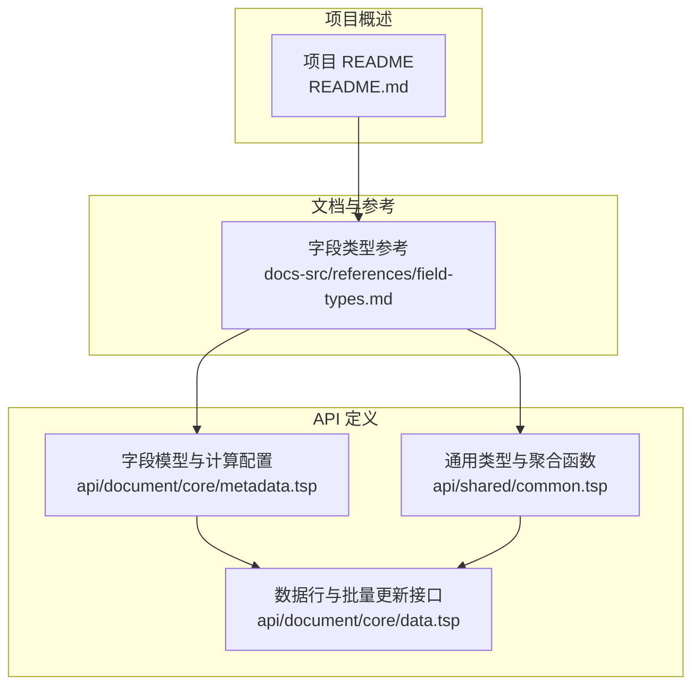
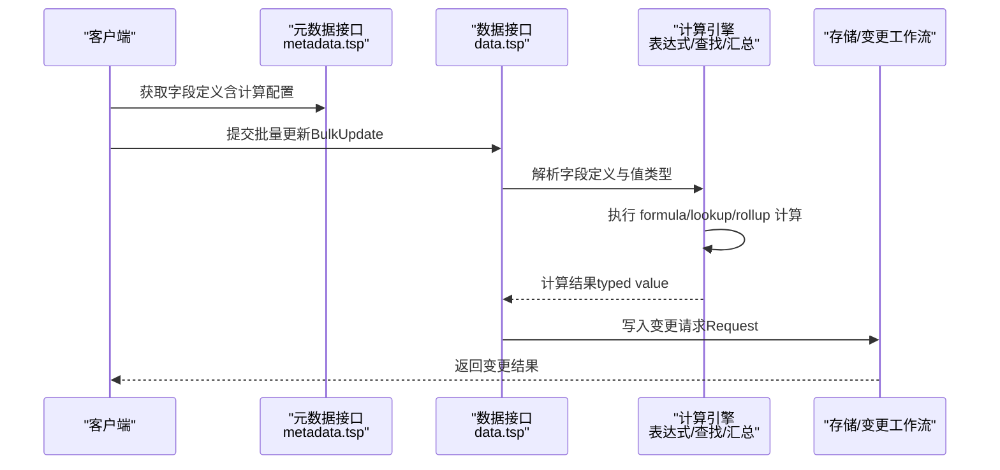
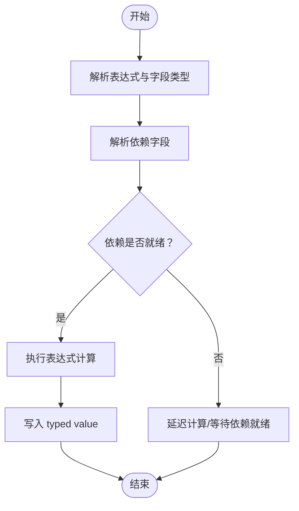
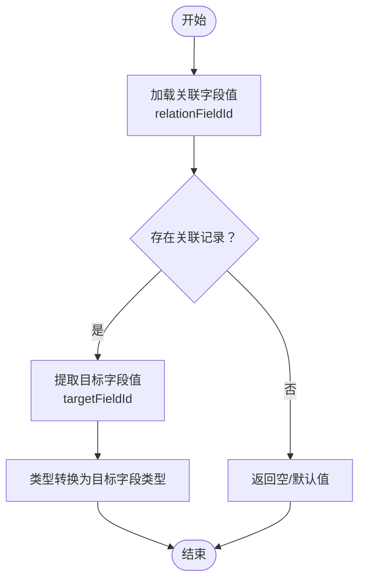
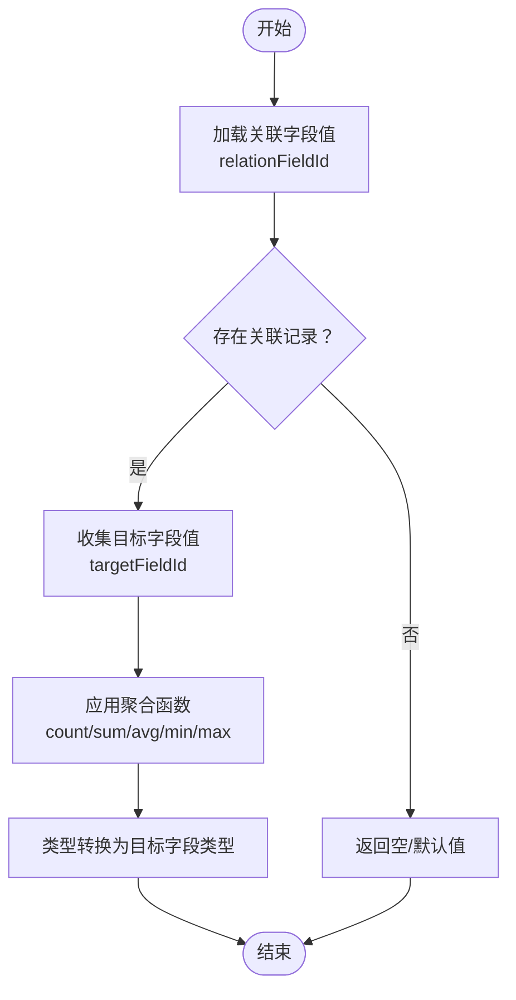
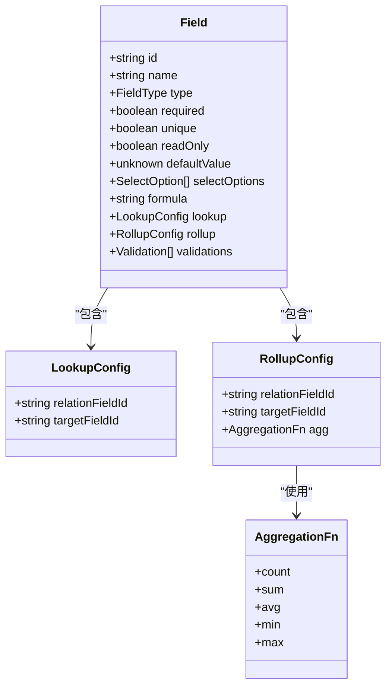
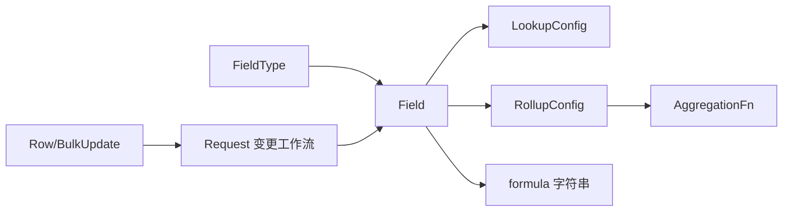

# 计算字段类型

<cite>
**本文引用的文件**
- [README.md](file://README.md)
- [field-types.md](file://docs-src/references/field-types.md)
- [metadata.tsp](file://api/document/core/metadata.tsp)
- [common.tsp](file://api/shared/common.tsp)
- [data.tsp](file://api/document/core/data.tsp)
</cite>

## 目录
1. [简介](#简介)
2. [项目结构](#项目结构)
3. [核心组件](#核心组件)
4. [架构概览](#架构概览)
5. [详细组件分析](#详细组件分析)
6. [依赖分析](#依赖分析)
7. [性能考虑](#性能考虑)
8. [故障排查指南](#故障排查指南)
9. [结论](#结论)
10. [附录](#附录)

## 简介
本文件聚焦 nexusbook-api 的“计算字段类型”，系统性解析三种计算型字段的工作机制与实现边界：
- formula：基于表达式引擎的字符串公式计算
- lookup：基于 relationFieldId 与 targetFieldId 的跨记录查找
- rollup：基于 relationFieldId、targetFieldId 与聚合函数的统计汇总

同时，文档阐述字段模型中的配置结构、依赖追踪与更新触发机制、性能优化策略，并结合业务场景（如订单总额计算、关联任务状态聚合）给出应用模式与安全机制（如循环引用检测）的指导。

## 项目结构
围绕计算字段类型，相关的核心定义与参考文档主要分布在以下位置：
- 字段类型与配置参考：docs-src/references/field-types.md
- 字段模型与计算配置：api/document/core/metadata.tsp
- 通用类型与聚合函数：api/shared/common.tsp
- 数据行与批量更新接口：api/document/core/data.tsp
- 项目总体介绍与能力概述：README.md

**图表来源**
- [field-types.md](file://docs-src/references/field-types.md#L1-L461)
- [metadata.tsp](file://api/document/core/metadata.tsp#L1-L211)
- [common.tsp](file://api/shared/common.tsp#L297-L317)
- [data.tsp](file://api/document/core/data.tsp#L1-L726)
- [README.md](file://README.md#L1-L187)

**章节来源**
- [README.md](file://README.md#L1-L187)
- [field-types.md](file://docs-src/references/field-types.md#L1-L461)
- [metadata.tsp](file://api/document/core/metadata.tsp#L1-L211)
- [common.tsp](file://api/shared/common.tsp#L297-L317)
- [data.tsp](file://api/document/core/data.tsp#L1-L726)

## 核心组件
- 字段模型 Field
  - 字段类型：FieldType（包含 lookup、rollup、formula）
  - 计算配置：formula 字符串、lookup 配置、rollup 配置
- LookupConfig：relationFieldId、targetFieldId
- RollupConfig：relationFieldId、targetFieldId、agg（聚合函数）
- AggregationFn：count、sum、avg、min、max
- 数据行 Row 与批量更新 BulkUpdate：承载字段值与变更工作流

**章节来源**
- [metadata.tsp](file://api/document/core/metadata.tsp#L54-L144)
- [common.tsp](file://api/shared/common.tsp#L297-L317)
- [data.tsp](file://api/document/core/data.tsp#L189-L239)

## 架构概览
计算字段的运行链路可概括为：字段定义（metadata）→ 数据行（data）→ 计算引擎（表达式/查找/汇总）→ 结果写回（变更请求/合并）。

**图表来源**
- [metadata.tsp](file://api/document/core/metadata.tsp#L54-L144)
- [data.tsp](file://api/document/core/data.tsp#L658-L725)
- [common.tsp](file://api/shared/common.tsp#L297-L317)

## 详细组件分析

### formula（公式）字段
- 作用：通过字符串表达式计算值
- 配置：Field.formula（字符串表达式）
- 支持的运算符与函数（参考字段类型参考）：算术、比较、逻辑、函数（SUM、AVG、IF、ROUND 等）
- 执行要点
  - 表达式解析：依据字段元数据确定字段类型，将原始值转换为 typed value 后参与计算
  - 依赖追踪：表达式可能依赖其他字段值；当被依赖字段变化时应触发重算
  - 更新触发：通过变更请求（Request）机制，合并后生效
  - 性能优化：缓存表达式解析结果、延迟计算、批量重算

**图表来源**
- [field-types.md](file://docs-src/references/field-types.md#L352-L369)
- [metadata.tsp](file://api/document/core/metadata.tsp#L93-L98)
- [data.tsp](file://api/document/core/data.tsp#L642-L657)

**章节来源**
- [field-types.md](file://docs-src/references/field-types.md#L352-L369)
- [metadata.tsp](file://api/document/core/metadata.tsp#L93-L98)
- [data.tsp](file://api/document/core/data.tsp#L642-L657)

### lookup（查找）字段
- 作用：从关联记录中查找目标字段的值
- 配置：Field.lookup（LookupConfig）
  - relationFieldId：关联字段 ID
  - targetFieldId：目标字段 ID
- 执行要点
  - 关联解析：根据 relationFieldId 获取关联记录集
  - 目标提取：从关联记录集中提取 targetFieldId 的值
  - 类型转换：将提取值转换为目标字段类型
  - 更新触发：当关联记录或目标字段变化时，触发重算
  - 性能优化：缓存关联结果、索引目标字段值、批量查找

**图表来源**
- [metadata.tsp](file://api/document/core/metadata.tsp#L112-L124)
- [field-types.md](file://docs-src/references/field-types.md#L318-L329)

**章节来源**
- [metadata.tsp](file://api/document/core/metadata.tsp#L112-L124)
- [field-types.md](file://docs-src/references/field-types.md#L318-L329)

### rollup（汇总）字段
- 作用：对关联记录的目标字段进行聚合统计
- 配置：Field.rollup（RollupConfig）
  - relationFieldId：关联字段 ID
  - targetFieldId：目标字段 ID
  - agg：聚合函数（AggregationFn：count、sum、avg、min、max）
- 执行要点
  - 关联解析：根据 relationFieldId 获取关联记录集
  - 聚合计算：对目标字段值应用聚合函数
  - 类型转换：将聚合结果转换为目标字段类型
  - 更新触发：当关联记录或目标字段变化时，触发重算
  - 性能优化：增量聚合、缓存中间结果、批量汇总

**图表来源**
- [metadata.tsp](file://api/document/core/metadata.tsp#L126-L144)
- [common.tsp](file://api/shared/common.tsp#L297-L303)
- [field-types.md](file://docs-src/references/field-types.md#L331-L343)

**章节来源**
- [metadata.tsp](file://api/document/core/metadata.tsp#L126-L144)
- [common.tsp](file://api/shared/common.tsp#L297-L303)
- [field-types.md](file://docs-src/references/field-types.md#L331-L343)

### 字段模型与配置结构
- Field 模型
  - id、name、type（FieldType）
  - required、unique、readOnly、defaultValue、selectOptions
  - 计算配置：formula（字符串）、lookup（LookupConfig）、rollup（RollupConfig）
  - 校验规则：validations（ruleType、config、message）
- LookupConfig
  - relationFieldId：关联字段 ID
  - targetFieldId：目标字段 ID
- RollupConfig
  - relationFieldId：关联字段 ID
  - targetFieldId：目标字段 ID
  - agg：AggregationFn（count、sum、avg、min、max）

**图表来源**
- [metadata.tsp](file://api/document/core/metadata.tsp#L54-L144)
- [common.tsp](file://api/shared/common.tsp#L297-L303)

**章节来源**
- [metadata.tsp](file://api/document/core/metadata.tsp#L54-L144)
- [common.tsp](file://api/shared/common.tsp#L297-L303)

## 依赖分析
- 字段类型与计算配置
  - FieldType 包含 lookup、rollup、formula，分别对应不同的计算路径
  - 计算配置（formula、lookup、rollup）在 Field 模型中并存，系统按类型分支处理
- 聚合函数与分组查询
  - AggregationFn 与 GroupBy/GroupNode/GroupedResult 在通用类型中定义，用于分组与聚合查询，与 rollup 字段的聚合语义一致
- 数据行与批量更新
  - BulkUpdate 与 Row 定义了字段值集合与审计信息，变更通过 Request 流程合并生效，为计算字段的重算提供触发点

**图表来源**
- [metadata.tsp](file://api/document/core/metadata.tsp#L29-L52)
- [metadata.tsp](file://api/document/core/metadata.tsp#L54-L144)
- [common.tsp](file://api/shared/common.tsp#L297-L317)
- [data.tsp](file://api/document/core/data.tsp#L189-L239)

**章节来源**
- [metadata.tsp](file://api/document/core/metadata.tsp#L29-L52)
- [metadata.tsp](file://api/document/core/metadata.tsp#L54-L144)
- [common.tsp](file://api/shared/common.tsp#L297-L317)
- [data.tsp](file://api/document/core/data.tsp#L189-L239)

## 性能考虑
- 表达式计算
  - 缓存表达式解析树与符号表，避免重复解析
  - 批量重算：当依赖字段批量更新时，合并重算批次，减少多次 IO
- 查找回路
  - 缓存关联结果与目标字段值映射
  - 为高频字段建立索引，加速查找
- 汇总计算
  - 增量聚合：仅对新增/删除/变更的记录进行局部重算
  - 分组缓存：对分组键的聚合结果进行缓存，命中则直接返回
- 变更工作流
  - 利用 Request 合并机制，减少频繁写入
  - 深分页与游标查询降低查询开销

[本节为通用性能建议，不直接分析具体文件]

## 故障排查指南
- 字段类型不匹配
  - 现象：计算结果类型异常或无法写入
  - 排查：确认 Field.type 与计算结果类型一致；检查 ValueEntry.value 的结构
- 表达式语法错误
  - 现象：表达式解析失败或计算异常
  - 排查：核对 formula 字符串语法；确认依赖字段存在且类型兼容
- 关联字段缺失
  - 现象：lookup/rollup 返回空值
  - 排查：确认 relationFieldId 正确；检查关联记录是否存在；核对 targetFieldId
- 循环引用
  - 现象：计算死循环或栈溢出
  - 排查：建立依赖图，检测环；在表达式与查找中避免自引用或相互引用
- 变更未生效
  - 现象：更新后计算值未变化
  - 排查：确认变更通过 Request 合并；检查重算触发条件

**章节来源**
- [field-types.md](file://docs-src/references/field-types.md#L352-L369)
- [metadata.tsp](file://api/document/core/metadata.tsp#L93-L144)
- [data.tsp](file://api/document/core/data.tsp#L658-L725)

## 结论
- formula、lookup、rollup 三类计算字段分别覆盖“表达式计算”“跨记录查找”“统计汇总”的核心场景
- 字段模型与通用类型清晰定义了配置结构与聚合函数
- 变更请求工作流为计算字段的重算提供了稳定的触发与合并机制
- 性能优化与安全机制（循环引用检测）是保障系统稳定性的关键

[本节为总结性内容，不直接分析具体文件]

## 附录

### 字段类型参考（摘要）
- 计算类型：lookup、rollup、formula、auto_number
- 支持的运算符与函数（formula）：算术、比较、逻辑、函数（SUM、AVG、IF、ROUND 等）
- 聚合函数（rollup）：count、sum、avg、min、max

**章节来源**
- [field-types.md](file://docs-src/references/field-types.md#L1-L15)
- [field-types.md](file://docs-src/references/field-types.md#L316-L369)
- [field-types.md](file://docs-src/references/field-types.md#L331-L343)

### 字段模型与配置示例（路径指引）
- Field 模型与计算配置
  - [字段模型定义](file://api/document/core/metadata.tsp#L54-L144)
- LookupConfig
  - [查找配置结构](file://api/document/core/metadata.tsp#L112-L124)
- RollupConfig
  - [汇总配置结构](file://api/document/core/metadata.tsp#L126-L144)
- AggregationFn
  - [聚合函数枚举](file://api/shared/common.tsp#L297-L303)

**章节来源**
- [metadata.tsp](file://api/document/core/metadata.tsp#L54-L144)
- [common.tsp](file://api/shared/common.tsp#L297-L303)