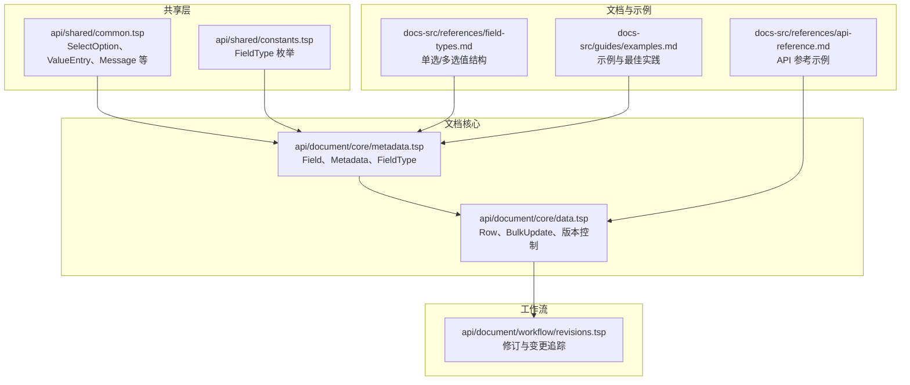
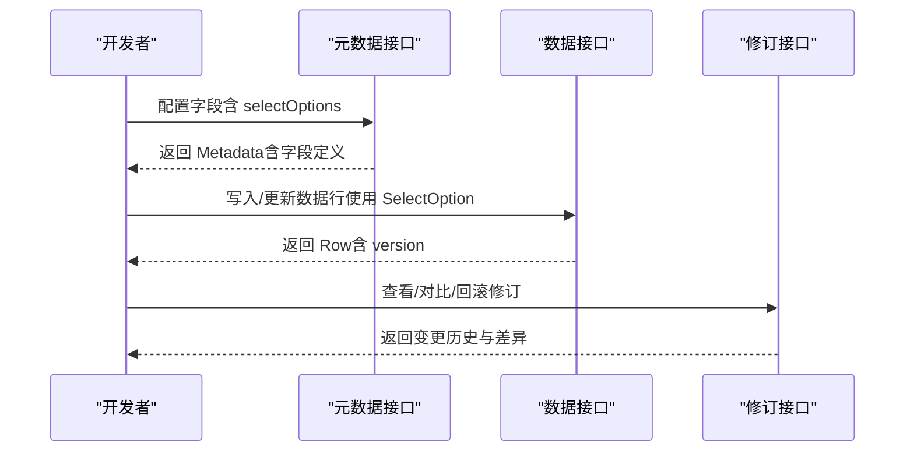
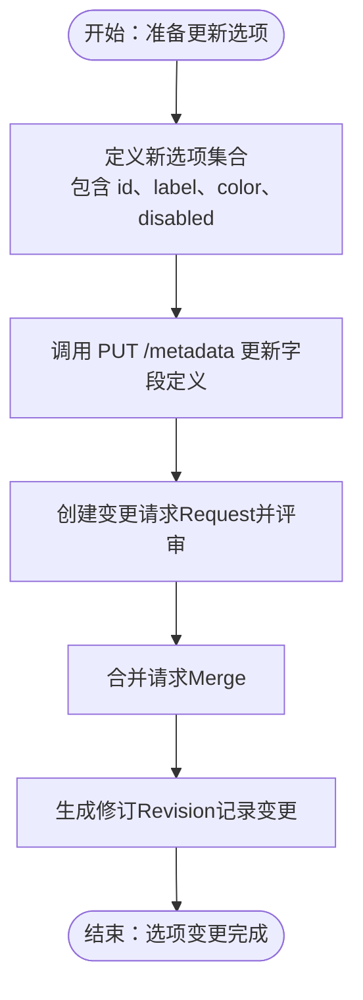
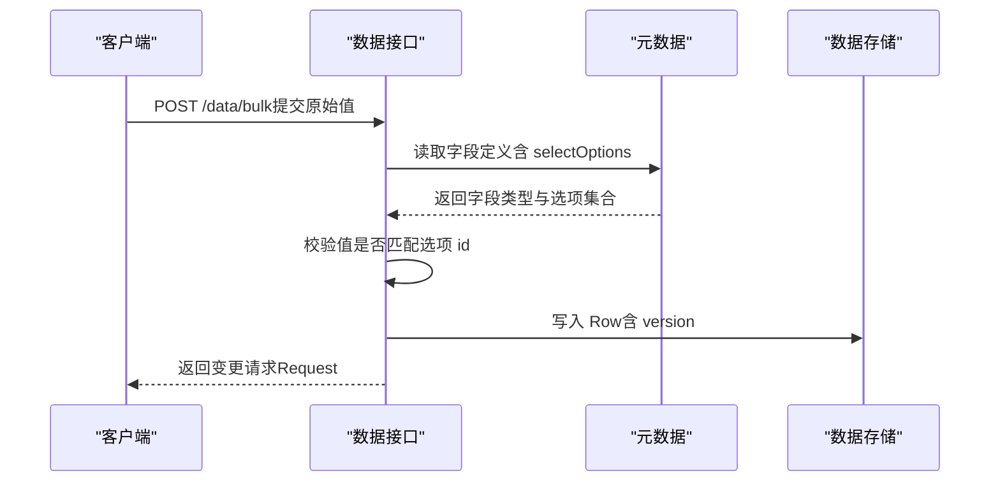
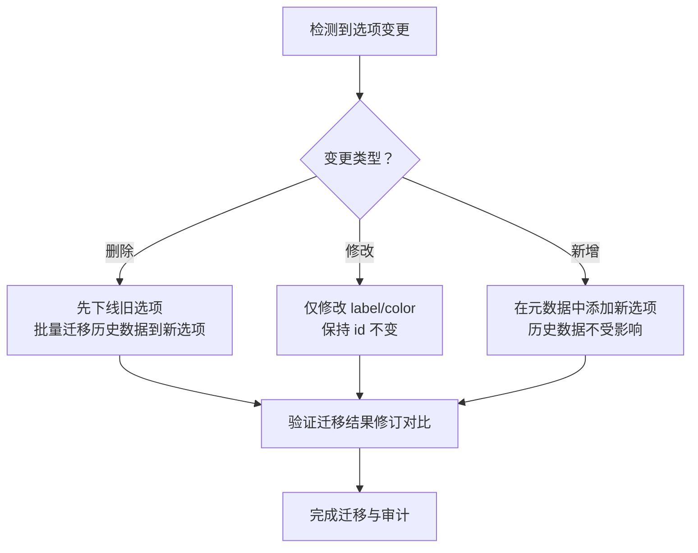
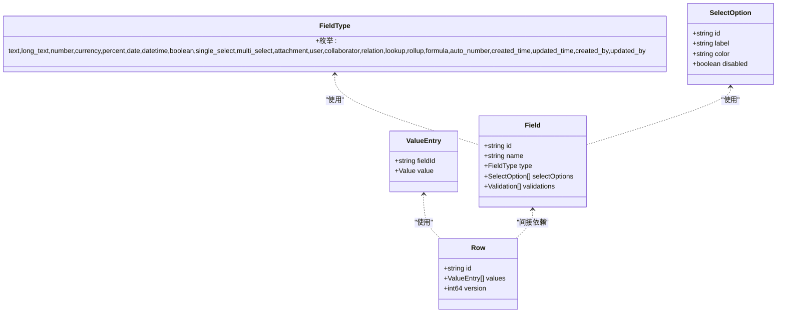

# 选项管理

<cite>
**本文引用的文件**
- [common.tsp](file://api/shared/common.tsp)
- [metadata.tsp](file://api/document/core/metadata.tsp)
- [constants.tsp](file://api/shared/constants.tsp)
- [data.tsp](file://api/document/core/data.tsp)
- [revisions.tsp](file://api/document/workflow/revisions.tsp)
- [field-types.md](file://docs-src/references/field-types.md)
- [examples.md](file://docs-src/guides/examples.md)
- [api-reference.md](file://docs-src/references/api-reference.md)
</cite>

## 目录
1. [简介](#简介)
2. [项目结构](#项目结构)
3. [核心组件](#核心组件)
4. [架构总览](#架构总览)
5. [详细组件分析](#详细组件分析)
6. [依赖分析](#依赖分析)
7. [性能考虑](#性能考虑)
8. [故障排查指南](#故障排查指南)
9. [结论](#结论)
10. [附录](#附录)

## 简介
本技术文档围绕 nexusbook-api 的“选项管理”能力展开，重点说明：
- 如何通过字段配置中的 selectOptions 为 single_select 和 multi_select 字段提供预定义选项列表；
- SelectOption 类型（来自 Common 命名空间）的结构与 UI 展示作用（id、label、color、disabled 等）；
- 选项集合的管理方式（增删改与版本控制）；
- 选项与字段值之间的引用关系与引用完整性保障；
- 实际业务示例（订单状态枚举、产品分类）；
- 选项变更对历史数据的影响与迁移策略。

## 项目结构
与“选项管理”直接相关的代码分布在以下模块：
- 共享类型与通用模型：api/shared/common.tsp（定义 SelectOption、ValueEntry 等）
- 字段与元数据：api/document/core/metadata.tsp（定义 Field、Metadata、FieldType）
- 字段类型参考：docs-src/references/field-types.md（单选/多选值结构与示例）
- 数据行与批量更新：api/document/core/data.tsp（Row、BulkUpdate、版本控制）
- 工作流与修订：api/document/workflow/revisions.tsp（变更追踪、回滚、对比）

图表来源
- [common.tsp](file://api/shared/common.tsp#L499-L523)
- [constants.tsp](file://api/shared/constants.tsp#L145-L204)
- [metadata.tsp](file://api/document/core/metadata.tsp#L29-L52)
- [data.tsp](file://api/document/core/data.tsp#L248-L311)
- [revisions.tsp](file://api/document/workflow/revisions.tsp#L45-L149)
- [field-types.md](file://docs-src/references/field-types.md#L180-L230)
- [examples.md](file://docs-src/guides/examples.md#L1-L120)
- [api-reference.md](file://docs-src/references/api-reference.md#L227-L247)

章节来源
- [common.tsp](file://api/shared/common.tsp#L499-L523)
- [metadata.tsp](file://api/document/core/metadata.tsp#L54-L110)
- [field-types.md](file://docs-src/references/field-types.md#L180-L230)

## 核心组件
- SelectOption（通用类型）
  - 字段：id、label、color、disabled
  - 用途：作为 single_select 与 multi_select 字段的值载体
  - UI 展示：颜色用于视觉区分；禁用用于状态控制
- ValueEntry（通用类型）
  - 字段：fieldId、value（联合类型，包含 single_select/multi_select）
- Field（元数据）
  - 字段：id、name、type、required、unique、readOnly、defaultValue、selectOptions（选项集合）、validations 等
- FieldType（枚举）
  - 包含 single_select、multi_select 等类型
- Row（数据行）
  - 字段：id、values（ValueEntry[]）、version（乐观锁）
- BulkUpdate（批量更新）
  - 支持将原始值提交给目标行/字段，服务端根据 metadata 解析类型
- Revision（修订）
  - 记录变更历史、对比差异、回滚能力

章节来源
- [common.tsp](file://api/shared/common.tsp#L499-L523)
- [common.tsp](file://api/shared/common.tsp#L710-L742)
- [metadata.tsp](file://api/document/core/metadata.tsp#L54-L110)
- [constants.tsp](file://api/shared/constants.tsp#L145-L204)
- [data.tsp](file://api/document/core/data.tsp#L248-L311)
- [data.tsp](file://api/document/core/data.tsp#L189-L239)
- [revisions.tsp](file://api/document/workflow/revisions.tsp#L45-L149)

## 架构总览
选项管理贯穿“元数据定义—字段值—数据行—修订追踪”的全链路：

图表来源
- [metadata.tsp](file://api/document/core/metadata.tsp#L183-L211)
- [data.tsp](file://api/document/core/data.tsp#L565-L725)
- [revisions.tsp](file://api/document/workflow/revisions.tsp#L323-L546)

## 详细组件分析

### 1) SelectOption 类型与 UI 展示
- 结构要点
  - id：选项唯一标识，用于字段值引用与历史兼容
  - label：显示文本
  - color：可选，用于 UI 着色（如状态色）
  - disabled：可选，用于禁用选项
- 值类型映射
  - single_select：Value.single_select = SelectOption
  - multi_select：Value.multi_select = SelectOption[]
- UI 展示作用
  - 颜色用于状态可视化（如绿色表示“启用”，红色表示“停用”）
  - 禁用用于不可用状态（如过期选项）

章节来源
- [common.tsp](file://api/shared/common.tsp#L499-L523)
- [common.tsp](file://api/shared/common.tsp#L710-L742)
- [field-types.md](file://docs-src/references/field-types.md#L180-L230)

### 2) 字段配置与选项集合管理
- 字段定义
  - Field.selectOptions：为选择类字段提供可用选项集合
  - Field.validations：可结合选项进行校验（如必选、唯一）
- 选项集合的增删改
  - 通过元数据接口更新字段定义（MetadataApi.putMetadata）
  - 选项变更属于“元数据更新”，会被纳入修订历史
- 版本控制
  - 元数据更新与数据行更新均受工作流约束（变更请求→合并→修订）
  - 数据行版本号用于乐观锁，避免并发覆盖

图表来源
- [metadata.tsp](file://api/document/core/metadata.tsp#L183-L211)
- [revisions.tsp](file://api/document/workflow/revisions.tsp#L45-L149)
- [data.tsp](file://api/document/core/data.tsp#L565-L725)

章节来源
- [metadata.tsp](file://api/document/core/metadata.tsp#L54-L110)
- [metadata.tsp](file://api/document/core/metadata.tsp#L183-L211)
- [revisions.tsp](file://api/document/workflow/revisions.tsp#L45-L149)

### 3) 选项与字段值的引用关系与完整性
- 引用关系
  - 字段值中的 single_select/multi_select 仅允许引用已在 Field.selectOptions 中定义的 id
  - 历史数据中的选项 id 保持不变，确保跨版本引用稳定
- 完整性保障
  - 元数据更新时，系统基于 Field.type 与 Field.selectOptions 对值进行校验
  - 批量更新接口会根据 docId 获取 metadata，自动解析值类型并校验有效性
  - 修订系统记录每次变更（oldValue/newValue），便于审计与回滚

图表来源
- [data.tsp](file://api/document/core/data.tsp#L658-L725)
- [metadata.tsp](file://api/document/core/metadata.tsp#L54-L110)

章节来源
- [data.tsp](file://api/document/core/data.tsp#L658-L725)
- [metadata.tsp](file://api/document/core/metadata.tsp#L54-L110)

### 4) 实际业务示例

#### 4.1 订单状态枚举
- 设计思路
  - 在订单文档的元数据中为状态字段配置 selectOptions（如 draft、pending、confirmed、shipped、delivered、cancelled）
  - 使用 color 为不同状态提供视觉提示
- 示例路径
  - 字段类型与值结构参考：[field-types.md](file://docs-src/references/field-types.md#L180-L230)
  - 示例场景参考：[examples.md](file://docs-src/guides/examples.md#L1-L120)

章节来源
- [field-types.md](file://docs-src/references/field-types.md#L180-L230)
- [examples.md](file://docs-src/guides/examples.md#L1-L120)

#### 4.2 产品分类
- 设计思路
  - 为产品文档的分类字段配置多选选项（multi_select），支持打标签式分类
  - 通过 color 区分主分类与子分类
- 示例路径
  - 多选值结构参考：[field-types.md](file://docs-src/references/field-types.md#L212-L229)
  - API 参考示例：[api-reference.md](file://docs-src/references/api-reference.md#L227-L247)

章节来源
- [field-types.md](file://docs-src/references/field-types.md#L212-L229)
- [api-reference.md](file://docs-src/references/api-reference.md#L227-L247)

### 5) 选项变更对历史数据的影响与迁移策略
- 影响分析
  - 新增选项：不影响历史数据引用（历史值仍指向旧 id）
  - 删除选项：可能导致历史数据无法显示对应 label/color，但引用 id 保持有效
  - 修改选项：建议保留 id 不变，仅修改 label/color，避免破坏历史引用
- 迁移策略
  - 选项新增：在元数据中追加新选项，历史数据不受影响
  - 选项删除：先下线旧选项，再通过批量更新将历史数据迁移到新选项 id
  - 选项重命名/颜色调整：通过更新元数据中的 label/color，不影响历史数据
  - 变更追踪：通过修订接口对比差异，确认迁移效果与副作用

图表来源
- [revisions.tsp](file://api/document/workflow/revisions.tsp#L395-L475)
- [data.tsp](file://api/document/core/data.tsp#L658-L725)
- [metadata.tsp](file://api/document/core/metadata.tsp#L183-L211)

章节来源
- [revisions.tsp](file://api/document/workflow/revisions.tsp#L395-L475)
- [data.tsp](file://api/document/core/data.tsp#L658-L725)
- [metadata.tsp](file://api/document/core/metadata.tsp#L183-L211)

## 依赖分析
- 组件耦合
  - Field 依赖 FieldType（枚举）与 SelectOption（通用类型）
  - Row 依赖 ValueEntry（通用类型），ValueEntry 的 value 联合类型包含 SelectOption
  - DataApi 依赖 Metadata 以解析字段类型与选项集合
  - RevisionsApi 依赖 ChangeOperation 记录变更，支持对比与回滚
- 外部依赖
  - 共享类型（Common）被文档核心模块广泛使用，确保一致性

图表来源
- [constants.tsp](file://api/shared/constants.tsp#L145-L204)
- [common.tsp](file://api/shared/common.tsp#L499-L523)
- [common.tsp](file://api/shared/common.tsp#L710-L742)
- [metadata.tsp](file://api/document/core/metadata.tsp#L54-L110)
- [data.tsp](file://api/document/core/data.tsp#L248-L311)

章节来源
- [constants.tsp](file://api/shared/constants.tsp#L145-L204)
- [common.tsp](file://api/shared/common.tsp#L499-L523)
- [common.tsp](file://api/shared/common.tsp#L710-L742)
- [metadata.tsp](file://api/document/core/metadata.tsp#L54-L110)
- [data.tsp](file://api/document/core/data.tsp#L248-L311)

## 性能考虑
- 批量更新
  - 使用 /data/bulk 接口减少往返次数，提升吞吐
- 查询与分页
  - 使用分页与游标，避免一次性加载过多数据
- 乐观锁
  - 更新行时携带 version，避免并发冲突导致的重复写入
- 修订对比
  - 仅在需要时进行修订对比与回滚，避免不必要的计算开销

[本节为通用指导，不涉及具体文件分析]

## 故障排查指南
- 常见问题
  - 选项 id 不存在：检查 Field.selectOptions 是否包含该 id
  - 颜色/标签不生效：确认 UI 层是否正确读取 color/label
  - 并发更新失败：检查 version 是否最新
  - 历史数据无法显示：确认选项是否被删除或重命名
- 定位手段
  - 使用修订接口对比差异，定位具体变更
  - 通过变更历史接口查询特定行/字段的历史变更
  - 使用批量更新接口的 requestId 参数预览叠加视图

章节来源
- [revisions.tsp](file://api/document/workflow/revisions.tsp#L395-L475)
- [data.tsp](file://api/document/core/data.tsp#L565-L725)

## 结论
- 选项管理的关键在于：稳定的 id、清晰的 label/color、严格的校验与完善的修订追踪
- 通过元数据接口集中管理选项集合，并结合工作流实现安全的变更与审计
- 历史数据的稳定性通过 id 不变与修订系统得到保障，迁移策略应优先考虑平滑过渡

[本节为总结性内容，不涉及具体文件分析]

## 附录
- 相关参考
  - 字段类型与值结构：[field-types.md](file://docs-src/references/field-types.md#L180-L230)
  - 示例与最佳实践：[examples.md](file://docs-src/guides/examples.md#L1-L120)
  - API 参考示例：[api-reference.md](file://docs-src/references/api-reference.md#L227-L247)

[本节为补充材料，不涉及具体文件分析]