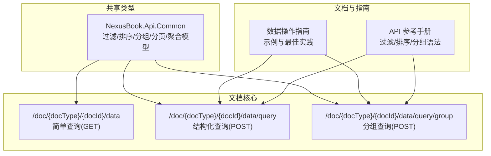
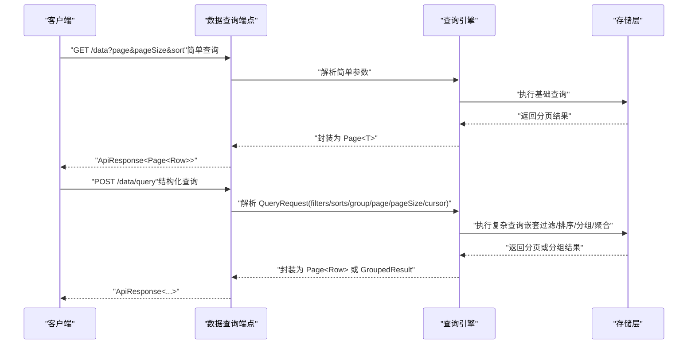
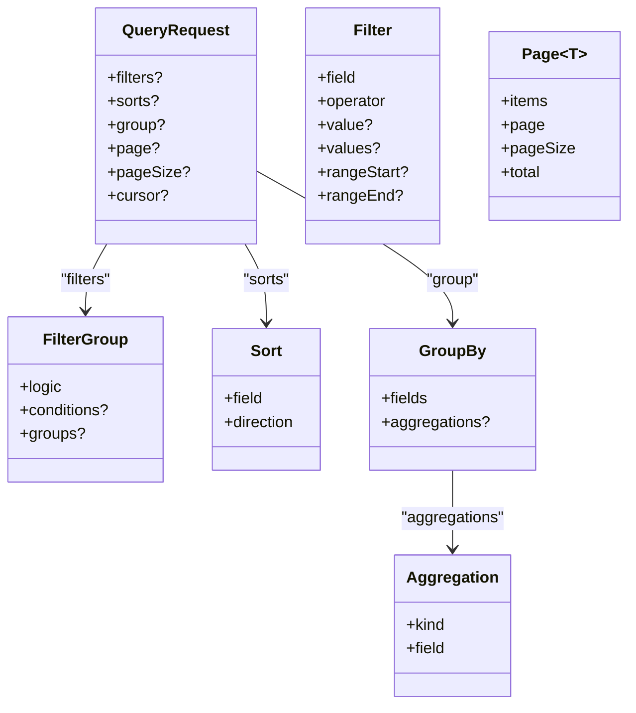

# 查询系统

<cite>
**本文引用的文件**
- [api/main.tsp](file://api/main.tsp)
- [api/shared/common.tsp](file://api/shared/common.tsp)
- [api/document/core/data.tsp](file://api/document/core/data.tsp)
- [docs-src/guides/data-operations.md](file://docs-src/guides/data-operations.md)
- [docs-src/references/api-reference.md](file://docs-src/references/api-reference.md)
</cite>

## 目录
1. [简介](#简介)
2. [项目结构](#项目结构)
3. [核心组件](#核心组件)
4. [架构总览](#架构总览)
5. [详细组件分析](#详细组件分析)
6. [依赖关系分析](#依赖关系分析)
7. [性能考量](#性能考量)
8. [故障排查指南](#故障排查指南)
9. [结论](#结论)
10. [附录](#附录)

## 简介
本文件面向 NexusBook API 的查询系统，系统性说明两类查询方式：基于查询参数的简单查询与基于请求体的结构化查询；并深入解析 QueryRequest 模型的 filters、sorts、group、page、pageSize、cursor 字段的用法与组合方式。文档还提供嵌套过滤、多字段排序、分组聚合的 JSON 示例，对比简单查询 DSL 与结构化查询的适用场景，并阐述分页机制（页码分页与游标分页）及其性能考量。最后给出性能优化建议与常见问题排查指引。

## 项目结构
查询系统主要由以下模块构成：
- 通用类型与查询模型：位于共享命名空间，定义过滤、排序、分组、聚合、分页等通用结构。
- 数据查询端点：位于文档核心模块，提供结构化查询与分组查询接口。
- 指南与参考：提供查询示例、最佳实践与 API 参考。

图表来源
- [api/shared/common.tsp](file://api/shared/common.tsp#L205-L427)
- [api/document/core/data.tsp](file://api/document/core/data.tsp#L430-L536)
- [docs-src/guides/data-operations.md](file://docs-src/guides/data-operations.md#L190-L214)
- [docs-src/references/api-reference.md](file://docs-src/references/api-reference.md#L190-L247)

章节来源
- [api/main.tsp](file://api/main.tsp#L85-L95)
- [api/shared/common.tsp](file://api/shared/common.tsp#L205-L427)
- [api/document/core/data.tsp](file://api/document/core/data.tsp#L430-L536)
- [docs-src/guides/data-operations.md](file://docs-src/guides/data-operations.md#L190-L214)
- [docs-src/references/api-reference.md](file://docs-src/references/api-reference.md#L190-L247)

## 核心组件
- QueryRequest 模型：承载结构化查询的所有参数，包括 filters、sorts、group、page、pageSize、cursor。
- FilterGroup/Filter：支持 AND/OR 逻辑组合与嵌套，覆盖等值、范围、包含、空值等操作符。
- Sort：支持多字段排序，每条排序规则包含字段与方向。
- GroupBy/Aggregation：支持多级分组与聚合，聚合函数包括 count、sum、avg、min、max。
- 分页模型：Page<T>，包含 items、page、pageSize、total；同时支持 page/pageSize 与 cursor 两种分页模式。

章节来源
- [api/shared/common.tsp](file://api/shared/common.tsp#L205-L427)
- [api/document/core/data.tsp](file://api/document/core/data.tsp#L319-L373)

## 架构总览
查询系统通过统一的 QueryRequest 模型与通用类型，将简单查询与结构化查询解耦，既满足快速列表查询，也支持复杂过滤、排序、分组与聚合。

图表来源
- [api/document/core/data.tsp](file://api/document/core/data.tsp#L430-L536)
- [api/shared/common.tsp](file://api/shared/common.tsp#L179-L203)

## 详细组件分析

### QueryRequest 模型与字段用法
- filters：嵌套过滤条件，支持 AND/OR 逻辑与子组嵌套，覆盖等值、不等、包含于、区间、包含、是否为空、是否非空等操作符。
- sorts：排序条件集合，支持多字段排序，每条规则包含字段与方向（升序/降序）。
- group：分组与聚合定义，fields 按顺序定义分组层级，aggregations 定义聚合函数与目标字段。
- page/pageSize：页码与每页数量，默认页码为 1，pageSize 默认 20，最大 200。
- cursor：游标分页参数，用于深分页场景，避免跳页导致的性能与一致性问题。

章节来源
- [api/document/core/data.tsp](file://api/document/core/data.tsp#L319-L373)
- [api/shared/common.tsp](file://api/shared/common.tsp#L205-L427)

### 简单查询（基于查询参数）
- 适用场景：快速列表查询、基础排序与分页，无需复杂过滤与分组。
- 关键参数：page、pageSize、sort（字段:方向）。
- 示例参考：API 参考手册中的 GET /data 列表查询示例。

章节来源
- [docs-src/references/api-reference.md](file://docs-src/references/api-reference.md#L190-L214)
- [docs-src/guides/data-operations.md](file://docs-src/guides/data-operations.md#L78-L84)

### 结构化查询（基于请求体）
- 适用场景：复杂过滤（AND/OR/嵌套）、多字段排序、分组与聚合、深分页。
- 关键字段：filters、sorts、group、page、pageSize、cursor。
- 示例参考：API 参考手册中的 POST /data/query 结构化查询示例。

章节来源
- [docs-src/references/api-reference.md](file://docs-src/references/api-reference.md#L227-L247)
- [docs-src/guides/data-operations.md](file://docs-src/guides/data-operations.md#L85-L104)

### 嵌套过滤条件
- 逻辑组合：FilterGroup.logic 支持 AND/OR。
- 条件集合：FilterGroup.conditions 与 FilterGroup.groups 支持嵌套组合。
- 操作符：Filter.operator 支持等值、不等、包含于、区间、包含、是否为空、是否非空等。
- 示例参考：数据操作指南中的嵌套过滤示例。

章节来源
- [api/shared/common.tsp](file://api/shared/common.tsp#L272-L295)
- [api/shared/common.tsp](file://api/shared/common.tsp#L234-L270)
- [docs-src/guides/data-operations.md](file://docs-src/guides/data-operations.md#L360-L381)

### 多字段排序
- Sort.field 与 Sort.direction 支持多条排序规则，按顺序生效。
- 示例参考：API 参考手册与数据操作指南中的排序示例。

章节来源
- [api/shared/common.tsp](file://api/shared/common.tsp#L220-L233)
- [docs-src/references/api-reference.md](file://docs-src/references/api-reference.md#L629-L637)
- [docs-src/guides/data-operations.md](file://docs-src/guides/data-operations.md#L85-L104)

### 分组与聚合
- GroupBy.fields 定义分组层级顺序，aggregations 定义聚合函数与目标字段。
- 支持单级、两级、三级分组与聚合，返回树状分组结果。
- 示例参考：API 参考手册与数据操作指南中的分组与聚合示例。

章节来源
- [api/shared/common.tsp](file://api/shared/common.tsp#L334-L357)
- [api/shared/common.tsp](file://api/shared/common.tsp#L359-L461)
- [docs-src/references/api-reference.md](file://docs-src/references/api-reference.md#L638-L650)
- [docs-src/guides/data-operations.md](file://docs-src/guides/data-operations.md#L360-L381)

### 分页机制：页码分页 vs 游标分页
- 页码分页（page/pageSize）：适合浅分页与稳定排序，但深页场景可能产生性能与一致性问题。
- 游标分页（cursor）：适合深分页，通过游标定位下一页，避免跳页带来的偏移误差与重复扫描。
- 性能考量：游标分页在大数据量场景下更稳定，尤其在频繁插入/删除或排序列不稳定时。

章节来源
- [api/document/core/data.tsp](file://api/document/core/data.tsp#L347-L373)
- [docs-src/guides/data-operations.md](file://docs-src/guides/data-operations.md#L340-L359)

### 端点与返回结构
- 结构化查询端点：POST /doc/{docType}/{docId}/data/query
- 分组查询端点：POST /doc/{docType}/{docId}/data/query/group
- 返回结构：Page<T>（items、page、pageSize、total）或 GroupedResult（groups、total、groupBy）

章节来源
- [api/document/core/data.tsp](file://api/document/core/data.tsp#L430-L536)
- [api/shared/common.tsp](file://api/shared/common.tsp#L179-L203)
- [api/shared/common.tsp](file://api/shared/common.tsp#L463-L497)

## 依赖关系分析
- QueryRequest 依赖通用类型：FilterGroup、Filter、Sort、GroupBy、Aggregation、Direction、Page。
- 数据查询端点依赖 QueryRequest 与通用类型，实现结构化查询与分组查询。
- 指南与参考文档为查询系统提供示例与最佳实践。

图表来源
- [api/shared/common.tsp](file://api/shared/common.tsp#L205-L427)
- [api/document/core/data.tsp](file://api/document/core/data.tsp#L319-L373)

章节来源
- [api/shared/common.tsp](file://api/shared/common.tsp#L205-L427)
- [api/document/core/data.tsp](file://api/document/core/data.tsp#L319-L373)

## 性能考量
- 合理设置分页大小：建议 20–100 之间，避免过小导致请求次数过多，过大导致响应时间过长。
- 只查询必要字段：避免查询所有字段，仅选择需要的字段以降低网络与序列化开销。
- 在服务端过滤：优先在服务端使用 filters 减少数据量，避免客户端二次过滤。
- 深分页使用游标：在大数据量场景优先使用 cursor，提升稳定性与性能。
- 多字段排序：尽量减少排序字段数量，避免复合索引缺失导致的排序成本过高。

章节来源
- [docs-src/guides/data-operations.md](file://docs-src/guides/data-operations.md#L294-L359)

## 故障排查指南
- 分页异常：检查 page 与 pageSize 的取值范围，确认是否越界。
- 过滤无效：核对字段名与操作符是否正确，嵌套逻辑是否符合预期。
- 排序报错：确认排序字段存在且类型可排序。
- 分组聚合结果异常：核对 GroupBy.fields 与 Aggregation.field 是否匹配。
- 游标分页问题：确认游标格式正确，避免跨排序键或跨时间窗口使用旧游标。

章节来源
- [docs-src/references/api-reference.md](file://docs-src/references/api-reference.md#L604-L650)
- [docs-src/guides/data-operations.md](file://docs-src/guides/data-operations.md#L294-L359)

## 结论
NexusBook API 的查询系统通过统一的 QueryRequest 模型与通用类型，提供了从简单查询到复杂查询的完整能力。开发者可根据场景选择合适的查询方式：简单查询用于快速列表与基础排序，结构化查询用于复杂过滤、多字段排序与分组聚合。配合合理的分页策略（优先游标分页）、字段裁剪与服务端过滤，可显著提升查询性能与用户体验。

## 附录
- 简单查询示例（GET /data）：参见 API 参考手册中的 GET /data 列表查询示例。
- 结构化查询示例（POST /data/query）：参见 API 参考手册中的 POST /data/query 结构化查询示例。
- 嵌套过滤示例：参见数据操作指南中的嵌套过滤示例。
- 分组与聚合示例：参见 API 参考手册与数据操作指南中的分组与聚合示例。

章节来源
- [docs-src/references/api-reference.md](file://docs-src/references/api-reference.md#L190-L247)
- [docs-src/guides/data-operations.md](file://docs-src/guides/data-operations.md#L85-L104)
- [docs-src/guides/data-operations.md](file://docs-src/guides/data-operations.md#L360-L381)