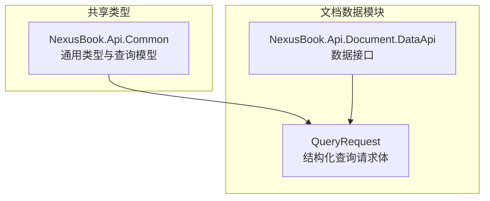
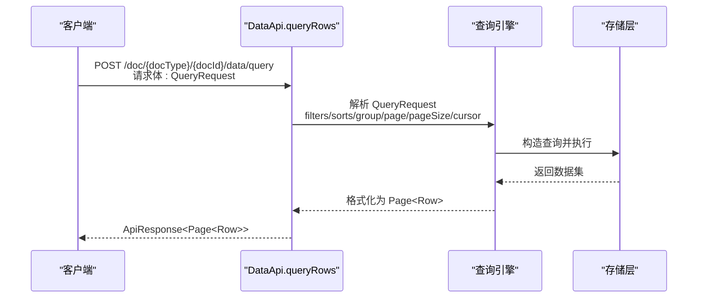
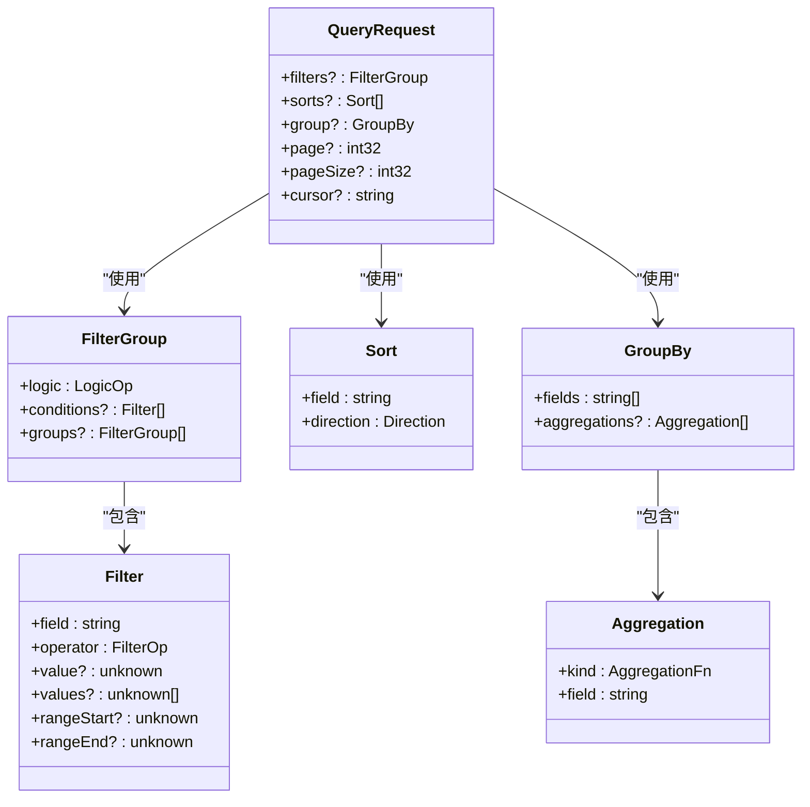

# 结构化查询

<cite>
**本文引用的文件**
- [api/main.tsp](file://api/main.tsp)
- [api/shared/common.tsp](file://api/shared/common.tsp)
- [api/document/core/data.tsp](file://api/document/core/data.tsp)
- [docs-src/guides/data-operations.md](file://docs-src/guides/data-operations.md)
- [docs-src/references/api-reference.md](file://docs-src/references/api-reference.md)
- [docs-src/references/error-codes.md](file://docs-src/references/error-codes.md)
</cite>

## 目录
1. [简介](#简介)
2. [项目结构](#项目结构)
3. [核心组件](#核心组件)
4. [架构概览](#架构概览)
5. [详细组件分析](#详细组件分析)
6. [依赖关系分析](#依赖关系分析)
7. [性能考量](#性能考量)
8. [故障排查指南](#故障排查指南)
9. [结论](#结论)
10. [附录](#附录)

## 简介
本文件面向使用 nexusbook-api 的开发者，系统化讲解“结构化查询”的设计与用法，重点围绕 QueryRequest 模型的字段能力：filters 支持嵌套的 FilterGroup，实现 AND/OR 组合的复杂条件过滤；sorts 支持多字段排序数组；group 支持分组与聚合函数；page、pageSize 和 cursor 提供分页控制。文档提供多层嵌套过滤、多字段排序、分组聚合的实际 JSON 示例，并说明该查询方式通过 POST 请求体传输，适用于复杂数据分析场景。同时对比简单查询，强调结构化查询在处理复杂业务逻辑时的灵活性与强大功能，并给出错误处理建议（如无效过滤条件的响应码）。

## 项目结构
结构化查询能力由共享类型与文档数据模块共同定义：
- 共享类型模块提供通用的查询模型、过滤器、排序、分组与聚合等基础类型；
- 文档数据模块定义了结构化查询的 API 接口，包括普通行查询与分组聚合查询两个端点。

图表来源
- [api/shared/common.tsp](file://api/shared/common.tsp#L205-L478)
- [api/document/core/data.tsp](file://api/document/core/data.tsp#L313-L536)

章节来源
- [api/main.tsp](file://api/main.tsp#L85-L108)
- [api/shared/common.tsp](file://api/shared/common.tsp#L205-L478)
- [api/document/core/data.tsp](file://api/document/core/data.tsp#L313-L536)

## 核心组件
- QueryRequest：结构化查询请求体，包含 filters、sorts、group、page、pageSize、cursor 等字段。
- FilterGroup：支持嵌套的 AND/OR 逻辑组合，conditions 与 groups 可混合使用，形成任意深度的条件树。
- Sort：支持多字段排序数组，每项包含 field 与 direction。
- GroupBy：支持多级分组字段列表与聚合函数集合，配合分组查询接口返回树状结果。
- 分页控制：page、pageSize 控制传统分页；cursor 用于深分页场景。

章节来源
- [api/document/core/data.tsp](file://api/document/core/data.tsp#L313-L373)
- [api/shared/common.tsp](file://api/shared/common.tsp#L205-L478)

## 架构概览
结构化查询通过 POST 请求体将 QueryRequest 传递给后端，后端根据 filters、sorts、group 等参数构建查询计划，返回 Page<Row> 或 GroupedResult。

图表来源
- [api/document/core/data.tsp](file://api/document/core/data.tsp#L419-L441)

章节来源
- [api/document/core/data.tsp](file://api/document/core/data.tsp#L419-L441)

## 详细组件分析

### QueryRequest 字段详解
- filters：可选，FilterGroup 类型，支持嵌套 AND/OR 组合，conditions 与 groups 可混合使用，形成任意深度的条件树。
- sorts：可选，Sort[] 类型，支持多字段排序数组，每项包含 field 与 direction。
- group：可选，GroupBy 类型，支持多级分组字段列表与聚合函数集合，配合 /query/group 使用。
- page：可选，int32，默认 1，用于传统分页。
- pageSize：可选，int32，默认 20，最大 200，用于传统分页。
- cursor：可选，string，用于深分页场景。

章节来源
- [api/document/core/data.tsp](file://api/document/core/data.tsp#L313-L373)

### FilterGroup 与 Filter
- FilterGroup.logic：AND/OR 逻辑组合。
- FilterGroup.conditions：条件数组，元素为 Filter。
- FilterGroup.groups：嵌套 FilterGroup，实现任意层级组合。
- Filter.field：字段名。
- Filter.operator：操作符，支持 eq、ne、in、range、contains、is_empty、is_not_empty 等。
- Filter.value/values/rangeStart/rangeEnd：根据 operator 选择使用单值或多值或区间。

章节来源
- [api/shared/common.tsp](file://api/shared/common.tsp#L210-L271)
- [api/shared/common.tsp](file://api/shared/common.tsp#L272-L295)

### Sort 与 GroupBy
- Sort.field：排序字段。
- Sort.direction：asc/desc。
- GroupBy.fields：分组字段数组（按顺序定义分组层级）。
- GroupBy.aggregations：聚合函数集合，支持 count、sum、avg、min、max。

章节来源
- [api/shared/common.tsp](file://api/shared/common.tsp#L205-L233)
- [api/shared/common.tsp](file://api/shared/common.tsp#L297-L357)

### 分组查询接口
- /query/group：专门用于分组查询，返回树状结构的分组结果 GroupedResult，包含 groups、total、groupBy 等字段。
- 支持多级分组与聚合，返回结构包含每级分组的 key、field、count、aggregations 以及 children（下一级分组）。

章节来源
- [api/document/core/data.tsp](file://api/document/core/data.tsp#L444-L536)
- [api/shared/common.tsp](file://api/shared/common.tsp#L359-L478)

### API 定义与示例
- 普通结构化查询：POST /doc/{docType}/{docId}/data/query
- 分组查询：POST /doc/{docType}/{docId}/data/query/group
- 文档中提供了结构化查询的示例，展示了 filters、sorts、page、pageSize 的组合使用。

章节来源
- [api/document/core/data.tsp](file://api/document/core/data.tsp#L419-L536)
- [docs-src/references/api-reference.md](file://docs-src/references/api-reference.md#L227-L247)

## 依赖关系分析
- QueryRequest 依赖于 NexusBook.Api.Common 中的 FilterGroup、Sort、GroupBy、Direction、Aggregation 等类型。
- DataApi.queryRows 与 DataApi.queryGroupedRows 两个接口分别对应普通行查询与分组查询，二者共享 QueryRequest 作为请求体。

图表来源
- [api/document/core/data.tsp](file://api/document/core/data.tsp#L313-L373)
- [api/shared/common.tsp](file://api/shared/common.tsp#L205-L478)

章节来源
- [api/document/core/data.tsp](file://api/document/core/data.tsp#L313-L373)
- [api/shared/common.tsp](file://api/shared/common.tsp#L205-L478)

## 性能考量
- 合理设置分页大小：避免过大或过小的 pageSize，推荐在 20-100 之间。
- 使用过滤减少数据量：在服务端进行过滤，避免全量拉取后再在客户端过滤。
- 使用游标分页：在深分页场景使用 cursor，提升稳定性与性能。
- 只查询需要的字段：避免使用通配符字段列表，仅请求必要字段。
- 并发控制：更新行时需提供当前版本号，避免并发冲突导致的重试与失败。

章节来源
- [docs-src/guides/data-operations.md](file://docs-src/guides/data-operations.md#L294-L359)
- [api/main.tsp](file://api/main.tsp#L85-L108)

## 故障排查指南
- 错误响应格式：统一为 ApiResponse，包含 success、code、message、payload。
- 常见错误码与 HTTP 状态码映射：400（参数错误）、401（未认证）、403（权限不足）、404（资源不存在）、409（资源冲突）、429（请求过于频繁）、500（服务器错误）。
- 无效过滤条件：可能触发 INVALID_PARAMETER 或 VALIDATION_ERROR 等错误码，建议检查 filters 的字段名、操作符与值类型是否符合要求。
- 版本冲突：当数据被并发修改时可能出现 VERSION_CONFLICT，需刷新数据后重试。
- 速率限制：当触发 RATE_LIMIT_EXCEEDED 时，应降低请求频率并关注 Retry-After 响应头。

章节来源
- [docs-src/references/error-codes.md](file://docs-src/references/error-codes.md#L1-L312)

## 结论
结构化查询通过 POST 请求体将复杂的过滤、排序、分组与分页参数集中表达，显著提升了复杂数据分析场景下的灵活性与可维护性。相比简单查询，它能够轻松表达多层嵌套的过滤条件、多字段排序与多级分组聚合，适合在业务逻辑复杂、数据体量较大的系统中使用。配合合理的分页策略与错误处理机制，可获得稳定高效的查询体验。

## 附录

### JSON 示例清单（路径引用）
- 结构化查询示例（filters + sorts + page + pageSize）
  - 示例路径：[docs-src/references/api-reference.md](file://docs-src/references/api-reference.md#L227-L247)
- 复杂嵌套过滤示例（OR + AND + 条件组合）
  - 示例路径：[docs-src/guides/data-operations.md](file://docs-src/guides/data-operations.md#L361-L381)
- 游标分页示例
  - 示例路径：[docs-src/guides/data-operations.md](file://docs-src/guides/data-operations.md#L344-L357)
- 分组查询与多级分组示例
  - 示例路径：[api/document/core/data.tsp](file://api/document/core/data.tsp#L451-L519)

### 字段与类型参考（路径引用）
- QueryRequest 字段定义
  - 定义路径：[api/document/core/data.tsp](file://api/document/core/data.tsp#L313-L373)
- FilterGroup 与 Filter
  - 定义路径：[api/shared/common.tsp](file://api/shared/common.tsp#L210-L295)
- Sort 与 GroupBy
  - 定义路径：[api/shared/common.tsp](file://api/shared/common.tsp#L205-L357)
- 分组查询返回结构 GroupedResult
  - 定义路径：[api/shared/common.tsp](file://api/shared/common.tsp#L359-L478)