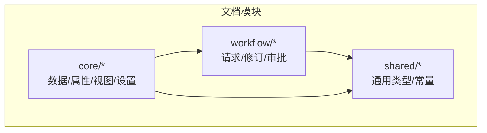
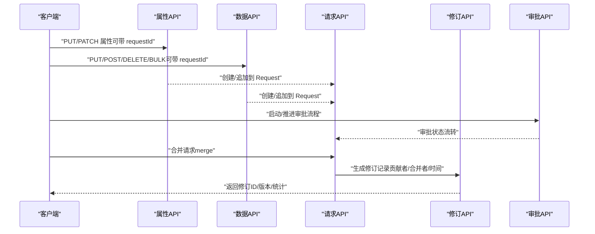
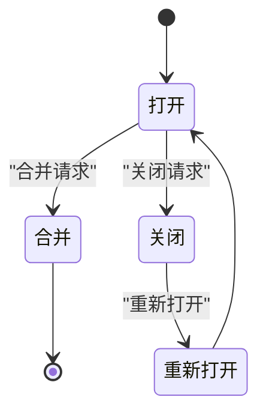
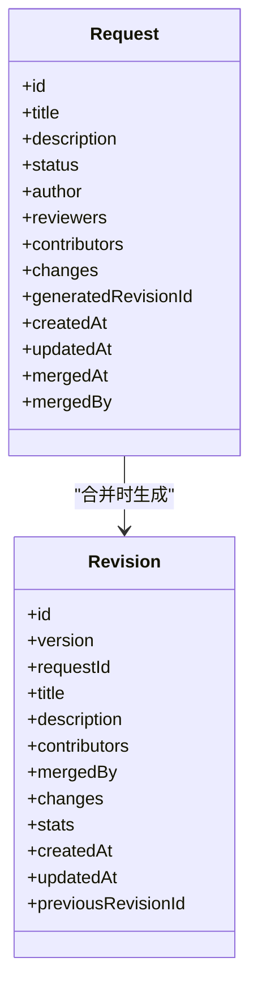
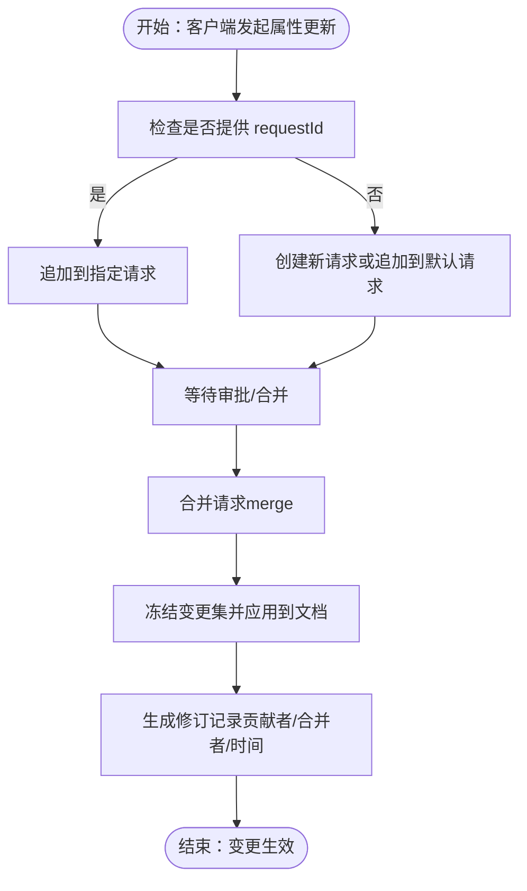
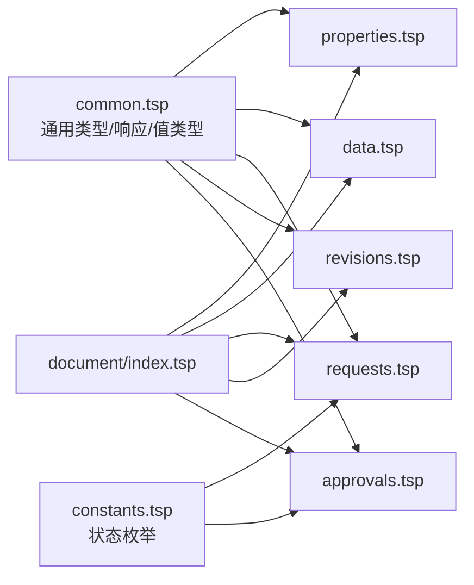

# 变更工作流集成

<cite>
**本文引用的文件**
- [api/document/workflow/requests.tsp](file://api/document/workflow/requests.tsp)
- [api/document/workflow/revisions.tsp](file://api/document/workflow/revisions.tsp)
- [api/document/workflow/approvals.tsp](file://api/document/workflow/approvals.tsp)
- [api/document/core/properties.tsp](file://api/document/core/properties.tsp)
- [api/document/core/data.tsp](file://api/document/core/data.tsp)
- [api/shared/common.tsp](file://api/shared/common.tsp)
- [api/shared/constants.tsp](file://api/shared/constants.tsp)
- [api/document/index.tsp](file://api/document/index.tsp)
- [docs-src/guides/document-model.md](file://docs-src/guides/document-model.md)
- [docs-src/references/error-codes.md](file://docs-src/references/error-codes.md)
</cite>

## 目录
1. [引言](#引言)
2. [项目结构](#项目结构)
3. [核心组件](#核心组件)
4. [架构总览](#架构总览)
5. [详细组件分析](#详细组件分析)
6. [依赖分析](#依赖分析)
7. [性能考虑](#性能考虑)
8. [故障排查指南](#故障排查指南)
9. [结论](#结论)
10. [附录](#附录)

## 引言
本文件围绕“变更工作流集成”的主题，系统阐述属性变更（PUT/PATCH）如何自动关联到变更请求（Request）机制，以及变更请求的生命周期、审批与合并流程、修订（Revision）生成与审计追溯。重点说明：
- 客户端发起属性更新时，系统将变更写入指定的 requestId（或默认请求），允许多用户协同编辑；
- 变更请求合并后才真正生效，并生成修订记录；
- 修订记录完整记录变更历史、贡献者、合并者与时间戳，确保可审计与可回溯；
- 通过 requestId 参数精确控制变更归属，未指定时遵循默认行为（创建新请求或追加到默认请求）。

## 项目结构
文档模块按功能域划分，工作流相关能力集中在 workflow 子模块，属性与数据行的写操作均接入变更请求工作流。

图表来源
- [api/document/index.tsp](file://api/document/index.tsp#L1-L31)

章节来源
- [api/document/index.tsp](file://api/document/index.tsp#L1-L31)

## 核心组件
- 变更请求（Request）：承载待合并的变更集合，支持 open/merged/closed 三态流转，记录作者、评审人、贡献者、变更集、生成的修订ID等。
- 修订（Revision）：由合并请求生成，记录变更操作、贡献者、合并者、版本号、统计信息等，支持历史对比与回滚。
- 审批（Approval）：定义审批流程、节点与决策，配合请求合并形成合规的变更通道。
- 属性与数据行 API：所有写操作（PUT/PATCH/POST/DELETE/BULK）均通过 requestId 归属到变更请求，合并后生效。

章节来源
- [api/document/workflow/requests.tsp](file://api/document/workflow/requests.tsp#L83-L200)
- [api/document/workflow/revisions.tsp](file://api/document/workflow/revisions.tsp#L158-L314)
- [api/document/workflow/approvals.tsp](file://api/document/workflow/approvals.tsp#L38-L94)
- [api/document/core/properties.tsp](file://api/document/core/properties.tsp#L200-L376)
- [api/document/core/data.tsp](file://api/document/core/data.tsp#L565-L725)

## 架构总览
变更工作流从“写入变更请求”到“合并生成修订”的整体流程如下：

图表来源
- [api/document/core/properties.tsp](file://api/document/core/properties.tsp#L241-L376)
- [api/document/core/data.tsp](file://api/document/core/data.tsp#L565-L725)
- [api/document/workflow/requests.tsp](file://api/document/workflow/requests.tsp#L202-L390)
- [api/document/workflow/revisions.tsp](file://api/document/workflow/revisions.tsp#L316-L546)
- [api/document/workflow/approvals.tsp](file://api/document/workflow/approvals.tsp#L96-L155)

## 详细组件分析

### 变更请求（Request）模型与生命周期
- 模型字段涵盖：标识、标题、描述、状态、作者、评审人、贡献者、变更集、生成的修订ID、时间戳、合并者等。
- 生命周期：
  - 创建：客户端通过属性/数据 API 的写操作创建或追加到请求；
  - 协同编辑：多人可在同一请求中追加/修改变更；
  - 审批：可选的审批流程推进请求状态；
  - 合并：合并请求时冻结变更集，应用到文档并生成修订；
  - 关闭/重新打开：用于拒绝或恢复请求；
  - 冲突检测：检查请求与当前文档状态是否存在冲突。

图表来源
- [api/document/workflow/requests.tsp](file://api/document/workflow/requests.tsp#L83-L200)
- [api/shared/constants.tsp](file://api/shared/constants.tsp#L13-L31)

章节来源
- [api/document/workflow/requests.tsp](file://api/document/workflow/requests.tsp#L83-L200)
- [api/shared/constants.tsp](file://api/shared/constants.tsp#L13-L31)

### 修订（Revision）模型与审计
- 修订记录包含：修订ID、版本号、源请求ID、标题/描述、贡献者、合并者、变更操作集合、统计信息、时间戳、前置修订ID等。
- 修订生成时机：请求合并时自动生成，包含所有变更操作，记录贡献者与合并者，支持历史对比、查询目标变更历史、回滚等。

图表来源
- [api/document/workflow/requests.tsp](file://api/document/workflow/requests.tsp#L83-L200)
- [api/document/workflow/revisions.tsp](file://api/document/workflow/revisions.tsp#L158-L314)

章节来源
- [api/document/workflow/revisions.tsp](file://api/document/workflow/revisions.tsp#L158-L314)

### 审批（Approval）与请求合并的关系
- 审批实例包含：实例ID、状态、当前节点、历史记录（节点ID、操作人、决策、备注、时间戳）。
- 审批流程可与请求合并配合使用，确保变更在合规前提下生效。

章节来源
- [api/document/workflow/approvals.tsp](file://api/document/workflow/approvals.tsp#L38-L94)
- [api/document/workflow/approvals.tsp](file://api/document/workflow/approvals.tsp#L96-L155)

### 属性变更（PUT/PATCH）与 requestId 控制
- PUT 替换属性：支持携带 requestId，若未指定则创建新请求或追加到默认请求；需要版本号以确保并发安全；合并后生效。
- PATCH 部分更新属性：支持携带 requestId、merge（合并/覆盖）、version 等参数；服务端根据字段元数据自动解析值类型；变更写入指定请求。
- 属性查询支持 requestId 参数，返回“生产数据 + Request 变更”的叠加视图，便于预览变更效果。

图表来源
- [api/document/core/properties.tsp](file://api/document/core/properties.tsp#L241-L376)
- [api/document/workflow/requests.tsp](file://api/document/workflow/requests.tsp#L244-L390)
- [api/document/workflow/revisions.tsp](file://api/document/workflow/revisions.tsp#L316-L546)

章节来源
- [api/document/core/properties.tsp](file://api/document/core/properties.tsp#L241-L376)
- [docs-src/guides/document-model.md](file://docs-src/guides/document-model.md#L269-L275)

### 数据行写操作与 requestId 控制
- POST/PUT/DELETE/BULK 数据行写操作均支持 requestId 参数，未指定时同样遵循“创建新请求或追加到默认请求”的默认行为。
- 批量更新接口支持混合目标（行/属性），服务端解析目标类型、字段定义、值类型并添加到指定请求。

章节来源
- [api/document/core/data.tsp](file://api/document/core/data.tsp#L565-L725)
- [docs-src/guides/document-model.md](file://docs-src/guides/document-model.md#L269-L275)

### 变更请求合并与修订生成
- 合并请求接口支持可选参数：squash（是否合并为单一变更）、message（合并消息）、deleteBranch（合并后是否删除关联分支）。
- 合并响应包含：生成的修订ID、修订版本号、应用的变更数量、贡献者列表、合并时间、合并者等。

章节来源
- [api/document/workflow/requests.tsp](file://api/document/workflow/requests.tsp#L244-L390)
- [api/document/workflow/revisions.tsp](file://api/document/workflow/revisions.tsp#L316-L546)

## 依赖分析
- 通用类型与常量：
  - 通用响应结构、分页、值类型、用户引用等在共享模块定义；
  - 请求/审批状态枚举在共享常量模块定义；
- 文档模块索引导入 core/workflow/aggregate/relations/attachments/sync/realtime/tenant-document，体现工作流与属性/数据/实时协作等能力的耦合。

图表来源
- [api/shared/common.tsp](file://api/shared/common.tsp#L153-L177)
- [api/shared/constants.tsp](file://api/shared/constants.tsp#L13-L31)
- [api/document/index.tsp](file://api/document/index.tsp#L1-L31)

章节来源
- [api/shared/common.tsp](file://api/shared/common.tsp#L153-L177)
- [api/shared/constants.tsp](file://api/shared/constants.tsp#L13-L31)
- [api/document/index.tsp](file://api/document/index.tsp#L1-L31)

## 性能考虑
- 批量更新接口（POST /doc/{docType}/{docId}/data/bulk）支持混合目标与简单值提交，减少客户端字段类型处理负担，提升吞吐；
- 合并请求时可选择 squash 以减少修订粒度，便于历史对比与回滚；
- 修订查询支持分页与过滤，避免一次性拉取大量历史数据；
- 并发控制通过版本号实现乐观锁，避免写冲突导致的重复合并。

## 故障排查指南
- 常见错误码（请求相关）：
  - REQUEST_NOT_FOUND：指定的请求ID不存在；
  - REQUEST_ALREADY_MERGED：请求已合并，无需重复合并；
  - REQUEST_CONFLICT：请求中的变更与当前状态存在冲突；
- 建议排查步骤：
  - 确认请求ID有效且处于 open 状态；
  - 使用冲突检测接口检查请求与当前文档的冲突；
  - 若冲突，先解决冲突再尝试合并；
  - 合并后通过修订接口验证生成的修订ID与版本号。

章节来源
- [docs-src/references/error-codes.md](file://docs-src/references/error-codes.md#L182-L203)

## 结论
通过将属性与数据行的写操作统一纳入变更请求工作流，系统实现了：
- 变更的可协同编辑与可审计；
- 合规审批与合并生效的闭环；
- 合并后生成修订记录，完整追踪变更历史；
- 通过 requestId 精确控制变更归属，未指定时遵循创建新请求或追加到默认请求的默认行为。

## 附录
- 变更请求合并响应字段说明：
  - revisionId：生成的修订ID；
  - version：修订版本号；
  - changesApplied：应用的变更数量；
  - contributors：所有贡献者列表；
  - mergedAt：合并时间；
  - mergedBy：合并者。

章节来源
- [api/document/workflow/requests.tsp](file://api/document/workflow/requests.tsp#L285-L347)