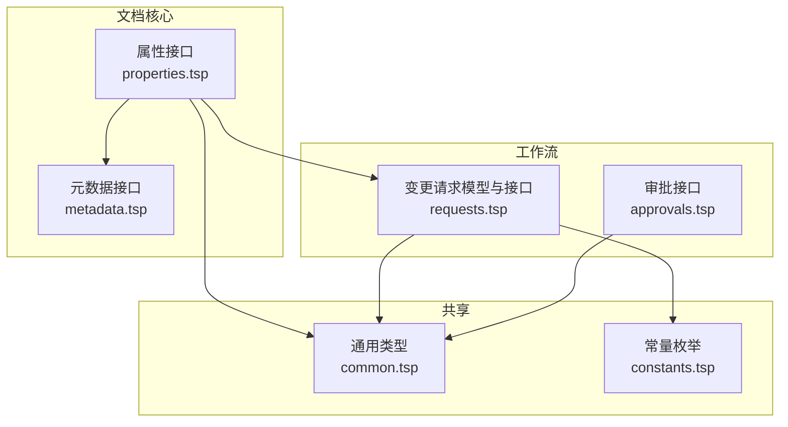
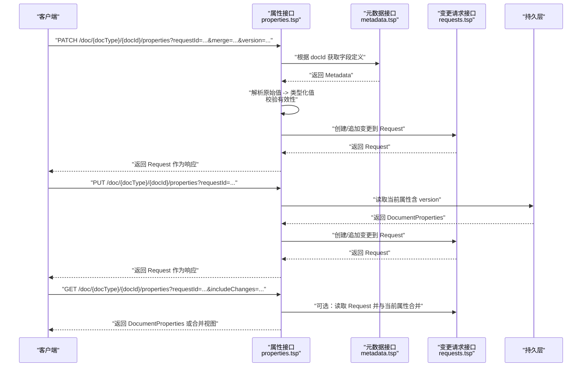
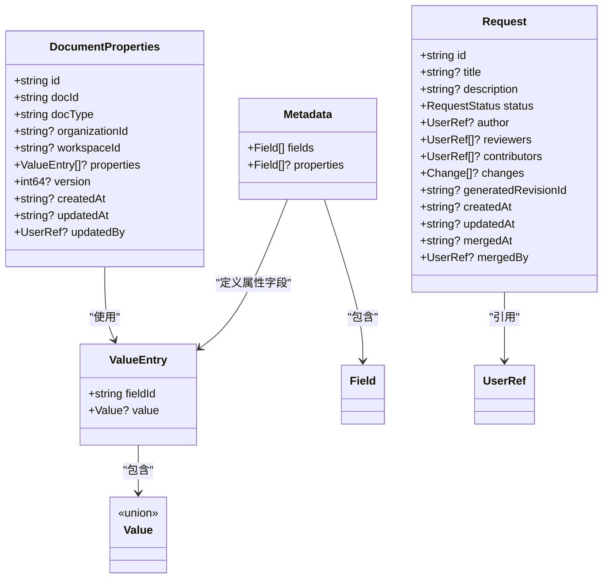

# 属性CRUD操作

<cite>
**本文引用的文件**
- [api/document/core/properties.tsp](file://api/document/core/properties.tsp)
- [api/document/workflow/requests.tsp](file://api/document/workflow/requests.tsp)
- [api/document/workflow/approvals.tsp](file://api/document/workflow/approvals.tsp)
- [api/document/core/metadata.tsp](file://api/document/core/metadata.tsp)
- [api/shared/common.tsp](file://api/shared/common.tsp)
- [api/shared/constants.tsp](file://api/shared/constants.tsp)
</cite>

## 目录
1. [简介](#简介)
2. [项目结构](#项目结构)
3. [核心组件](#核心组件)
4. [架构概览](#架构概览)
5. [详细组件分析](#详细组件分析)
6. [依赖分析](#依赖分析)
7. [性能考虑](#性能考虑)
8. [故障排查指南](#故障排查指南)
9. [结论](#结论)

## 简介
本章节面向“文档属性（Document Properties）”的CRUD操作，聚焦于以下五种HTTP方法：
- GET /doc/{docType}/{docId}/properties：获取文档属性
- POST /doc/{docType}/{docId}/properties：创建新文档属性
- PUT /doc/{docType}/{docId}/properties：全量替换属性（进入变更请求）
- PATCH /doc/{docType}/{docId}/properties：部分更新属性（进入变更请求，支持merge模式）
- DELETE /doc/{docType}/{docId}/properties：删除属性

文档将详细说明各接口的路径参数、查询参数、请求体结构与响应格式；重点解释PUT与PATCH如何与“变更请求（Request）”工作流集成，以及version参数在并发安全中的校验机制；并提供cURL示例与注意事项（尤其是DELETE的不可逆特性）。

## 项目结构
属性CRUD相关能力由TypeSpec定义，核心位于文档核心模块与工作流模块：
- 属性接口定义：api/document/core/properties.tsp
- 变更请求模型与接口：api/document/workflow/requests.tsp
- 审批工作流（与属性变更可能联动）：api/document/workflow/approvals.tsp
- 元数据（字段定义与类型）：api/document/core/metadata.tsp
- 通用类型与常量：api/shared/common.tsp、api/shared/constants.tsp

图表来源
- [api/document/core/properties.tsp](file://api/document/core/properties.tsp#L200-L440)
- [api/document/workflow/requests.tsp](file://api/document/workflow/requests.tsp#L83-L200)
- [api/document/workflow/approvals.tsp](file://api/document/workflow/approvals.tsp#L96-L155)
- [api/document/core/metadata.tsp](file://api/document/core/metadata.tsp#L183-L200)
- [api/shared/common.tsp](file://api/shared/common.tsp#L153-L177)
- [api/shared/constants.tsp](file://api/shared/constants.tsp#L9-L31)

章节来源
- [api/document/core/properties.tsp](file://api/document/core/properties.tsp#L200-L440)
- [api/document/workflow/requests.tsp](file://api/document/workflow/requests.tsp#L83-L200)
- [api/document/workflow/approvals.tsp](file://api/document/workflow/approvals.tsp#L96-L155)
- [api/document/core/metadata.tsp](file://api/document/core/metadata.tsp#L183-L200)
- [api/shared/common.tsp](file://api/shared/common.tsp#L153-L177)
- [api/shared/constants.tsp](file://api/shared/constants.tsp#L9-L31)

## 核心组件
- 文档属性模型（DocumentProperties）
  - 字段：id、docId、docType、organizationId、workspaceId、properties、version、createdAt、updatedAt、updatedBy
  - 说明：properties采用类型化值结构（ValueEntry），version用于并发控制
- 变更请求模型（Request）
  - 字段：id、title、description、status（open/merged/closed）、author、reviewers、contributors、changes、generatedRevisionId、createdAt、updatedAt、mergedAt、mergedBy
  - 说明：属性变更通过Request进行协同与审批，合并后生成修订（Revision）
- 元数据模型（Metadata）
  - 字段：fields、properties
  - 说明：properties用于定义文档属性字段的类型与约束，服务端据此解析PATCH简化提交的原始值

章节来源
- [api/document/core/properties.tsp](file://api/document/core/properties.tsp#L94-L198)
- [api/document/workflow/requests.tsp](file://api/document/workflow/requests.tsp#L83-L200)
- [api/document/core/metadata.tsp](file://api/document/core/metadata.tsp#L160-L181)

## 架构概览
属性CRUD与变更请求工作流的关系如下：

图表来源
- [api/document/core/properties.tsp](file://api/document/core/properties.tsp#L216-L375)
- [api/document/core/metadata.tsp](file://api/document/core/metadata.tsp#L183-L200)
- [api/document/workflow/requests.tsp](file://api/document/workflow/requests.tsp#L202-L390)

## 详细组件分析

### GET /doc/{docType}/{docId}/properties
- 功能：获取文档属性
- 路径参数
  - docType：文档类型（如 purchaseOrder、invoice、product）
  - docId：文档ID
- 查询参数
  - requestId：可选。若提供，返回“叠加后的属性视图”，即当前属性与指定变更请求中的变更合并后的结果
  - includeChanges：可选。指示是否包含变更请求中的变更条目（用于调试或审计）
- 响应
  - 成功：ApiResponse<DocumentProperties>
  - 失败：ApiResponse<null>，携带错误码与消息
- 说明
  - 若未提供 requestId，返回当前持久化属性
  - 若提供 requestId，服务端会将该请求中的变更与当前属性合并，形成“叠加视图”
- cURL示例
  - 获取当前属性：curl -X GET "https://open.nexusbook.com/api/v1/doc/purchaseOrder/order-123/properties"
  - 获取叠加视图：curl -X GET "https://open.nexusbook.com/api/v1/doc/purchaseOrder/order-123/properties?requestId=req-1"

章节来源
- [api/document/core/properties.tsp](file://api/document/core/properties.tsp#L216-L233)

### POST /doc/{docType}/{docId}/properties
- 功能：创建或初始化文档属性
- 路径参数
  - docType：文档类型
  - docId：文档ID
- 请求体
  - DocumentProperties：至少包含 id、docId、docType；可选 properties、version、createdAt、updatedAt、updatedBy
- 响应
  - 成功：ApiResponse<DocumentProperties>
  - 失败：ApiResponse<null>，携带错误码与消息
- 说明
  - 通常在文档创建时调用，用于初始化属性
  - 若提供 version，服务端仍按创建语义处理（version主要用于并发控制的后续写操作）
- cURL示例
  - curl -X POST "https://open.nexusbook.com/api/v1/doc/purchaseOrder/order-123/properties" -H "Content-Type: application/json" -d '{...}'

章节来源
- [api/document/core/properties.tsp](file://api/document/core/properties.tsp#L234-L239)

### PUT /doc/{docType}/{docId}/properties
- 功能：全量替换文档属性（进入变更请求）
- 路径参数
  - docType：文档类型
  - docId：文档ID
- 查询参数
  - requestId：可选。若提供，追加到该请求；否则创建新的请求或追加到默认请求
- 请求体
  - DocumentProperties：包含完整的新属性集合（properties），以及必需的 version 以确保并发安全
- 响应
  - 成功：ApiResponse<Request>
  - 失败：ApiResponse<null>，携带错误码与消息
- 并发安全与version校验
  - 服务端在写入前读取当前属性并校验 version；若不匹配，返回并发冲突错误
- 与变更请求工作流集成
  - PUT总是进入变更请求，即使未显式指定 requestId，也会创建或追加到默认请求
  - 合并后才真正生效，并生成修订（Revision）
- cURL示例
  - curl -X PUT "https://open.nexusbook.com/api/v1/doc/purchaseOrder/order-123/properties?requestId=req-1" -H "Content-Type: application/json" -d '{...}'

章节来源
- [api/document/core/properties.tsp](file://api/document/core/properties.tsp#L273-L280)

### PATCH /doc/{docType}/{docId}/properties
- 功能：部分更新文档属性（进入变更请求）
- 路径参数
  - docType：文档类型
  - docId：文档ID
- 查询参数
  - requestId：可选。指定要追加到的请求ID
  - merge：可选，默认 true。true为“合并模式”，false为“覆盖模式”
  - version：可选。当前版本号（用于并发检查）
- 请求体
  - updates：数组，元素为 { fieldId: string, value: unknown }
  - note：可选。更新说明
- 响应
  - 成功：ApiResponse<Request>
  - 失败：ApiResponse<null>，携带错误码与消息
- 与元数据集成
  - 服务端根据 docId 获取 Metadata，再依据 fieldId 查找字段定义，自动将原始值转换为类型化值（ValueEntry）
  - 支持多种字段类型（文本、数值、货币、百分比、布尔、日期、日期时间、单选/多选、附件、用户、协作人、关联、评分、时长等）
- 与变更请求工作流集成
  - PATCH同样进入变更请求；merge=true时，新值与现有值合并；merge=false时，新值覆盖现有值
- cURL示例
  - curl -X PATCH "https://open.nexusbook.com/api/v1/doc/purchaseOrder/order-123/properties?requestId=req-1&merge=true&version=1" -H "Content-Type: application/json" -d '{"updates":[{"fieldId":"amount","value":6000.00},{"fieldId":"quantity","value":60}]}'

章节来源
- [api/document/core/properties.tsp](file://api/document/core/properties.tsp#L339-L375)
- [api/document/core/metadata.tsp](file://api/document/core/metadata.tsp#L160-L181)
- [api/shared/common.tsp](file://api/shared/common.tsp#L710-L742)

### DELETE /doc/{docType}/{docId}/properties
- 功能：删除文档属性
- 路径参数
  - docType：文档类型
  - docId：文档ID
- 查询参数
  - version：可选。当前版本号（用于并发检查）
- 响应
  - 成功：ApiResponse<unknown>
  - 失败：ApiResponse<null>，携带错误码与消息
- 重要提示
  - 此操作不可逆，请谨慎调用
  - 删除后，文档将不再包含任何属性数据
- cURL示例
  - curl -X DELETE "https://open.nexusbook.com/api/v1/doc/purchaseOrder/order-123/properties?version=1"

章节来源
- [api/document/core/properties.tsp](file://api/document/core/properties.tsp#L433-L439)

## 依赖分析
- DocumentProperties 依赖
  - ValueEntry（类型化值）来自 common.tsp
  - UserRef（更新人）来自 common.tsp
  - RequestStatus（请求状态）来自 constants.tsp
- 变更请求（Request）依赖
  - UserRef（作者、评审人、合并者）来自 common.tsp
  - RequestStatus（open/merged/closed）来自 constants.tsp
- 元数据（Metadata）依赖
  - Field（字段定义）来自 metadata.tsp
  - Value（类型化值）来自 common.tsp

图表来源
- [api/document/core/properties.tsp](file://api/document/core/properties.tsp#L94-L198)
- [api/document/workflow/requests.tsp](file://api/document/workflow/requests.tsp#L83-L200)
- [api/document/core/metadata.tsp](file://api/document/core/metadata.tsp#L160-L181)
- [api/shared/common.tsp](file://api/shared/common.tsp#L710-L742)
- [api/shared/constants.tsp](file://api/shared/constants.tsp#L9-L31)

章节来源
- [api/document/core/properties.tsp](file://api/document/core/properties.tsp#L94-L198)
- [api/document/workflow/requests.tsp](file://api/document/workflow/requests.tsp#L83-L200)
- [api/document/core/metadata.tsp](file://api/document/core/metadata.tsp#L160-L181)
- [api/shared/common.tsp](file://api/shared/common.tsp#L710-L742)
- [api/shared/constants.tsp](file://api/shared/constants.tsp#L9-L31)

## 性能考虑
- 批量更新建议
  - 对于多字段更新，优先使用统一的批量更新接口（例如 data/bulk），以减少请求次数与网络开销
- 叠加视图
  - GET /doc/{docType}/{docId}/properties?requestId=... 会合并请求中的变更，避免客户端重复计算
- 并发控制
  - version 参数用于乐观锁，避免写冲突导致的数据丢失
- 审批与合并
  - 变更请求合并会产生修订（Revision），建议合理规划合并频率，避免频繁生成修订影响性能

## 故障排查指南
- 并发冲突（version不匹配）
  - 现象：PUT/PATCH返回并发冲突错误
  - 处理：重新拉取最新属性（含version），再次提交
- 字段类型不匹配
  - 现象：PATCH提交的原始值与字段定义不符
  - 处理：参考元数据（Metadata）中字段定义，确保原始值符合字段类型
- 请求不存在或已关闭
  - 现象：指定的 requestId 不存在或状态非 open
  - 处理：先创建或重新打开请求，再追加变更
- 审批流程阻塞
  - 现象：属性变更需要审批但未完成
  - 处理：跟踪审批状态，完成审批后再合并请求

章节来源
- [api/document/core/properties.tsp](file://api/document/core/properties.tsp#L273-L280)
- [api/document/core/properties.tsp](file://api/document/core/properties.tsp#L339-L375)
- [api/document/workflow/requests.tsp](file://api/document/workflow/requests.tsp#L202-L390)
- [api/document/workflow/approvals.tsp](file://api/document/workflow/approvals.tsp#L96-L155)
- [api/document/core/metadata.tsp](file://api/document/core/metadata.tsp#L160-L181)

## 结论
- 属性CRUD均通过“变更请求（Request）”进行协同与审批，合并后才真正生效并生成修订
- version参数是并发安全的关键，务必在写操作前正确传递
- PATCH支持简化提交（仅提供fieldId与原始值），服务端基于元数据自动解析类型
- DELETE为高风险操作，调用前请确认业务后果