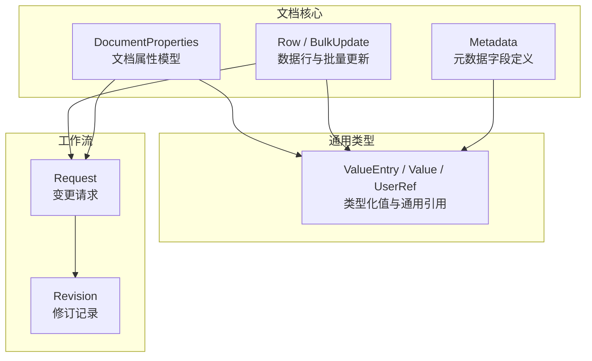
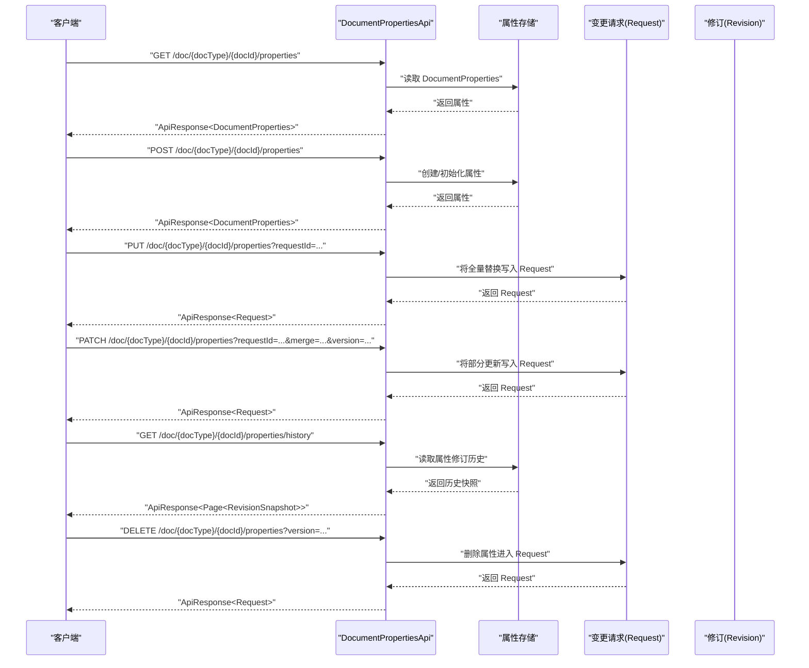
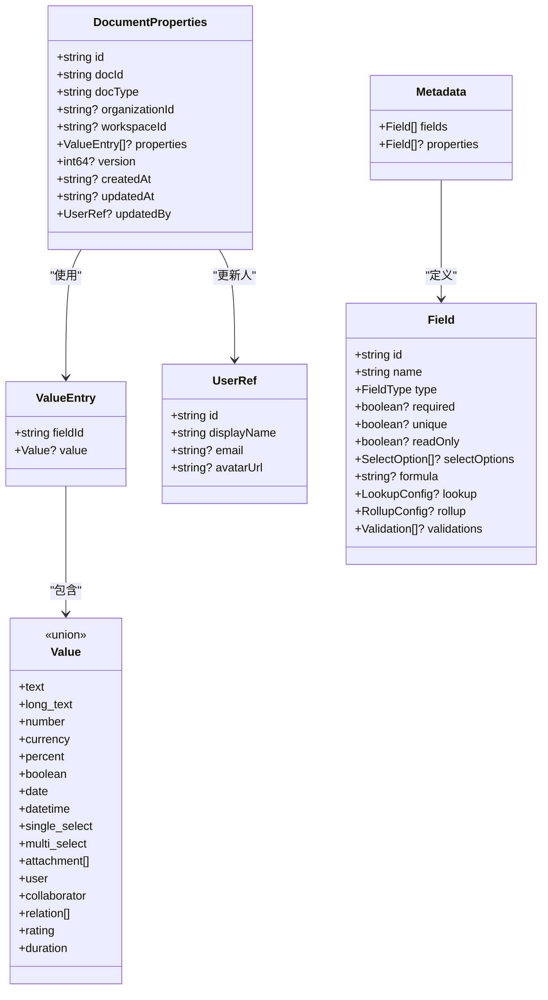

# 文档属性模型

<cite>
**本文引用的文件**
- [api/document/core/properties.tsp](file://api/document/core/properties.tsp)
- [api/shared/common.tsp](file://api/shared/common.tsp)
- [api/document/core/metadata.tsp](file://api/document/core/metadata.tsp)
- [api/document/core/data.tsp](file://api/document/core/data.tsp)
- [api/document/workflow/revisions.tsp](file://api/document/workflow/revisions.tsp)
- [api/document/workflow/requests.tsp](file://api/document/workflow/requests.tsp)
- [api/shared/constants.tsp](file://api/shared/constants.tsp)
- [api/document/tenant-document.tsp](file://api/document/tenant-document.tsp)
</cite>

## 目录
1. [简介](#简介)
2. [项目结构](#项目结构)
3. [核心组件](#核心组件)
4. [架构总览](#架构总览)
5. [详细组件分析](#详细组件分析)
6. [依赖分析](#依赖分析)
7. [性能考虑](#性能考虑)
8. [故障排查指南](#故障排查指南)
9. [结论](#结论)
10. [附录](#附录)

## 简介
本文面向 nexusbook-api 的“文档属性模型”，系统化说明 DocumentProperties 模型的结构、字段语义与使用方式，重点阐释：
- 字段定义与业务含义：id、docId、docType、organizationId、workspaceId、properties、version、createdAt、updatedAt、updatedBy
- properties 如何使用 NexusBook.Api.Common.ValueEntry 存储类型化值，并与数据行 cell 值设计保持一致
- 模型如何支持灵活的键值对存储以适配不同文档类型（如订货单、发票、产品）
- 在 TypeSpec 中的模型定义要点与可选性说明
- 版本号（version）在并发控制中的作用，以及审计追踪相关字段的使用场景

## 项目结构
文档属性模型位于文档核心模块，与通用类型、元数据、数据行、工作流（请求/修订）等模块紧密协作，形成“文档元信息 + 字段定义 + 行数据 + 变更工作流”的完整能力闭环。

图表来源
- [api/document/core/properties.tsp](file://api/document/core/properties.tsp#L94-L198)
- [api/shared/common.tsp](file://api/shared/common.tsp#L544-L576)
- [api/document/core/metadata.tsp](file://api/document/core/metadata.tsp#L160-L181)
- [api/document/core/data.tsp](file://api/document/core/data.tsp#L248-L311)
- [api/document/workflow/requests.tsp](file://api/document/workflow/requests.tsp#L83-L200)
- [api/document/workflow/revisions.tsp](file://api/document/workflow/revisions.tsp#L158-L314)

章节来源
- [api/document/core/properties.tsp](file://api/document/core/properties.tsp#L1-L61)
- [api/shared/common.tsp](file://api/shared/common.tsp#L544-L576)
- [api/document/core/metadata.tsp](file://api/document/core/metadata.tsp#L160-L181)
- [api/document/core/data.tsp](file://api/document/core/data.tsp#L248-L311)
- [api/document/workflow/requests.tsp](file://api/document/workflow/requests.tsp#L83-L200)
- [api/document/workflow/revisions.tsp](file://api/document/workflow/revisions.tsp#L158-L314)

## 核心组件
- DocumentProperties：文档级别的元信息容器，支持灵活键值对存储，便于适配不同文档类型（订货单、发票、产品等）
- ValueEntry / Value：类型化值结构，与数据行 cell 值设计一致，确保属性与行数据在值表达上统一
- Metadata：字段定义集合，用于约束属性字段的类型、必填、唯一、只读、选项、校验、计算等
- Request / Revision：变更工作流，所有属性更新均进入变更请求，经评审合并后生成修订，完成审计追踪

章节来源
- [api/document/core/properties.tsp](file://api/document/core/properties.tsp#L94-L198)
- [api/shared/common.tsp](file://api/shared/common.tsp#L544-L576)
- [api/document/core/metadata.tsp](file://api/document/core/metadata.tsp#L160-L181)
- [api/document/workflow/requests.tsp](file://api/document/workflow/requests.tsp#L83-L200)
- [api/document/workflow/revisions.tsp](file://api/document/workflow/revisions.tsp#L158-L314)

## 架构总览
文档属性模型贯穿“读取/初始化/更新/历史/删除”的全生命周期，配合变更请求与修订，形成可审计、可回溯、可并发控制的属性管理能力。

图表来源
- [api/document/core/properties.tsp](file://api/document/core/properties.tsp#L200-L440)
- [api/document/workflow/requests.tsp](file://api/document/workflow/requests.tsp#L202-L390)
- [api/document/workflow/revisions.tsp](file://api/document/workflow/revisions.tsp#L316-L546)

## 详细组件分析

### DocumentProperties 模型字段详解
- id：属性记录的唯一标识，用于定位与引用该属性实体
- docId：关联的文档标识，用于将属性与具体文档绑定
- docType：文档类型标识，如 purchaseOrder、invoice、product 等，用于区分不同文档类型的属性集合
- organizationId：可选，用于多租户隔离，标识属性所属的组织
- workspaceId：可选，用于工作区级文档，空值表示组织级文档
- properties：可选，类型为 NexusBook.Api.Common.ValueEntry[]，使用类型化值结构存储属性键值对；与数据行 cell 值设计一致，便于统一处理
- version：可选，整型版本号，用于乐观并发控制；更新时需携带当前版本，避免并发覆盖
- createdAt / updatedAt：可选，时间戳，记录创建与最近更新时间
- updatedBy：可选，类型为 NexusBook.Api.Common.UserRef，记录最后更新的用户

字段与业务含义
- 订货单示例：包含订单时间、门店、总金额、总数量、状态等
- 发票示例：包含发票号、开票时间、付款期限、税率、收款方信息等
- 产品示例：包含 SKU、品牌、分类、供应商、生产日期等
- 项目示例：包含项目名称、负责人、预算、截止日期、优先级等

章节来源
- [api/document/core/properties.tsp](file://api/document/core/properties.tsp#L94-L198)
- [api/shared/common.tsp](file://api/shared/common.tsp#L451-L487)
- [api/shared/constants.tsp](file://api/shared/constants.tsp#L265-L313)

### ValueEntry 与 Value 的类型化值设计
- ValueEntry：包含 fieldId 与 value，其中 value 为 NexusBook.Api.Common.Value 的联合类型
- Value：涵盖 text、long_text、number、currency、percent、boolean、date、datetime、single_select、multi_select、attachment、user、collaborator、relation、rating、duration 等类型
- 设计一致性：数据行 Row.values 同样使用 ValueEntry，确保属性与行数据在值表达上保持一致，便于统一解析与校验

章节来源
- [api/shared/common.tsp](file://api/shared/common.tsp#L544-L576)
- [api/document/core/data.tsp](file://api/document/core/data.tsp#L248-L311)

### 文档类型与属性字段的适配
- 文档类型（docType）用于区分不同业务形态，如 purchaseOrder、invoice、product、inventory、project、sales、hr、custom 等
- 属性字段集合由 Metadata.properties 定义，用于约束属性字段的类型、必填、唯一、只读、选项、校验、计算等
- 通过元数据驱动，属性值的类型转换、校验与渲染均可统一处理

章节来源
- [api/shared/constants.tsp](file://api/shared/constants.tsp#L265-L313)
- [api/document/core/metadata.tsp](file://api/document/core/metadata.tsp#L160-L181)

### 并发控制与版本号（version）
- 版本号用于乐观锁控制，更新属性时需提供当前版本号，若版本不匹配则拒绝更新，避免并发覆盖
- 变更请求（Request）承载所有未生效变更，多人可协同编辑同一 Request，评审通过后合并，生成修订（Revision），完成审计追踪

章节来源
- [api/document/core/properties.tsp](file://api/document/core/properties.tsp#L241-L311)
- [api/document/workflow/requests.tsp](file://api/document/workflow/requests.tsp#L83-L200)
- [api/document/workflow/revisions.tsp](file://api/document/workflow/revisions.tsp#L158-L314)

### 审计追踪相关字段
- createdAt / updatedAt：记录属性的创建与更新时间
- updatedBy：记录最后更新的用户
- 历史接口：支持查看属性修订历史，包含版本、属性快照、变更时间、变更人、变更说明等
- 修订（Revision）：合并请求后生成，记录变更操作、贡献者、统计信息、前后版本对比等

章节来源
- [api/document/core/properties.tsp](file://api/document/core/properties.tsp#L377-L440)
- [api/document/workflow/revisions.tsp](file://api/document/workflow/revisions.tsp#L158-L314)

### 多租户与工作区隔离
- organizationId：可选，用于多租户隔离，标识属性所属的组织
- workspaceId：可选，用于工作区级文档，空值表示组织级文档
- 文档作用域：组织级（公共）与工作区级（业务）

章节来源
- [api/document/core/properties.tsp](file://api/document/core/properties.tsp#L122-L138)
- [api/document/tenant-document.tsp](file://api/document/tenant-document.tsp#L29-L41)

## 依赖分析
- DocumentProperties 依赖通用类型 ValueEntry / Value / UserRef
- 数据行 Row 与属性值使用相同的 ValueEntry 结构，确保值表达一致
- 元数据 Metadata 定义属性字段，驱动属性值的类型转换与校验
- 变更工作流通过 Request/Revision 完成属性更新的审计与回溯

图表来源
- [api/document/core/properties.tsp](file://api/document/core/properties.tsp#L94-L198)
- [api/shared/common.tsp](file://api/shared/common.tsp#L544-L576)
- [api/shared/common.tsp](file://api/shared/common.tsp#L451-L487)
- [api/document/core/metadata.tsp](file://api/document/core/metadata.tsp#L160-L181)

章节来源
- [api/document/core/properties.tsp](file://api/document/core/properties.tsp#L94-L198)
- [api/shared/common.tsp](file://api/shared/common.tsp#L451-L576)
- [api/document/core/metadata.tsp](file://api/document/core/metadata.tsp#L160-L181)

## 性能考虑
- 属性值采用类型化结构，便于服务端在批量更新时按字段定义自动解析与校验，减少客户端负担
- 历史查询与修订对比可能涉及大量变更记录，建议合理分页与筛选（如按贡献者、时间范围）
- 并发控制通过版本号实现乐观锁，避免写冲突导致的重试风暴，建议客户端在更新失败时重试并刷新版本号

## 故障排查指南
- 并发冲突：当更新属性时报错或版本不匹配，需重新拉取最新属性并携带正确版本号重试
- 类型不匹配：属性值类型与字段定义不符，需根据 Metadata 中的字段类型调整值结构
- 审计缺失：确认 updatedBy、createdAt、updatedAt 是否正确传入与更新；查看历史接口以定位变更轨迹
- 工作流问题：若属性更新未生效，检查对应 Request 状态与合并情况，必要时回滚到上一修订

章节来源
- [api/document/core/properties.tsp](file://api/document/core/properties.tsp#L241-L311)
- [api/document/workflow/revisions.tsp](file://api/document/workflow/revisions.tsp#L316-L546)

## 结论
DocumentProperties 模型通过类型化值结构与灵活的键值对存储，实现了对不同文档类型元信息的统一建模；结合变更请求与修订机制，提供了完善的并发控制与审计追踪能力。其与数据行、元数据、工作流的协同设计，使属性管理既灵活又可控，满足多租户、多工作区场景下的多样化需求。

## 附录

### TypeSpec 中的模型定义要点
- DocumentProperties：字段定义、可选性、业务含义与使用场景详见属性模型章节
- ValueEntry / Value：类型化值联合类型，与数据行 cell 值设计一致
- Metadata：属性字段定义集合，驱动属性值的类型转换与校验
- Request / Revision：变更工作流与审计追踪

章节来源
- [api/document/core/properties.tsp](file://api/document/core/properties.tsp#L94-L198)
- [api/shared/common.tsp](file://api/shared/common.tsp#L544-L576)
- [api/document/core/metadata.tsp](file://api/document/core/metadata.tsp#L160-L181)
- [api/document/workflow/requests.tsp](file://api/document/workflow/requests.tsp#L83-L200)
- [api/document/workflow/revisions.tsp](file://api/document/workflow/revisions.tsp#L158-L314)