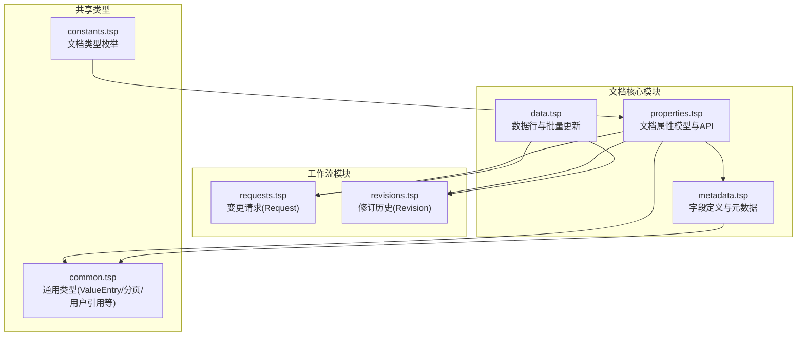
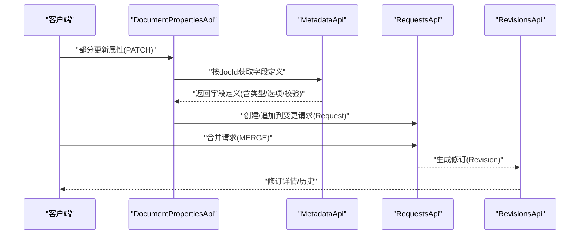
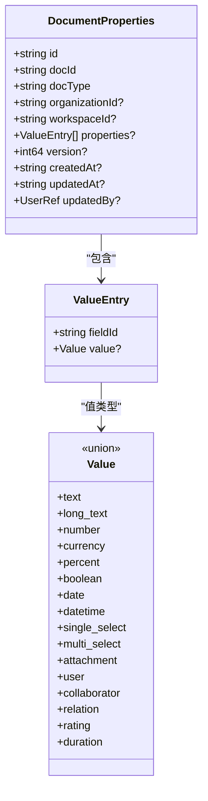
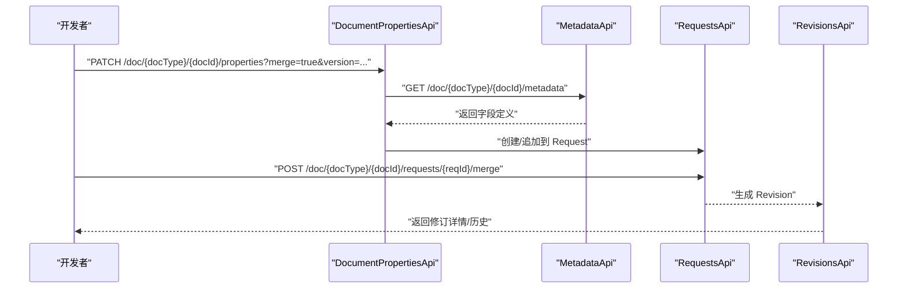
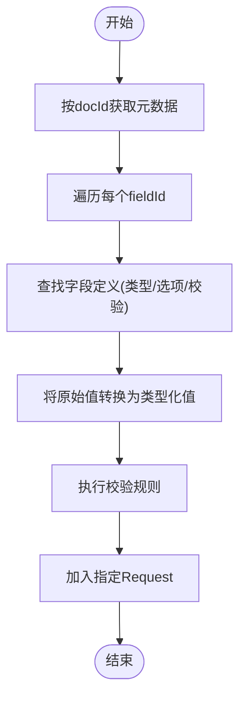
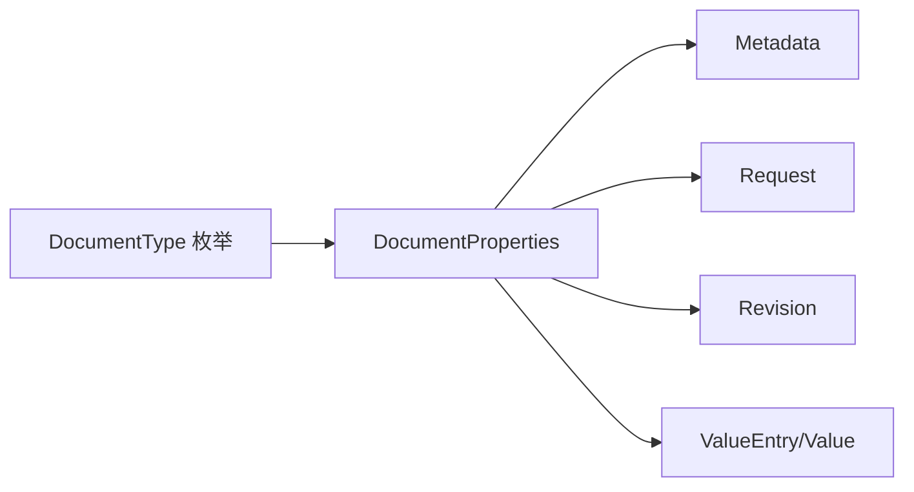

# 文档属性管理

<cite>
**本文引用的文件**
- [api/document/core/properties.tsp](file://api/document/core/properties.tsp)
- [api/document/core/metadata.tsp](file://api/document/core/metadata.tsp)
- [api/document/core/data.tsp](file://api/document/core/data.tsp)
- [api/document/workflow/requests.tsp](file://api/document/workflow/requests.tsp)
- [api/document/workflow/revisions.tsp](file://api/document/workflow/revisions.tsp)
- [api/shared/common.tsp](file://api/shared/common.tsp)
- [api/shared/constants.tsp](file://api/shared/constants.tsp)
- [docs-src/guides/examples.md](file://docs-src/guides/examples.md)
</cite>

## 目录
1. [简介](#简介)
2. [项目结构](#项目结构)
3. [核心组件](#核心组件)
4. [架构总览](#架构总览)
5. [详细组件分析](#详细组件分析)
6. [依赖分析](#依赖分析)
7. [性能考虑](#性能考虑)
8. [故障排查指南](#故障排查指南)
9. [结论](#结论)
10. [附录](#附录)

## 简介
本文件聚焦于 nexusbook-api 的“文档属性管理”，围绕文档级别的元信息（如订单时间、门店、金额、数量等）的存储与管理机制展开，系统性阐述：
- DocumentProperties 模型结构、属性值集合、版本控制与审计追踪
- 属性变更如何纳入变更请求工作流
- 创建、获取、替换、部分更新、删除文档属性的 API 接口
- 简化提交方式：客户端仅提供原始值，服务端基于元数据自动解析类型
- 属性修订历史查询能力
- 在不同业务场景（订货单、发票、产品等）中的使用示例

## 项目结构
文档属性管理位于文档核心模块下，与元数据、数据行、工作流（请求/修订）共同构成文档数据与变更治理的完整体系。

图表来源
- [api/document/core/properties.tsp](file://api/document/core/properties.tsp#L200-L441)
- [api/document/core/metadata.tsp](file://api/document/core/metadata.tsp#L1-L211)
- [api/document/core/data.tsp](file://api/document/core/data.tsp#L1-L628)
- [api/document/workflow/requests.tsp](file://api/document/workflow/requests.tsp#L1-L391)
- [api/document/workflow/revisions.tsp](file://api/document/workflow/revisions.tsp#L1-L547)
- [api/shared/common.tsp](file://api/shared/common.tsp#L1-L576)
- [api/shared/constants.tsp](file://api/shared/constants.tsp#L265-L313)

章节来源
- [api/document/core/index.tsp](file://api/document/core/index.tsp#L1-L21)

## 核心组件
- DocumentProperties 模型：承载文档级别的元信息，支持灵活键值对存储，包含版本号、创建/更新时间与审计信息。
- 元数据 Metadata：定义字段类型、默认值、选项、只读/唯一/必填、公式/查找/汇总与校验规则，用于属性值的类型解析与校验。
- 变更请求 Request：所有属性修改均进入变更请求，多人可协同编辑，通过审批后合并生效。
- 修订历史 Revision：合并请求生成修订，记录变更操作、贡献者、统计与时间线。
- 通用类型 ValueEntry/Value：统一的类型化值结构，支撑属性与数据行的值存储与转换。

章节来源
- [api/document/core/properties.tsp](file://api/document/core/properties.tsp#L94-L198)
- [api/document/core/metadata.tsp](file://api/document/core/metadata.tsp#L160-L181)
- [api/document/workflow/requests.tsp](file://api/document/workflow/requests.tsp#L83-L200)
- [api/document/workflow/revisions.tsp](file://api/document/workflow/revisions.tsp#L158-L314)
- [api/shared/common.tsp](file://api/shared/common.tsp#L544-L576)

## 架构总览
文档属性管理遵循“变更请求驱动”的工作流：任何属性变更都先写入 Request，经评审与合并后生成 Revision，最终体现在属性的历史快照中；同时，属性值的类型解析与校验由元数据驱动。

图表来源
- [api/document/core/properties.tsp](file://api/document/core/properties.tsp#L339-L375)
- [api/document/core/metadata.tsp](file://api/document/core/metadata.tsp#L183-L197)
- [api/document/workflow/requests.tsp](file://api/document/workflow/requests.tsp#L202-L391)
- [api/document/workflow/revisions.tsp](file://api/document/workflow/revisions.tsp#L323-L547)

## 详细组件分析

### DocumentProperties 模型与 API
- 模型字段要点
  - 标识与归属：id、docId、docType、organizationId、workspaceId
  - 属性值集合：properties，元素为 ValueEntry（fieldId + Value）
  - 版本控制：version（用于乐观锁）
  - 审计信息：createdAt、updatedAt、updatedBy
- API 能力
  - 获取属性：支持通过 requestId 查询叠加视图，支持 includeChanges
  - 创建属性：初始化文档属性
  - 替换属性：整体替换，进入变更请求
  - 部分更新属性：简化提交（仅 fieldId + 原始值），服务端按元数据解析类型
  - 获取属性历史：分页查询属性修订历史
  - 删除属性：删除所有属性数据（不可逆）

图表来源
- [api/document/core/properties.tsp](file://api/document/core/properties.tsp#L94-L198)
- [api/shared/common.tsp](file://api/shared/common.tsp#L544-L576)

章节来源
- [api/document/core/properties.tsp](file://api/document/core/properties.tsp#L200-L441)

### 元数据与类型解析
- 元数据结构
  - fields：数据行字段定义
  - properties：文档属性字段定义（用于 DocumentProperties.properties）
- 字段类型与值类型
  - FieldType：覆盖文本、数值、日期时间、选择、附件、用户、关联、计算等类型
  - Value：与 FieldType 对应的类型化值结构
- 解析与校验
  - 属性部分更新时，服务端根据 docId 获取元数据，按 fieldId 查找字段定义，将客户端提供的原始值转换为类型化值，并执行校验

章节来源
- [api/document/core/metadata.tsp](file://api/document/core/metadata.tsp#L29-L52)
- [api/document/core/metadata.tsp](file://api/document/core/metadata.tsp#L160-L181)
- [api/shared/common.tsp](file://api/shared/common.tsp#L544-L576)

### 变更请求与修订历史
- 变更请求 Request
  - 记录待合并的变更（类型、操作、目标、数据、时间、贡献者等）
  - 状态：open/merged/closed
  - 合并后生成修订
- 修订历史 Revision
  - 记录一次完整的变更集合，包含变更操作、贡献者、统计、时间线等
  - 支持对比差异、查询特定目标历史、回滚到指定修订

图表来源
- [api/document/core/properties.tsp](file://api/document/core/properties.tsp#L339-L375)
- [api/document/core/metadata.tsp](file://api/document/core/metadata.tsp#L183-L197)
- [api/document/workflow/requests.tsp](file://api/document/workflow/requests.tsp#L202-L391)
- [api/document/workflow/revisions.tsp](file://api/document/workflow/revisions.tsp#L323-L547)

章节来源
- [api/document/workflow/requests.tsp](file://api/document/workflow/requests.tsp#L83-L200)
- [api/document/workflow/revisions.tsp](file://api/document/workflow/revisions.tsp#L158-L314)

### 批量更新与属性混合更新
- 批量更新接口支持：
  - 修改单个/多个字段
  - 修改单行/多行
  - 修改单个/多个属性
  - 值始终保持简单（原始格式），服务端自动解析类型
- 属性更新与数据更新可混合在同一请求中，便于原子化提交

章节来源
- [api/document/core/data.tsp](file://api/document/core/data.tsp#L476-L569)

### API 接口定义（摘要）
- 获取文档属性
  - 方法与路径：GET /doc/{docType}/{docId}/properties
  - 查询参数：requestId、includeChanges
  - 返回：DocumentProperties
- 创建文档属性
  - 方法与路径：POST /doc/{docType}/{docId}/properties
  - 请求体：DocumentProperties
  - 返回：DocumentProperties
- 替换文档属性
  - 方法与路径：PUT /doc/{docType}/{docId}/properties
  - 请求体：DocumentProperties（需包含版本号）
  - 查询参数：requestId
  - 返回：Request
- 部分更新文档属性
  - 方法与路径：PATCH /doc/{docType}/{docId}/properties
  - 请求体：{ updates: [{ fieldId, value }], note? }
  - 查询参数：requestId、merge、version
  - 返回：Request
- 获取属性历史
  - 方法与路径：GET /doc/{docType}/{docId}/properties/history
  - 查询参数：page、pageSize
  - 返回：分页的修订历史（版本、属性快照、变更人、时间、说明）
- 删除文档属性
  - 方法与路径：DELETE /doc/{docType}/{docId}/properties
  - 查询参数：version
  - 返回：未知（成功时为空响应）

章节来源
- [api/document/core/properties.tsp](file://api/document/core/properties.tsp#L200-L441)

### 简化提交方式与类型解析流程
- 客户端仅提供 fieldId 与原始值，服务端根据元数据自动解析类型
- 流程要点
  - 通过 docId 获取 Metadata
  - 针对每个 fieldId，查找字段定义（类型/选项/校验）
  - 将原始值转换为类型化值（Value）
  - 验证值有效性
  - 将变更加入指定 Request

图表来源
- [api/document/core/properties.tsp](file://api/document/core/properties.tsp#L339-L375)
- [api/document/core/metadata.tsp](file://api/document/core/metadata.tsp#L183-L197)
- [api/shared/common.tsp](file://api/shared/common.tsp#L544-L576)

## 依赖分析
- DocumentProperties 依赖
  - 元数据：用于属性值类型解析与校验
  - 变更请求：所有属性变更进入 Request
  - 修订历史：合并后生成 Revision
  - 通用类型：ValueEntry/Value/UserRef 等
- 文档类型
  - 常见文档类型包括 purchaseOrder、invoice、product、project 等，用于区分属性字段集合与业务语义

图表来源
- [api/document/core/properties.tsp](file://api/document/core/properties.tsp#L94-L198)
- [api/document/core/metadata.tsp](file://api/document/core/metadata.tsp#L160-L181)
- [api/document/workflow/requests.tsp](file://api/document/workflow/requests.tsp#L83-L200)
- [api/document/workflow/revisions.tsp](file://api/document/workflow/revisions.tsp#L158-L314)
- [api/shared/common.tsp](file://api/shared/common.tsp#L544-L576)
- [api/shared/constants.tsp](file://api/shared/constants.tsp#L265-L313)

章节来源
- [api/shared/constants.tsp](file://api/shared/constants.tsp#L265-L313)

## 性能考虑
- 批量更新优先：通过 /data/bulk 同时更新数据与属性，减少往返次数
- 叠加视图：通过 requestId 查询参数获取 Request 叠加后的视图，避免客户端自行合并
- 分页与游标：历史查询与数据查询支持分页与游标，降低网络与内存压力
- 并发控制：版本号用于乐观锁，避免并发覆盖

[本节为通用指导，不直接分析具体文件]

## 故障排查指南
- 版本冲突
  - 现象：更新失败或提示并发冲突
  - 处理：重新拉取最新属性，携带最新 version 再次提交
- 类型不匹配
  - 现象：提交原始值后解析失败
  - 处理：确认字段类型与原始值格式一致；必要时调整元数据或值格式
- 权限不足
  - 现象：无法创建/更新/删除属性
  - 处理：确认用户对文档的权限；检查组织/工作区隔离策略
- 请求状态异常
  - 现象：合并失败或状态异常
  - 处理：检查 Request 状态与冲突；必要时关闭后重建请求

章节来源
- [api/document/core/properties.tsp](file://api/document/core/properties.tsp#L241-L280)
- [api/document/workflow/requests.tsp](file://api/document/workflow/requests.tsp#L202-L391)

## 结论
文档属性管理通过 DocumentProperties 模型与元数据驱动的类型解析，结合变更请求与修订历史，实现了灵活、可审计、可追溯的文档级元信息管理。简化提交方式降低了客户端复杂度，而版本控制与工作流保障了数据一致性与协作效率。在订货单、发票、产品等不同业务场景中，均可通过统一的属性模型与 API 实现标准化管理。

[本节为总结性内容，不直接分析具体文件]

## 附录

### 使用示例（订货单、发票、产品）
- 订货单示例
  - 初始化属性、设置元数据、批量添加数据行、创建视图、配置 Webhook
- 发票示例
  - 定义发票号、开票时间、付款期限、税率等属性字段，按需扩展
- 产品示例
  - 定义 SKU、品牌、分类、供应商等属性字段，配合数据行管理产品明细

章节来源
- [docs-src/guides/examples.md](file://docs-src/guides/examples.md#L1-L210)
- [docs-src/guides/examples.md](file://docs-src/guides/examples.md#L210-L546)