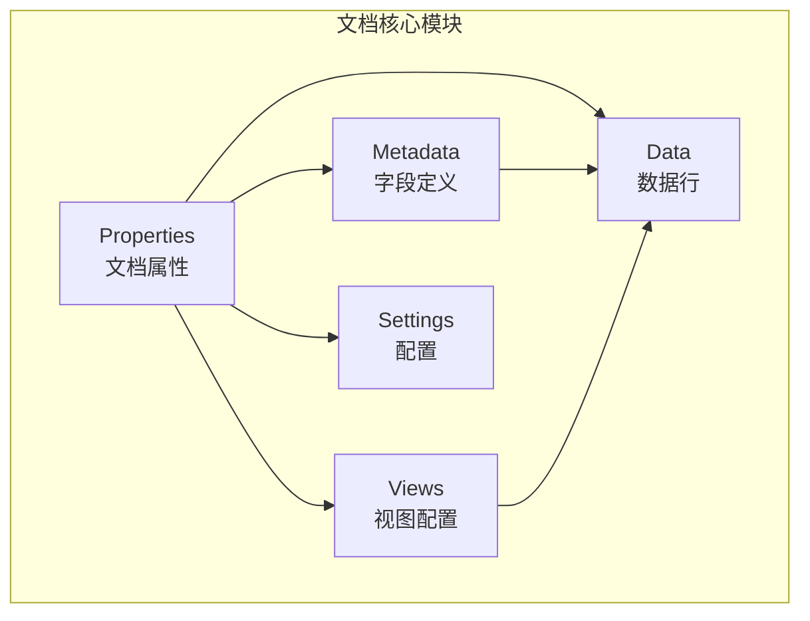
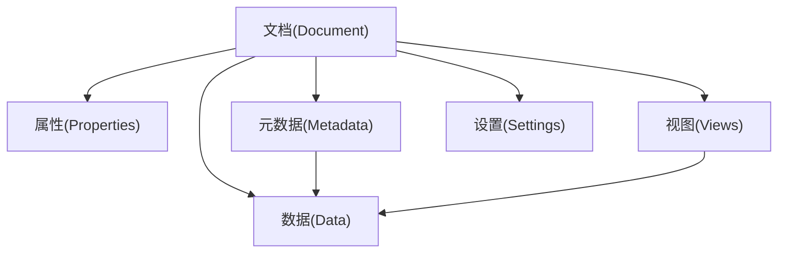
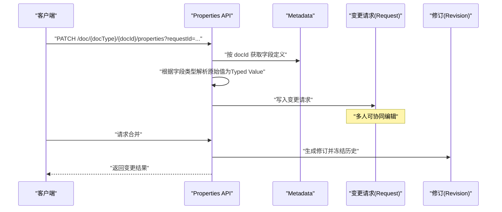
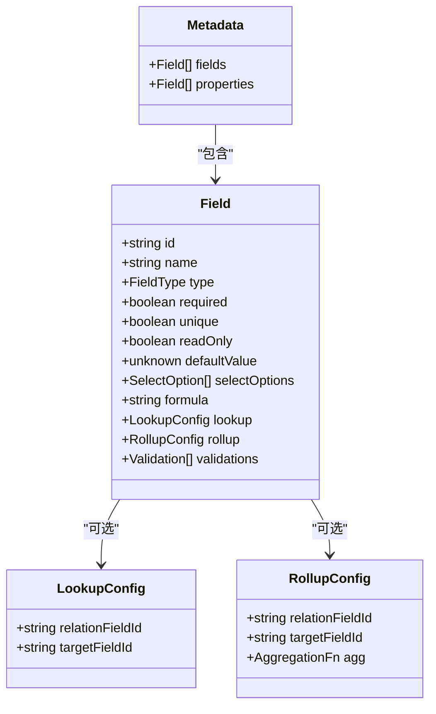
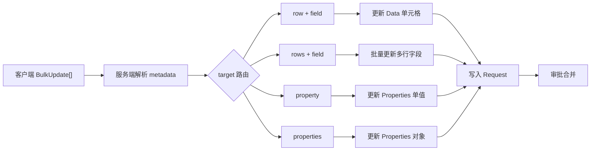
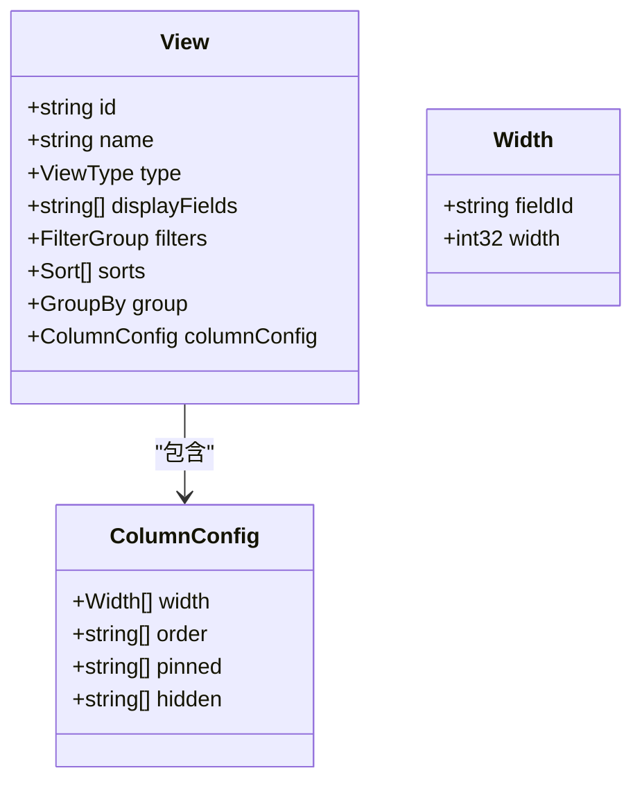
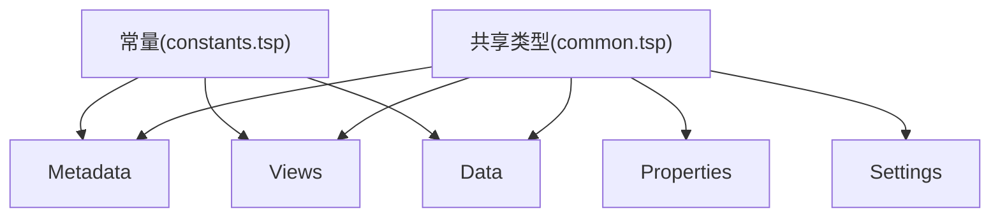

# 文档模型

<cite>
**本文引用的文件**
- [api/document/core/index.tsp](file://api/document/core/index.tsp)
- [api/document/core/properties.tsp](file://api/document/core/properties.tsp)
- [api/document/core/metadata.tsp](file://api/document/core/metadata.tsp)
- [api/document/core/views.tsp](file://api/document/core/views.tsp)
- [api/document/core/data.tsp](file://api/document/core/data.tsp)
- [api/document/core/settings.tsp](file://api/document/core/settings.tsp)
- [api/shared/common.tsp](file://api/shared/common.tsp)
- [api/shared/constants.tsp](file://api/shared/constants.tsp)
- [docs-src/guides/document-model.md](file://docs-src/guides/document-model.md)
- [docs-src/references/field-types.md](file://docs-src/references/field-types.md)
- [docs-src/guides/data-operations.md](file://docs-src/guides/data-operations.md)
- [docs-src/guides/examples.md](file://docs-src/guides/examples.md)
</cite>

## 目录
1. [简介](#简介)
2. [项目结构](#项目结构)
3. [核心组件](#核心组件)
4. [架构总览](#架构总览)
5. [详细组件分析](#详细组件分析)
6. [依赖关系分析](#依赖关系分析)
7. [性能考量](#性能考量)
8. [故障排查指南](#故障排查指南)
9. [结论](#结论)
10. [附录](#附录)

## 简介
本文件面向 NexusBook 文档模型（Document Bundle）的综合数据模型文档，围绕统一文档抽象展开，系统阐述 Properties（文档属性）、Metadata（字段定义）、Views（视图配置）、Data（数据行）、Settings（配置）五大核心数据层，以及 25+ 字段类型与 8 种视图类型的映射与使用方式。文档还提供典型业务场景（订单、产品、库存）的样本数据与使用流程，并总结数据访问模式（过滤、排序、分组、聚合）与性能优化建议。

## 项目结构
文档模型位于 api/document/core 下，采用模块化组织，核心模块包括：
- properties.tsp：文档属性与元信息
- metadata.tsp：字段定义与计算/校验配置
- data.tsp：数据行与批量更新、查询
- views.tsp：视图类型与展示配置
- settings.tsp：文档/类型级设置

图表来源
- [api/document/core/index.tsp](file://api/document/core/index.tsp#L1-L21)
- [api/document/core/properties.tsp](file://api/document/core/properties.tsp#L200-L434)
- [api/document/core/metadata.tsp](file://api/document/core/metadata.tsp#L183-L211)
- [api/document/core/views.tsp](file://api/document/core/views.tsp#L86-L171)
- [api/document/core/data.tsp](file://api/document/core/data.tsp#L326-L543)
- [api/document/core/settings.tsp](file://api/document/core/settings.tsp#L86-L141)

章节来源
- [api/document/core/index.tsp](file://api/document/core/index.tsp#L1-L21)

## 核心组件
- 文档属性（Properties）：存储文档本身的元信息（如订单时间、门店、金额、数量等），支持批量更新、历史查询与版本控制。
- 字段元数据（Metadata）：定义数据行字段结构、类型、默认值、选项、只读/唯一/必填、计算（formula/lookup/rollup）与校验规则。
- 数据行（Data）：承载业务数据行，支持 CRUD、批量更新、结构化查询（过滤、排序、分组、聚合）与乐观锁版本控制。
- 视图（Views）：定义多种展示形态（表格、相册、看板、日历、图表、表单、地图、时间线），并配置列、过滤、排序、分组与聚合。
- 配置（Settings）：文档级与类型级设置，包括默认视图、分享、权限策略、修订保留策略等。

章节来源
- [api/document/core/properties.tsp](file://api/document/core/properties.tsp#L94-L198)
- [api/document/core/metadata.tsp](file://api/document/core/metadata.tsp#L65-L181)
- [api/document/core/data.tsp](file://api/document/core/data.tsp#L199-L262)
- [api/document/core/views.tsp](file://api/document/core/views.tsp#L28-L84)
- [api/document/core/settings.tsp](file://api/document/core/settings.tsp#L33-L84)

## 架构总览
统一文档抽象将“文档”拆分为五个层次：Properties、Metadata、Data、Views、Settings，彼此职责清晰、边界明确，且通过 Metadata 与 Views 对 Data 形成约束与投影，形成可扩展、可审计、可协作的文档数据体系。

图表来源
- [docs-src/guides/document-model.md](file://docs-src/guides/document-model.md#L35-L51)
- [api/document/core/metadata.tsp](file://api/document/core/metadata.tsp#L146-L181)
- [api/document/core/views.tsp](file://api/document/core/views.tsp#L28-L84)

章节来源
- [docs-src/guides/document-model.md](file://docs-src/guides/document-model.md#L35-L51)

## 详细组件分析

### 文档属性（Properties）
- 数据结构要点
  - 唯一标识、所属文档、文档类型、组织/工作区归属
  - 属性值集合（ValueEntry[]），键为字段ID，值为 Typed Value
  - 版本号、创建/更新时间、更新人
- 主要能力
  - 获取/创建/替换/部分更新属性
  - 历史查询与删除
  - 变更请求工作流（requestId）、合并后生成修订
- 使用场景
  - 订单：订单时间、门店、总金额、总数量、状态、备注
  - 发票：发票号、开票时间、付款期限、税率、收款方
  - 产品：SKU、品牌、分类、供应商
  - 项目：项目名称、负责人、预算、截止日期、优先级

图表来源
- [api/document/core/properties.tsp](file://api/document/core/properties.tsp#L200-L434)
- [api/document/core/metadata.tsp](file://api/document/core/metadata.tsp#L183-L211)

章节来源
- [api/document/core/properties.tsp](file://api/document/core/properties.tsp#L94-L198)
- [docs-src/guides/document-model.md](file://docs-src/guides/document-model.md#L74-L142)

### 字段元数据（Metadata）
- 字段类型（25+）
  - 基础：text、long_text、number、currency、percent、boolean
  - 日期时间：date、datetime、duration
  - 选择：single_select、multi_select、rating
  - 关联：attachment、user、collaborator、relation
  - 计算：lookup、rollup、formula、auto_number
  - 系统：created_time、updated_time、created_by、updated_by
- 字段定义
  - id/name/type/required/unique/readOnly/defaultValue/selectOptions
  - 计算配置：formula、lookup、rollup
  - 校验规则：ruleType + config + 多语言消息
- 值类型映射
  - text/long_text → {"text": "..."}
  - number/currency/percent → {"number": N}
  - boolean → {"boolean": true/false}
  - date → {"date": "YYYY-MM-DD"}
  - datetime → {"datetime": "ISO8601"}
  - duration → {"duration": ms}
  - single_select → {"selectOption": {...}}
  - multi_select → {"selectOptions": [...]}
  - rating → {"rating": 1..5}
  - attachment → {"attachments": [...]}
  - user → {"user": {...}}
  - collaborator → {"collaborators": [...]}
  - relation → {"relations": [...]}
- 字段配置通用选项
  - id、name、type、description、required、unique、readonly、defaultValue、validation

图表来源
- [api/document/core/metadata.tsp](file://api/document/core/metadata.tsp#L65-L181)
- [api/shared/common.tsp](file://api/shared/common.tsp#L297-L331)
- [api/shared/constants.tsp](file://api/shared/constants.tsp#L141-L314)

章节来源
- [api/document/core/metadata.tsp](file://api/document/core/metadata.tsp#L29-L181)
- [docs-src/references/field-types.md](file://docs-src/references/field-types.md#L1-L461)
- [api/shared/common.tsp](file://api/shared/common.tsp#L544-L576)

### 数据行（Data）
- 数据行结构
  - id、values（ValueEntry[]）、审计信息（createdAt/createdBy/updatedAt/updatedBy）、version
- 批量更新（BulkUpdate）
  - target 支持：row、row+field、rows+field、property、properties
  - value 支持：单值、对象（多字段）、数组（多行不同值）
  - 服务端根据 metadata 自动解析值类型，统一走 requestId 工作流
- 查询能力
  - 简单分页：page/pageSize/sort/filter/group/cursor
  - 结构化查询：FilterGroup、Sort、GroupBy、Aggregation
- 并发控制
  - 版本号（version）乐观锁，冲突返回错误

图表来源
- [api/document/core/data.tsp](file://api/document/core/data.tsp#L151-L262)
- [api/document/core/data.tsp](file://api/document/core/data.tsp#L326-L543)

章节来源
- [api/document/core/data.tsp](file://api/document/core/data.tsp#L199-L262)
- [docs-src/guides/data-operations.md](file://docs-src/guides/data-operations.md#L156-L195)

### 视图（Views）
- 视图类型（8种）
  - table、gallery、kanban、calendar、chart、form、map、timeline
- 视图配置
  - displayFields、filters、sorts、group、columnConfig（width/order/pinned/hidden）
- 视图管理
  - 列表、创建、获取、更新、删除、设为默认

图表来源
- [api/document/core/views.tsp](file://api/document/core/views.tsp#L28-L84)
- [api/shared/constants.tsp](file://api/shared/constants.tsp#L87-L139)
- [api/shared/common.tsp](file://api/shared/common.tsp#L234-L331)

章节来源
- [api/document/core/views.tsp](file://api/document/core/views.tsp#L28-L84)
- [api/shared/constants.tsp](file://api/shared/constants.tsp#L87-L139)

### 配置（Settings）
- 文档级设置
  - defaultViewId、sharing（publicLinkEnabled/password）、permissions、retention.revisions
- 类型级设置
  - 为该类型的所有文档提供默认配置
- 管理接口
  - 文档级：GET/PUT /doc/{docType}/{docId}/settings
  - 类型级：GET/PUT /doc/{docType}/setting

章节来源
- [api/document/core/settings.tsp](file://api/document/core/settings.tsp#L33-L141)

## 依赖关系分析
- 共享类型与常量
  - ValueEntry、Value、Filter/Sort/GroupBy、AggregationFn、SelectOption、Attachment/UserRef/RelationRef 等
  - ViewType、FieldType、DocumentType 等枚举
- 模块间耦合
  - Metadata 与 Data 强约束：Data.values.fieldId 必须存在于 Metadata.fields
  - Views 仅保存配置，不持有数据，通过 displayFields 投影 Data
  - Properties 与 Data 分离，避免交叉污染
  - Settings 与 Views/Settings 无直接数据耦合，主要影响展示与行为

图表来源
- [api/shared/common.tsp](file://api/shared/common.tsp#L544-L576)
- [api/shared/constants.tsp](file://api/shared/constants.tsp#L87-L314)
- [api/document/core/metadata.tsp](file://api/document/core/metadata.tsp#L65-L181)
- [api/document/core/data.tsp](file://api/document/core/data.tsp#L199-L262)
- [api/document/core/views.tsp](file://api/document/core/views.tsp#L28-L84)
- [api/document/core/properties.tsp](file://api/document/core/properties.tsp#L94-L198)
- [api/document/core/settings.tsp](file://api/document/core/settings.tsp#L33-L84)

章节来源
- [api/shared/common.tsp](file://api/shared/common.tsp#L1-L576)
- [api/shared/constants.tsp](file://api/shared/constants.tsp#L1-L314)

## 性能考量
- 批量优于单次
  - 使用批量更新（BulkUpdate）减少网络往返与服务端解析成本
- 分页与游标
  - 列表查询优先使用游标分页，避免深度分页的性能损耗
- 查询下推
  - 在服务端使用结构化查询（filters/sorts/group/aggregations）减少传输与客户端过滤
- 字段裁剪
  - 仅查询所需字段，避免通配符查询造成不必要的数据传输
- 并发控制
  - 使用版本号（version）乐观锁，降低冲突概率与回滚成本
- 视图缓存
  - 对常用视图配置进行本地缓存，减少重复请求

章节来源
- [docs-src/guides/data-operations.md](file://docs-src/guides/data-operations.md#L273-L396)

## 故障排查指南
- 版本冲突
  - 现象：更新失败，提示版本不匹配
  - 处理：重新获取最新数据，带上最新 version 再提交
- 字段类型不匹配
  - 现象：批量更新时报错
  - 处理：确认字段类型与值格式一致（参考字段类型映射）
- 缺失 requestId
  - 现象：写操作被拒绝
  - 处理：为所有写操作提供 requestId，或使用默认临时请求
- 权限不足
  - 现象：获取/更新失败
  - 处理：检查 Settings.permissions 与组织/工作区权限策略

章节来源
- [docs-src/guides/data-operations.md](file://docs-src/guides/data-operations.md#L234-L272)
- [api/shared/common.tsp](file://api/shared/common.tsp#L80-L152)

## 结论
NexusBook 文档模型通过 Properties/Metadata/Data/Views/Settings 的分层设计，实现了对多业务类型（订单、产品、库存等）的统一抽象与扩展。借助 25+ 字段类型与 8 种视图类型，系统既能满足结构化数据管理，又能灵活适配多样化的展示与协作需求。配合 requestId 工作流、版本控制与结构化查询，系统在可审计性、可协作性与性能方面达到良好平衡。

## 附录

### 字段类型与值类型映射（摘录）
- text/long_text → {"text": "..."}
- number/currency/percent → {"number": N}
- boolean → {"boolean": true/false}
- date → {"date": "YYYY-MM-DD"}
- datetime → {"datetime": "ISO8601"}
- duration → {"duration": ms}
- single_select → {"selectOption": {...}}
- multi_select → {"selectOptions": [...]}
- rating → {"rating": 1..5}
- attachment → {"attachments": [...]}
- user → {"user": {...}}
- collaborator → {"collaborators": [...]}
- relation → {"relations": [...]}
- lookup/rollup/formula/auto_number/system字段 → 参考字段类型文档

章节来源
- [docs-src/references/field-types.md](file://docs-src/references/field-types.md#L438-L461)
- [api/shared/common.tsp](file://api/shared/common.tsp#L544-L576)

### 视图类型与配置要点
- table、gallery、kanban、calendar、chart、form、map、timeline
- 配置项：displayFields、filters、sorts、group、columnConfig(width/order/pinned/hidden)

章节来源
- [api/shared/constants.tsp](file://api/shared/constants.tsp#L87-L139)
- [api/document/core/views.tsp](file://api/document/core/views.tsp#L28-L84)

### 典型业务场景与样本数据
- 订货单（purchaseOrder）
  - 属性：orderTime、storeName、totalAmount、totalQuantity、status
  - 元数据：productName（text）、quantity（number）、unitPrice（currency）、total（formula）
  - 数据行：每行代表一个订单项
  - 视图：按状态筛选的表格视图
- 产品（product）
  - 属性：SKU、品牌、分类、供应商
  - 元数据：name、price、stock、category、tags（multi_select）
  - 数据行：每行代表一个产品
  - 视图：相册视图（展示封面图）、看板视图（按状态）
- 库存（inventory）
  - 属性：仓库、盘点时间、盘点人
  - 元数据：productName、location、stock、reorderPoint、supplier（relation）
  - 数据行：每行代表一个库存记录
  - 视图：日历视图（按日期）、图表视图（库存趋势）

章节来源
- [docs-src/guides/examples.md](file://docs-src/guides/examples.md#L1-L211)
- [docs-src/guides/document-model.md](file://docs-src/guides/document-model.md#L143-L353)