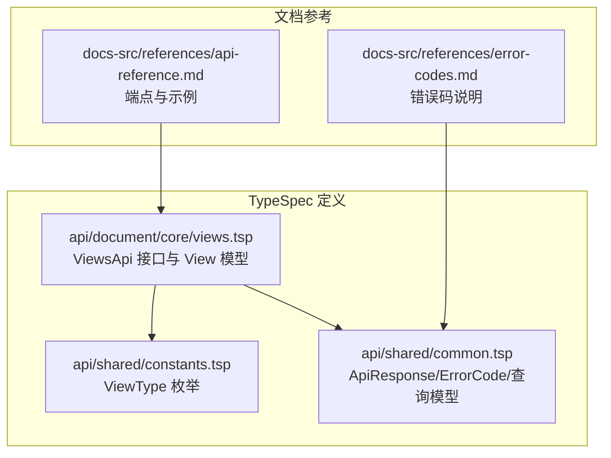
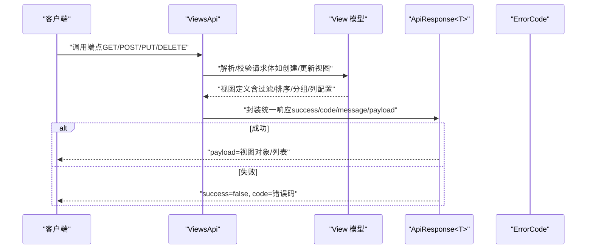
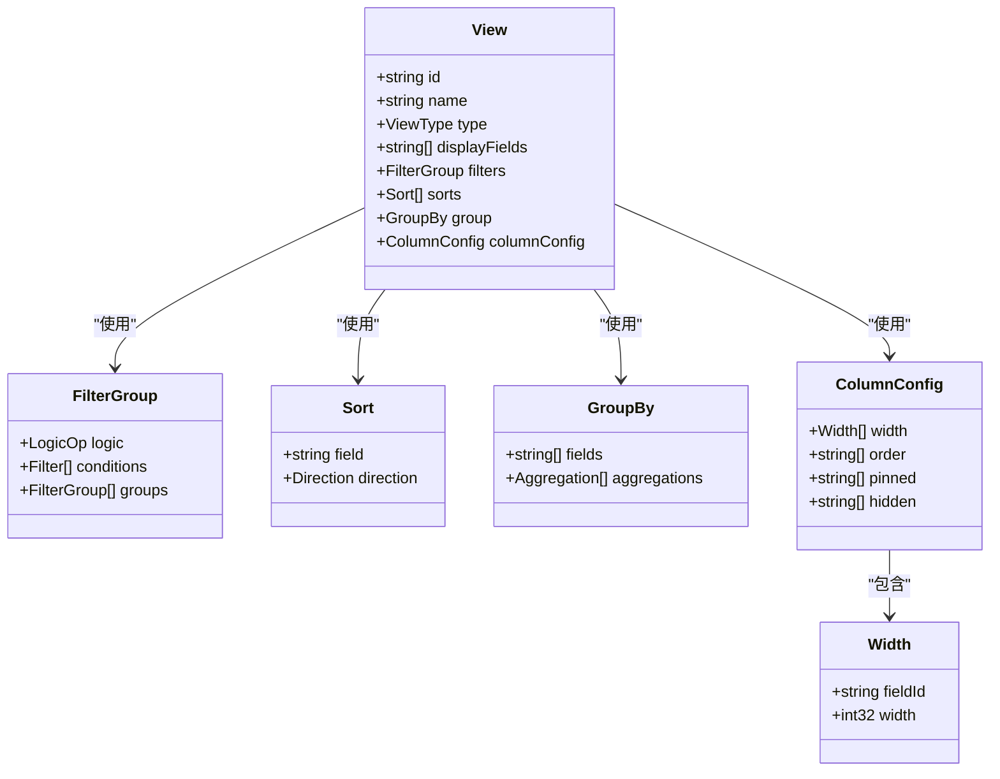
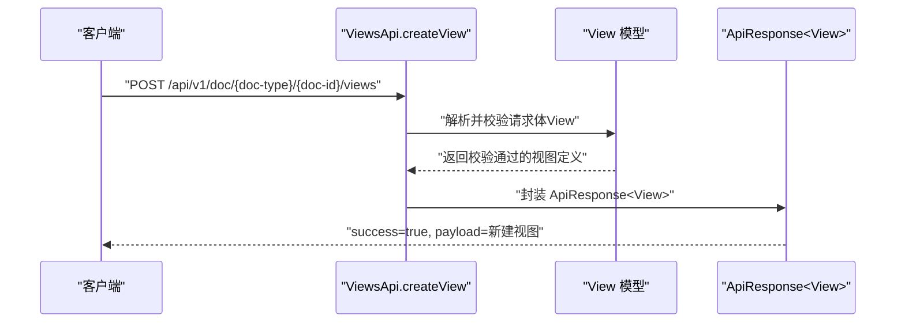
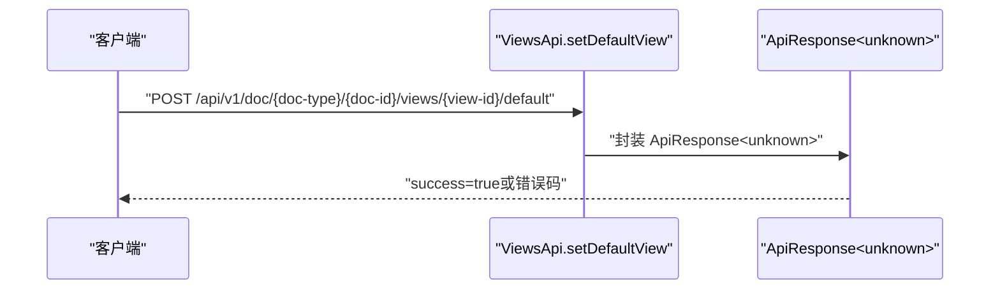
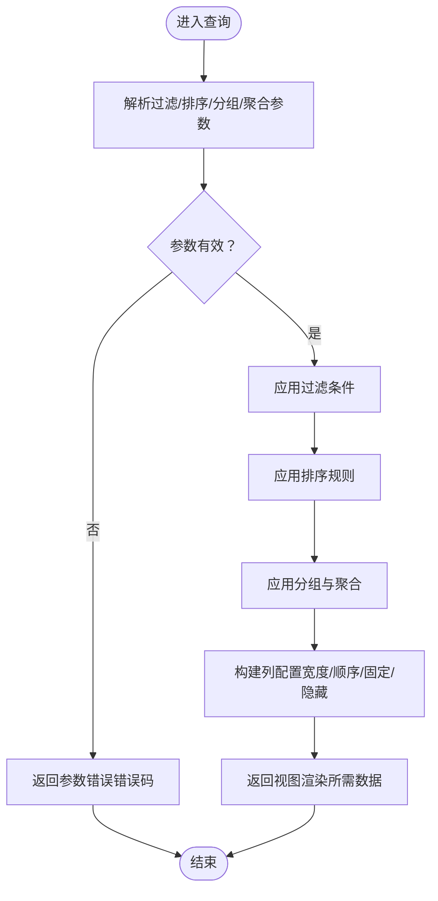
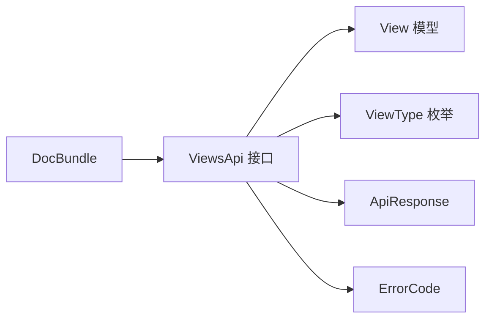

# 视图管理操作

<cite>
**本文引用的文件**
- [README.md](file://README.md)
- [api/document/core/views.tsp](file://api/document/core/views.tsp)
- [api/shared/common.tsp](file://api/shared/common.tsp)
- [api/shared/constants.tsp](file://api/shared/constants.tsp)
- [docs-src/references/api-reference.md](file://docs-src/references/api-reference.md)
- [docs-src/references/error-codes.md](file://docs-src/references/error-codes.md)
- [docs-src/guides/development.md](file://docs-src/guides/development.md)
- [api/document/aggregate/index.tsp](file://api/document/aggregate/index.tsp)
</cite>

## 目录
1. [简介](#简介)
2. [项目结构](#项目结构)
3. [核心组件](#核心组件)
4. [架构总览](#架构总览)
5. [详细组件分析](#详细组件分析)
6. [依赖关系分析](#依赖关系分析)
7. [性能考量](#性能考量)
8. [故障排查指南](#故障排查指南)
9. [结论](#结论)
10. [附录](#附录)

## 简介
本文件面向“视图管理”的全生命周期操作，覆盖创建、获取、更新、删除与设为默认视图等端点。文档基于 TypeSpec 定义的 ViewsApi 接口，结合统一响应格式与错误码体系，给出每个端点的 HTTP 方法、URL 路径、请求参数、请求体结构、响应格式、权限要求、错误处理与事务性说明，并提供实际调用示例与默认视图设置逻辑对客户端行为的影响说明。

## 项目结构
- 视图 API 定义位于文档核心模块，采用 TypeSpec 接口与模型定义，统一输出 OpenAPI。
- 统一响应格式与错误码定义位于共享模块，确保所有接口一致的返回结构。
- API 参考与错误码参考位于文档源文件，提供端点清单、示例与错误说明。

**图表来源**
- [api/document/core/views.tsp](file://api/document/core/views.tsp#L1-L170)
- [api/shared/constants.tsp](file://api/shared/constants.tsp#L87-L139)
- [api/shared/common.tsp](file://api/shared/common.tsp#L153-L177)
- [docs-src/references/api-reference.md](file://docs-src/references/api-reference.md#L148-L171)
- [docs-src/references/error-codes.md](file://docs-src/references/error-codes.md#L1-L312)

**章节来源**
- [README.md](file://README.md#L1-L187)
- [docs-src/references/api-reference.md](file://docs-src/references/api-reference.md#L148-L171)

## 核心组件
- ViewsApi 接口：提供视图列表、创建、获取、更新、删除与设为默认视图等端点。
- View 模型：包含视图标识、名称、类型、渲染字段、过滤/排序/分组聚合、列配置等。
- 统一响应格式 ApiResponse<T>：所有接口统一返回 success/code/message/payload。
- 错误码 ErrorCode：集中定义视图相关错误码（如视图不存在、视图定义无效、权限不足等）。
- 视图类型 ViewType：支持表格、相册/网格、看板、日历、图表、表单、地图、时间线等。

**章节来源**
- [api/document/core/views.tsp](file://api/document/core/views.tsp#L28-L84)
- [api/shared/common.tsp](file://api/shared/common.tsp#L153-L177)
- [api/shared/common.tsp](file://api/shared/common.tsp#L80-L151)
- [api/shared/constants.tsp](file://api/shared/constants.tsp#L87-L139)

## 架构总览
视图管理端点遵循 RESTful 设计，路径包含文档类型与文档 ID；默认视图端点为视图资源的子资源。统一响应格式与错误码贯穿所有接口，便于客户端一致处理。

**图表来源**
- [api/document/core/views.tsp](file://api/document/core/views.tsp#L86-L170)
- [api/shared/common.tsp](file://api/shared/common.tsp#L153-L177)
- [api/shared/common.tsp](file://api/shared/common.tsp#L80-L151)

## 详细组件分析

### ViewsApi 端点定义与说明
- 基础路径：/api/v1/doc/{doc-type}/{doc-id}/views
- 标签：Document - Views
- 端点清单与摘要：
  - GET /views：列出指定文档的所有视图
  - POST /views：创建新视图
  - GET /views/{view-id}：获取指定视图详情
  - PUT /views/{view-id}：更新指定视图
  - DELETE /views/{view-id}：删除指定视图
  - POST /views/{view-id}/default：将指定视图设为默认视图

**章节来源**
- [api/document/core/views.tsp](file://api/document/core/views.tsp#L86-L170)
- [docs-src/references/api-reference.md](file://docs-src/references/api-reference.md#L148-L171)

### View 模型字段与复杂度分析
- 关键字段与用途：
  - id/name：视图标识与显示名称
  - type：视图类型（来自 ViewType 枚举）
  - displayFields：渲染字段列表
  - filters：过滤条件组合（FilterGroup）
  - sorts：排序条件（Sort[]）
  - group：分组与聚合（GroupBy）
  - columnConfig：列展示配置（宽度/顺序/固定/隐藏）
- 复杂度与性能影响：
  - 过滤/排序/分组/聚合在服务端执行，复杂度取决于数据规模与条件组合
  - 列配置仅影响前端渲染，不改变数据存储与查询复杂度
- 数据结构关系图：

**图表来源**
- [api/document/core/views.tsp](file://api/document/core/views.tsp#L28-L84)
- [api/shared/common.tsp](file://api/shared/common.tsp#L272-L357)
- [api/shared/common.tsp](file://api/shared/common.tsp#L220-L232)
- [api/shared/common.tsp](file://api/shared/common.tsp#L277-L295)

**章节来源**
- [api/document/core/views.tsp](file://api/document/core/views.tsp#L28-L84)
- [api/shared/common.tsp](file://api/shared/common.tsp#L220-L357)

### 端点 API 定义与调用示例

#### 1) 列出视图
- HTTP 方法：GET
- URL：/api/v1/doc/{doc-type}/{doc-id}/views
- 请求参数：
  - 路径参数：doc-type（文档类型）、doc-id（文档 ID）
- 请求体：无
- 响应：ApiResponse<View[]>，payload 为视图数组
- 示例：参见 API 参考中的示例

**章节来源**
- [api/document/core/views.tsp](file://api/document/core/views.tsp#L94-L99)
- [docs-src/references/api-reference.md](file://docs-src/references/api-reference.md#L148-L171)

#### 2) 创建视图
- HTTP 方法：POST
- URL：/api/v1/doc/{doc-type}/{doc-id}/views
- 请求参数：
  - 路径参数：doc-type、doc-id
- 请求体：View（包含 id/name/type/displayFields/filters/sorts/group/columnConfig 等）
- 响应：ApiResponse<View>，payload 为新建视图
- 示例：参见 API 参考中的示例

**章节来源**
- [api/document/core/views.tsp](file://api/document/core/views.tsp#L106-L113)
- [docs-src/references/api-reference.md](file://docs-src/references/api-reference.md#L148-L171)

#### 3) 获取视图详情
- HTTP 方法：GET
- URL：/api/v1/doc/{doc-type}/{doc-id}/views/{view-id}
- 请求参数：
  - 路径参数：doc-type、doc-id、view-id
- 请求体：无
- 响应：ApiResponse<View>，payload 为视图对象

**章节来源**
- [api/document/core/views.tsp](file://api/document/core/views.tsp#L119-L126)

#### 4) 更新视图
- HTTP 方法：PUT
- URL：/api/v1/doc/{doc-type}/{doc-id}/views/{view-id}
- 请求参数：
  - 路径参数：doc-type、doc-id、view-id
- 请求体：View（完整或部分字段）
- 响应：ApiResponse<View>，payload 为更新后的视图

**章节来源**
- [api/document/core/views.tsp](file://api/document/core/views.tsp#L133-L141)

#### 5) 删除视图
- HTTP 方法：DELETE
- URL：/api/v1/doc/{doc-type}/{doc-id}/views/{view-id}
- 请求参数：
  - 路径参数：doc-type、doc-id、view-id
- 请求体：无
- 响应：ApiResponse<unknown>，payload 通常为 null

**章节来源**
- [api/document/core/views.tsp](file://api/document/core/views.tsp#L148-L155)

#### 6) 设为默认视图
- HTTP 方法：POST
- URL：/api/v1/doc/{doc-type}/{doc-id}/views/{view-id}/default
- 请求参数：
  - 路径参数：doc-type、doc-id、view-id
- 请求体：无
- 响应：ApiResponse<unknown>，payload 通常为 null
- 说明：该端点用于将指定视图设置为文档的默认视图，客户端在首次打开文档时可优先使用该视图

**章节来源**
- [api/document/core/views.tsp](file://api/document/core/views.tsp#L162-L169)

### 权限要求与事务性说明
- 权限要求：
  - 认证：所有端点均需携带有效的访问令牌（Authorization: Bearer TOKEN）
  - 授权：根据错误码参考，若无权限可能返回 UNAUTHORIZED/FORBIDDEN 或视图相关权限错误码（如 VIEW_PERMISSION_DENIED）
- 事务性：
  - TypeSpec 定义未显式声明事务性保证；建议客户端在批量或关键操作中做好幂等与重试策略
- 错误处理：
  - 统一响应格式：success/code/message/payload
  - 错误码：包含视图相关错误码（如 VIEW_NOT_FOUND、VIEW_INVALID_DEFINITION）

**章节来源**
- [docs-src/references/error-codes.md](file://docs-src/references/error-codes.md#L1-L312)
- [api/shared/common.tsp](file://api/shared/common.tsp#L153-L177)

### 默认视图设置逻辑与客户端影响
- 设置逻辑：
  - 通过 POST /views/{view-id}/default 将指定视图标记为默认视图
  - 服务端应校验视图存在性与所属文档一致性
- 客户端行为影响：
  - 首次打开文档时，优先使用默认视图渲染
  - 若未设置默认视图，客户端可回退到第一个视图或用户上次使用的视图
  - 默认视图变更后，后续打开文档应立即反映最新默认视图

**章节来源**
- [api/document/core/views.tsp](file://api/document/core/views.tsp#L162-L169)
- [api/document/aggregate/index.tsp](file://api/document/aggregate/index.tsp#L48-L90)

### API 调用序列图（创建视图）

**图表来源**
- [api/document/core/views.tsp](file://api/document/core/views.tsp#L106-L113)
- [api/shared/common.tsp](file://api/shared/common.tsp#L153-L177)

### API 调用序列图（设为默认视图）

**图表来源**
- [api/document/core/views.tsp](file://api/document/core/views.tsp#L162-L169)
- [api/shared/common.tsp](file://api/shared/common.tsp#L153-L177)

### 视图配置算法流程图（过滤/排序/分组/聚合）

**图表来源**
- [api/document/core/views.tsp](file://api/document/core/views.tsp#L53-L84)
- [api/shared/common.tsp](file://api/shared/common.tsp#L220-L357)

## 依赖关系分析
- ViewsApi 依赖：
  - View 模型（视图定义与配置）
  - ViewType 枚举（视图类型）
  - 统一响应格式 ApiResponse 与错误码 ErrorCode
- 文档聚合包 DocBundle 包含视图列表，便于一次性渲染

**图表来源**
- [api/document/core/views.tsp](file://api/document/core/views.tsp#L28-L84)
- [api/shared/constants.tsp](file://api/shared/constants.tsp#L87-L139)
- [api/shared/common.tsp](file://api/shared/common.tsp#L153-L177)
- [api/document/aggregate/index.tsp](file://api/document/aggregate/index.tsp#L48-L90)

**章节来源**
- [api/document/core/views.tsp](file://api/document/core/views.tsp#L28-L84)
- [api/shared/constants.tsp](file://api/shared/constants.tsp#L87-L139)
- [api/shared/common.tsp](file://api/shared/common.tsp#L153-L177)
- [api/document/aggregate/index.tsp](file://api/document/aggregate/index.tsp#L48-L90)

## 性能考量
- 查询复杂度：过滤/排序/分组/聚合在服务端执行，建议合理使用索引字段与分页参数，避免大范围全量扫描
- 列配置：仅影响前端渲染，不增加后端计算负担
- 幂等与重试：建议客户端对关键写操作实现幂等与指数退避重试，避免重复提交
- 批量操作：如需批量更新视图配置，建议在客户端合并后再提交，减少往返次数

[本节为通用指导，不直接分析具体文件]

## 故障排查指南
- 常见错误码与处理：
  - VIEW_NOT_FOUND：检查视图 ID 是否正确
  - VIEW_INVALID_DEFINITION：检查视图配置（字段 ID、过滤条件等）
  - UNAUTHORIZED/FORBIDDEN：检查访问令牌与权限范围
- 错误响应格式：
  - 所有接口统一返回 ApiResponse，包含 success/code/message/payload
- 建议的重试策略与日志记录：
  - 对内部错误与服务不可用进行指数退避重试
  - 记录错误上下文（endpoint/method/userId/timestamp）以便定位问题

**章节来源**
- [docs-src/references/error-codes.md](file://docs-src/references/error-codes.md#L1-L312)
- [api/shared/common.tsp](file://api/shared/common.tsp#L153-L177)

## 结论
- ViewsApi 提供了完整的视图全生命周期管理能力，配合统一响应格式与错误码体系，便于客户端稳定集成
- 默认视图端点为客户端提供了便捷的首屏体验，建议在创建/更新视图后及时设置默认视图
- 建议在客户端侧做好幂等、重试与日志记录，提升整体可靠性

[本节为总结性内容，不直接分析具体文件]

## 附录
- API 基本信息与统一响应格式参见 API 参考与开发指南
- 视图类型与字段类型参考见常量与枚举定义

**章节来源**
- [docs-src/references/api-reference.md](file://docs-src/references/api-reference.md#L1-L665)
- [docs-src/guides/development.md](file://docs-src/guides/development.md#L317-L396)
- [api/shared/constants.tsp](file://api/shared/constants.tsp#L87-L139)