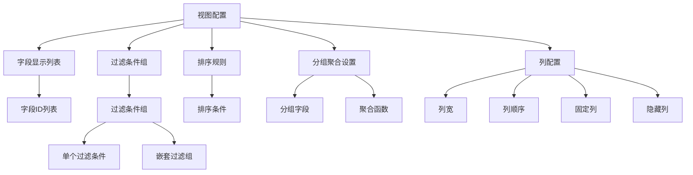
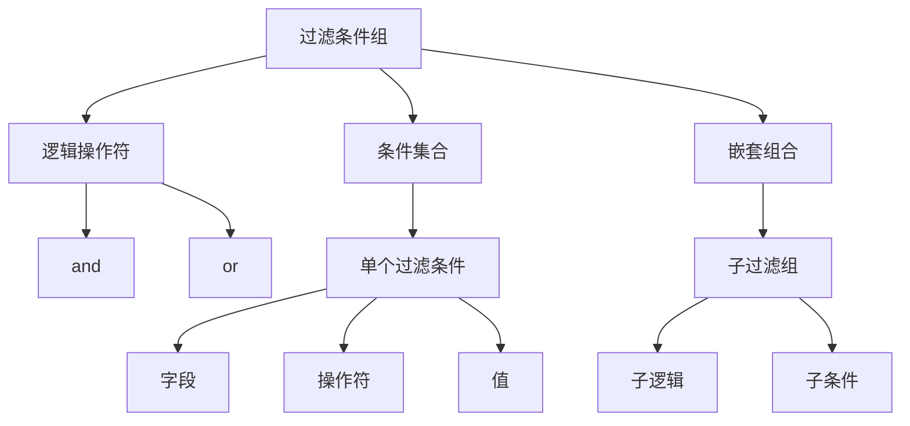
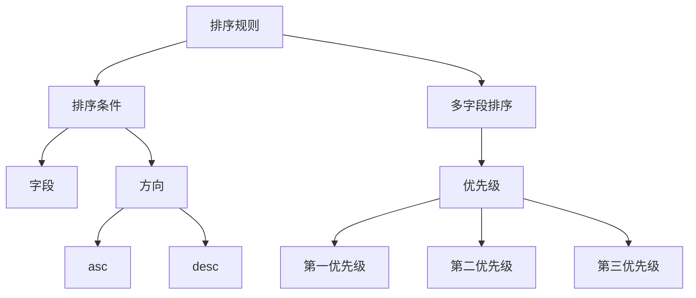
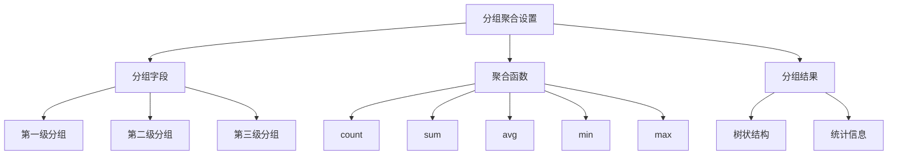
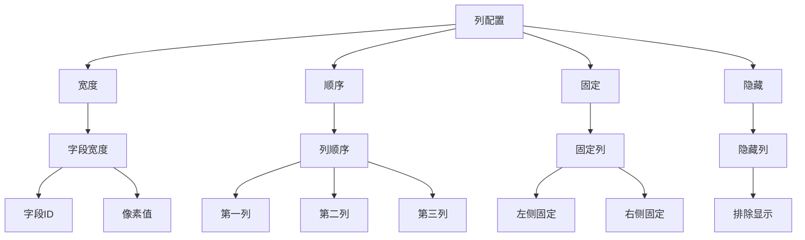
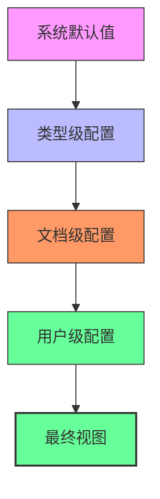

# 视图配置选项

<cite>
**本文档引用的文件**   
- [views.tsp](file://api/document/core/views.tsp#L28-L84)
- [common.tsp](file://api/shared/common.tsp#L277-L357)
- [settings.tsp](file://api/document/core/settings.tsp#L33-L38)
- [data.tsp](file://api/document/core/data.tsp#L319-L346)
- [examples.md](file://docs-src/guides/examples.md#L98-L117)
- [document-model.md](file://docs-src/guides/document-model.md#L302-L352)
</cite>

## 目录
1. [简介](#简介)
2. [核心配置项](#核心配置项)
3. [字段显示列表](#字段显示列表)
4. [过滤条件组](#过滤条件组)
5. [排序规则](#排序规则)
6. [分组聚合设置](#分组聚合设置)
7. [列配置](#列配置)
8. [完整JSON配置示例](#完整json配置示例)
9. [配置继承与默认值](#配置继承与默认值)
10. [API动态调整](#api动态调整)

## 简介

视图配置是NexusBook平台中用于定义数据展示方式的核心机制。通过灵活的配置选项，用户可以自定义数据的显示、过滤、排序、分组和列布局，以满足不同业务场景的需求。视图配置主要包含五个核心组成部分：字段显示列表（displayFields）、过滤条件组（filters）、排序规则（sorts）、分组聚合设置（group）和列配置（columnConfig）。这些配置共同决定了数据在不同视图类型（如表格、看板、相册等）中的呈现效果。

**Section sources**
- [views.tsp](file://api/document/core/views.tsp#L28-L84)
- [document-model.md](file://docs-src/guides/document-model.md#L302-L352)

## 核心配置项

视图配置的核心组成部分包括：

- **displayFields**: 定义在视图中渲染的字段列表
- **filters**: 定义数据过滤的条件组合
- **sorts**: 定义数据排序的规则
- **group**: 定义数据分组与聚合的设置
- **columnConfig**: 定义列的展示配置，包括宽度、顺序、固定和隐藏

这些配置项相互协作，共同构建出用户所需的数据视图。每个配置项都有其特定的数据结构和作用范围，可以根据业务需求进行灵活组合和调整。



**Diagram sources **
- [views.tsp](file://api/document/core/views.tsp#L51-L83)

**Section sources**
- [views.tsp](file://api/document/core/views.tsp#L51-L83)

## 字段显示列表

`displayFields` 配置项用于指定在视图中渲染的字段列表。它是一个字符串数组，包含需要显示的字段ID。

### 数据结构
```typescript
displayFields?: string[];
```

### 作用范围
- 仅影响当前视图的数据展示
- 字段ID必须存在于文档的元数据（metadata）中
- 如果未指定，则默认显示所有字段

### 相互关系
- 与 `columnConfig.order` 协同工作，决定字段的显示顺序
- 与 `metadata` 相关联，字段定义来源于元数据
- 受 `filters` 影响，只有通过过滤条件的数据才会被显示

### 对数据展示的影响
- 控制视图中可见的字段范围
- 优化数据展示的简洁性和相关性
- 提高特定场景下的数据可读性

**Section sources**
- [views.tsp](file://api/document/core/views.tsp#L51-L52)

## 过滤条件组

`filters` 配置项用于定义数据过滤的条件组合。它基于 `FilterGroup` 模型，支持复杂的嵌套逻辑。

### 数据结构
```typescript
filters?: NexusBook.Api.Common.FilterGroup;
```

其中 `FilterGroup` 的结构为：
```typescript
model FilterGroup {
    logic: LogicOp;           // 逻辑操作符 (and/or)
    conditions?: Filter[];    // 条件集合
    groups?: FilterGroup[];   // 嵌套组合
}
```

### 作用范围
- 作用于整个数据集
- 支持多级嵌套的复杂过滤逻辑
- 可与其他视图配置项组合使用

### 相互关系
- 与 `sorts` 协同工作，先过滤后排序
- 与 `group` 配合，对分组前的数据进行筛选
- 与 `displayFields` 互补，共同定义数据视图

### 操作符支持
- `eq`: 等于
- `ne`: 不等于
- `in`: 包含
- `range`: 范围
- `contains`: 包含子串
- `is_empty`: 为空
- `is_not_empty`: 不为空

### 逻辑操作符
- `and`: 所有条件必须满足
- `or`: 满足任一条件即可

### 对数据展示的影响
- 精确控制显示的数据范围
- 支持复杂的业务逻辑筛选
- 提高数据查询的灵活性和准确性



**Diagram sources **
- [common.tsp](file://api/shared/common.tsp#L277-L295)

**Section sources**
- [common.tsp](file://api/shared/common.tsp#L277-L295)
- [views.tsp](file://api/document/core/views.tsp#L57-L58)

## 排序规则

`sorts` 配置项用于定义数据排序的规则。它是一个 `Sort` 对象数组，支持多字段排序。

### 数据结构
```typescript
sorts?: NexusBook.Api.Common.Sort[];
```

其中 `Sort` 的结构为：
```typescript
model Sort {
    field: string;        // 字段名
    direction: Direction; // 方向 (asc/desc)
}
```

### 作用范围
- 作用于过滤后的数据集
- 支持多字段排序，按数组顺序优先级递减
- 可与分组配置结合使用

### 相互关系
- 在 `filters` 之后执行，对筛选后的数据进行排序
- 与 `group` 配合，可定义分组内和分组间的排序规则
- 受 `displayFields` 影响，只能对显示的字段进行排序

### 方向选项
- `asc`: 升序排列
- `desc`: 降序排列

### 对数据展示的影响
- 决定数据的显示顺序
- 支持多维度的数据组织
- 提高数据的可读性和分析效率



**Diagram sources **
- [common.tsp](file://api/shared/common.tsp#L220-L232)

**Section sources**
- [common.tsp](file://api/shared/common.tsp#L220-L232)
- [views.tsp](file://api/document/core/views.tsp#L63-L64)

## 分组聚合设置

`group` 配置项用于定义数据的分组与聚合设置。它基于 `GroupBy` 模型，支持多级分组和多种聚合函数。

### 数据结构
```typescript
group?: NexusBook.Api.Common.GroupBy;
```

其中 `GroupBy` 的结构为：
```typescript
model GroupBy {
    fields: string[];              // 分组字段列表
    aggregations?: Aggregation[];  // 聚合函数集合
}
```

### 作用范围
- 作用于排序后的数据集
- 支持多级分组，按字段顺序定义层级
- 可与过滤和排序配置组合使用

### 相互关系
- 在 `sorts` 之后执行，对排序后的数据进行分组
- 与 `aggregations` 配合，为每个分组计算统计值
- 受 `filters` 影响，只对筛选后的数据进行分组

### 聚合函数
- `count`: 计数
- `sum`: 求和
- `avg`: 平均值
- `min`: 最小值
- `max`: 最大值

### 对数据展示的影响
- 将数据组织成层次结构
- 提供数据的统计摘要
- 支持复杂的业务分析需求



**Diagram sources **
- [common.tsp](file://api/shared/common.tsp#L334-L357)

**Section sources**
- [common.tsp](file://api/shared/common.tsp#L334-L357)
- [views.tsp](file://api/document/core/views.tsp#L69-L70)

## 列配置

`columnConfig` 配置项用于定义列的展示配置，包括宽度、顺序、固定和隐藏等属性。

### 数据结构
```typescript
columnConfig?: {
    width?: {
        fieldId: string;
        width: int32;
    }[];
    order?: string[];
    pinned?: string[];
    hidden?: string[];
};
```

### 作用范围
- 仅影响当前视图的列布局
- 与 `displayFields` 相互影响
- 可独立于其他配置项使用

### 配置项详解

#### 宽度配置 (width)
- 定义各列的具体像素宽度
- 使用字段ID和宽度值的数组形式
- 允许对特定列进行精确的宽度控制

#### 顺序配置 (order)
- 定义列的显示顺序
- 使用字段ID的字符串数组
- 数组顺序即为列的显示顺序

#### 固定配置 (pinned)
- 定义需要固定的列
- 使用字段ID的字符串数组
- 固定列在水平滚动时保持可见

#### 隐藏配置 (hidden)
- 定义需要隐藏的列
- 使用字段ID的字符串数组
- 隐藏列不会在视图中显示

### 相互关系
- 与 `displayFields` 协同工作，共同决定列的可见性
- 与 `order` 配置互补，控制列的排列
- 受视图类型影响，不同视图类型对列配置的支持程度不同

### 对数据展示的影响
- 精确控制列的布局和外观
- 提高数据表格的可读性和可用性
- 支持复杂的表格布局需求



**Diagram sources **
- [views.tsp](file://api/document/core/views.tsp#L75-L83)

**Section sources**
- [views.tsp](file://api/document/core/views.tsp#L75-L83)

## 完整JSON配置示例

以下是一个完整的视图配置JSON示例，展示了所有配置项的实际应用：

```json
{
  "id": "view-sales-report",
  "name": "销售报告视图",
  "type": "table",
  "displayFields": [
    "productName",
    "quantity",
    "unitPrice",
    "totalAmount",
    "salesPerson",
    "orderDate"
  ],
  "filters": {
    "logic": "and",
    "conditions": [
      {
        "field": "orderDate",
        "operator": "range",
        "rangeStart": "2024-01-01",
        "rangeEnd": "2024-12-31"
      },
      {
        "field": "status",
        "operator": "eq",
        "value": "completed"
      }
    ],
    "groups": [
      {
        "logic": "or",
        "conditions": [
          {
            "field": "region",
            "operator": "eq",
            "value": "North"
          },
          {
            "field": "region",
            "operator": "eq",
            "value": "South"
          }
        ]
      }
    ]
  },
  "sorts": [
    {
      "field": "orderDate",
      "direction": "desc"
    },
    {
      "field": "totalAmount",
      "direction": "desc"
    }
  ],
  "group": {
    "fields": [
      "salesPerson",
      "region"
    ],
    "aggregations": [
      {
        "kind": "count",
        "field": "*"
      },
      {
        "kind": "sum",
        "field": "totalAmount"
      },
      {
        "kind": "avg",
        "field": "unitPrice"
      }
    ]
  },
  "columnConfig": {
    "width": [
      {
        "fieldId": "productName",
        "width": 200
      },
      {
        "fieldId": "totalAmount",
        "width": 120
      }
    ],
    "order": [
      "productName",
      "quantity",
      "unitPrice",
      "totalAmount",
      "salesPerson",
      "region",
      "orderDate"
    ],
    "pinned": [
      "productName",
      "totalAmount"
    ],
    "hidden": [
      "unitPrice"
    ]
  }
}
```

这个示例展示了一个销售报告视图的完整配置，包括：
- 显示关键销售字段
- 过滤2024年度已完成的订单
- 按销售人员和地区进行两级分组
- 按订单日期和金额降序排列
- 对列宽、顺序、固定和隐藏进行详细配置

**Section sources**
- [examples.md](file://docs-src/guides/examples.md#L98-L117)

## 配置继承与默认值

视图配置支持继承机制和默认值处理策略，确保配置的一致性和易用性。

### 继承机制

#### 文档级继承
- 每个文档可以设置自己的视图配置
- 配置存储在文档的视图定义中
- 通过 `ViewsApi` 接口进行管理

#### 类型级继承
- 文档类型可以定义默认的视图配置
- 新创建的文档继承类型级配置
- 通过 `TypeSettingsApi` 接口进行管理

#### 用户级继承
- 用户可以保存个人偏好的视图配置
- 个人配置优先于文档和类型级配置
- 通过用户偏好设置接口进行管理

### 默认值处理策略

#### 视图类型默认值
- `table`: 表格视图，显示所有字段，无过滤和排序
- `gallery`: 相册视图，显示关键字段和图片
- `kanban`: 看板视图，按状态字段分组
- `document`: 文档视图，显示详细信息

#### 字段显示默认值
- 如果未指定 `displayFields`，则显示所有字段
- 字段顺序按元数据中的定义顺序
- 所有列默认不固定、不隐藏

#### 过滤默认值
- 如果未指定 `filters`，则不进行过滤
- 显示所有符合条件的数据记录

#### 排序默认值
- 如果未指定 `sorts`，则按创建时间降序排列
- 或按元数据中定义的默认排序

#### 分组默认值
- 如果未指定 `group`，则不分组
- 显示扁平化的数据列表

#### 列配置默认值
- 如果未指定 `columnConfig`，则使用系统默认宽度
- 所有列按字段顺序显示
- 无固定列，无隐藏列

### 继承优先级
1. 用户级配置（最高优先级）
2. 文档级配置
3. 类型级配置
4. 系统默认值（最低优先级）

当多个配置源存在时，优先级高的配置会覆盖优先级低的配置。



**Diagram sources **
- [settings.tsp](file://api/document/core/settings.tsp#L33-L38)
- [views.tsp](file://api/document/core/views.tsp#L45-L46)

**Section sources**
- [settings.tsp](file://api/document/core/settings.tsp#L33-L38)
- [views.tsp](file://api/document/core/views.tsp#L45-L46)

## API动态调整

视图配置可以通过API进行动态调整，支持创建、读取、更新和删除操作。

### API端点

#### 获取视图列表
```http
GET /doc/{docType}/{docId}/views
```
返回指定文档的所有视图。

#### 创建视图
```http
POST /doc/{docType}/{docId}/views
```
创建新的视图定义。

#### 获取视图详情
```http
GET /doc/{docType}/{docId}/views/{viewId}
```
获取指定视图的详细配置。

#### 更新视图
```http
PUT /doc/{docType}/{docId}/views/{viewId}
```
更新视图的定义和配置。

#### 删除视图
```http
DELETE /doc/{docType}/{docId}/views/{viewId}
```
删除指定的视图。

#### 设为默认视图
```http
POST /doc/{docType}/{docId}/views/{viewId}/default
```
将指定视图设为文档的默认视图。

### 动态调整示例

#### 更新过滤条件
```javascript
// 更新视图的过滤条件
await api.put('/doc/purchaseOrder/order-001/views/view-pending', {
  id: 'view-pending',
  name: '待处理订单',
  filters: {
    logic: 'and',
    conditions: [
      { field: 'status', operator: 'eq', value: 'pending' },
      { field: 'amount', operator: 'range', rangeStart: 1000, rangeEnd: 10000 }
    ]
  }
});
```

#### 调整列配置
```javascript
// 调整列的宽度和顺序
await api.put('/doc/sales/report-001/views/view-sales', {
  id: 'view-sales',
  name: '销售视图',
  columnConfig: {
    width: [
      { fieldId: 'productName', width: 250 },
      { fieldId: 'totalAmount', width: 150 }
    ],
    order: ['productName', 'quantity', 'totalAmount', 'salesPerson'],
    pinned: ['productName'],
    hidden: ['unitPrice']
  }
});
```

#### 修改排序规则
```javascript
// 修改排序规则，按金额降序排列
await api.put('/doc/inventory/inv-001/views/view-stock', {
  id: 'view-stock',
  name: '库存视图',
  sorts: [
    { field: 'stockLevel', direction: 'asc' },
    { field: 'lastUpdated', direction: 'desc' }
  ]
});
```

通过这些API端点，可以实现视图配置的动态管理和调整，满足不同场景下的需求变化。

**Section sources**
- [views.tsp](file://api/document/core/views.tsp#L86-L170)