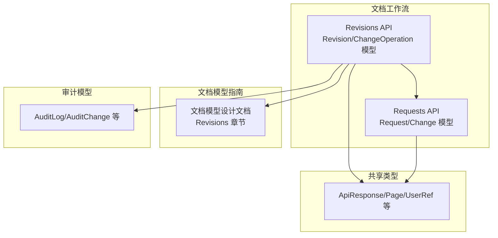
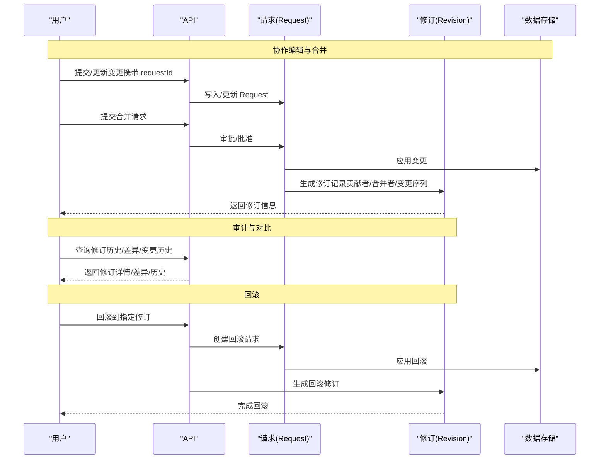
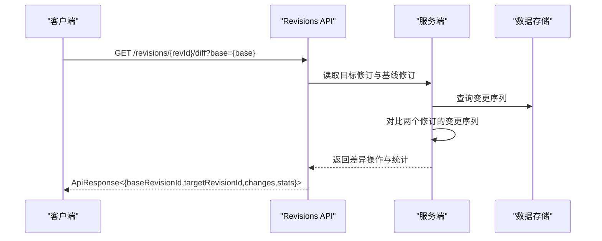
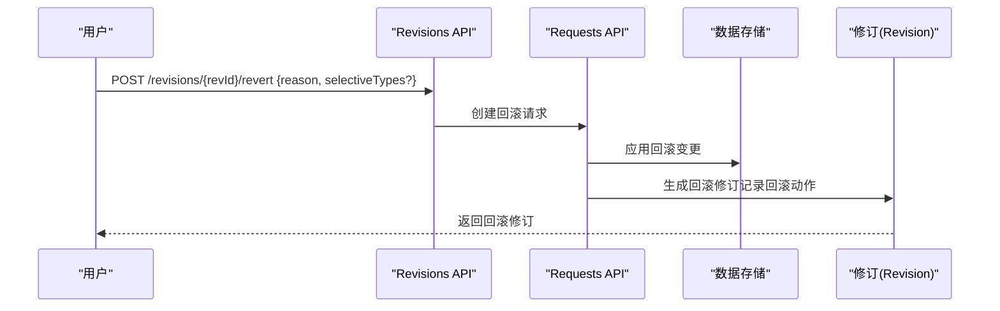
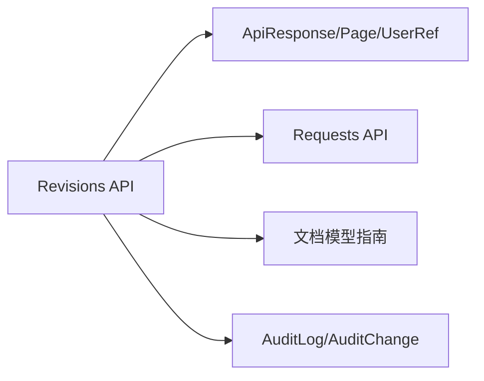

# 修订历史

<cite>
**本文引用的文件**
- [revisions.tsp](file://api/document/workflow/revisions.tsp)
- [requests.tsp](file://api/document/workflow/requests.tsp)
- [common.tsp](file://api/shared/common.tsp)
- [document-model.md](file://docs-src/guides/document-model.md)
- [audit-models.tsp](file://api/audit/models.tsp)
- [architecture.md](file://docs-src/guides/architecture.md)
</cite>

## 目录
1. [简介](#简介)
2. [项目结构](#项目结构)
3. [核心组件](#核心组件)
4. [架构总览](#架构总览)
5. [详细组件分析](#详细组件分析)
6. [依赖分析](#依赖分析)
7. [性能考虑](#性能考虑)
8. [故障排查指南](#故障排查指南)
9. [结论](#结论)
10. [附录：API 调用示例](#附录api-调用示例)

## 简介
本章节面向 nxb-api 的“修订历史（Revisions）”能力，系统性说明 Revision 模型如何记录不可变的历史变更，ChangeOperation 序列的结构设计（type、target、oldValue、newValue 等字段），previousRevisionId 链式结构在版本导航中的作用，diff 端点的版本对比实现与响应格式，回滚（revert）的技术实现与审计追踪意义，并结合文档模型示例给出查询修订历史、获取特定修订详情、对比两个修订差异、回滚到指定版本的完整 API 调用路径。同时解释 stats 统计信息在变更分析中的价值。

## 项目结构
修订历史能力主要由以下模块构成：
- 文档工作流模块：定义 Revision、ChangeOperation、Revisions API 以及与请求（Requests）的关联
- 共享类型模块：提供 ApiResponse、Page、UserRef 等通用类型
- 文档模型指南：提供 Revision 的高层概念、生命周期与 API 示例
- 审计模型：提供审计日志与变更追踪的通用数据结构，可用于审计与合规

图表来源
- [revisions.tsp](file://api/document/workflow/revisions.tsp#L316-L547)
- [requests.tsp](file://api/document/workflow/requests.tsp#L83-L200)
- [common.tsp](file://api/shared/common.tsp#L153-L203)
- [document-model.md](file://docs-src/guides/document-model.md#L459-L553)
- [audit-models.tsp](file://api/audit/models.tsp#L212-L245)

章节来源
- [revisions.tsp](file://api/document/workflow/revisions.tsp#L316-L547)
- [requests.tsp](file://api/document/workflow/requests.tsp#L83-L200)
- [common.tsp](file://api/shared/common.tsp#L153-L203)
- [document-model.md](file://docs-src/guides/document-model.md#L459-L553)
- [audit-models.tsp](file://api/audit/models.tsp#L212-L245)

## 核心组件
- Revision（修订记录）
  - 唯一标识、版本号、源请求、标题/描述、贡献者、合并者、变更操作集合、统计信息、创建/更新时间、前置修订 ID
- ChangeOperation（变更操作）
  - 操作 ID、类型、目标（kind、rowId、fieldId）、旧值、新值、操作人、时间戳、备注
- Revisions API
  - 列表、详情、操作列表、差异对比、变更历史查询、回滚、源请求、导出等端点
- Requests API
  - 合并请求与合并行为，合并时生成 Revision

章节来源
- [revisions.tsp](file://api/document/workflow/revisions.tsp#L158-L314)
- [revisions.tsp](file://api/document/workflow/revisions.tsp#L51-L149)
- [revisions.tsp](file://api/document/workflow/revisions.tsp#L316-L547)
- [requests.tsp](file://api/document/workflow/requests.tsp#L83-L200)

## 架构总览
修订历史贯穿“协作编辑—审批合并—生成修订—审计对比—回滚”的完整生命周期。请求（Request）承载多人协作的变更集合，合并（merge）时冻结并应用变更，生成不可变的修订（Revision），并记录贡献者与合并者。修订之间通过 previousRevisionId 形成链式历史，支持快速导航与审计。

图表来源
- [architecture.md](file://docs-src/guides/architecture.md#L254-L304)
- [requests.tsp](file://api/document/workflow/requests.tsp#L285-L347)
- [revisions.tsp](file://api/document/workflow/revisions.tsp#L316-L547)

章节来源
- [architecture.md](file://docs-src/guides/architecture.md#L254-L304)
- [requests.tsp](file://api/document/workflow/requests.tsp#L285-L347)
- [revisions.tsp](file://api/document/workflow/revisions.tsp#L316-L547)

## 详细组件分析

### Revision 模型与不可变历史
- 不可变性
  - 修订一旦生成即冻结，不可变更；回滚通过创建新的修订来表达，确保历史可追溯且可审计
- 关键字段
  - id、version、requestId、title/description、contributors、mergedBy、changes、stats、createdAt/updatedAt、previousRevisionId
- 与请求的关联
  - 修订由合并请求生成，记录源请求 ID 与合并者，贡献者来自请求中对变更的贡献者集合

章节来源
- [revisions.tsp](file://api/document/workflow/revisions.tsp#L158-L314)
- [requests.tsp](file://api/document/workflow/requests.tsp#L147-L164)

### ChangeOperation 序列结构设计
- 字段说明
  - id：操作唯一标识
  - type：操作类型（row-create/update/delete、field-create/update/delete、metadata-update、settings-update 等）
  - target.kind：目标类型（row/field/metadata/settings）
  - target.rowId/target.fieldId：目标对象标识（当目标是行/字段时）
  - oldValue/newValue：变更前后值（用于对比与回滚）
  - operator、timestamp、note：操作人、时间戳、备注
- 有序性
  - changes 按时间顺序排列，便于审计与差异计算

章节来源
- [revisions.tsp](file://api/document/workflow/revisions.tsp#L51-L149)

### previousRevisionId 链式结构与版本导航
- 作用
  - 通过 previousRevisionId 快速链接上一个修订，形成可导航的历史链
  - 支持从最新修订向上遍历，实现“上一个版本”“版本跳转”等导航能力
- 使用场景
  - 历史浏览、差异对比（base=prev）、审计回溯

章节来源
- [revisions.tsp](file://api/document/workflow/revisions.tsp#L306-L314)

### diff 端点：版本对比实现与响应格式
- 端点与参数
  - GET /doc/{docType}/{docId}/revisions/{revId}/diff?base={baseRevId}&targetKind={kind}
  - 支持按目标类型过滤（如 row、field、metadata、settings）
- 响应结构
  - baseRevisionId、targetRevisionId、changes（差异操作列表）、stats（added、modified、deleted）
- 实现要点
  - 对比两个修订的变更序列，输出差异操作集合与统计
  - 支持按目标类型筛选，减少响应体积与提升分析效率

图表来源
- [revisions.tsp](file://api/document/workflow/revisions.tsp#L395-L448)

章节来源
- [revisions.tsp](file://api/document/workflow/revisions.tsp#L395-L448)

### 回滚（revert）：技术实现与审计追踪
- 技术实现
  - POST /doc/{docType}/{docId}/revisions/{revId}/revert
  - 服务端基于目标修订状态创建新的请求（回滚请求），应用回滚变更，生成新的修订记录回滚动作
  - 支持选择性回滚（仅回滚特定类型，如仅回滚行变更）
- 审计追踪
  - 新修订记录回滚原因、选择性回滚类型、回滚时间与回滚人
  - 与审计模型（AuditLog/AuditChange）一致，便于合规与审计

图表来源
- [revisions.tsp](file://api/document/workflow/revisions.tsp#L476-L511)
- [requests.tsp](file://api/document/workflow/requests.tsp#L285-L347)
- [audit-models.tsp](file://api/audit/models.tsp#L212-L245)

章节来源
- [revisions.tsp](file://api/document/workflow/revisions.tsp#L476-L511)
- [requests.tsp](file://api/document/workflow/requests.tsp#L285-L347)
- [audit-models.tsp](file://api/audit/models.tsp#L212-L245)

### stats 统计信息：变更分析的价值
- Revision.stats
  - rowsCreated/Updated/Deleted
  - fieldsCreated/Updated/Deleted
  - metadataChanges、settingsChanges
- 价值
  - 快速评估修订影响面（新增/修改/删除的行数、字段数）
  - 用于报表与趋势分析（变更频率、变更类型分布）

章节来源
- [revisions.tsp](file://api/document/workflow/revisions.tsp#L238-L286)

### 变更历史查询：按目标维度检索
- 端点
  - GET /doc/{docType}/{docId}/revisions/history?targetKind={row|field}&rowId=&fieldId=&page=&pageSize=
- 用途
  - 查询某行或某字段在所有修订中的变更历史，支持分页与过滤

章节来源
- [revisions.tsp](file://api/document/workflow/revisions.tsp#L463-L475)

### 源请求与导出
- 源请求
  - GET /doc/{docType}/{docId}/revisions/{revId}/request：获取生成该修订的原始合并请求
- 导出
  - GET /doc/{docType}/{docId}/revisions/{revId}/export?format=json|csv：导出修订数据

章节来源
- [revisions.tsp](file://api/document/workflow/revisions.tsp#L512-L546)
- [requests.tsp](file://api/document/workflow/requests.tsp#L83-L200)

## 依赖分析
- Revisions API 依赖
  - 共享类型：ApiResponse、Page、UserRef 等
  - Requests API：合并请求与合并行为，合并时生成 Revision
  - 文档模型指南：提供 Revision 的高层概念与 API 示例
  - 审计模型：提供审计日志与变更追踪的通用结构，便于审计与合规

图表来源
- [revisions.tsp](file://api/document/workflow/revisions.tsp#L316-L547)
- [common.tsp](file://api/shared/common.tsp#L153-L203)
- [requests.tsp](file://api/document/workflow/requests.tsp#L285-L347)
- [audit-models.tsp](file://api/audit/models.tsp#L212-L245)

章节来源
- [revisions.tsp](file://api/document/workflow/revisions.tsp#L316-L547)
- [common.tsp](file://api/shared/common.tsp#L153-L203)
- [requests.tsp](file://api/document/workflow/requests.tsp#L285-L347)
- [audit-models.tsp](file://api/audit/models.tsp#L212-L245)

## 性能考虑
- 分页与过滤
  - 列表与历史查询支持分页与过滤（contributor、search、targetKind、type 等），降低响应体积
- 差异对比
  - diff 端点支持按目标类型过滤，减少对比范围
- 链式导航
  - previousRevisionId 支持快速上溯，避免全量扫描历史
- 统计信息
  - stats 提供粗粒度统计，辅助快速判断影响面

章节来源
- [revisions.tsp](file://api/document/workflow/revisions.tsp#L346-L355)
- [revisions.tsp](file://api/document/workflow/revisions.tsp#L382-L393)
- [revisions.tsp](file://api/document/workflow/revisions.tsp#L410-L448)
- [revisions.tsp](file://api/document/workflow/revisions.tsp#L463-L475)

## 故障排查指南
- 常见错误码
  - REQUEST_NOT_FOUND、REQUEST_CONFLICT、REQUEST_ALREADY_CLOSED（请求相关）
  - DOC_NOT_FOUND、DOC_TYPE_UNKNOWN、DOC_ACCESS_DENIED（文档相关）
  - ROW_NOT_FOUND、FIELD_TYPE_MISMATCH、CONSTRAINT_VIOLATION（数据相关）
- 审计与合规
  - 使用审计模型（AuditLog/AuditChange）进行审计与合规追踪，核对操作人、资源、结果与变更详情

章节来源
- [common.tsp](file://api/shared/common.tsp#L80-L151)
- [audit-models.tsp](file://api/audit/models.tsp#L212-L245)

## 结论
修订历史体系以不可变的 Revision 为核心，通过 ChangeOperation 序列完整记录变更，借助 previousRevisionId 形成链式历史，配合 diff 对比与回滚能力，构建了可审计、可追溯、可回溯的版本控制闭环。stats 统计信息进一步提升了变更分析的效率与价值。Revisions API 与 Requests API 协同工作，确保变更从协作到落地再到审计的全流程贯通。

## 附录：API 调用示例
以下示例基于文档模型指南中的示例路径与参数，展示典型用法。请将占位符替换为真实值，并在请求头中添加认证信息。

- 查询修订历史
  - GET /api/v1/doc/{docType}/{docId}/revisions?page=1&pageSize=20&contributor=&search=
- 获取指定修订详情
  - GET /api/v1/doc/{docType}/{docId}/revisions/{revId}
- 查看修订中的所有操作
  - GET /api/v1/doc/{docType}/{docId}/revisions/{revId}/operations?type=&targetKind=&page=&pageSize=
- 对比两个修订之间的差异
  - GET /api/v1/doc/{docType}/{docId}/revisions/{revId}/diff?base={baseRevId}&targetKind=
- 查询特定对象的变更历史（如某行）
  - GET /api/v1/doc/{docType}/{docId}/revisions/history?targetKind=row&rowId=&page=&pageSize=
- 回滚到指定修订
  - POST /api/v1/doc/{docType}/{docId}/revisions/{revId}/revert
  - 请求体：reason、selectiveTypes（可选）
- 获取修订的源请求
  - GET /api/v1/doc/{docType}/{docId}/revisions/{revId}/request
- 导出修订数据
  - GET /api/v1/doc/{docType}/{docId}/revisions/{revId}/export?format=json|csv

章节来源
- [document-model.md](file://docs-src/guides/document-model.md#L522-L553)
- [revisions.tsp](file://api/document/workflow/revisions.tsp#L316-L547)