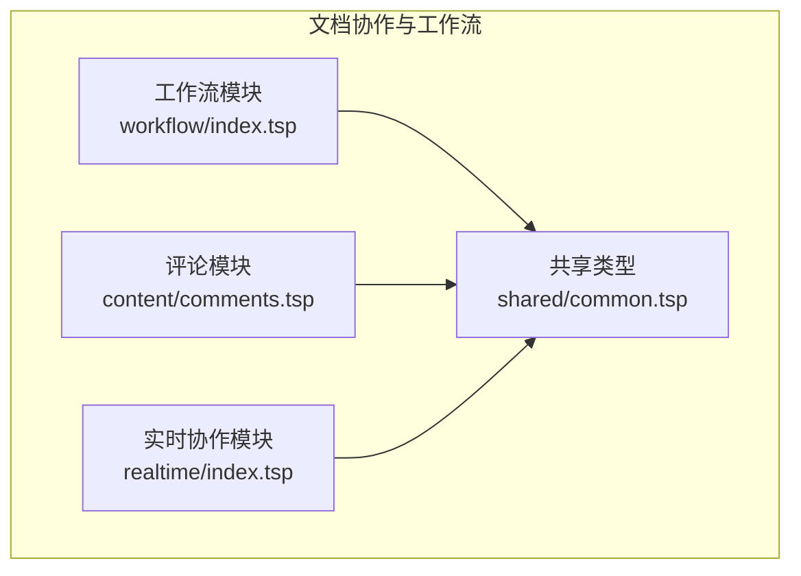
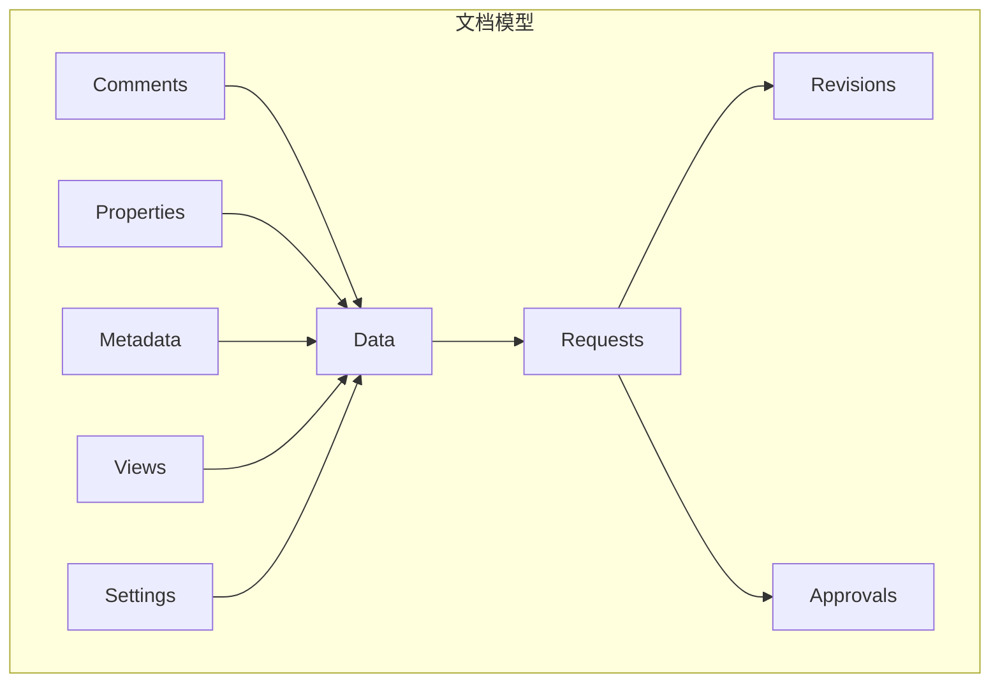
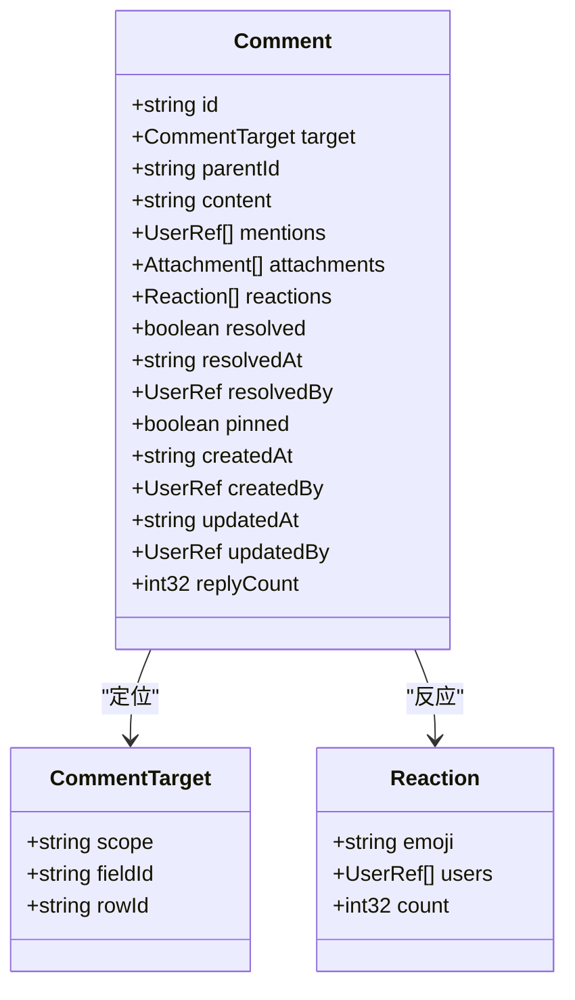
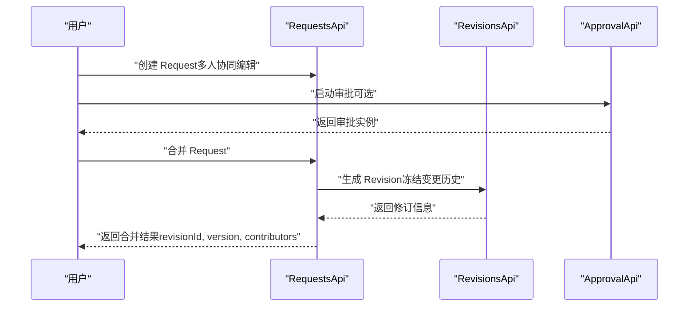
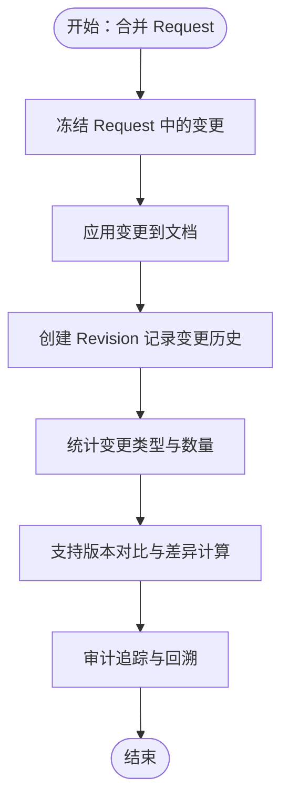
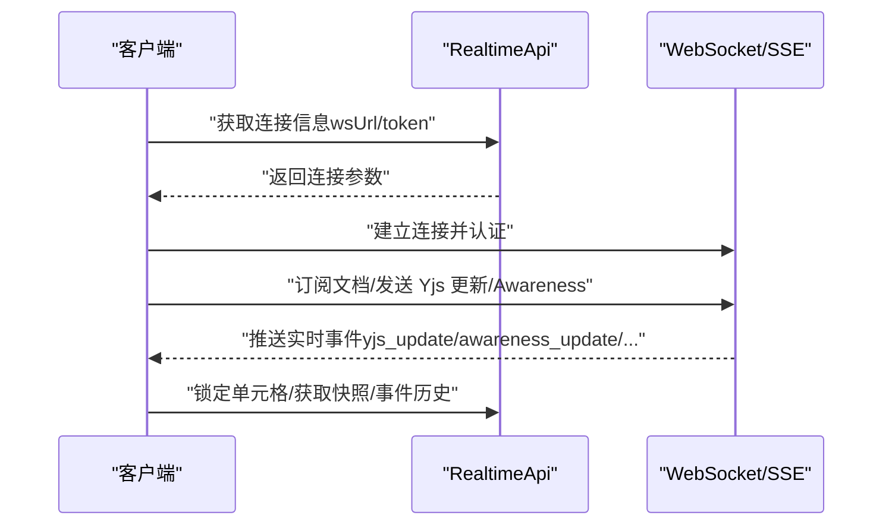
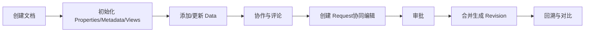
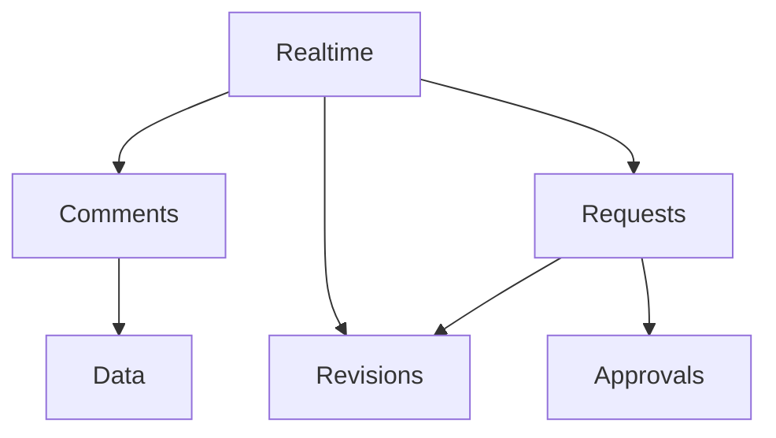

# 协作与工作流

<cite>
**本文引用的文件**
- [api/document/workflow/index.tsp](file://api/document/workflow/index.tsp)
- [api/document/workflow/requests.tsp](file://api/document/workflow/requests.tsp)
- [api/document/workflow/revisions.tsp](file://api/document/workflow/revisions.tsp)
- [api/document/workflow/approvals.tsp](file://api/document/workflow/approvals.tsp)
- [api/document/content/comments.tsp](file://api/document/content/comments.tsp)
- [api/document/content/index.tsp](file://api/document/content/index.tsp)
- [api/document/realtime/index.tsp](file://api/document/realtime/index.tsp)
- [api/document/realtime/messages.tsp](file://api/document/realtime/messages.tsp)
- [api/shared/common.tsp](file://api/shared/common.tsp)
- [docs-src/guides/document-model.md](file://docs-src/guides/document-model.md)
- [docs-src/guides/architecture.md](file://docs-src/guides/architecture.md)
</cite>

## 目录
1. [简介](#简介)
2. [项目结构](#项目结构)
3. [核心组件](#核心组件)
4. [架构总览](#架构总览)
5. [详细组件分析](#详细组件分析)
6. [依赖关系分析](#依赖关系分析)
7. [性能考量](#性能考量)
8. [故障排查指南](#故障排查指南)
9. [结论](#结论)
10. [附录](#附录)

## 简介
本文件聚焦 nexusbook-api 的协作与工作流架构，围绕内容协作层（Comments）与工作流层（Requests、Revisions、Approvals）展开，系统性阐述：
- 评论系统如何支持文档/字段/行/单元格四级精确定位，线程化讨论、表情反应与解决状态；
- 变更请求（Request）驱动的审批工作流：所有写操作必须携带 requestId，在审批通过后才生成不可变的 Revision 记录；
- Revision 如何记录完整的变更历史（ChangeOperation 序列），支持版本对比、审计追踪与回滚；
- 结合 document-model.md 的生命周期图，展示从 Draft → Edit → Review → Merge → Audit 的完整流程；
- 实时协作（Yjs）的集成方式与事件通知机制。

## 项目结构
协作与工作流相关模块位于 api/document 下，采用按功能域划分的目录结构：
- workflow：变更请求、修订历史、审批流程
- content：评论系统
- realtime：Yjs 实时协作与事件通知
- shared：通用类型与响应模型

图表来源
- [api/document/workflow/index.tsp](file://api/document/workflow/index.tsp#L1-L17)
- [api/document/content/comments.tsp](file://api/document/content/comments.tsp#L1-L120)
- [api/document/realtime/index.tsp](file://api/document/realtime/index.tsp#L1-L120)
- [api/shared/common.tsp](file://api/shared/common.tsp#L1-L120)

章节来源
- [api/document/workflow/index.tsp](file://api/document/workflow/index.tsp#L1-L17)
- [api/document/content/index.tsp](file://api/document/content/index.tsp#L1-L13)

## 核心组件
- 变更请求（Requests）：记录待合并的变更，支持多人协同编辑、冲突检测、合并、关闭/重新打开等。
- 修订历史（Revisions）：完整记录变更历史（ChangeOperation 序列），支持版本对比、查询特定目标的历史、回滚等。
- 审批（Approvals）：定义审批流程与决策，支持多节点审批与历史记录。
- 评论（Comments）：统一评论模型，支持文档/字段/行/单元格定位、线程化回复、表情反应、置顶与解决状态。
- 实时协作（Yjs）：基于 WebSocket/SSE 的实时同步，提供 Awareness、单元格锁定、事件历史与快照管理。

章节来源
- [api/document/workflow/requests.tsp](file://api/document/workflow/requests.tsp#L202-L391)
- [api/document/workflow/revisions.tsp](file://api/document/workflow/revisions.tsp#L316-L547)
- [api/document/workflow/approvals.tsp](file://api/document/workflow/approvals.tsp#L96-L156)
- [api/document/content/comments.tsp](file://api/document/content/comments.tsp#L246-L472)
- [api/document/realtime/index.tsp](file://api/document/realtime/index.tsp#L426-L807)

## 架构总览
协作与工作流的整体架构如下：
- 文档模型分层：Properties/Metadata/Data/Views/Comments/Revisions/Settings；
- 协作层：Comments 支持在文档任意位置进行评论与讨论；
- 工作流层：Requests → Revisions + Approvals；
- 实时协作：Yjs 基于 WebSocket/SSE，提供 Awareness、单元格锁定、事件历史与快照管理；
- 通用类型：ApiResponse、Page、UserRef、Attachment 等统一响应与数据模型。

图表来源
- [docs-src/guides/architecture.md](file://docs-src/guides/architecture.md#L7-L68)
- [docs-src/guides/document-model.md](file://docs-src/guides/document-model.md#L67-L822)

章节来源
- [docs-src/guides/architecture.md](file://docs-src/guides/architecture.md#L7-L68)
- [docs-src/guides/document-model.md](file://docs-src/guides/document-model.md#L67-L822)

## 详细组件分析

### 评论系统（Comments）设计与实现
- 精确定位：通过 CommentTarget 的 scope 字段支持 document/field/row/cell 四级定位；fieldId/rowId 可选。
- 线程化讨论：通过 parentId 形成回复链，支持嵌套回复。
- 表情反应：Reaction 集合记录 emoji 与用户列表，支持计数。
- 解决状态：支持 resolved/resolvedAt/resolvedBy 标记评论及其讨论线程为已解决。
- 置顶管理：支持 pin/unpin，重要评论固定展示。
- 附件与 @提及：支持附件与 mentions，便于协作与通知。

图表来源
- [api/document/content/comments.tsp](file://api/document/content/comments.tsp#L50-L238)
- [api/shared/common.tsp](file://api/shared/common.tsp#L451-L487)

章节来源
- [api/document/content/comments.tsp](file://api/document/content/comments.tsp#L246-L472)
- [api/shared/common.tsp](file://api/shared/common.tsp#L451-L487)

### 变更请求（Requests）与审批（Approvals）工作流
- 变更请求（Request）：包含标题、描述、状态、作者、评审人、贡献者、变更集、生成的修订 ID、时间戳等；支持合并、关闭、重新打开、冲突检测。
- 合并流程：合并时冻结请求中的所有变更，应用到文档并生成修订，记录贡献者与合并者；支持 squash、message、deleteBranch 等选项。
- 审批（Approval）：支持启动审批、获取审批实例、决策（通过/拒绝）等；记录审批历史与节点状态。

图表来源
- [api/document/workflow/requests.tsp](file://api/document/workflow/requests.tsp#L202-L391)
- [api/document/workflow/revisions.tsp](file://api/document/workflow/revisions.tsp#L316-L547)
- [api/document/workflow/approvals.tsp](file://api/document/workflow/approvals.tsp#L96-L156)

章节来源
- [api/document/workflow/requests.tsp](file://api/document/workflow/requests.tsp#L202-L391)
- [api/document/workflow/approvals.tsp](file://api/document/workflow/approvals.tsp#L96-L156)

### 修订历史（Revisions）与审计追踪
- ChangeOperation：记录单次增删改操作，包含类型、目标（kind/rowId/fieldId）、旧值/新值、操作人、时间戳、备注等。
- Revision：记录一次完整的变更集合，包含 requestId、title/description、contributors、mergedBy、changes、stats、createdAt/updatedAt、previousRevisionId 等。
- 对比与回溯：支持按修订对比差异、查询特定目标的历史、回滚到指定修订、导出修订数据等。

图表来源
- [api/document/workflow/revisions.tsp](file://api/document/workflow/revisions.tsp#L44-L149)
- [api/document/workflow/revisions.tsp](file://api/document/workflow/revisions.tsp#L158-L314)
- [api/document/workflow/revisions.tsp](file://api/document/workflow/revisions.tsp#L316-L547)

章节来源
- [api/document/workflow/revisions.tsp](file://api/document/workflow/revisions.tsp#L44-L149)
- [api/document/workflow/revisions.tsp](file://api/document/workflow/revisions.tsp#L158-L314)
- [api/document/workflow/revisions.tsp](file://api/document/workflow/revisions.tsp#L316-L547)

### 实时协作（Yjs）集成与事件通知
- 连接与认证：通过 getConnectionInfo 获取 wsUrl/token，客户端建立 WebSocket 连接并发送认证消息；支持 SSE 只读流。
- Awareness：共享用户光标、选区、正在编辑的单元格、颜色等状态；支持更新 Awareness。
- 单元格锁定：请求锁定/释放单元格，防止编辑冲突；支持自动续期。
- Yjs 文档：提供快照获取/保存、快照历史、应用更新、事件历史等接口；支持 HTTP 备用通道。
- 事件类型：包含 yjs_update、awareness_update、user_joined/left、cell_locked/unlocked、cursor_moved、selection_changed、comment_added、data_changed 等。

图表来源
- [api/document/realtime/index.tsp](file://api/document/realtime/index.tsp#L426-L807)
- [api/document/realtime/messages.tsp](file://api/document/realtime/messages.tsp#L1-L155)

章节来源
- [api/document/realtime/index.tsp](file://api/document/realtime/index.tsp#L426-L807)
- [api/document/realtime/messages.tsp](file://api/document/realtime/messages.tsp#L1-L155)

### 生命周期与工作流（Draft → Edit → Review → Merge → Audit）
- Draft：初始化 Properties/Metadata/Views；
- Edit：在 Request 上协作修改 Data/Properties；
- Review：审批流程进行，可能通过/拒绝/回滚；
- Merge：合并生成 Revision，冻结操作历史；
- Audit：通过 Revisions/Operations/Diff 进行审计或回溯。

图表来源
- [docs-src/guides/document-model.md](file://docs-src/guides/document-model.md#L67-L822)

章节来源
- [docs-src/guides/document-model.md](file://docs-src/guides/document-model.md#L67-L822)

## 依赖关系分析
- Requests 与 Revisions：合并请求生成修订，修订记录源请求 ID 与贡献者，支持回滚与导出。
- Comments 与文档模型：评论定位到文档/字段/行/单元格，与 Data/Metadata/Views 等层解耦。
- Realtime 与 Comments/Requests：实时协作可与评论联动（如 comment_added 事件），与请求合并后生成的修订共同构成审计链。
- Approvals 与 Requests：审批可选地与请求关联，审批历史与决策记录在 ApprovalInstance 中。

图表来源
- [api/document/workflow/requests.tsp](file://api/document/workflow/requests.tsp#L202-L391)
- [api/document/workflow/revisions.tsp](file://api/document/workflow/revisions.tsp#L316-L547)
- [api/document/workflow/approvals.tsp](file://api/document/workflow/approvals.tsp#L96-L156)
- [api/document/content/comments.tsp](file://api/document/content/comments.tsp#L246-L472)
- [api/document/realtime/index.tsp](file://api/document/realtime/index.tsp#L426-L807)

章节来源
- [api/document/workflow/requests.tsp](file://api/document/workflow/requests.tsp#L202-L391)
- [api/document/workflow/revisions.tsp](file://api/document/workflow/revisions.tsp#L316-L547)
- [api/document/workflow/approvals.tsp](file://api/document/workflow/approvals.tsp#L96-L156)
- [api/document/content/comments.tsp](file://api/document/content/comments.tsp#L246-L472)
- [api/document/realtime/index.tsp](file://api/document/realtime/index.tsp#L426-L807)

## 性能考量
- 分页与限制：对大量数据使用分页；在聚合查询中限制评论/修订数量，避免一次性拉取过多数据。
- 缓存策略：元数据变化较少可长期缓存；数据与评论变化频繁考虑短期缓存；修订通常不可变，适合长期缓存。
- 批量操作：优先使用批量更新/删除，减少请求次数与网络开销。
- 实时协作：增量传输 Yjs 更新，降低带宽占用；Awareness 与快照定期同步。

[本节为通用指导，无需特定文件来源]

## 故障排查指南
- 请求合并失败：检查冲突检测接口与合并选项（squash/message/deleteBranch），确认权限与审批状态。
- 评论无法回复：确认 parentId 是否正确，scope/fieldId/rowId 是否匹配目标层级。
- 实时协作异常：检查连接信息（wsUrl/token）、认证消息、订阅文档；关注事件历史与错误消息类型。
- 审批流程异常：检查审批实例状态与历史记录，确认决策结果与权限。

章节来源
- [api/document/workflow/requests.tsp](file://api/document/workflow/requests.tsp#L377-L391)
- [api/document/content/comments.tsp](file://api/document/content/comments.tsp#L246-L472)
- [api/document/realtime/index.tsp](file://api/document/realtime/index.tsp#L426-L807)
- [api/document/workflow/approvals.tsp](file://api/document/workflow/approvals.tsp#L96-L156)

## 结论
本架构以 Requests/Revisions/Approvals 为核心，构建了“先请求、后审批、再合并”的变更工作流；以 Comments 提供精确位置的协作讨论；以 Yjs 实现实时同步与事件通知。配合文档模型的生命周期，实现了从草稿到审计的完整闭环，既保证了变更的可追溯性，也提升了多人协作效率与一致性。

[本节为总结性内容，无需特定文件来源]

## 附录
- 命名与 ID 规范：文档/行/字段/视图/评论/修订/请求/附件/关系等 ID 命名建议与 ULID/UUID 使用。
- 最佳实践：属性设计、元数据设计、数据操作、评论与协作、版本与审计等方面的建议。

章节来源
- [docs-src/guides/document-model.md](file://docs-src/guides/document-model.md#L930-L1019)