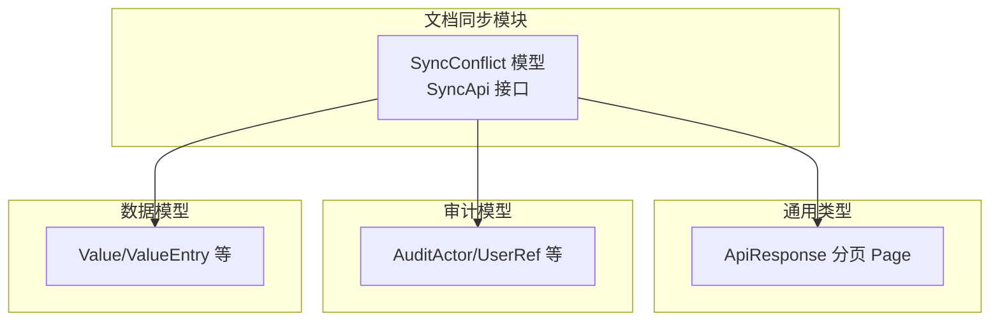
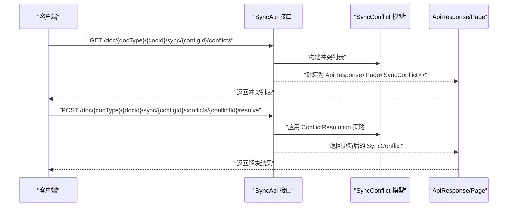
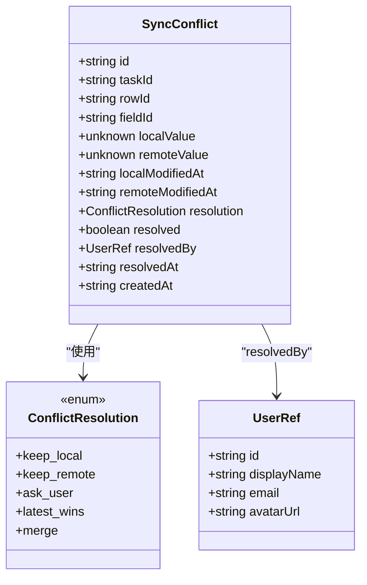
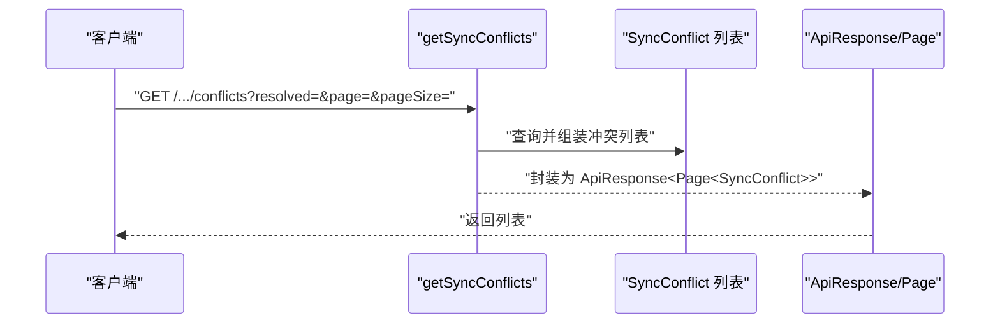
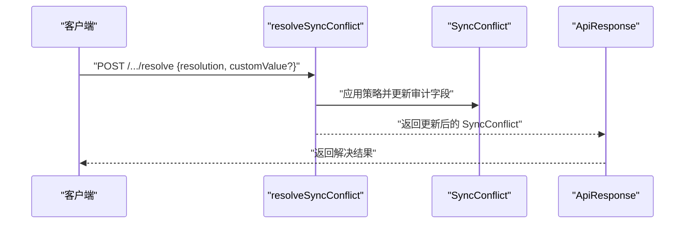
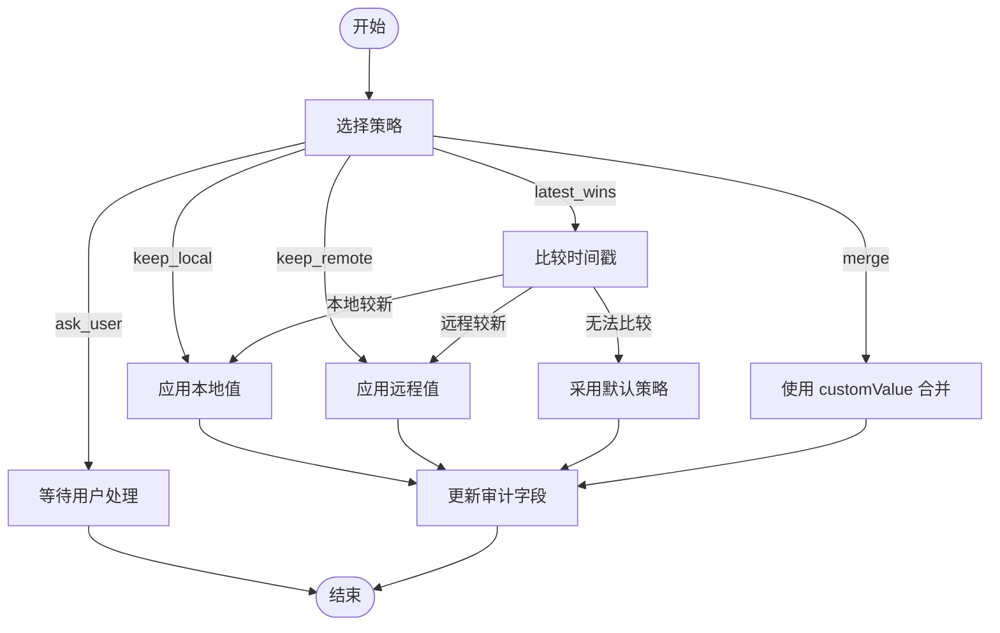
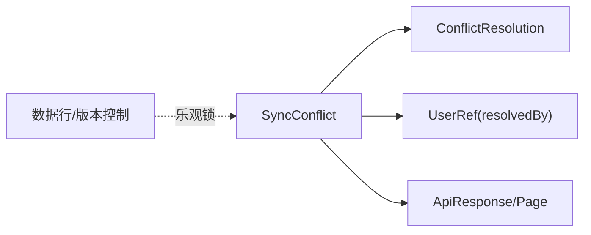

# 同步冲突处理

<cite>
**本文引用的文件**
- [api/document/sync/index.tsp](file://api/document/sync/index.tsp)
- [api/shared/common.tsp](file://api/shared/common.tsp)
- [api/audit/models.tsp](file://api/audit/models.tsp)
- [api/document/core/data.tsp](file://api/document/core/data.tsp)
</cite>

## 目录
1. [简介](#简介)
2. [项目结构](#项目结构)
3. [核心组件](#核心组件)
4. [架构概览](#架构概览)
5. [详细组件分析](#详细组件分析)
6. [依赖关系分析](#依赖关系分析)
7. [性能考量](#性能考量)
8. [故障排查指南](#故障排查指南)
9. [结论](#结论)

## 简介
本文件聚焦 nexusbook-api 的“同步冲突处理”能力，围绕 SyncConflict 模型与相关接口进行系统化说明。内容涵盖：
- SyncConflict 模型字段语义与差异对比逻辑（localValue 与 remoteValue、localModifiedAt 与 remoteModifiedAt 的时间戳比较）
- getSyncConflicts 如何返回待解决的冲突列表
- resolveSyncConflict 支持的五种解决策略：keep_local、keep_remote、ask_user、latest_wins、merge
- merge 策略下的 customValue 参数使用方法
- 处理 Google Sheets 与本地数据库同时修改同一产品价格的冲突示例
- resolved、resolvedBy、resolvedAt 等审计字段的更新机制

## 项目结构
与同步冲突处理直接相关的文件主要位于文档同步模块与通用类型定义中：
- 文档同步接口与模型定义：api/document/sync/index.tsp
- 通用响应与分页模型：api/shared/common.tsp
- 审计模型（用于理解审计字段语义）：api/audit/models.tsp
- 数据行与版本控制（用于理解冲突来源与并发控制）：api/document/core/data.tsp

图表来源
- [api/document/sync/index.tsp](file://api/document/sync/index.tsp#L476-L558)
- [api/shared/common.tsp](file://api/shared/common.tsp#L153-L203)
- [api/audit/models.tsp](file://api/audit/models.tsp#L137-L152)
- [api/document/core/data.tsp](file://api/document/core/data.tsp#L46-L69)

章节来源
- [api/document/sync/index.tsp](file://api/document/sync/index.tsp#L476-L558)
- [api/shared/common.tsp](file://api/shared/common.tsp#L153-L203)
- [api/audit/models.tsp](file://api/audit/models.tsp#L137-L152)
- [api/document/core/data.tsp](file://api/document/core/data.tsp#L46-L69)

## 核心组件
- SyncConflict 模型：描述一次同步冲突的关键信息，包括本地值、远程值、修改时间、解决状态与审计字段。
- SyncApi 接口：
  - getSyncConflicts：查询待解决的冲突列表
  - resolveSyncConflict：对冲突执行解决策略
- 冲突解决策略枚举 ConflictResolution：包含 keep_local、keep_remote、ask_user、latest_wins、merge 五种策略。
- 通用响应模型 ApiResponse 与分页 Page：统一返回结构。

章节来源
- [api/document/sync/index.tsp](file://api/document/sync/index.tsp#L476-L558)
- [api/document/sync/index.tsp](file://api/document/sync/index.tsp#L732-L781)
- [api/shared/common.tsp](file://api/shared/common.tsp#L153-L203)

## 架构概览
下图展示了“获取冲突列表”和“解决冲突”的关键交互路径，以及与通用响应模型的关系。

图表来源
- [api/document/sync/index.tsp](file://api/document/sync/index.tsp#L732-L781)
- [api/shared/common.tsp](file://api/shared/common.tsp#L153-L203)

## 详细组件分析

### SyncConflict 模型与字段语义
- 关键字段
  - id、taskId、rowId、fieldId：定位冲突发生的上下文
  - localValue、remoteValue：冲突双方的值
  - localModifiedAt、remoteModifiedAt：冲突双方的修改时间
  - resolution：已选择的解决策略
  - resolved、resolvedBy、resolvedAt：审计字段，记录解决状态与责任人
  - createdAt：冲突创建时间
- 字段类型
  - localValue、remoteValue、customValue 为 unknown，允许任意 JSON 值
  - 时间字段为字符串（ISO 8601）

图表来源
- [api/document/sync/index.tsp](file://api/document/sync/index.tsp#L476-L558)
- [api/shared/common.tsp](file://api/shared/common.tsp#L617-L653)

章节来源
- [api/document/sync/index.tsp](file://api/document/sync/index.tsp#L476-L558)
- [api/shared/common.tsp](file://api/shared/common.tsp#L617-L653)

### 冲突差异对比与时间戳比较逻辑
- 差异对比
  - 当 localValue 与 remoteValue 不相等时，系统判定存在冲突
- 时间戳比较
  - 当策略为 latest_wins 时，系统依据 localModifiedAt 与 remoteModifiedAt 的时间先后决定保留哪一方
  - 若两者均为空或无法比较，系统可能采用默认策略（例如保留本地或远程，具体行为以实现为准）
- 注意
  - 以上为基于模型字段与策略枚举的语义解读；实际比较逻辑由后端实现负责

章节来源
- [api/document/sync/index.tsp](file://api/document/sync/index.tsp#L132-L166)
- [api/document/sync/index.tsp](file://api/document/sync/index.tsp#L476-L558)

### getSyncConflicts 接口：返回待解决的冲突列表
- 路径与方法
  - GET /doc/{docType}/{docId}/sync/{configId}/conflicts
- 查询参数
  - resolved：可选，过滤已解决/未解决的冲突
  - page、pageSize：分页参数
- 返回结构
  - ApiResponse<Page<SyncConflict>>：统一响应包装 + 分页列表
- 用途
  - 用于展示与筛选需要人工介入的冲突项

图表来源
- [api/document/sync/index.tsp](file://api/document/sync/index.tsp#L732-L750)
- [api/shared/common.tsp](file://api/shared/common.tsp#L153-L203)

章节来源
- [api/document/sync/index.tsp](file://api/document/sync/index.tsp#L732-L750)
- [api/shared/common.tsp](file://api/shared/common.tsp#L153-L203)

### resolveSyncConflict 接口：冲突解决策略
- 路径与方法
  - POST /doc/{docType}/{docId}/sync/{configId}/conflicts/{conflictId}/resolve
- 请求体
  - resolution：必填，冲突解决策略（ConflictResolution）
  - customValue：可选，仅在 merge 策略下使用
- 返回结构
  - ApiResponse<SyncConflict>：返回已更新的冲突对象（包含 resolved、resolvedBy、resolvedAt 等审计字段）

图表来源
- [api/document/sync/index.tsp](file://api/document/sync/index.tsp#L752-L781)
- [api/shared/common.tsp](file://api/shared/common.tsp#L153-L177)

章节来源
- [api/document/sync/index.tsp](file://api/document/sync/index.tsp#L752-L781)
- [api/shared/common.tsp](file://api/shared/common.tsp#L153-L177)

### 冲突解决策略详解
- keep_local：保留本地值，忽略远程值
- keep_remote：保留远程值，忽略本地值
- ask_user：将冲突交由用户进一步处理（系统不自动应用值）
- latest_wins：依据 localModifiedAt 与 remoteModifiedAt 的时间先后决定保留哪一方
- merge：合并策略，customValue 用于指定合并后的最终值

图表来源
- [api/document/sync/index.tsp](file://api/document/sync/index.tsp#L132-L166)
- [api/document/sync/index.tsp](file://api/document/sync/index.tsp#L752-L781)

章节来源
- [api/document/sync/index.tsp](file://api/document/sync/index.tsp#L132-L166)
- [api/document/sync/index.tsp](file://api/document/sync/index.tsp#L752-L781)

### merge 策略下的 customValue 使用
- 适用场景
  - 当 localValue 与 remoteValue 不一致且需要自定义合并结果时
- 使用方式
  - 在 resolveSyncConflict 请求体中传入 customValue，其类型与值应与目标字段的值类型一致
- 注意事项
  - customValue 仅在 merge 策略生效
  - 建议确保 customValue 与业务规则一致，避免后续再次产生冲突

章节来源
- [api/document/sync/index.tsp](file://api/document/sync/index.tsp#L752-L781)

### Google Sheets 与本地数据库同时修改同一产品价格的冲突示例
- 场景描述
  - 本地数据库中某产品的价格为 A
  - 同时，Google Sheets 中该产品的价格为 B
  - 同步过程中检测到冲突
- 处理步骤
  - 使用 getSyncConflicts 获取冲突列表
  - 根据业务需求选择策略：
    - 若以本地为准：选择 keep_local
    - 若以远程为准：选择 keep_remote
    - 若以最新修改为准：选择 latest_wins
    - 若需要自定义：选择 merge 并提供 customValue
  - 调用 resolveSyncConflict 应用策略并更新审计字段
- 审计字段更新
  - resolved=true
  - resolvedBy=当前操作者（UserRef）
  - resolvedAt=当前时间戳

章节来源
- [api/document/sync/index.tsp](file://api/document/sync/index.tsp#L732-L781)
- [api/audit/models.tsp](file://api/audit/models.tsp#L137-L152)

## 依赖关系分析
- SyncConflict 依赖
  - ConflictResolution（策略枚举）
  - UserRef（审计字段 resolvedBy）
  - ApiResponse/Page（统一响应结构）
- 冲突来源与并发控制
  - 数据行更新遵循乐观锁（版本号），避免行级并发冲突
  - 同步冲突是“源之间”的值不一致导致，与行级版本冲突不同

图表来源
- [api/document/sync/index.tsp](file://api/document/sync/index.tsp#L476-L558)
- [api/shared/common.tsp](file://api/shared/common.tsp#L153-L203)
- [api/document/core/data.tsp](file://api/document/core/data.tsp#L46-L69)

章节来源
- [api/document/sync/index.tsp](file://api/document/sync/index.tsp#L476-L558)
- [api/shared/common.tsp](file://api/shared/common.tsp#L153-L203)
- [api/document/core/data.tsp](file://api/document/core/data.tsp#L46-L69)

## 性能考量
- 增量同步与过滤
  - 同步配置支持增量同步与过滤器，有助于减少不必要的冲突检测与数据传输
- 分页查询
  - getSyncConflicts 支持分页，建议在大量冲突场景下合理设置 page 与 pageSize
- 合并策略的复杂度
  - merge 策略可能涉及自定义合并逻辑，建议在业务层实现高效、可预测的合并算法

[本节为通用指导，不直接分析具体文件]

## 故障排查指南
- 冲突未出现
  - 检查同步配置的字段映射与过滤器是否正确
  - 确认源数据确实发生了不同步的修改
- 冲突频繁
  - 调整冲突解决策略（如 latest_wins）或增加过滤器
  - 评估是否需要更严格的增量同步策略
- 审计字段缺失
  - 确认 resolveSyncConflict 是否成功调用
  - 检查 resolved、resolvedBy、resolvedAt 是否在返回体中更新
- 版本冲突（行级）
  - 与同步冲突不同，行级冲突由数据行的版本控制机制处理，参考数据行版本控制文档

章节来源
- [api/document/sync/index.tsp](file://api/document/sync/index.tsp#L732-L781)
- [api/document/core/data.tsp](file://api/document/core/data.tsp#L46-L69)

## 结论
- SyncConflict 模型提供了清晰的冲突上下文与审计字段，配合 ConflictResolution 枚举，能够覆盖常见的冲突解决场景
- getSyncConflicts 与 resolveSyncConflict 形成闭环，既支持自动化策略（如 latest_wins、merge），也支持人工介入（ask_user）
- 在处理 Google Sheets 与本地数据库的价格冲突时，建议优先使用 latest_wins 或 merge，并在 merge 中明确 customValue，以保证一致性与可追溯性
- 审计字段 resolved、resolvedBy、resolvedAt 的更新体现了冲突解决过程的可追踪性，便于后续审计与回溯