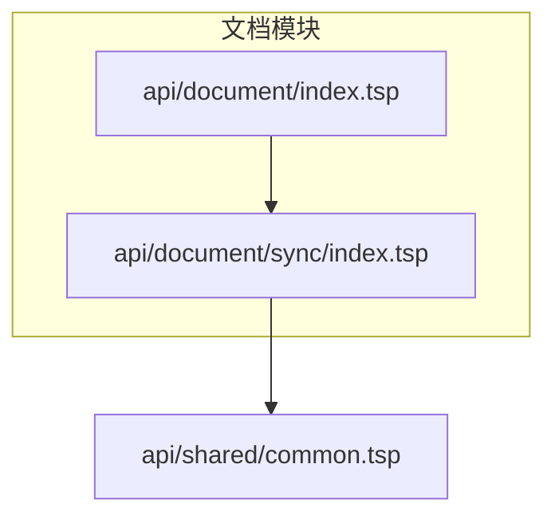
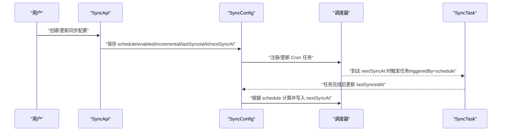
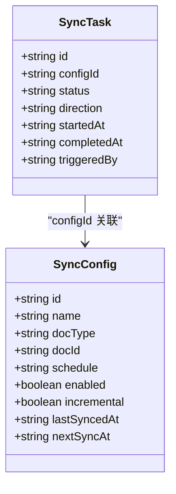
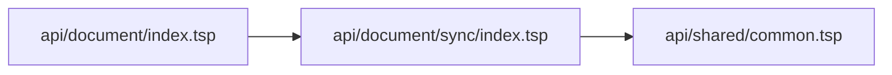

# 定时同步配置

<cite>
**本文引用的文件**
- [api/document/sync/index.tsp](file://api/document/sync/index.tsp)
- [api/document/index.tsp](file://api/document/index.tsp)
- [api/shared/common.tsp](file://api/shared/common.tsp)
</cite>

## 目录
1. [简介](#简介)
2. [项目结构](#项目结构)
3. [核心组件](#核心组件)
4. [架构概览](#架构概览)
5. [详细组件分析](#详细组件分析)
6. [依赖分析](#依赖分析)
7. [性能考虑](#性能考虑)
8. [故障排查指南](#故障排查指南)
9. [结论](#结论)
10. [附录](#附录)

## 简介
本文件面向使用 nexusbook-api 的开发者与运维人员，系统化说明“定时同步配置”的设计与使用方法。重点覆盖以下主题：
- SyncConfig 模型中 schedule 字段的 Cron 表达式语法与常见模式
- 系统如何依据 schedule 字段自动创建定时任务，并在 nextSyncAt 字段中记录下次执行时间
- 增量同步（incremental）与定时任务的协同工作机制
- lastSyncedAt 字段在增量同步中的作用
- 配置每日凌晨同步客户数据到 CRM 系统的完整示例
- 通过禁用 enabled 字段临时停止定时任务的方法

## 项目结构
定时同步能力位于文档模块下的 sync 子模块中，该子模块提供同步配置、任务与冲突管理的接口与数据模型。

图表来源
- [api/document/index.tsp](file://api/document/index.tsp#L1-L31)
- [api/document/sync/index.tsp](file://api/document/sync/index.tsp#L560-L823)
- [api/shared/common.tsp](file://api/shared/common.tsp#L1-L200)

章节来源
- [api/document/index.tsp](file://api/document/index.tsp#L1-L31)

## 核心组件
- SyncConfig：同步配置模型，包含 Cron 表达式 schedule、开关 enabled、增量开关 incremental、最近同步时间 lastSyncedAt、下次同步时间 nextSyncAt 等关键字段。
- SyncTask：同步任务模型，记录每次执行的状态、触发来源、处理统计与错误信息。
- SyncApi 接口：提供创建、查询、更新、删除同步配置，手动触发同步，查询任务历史与冲突等 API。

章节来源
- [api/document/sync/index.tsp](file://api/document/sync/index.tsp#L210-L360)
- [api/document/sync/index.tsp](file://api/document/sync/index.tsp#L362-L474)
- [api/document/sync/index.tsp](file://api/document/sync/index.tsp#L560-L823)

## 架构概览
定时同步的总体流程如下：
- 用户在 SyncConfig 中配置 schedule（Cron 表达式）与 enabled 开关
- 系统根据 schedule 计算并维护 nextSyncAt
- 到达 nextSyncAt 时，系统自动创建一条触发来源为 schedule 的同步任务
- 任务完成后，系统更新 lastSyncedAt，并根据 schedule 计算下一次执行时间写入 nextSyncAt
- 若启用 incremental，则增量同步仅对自 lastSyncedAt 以来变更的数据进行同步

图表来源
- [api/document/sync/index.tsp](file://api/document/sync/index.tsp#L210-L360)
- [api/document/sync/index.tsp](file://api/document/sync/index.tsp#L362-L474)
- [api/document/sync/index.tsp](file://api/document/sync/index.tsp#L560-L823)

## 详细组件分析

### SyncConfig 模型与 Cron 表达式
- schedule：字符串，Cron 表达式，用于定义定时任务的触发频率与时间点。文档中提供了示例：
  - 每 6 小时一次
  - 每天午夜
  - 工作日早上 9 点
- enabled：布尔，控制是否启用该配置的定时任务
- incremental：布尔，开启后仅同步自上次同步以来的变更数据
- lastSyncedAt：字符串，记录最近一次同步完成的时间
- nextSyncAt：字符串，记录下一次计划执行的时间

章节来源
- [api/document/sync/index.tsp](file://api/document/sync/index.tsp#L210-L360)

### Cron 表达式语法与常见模式
- 语法要点（基于仓库注释与常见实践）：
  - Cron 表达式通常由 5 个字段组成（分钟、小时、日、月、周几），用于精确控制执行时刻
  - 支持范围、步长、通配符与特殊字符（如 0 代表午夜）
- 常见模式（来自仓库注释与通用实践）：
  - 每 6 小时一次：例如“0 */6 * * *”
  - 每天午夜：例如“0 0 * * *”
  - 工作日早上 9 点：例如“0 9 * * 1-5”
- 注意事项：
  - 表达式应与系统时区一致
  - 建议在 enabled=true 且 schedule 有效时启用增量同步（incremental=true）

章节来源
- [api/document/sync/index.tsp](file://api/document/sync/index.tsp#L308-L318)

### 定时任务创建与 nextSyncAt 维护
- 系统根据 schedule 字段计算并维护 nextSyncAt
- 到达 nextSyncAt 时，系统自动创建一条触发来源为 schedule 的同步任务
- 任务完成后，系统更新 lastSyncedAt，并根据 schedule 计算下一次执行时间写入 nextSyncAt

章节来源
- [api/document/sync/index.tsp](file://api/document/sync/index.tsp#L331-L341)
- [api/document/sync/index.tsp](file://api/document/sync/index.tsp#L362-L474)

### 增量同步与 lastSyncedAt 的协同机制
- incremental=true 时，系统将仅同步自 lastSyncedAt 以来新增、更新或删除的数据
- 任务完成后，系统更新 lastSyncedAt，作为下一次增量同步的起点
- 若需要全量同步，可通过手动触发同步时传入忽略增量的参数（具体字段参考接口定义）

章节来源
- [api/document/sync/index.tsp](file://api/document/sync/index.tsp#L325-L335)
- [api/document/sync/index.tsp](file://api/document/sync/index.tsp#L654-L674)

### 手动触发同步与任务历史
- 手动触发同步接口支持 fullSync 与 dryRun 参数，可用于强制全量或预检
- 任务历史接口支持按状态筛选与分页查询，便于审计与排障

章节来源
- [api/document/sync/index.tsp](file://api/document/sync/index.tsp#L654-L694)

### API 与数据模型关系
- SyncApi 提供 CRUD 与触发、查询历史、冲突处理等接口
- SyncConfig 与 SyncTask 通过 configId 关联，任务记录触发来源（manual/schedule/webhook/api）

图表来源
- [api/document/sync/index.tsp](file://api/document/sync/index.tsp#L210-L360)
- [api/document/sync/index.tsp](file://api/document/sync/index.tsp#L362-L474)

## 依赖分析
- 文档模块通过 import 引入 sync 子模块，使同步能力成为文档模块的一部分
- 通用类型（如 ApiResponse、Page、UserRef 等）由 shared/common.tsp 提供，统一了响应格式与通用数据结构

图表来源
- [api/document/index.tsp](file://api/document/index.tsp#L1-L31)
- [api/document/sync/index.tsp](file://api/document/sync/index.tsp#L560-L823)
- [api/shared/common.tsp](file://api/shared/common.tsp#L1-L200)

章节来源
- [api/document/index.tsp](file://api/document/index.tsp#L1-L31)
- [api/shared/common.tsp](file://api/shared/common.tsp#L150-L200)

## 性能考虑
- 增量同步（incremental=true）可显著降低每次同步的数据量，提升整体性能
- 合理设置 schedule，避免过于频繁的任务导致资源争用
- 对大规模数据源，建议配合 filters 与 fieldMapping 精简同步范围与字段
- 任务完成后及时更新 lastSyncedAt，有助于后续增量同步的准确性与时效性

## 故障排查指南
- 无法按时执行
  - 检查 schedule 是否有效且 enabled=true
  - 核对 nextSyncAt 是否正确更新
- 增量同步未生效
  - 确认 incremental=true
  - 检查 lastSyncedAt 是否随任务完成而更新
- 手动触发异常
  - 使用 fullSync 与 dryRun 参数辅助定位问题
  - 查看任务历史与错误详情字段
- 冲突处理
  - 使用冲突查询接口定位冲突
  - 采用合适的冲突解决策略

章节来源
- [api/document/sync/index.tsp](file://api/document/sync/index.tsp#L325-L341)
- [api/document/sync/index.tsp](file://api/document/sync/index.tsp#L362-L474)
- [api/document/sync/index.tsp](file://api/document/sync/index.tsp#L654-L750)

## 结论
通过 SyncConfig 的 schedule、enabled、incremental、lastSyncedAt、nextSyncAt 等字段，系统实现了灵活可靠的定时同步能力。结合增量同步与任务历史，可在保证数据一致性的同时，最大化减少同步开销。建议在生产环境中合理配置 Cron 表达式、启用增量同步，并通过手动触发与历史查询进行持续监控与优化。

## 附录

### 配置每日凌晨同步客户数据到 CRM 的完整示例
- 步骤概述
  - 在文档下创建同步配置，设置 sourceType、sourceConfig、syncMode、schedule、enabled、incremental 等
  - schedule 设为“每天午夜”，例如“0 0 * * *”
  - enabled=true 启用定时任务
  - incremental=true 开启增量同步
  - 任务完成后，系统会更新 lastSyncedAt，并根据 schedule 计算下一次执行时间写入 nextSyncAt
- 参考字段路径
  - [SyncConfig.schedule](file://api/document/sync/index.tsp#L308-L318)
  - [SyncConfig.enabled](file://api/document/sync/index.tsp#L319-L324)
  - [SyncConfig.incremental](file://api/document/sync/index.tsp#L325-L330)
  - [SyncConfig.lastSyncedAt](file://api/document/sync/index.tsp#L331-L336)
  - [SyncConfig.nextSyncAt](file://api/document/sync/index.tsp#L337-L342)
  - [SyncApi.createSyncConfig](file://api/document/sync/index.tsp#L586-L592)

### 通过禁用 enabled 字段临时停止定时任务
- 将 SyncConfig.enabled 设置为 false，即可暂停该配置的定时任务
- 重新启用时将其设为 true，并确保 schedule 有效

章节来源
- [api/document/sync/index.tsp](file://api/document/sync/index.tsp#L319-L324)