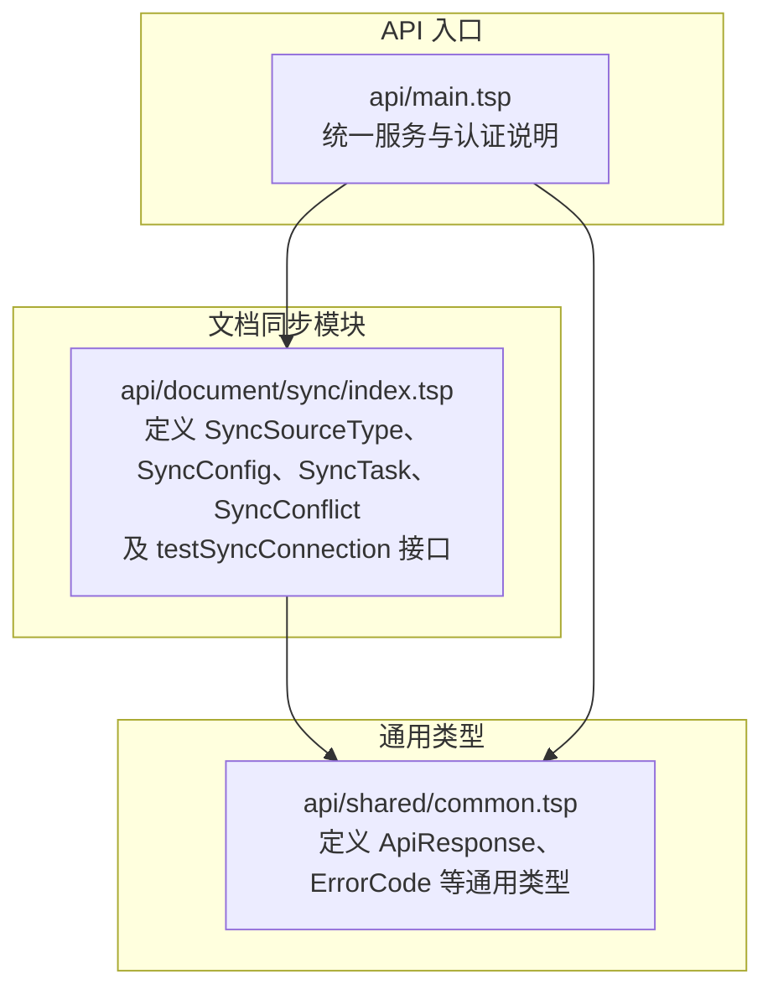
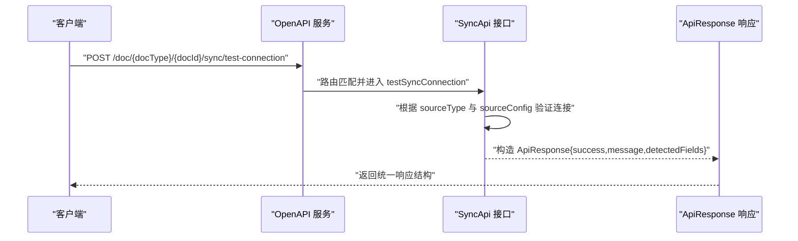
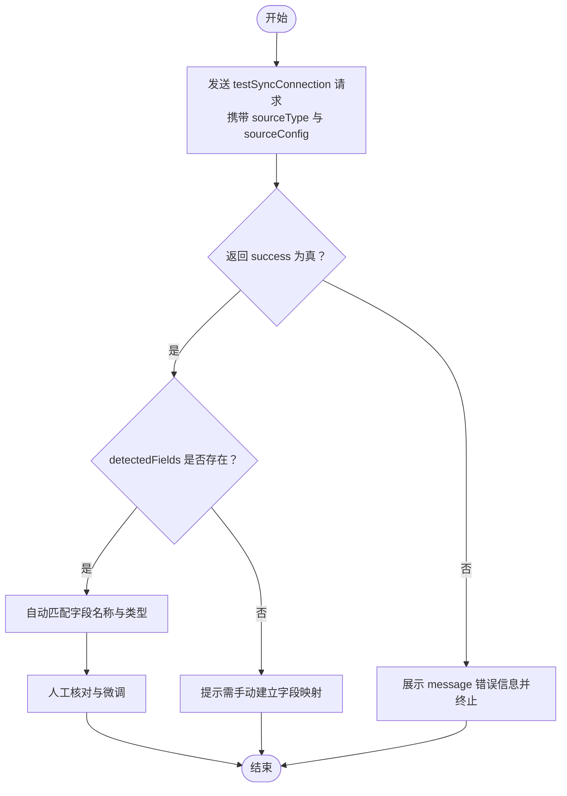
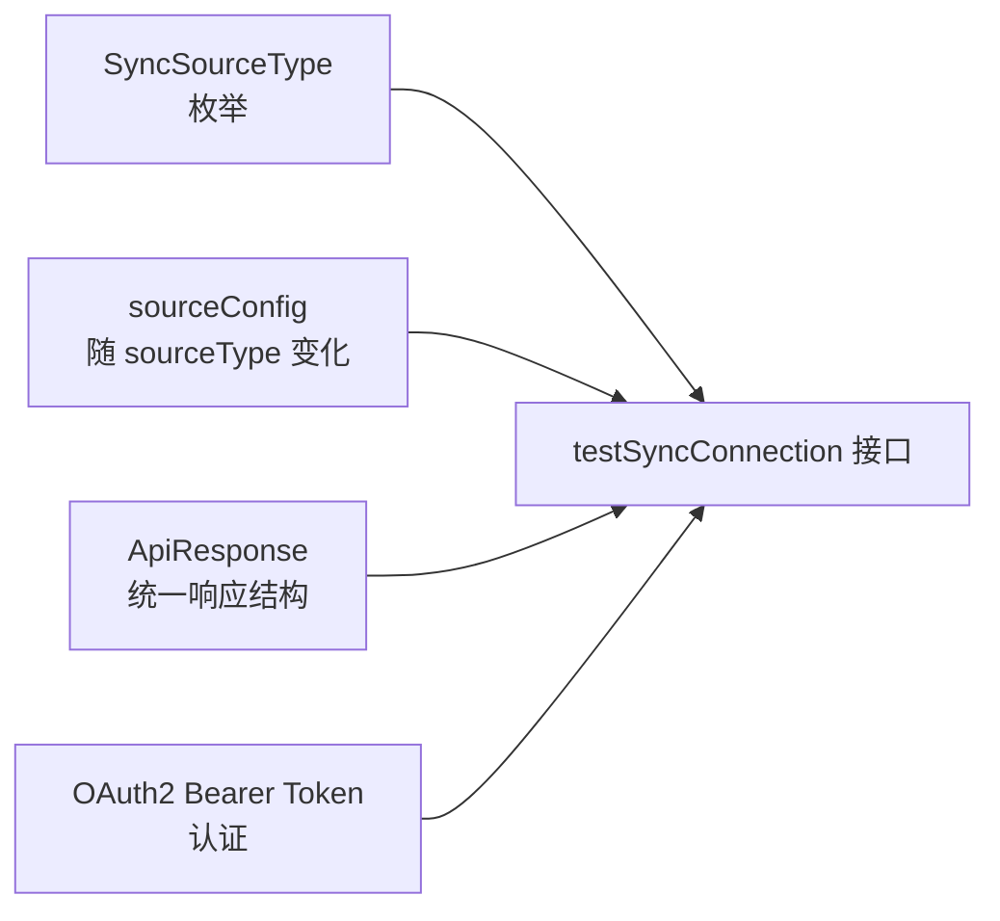

# 连接测试与验证

<cite>
**本文引用的文件**
- [api/document/sync/index.tsp](file://api/document/sync/index.tsp)
- [api/shared/common.tsp](file://api/shared/common.tsp)
- [api/main.tsp](file://api/main.tsp)
- [docs-src/guides/authentication.md](file://docs-src/guides/authentication.md)
</cite>

## 目录
1. [简介](#简介)
2. [项目结构](#项目结构)
3. [核心组件](#核心组件)
4. [架构总览](#架构总览)
5. [详细组件分析](#详细组件分析)
6. [依赖关系分析](#依赖关系分析)
7. [性能考量](#性能考量)
8. [故障排查指南](#故障排查指南)
9. [结论](#结论)

## 简介
本文件面向“nexusbook-api”的连接测试与验证，聚焦 testSyncConnection 接口的使用方法与行为说明。内容涵盖：
- 如何通过 sourceType 与 sourceConfig 测试与外部数据源的连通性
- 接口返回 success、message、detectedFields 的语义与用途
- detectedFields 如何辅助用户自动发现远程数据源的字段结构
- 在创建同步配置前进行预验证的作用
- 如何结合 OAuth2 认证令牌进行安全的连接测试

## 项目结构
围绕连接测试与验证的相关文件主要位于文档同步模块与通用响应类型定义中：
- 文档同步模块：定义了同步源类型、同步配置、同步任务、冲突处理以及 testSyncConnection 接口
- 通用响应类型：定义了统一的 ApiResponse 响应结构，确保所有接口返回一致的结构化错误与载荷

图表来源
- [api/document/sync/index.tsp](file://api/document/sync/index.tsp#L50-L823)
- [api/shared/common.tsp](file://api/shared/common.tsp#L153-L177)
- [api/main.tsp](file://api/main.tsp#L96-L111)

章节来源
- [api/document/sync/index.tsp](file://api/document/sync/index.tsp#L50-L823)
- [api/shared/common.tsp](file://api/shared/common.tsp#L153-L177)
- [api/main.tsp](file://api/main.tsp#L96-L111)

## 核心组件
- testSyncConnection 接口
  - 路由：POST /doc/{docType}/{docId}/sync/test-connection
  - 请求体：包含 sourceType 与 sourceConfig
  - 返回：ApiResponse，包含 success、message、detectedFields
- 同步源类型（SyncSourceType）
  - 支持 Google Sheets、Excel Online、CSV、JSON API、REST API、GraphQL API、数据库、Webhook、Airtable、Notion 等
- 通用响应结构（ApiResponse）
  - 统一 success、code、message、payload 字段，便于错误处理与调试

章节来源
- [api/document/sync/index.tsp](file://api/document/sync/index.tsp#L783-L823)
- [api/document/sync/index.tsp](file://api/document/sync/index.tsp#L50-L106)
- [api/shared/common.tsp](file://api/shared/common.tsp#L153-L177)

## 架构总览
下图展示了连接测试在整体 API 中的位置与调用关系：

图表来源
- [api/document/sync/index.tsp](file://api/document/sync/index.tsp#L783-L823)
- [api/shared/common.tsp](file://api/shared/common.tsp#L153-L177)

## 详细组件分析

### testSyncConnection 接口详解
- 接口位置与路由
  - 路径：/doc/{docType}/{docId}/sync/test-connection
  - 方法：POST
- 请求体字段
  - sourceType：同步源类型（枚举）
  - sourceConfig：针对不同 sourceType 的配置对象（类型为 unknown，具体结构随 sourceType 变化）
- 返回体字段
  - success：布尔值，表示连接测试是否成功
  - message：可选字符串，用于描述测试结果或错误信息
  - detectedFields：可选数组，包含 name 与 type 字段，用于自动发现远程数据源的字段结构
- 用途
  - 在创建同步配置前进行预验证，避免无效配置导致后续同步失败
  - 通过 detectedFields 辅助用户快速建立字段映射

章节来源
- [api/document/sync/index.tsp](file://api/document/sync/index.tsp#L783-L823)

### 同步源类型与配置要点
- 支持的源类型（部分列举）
  - google_sheets、excel_online、csv、json_api、rest_api、graphql_api、database、webhook、airtable、notion
- sourceConfig 的结构
  - 由于 sourceType 不同，sourceConfig 的字段与含义随之变化
  - 例如：Google Sheets 可能包含 spreadsheetId、sheetName；数据库可能包含主机、端口、库名、凭据等
- detectedFields 的作用
  - 当远端数据源具备可枚举的列/字段时，接口返回 detectedFields，帮助用户在创建同步配置时自动识别字段名称与类型，减少手工映射成本

章节来源
- [api/document/sync/index.tsp](file://api/document/sync/index.tsp#L50-L106)
- [api/document/sync/index.tsp](file://api/document/sync/index.tsp#L783-L823)

### 字段发现流程（算法思路）
下图展示基于 detectedFields 的字段发现与映射建议流程：

图表来源
- [api/document/sync/index.tsp](file://api/document/sync/index.tsp#L783-L823)

### Google Sheets 连接测试（示例流程）
- 请求
  - 方法：POST
  - 路径：/doc/{docType}/{docId}/sync/test-connection
  - 请求体：
    - sourceType：google_sheets
    - sourceConfig：包含 spreadsheetId、sheetName 等必要字段
- 响应
  - success：true/false
  - message：连接状态或错误说明
  - detectedFields：若可用，返回远程工作表的字段清单（name、type）

章节来源
- [api/document/sync/index.tsp](file://api/document/sync/index.tsp#L50-L106)
- [api/document/sync/index.tsp](file://api/document/sync/index.tsp#L783-L823)

### 数据库连接测试（示例流程）
- 请求
  - 方法：POST
  - 路径：/doc/{docType}/{docId}/sync/test-connection
  - 请求体：
    - sourceType：database
    - sourceConfig：包含主机、端口、数据库名、用户名、密码等连接信息
- 响应
  - success：true/false
  - message：连接状态或错误说明
  - detectedFields：若远端表具备可枚举列，返回字段清单（name、type）

章节来源
- [api/document/sync/index.tsp](file://api/document/sync/index.tsp#L50-L106)
- [api/document/sync/index.tsp](file://api/document/sync/index.tsp#L783-L823)

### OAuth2 认证与安全
- 认证方式
  - 所有 API 请求需在请求头中携带 Bearer Token
  - 支持客户端凭证流程与授权码流程
- 在连接测试中的应用
  - 使用 OAuth2 获取 access_token 后，在请求头中附带 Authorization: Bearer <access_token>
  - 对于需要第三方授权的数据源（如 Google Sheets），确保令牌具有相应范围与权限

章节来源
- [api/main.tsp](file://api/main.tsp#L60-L84)
- [docs-src/guides/authentication.md](file://docs-src/guides/authentication.md#L44-L91)
- [docs-src/guides/authentication.md](file://docs-src/guides/authentication.md#L120-L169)

## 依赖关系分析
- testSyncConnection 依赖
  - 同步源类型定义（SyncSourceType）决定 sourceConfig 的结构
  - 通用响应类型（ApiResponse）保证返回结构一致
  - 认证层（Bearer Token）保障接口访问安全

图表来源
- [api/document/sync/index.tsp](file://api/document/sync/index.tsp#L50-L106)
- [api/document/sync/index.tsp](file://api/document/sync/index.tsp#L783-L823)
- [api/shared/common.tsp](file://api/shared/common.tsp#L153-L177)
- [api/main.tsp](file://api/main.tsp#L60-L84)

章节来源
- [api/document/sync/index.tsp](file://api/document/sync/index.tsp#L50-L106)
- [api/document/sync/index.tsp](file://api/document/sync/index.tsp#L783-L823)
- [api/shared/common.tsp](file://api/shared/common.tsp#L153-L177)
- [api/main.tsp](file://api/main.tsp#L60-L84)

## 性能考量
- 连接测试应尽量轻量，避免对远端数据源造成压力
- 对于数据库与 API 类源，建议在测试阶段限制扫描范围或使用最小样本集
- detectedFields 的返回有助于减少后续同步过程中的字段探测开销

## 故障排查指南
- 常见问题与定位
  - 认证失败：确认 Authorization 头是否正确携带 Bearer Token
  - sourceType 与 sourceConfig 不匹配：检查 sourceType 与 sourceConfig 字段是否对应
  - 远端连接异常：查看 message 中的错误描述，确认网络、凭据、权限等
- 建议流程
  - 先以最小配置进行测试（如仅提供必要字段）
  - 若返回 success=false，优先根据 message 定位问题
  - 若返回 success=true 且 detectedFields 缺失，尝试调整 sourceConfig 或检查远端可见性

章节来源
- [api/shared/common.tsp](file://api/shared/common.tsp#L153-L177)
- [api/document/sync/index.tsp](file://api/document/sync/index.tsp#L783-L823)

## 结论
- testSyncConnection 是在创建同步配置前进行预验证的关键接口
- 通过 sourceType 与 sourceConfig，可以覆盖多种外部数据源的连接测试
- detectedFields 能显著降低字段映射成本，提升配置效率
- 结合 OAuth2 认证令牌，可确保连接测试的安全性与合规性