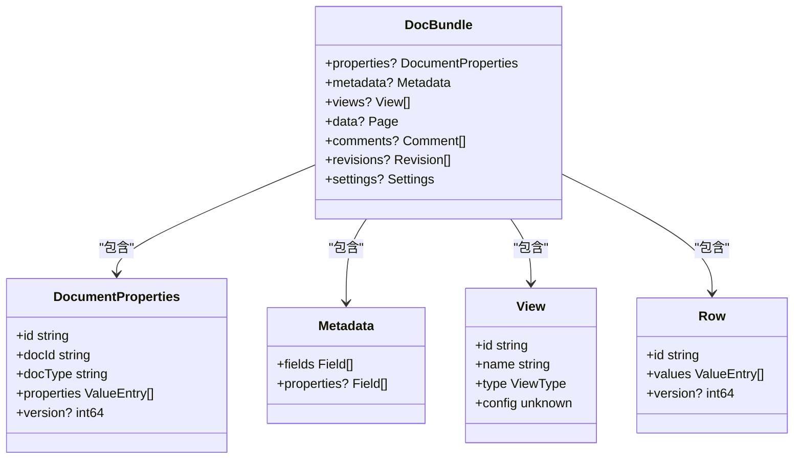
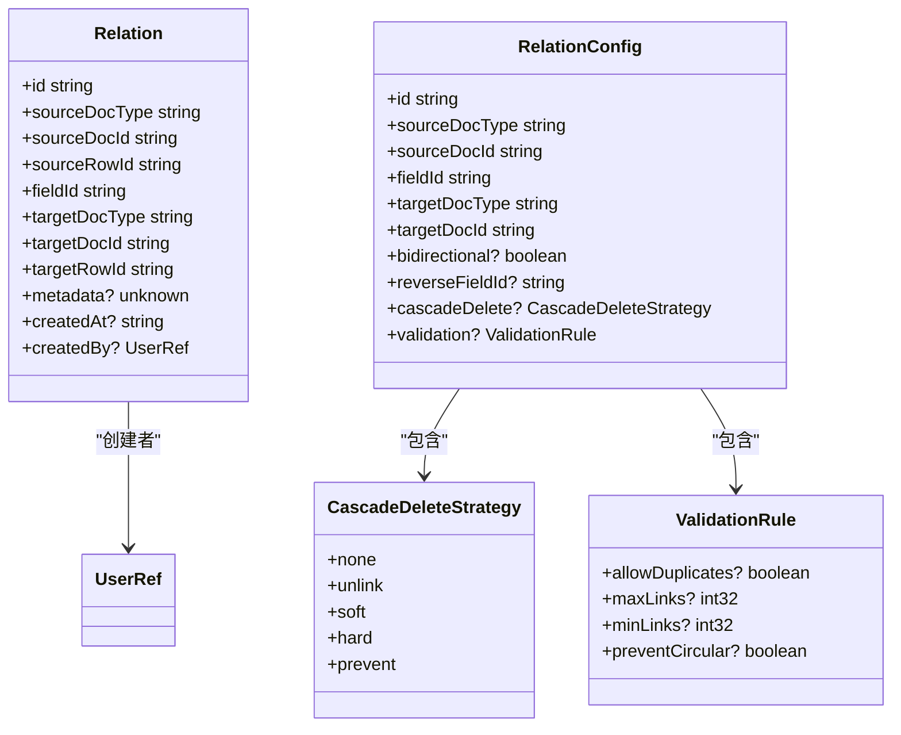
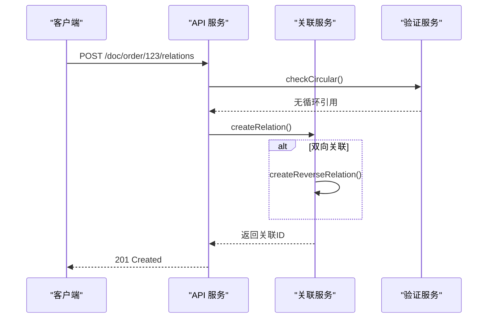
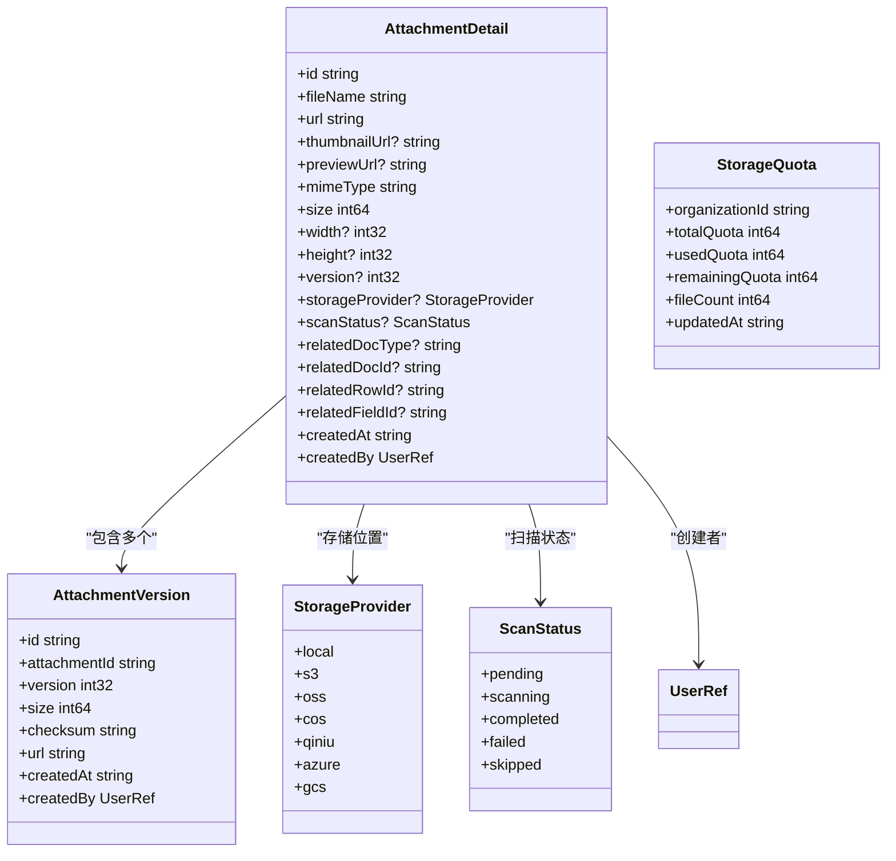
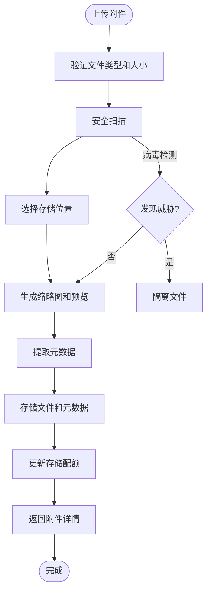
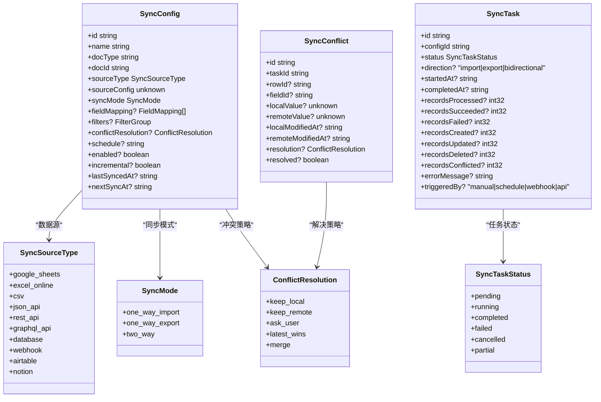
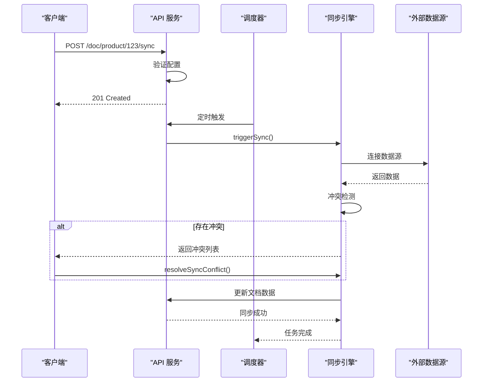

# 数据操作

<cite>
**本文档引用文件**  
- [index.tsp](file://api/document/index.tsp)
- [aggregate/index.tsp](file://api/document/aggregate/index.tsp)
- [relations/index.tsp](file://api/document/relations/index.tsp)
- [attachments/index.tsp](file://api/document/attachments/index.tsp)
- [sync/index.tsp](file://api/document/sync/index.tsp)
- [core/index.tsp](file://api/document/core/index.tsp)
- [shared/common.tsp](file://api/shared/common.tsp)
</cite>

## 目录
1. [引言](#引言)
2. [聚合查询](#聚合查询)
3. [跨文档关联](#跨文档关联)
4. [附件管理](#附件管理)
5. [数据同步](#数据同步)
6. [最佳实践](#最佳实践)
7. [结论](#结论)

## 引言

nexusbook-api 提供了一套完整的高级数据操作架构，支持复杂的聚合查询、跨文档关联、附件管理和数据同步功能。该系统通过 DocBundle 机制优化客户端性能，允许通过 `include` 参数一次性获取多个层次的数据。核心设计原则包括：数据一致性、性能优化、权限控制和可扩展性。

系统采用模块化设计，各功能模块独立但协同工作，确保了高内聚低耦合的架构特性。所有数据操作都遵循统一的 API 风格和错误处理机制，提供一致的开发体验。

**Section sources**
- [index.tsp](file://api/document/index.tsp#L1-L31)

## 聚合查询

### DocBundle 机制

聚合查询模块通过 `DocBundle` 模型实现高效的数据获取。客户端可以通过 `include` 参数指定需要返回的数据部分，从而避免多次请求，显著提升性能。

`DocBundle` 模型包含以下可选组件：
- **properties**: 文档属性（如订单时间、门店、金额等）
- **metadata**: 文档元数据（字段定义、显示配置）
- **views**: 视图列表
- **data**: 数据分页结果
- **comments**: 评论集合
- **revisions**: 修订记录
- **settings**: 文档设置



**Diagram sources**
- [aggregate/index.tsp](file://api/document/aggregate/index.tsp#L48-L90)
- [core/metadata.tsp](file://api/document/core/metadata.tsp#L160-L181)
- [core/data.tsp](file://api/document/core/data.tsp#L248-L311)
- [shared/common.tsp](file://api/shared/common.tsp#L544-L561)

### 聚合查询接口

聚合查询通过 `GET /doc/{docType}/{docId}` 接口提供，支持以下参数：

| 参数 | 类型 | 描述 |
|------|------|------|
| include | string | 指定返回的数据部分，逗号分隔（metadata,views,data,comments,revisions,settings） |
| viewId | string | 指定特定视图进行数据查询 |
| page | int32 | 分页页码 |
| pageSize | int32 | 每页数量 |
| commentsLimit | int32 | 评论数量限制 |
| revisionsLimit | int32 | 修订记录数量限制 |

**示例请求：**
```bash
curl -H 'Authorization: Bearer TOKEN' \
  'https://open.nexusbook.com/api/v1/doc/product/123?include=metadata,views,data&page=1&pageSize=20'
```

该接口通过减少网络往返次数，显著提升了客户端渲染性能，特别是在移动网络环境下效果更为明显。

**Section sources**
- [aggregate/index.tsp](file://api/document/aggregate/index.tsp#L92-L126)

## 跨文档关联

### Relation 边模型设计

nexusbook-api 的关联系统采用"边模型"（Edge Model）设计，将关联关系作为一等公民独立存储。这种设计支持文档↔文档、行↔行等多粒度关联，具备以下特性：

- **双向查询**: 支持从任意一端查询关联关系
- **级联策略**: 提供多种级联删除策略
- **权限控制**: 基于文档权限的关联访问控制
- **循环检测**: 防止循环引用
- **批量操作**: 支持批量创建和删除关联



**Diagram sources**
- [relations/index.tsp](file://api/document/relations/index.tsp#L188-L254)
- [relations/index.tsp](file://api/document/relations/index.tsp#L50-L146)
- [relations/index.tsp](file://api/document/relations/index.tsp#L152-L182)
- [shared/common.tsp](file://api/shared/common.tsp#L451-L487)

### 关联操作接口

关联模块提供完整的 CRUD 操作接口：



**核心接口：**
- `POST /doc/{docType}/{docId}/relations`: 创建关联关系
- `GET /doc/{docType}/{docId}/relations`: 列出所有关联
- `DELETE /doc/{docType}/{docId}/relations/{relationId}`: 删除关联
- `POST /doc/{docType}/{docId}/relations/check-circular`: 检查循环引用

**级联删除策略：**
- **none**: 不级联
- **unlink**: 仅删除关联关系
- **soft**: 软删除关联记录
- **hard**: 硬删除关联记录
- **prevent**: 阻止删除（如果有关联）

**Section sources**
- [relations/index.tsp](file://api/document/relations/index.tsp#L280-L526)

## 附件管理

### 附件系统集成

附件管理模块与核心数据模型深度集成，支持在数据行和文档属性中使用附件。系统提供完整的生命周期管理，包括上传、版本控制、安全扫描和存储配额管理。



**Diagram sources**
- [attachments/index.tsp](file://api/document/attachments/index.tsp#L47-L269)
- [attachments/index.tsp](file://api/document/attachments/index.tsp#L356-L409)
- [attachments/index.tsp](file://api/document/attachments/index.tsp#L415-L451)
- [attachments/index.tsp](file://api/document/attachments/index.tsp#L275-L313)
- [attachments/index.tsp](file://api/document/attachments/index.tsp#L316-L350)

### 附件操作流程



**核心功能：**
- **多格式支持**: 支持图片、文档、音视频等多种文件格式
- **自动预览**: 自动生成缩略图和预览图
- **版本历史**: 保留所有历史版本
- **安全扫描**: 集成病毒和恶意内容检测
- **存储配额**: 组织级别的存储限额管理
- **访问控制**: 基于权限的附件访问

**Section sources**
- [attachments/index.tsp](file://api/document/attachments/index.tsp#L453-L752)

## 数据同步

### 同步架构设计

Sync 模块提供与外部数据源的双向同步功能，支持定时同步、冲突处理和增量同步。系统采用事件驱动架构，确保数据一致性。



**Diagram sources**
- [sync/index.tsp](file://api/document/sync/index.tsp#L214-L360)
- [sync/index.tsp](file://api/document/sync/index.tsp#L366-L474)
- [sync/index.tsp](file://api/document/sync/index.tsp#L480-L558)
- [sync/index.tsp](file://api/document/sync/index.tsp#L54-L106)
- [sync/index.tsp](file://api/document/sync/index.tsp#L112-L130)
- [sync/index.tsp](file://api/document/sync/index.tsp#L136-L166)
- [sync/index.tsp](file://api/document/sync/index.tsp#L172-L208)
- [shared/common.tsp](file://api/shared/common.tsp#L272-L295)

### 同步工作流程



**同步模式：**
- **单向导入**: 从外部源导入数据到 NexusBook
- **单向导出**: 从 NexusBook 导出数据到外部系统
- **双向同步**: 保持 NexusBook 与外部系统数据一致

**冲突解决策略：**
- **keep_local**: 保留本地数据
- **keep_remote**: 保留远程数据
- **ask_user**: 询问用户选择
- **latest_wins**: 最新修改胜出
- **merge**: 合并数据

**Section sources**
- [sync/index.tsp](file://api/document/sync/index.tsp#L560-L824)

## 最佳实践

### 复杂查询示例

**聚合查询示例：**
```bash
# 获取订单的完整信息包
curl -H 'Authorization: Bearer TOKEN' \
  'https://open.nexusbook.com/api/v1/doc/purchaseOrder/123?include=metadata,views,data,comments,revisions'
```

**结构化查询示例：**
```bash
# 查询价格大于100的产品
curl -X POST 'https://open.nexusbook.com/api/v1/doc/product/123/data/query' \
  -H 'Authorization: Bearer TOKEN' \
  -H 'Content-Type: application/json' \
  -d '{
    "filters": {
      "logic": "and",
      "conditions": [
        {"field": "price", "operator": "range", "rangeStart": 100}
      ]
    },
    "sorts": [{"field": "price", "direction": "desc"}],
    "page": 1,
    "pageSize": 20
  }'
```

### 关系图谱构建

**构建订单-产品关系图谱：**
```bash
# 创建订单与产品的关联
curl -X POST 'https://open.nexusbook.com/api/v1/doc/order/123/relations' \
  -H 'Authorization: Bearer TOKEN' \
  -d '{
    "targetDocType": "product",
    "targetDocId": "456",
    "targetRowId": "row-1",
    "fieldId": "products",
    "reverseFieldId": "orders",
    "bidirectional": true
  }'

# 查询订单的所有产品
curl 'https://open.nexusbook.com/api/v1/doc/order/123/relations?targetDocType=product'
```

### 批量操作示例

**批量更新数据：**
```bash
# 批量更新多个产品的价格
curl -X POST 'https://open.nexusbook.com/api/v1/doc/product/123/data/bulk' \
  -H 'Authorization: Bearer TOKEN' \
  -H 'Content-Type: application/json' \
  -d '[
    {
      "target": {"rows": ["row-1", "row-2", "row-3"], "field": "price"},
      "value": [99.99, 88.88, 77.77]
    },
    {
      "target": {"property": "totalAmount"},
      "value": 266.75
    }
  ]'
```

**批量创建关联：**
```bash
# 批量创建多个关联
curl -X POST 'https://open.nexusbook.com/api/v1/doc/order/123/relations/batch' \
  -H 'Authorization: Bearer TOKEN' \
  -H 'Content-Type: application/json' \
  -d '[
    {
      "sourceRowId": "row-1",
      "fieldId": "products",
      "targetDocType": "product",
      "targetDocId": "456",
      "targetRowId": "row-2"
    },
    {
      "sourceRowId": "row-1",
      "fieldId": "products",
      "targetDocType": "product",
      "targetDocId": "789",
      "targetRowId": "row-3"
    }
  ]'
```

**Section sources**
- [aggregate/index.tsp](file://api/document/aggregate/index.tsp#L108-L112)
- [data.tsp](file://api/document/core/data.tsp#L495-L542)
- [relations/index.tsp](file://api/document/relations/index.tsp#L404-L446)

## 结论

nexusbook-api 的数据操作架构通过精心设计的模块化系统，提供了强大的聚合查询、跨文档关联、附件管理和数据同步能力。DocBundle 机制通过 `include` 参数优化了客户端性能，减少了网络请求次数。Relation 边模型作为一等公民独立存储，支持文档↔文档、行↔行等多粒度关联，具备双向查询、级联策略和权限控制等高级特性。

附件管理系统与核心数据模型深度集成，提供完整的生命周期管理。Sync 模块通过事件驱动架构确保数据一致性，支持多种外部数据源和复杂的冲突解决策略。整个系统设计注重性能、安全性和可扩展性，为构建复杂的企业级应用提供了坚实的基础。