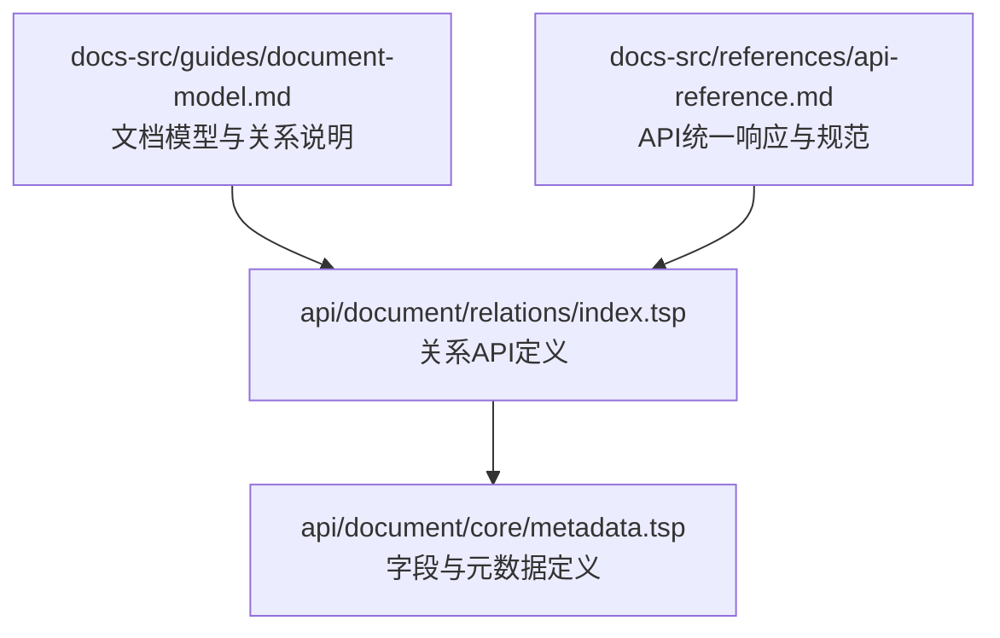
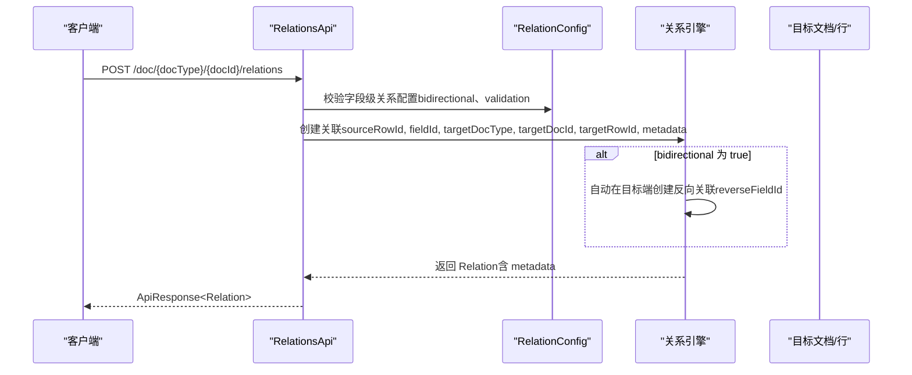
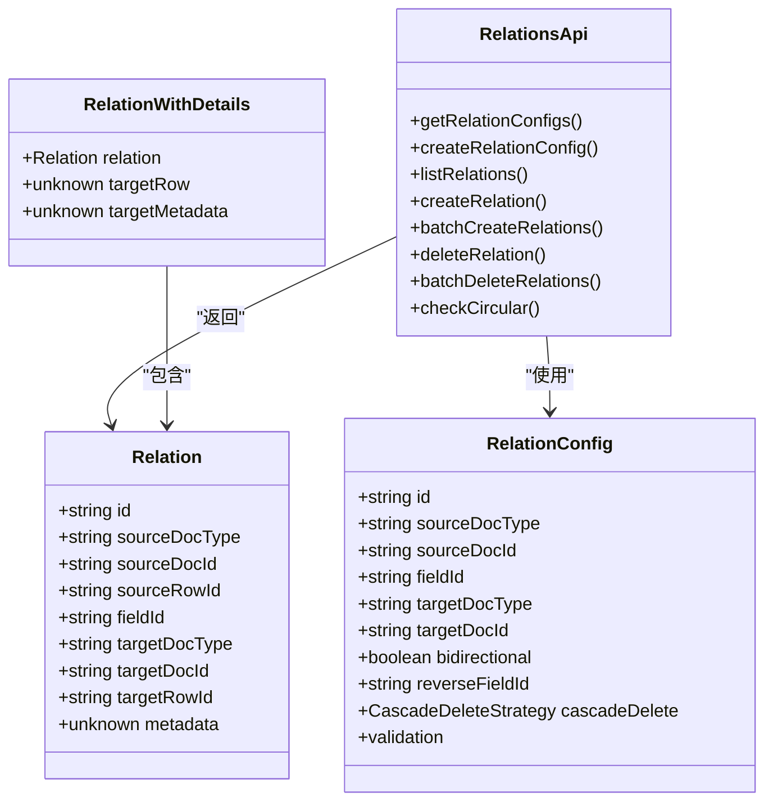

# 关联关系创建

<cite>
**本文引用的文件**
- [api/document/relations/index.tsp](file://api/document/relations/index.tsp)
- [api/document/core/metadata.tsp](file://api/document/core/metadata.tsp)
- [docs-src/guides/document-model.md](file://docs-src/guides/document-model.md)
- [docs-src/references/api-reference.md](file://docs-src/references/api-reference.md)
</cite>

## 目录
1. [简介](#简介)
2. [项目结构](#项目结构)
3. [核心组件](#核心组件)
4. [架构概览](#架构概览)
5. [详细组件分析](#详细组件分析)
6. [依赖分析](#依赖分析)
7. [性能考虑](#性能考虑)
8. [故障排查指南](#故障排查指南)
9. [结论](#结论)
10. [附录](#附录)

## 简介
本文件聚焦 nexusbook-api 的“关联关系创建”能力，围绕 createRelation 与 batchCreateRelations 两大核心 API，系统阐述：
- 如何在两个文档行之间建立关联，关键参数 sourceRowId、targetRowId、fieldId 的使用方法
- 当 bidirectional 为 true 时，系统如何自动在目标端创建反向关联
- metadata 字段的灵活数据存储能力，可用于存储关联的附加信息（如数量、权重等）
- 一对多与多对多的实际示例，以及 cURL 调用方式
- batchCreateRelations 的使用、原子性保证与部分失败处理机制

## 项目结构
与关联关系创建相关的核心文件位于文档模块下的 relations 子模块，同时 metadata 定义了字段类型与元数据结构，为关系的语义与验证提供基础。



图表来源
- [api/document/relations/index.tsp](file://api/document/relations/index.tsp#L280-L525)
- [api/document/core/metadata.tsp](file://api/document/core/metadata.tsp#L160-L210)
- [docs-src/guides/document-model.md](file://docs-src/guides/document-model.md#L588-L695)
- [docs-src/references/api-reference.md](file://docs-src/references/api-reference.md#L1-L60)

章节来源
- [api/document/relations/index.tsp](file://api/document/relations/index.tsp#L280-L525)
- [api/document/core/metadata.tsp](file://api/document/core/metadata.tsp#L160-L210)
- [docs-src/guides/document-model.md](file://docs-src/guides/document-model.md#L588-L695)
- [docs-src/references/api-reference.md](file://docs-src/references/api-reference.md#L1-L60)

## 核心组件
- 关系配置 RelationConfig：定义字段级的关联规则，包括 bidirectional、reverseFieldId、validation 等
- 关系实例 Relation：表示具体的关联边，包含源/目标文档与行标识，以及可选 metadata
- 关系查询结果 RelationWithDetails：支持返回目标行与目标文档元数据
- 关系API接口 RelationsApi：提供 createRelation、batchCreateRelations、listRelations、deleteRelation、checkCircular 等端点

章节来源
- [api/document/relations/index.tsp](file://api/document/relations/index.tsp#L46-L182)
- [api/document/relations/index.tsp](file://api/document/relations/index.tsp#L184-L278)
- [api/document/relations/index.tsp](file://api/document/relations/index.tsp#L280-L525)

## 架构概览
下图展示了 createRelation 与 batchCreateRelations 的端到端交互，以及与关系配置的关系。



图表来源
- [api/document/relations/index.tsp](file://api/document/relations/index.tsp#L299-L446)

章节来源
- [api/document/relations/index.tsp](file://api/document/relations/index.tsp#L299-L446)

## 详细组件分析

### createRelation API 使用指南
- 功能：在两个文档行之间创建关联。若配置为双向关联，则自动在目标端创建反向关联。
- 请求路径：POST /api/v1/doc/{docType}/{docId}/relations
- 请求体关键字段
  - sourceRowId：源文档行ID
  - fieldId：源字段ID（必须与 RelationConfig 中的 fieldId 对应）
  - targetDocType：目标文档类型
  - targetDocId：目标文档ID
  - targetRowId：目标文档行ID
  - metadata：可选，用于存储关联的附加信息（如数量、权重、备注等）
- 返回：ApiResponse<Relation>
- 双向关联行为
  - 若 RelationConfig.bidirectional 为 true，且配置了 reverseFieldId，则系统会在目标端自动创建一条反向关联，方向从目标到源
- metadata 的灵活存储
  - metadata 类型为 unknown，可存放任意结构化数据，例如数量、权重、时间戳、来源系统标识等
  - 该字段不参与关系引擎的强制约束，但可用于上层业务逻辑与查询

cURL 示例（一对多：订单-产品）
```bash
curl -X POST 'https://open.nexusbook.com/api/v1/doc/order/123/relations' \
  -H 'Authorization: Bearer YOUR_TOKEN' \
  -H 'Content-Type: application/json' \
  -d '{
    "sourceRowId": "row-order-1",
    "fieldId": "products",
    "targetDocType": "product",
    "targetDocId": "prod-456",
    "targetRowId": "row-product-1",
    "metadata": {"quantity": 10, "unitPrice": 99.99}
  }'
```

cURL 示例（多对多：项目-成员）
```bash
curl -X POST 'https://open.nexusbook.com/api/v1/doc/project/789/relations' \
  -H 'Authorization: Bearer YOUR_TOKEN' \
  -H 'Content-Type: application/json' \
  -d '{
    "sourceRowId": "row-project-1",
    "fieldId": "members",
    "targetDocType": "user",
    "targetDocId": "user-abc",
    "targetRowId": "row-user-1",
    "metadata": {"role": "developer", "joinedAt": "2024-12-01"}
  }'
```

章节来源
- [api/document/relations/index.tsp](file://api/document/relations/index.tsp#L337-L401)
- [api/document/relations/index.tsp](file://api/document/relations/index.tsp#L299-L335)
- [docs-src/references/api-reference.md](file://docs-src/references/api-reference.md#L1-L60)

### 关系配置 RelationConfig
- bidirectional：是否启用双向关联
- reverseFieldId：双向关联时的目标端字段ID
- validation：验证规则，包括 allowDuplicates、maxLinks、minLinks、preventCircular 等
- cascadeDelete：级联删除策略（none、unlink、soft、hard、prevent）

章节来源
- [api/document/relations/index.tsp](file://api/document/relations/index.tsp#L46-L182)

### 关系实例 Relation 与 metadata
- Relation 包含源/目标文档与行标识，以及可选 metadata
- metadata 支持任意结构，适合存放数量、权重、来源系统、时间戳等

章节来源
- [api/document/relations/index.tsp](file://api/document/relations/index.tsp#L184-L254)
- [api/document/core/metadata.tsp](file://api/document/core/metadata.tsp#L160-L181)

### batchCreateRelations 批量创建
- 功能：一次性创建多个关联关系
- 请求体：数组，元素包含 sourceRowId、fieldId、targetDocType、targetDocId、targetRowId、metadata
- 返回：ApiResponse<{ created: int32; relations: Relation[]; failures?: { index: int32; reason: string }[] }>
- 原子性与部分失败
  - 批量创建通常以事务方式执行，要么全部成功，要么全部回滚
  - 若部分失败，返回 failures 数组，其中包含失败项的索引与原因，以便客户端定位问题并重试

cURL 示例（批量创建）
```bash
curl -X POST 'https://open.nexusbook.com/api/v1/doc/order/123/relations/batch' \
  -H 'Authorization: Bearer YOUR_TOKEN' \
  -H 'Content-Type: application/json' \
  -d '[
    {
      "sourceRowId": "row-order-1",
      "fieldId": "products",
      "targetDocType": "product",
      "targetDocId": "prod-456",
      "targetRowId": "row-product-1",
      "metadata": {"quantity": 10}
    },
    {
      "sourceRowId": "row-order-1",
      "fieldId": "products",
      "targetDocType": "product",
      "targetDocId": "prod-789",
      "targetRowId": "row-product-2",
      "metadata": {"quantity": 5}
    }
  ]'
```

章节来源
- [api/document/relations/index.tsp](file://api/document/relations/index.tsp#L403-L446)
- [docs-src/references/api-reference.md](file://docs-src/references/api-reference.md#L1-L60)

### 关系模型与文档模型
- 文档模型将“边（Edge）”独立存储，便于查询与治理
- metadata 支持辅助信息（权重、标签、备注等），用于增强关系的语义与业务用途

章节来源
- [docs-src/guides/document-model.md](file://docs-src/guides/document-model.md#L588-L695)

## 依赖分析
- RelationsApi 依赖 RelationConfig 与 Relation 模型
- RelationConfig 的 bidirectional 与 reverseFieldId 决定是否触发反向关联
- Relation.metadata 与 RelationWithDetails.targetMetadata 为上层业务提供灵活扩展
- API 统一响应结构 ApiResponse<T> 保证错误码与多语言消息的一致性



图表来源
- [api/document/relations/index.tsp](file://api/document/relations/index.tsp#L46-L182)
- [api/document/relations/index.tsp](file://api/document/relations/index.tsp#L184-L278)
- [api/document/relations/index.tsp](file://api/document/relations/index.tsp#L280-L525)

章节来源
- [api/document/relations/index.tsp](file://api/document/relations/index.tsp#L46-L182)
- [api/document/relations/index.tsp](file://api/document/relations/index.tsp#L184-L278)
- [api/document/relations/index.tsp](file://api/document/relations/index.tsp#L280-L525)

## 性能考虑
- 批量创建：优先使用 batchCreateRelations，减少网络往返与事务开销
- metadata 精简：避免在 metadata 中存放过大的结构，以免影响序列化与传输
- 验证前置：通过 RelationConfig.validation 预先限制重复与数量，降低运行期失败概率
- 分页查询：使用 listRelations 的分页参数，避免一次性拉取大量关系

## 故障排查指南
- 常见错误与定位
  - DOC_NOT_FOUND：确认 docType 与 docId 是否正确
  - FIELD_NOT_FOUND：确认 fieldId 是否存在于 RelationConfig 中
  - INVALID_TARGET：确认 targetDocType/targetDocId/targetRowId 是否有效
  - CIRCULAR_REFERENCE：使用 checkCircular 接口检测循环引用
- 失败重试
  - 对于 batchCreateRelations，关注 failures 数组，按 index 定位失败项并修正后再重试
- 响应格式
  - 所有 API 返回统一 ApiResponse<T>，失败时包含 code 与 message（多语言）

章节来源
- [docs-src/references/api-reference.md](file://docs-src/references/api-reference.md#L1-L60)
- [api/document/relations/index.tsp](file://api/document/relations/index.tsp#L491-L525)

## 结论
- createRelation 提供细粒度的关系创建能力，结合 RelationConfig 的 bidirectional 与 reverseFieldId，可轻松实现双向关联
- metadata 为关系提供了灵活的扩展空间，适合承载业务上下文信息
- batchCreateRelations 在性能与一致性方面表现优异，配合 failures 机制便于故障定位与重试
- 建议在实际项目中：
  - 明确字段级关系配置（bidirectional、validation）
  - 合理使用 metadata 存储必要信息
  - 优先采用批量创建与分页查询
  - 使用 checkCircular 预防循环引用

## 附录
- 一对多示例：订单-产品
  - 源：订单文档行
  - 目标：产品文档行
  - 字段：products
  - metadata：quantity、unitPrice 等
- 多对多示例：项目-成员
  - 源：项目文档行
  - 目标：用户文档行
  - 字段：members
  - metadata：role、joinedAt 等

章节来源
- [api/document/relations/index.tsp](file://api/document/relations/index.tsp#L337-L401)
- [docs-src/guides/document-model.md](file://docs-src/guides/document-model.md#L588-L695)