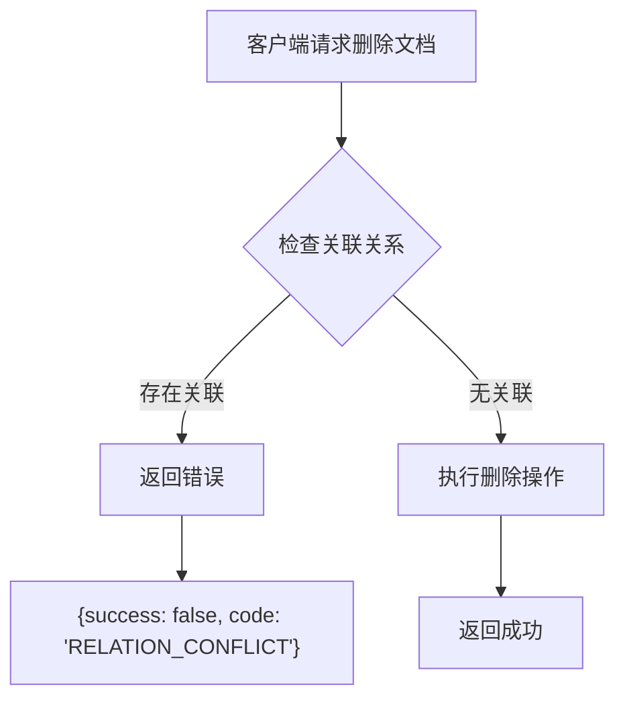

# 关联关系删除

<cite>
**本文档引用的文件**   
- [index.tsp](file://api/document/relations/index.tsp)
- [document-model.md](file://docs-src/guides/document-model.md)
- [data-operations.md](file://docs-src/guides/data-operations.md)
- [examples.md](file://docs-src/guides/examples.md)
- [api-reference.md](file://docs-src/references/api-reference.md)
</cite>

## 目录
1. [简介](#简介)
2. [单个关联删除](#单个关联删除)
3. [批量关联删除](#批量关联删除)
4. [级联删除策略](#级联删除策略)
5. [使用场景示例](#使用场景示例)
6. [API响应与统计](#api响应与统计)

## 简介
nexusbook-api 提供了强大的关联关系管理功能，支持在文档之间建立和维护复杂的关系网络。本指南详细说明了如何使用 `deleteRelation` 和 `batchDeleteRelations` API 来删除关联关系，包括在双向关联中自动同步删除反向关联的机制，以及在不同 `cascadeDelete` 策略下的行为差异。

关联关系是连接不同文档或数据行的“边”，用于构建可导航的业务图谱。系统支持一对多、多对多等多种关系类型，并通过级联删除策略确保数据的引用完整性。

**Section sources**
- [index.tsp](file://api/document/relations/index.tsp#L8-L27)
- [document-model.md](file://docs-src/guides/document-model.md#L589-L594)

## 单个关联删除
`deleteRelation` API 允许您根据 `relationId` 删除指定的关联关系。这是删除单个关联的最直接方法。

### API 详情
- **端点**: `DELETE /api/v1/doc/{docType}/{docId}/relations/{relationId}`
- **功能**: 删除指定的关联关系。
- **特殊行为**: 如果该关联是双向关联（`bidirectional: true`），系统会自动查找并删除对应的反向关联。

### 使用示例
以下示例展示了如何删除一个订单与产品之间的关联。

```bash
curl -X DELETE 'https://open.nexusbook.com/api/v1/doc/order/123/relations/rel-789' \
  -H 'Authorization: Bearer YOUR_ACCESS_TOKEN'
```

在此操作中：
1.  客户端发起 `DELETE` 请求，指定文档类型 (`order`)、文档ID (`123`) 和要删除的关联ID (`rel-789`)。
2.  服务端接收到请求后，首先查找ID为 `rel-789` 的关联。
3.  系统检查该关联的配置，确认其 `bidirectional` 属性为 `true`。
4.  服务端自动查询并删除从产品文档指向订单文档的反向关联。
5.  两个关联关系（正向和反向）均被成功移除。

此机制确保了双向关联的完整性，避免了“悬挂”关系的产生。

**Section sources**
- [index.tsp](file://api/document/relations/index.tsp#L448-L464)

## 批量关联删除
`batchDeleteRelations` API 允许您根据一组条件批量删除多个关联关系，极大地提高了操作效率。

### API 详情
- **端点**: `DELETE /api/v1/doc/{docType}/{docId}/relations/batch`
- **功能**: 根据查询参数批量删除符合条件的关联关系。
- **查询参数**:
    - `sourceRowId`: 源数据行ID。
    - `fieldId`: 源字段ID。
    - `targetDocType`: 目标文档类型。
    - `targetRowId`: 目标数据行ID。

### 使用示例
以下示例展示了如何批量清除项目中的所有成员。

```bash
curl -X DELETE 'https://open.nexusbook.com/api/v1/doc/project/456/relations/batch?fieldId=members' \
  -H 'Authorization: Bearer YOUR_ACCESS_TOKEN'
```

在此操作中：
1.  客户端发起 `DELETE` 请求到 `/batch` 端点。
2.  通过 `fieldId=members` 参数，系统会定位到项目文档 (`project/456`) 中所有通过 `members` 字段建立的关联。
3.  服务端会删除所有匹配的关联关系，从而一次性将所有成员从项目中移除。

另一个常见场景是删除订单中某个特定产品的所有关联：

```bash
curl -X DELETE 'https://open.nexusbook.com/api/v1/doc/order/123/relations/batch?targetDocType=product&targetDocId=prod-789' \
  -H 'Authorization: Bearer YOUR_ACCESS_TOKEN'
```

此请求将删除订单 `123` 中所有指向产品 `prod-789` 的关联。

**Section sources**
- [index.tsp](file://api/document/relations/index.tsp#L466-L483)

## 级联删除策略
级联删除策略（`cascadeDelete`）定义了当删除一个文档或数据行时，其关联关系应如何处理。该策略在创建关联配置时定义，并对删除操作产生重要影响。

### 策略类型
| 策略 | 说明 |
| :--- | :--- |
| `none` | 不进行任何级联操作。仅删除文档/行本身，关联关系保持不变。 |
| `unlink` | 仅删除关联关系。这是删除操作的默认行为，会移除所有指向被删除实体的关联。 |
| `soft` | 软删除关联记录。将关联标记为已删除，但保留在数据库中以供审计。 |
| `hard` | 硬删除关联记录。永久性地从数据库中移除关联记录。 |
| `prevent` | 阻止删除。如果存在任何关联关系，则阻止删除操作并返回错误。 |

### `prevent` 策略详解
`prevent` 策略是一种保护性机制，用于防止意外删除关键实体。



**Diagram sources**
- [document-model.md](file://docs-src/guides/document-model.md#L644-L645)

当一个文档配置了 `cascadeDelete: prevent` 策略时：
1.  当用户尝试删除该文档时，系统会首先检查是否存在任何入边或出边的关联。
2.  如果发现存在关联，删除操作将被立即阻止。
3.  API 会返回一个错误响应，通常包含 `RELATION_CONFLICT` 错误码。
4.  用户必须先手动解除所有关联，然后才能成功删除该文档。

这种策略在处理如“客户”、“产品”等核心数据时非常有用，可以有效防止因误操作导致的数据丢失。

**Section sources**
- [index.tsp](file://api/document/relations/index.tsp#L152-L182)
- [document-model.md](file://docs-src/guides/document-model.md#L644-L646)

## 使用场景示例
以下是一些实际应用中的典型场景。

### 场景一：删除订单中的产品
在订单管理系统中，当需要从订单中移除一个产品时，可以使用 `batchDeleteRelations` API。

```javascript
// 从订单 order-001 中移除产品 prod-001
await api.delete(`/doc/order/order-001/relations/batch`, {
  params: {
    targetDocType: 'product',
    targetDocId: 'prod-001'
  }
});
```

### 场景二：批量清除项目成员
在项目管理应用中，当项目结束或需要重组团队时，可以快速移除所有成员。

```javascript
// 清除项目 proj-001 的所有成员
await api.delete(`/doc/project/proj-001/relations/batch`, {
  params: {
    fieldId: 'members'
  }
});
```

### 场景三：处理双向关联
当删除一个“父子文档”关系时，由于是双向关联，系统会自动维护关系的完整性。

```bash
# 删除父文档 doc-123 对子文档 doc-456 的引用
# 系统会自动删除子文档 doc-456 中指向 doc-123 的反向引用
curl -X DELETE 'https://open.nexusbook.com/api/v1/doc/doc/123/relations/rel-abc'
```

**Section sources**
- [examples.md](file://docs-src/guides/examples.md#L5-L208)
- [index.tsp](file://api/document/relations/index.tsp#L23-L26)

## API响应与统计
删除操作的API响应提供了关于操作结果的重要信息。

### `deleteRelation` 响应
`deleteRelation` API 的响应类型为 `ApiResponse<unknown>`。成功时返回 `success: true`，失败时返回相应的错误码和消息。

### `batchDeleteRelations` 响应
`batchDeleteRelations` API 的响应包含了删除数量的统计信息，这对于确认操作结果至关重要。

```json
{
  "success": true,
  "payload": {
    "deleted": 5
  }
}
```

响应体中的 `payload` 对象包含一个 `deleted` 字段，其值为一个整数，表示本次操作成功删除的关联关系数量。例如，`"deleted": 5` 表示有5个关联关系被成功移除。

这个统计信息对于日志记录、用户反馈和后续处理都非常有用。

**Section sources**
- [index.tsp](file://api/document/relations/index.tsp#L483-L489)
- [api-reference.md](file://docs-src/references/api-reference.md#L14-L25)