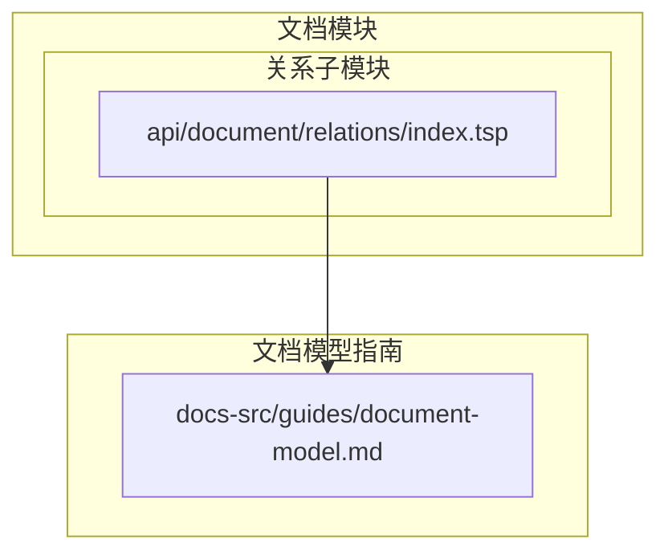
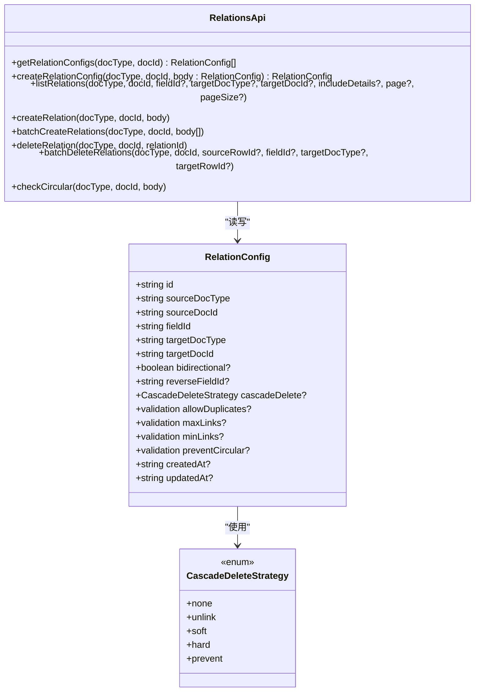
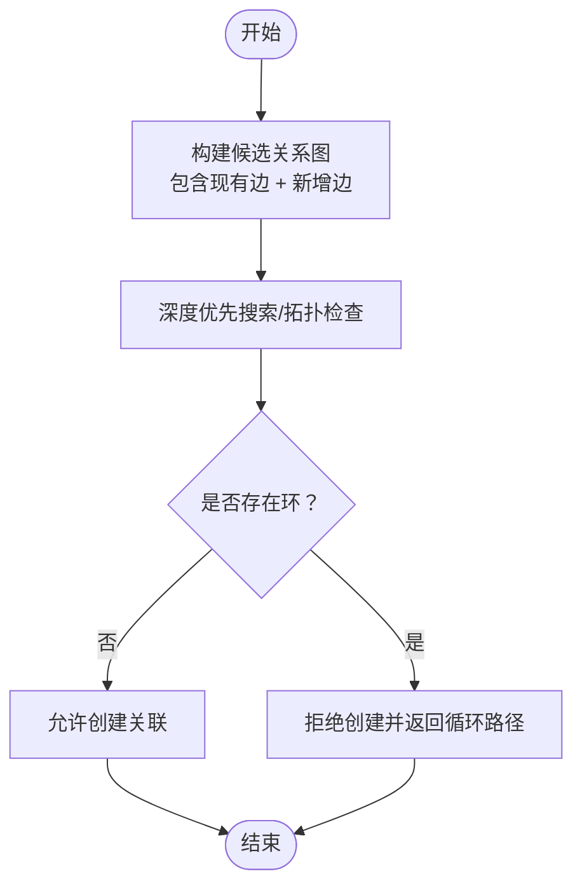
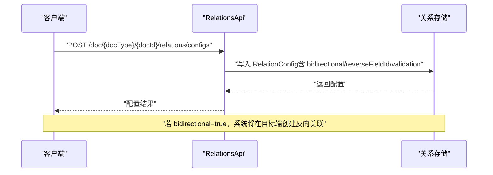

# 关联配置管理

<cite>
**本文引用的文件**
- [api/document/relations/index.tsp](file://api/document/relations/index.tsp)
- [docs-src/guides/document-model.md](file://docs-src/guides/document-model.md)
</cite>

## 目录
1. [简介](#简介)
2. [项目结构](#项目结构)
3. [核心组件](#核心组件)
4. [架构总览](#架构总览)
5. [详细组件分析](#详细组件分析)
6. [依赖分析](#依赖分析)
7. [性能考虑](#性能考虑)
8. [故障排查指南](#故障排查指南)
9. [结论](#结论)
10. [附录](#附录)

## 简介
本文件面向使用 nexusbook-api 的开发者，系统化说明“关联配置管理”的设计与使用方法。重点覆盖 RelationConfig 模型的字段语义（sourceDocType、targetDocType、fieldId、reverseFieldId、bidirectional 等）、级联删除策略（CascadeDeleteStrategy）的五种模式及其业务场景、validation 验证规则（allowDuplicates、maxLinks、minLinks、preventCircular）及如何通过 preventCircular 防止循环引用。同时给出创建“订单-产品”一对多关联和“项目-成员”多对多关联的配置示例，并说明如何通过 createRelationConfig API 创建配置、通过 getRelationConfigs 获取现有配置。

## 项目结构
关联配置能力位于文档模块下的 relations 子模块，核心接口与模型定义集中在 TypeSpec 文件中，配套的文档指南提供了关系模型与使用建议。

图表来源
- [api/document/relations/index.tsp](file://api/document/relations/index.tsp#L1-L526)
- [docs-src/guides/document-model.md](file://docs-src/guides/document-model.md#L588-L695)

章节来源
- [api/document/relations/index.tsp](file://api/document/relations/index.tsp#L1-L526)
- [docs-src/guides/document-model.md](file://docs-src/guides/document-model.md#L588-L695)

## 核心组件
- RelationConfig：文档字段的关联配置，决定双向关联、反向字段、级联删除策略以及验证规则。
- CascadeDeleteStrategy：删除目标文档/行时的级联行为枚举。
- RelationsApi：提供配置与关系的增删改查、批量操作、循环引用检测等接口。

章节来源
- [api/document/relations/index.tsp](file://api/document/relations/index.tsp#L50-L182)
- [api/document/relations/index.tsp](file://api/document/relations/index.tsp#L280-L525)

## 架构总览
下图展示了 RelationConfig 与 RelationsApi 的关系，以及双向关联与级联删除策略在系统中的作用位置。

图表来源
- [api/document/relations/index.tsp](file://api/document/relations/index.tsp#L50-L182)
- [api/document/relations/index.tsp](file://api/document/relations/index.tsp#L280-L525)

## 详细组件分析

### RelationConfig 字段详解
- id：配置唯一标识，便于检索与更新。
- sourceDocType/sourceDocId：源文档类型与文档 ID，标识配置所属的文档上下文。
- fieldId：源文档字段 ID，表示该字段承载关联关系。
- targetDocType/targetDocId：目标文档类型与文档 ID，限定关联的目标范围。
- bidirectional：是否启用双向关联。启用后会在目标端自动创建反向关联。
- reverseFieldId：当 bidirectional 为真时，用于指定目标端的反向字段 ID。
- cascadeDelete：删除目标文档/行时的级联策略，见下节。
- validation：
  - allowDuplicates：是否允许重复关联（同一源行到同一目标的重复链接）。
  - maxLinks/minLinks：最大/最小关联数量限制。
  - preventCircular：是否启用循环引用保护，防止创建导致循环的关联。
- createdAt/updatedAt：配置的创建与更新时间戳。

章节来源
- [api/document/relations/index.tsp](file://api/document/relations/index.tsp#L50-L146)

### 级联删除策略（CascadeDeleteStrategy）
- none：不进行级联。删除目标时若存在关联，将阻止删除或返回冲突。
- unlink：仅删除关联关系，保留目标实体。
- soft：对目标实体执行“软删除”（例如打上删除标记），同时解除关联。
- hard：对目标实体执行“硬删除”（物理删除），同时解除关联。
- prevent：如果存在关联，则阻止删除目标。

业务场景建议
- none/prevent：强调引用完整性，适合财务、审计、合规类强约束场景。
- unlink：适合“解绑”需求，保留目标实体但断开关系。
- soft：适合需要保留审计痕迹的场景，便于后续恢复。
- hard：适合彻底清理无用数据的场景，但需谨慎评估影响面。

章节来源
- [api/document/relations/index.tsp](file://api/document/relations/index.tsp#L152-L182)

### validation 验证规则
- allowDuplicates：默认不允许重复关联，避免冗余边。
- maxLinks/minLinks：用于限制一个源行到目标的关联数量，保障数据模型的基数约束。
- preventCircular：启用后，系统在创建关联前进行可达性检查，若可能导致循环引用则拒绝创建并返回循环路径信息。

循环引用检测流程（概念示意）

章节来源
- [api/document/relations/index.tsp](file://api/document/relations/index.tsp#L491-L525)

### RelationsApi 接口要点
- getRelationConfigs(docType, docId)：返回该文档所有字段的关联配置。
- createRelationConfig(docType, docId, body: RelationConfig)：创建或更新字段的关联配置。
- listRelations(...)：列出文档的关联关系，支持按字段、目标类型/ID、分页等过滤。
- createRelation(...)：在两行之间创建关联，若配置为双向关联，会自动在目标端创建反向关联。
- batchCreateRelations(...)：批量创建关联。
- deleteRelation(...)：删除指定关联，若为双向关联，会同时删除反向关联。
- batchDeleteRelations(...)：按条件批量删除关联。
- checkCircular(...)：在创建前检查是否会导致循环引用。

章节来源
- [api/document/relations/index.tsp](file://api/document/relations/index.tsp#L280-L525)

## 依赖分析
- RelationConfig 依赖 CascadeDeleteStrategy 枚举。
- RelationsApi 依赖 RelationConfig 与 Relation/RelationWithDetails 模型。
- 文档模型指南对关系的“边”（Edge）建模、方向、类型与基数进行了补充说明，有助于正确设计 RelationConfig 的 source/target 与 fieldId。

章节来源
- [api/document/relations/index.tsp](file://api/document/relations/index.tsp#L50-L182)
- [api/document/relations/index.tsp](file://api/document/relations/index.tsp#L184-L278)
- [api/document/relations/index.tsp](file://api/document/relations/index.tsp#L280-L525)
- [docs-src/guides/document-model.md](file://docs-src/guides/document-model.md#L588-L695)

## 性能考虑
- 关系查询通常需要按 source/target/docType/docId/rowId 等维度过滤，建议在数据库侧建立复合索引以提升查询效率。
- 大规模批量创建/删除关系时，建议使用批处理接口并分页处理，避免单次请求过大。
- 双向关联会增加写入时的维护成本（需同步维护两端），在高频写入场景下应权衡双向带来的收益与开销。

## 故障排查指南
- 创建关联失败且提示循环引用：使用 checkCircular 接口先验校验，确认是否存在环；必要时调整 bidirectional、preventCircular 或字段映射。
- 删除目标失败：检查 cascadeDelete 策略是否为 prevent/none，或是否存在其他关联未解除。
- 重复关联被拒绝：确认 allowDuplicates 是否为 false，或是否需要放宽限制。
- 关联数量异常：检查 maxLinks/minLinks 配置是否过严或过松，结合业务规则进行调整。

章节来源
- [api/document/relations/index.tsp](file://api/document/relations/index.tsp#L491-L525)
- [api/document/relations/index.tsp](file://api/document/relations/index.tsp#L280-L525)

## 结论
RelationConfig 为文档字段的跨文档/跨行关联提供了统一的配置入口，配合 CascadeDeleteStrategy 与 validation 规则，能够有效保障引用完整性与数据模型的一致性。通过 RelationsApi，开发者可以以声明式的方式配置关系，并在创建/删除/查询等生命周期中获得一致的行为预期。建议在设计阶段即明确 bidirectional、preventCircular、maxLinks/minLinks 等参数，确保业务模型与技术约束相匹配。

## 附录

### 实际配置示例

- 订单-产品 一对多关联
  - 场景说明：一个订单文档的某个字段（如 products）指向多个产品文档，属于典型的“一对多”。
  - 关键配置要点：
    - sourceDocType/sourceDocId：订单文档类型与 ID。
    - fieldId：订单文档中承载产品的字段 ID（如 products）。
    - targetDocType/targetDocId：产品文档类型与 ID。
    - bidirectional：可选。若希望产品端也能看到“来自哪些订单”，可启用并设置 reverseFieldId。
    - validation.allowDuplicates：false（避免重复关联）。
    - validation.maxLinks：无上限或根据业务设置上限。
    - validation.minLinks：可设为 0（允许空集）或 1（强制至少一个产品）。
    - validation.preventCircular：true（防止循环引用）。
    - cascadeDelete：根据业务选择 none/unlink/soft/hard/prevent。
  - 创建配置：调用 createRelationConfig，传入上述 RelationConfig。
  - 获取配置：调用 getRelationConfigs，按 docType/docId 查询。

- 项目-成员 多对多关联
  - 场景说明：项目与成员之间为多对多关系，通常需要在双方都配置反向字段以支持双向查询。
  - 关键配置要点：
    - 项目文档：
      - sourceDocType/sourceDocId：项目文档类型与 ID。
      - fieldId：项目文档中承载成员的字段 ID（如 members）。
      - targetDocType/targetDocId：成员文档类型与 ID。
      - bidirectional：true。
      - reverseFieldId：成员文档的反向字段 ID（如 projects）。
      - validation.allowDuplicates：false。
      - validation.maxLinks/minLinks：根据团队规模与角色约束设定。
      - validation.preventCircular：true。
      - cascadeDelete：none/prevent（强约束场景）。
    - 成员文档：
      - sourceDocType/sourceDocId：成员文档类型与 ID。
      - fieldId：成员文档中承载项目的字段 ID（如 projects）。
      - targetDocType/targetDocId：项目文档类型与 ID。
      - bidirectional：true。
      - reverseFieldId：项目文档的反向字段 ID（如 members）。
      - validation.allowDuplicates：false。
      - validation.maxLinks/minLinks：根据成员参与项目数量设定。
      - validation.preventCircular：true。
      - cascadeDelete：none/prevent。
  - 创建配置：分别调用 createRelationConfig 为项目与成员文档创建双向关联配置。
  - 获取配置：分别调用 getRelationConfigs 获取双方配置。

章节来源
- [api/document/relations/index.tsp](file://api/document/relations/index.tsp#L280-L525)

### API 调用流程（序列图：创建双向关联）

图表来源
- [api/document/relations/index.tsp](file://api/document/relations/index.tsp#L280-L335)