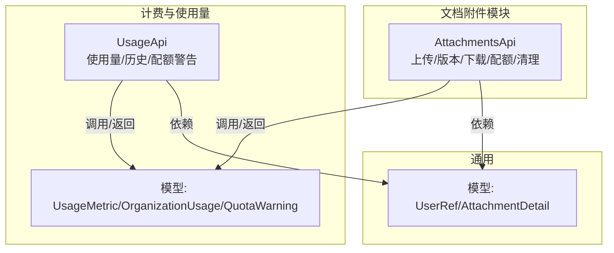
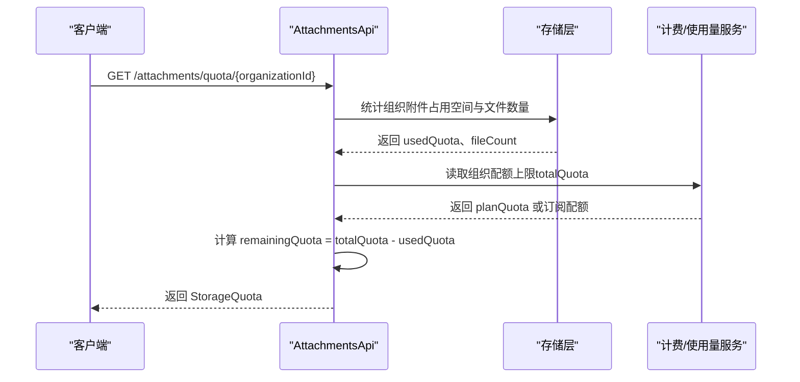
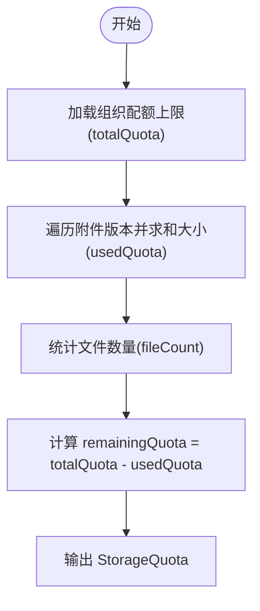
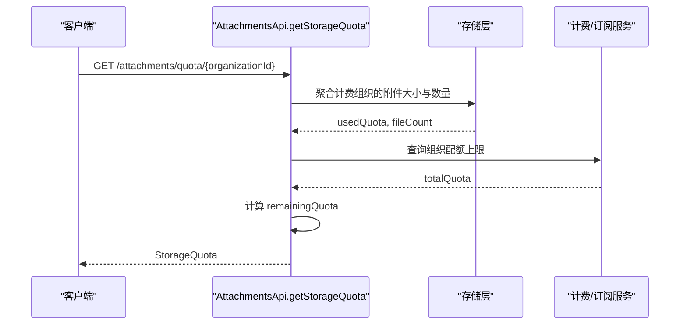
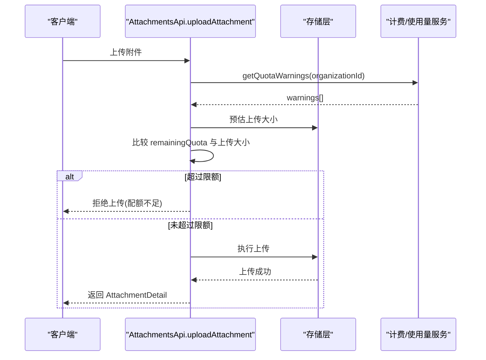
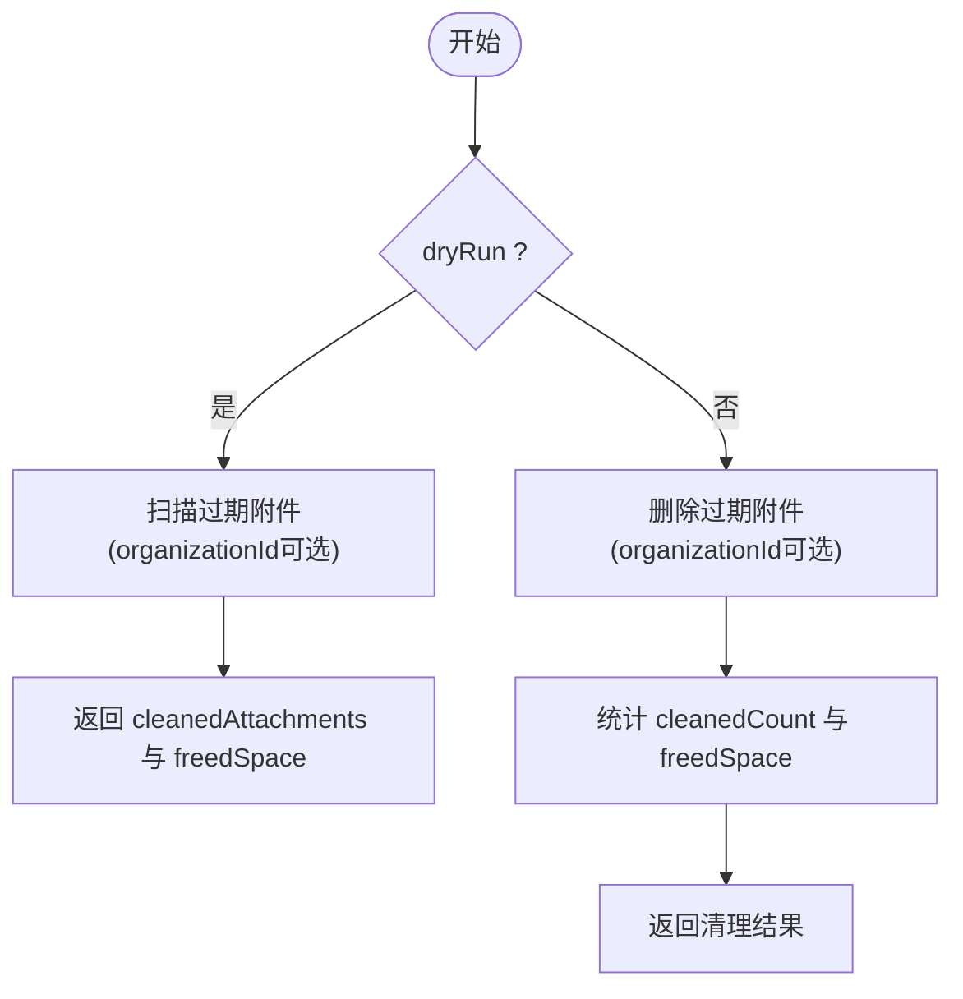
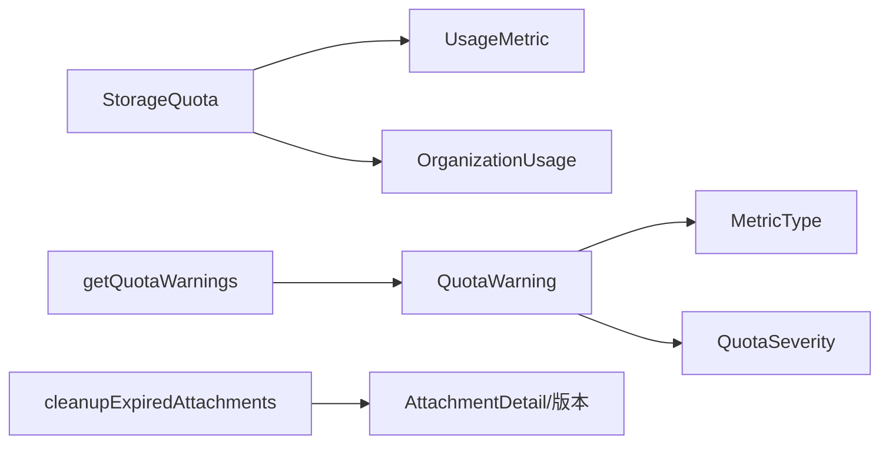

# 存储配额

<cite>
**本文引用的文件**
- [api/document/attachments/index.tsp](file://api/document/attachments/index.tsp)
- [api/billing/models.tsp](file://api/billing/models.tsp)
- [api/billing/usage.tsp](file://api/billing/usage.tsp)
- [api/shared/common.tsp](file://api/shared/common.tsp)
</cite>

## 目录
1. [简介](#简介)
2. [项目结构](#项目结构)
3. [核心组件](#核心组件)
4. [架构总览](#架构总览)
5. [详细组件分析](#详细组件分析)
6. [依赖关系分析](#依赖关系分析)
7. [性能考量](#性能考量)
8. [故障排查指南](#故障排查指南)
9. [结论](#结论)

## 简介
本文件聚焦 nexusbook-api 的“存储配额”能力，围绕以下目标展开：
- 说明 StorageQuota 模型的 totalQuota、usedQuota、remainingQuota 和 fileCount 字段的计算方式
- 解释 getStorageQuota 接口如何按组织 ID 查询配额使用情况
- 描述配额检查机制在上传时的拦截逻辑，以及接近限额时的警告策略
- 说明 cleanupExpiredAttachments 管理接口的工作原理，包括 dryRun 模式下的模拟清理与实际清理操作

## 项目结构
与存储配额直接相关的文件主要分布在以下命名空间：
- 文档附件模块：提供上传、版本管理、下载、清理过期附件等能力，并包含“获取存储配额”的接口定义
- 计费与使用量模型：提供配额警告、使用量指标、组织使用量等模型
- 通用公共模型：提供用户引用、附件元数据等基础类型

图表来源
- [api/document/attachments/index.tsp](file://api/document/attachments/index.tsp#L453-L721)
- [api/billing/usage.tsp](file://api/billing/usage.tsp#L1-L67)
- [api/billing/models.tsp](file://api/billing/models.tsp#L367-L443)
- [api/shared/common.tsp](file://api/shared/common.tsp#L562-L660)

章节来源
- [api/document/attachments/index.tsp](file://api/document/attachments/index.tsp#L453-L721)
- [api/billing/usage.tsp](file://api/billing/usage.tsp#L1-L67)
- [api/billing/models.tsp](file://api/billing/models.tsp#L367-L443)
- [api/shared/common.tsp](file://api/shared/common.tsp#L562-L660)

## 核心组件
- StorageQuota 模型：描述组织级存储配额的当前状态，包含 totalQuota、usedQuota、remainingQuota、fileCount、updatedAt 等字段
- getStorageQuota 接口：按组织 ID 查询该组织的存储配额使用情况
- cleanupExpiredAttachments 接口：清理过期附件，支持 dryRun 模式进行模拟清理
- OrganizationUsage/UsageMetric/QuotaWarning：用于组织使用量统计与配额警告的模型

章节来源
- [api/document/attachments/index.tsp](file://api/document/attachments/index.tsp#L411-L451)
- [api/document/attachments/index.tsp](file://api/document/attachments/index.tsp#L681-L720)
- [api/billing/models.tsp](file://api/billing/models.tsp#L367-L443)
- [api/billing/usage.tsp](file://api/billing/usage.tsp#L1-L67)

## 架构总览
下图展示了“获取存储配额”接口的调用路径与数据流：

图表来源
- [api/document/attachments/index.tsp](file://api/document/attachments/index.tsp#L681-L720)
- [api/billing/models.tsp](file://api/billing/models.tsp#L133-L152)

## 详细组件分析

### StorageQuota 模型与字段计算
- 字段说明
  - organizationId：所属组织 ID
  - totalQuota：组织总配额（字节）
  - usedQuota：已使用空间（字节）
  - remainingQuota：剩余可用空间（字节）
  - fileCount：组织内附件文件数量
  - updatedAt：更新时间
- 计算关系
  - remainingQuota = totalQuota − usedQuota
  - totalQuota 来源于组织订阅计划或管理员配置的配额上限
  - usedQuota 由存储层对组织下所有附件版本的大小求和得到
  - fileCount 由存储层统计组织下附件文件数量

图表来源
- [api/document/attachments/index.tsp](file://api/document/attachments/index.tsp#L411-L451)
- [api/billing/models.tsp](file://api/billing/models.tsp#L133-L152)

章节来源
- [api/document/attachments/index.tsp](file://api/document/attachments/index.tsp#L411-L451)
- [api/billing/models.tsp](file://api/billing/models.tsp#L133-L152)

### getStorageQuota 接口：按组织 ID 查询配额使用情况
- 路径与方法
  - GET /attachments/quota/{organizationId}
- 输入
  - organizationId：组织 ID
- 输出
  - StorageQuota：包含 totalQuota、usedQuota、remainingQuota、fileCount、updatedAt
- 处理流程
  - 根据 organizationId 从存储层聚合 usedQuota 与 fileCount
  - 从计费/订阅服务读取 totalQuota
  - 计算 remainingQuota 并返回

图表来源
- [api/document/attachments/index.tsp](file://api/document/attachments/index.tsp#L681-L720)

章节来源
- [api/document/attachments/index.tsp](file://api/document/attachments/index.tsp#L681-L720)

### 配额检查机制：上传时的拦截与接近限额的警告
- 配额检查拦截
  - 在上传附件前，系统应先调用 getStorageQuota 获取当前 usedQuota 与 remainingQuota
  - 若即将上传的文件大小超过 remainingQuota，则应拒绝本次上传并返回相应错误
- 警告策略
  - 当 usedQuota / totalQuota 达到阈值（例如 80%、90%）时，建议通过 getQuotaWarnings 接口返回 QuotaWarning，提示用户接近限额
  - QuotaWarning 包含指标类型、当前使用量、配额限制、使用百分比、严重程度与消息

图表来源
- [api/billing/usage.tsp](file://api/billing/usage.tsp#L54-L67)
- [api/billing/models.tsp](file://api/billing/models.tsp#L424-L443)

章节来源
- [api/billing/usage.tsp](file://api/billing/usage.tsp#L54-L67)
- [api/billing/models.tsp](file://api/billing/models.tsp#L424-L443)

### cleanupExpiredAttachments 管理接口：dryRun 与实际清理
- 路径与方法
  - POST /attachments/cleanup
- 查询参数
  - organizationId?: string（可选，限定组织范围）
  - dryRun?: boolean（是否为模拟清理）
- 返回
  - cleanedCount：清理数量
  - freedSpace：释放空间（字节）
  - cleanedAttachments：当 dryRun=true 时返回将被清理的附件 ID 列表
- 工作原理
  - dryRun 模式：仅扫描并返回将被清理的附件列表与预计释放空间，不执行删除
  - 实际清理：删除已过期的临时附件及其版本，统计清理数量与释放空间

图表来源
- [api/document/attachments/index.tsp](file://api/document/attachments/index.tsp#L696-L720)

章节来源
- [api/document/attachments/index.tsp](file://api/document/attachments/index.tsp#L696-L720)

## 依赖关系分析
- StorageQuota 依赖
  - usedQuota、fileCount 来自存储层聚合
  - totalQuota 来自计费/订阅服务
- getQuotaWarnings 依赖
  - QuotaWarning、UsageMetric、MetricType、QuotaSeverity 等模型
- cleanupExpiredAttachments 依赖
  - 附件版本模型与存储层的过期判定逻辑

图表来源
- [api/document/attachments/index.tsp](file://api/document/attachments/index.tsp#L411-L451)
- [api/billing/models.tsp](file://api/billing/models.tsp#L367-L443)
- [api/billing/usage.tsp](file://api/billing/usage.tsp#L54-L67)

章节来源
- [api/document/attachments/index.tsp](file://api/document/attachments/index.tsp#L411-L451)
- [api/billing/models.tsp](file://api/billing/models.tsp#L367-L443)
- [api/billing/usage.tsp](file://api/billing/usage.tsp#L54-L67)

## 性能考量
- 聚合计费组织的附件大小与数量时，建议采用分页扫描与增量统计，避免一次性全量扫描造成延迟
- cleanupExpiredAttachments 在生产模式下应限制每次清理的附件数量与并发，防止对存储层造成瞬时压力
- getQuotaWarnings 应缓存最近一次的配额警告结果，减少重复计算

## 故障排查指南
- 上传被拒
  - 检查 getStorageQuota 返回的 remainingQuota 是否足够
  - 确认上传文件大小是否超过 remainingQuota
- 配额警告未触发
  - 确认 getQuotaWarnings 接口返回的 warnings 列表是否为空
  - 检查配额阈值设置与计算逻辑
- 清理无效
  - dryRun 模式不会真正删除附件，需确认 dryRun 参数
  - 检查 organizationId 是否正确传入，确保限定范围

## 结论
- StorageQuota 提供了组织级存储配额的统一视图，其中 remainingQuota 由 totalQuota 与 usedQuota 计算得出
- getStorageQuota 通过聚合存储层数据与读取计费配额，为上传拦截与配额警告提供依据
- cleanupExpiredAttachments 支持 dryRun 模式，便于在生产前验证清理效果与影响范围
- 建议在上传前进行配额检查，并在接近限额时主动提示用户，提升用户体验与资源利用率