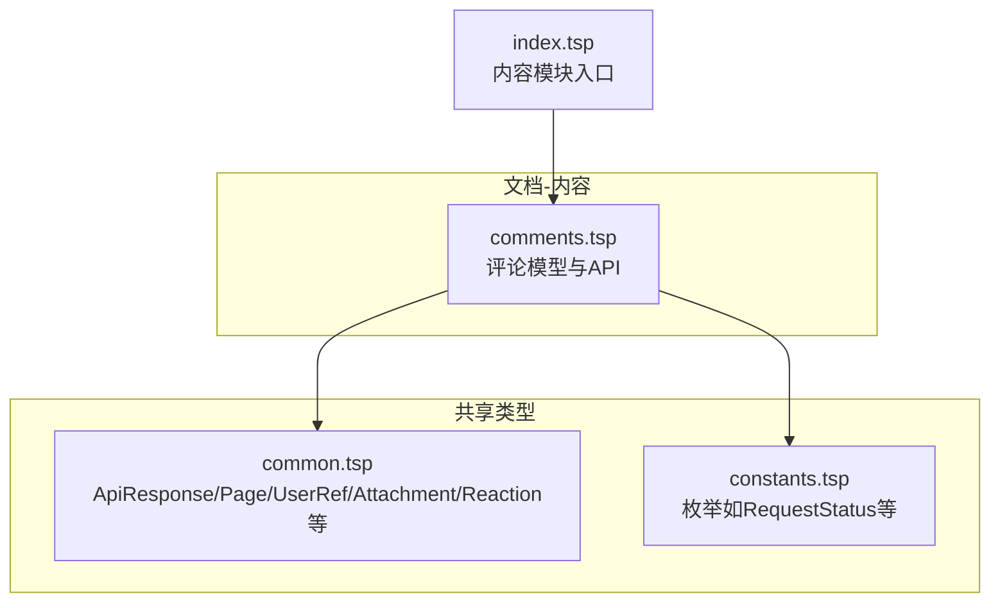
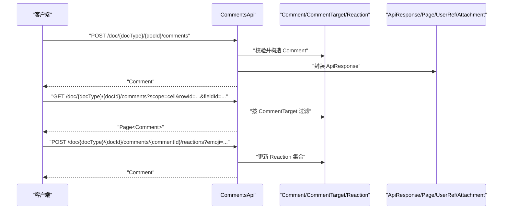
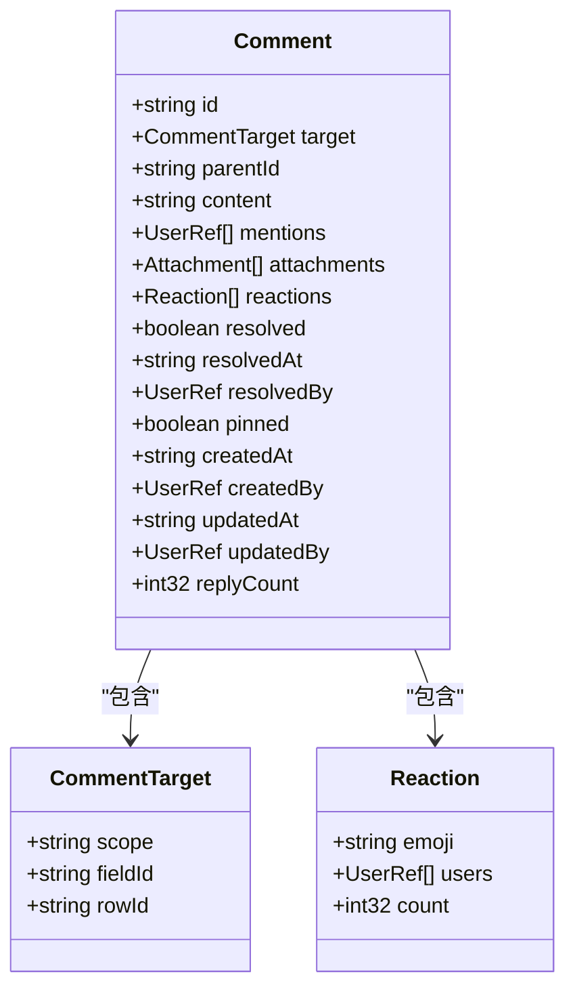
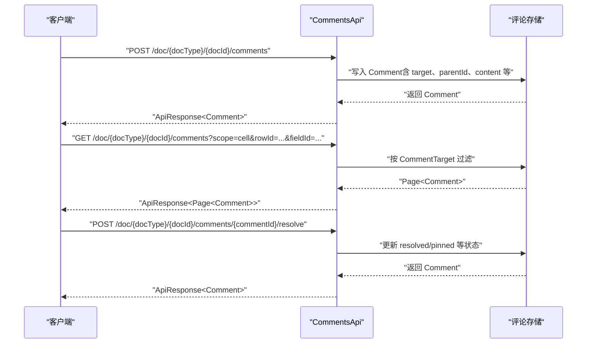
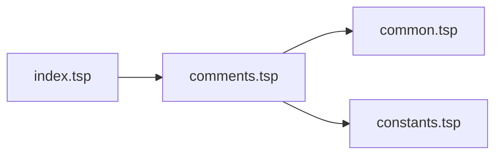

# 协作层

<cite>
**本文引用的文件**
- [comments.tsp](file://api/document/content/comments.tsp)
- [index.tsp](file://api/document/content/index.tsp)
- [common.tsp](file://api/shared/common.tsp)
- [constants.tsp](file://api/shared/constants.tsp)
- [examples.md](file://docs-src/guides/examples.md)
- [realtime-collaboration.md](file://docs-src/guides/realtime-collaboration.md)
</cite>

## 目录
1. [简介](#简介)
2. [项目结构](#项目结构)
3. [核心组件](#核心组件)
4. [架构总览](#架构总览)
5. [详细组件分析](#详细组件分析)
6. [依赖分析](#依赖分析)
7. [性能考虑](#性能考虑)
8. [故障排查指南](#故障排查指南)
9. [结论](#结论)
10. [附录](#附录)

## 简介
本章节面向协作层的 Comments（评论系统）能力，聚焦于评论在文档、字段、行、单元格四个层级的精确定位，评论线程（通过 parentId）的形成，表情反应与解决状态等核心特性，并给出统一的评论模型字段定义、API 端点清单与典型业务场景（如订货单、发票）的使用示例路径。文档旨在帮助开发者快速理解并正确集成评论协作能力。

## 项目结构
评论系统位于文档内容协作模块，属于“文档-内容”子域，通过统一的 Comments API 暴露评论的增删改查、置顶/取消置顶、标记解决/取消解决、添加/移除表情反应等能力。

图表来源
- [comments.tsp](file://api/document/content/comments.tsp#L1-L120)
- [index.tsp](file://api/document/content/index.tsp#L1-L13)
- [common.tsp](file://api/shared/common.tsp#L1-L120)
- [constants.tsp](file://api/shared/constants.tsp#L1-L120)

章节来源
- [index.tsp](file://api/document/content/index.tsp#L1-L13)
- [comments.tsp](file://api/document/content/comments.tsp#L1-L120)

## 核心组件
- 评论模型（Comment）：统一承载评论内容、目标定位、@提及、附件、表情反应、解决状态、置顶、审计信息与回复计数。
- 评论目标（CommentTarget）：支持“文档/字段/行/单元格”四层定位。
- 表情反应（Reaction）：记录表情代码、反应人集合与计数。
- Comments API：提供评论的列表、创建、详情、更新、删除、置顶/取消置顶、标记解决/取消解决、添加/移除表情反应等端点。

章节来源
- [comments.tsp](file://api/document/content/comments.tsp#L43-L237)
- [common.tsp](file://api/shared/common.tsp#L525-L742)

## 架构总览
评论系统围绕“统一模型 + 统一路由”的设计，将评论与文档数据行解耦，既支持在任意层级定位评论，又通过 parentId 形成讨论线程，配合 Reaction、resolved/pinned 等字段实现丰富的协作体验。

图表来源
- [comments.tsp](file://api/document/content/comments.tsp#L246-L472)
- [common.tsp](file://api/shared/common.tsp#L153-L203)

## 详细组件分析

### 评论模型与字段定义
- 评论目标（CommentTarget）
  - scope：定位范围，支持 "document"/"field"/"row"/"cell"
  - fieldId：当 scope 为 "field" 或 "cell" 时必填
  - rowId：当 scope 为 "row" 或 "cell" 时必填
- 评论（Comment）
  - id：评论唯一标识
  - target：CommentTarget
  - parentId：父评论ID，用于回复与线程
  - content：评论内容（富文本支持）
  - mentions：@提及用户集合
  - attachments：附件集合
  - reactions：表情反应集合
  - resolved/resolvedAt/resolvedBy：解决标记与审计
  - pinned：置顶标记
  - createdAt/createdBy/updatedAt/updatedBy：审计信息
  - replyCount：直接回复计数
- 表情反应（Reaction）
  - emoji：表情代码
  - users：反应人集合
  - count：反应数量

图表来源
- [comments.tsp](file://api/document/content/comments.tsp#L43-L237)
- [common.tsp](file://api/shared/common.tsp#L525-L742)

章节来源
- [comments.tsp](file://api/document/content/comments.tsp#L43-L237)
- [common.tsp](file://api/shared/common.tsp#L525-L742)

### API 端点清单与使用场景
- 列出评论
  - 方法与路径：GET /doc/{docType}/{docId}/comments
  - 查询参数：scope、fieldId、rowId、parentId、page、pageSize
  - 适用场景：按层级过滤评论，支持 parentId 过滤回复树
- 创建评论
  - 方法与路径：POST /doc/{docType}/{docId}/comments
  - 请求体：Comment
  - 适用场景：在文档/字段/行/单元格任意层级创建评论，或作为回复（设置 parentId）
- 获取评论详情
  - 方法与路径：GET /doc/{docType}/{docId}/comments/{commentId}
  - 适用场景：查看评论及其回复、反应、解决/置顶状态
- 更新评论
  - 方法与路径：PUT /doc/{docType}/{docId}/comments/{commentId}
  - 适用场景：仅评论创建者或管理员可编辑
- 删除评论
  - 方法与路径：DELETE /doc/{docType}/{docId}/comments/{commentId}
  - 适用场景：删除评论及其所有回复
- 置顶评论
  - 方法与路径：POST /doc/{docType}/{docId}/comments/{commentId}/pin
  - 适用场景：重要评论固定展示
- 取消置顶
  - 方法与路径：POST /doc/{docType}/{docId}/comments/{commentId}/unpin
- 标记已解决
  - 方法与路径：POST /doc/{docType}/{docId}/comments/{commentId}/resolve
  - 适用场景：标记评论及其讨论线程为已解决
- 取消解决标记
  - 方法与路径：POST /doc/{docType}/{docId}/comments/{commentId}/unresolve
- 添加表情反应
  - 方法与路径：POST /doc/{docType}/{docId}/comments/{commentId}/reactions?emoji=...
  - 适用场景：对评论添加表情反应
- 移除表情反应
  - 方法与路径：DELETE /doc/{docType}/{docId}/comments/{commentId}/reactions/{emoji}

图表来源
- [comments.tsp](file://api/document/content/comments.tsp#L246-L472)

章节来源
- [comments.tsp](file://api/document/content/comments.tsp#L246-L472)

### 评论线程与回复树
- 通过 parentId 指向父评论，形成讨论线程
- 列表接口支持通过 parentId 查询某评论下的回复
- 评论详情接口返回评论本身及其回复、反应等完整上下文

章节来源
- [comments.tsp](file://api/document/content/comments.tsp#L246-L324)

### 表情反应与解决状态
- Reaction：记录表情代码、反应人集合与计数
- resolved/resolvedAt/resolvedBy：标记评论及其讨论线程为已解决
- pinned：置顶重要评论

章节来源
- [comments.tsp](file://api/document/content/comments.tsp#L77-L110)
- [comments.tsp](file://api/document/content/comments.tsp#L160-L204)

### 业务场景示例（订货单、发票）
- 订货单场景
  - 在“字段/行/单元格”层级添加评论，用于标注数据问题或补充说明
  - 使用 parentId 形成回复讨论，@相关人员
  - 使用 resolve 标记问题已解决，pinned 置顶关键问题
  - 参考示例路径：[examples.md](file://docs-src/guides/examples.md#L1-L210)
- 发票场景
  - 在发票属性或数据行层级添加评论，用于合规审查或差异说明
  - 通过 reactions 表达初步意见，后续 resolve 结论
  - 参考示例路径：[examples.md](file://docs-src/guides/examples.md#L1-L210)

章节来源
- [examples.md](file://docs-src/guides/examples.md#L1-L210)

## 依赖分析
- Comments API 依赖共享类型：
  - ApiResponse/Page：统一响应包装与分页
  - UserRef/Attachment：用户引用与附件
  - Reaction：表情反应
- Comments 模型与 Comments API 位于文档内容模块，通过 index.tsp 导入

图表来源
- [comments.tsp](file://api/document/content/comments.tsp#L1-L120)
- [common.tsp](file://api/shared/common.tsp#L153-L203)
- [constants.tsp](file://api/shared/constants.tsp#L1-L120)
- [index.tsp](file://api/document/content/index.tsp#L1-L13)

章节来源
- [comments.tsp](file://api/document/content/comments.tsp#L1-L120)
- [common.tsp](file://api/shared/common.tsp#L153-L203)
- [constants.tsp](file://api/shared/constants.tsp#L1-L120)
- [index.tsp](file://api/document/content/index.tsp#L1-L13)

## 性能考虑
- 列表查询支持分页与层级过滤，建议合理设置 page/pageSize，避免一次性加载过多评论
- 通过 parentId 过滤回复树时，建议仅拉取必要层级，避免深度递归导致的性能问题
- 表情反应与附件数量较多时，建议在前端做懒加载与缓存
- 评论与数据行解耦设计有利于独立扩展与优化

## 故障排查指南
- 评论未显示或回复缺失
  - 检查 scope/fieldId/rowId/parentId 查询参数是否正确
  - 确认 parentId 是否指向正确的父评论
- 无法更新或删除评论
  - 确认当前用户是否有权限（仅创建者或管理员可编辑）
- 解决/置顶状态异常
  - 检查 resolve/unresolve/pin/unpin 接口调用是否成功
  - 确认 resolvedAt/resolvedBy/pinned 字段是否正确更新
- 表情反应无效
  - 确认 emoji 参数格式与接口路径是否正确
  - 检查 Reaction 集合是否包含对应表情

章节来源
- [comments.tsp](file://api/document/content/comments.tsp#L246-L472)

## 结论
评论系统通过统一模型与清晰的层级定位，实现了在文档、字段、行、单元格四个维度的协作评论能力；通过 parentId 形成讨论线程，结合表情反应与解决/置顶状态，满足了从问题发现、讨论到闭环管理的全流程协作需求。结合示例场景，可在订货单、发票等业务中快速落地。

## 附录
- 实时协同与评论的关系
  - 实时协同（Yjs/Awareness/Lock）与评论系统互补：前者保障多人同时编辑的一致性，后者沉淀讨论与决策过程
  - 参考路径：[realtime-collaboration.md](file://docs-src/guides/realtime-collaboration.md#L1-L212)

章节来源
- [realtime-collaboration.md](file://docs-src/guides/realtime-collaboration.md#L1-L212)