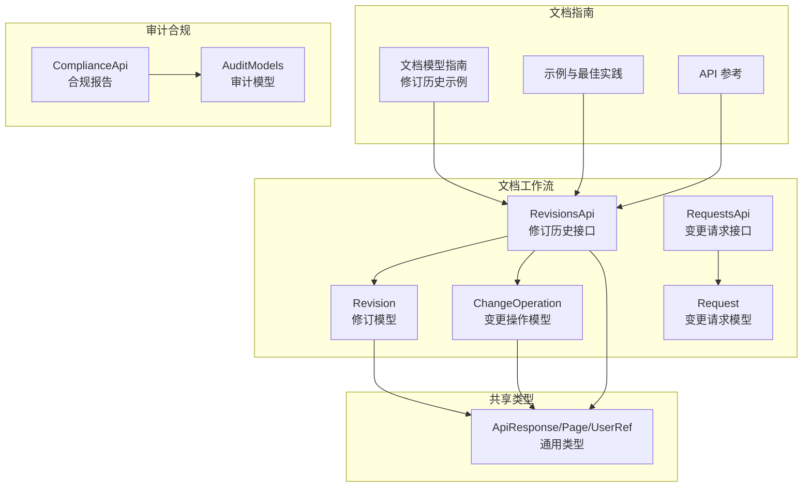
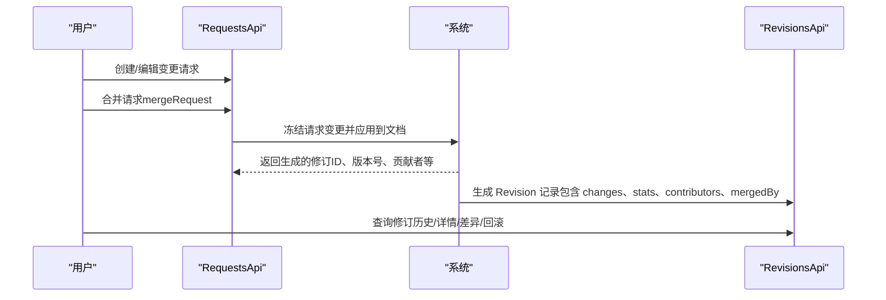
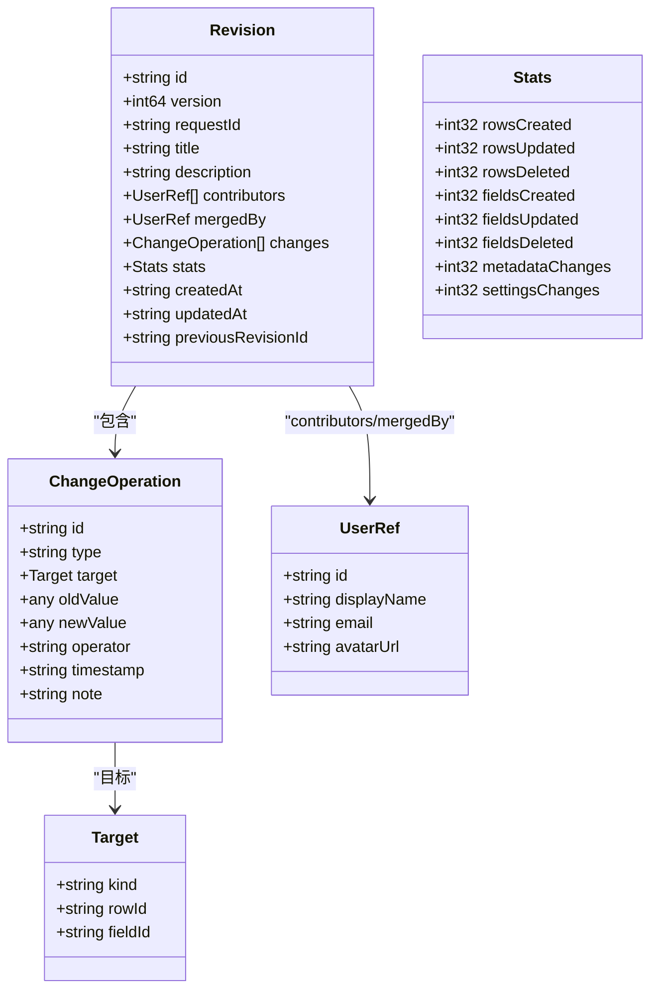
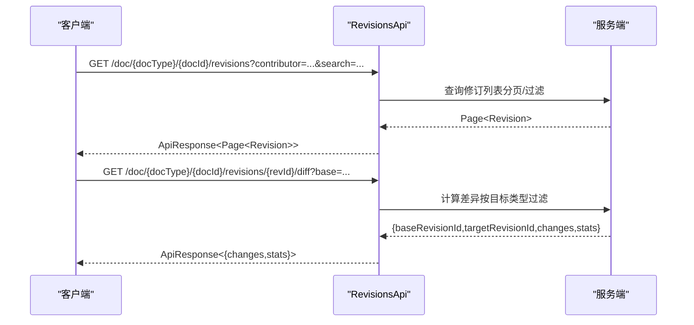
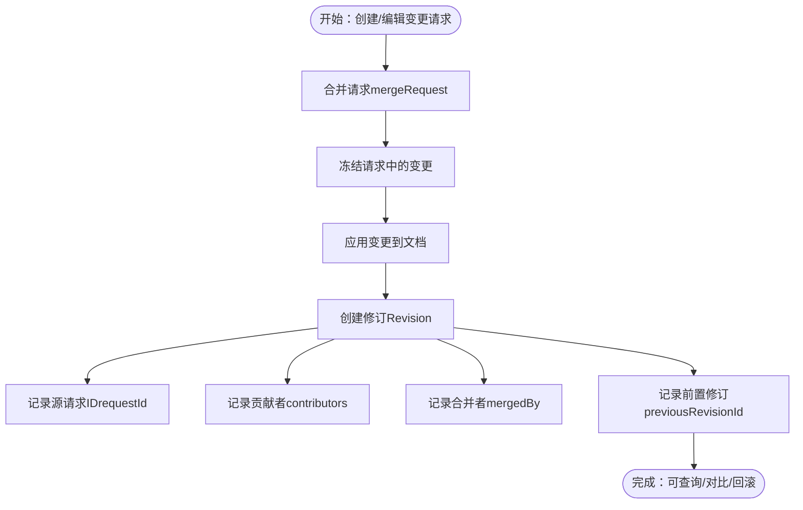
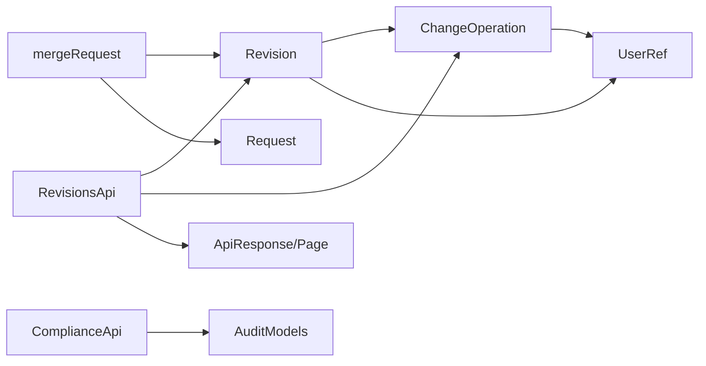

# 修订历史

<cite>
**本文引用的文件**
- [revisions.tsp](file://api/document/workflow/revisions.tsp)
- [requests.tsp](file://api/document/workflow/requests.tsp)
- [common.tsp](file://api/shared/common.tsp)
- [document-model.md](file://docs-src/guides/document-model.md)
- [examples.md](file://docs-src/guides/examples.md)
- [api-reference.md](file://docs-src/references/api-reference.md)
- [compliance.tsp](file://api/audit/compliance.tsp)
- [models.tsp](file://api/audit/models.tsp)
</cite>

## 目录
1. [简介](#简介)
2. [项目结构](#项目结构)
3. [核心组件](#核心组件)
4. [架构总览](#架构总览)
5. [详细组件分析](#详细组件分析)
6. [依赖分析](#依赖分析)
7. [性能考虑](#性能考虑)
8. [故障排查指南](#故障排查指南)
9. [结论](#结论)
10. [附录](#附录)

## 简介
本文件系统性地阐述 nexusbook-api 的修订历史（Revisions）能力，覆盖 Revision 模型、ChangeOperation 模型、修订与变更请求的关联机制，以及 RevisionsApi 的完整接口说明。文档还提供版本对比、对象级变更追踪、选择性回滚、导出与审计等实践指导，帮助团队建立完善的审计追踪、数据恢复与协作透明度体系。

## 项目结构
修订历史相关的核心代码位于文档工作流模块，主要文件如下：
- Revisions API 与模型定义：api/document/workflow/revisions.tsp
- 变更请求模型与合并流程：api/document/workflow/requests.tsp
- 通用类型（如用户引用、分页、响应包装）：api/shared/common.tsp
- 文档模型与修订历史示例：docs-src/guides/document-model.md
- 示例与最佳实践：docs-src/guides/examples.md、docs-src/guides/best-practices.md
- API 参考与统一响应格式：docs-src/references/api-reference.md
- 审计与合规：api/audit/compliance.tsp、api/audit/models.tsp

图表来源
- [revisions.tsp](file://api/document/workflow/revisions.tsp#L316-L546)
- [requests.tsp](file://api/document/workflow/requests.tsp#L83-L200)
- [common.tsp](file://api/shared/common.tsp#L153-L203)
- [document-model.md](file://docs-src/guides/document-model.md#L460-L553)
- [api-reference.md](file://docs-src/references/api-reference.md#L1-L120)
- [compliance.tsp](file://api/audit/compliance.tsp#L1-L53)
- [models.tsp](file://api/audit/models.tsp#L1-L194)

章节来源
- [revisions.tsp](file://api/document/workflow/revisions.tsp#L316-L546)
- [requests.tsp](file://api/document/workflow/requests.tsp#L83-L200)
- [common.tsp](file://api/shared/common.tsp#L153-L203)
- [document-model.md](file://docs-src/guides/document-model.md#L460-L553)
- [api-reference.md](file://docs-src/references/api-reference.md#L1-L120)

## 核心组件
- Revision（修订模型）
  - 标识与版本：id、version
  - 源请求关联：requestId、title、description
  - 贡献者与合并者：contributors、mergedBy
  - 变更集合与统计：changes、stats
  - 时间戳与前后版本：createdAt、updatedAt、previousRevisionId
- ChangeOperation（变更操作模型）
  - 操作标识：id
  - 操作类型：type（row-create/update/delete、field-create/update/delete、metadata-update、settings-update 等）
  - 目标定位：target.kind、rowId、fieldId
  - 值对比：oldValue、newValue
  - 操作人与时间：operator、timestamp、note
- RevisionsApi（修订历史接口）
  - listRevisions、getRevision、listOperations
  - getRevisionDiff、queryChangeHistory、revertRevision
  - getSourceRequest、exportRevision

章节来源
- [revisions.tsp](file://api/document/workflow/revisions.tsp#L151-L314)
- [revisions.tsp](file://api/document/workflow/revisions.tsp#L316-L546)

## 架构总览
修订历史围绕“变更请求（Request）→ 合并（Merge）→ 生成修订（Revision）”的闭环工作流构建。合并时冻结请求中的变更，应用到文档并生成修订，记录贡献者与合并者，形成可追溯的历史链路。

图表来源
- [requests.tsp](file://api/document/workflow/requests.tsp#L244-L347)
- [revisions.tsp](file://api/document/workflow/revisions.tsp#L151-L314)

## 详细组件分析

### Revision 模型详解
- id：修订唯一标识，用于定位与回溯
- version：递增版本号，便于排序与快速比较
- requestId：源合并请求 ID，建立修订与请求的直接关联
- title/description：来自源请求的标题与描述，便于检索与审计
- contributors：在请求中贡献变更的所有用户，体现协作透明度
- mergedBy：执行合并操作的用户
- changes：修订中包含的所有变更操作，按时间顺序排列
- stats：变更统计，包括行/字段/元数据/设置的新增、修改、删除数量
- createdAt/updatedAt：修订生成与最后更新时间
- previousRevisionId：前置修订 ID，用于快速链接历史链路

图表来源
- [revisions.tsp](file://api/document/workflow/revisions.tsp#L151-L314)
- [common.tsp](file://api/shared/common.tsp#L617-L653)

章节来源
- [revisions.tsp](file://api/document/workflow/revisions.tsp#L151-L314)
- [common.tsp](file://api/shared/common.tsp#L617-L653)

### ChangeOperation 模型详解
- id：操作唯一标识
- type：操作类型，覆盖行/字段/元数据/设置的创建、更新、删除
- target：目标定位，支持 kind（row/field/metadata/settings）、rowId、fieldId
- oldValue/newValue：用于对比与回滚的值
- operator：操作人
- timestamp：操作时间
- note：备注说明

章节来源
- [revisions.tsp](file://api/document/workflow/revisions.tsp#L45-L149)

### RevisionsApi 接口说明
- listRevisions
  - 功能：按时间逆序返回修订列表，支持分页与过滤（contributor、search）
  - 参数：docType、docId、page、pageSize、contributor、search
  - 返回：分页的 Revision 列表
- getRevision
  - 功能：获取指定修订的完整详情（包含 changes、stats、contributors、mergedBy 等）
  - 参数：docType、docId、revId
  - 返回：Revision
- listOperations
  - 功能：分页返回修订中的所有变更操作，支持按操作类型与目标类型过滤
  - 参数：docType、docId、revId、type、targetKind、page、pageSize
  - 返回：分页的 ChangeOperation 列表
- getRevisionDiff
  - 功能：比较两个修订之间的差异，支持按目标类型过滤
  - 参数：docType、docId、revId、base、targetKind
  - 返回：包含 baseRevisionId、targetRevisionId、changes、stats 的对象
- queryChangeHistory
  - 功能：查询特定目标（行/字段）在所有修订中的变更历史
  - 参数：docType、docId、targetKind、rowId、fieldId、page、pageSize
  - 返回：分页的 ChangeOperation 列表
- revertRevision
  - 功能：将文档回滚到指定修订状态，创建新的修订记录此操作
  - 参数：docType、docId、revId、body.reason、body.selectiveTypes
  - 返回：新生成的 Revision（类型为 "revert"）
- getSourceRequest
  - 功能：获取生成此修订的原始合并请求
  - 参数：docType、docId、revId
  - 返回：请求详情
- exportRevision
  - 功能：导出修订的完整数据为 JSON、CSV 等格式
  - 参数：docType、docId、revId、format
  - 返回：二进制/文本流（视格式而定）

图表来源
- [revisions.tsp](file://api/document/workflow/revisions.tsp#L316-L546)

章节来源
- [revisions.tsp](file://api/document/workflow/revisions.tsp#L316-L546)

### 修订与变更请求的关联机制
- 合并流程：当请求被合并时，系统冻结请求中的所有变更，应用到文档，创建新的修订记录整个变更历史，记录所有贡献者与合并者，并返回生成的修订 ID
- 关联字段：Revision.requestId 指向源请求；RevisionsApi.getSourceRequest 可获取原始请求详情
- 版本链：Revision.previousRevisionId 用于快速链接历史链路

图表来源
- [requests.tsp](file://api/document/workflow/requests.tsp#L244-L347)
- [revisions.tsp](file://api/document/workflow/revisions.tsp#L151-L314)

章节来源
- [requests.tsp](file://api/document/workflow/requests.tsp#L244-L347)
- [revisions.tsp](file://api/document/workflow/revisions.tsp#L151-L314)

### 使用示例与最佳实践
- 比较两个修订之间的差异
  - 使用 getRevisionDiff，传入 base 参数指定基准修订
  - 可选 targetKind 过滤目标类型
- 查询某一行数据的完整变更历史
  - 使用 queryChangeHistory，指定 targetKind=row、rowId
- 执行选择性回滚
  - 使用 revertRevision，传入 selectiveTypes 指定仅回滚特定类型（如仅回滚行变更）
  - 可选 reason 说明回滚原因
- 审计与合规
  - 通过 Revision.contributors、mergedBy、createdAt、operator、timestamp 等字段进行审计
  - 可结合合规报告接口生成周期性审计报告

章节来源
- [document-model.md](file://docs-src/guides/document-model.md#L460-L553)
- [examples.md](file://docs-src/guides/examples.md#L1-L210)
- [api-reference.md](file://docs-src/references/api-reference.md#L1-L120)
- [compliance.tsp](file://api/audit/compliance.tsp#L1-L53)
- [models.tsp](file://api/audit/models.tsp#L1-L194)

## 依赖分析
- RevisionsApi 依赖 Revision、ChangeOperation、ApiResponse、Page、UserRef 等类型
- 合并流程依赖 RequestsApi 的 mergeRequest，产出 Revision
- 审计与合规模块提供统一的审计模型与合规报告能力，可与修订历史联动

图表来源
- [revisions.tsp](file://api/document/workflow/revisions.tsp#L151-L314)
- [requests.tsp](file://api/document/workflow/requests.tsp#L83-L200)
- [common.tsp](file://api/shared/common.tsp#L153-L203)
- [compliance.tsp](file://api/audit/compliance.tsp#L1-L53)
- [models.tsp](file://api/audit/models.tsp#L1-L194)

章节来源
- [revisions.tsp](file://api/document/workflow/revisions.tsp#L151-L314)
- [requests.tsp](file://api/document/workflow/requests.tsp#L83-L200)
- [common.tsp](file://api/shared/common.tsp#L153-L203)
- [compliance.tsp](file://api/audit/compliance.tsp#L1-L53)
- [models.tsp](file://api/audit/models.tsp#L1-L194)

## 性能考虑
- 分页与游标：listRevisions、listOperations、queryChangeHistory 支持分页，建议合理设置 pageSize，避免一次性拉取过多数据
- 过滤与索引：利用 contributor、search、type、targetKind 等查询参数减少无关数据传输
- 按需加载：在聚合查询中按需 include=revisions，避免不必要的负载
- 导出策略：exportRevision 支持多种格式，建议在后台任务中异步导出大体量数据

[本节为通用建议，不直接分析具体文件]

## 故障排查指南
- 常见错误码与含义可参考统一错误码定义，如 DOC_NOT_FOUND、REQUEST_NOT_FOUND、REQUEST_CONFLICT 等
- 审计与合规：结合审计模型与合规报告接口，定位异常操作与违规行为
- 历史审计：定期检查修订历史，使用 queryChangeHistory 定位特定对象的变更轨迹

章节来源
- [api-reference.md](file://docs-src/references/api-reference.md#L1-L120)
- [models.tsp](file://api/audit/models.tsp#L1-L194)

## 结论
修订历史通过 Revision 与 ChangeOperation 的精细建模，配合 RevisionsApi 的全链路能力，实现了从变更请求到版本对比、对象级追踪、选择性回滚与审计导出的完整闭环。该能力在审计追踪、数据恢复与协作透明度方面具有重要价值，建议在生产环境中结合合规报告与历史审计策略，持续完善数据治理与风险管控。

[本节为总结性内容，不直接分析具体文件]

## 附录
- 统一响应格式：所有 API 返回 ApiResponse 结构，包含 success、code、message、payload
- 文档聚合查询：支持一次性获取 metadata、views、data、comments、revisions、settings 等部分

章节来源
- [api-reference.md](file://docs-src/references/api-reference.md#L1-L120)
- [document-model.md](file://docs-src/guides/document-model.md#L460-L553)