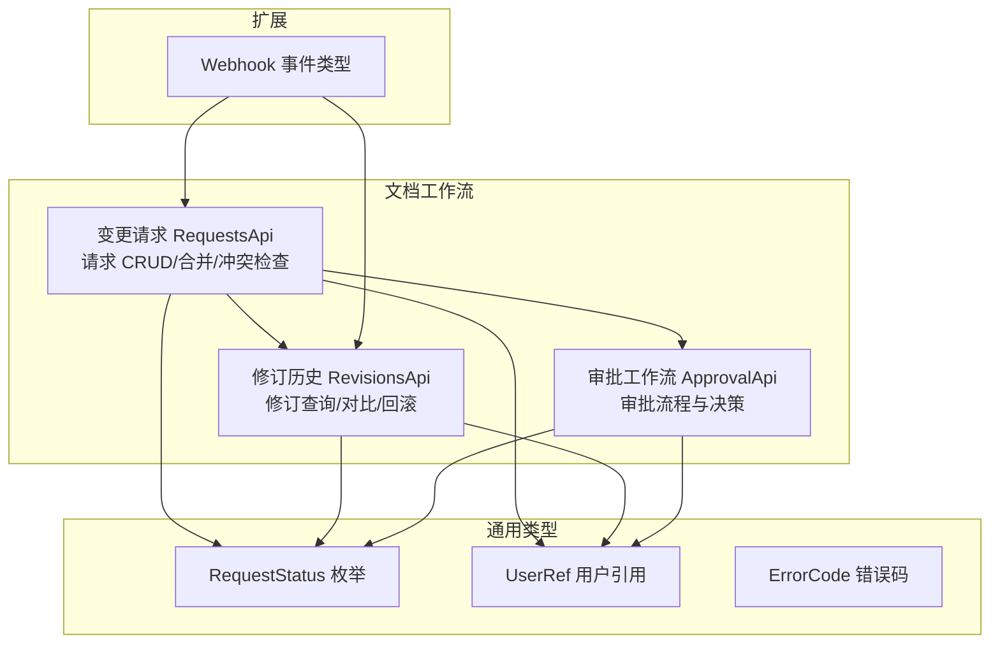
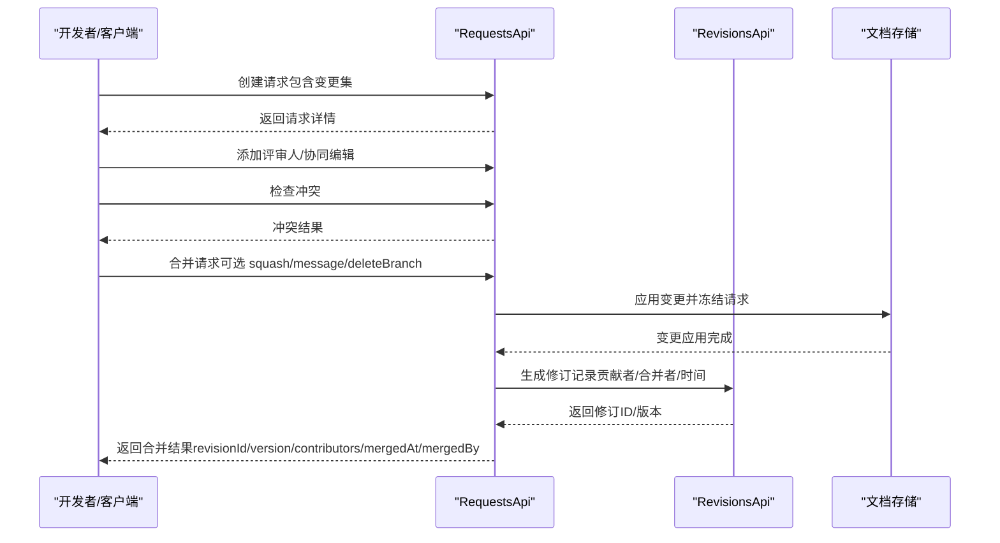
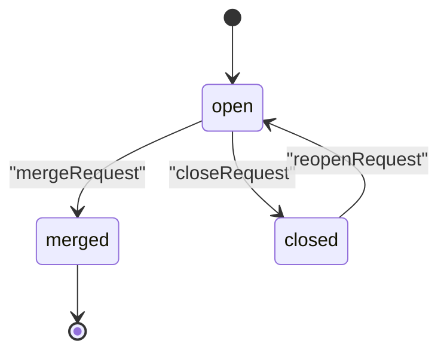
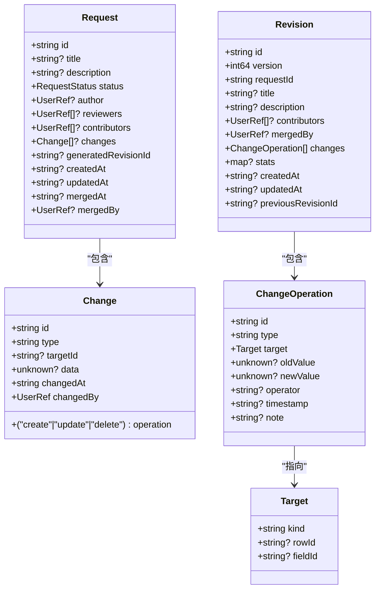

# 变更请求

<cite>
**本文引用的文件**
- [api/document/workflow/requests.tsp](file://api/document/workflow/requests.tsp)
- [api/document/workflow/revisions.tsp](file://api/document/workflow/revisions.tsp)
- [api/document/workflow/approvals.tsp](file://api/document/workflow/approvals.tsp)
- [api/shared/common.tsp](file://api/shared/common.tsp)
- [api/shared/constants.tsp](file://api/shared/constants.tsp)
- [api/extensions/webhooks/models.tsp](file://api/extensions/webhooks/models.tsp)
- [docs-src/guides/examples.md](file://docs-src/guides/examples.md)
</cite>

## 目录
1. [简介](#简介)
2. [项目结构](#项目结构)
3. [核心组件](#核心组件)
4. [架构总览](#架构总览)
5. [详细组件分析](#详细组件分析)
6. [依赖分析](#依赖分析)
7. [性能考虑](#性能考虑)
8. [故障排查指南](#故障排查指南)
9. [结论](#结论)
10. [附录](#附录)

## 简介
本文件面向“变更请求（Requests）”功能，系统化阐述其作为所有写操作入口的设计理念，并围绕 Request 模型的核心字段、open/merged/closed 生命周期、协同编辑与冲突检测、评审机制、RequestsApi 接口、合并参数（squash、message、deleteBranch）、变更请求与修订历史的关联关系，以及操作可审计性进行深入说明。文档同时提供 API 端点的完整说明与使用建议，帮助开发者在实际项目中正确、安全地使用变更请求能力。

## 项目结构
变更请求相关能力主要分布在以下模块：
- 变更请求与工作流：api/document/workflow/requests.tsp
- 修订历史与审计：api/document/workflow/revisions.tsp
- 审批工作流（与变更请求可结合）：api/document/workflow/approvals.tsp
- 通用类型与常量：api/shared/common.tsp、api/shared/constants.tsp
- Webhook 事件类型（与变更请求相关）：api/extensions/webhooks/models.tsp
- 示例与集成指南：docs-src/guides/examples.md

图表来源
- [api/document/workflow/requests.tsp](file://api/document/workflow/requests.tsp#L202-L390)
- [api/document/workflow/revisions.tsp](file://api/document/workflow/revisions.tsp#L316-L547)
- [api/document/workflow/approvals.tsp](file://api/document/workflow/approvals.tsp#L96-L156)
- [api/shared/constants.tsp](file://api/shared/constants.tsp#L9-L31)
- [api/shared/common.tsp](file://api/shared/common.tsp#L617-L653)
- [api/extensions/webhooks/models.tsp](file://api/extensions/webhooks/models.tsp#L93-L135)

章节来源
- [api/document/workflow/requests.tsp](file://api/document/workflow/requests.tsp#L1-L391)
- [api/document/workflow/revisions.tsp](file://api/document/workflow/revisions.tsp#L1-L547)
- [api/document/workflow/approvals.tsp](file://api/document/workflow/approvals.tsp#L1-L156)
- [api/shared/common.tsp](file://api/shared/common.tsp#L1-L742)
- [api/shared/constants.tsp](file://api/shared/constants.tsp#L1-L108)
- [api/extensions/webhooks/models.tsp](file://api/extensions/webhooks/models.tsp#L93-L135)

## 核心组件
- Request 模型：承载变更请求的全部元信息与变更集，支持协同编辑、评审与审计。
- Change 模型：描述单条变更（类型、操作、目标、数据、时间与操作人）。
- RequestsApi 接口：提供变更请求的创建、查询、合并、关闭、重新打开与冲突检查。
- RevisionsApi 接口：提供修订历史的查询、对比、回滚与导出，与变更请求强关联。
- 审批工作流：可与变更请求结合，实现审批驱动的合并。
- Webhook 事件：支持 request_* 事件，便于外部系统联动。

章节来源
- [api/document/workflow/requests.tsp](file://api/document/workflow/requests.tsp#L39-L200)
- [api/document/workflow/requests.tsp](file://api/document/workflow/requests.tsp#L202-L390)
- [api/document/workflow/revisions.tsp](file://api/document/workflow/revisions.tsp#L151-L314)
- [api/document/workflow/approvals.tsp](file://api/document/workflow/approvals.tsp#L96-L156)
- [api/extensions/webhooks/models.tsp](file://api/extensions/webhooks/models.tsp#L93-L135)

## 架构总览
变更请求作为所有写操作入口，遵循“先请求、后合并”的模式：用户在请求中累积多行或多类变更，经评审与冲突检测后合并，系统冻结请求中的变更并应用到文档，生成修订记录完整的历史轨迹。

图表来源
- [api/document/workflow/requests.tsp](file://api/document/workflow/requests.tsp#L244-L347)
- [api/document/workflow/revisions.tsp](file://api/document/workflow/revisions.tsp#L151-L314)

## 详细组件分析

### Request 模型与核心字段
- id：请求唯一标识，用于定位与跟踪。
- title/description：请求标题与描述，便于协作与审计。
- status：请求状态，枚举值来自 RequestStatus（open/merged/closed）。
- author：创建者用户引用。
- reviewers：评审人列表，支持多人评审。
- contributors：对请求做变更贡献的用户集合，用于审计。
- changes：待合并的变更集合，支持多种类型（数据行、属性、视图等）。
- generatedRevisionId：请求合并后生成的修订ID。
- createdAt/updatedAt/mergedAt：时间戳字段，用于审计与排序。
- mergedBy：执行合并的用户引用。

章节来源
- [api/document/workflow/requests.tsp](file://api/document/workflow/requests.tsp#L83-L200)
- [api/shared/constants.tsp](file://api/shared/constants.tsp#L9-L31)
- [api/shared/common.tsp](file://api/shared/common.tsp#L617-L653)

### Change 模型
- id：变更唯一标识。
- type：变更类型（如 data/properties/view/metadata/other）。
- operation：操作类型（create/update/delete）。
- targetId：目标ID（行ID、属性ID等）。
- data：变更数据（未知类型，由上层约定）。
- changedAt：变更时间。
- changedBy：变更人（UserRef）。

章节来源
- [api/document/workflow/requests.tsp](file://api/document/workflow/requests.tsp#L39-L81)
- [api/shared/common.tsp](file://api/shared/common.tsp#L617-L653)

### RequestsApi 接口与端点说明
- 路径与标签：/doc/{docType}/{docId}/requests，标签为 Document - Workflow。
- listRequests
  - 方法：GET
  - 路径：/doc/{docType}/{docId}/requests
  - 参数：路径 docType、docId
  - 响应：ApiResponse<Request[]>，返回未生效变更请求列表
- createRequest
  - 方法：POST
  - 路径：/doc/{docType}/{docId}/requests
  - 参数：路径 docType、docId；请求体 Request
  - 响应：ApiResponse<Request>
- getRequest
  - 方法：GET
  - 路径：/doc/{docType}/{docId}/requests/{reqId}
  - 参数：路径 docType、docId、reqId
  - 响应：ApiResponse<Request>
- mergeRequest
  - 方法：POST
  - 路径：/doc/{docType}/{docId}/requests/{reqId}/merge
  - 参数：路径 docType、docId、reqId；请求体可选字段
    - message：合并消息
    - squash：是否合并为单一变更
    - deleteBranch：合并后是否删除关联分支
  - 响应：ApiResponse<{revisionId, version, changesApplied, contributors, mergedAt, mergedBy}>
- closeRequest
  - 方法：POST
  - 路径：/doc/{docType}/{docId}/requests/{reqId}/close
  - 参数：路径 docType、docId、reqId
  - 响应：ApiResponse<unknown>
- reopenRequest
  - 方法：POST
  - 路径：/doc/{docType}/{docId}/requests/{reqId}/reopen
  - 参数：路径 docType、docId、reqId
  - 响应：ApiResponse<unknown>
- getRequestConflicts
  - 方法：GET
  - 路径：/doc/{docType}/{docId}/requests/{reqId}/conflicts
  - 参数：路径 docType、docId、reqId
  - 响应：ApiResponse<unknown>

章节来源
- [api/document/workflow/requests.tsp](file://api/document/workflow/requests.tsp#L202-L390)

### 合并参数详解
- squash：布尔值。将请求中的多条变更合并为单一变更，简化修订历史。
- message：字符串。合并时的说明信息，便于审计与回溯。
- deleteBranch：布尔值。合并后是否删除关联分支（若存在）。

章节来源
- [api/document/workflow/requests.tsp](file://api/document/workflow/requests.tsp#L244-L347)

### 状态生命周期与流转
- open：开放状态，等待评审或直接应用。
- merged：已合并，变更已生效，系统冻结请求中的变更并生成修订。
- closed：已关闭，变更被拒绝或取消。

图表来源
- [api/document/workflow/requests.tsp](file://api/document/workflow/requests.tsp#L244-L390)
- [api/shared/constants.tsp](file://api/shared/constants.tsp#L9-L31)

### 协同编辑、冲突检测与评审机制
- 协同编辑：多个用户可在同一请求中添加/修改变更，contributors 记录所有贡献者。
- 冲突检测：通过 getRequestConflicts 端点检查请求与当前文档的冲突，返回冲突信息以便处理。
- 评审机制：通过 reviewers 字段指定评审人，可结合审批工作流（ApprovalApi）实现审批驱动的合并。

章节来源
- [api/document/workflow/requests.tsp](file://api/document/workflow/requests.tsp#L120-L155)
- [api/document/workflow/requests.tsp](file://api/document/workflow/requests.tsp#L377-L390)
- [api/document/workflow/approvals.tsp](file://api/document/workflow/approvals.tsp#L96-L156)

### 变更请求与修订历史的关联关系
- 合并后生成修订：RevisionsApi 的 Revision 记录包含 requestId（源请求ID）、title/description、contributors、mergedBy、changes、stats 等字段，完整追踪变更历史。
- 修订生成时机：当请求被合并时，系统冻结请求中的变更并应用到文档，创建新修订，记录贡献者与合并者。
- 关联查询：可通过修订 API 获取源请求、对比差异、回滚等。

章节来源
- [api/document/workflow/revisions.tsp](file://api/document/workflow/revisions.tsp#L151-L314)
- [api/document/workflow/requests.tsp](file://api/document/workflow/requests.tsp#L244-L347)

### 操作可审计性
- Request 层面：author、contributors、createdAt、updatedAt、mergedAt、mergedBy 等字段提供基础审计线索。
- Revision 层面：revisionId、version、changes、stats、mergedBy、mergedAt 等字段提供完整审计轨迹。
- Webhook：支持 request_created、request_merged、request_closed、request_reopened 等事件，便于外部系统联动与审计。

章节来源
- [api/document/workflow/revisions.tsp](file://api/document/workflow/revisions.tsp#L151-L314)
- [api/extensions/webhooks/models.tsp](file://api/extensions/webhooks/models.tsp#L93-L135)

### API 使用示例（路径参考）
- 创建包含多行数据变更的请求
  - 使用批量写入端点时传入 requestId，使变更归属到指定请求中
  - 参考路径：/doc/{docType}/{docId}/data/bulk?requestId={reqId}
  - 示例参考：docs-src/guides/examples.md 中的批量导入与批量写入示例
- 添加评审人
  - 在创建或更新请求时设置 reviewers 字段
  - 参考模型字段：api/document/workflow/requests.tsp#L129-L137
- 检查合并冲突
  - 调用 GET /doc/{docType}/{docId}/requests/{reqId}/conflicts
  - 参考接口定义：api/document/workflow/requests.tsp#L377-L390
- 执行合并
  - 调用 POST /doc/{docType}/{docId}/requests/{reqId}/merge
  - 可选参数：message、squash、deleteBranch
  - 参考接口定义：api/document/workflow/requests.tsp#L285-L347
- 重新打开与关闭
  - POST /doc/{docType}/{docId}/requests/{reqId}/reopen
  - POST /doc/{docType}/{docId}/requests/{reqId}/close
  - 参考接口定义：api/document/workflow/requests.tsp#L363-L376

章节来源
- [docs-src/guides/examples.md](file://docs-src/guides/examples.md#L369-L406)
- [api/document/workflow/requests.tsp](file://api/document/workflow/requests.tsp#L202-L390)

## 依赖分析
- RequestsApi 依赖
  - RequestStatus 枚举：open/merged/closed
  - UserRef：作者、评审人、贡献者、合并者
  - ApiResponse/Page：统一响应结构
- RevisionsApi 依赖
  - Revision/ChangeOperation：修订与变更操作记录
  - RequestStatus/UserRef：与请求保持一致的审计字段
- Webhook 事件
  - request_* 事件：与变更请求生命周期强关联

图表来源
- [api/document/workflow/requests.tsp](file://api/document/workflow/requests.tsp#L39-L200)
- [api/document/workflow/revisions.tsp](file://api/document/workflow/revisions.tsp#L151-L314)

章节来源
- [api/document/workflow/requests.tsp](file://api/document/workflow/requests.tsp#L39-L200)
- [api/document/workflow/revisions.tsp](file://api/document/workflow/revisions.tsp#L151-L314)
- [api/shared/constants.tsp](file://api/shared/constants.tsp#L9-L31)
- [api/shared/common.tsp](file://api/shared/common.tsp#L617-L653)

## 性能考虑
- 批量变更：通过在批量写入时指定 requestId，将多行变更归并到同一请求中，减少请求数量与评审成本。
- 合并策略：合理使用 squash 可降低修订数量，但可能牺牲细粒度审计；根据团队规范权衡。
- 冲突检测：在合并前调用冲突检查端点，避免大规模冲突导致的重试与回滚。
- 并发编辑：多人协同编辑同一请求时，建议配合评审与审批流程，减少冲突概率。

[本节为通用指导，不直接分析具体文件]

## 故障排查指南
- 常见错误码
  - REQUEST_NOT_FOUND：请求不存在
  - REQUEST_CONFLICT：合并存在冲突
  - REQUEST_ALREADY_CLOSED：请求已关闭
- 审计与定位
  - 通过 RevisionsApi 获取修订详情与对比，定位问题变更
  - 通过 Webhook 的 request_* 事件监控请求生命周期
- 建议流程
  - 合并前先检查冲突
  - 合并后核对 generatedRevisionId 与修订版本
  - 若合并失败，检查错误码并根据提示修复

章节来源
- [api/shared/common.tsp](file://api/shared/common.tsp#L80-L151)
- [api/document/workflow/revisions.tsp](file://api/document/workflow/revisions.tsp#L316-L547)
- [api/extensions/webhooks/models.tsp](file://api/extensions/webhooks/models.tsp#L93-L135)

## 结论
变更请求作为写操作入口，提供了统一的协作、评审、冲突检测与合并机制，并通过修订历史实现完整的可审计性。结合审批工作流与 Webhook，可构建从“请求—评审—合并—审计”的闭环工作流，满足企业级协作与合规需求。

[本节为总结性内容，不直接分析具体文件]

## 附录
- 变更请求与修订历史对照
  - 合并触发：RequestsApi.mergeRequest -> RevisionsApi.Revision
  - 关联字段：Revision.requestId = Request.id；Revision.contributors = Request.contributors；Revision.mergedBy/mergedAt = Request.mergedBy/mergedAt
- Webhook 事件
  - request_created、request_merged、request_closed、request_reopened

章节来源
- [api/document/workflow/requests.tsp](file://api/document/workflow/requests.tsp#L244-L347)
- [api/document/workflow/revisions.tsp](file://api/document/workflow/revisions.tsp#L151-L314)
- [api/extensions/webhooks/models.tsp](file://api/extensions/webhooks/models.tsp#L93-L135)