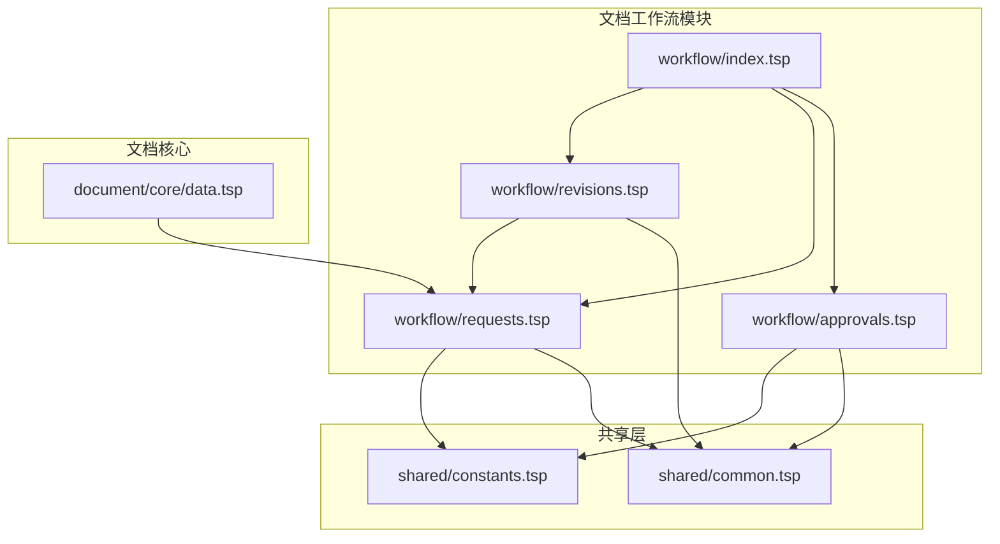
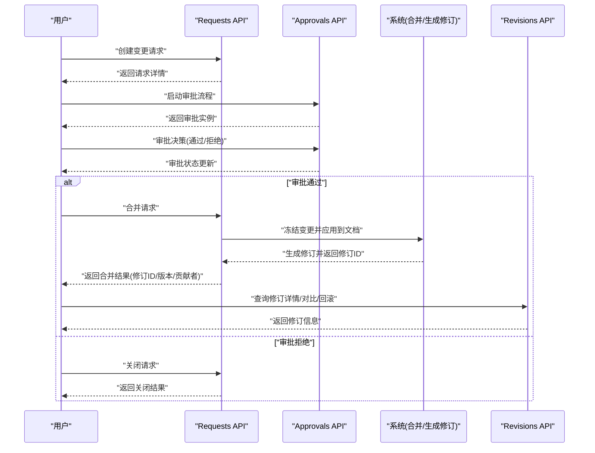
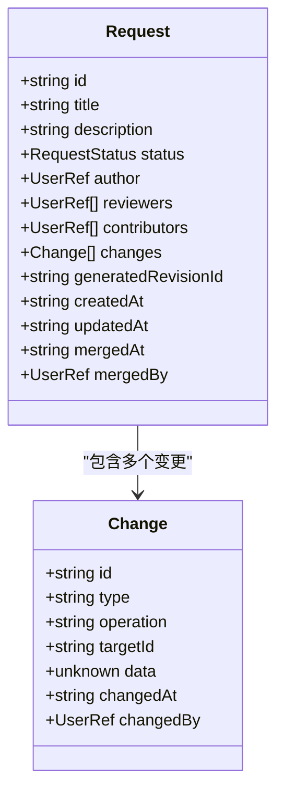
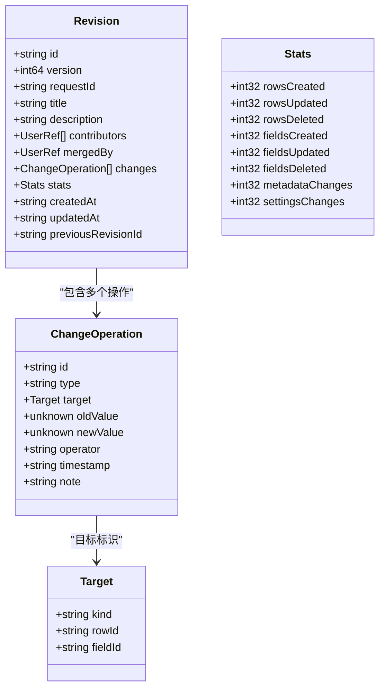
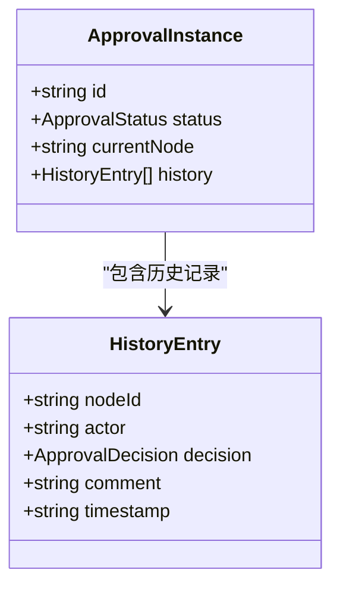
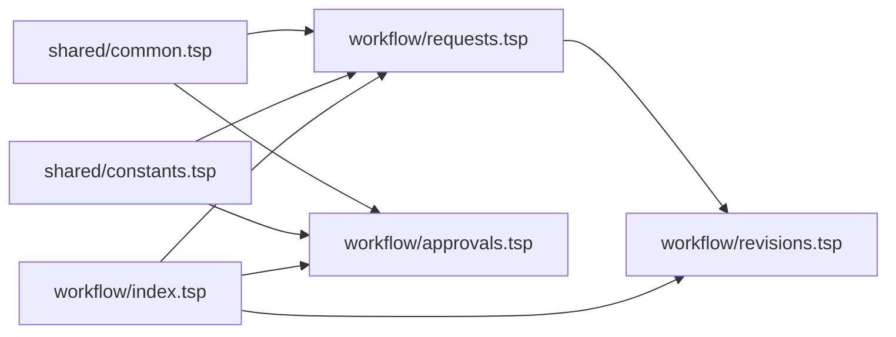
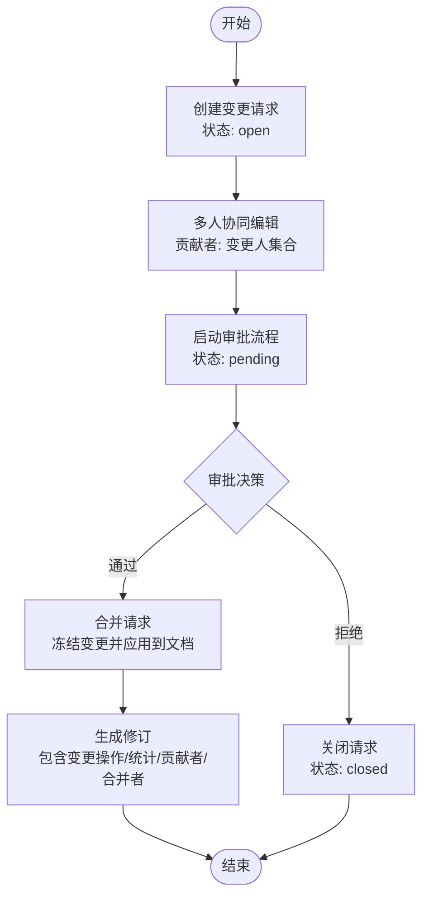

# 工作流层

<cite>
**本文引用的文件**
- [api/document/workflow/index.tsp](file://api/document/workflow/index.tsp)
- [api/document/workflow/requests.tsp](file://api/document/workflow/requests.tsp)
- [api/document/workflow/revisions.tsp](file://api/document/workflow/revisions.tsp)
- [api/document/workflow/approvals.tsp](file://api/document/workflow/approvals.tsp)
- [api/shared/common.tsp](file://api/shared/common.tsp)
- [api/shared/constants.tsp](file://api/shared/constants.tsp)
- [api/document/core/data.tsp](file://api/document/core/data.tsp)
- [api/main.tsp](file://api/main.tsp)
</cite>

## 目录
1. [引言](#引言)
2. [项目结构](#项目结构)
3. [核心组件](#核心组件)
4. [架构总览](#架构总览)
5. [详细组件分析](#详细组件分析)
6. [依赖关系分析](#依赖关系分析)
7. [性能考量](#性能考量)
8. [故障排查指南](#故障排查指南)
9. [结论](#结论)
10. [附录](#附录)

## 引言
本文件面向“工作流层”的三大核心组件：Requests（变更请求）、Revisions（修订历史）、Approvals（审批流程）。文档聚焦于它们的职责边界、数据结构、API 端点与协同工作机制，解释“变更请求作为所有写操作入口”的设计原则，以及“审批先行”如何通过 Request→Revision 链路实现可审计性。同时提供从创建请求、审批到合并生成修订的完整生命周期示例，并说明版本对比与回滚操作的使用方法。

## 项目结构
工作流层位于文档域下，采用按功能域划分的模块化组织方式：
- 文档工作流模块入口：导入并聚合 approvals、requests、revisions 三个子模块
- 共享类型与常量：统一的用户引用、状态枚举、响应包装等基础类型
- 数据层文档：强调所有写操作必须先进入 Request，再经审批合并后生效

图表来源
- [api/document/workflow/index.tsp](file://api/document/workflow/index.tsp#L1-L17)
- [api/document/workflow/requests.tsp](file://api/document/workflow/requests.tsp#L1-L30)
- [api/document/workflow/revisions.tsp](file://api/document/workflow/revisions.tsp#L1-L20)
- [api/document/workflow/approvals.tsp](file://api/document/workflow/approvals.tsp#L1-L20)
- [api/shared/common.tsp](file://api/shared/common.tsp#L1-L40)
- [api/shared/constants.tsp](file://api/shared/constants.tsp#L1-L32)
- [api/document/core/data.tsp](file://api/document/core/data.tsp#L1-L30)

章节来源
- [api/document/workflow/index.tsp](file://api/document/workflow/index.tsp#L1-L17)
- [api/document/core/data.tsp](file://api/document/core/data.tsp#L1-L30)

## 核心组件
- 变更请求 Requests：记录待合并的变更，支持多人协同编辑、冲突检测、状态机（open/merged/closed）与合并生成修订
- 修订历史 Revisions：不可变的历史快照，记录一次完整的变更集合，支持对比、回滚、统计与导出
- 审批流程 Approvals：定义和执行审批工作流，支持多节点、历史记录与决策（通过/拒绝/要求修改）

章节来源
- [api/document/workflow/requests.tsp](file://api/document/workflow/requests.tsp#L1-L40)
- [api/document/workflow/revisions.tsp](file://api/document/workflow/revisions.tsp#L1-L40)
- [api/document/workflow/approvals.tsp](file://api/document/workflow/approvals.tsp#L1-L40)

## 架构总览
工作流层围绕“变更请求→修订历史”的主链路构建，审批流程作为前置控制点，确保每次写入都具备可审计性与合规性。

图表来源
- [api/document/workflow/requests.tsp](file://api/document/workflow/requests.tsp#L202-L390)
- [api/document/workflow/approvals.tsp](file://api/document/workflow/approvals.tsp#L96-L155)
- [api/document/workflow/revisions.tsp](file://api/document/workflow/revisions.tsp#L316-L546)

## 详细组件分析

### 变更请求 Requests
职责与特性
- 记录待合并的变更，支持多人协同编辑
- 状态机：open/merged/closed
- 合并时冻结请求中的变更，应用到文档并生成修订
- 提供冲突检测接口
- 支持关闭/重新打开

关键数据结构
- 变更项 Change：包含变更ID、类型、操作(create/update/delete)、目标ID、变更数据、变更时间、变更人
- 请求 Request：包含请求ID、标题、描述、状态、作者、评审人、贡献者、变更集、生成的修订ID、创建/更新/合并时间、合并者等

API 端点概览
- 列出请求、创建请求、获取请求详情
- 合并请求（支持 squash、message、deleteBranch）
- 关闭/重新打开请求
- 冲突检测

图表来源
- [api/document/workflow/requests.tsp](file://api/document/workflow/requests.tsp#L39-L81)
- [api/document/workflow/requests.tsp](file://api/document/workflow/requests.tsp#L83-L200)
- [api/shared/common.tsp](file://api/shared/common.tsp#L617-L653)
- [api/shared/constants.tsp](file://api/shared/constants.tsp#L13-L31)

章节来源
- [api/document/workflow/requests.tsp](file://api/document/workflow/requests.tsp#L1-L390)
- [api/shared/common.tsp](file://api/shared/common.tsp#L617-L653)
- [api/shared/constants.tsp](file://api/shared/constants.tsp#L13-L31)

### 修订历史 Revisions
职责与特性
- 记录一次完整的变更集合，作为不可变的历史快照
- 与请求关联，记录源请求ID、标题、描述、贡献者、合并者
- 支持变更操作列表、统计、版本对比、目标历史查询、回滚、导出、关联源请求、导出

关键数据结构
- 变更操作 ChangeOperation：记录单一增删改操作，包含操作ID、类型、目标（kind/rowId/fieldId）、旧值/新值、操作人、时间戳、备注
- 修订 Revision：包含修订ID、版本号、源请求ID、标题/描述、贡献者、合并者、变更操作集合、统计、创建/更新时间、前置修订ID

API 端点概览
- 列出修订历史（分页、按贡献者/搜索过滤）
- 获取修订详情
- 查看修订操作列表（分页、按类型/目标过滤）
- 对比两个修订差异（支持按目标类型过滤）
- 查询特定目标的变更历史
- 回滚到指定修订（支持选择性回滚）
- 获取修订的源请求
- 导出修订数据

图表来源
- [api/document/workflow/revisions.tsp](file://api/document/workflow/revisions.tsp#L51-L149)
- [api/document/workflow/revisions.tsp](file://api/document/workflow/revisions.tsp#L158-L314)
- [api/shared/common.tsp](file://api/shared/common.tsp#L617-L653)

章节来源
- [api/document/workflow/revisions.tsp](file://api/document/workflow/revisions.tsp#L1-L546)

### 审批流程 Approvals
职责与特性
- 定义和执行审批工作流，支持多节点、多人审批
- 记录审批历史（节点ID、操作人、决策、备注、时间戳）
- 提供审批实例的获取、启动、决策接口

关键数据结构
- 审批实例 ApprovalInstance：包含实例ID、状态、当前节点、历史记录数组

API 端点概览
- 获取审批流程定义或实例概述
- 启动审批流程
- 获取审批实例详情
- 对审批实例进行决策（通过/拒绝/要求修改）

图表来源
- [api/document/workflow/approvals.tsp](file://api/document/workflow/approvals.tsp#L40-L94)
- [api/shared/constants.tsp](file://api/shared/constants.tsp#L37-L85)

章节来源
- [api/document/workflow/approvals.tsp](file://api/document/workflow/approvals.tsp#L1-L155)
- [api/shared/constants.tsp](file://api/shared/constants.tsp#L37-L85)

### 数据层与工作流的关系
- 数据层文档明确指出：所有写操作（创建、更新、删除）均需先进入变更请求，通过多人协作与审批后，合并生效并生成修订
- 这体现了“变更请求作为所有写操作入口”的设计原则，确保每次变更都可审计、可追溯

章节来源
- [api/document/core/data.tsp](file://api/document/core/data.tsp#L19-L30)

## 依赖关系分析
- Requests 依赖共享的用户引用与状态枚举
- Revisions 依赖 Requests（修订与请求关联）与共享类型
- Approvals 依赖共享的用户引用与状态/决策枚举
- 整体通过 workflow/index.tsp 聚合

图表来源
- [api/document/workflow/index.tsp](file://api/document/workflow/index.tsp#L1-L17)
- [api/document/workflow/requests.tsp](file://api/document/workflow/requests.tsp#L1-L20)
- [api/document/workflow/revisions.tsp](file://api/document/workflow/revisions.tsp#L1-L10)
- [api/document/workflow/approvals.tsp](file://api/document/workflow/approvals.tsp#L1-L10)
- [api/shared/common.tsp](file://api/shared/common.tsp#L1-L40)
- [api/shared/constants.tsp](file://api/shared/constants.tsp#L1-L32)

章节来源
- [api/document/workflow/index.tsp](file://api/document/workflow/index.tsp#L1-L17)
- [api/shared/common.tsp](file://api/shared/common.tsp#L1-L40)
- [api/shared/constants.tsp](file://api/shared/constants.tsp#L1-L32)

## 性能考量
- 合并请求时的冻结与应用：建议在合并前对变更集进行预检与去重，减少重复操作带来的存储与计算开销
- 修订对比与回滚：大范围回滚可能产生大量变更操作，建议限制批量回滚范围或提供选择性回滚策略
- 分页与过滤：修订历史、变更操作列表、目标历史查询均支持分页与过滤，合理设置 page/pageSize 与筛选条件可降低响应体积
- 并发控制：数据行层面使用版本号进行乐观锁，避免合并冲突导致的重试与失败

## 故障排查指南
常见问题与定位
- 合并冲突：使用冲突检测接口提前发现与解决
- 审批状态异常：检查审批实例历史记录，确认决策是否正确
- 合并后未生成修订：确认请求状态为 merged 且合并接口返回修订ID
- 回滚失败：检查目标修订是否存在、是否允许回滚、是否有选择性回滚限制

章节来源
- [api/document/workflow/requests.tsp](file://api/document/workflow/requests.tsp#L377-L390)
- [api/document/workflow/approvals.tsp](file://api/document/workflow/approvals.tsp#L120-L155)
- [api/document/workflow/revisions.tsp](file://api/document/workflow/revisions.tsp#L476-L511)

## 结论
工作流层通过“变更请求→修订历史”的主链路与“审批先行”的控制点，实现了对所有写操作的可审计性与可控性。Requests 提供变更的收集与协同编辑，Approvals 确保合规与责任追踪，Revisions 则提供不可变的历史快照与强大的对比、回滚能力。三者协同，构成完整的文档变更工作流体系。

## 附录

### API 端点一览（按模块）
- Requests
  - 列出请求：GET /doc/{docType}/{docId}/requests
  - 创建请求：POST /doc/{docType}/{docId}/requests
  - 获取请求详情：GET /doc/{docType}/{docId}/requests/{reqId}
  - 合并请求：POST /doc/{docType}/{docId}/requests/{reqId}/merge
  - 关闭请求：POST /doc/{docType}/{docId}/requests/{reqId}/close
  - 重新打开请求：POST /doc/{docType}/{docId}/requests/{reqId}/reopen
  - 冲突检测：GET /doc/{docType}/{docId}/requests/{reqId}/conflicts

- Revisions
  - 列出修订历史：GET /doc/{docType}/{docId}/revisions
  - 获取修订详情：GET /doc/{docType}/{docId}/revisions/{revId}
  - 查看修订操作列表：GET /doc/{docType}/{docId}/revisions/{revId}/operations
  - 对比修订差异：GET /doc/{docType}/{docId}/revisions/{revId}/diff
  - 查询目标变更历史：GET /doc/{docType}/{docId}/revisions/history
  - 回滚到修订：POST /doc/{docType}/{docId}/revisions/{revId}/revert
  - 获取源请求：GET /doc/{docType}/{docId}/revisions/{revId}/request
  - 导出修订：GET /doc/{docType}/{docId}/revisions/{revId}/export

- Approvals
  - 获取审批：GET /doc/{docType}/{docId}/approval
  - 启动审批：POST /doc/{docType}/{docId}/approval/start
  - 获取审批实例：GET /doc/{docType}/{docId}/approval/{instanceId}
  - 审批决策：POST /doc/{docType}/{docId}/approval/{instanceId}/decision

章节来源
- [api/document/workflow/requests.tsp](file://api/document/workflow/requests.tsp#L202-L390)
- [api/document/workflow/revisions.tsp](file://api/document/workflow/revisions.tsp#L323-L546)
- [api/document/workflow/approvals.tsp](file://api/document/workflow/approvals.tsp#L96-L155)

### 生命周期示例：从创建请求到合并生成修订
- 创建请求：提交变更集，状态 open
- 多人协同编辑：贡献者列表记录参与人员
- 启动审批：创建审批实例，状态 pending
- 审批决策：通过则继续，拒绝则关闭请求
- 合并请求：冻结变更并应用到文档，生成修订，状态 merged
- 修订生成：包含变更操作、统计、贡献者、合并者、时间戳等

图表来源
- [api/document/workflow/requests.tsp](file://api/document/workflow/requests.tsp#L244-L347)
- [api/document/workflow/revisions.tsp](file://api/document/workflow/revisions.tsp#L158-L314)
- [api/document/workflow/approvals.tsp](file://api/document/workflow/approvals.tsp#L116-L155)

### 版本对比与回滚
- 版本对比：通过修订差异接口比较两个修订之间的差异，支持按目标类型过滤
- 回滚操作：将文档回滚到指定修订状态，生成新的修订记录此操作；支持选择性回滚

章节来源
- [api/document/workflow/revisions.tsp](file://api/document/workflow/revisions.tsp#L395-L511)