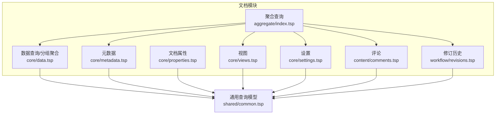
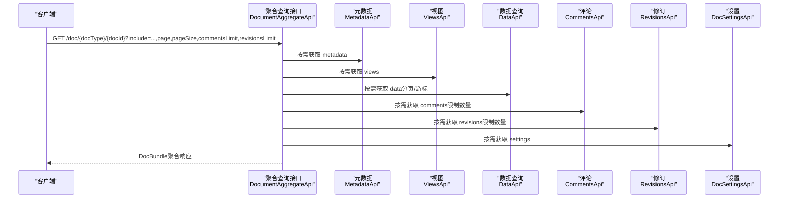
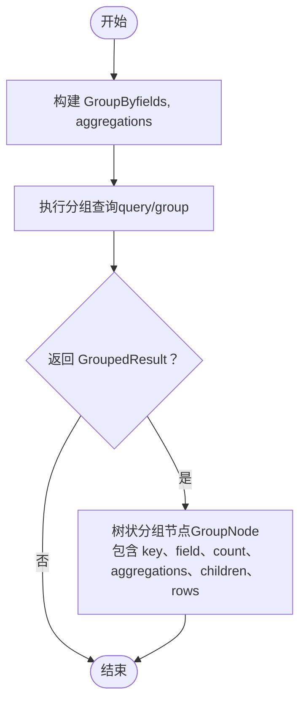
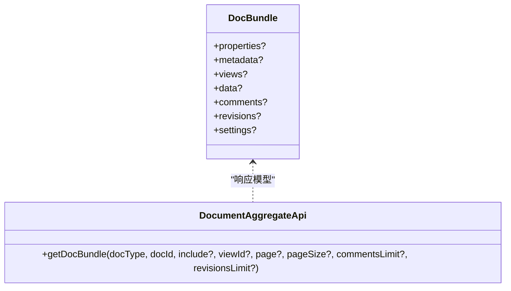
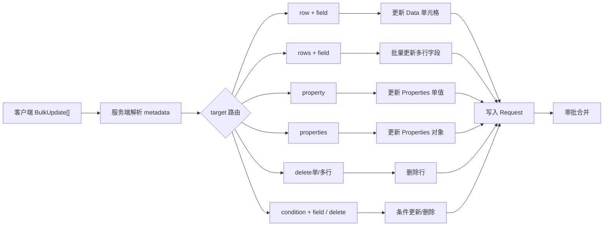
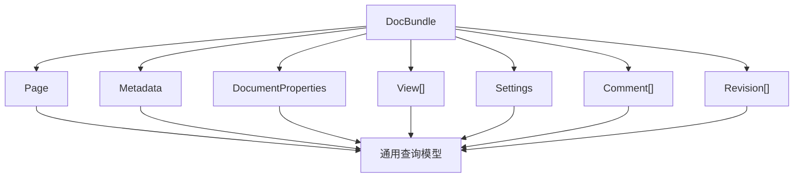

# 查询能力

<cite>
**本文引用的文件**
- [api/document/aggregate/index.tsp](file://api/document/aggregate/index.tsp)
- [api/document/core/data.tsp](file://api/document/core/data.tsp)
- [api/document/core/metadata.tsp](file://api/document/core/metadata.tsp)
- [api/document/core/properties.tsp](file://api/document/core/properties.tsp)
- [api/document/core/views.tsp](file://api/document/core/views.tsp)
- [api/document/core/settings.tsp](file://api/document/core/settings.tsp)
- [api/document/content/comments.tsp](file://api/document/content/comments.tsp)
- [api/document/workflow/revisions.tsp](file://api/document/workflow/revisions.tsp)
- [api/shared/common.tsp](file://api/shared/common.tsp)
- [docs-src/guides/document-model.md](file://docs-src/guides/document-model.md)
- [docs-src/guides/data-operations.md](file://docs-src/guides/data-operations.md)
- [docs-src/guides/examples.md](file://docs-src/guides/examples.md)
- [docs-src/references/api-reference.md](file://docs-src/references/api-reference.md)
- [api/Doc.md](file://api/Doc.md)
</cite>

## 目录
1. [简介](#简介)
2. [项目结构](#项目结构)
3. [核心组件](#核心组件)
4. [架构总览](#架构总览)
5. [详细组件分析](#详细组件分析)
6. [依赖关系分析](#依赖关系分析)
7. [性能考量](#性能考量)
8. [故障排查指南](#故障排查指南)
9. [结论](#结论)
10. [附录](#附录)

## 简介
本文件聚焦 nexusbook-api 的查询能力架构，围绕四大查询能力：Filter（过滤器）、Sort（排序）、Group（分组）、Aggregate（聚合）展开，系统性阐述其实现机制与使用方式；重点说明 DocBundle 聚合查询模式，指导如何通过单次请求获取文档的多个层次数据（如 properties、metadata、data、comments 等），避免多次往返；并给出 DocBundle API 的请求参数（include、page、pageSize、commentsLimit、revisionsLimit 等）与响应结构示例；解释 BulkUpdate 批量更新格式，说明如何使用 target+value 结构进行灵活的数据操作；最后提供页面初始化、文档预览、数据导出等场景下的实际使用示例，展示高效获取与操作文档数据的方法。

## 项目结构
查询能力相关代码主要分布在以下模块：
- 聚合查询：api/document/aggregate/index.tsp
- 数据查询与分组聚合：api/document/core/data.tsp
- 元数据与字段定义：api/document/core/metadata.tsp
- 文档属性：api/document/core/properties.tsp
- 视图配置：api/document/core/views.tsp
- 设置：api/document/core/settings.tsp
- 评论：api/document/content/comments.tsp
- 修订历史：api/document/workflow/revisions.tsp
- 通用查询模型与分页：api/shared/common.tsp
- 文档模型与示例：docs-src/guides/document-model.md、docs-src/guides/data-operations.md、docs-src/guides/examples.md、docs-src/references/api-reference.md、api/Doc.md

图表来源
- [api/document/aggregate/index.tsp](file://api/document/aggregate/index.tsp#L92-L126)
- [api/document/core/data.tsp](file://api/document/core/data.tsp#L313-L536)
- [api/document/core/metadata.tsp](file://api/document/core/metadata.tsp#L160-L210)
- [api/document/core/properties.tsp](file://api/document/core/properties.tsp#L94-L198)
- [api/document/core/views.tsp](file://api/document/core/views.tsp#L28-L84)
- [api/document/core/settings.tsp](file://api/document/core/settings.tsp#L33-L84)
- [api/document/content/comments.tsp](file://api/document/content/comments.tsp#L240-L472)
- [api/document/workflow/revisions.tsp](file://api/document/workflow/revisions.tsp#L316-L547)
- [api/shared/common.tsp](file://api/shared/common.tsp#L205-L478)

章节来源
- [api/document/aggregate/index.tsp](file://api/document/aggregate/index.tsp#L1-L127)
- [api/document/core/data.tsp](file://api/document/core/data.tsp#L313-L536)
- [api/shared/common.tsp](file://api/shared/common.tsp#L205-L478)

## 核心组件
- DocBundle 聚合查询：一次性返回 properties、metadata、views、data、comments、revisions、settings 等多个层次数据，支持 include 选择与分页、commentsLimit/revisionsLimit 限制。
- 通用查询模型：FilterGroup、Sort、GroupBy、Aggregation、Page、GroupedResult 等，支撑数据查询、排序、分组与聚合。
- 数据查询与分组聚合：提供 listRows、queryRows、queryGroupedRows 等接口，支持 filters/sorts/group/page/pageSize/cursor 等参数。
- 批量更新（BulkUpdate）：统一的数据与属性更新入口，target+value 结构灵活，支持单行/多行/单属性/多属性等场景。
- 评论与修订：评论按位置（文档/字段/行/单元格）过滤，修订历史支持对比、回滚、导出等。

章节来源
- [api/document/aggregate/index.tsp](file://api/document/aggregate/index.tsp#L48-L126)
- [api/shared/common.tsp](file://api/shared/common.tsp#L205-L478)
- [api/document/core/data.tsp](file://api/document/core/data.tsp#L313-L536)
- [api/document/core/properties.tsp](file://api/document/core/properties.tsp#L94-L198)
- [api/document/content/comments.tsp](file://api/document/content/comments.tsp#L240-L472)
- [api/document/workflow/revisions.tsp](file://api/document/workflow/revisions.tsp#L316-L547)

## 架构总览
下图展示了 DocBundle 聚合查询的端到端交互，以及与通用查询模型的关系。

图表来源
- [api/document/aggregate/index.tsp](file://api/document/aggregate/index.tsp#L92-L126)
- [api/document/core/metadata.tsp](file://api/document/core/metadata.tsp#L183-L210)
- [api/document/core/views.tsp](file://api/document/core/views.tsp#L86-L171)
- [api/document/core/data.tsp](file://api/document/core/data.tsp#L375-L441)
- [api/document/content/comments.tsp](file://api/document/content/comments.tsp#L246-L282)
- [api/document/workflow/revisions.tsp](file://api/document/workflow/revisions.tsp#L323-L356)
- [api/document/core/settings.tsp](file://api/document/core/settings.tsp#L86-L113)

## 详细组件分析

### Filter（过滤器）
- 通用模型：Filter、FilterGroup、LogicOp
  - Filter 定义字段、运算符与值（单值/多值/区间），支持 eq、ne、in、range、contains、is_empty、is_not_empty 等。
  - FilterGroup 支持逻辑组合（and/or）与嵌套分组，形成复杂条件树。
- 数据查询使用：
  - listRows 支持 query 参数形式的 filter（字符串 DSL）。
  - queryRows 支持结构化 body 中的 filters（FilterGroup）。
- 示例参考：
  - 结构化过滤示例与嵌套逻辑示例见数据操作指南。

章节来源
- [api/shared/common.tsp](file://api/shared/common.tsp#L234-L295)
- [api/document/core/data.tsp](file://api/document/core/data.tsp#L375-L441)
- [docs-src/guides/data-operations.md](file://docs-src/guides/data-operations.md#L339-L381)

### Sort（排序）
- 通用模型：Sort、Direction（asc/desc）
- 数据查询使用：
  - listRows 支持 sort 字符串参数。
  - queryRows 支持 sorts 数组（Sort[]）。
- 示例参考：
  - 列表查询与结构化查询示例见数据操作指南。

章节来源
- [api/shared/common.tsp](file://api/shared/common.tsp#L205-L233)
- [api/document/core/data.tsp](file://api/document/core/data.tsp#L375-L441)
- [docs-src/guides/data-operations.md](file://docs-src/guides/data-operations.md#L85-L103)

### Group（分组）与 Aggregate（聚合）
- 通用模型：GroupBy、Aggregation、AggregationFn（count、sum、avg、min、max）、GroupNode、GroupedResult
- 数据查询使用：
  - queryGroupedRows 专用于分组查询，返回树状分组结果，支持 includeRows 控制是否返回每组明细行。
  - 支持多级分组（fields 顺序定义层级），并在每个层级应用聚合函数。
- 示例参考：
  - 单级/二级/三级分组示例与返回结构示例见 data.tsp 注释与示例文档。

图表来源
- [api/document/core/data.tsp](file://api/document/core/data.tsp#L443-L536)
- [api/shared/common.tsp](file://api/shared/common.tsp#L297-L478)

章节来源
- [api/document/core/data.tsp](file://api/document/core/data.tsp#L313-L536)
- [api/shared/common.tsp](file://api/shared/common.tsp#L297-L478)
- [docs-src/guides/data-operations.md](file://docs-src/guides/data-operations.md#L409-L451)

### DocBundle 聚合查询模式
- 设计目标：一次性获取文档的多个层次数据，避免多次请求，提升页面初始化与预览效率。
- 请求参数：
  - include：逗号分隔的选择项，可选值：properties、metadata、views、data、comments、revisions、settings。
  - viewId：指定视图 ID。
  - page、pageSize：数据分页。
  - commentsLimit、revisionsLimit：限制评论与修订数量。
- 响应结构：DocBundle，包含 properties、metadata、views、data、comments、revisions、settings 等可选字段。
- 使用场景：
  - 页面初始化：一次性拉取渲染所需全部数据。
  - 文档预览：快速获取摘要与关键信息。
  - 数据导出：收集完整文档数据。
- 示例参考：
  - 请求与响应示例见文档模型指南与 API 参考。

图表来源
- [api/document/aggregate/index.tsp](file://api/document/aggregate/index.tsp#L48-L126)
- [api/document/core/metadata.tsp](file://api/document/core/metadata.tsp#L160-L210)
- [api/document/core/properties.tsp](file://api/document/core/properties.tsp#L94-L198)
- [api/document/core/views.tsp](file://api/document/core/views.tsp#L28-L84)
- [api/document/core/data.tsp](file://api/document/core/data.tsp#L375-L441)
- [api/document/content/comments.tsp](file://api/document/content/comments.tsp#L240-L282)
- [api/document/workflow/revisions.tsp](file://api/document/workflow/revisions.tsp#L316-L356)
- [api/document/core/settings.tsp](file://api/document/core/settings.tsp#L33-L84)

章节来源
- [api/document/aggregate/index.tsp](file://api/document/aggregate/index.tsp#L92-L126)
- [docs-src/guides/document-model.md](file://docs-src/guides/document-model.md#L694-L719)
- [docs-src/references/api-reference.md](file://docs-src/references/api-reference.md#L56-L76)
- [api/Doc.md](file://api/Doc.md#L543-L609)

### BulkUpdate 批量更新格式
- 目标（target）灵活结构，支持：
  - 单行：{row: "..."}
  - 单行单字段：{row: "...", field: "..."}
  - 多行同一字段：{rows: ["...","..."], field: "..."}
  - 单个属性：{property: "..."}
  - 多个属性：{properties: true}
  - 删除单行：{row: "...", delete: true}
  - 删除多行：{rows: ["...","..."], delete: true}
  - 条件更新：{condition: {...}, field: "..."}
  - 条件删除：{condition: {...}, delete: true}
- 值（value）支持：
  - 单个原始值（数字/字符串/布尔）
  - 对象（多个字段）
  - 数组（多行不同值）
- 服务端处理要点：
  - 根据 docId 获取 metadata，解析字段类型，转换为类型化值，校验有效性，最终写入指定 Request。
- 使用建议：
  - 统一通过 requestId 工作流进行协同与审计，支持混合更新（数据 + 属性）。

图表来源
- [api/document/core/data.tsp](file://api/document/core/data.tsp#L189-L239)
- [docs-src/guides/data-operations.md](file://docs-src/guides/data-operations.md#L156-L196)

章节来源
- [api/document/core/data.tsp](file://api/document/core/data.tsp#L189-L239)
- [docs-src/guides/data-operations.md](file://docs-src/guides/data-operations.md#L156-L196)

### 评论与修订的查询与限制
- 评论：
  - 支持按位置（文档/字段/行/单元格）过滤，支持 parentId 回复树。
  - 支持分页与查询参数（scope、fieldId、rowId、parentId、page、pageSize）。
- 修订：
  - 支持按时间逆序返回修订列表，支持分页与按贡献者/关键词过滤。
  - 支持修订对比、变更历史查询、回滚、导出等。

章节来源
- [api/document/content/comments.tsp](file://api/document/content/comments.tsp#L246-L472)
- [api/document/workflow/revisions.tsp](file://api/document/workflow/revisions.tsp#L323-L547)

## 依赖关系分析
- DocBundle 依赖各子模块的接口与模型：
  - properties → DocumentProperties
  - metadata → Metadata
  - views → View[]
  - data → Page<Row>
  - comments → Comment[]
  - revisions → Revision[]
  - settings → Settings
- 通用查询模型（FilterGroup、Sort、GroupBy、Aggregation、Page、GroupedResult）被数据查询与分组聚合广泛使用，并被 DocBundle 的 include 选择所间接驱动。

图表来源
- [api/document/aggregate/index.tsp](file://api/document/aggregate/index.tsp#L48-L126)
- [api/shared/common.tsp](file://api/shared/common.tsp#L205-L478)

章节来源
- [api/document/aggregate/index.tsp](file://api/document/aggregate/index.tsp#L48-L126)
- [api/shared/common.tsp](file://api/shared/common.tsp#L205-L478)

## 性能考量
- 减少往返：优先使用 DocBundle 的 include 一次性拉取所需数据，避免多次请求。
- 分页与游标：使用 page/pageSize 与 cursor 进行深分页，避免一次性传输大量数据。
- 限制数量：通过 commentsLimit/revisionsLimit 控制评论与修订的返回数量，降低响应体积。
- 过滤前置：在服务端使用 filters/sorts/group 等参数减少数据量，避免客户端二次过滤。
- 批量操作：使用 BulkUpdate 统一提交，减少网络往返与并发冲突概率。
- 并发控制：使用版本号（version）进行乐观锁，避免冲突导致的重试与失败。

章节来源
- [docs-src/guides/data-operations.md](file://docs-src/guides/data-operations.md#L273-L337)
- [docs-src/guides/examples.md](file://docs-src/guides/examples.md#L482-L540)

## 故障排查指南
- 常见错误码：
  - 文档相关：DOC_NOT_FOUND、DOC_TYPE_UNKNOWN、DOC_ACCESS_DENIED
  - 数据相关：ROW_NOT_FOUND、FIELD_TYPE_MISMATCH、CONSTRAINT_VIOLATION、PAGE_OUT_OF_RANGE
  - 评论相关：COMMENT_NOT_FOUND
  - 请求相关：REQUEST_NOT_FOUND、REQUEST_CONFLICT、REQUEST_ALREADY_CLOSED
  - 用户/组织/工作区相关：USER_NOT_FOUND、ORG_NOT_FOUND、WORKSPACE_NOT_FOUND 等
- 并发冲突：
  - 版本不匹配导致的冲突，需重新获取最新数据并带上正确版本号再提交。
- 请求参数校验：
  - include 值不在允许范围内会导致无效响应，确保使用正确的逗号分隔值。
  - page/pageSize 超出范围或 cursor 无效可能导致分页异常。

章节来源
- [api/shared/common.tsp](file://api/shared/common.tsp#L80-L151)
- [docs-src/guides/data-operations.md](file://docs-src/guides/data-operations.md#L234-L272)

## 结论
本架构以 DocBundle 为核心，结合通用查询模型与数据查询接口，提供了强大的 Filter、Sort、Group、Aggregate 能力，既能满足复杂业务查询需求，又能通过 include 与分页/游标等机制显著降低网络往返与响应体积。BulkUpdate 以 target+value 的灵活结构统一了数据与属性的更新路径，配合 requestId 工作流实现协同与审计。在页面初始化、文档预览、数据导出等场景下，建议优先采用 DocBundle 与结构化查询，以获得更高的性能与更好的用户体验。

## 附录
- DocBundle 请求参数与响应示例参考：
  - 请求示例与响应示例见文档模型指南与 API 参考。
- 实际使用示例参考：
  - 页面初始化、文档预览、数据导出等场景示例见示例指南与数据操作指南。

章节来源
- [docs-src/guides/document-model.md](file://docs-src/guides/document-model.md#L694-L719)
- [docs-src/references/api-reference.md](file://docs-src/references/api-reference.md#L56-L76)
- [api/Doc.md](file://api/Doc.md#L543-L609)
- [docs-src/guides/examples.md](file://docs-src/guides/examples.md#L1-L210)
- [docs-src/guides/data-operations.md](file://docs-src/guides/data-operations.md#L397-L403)