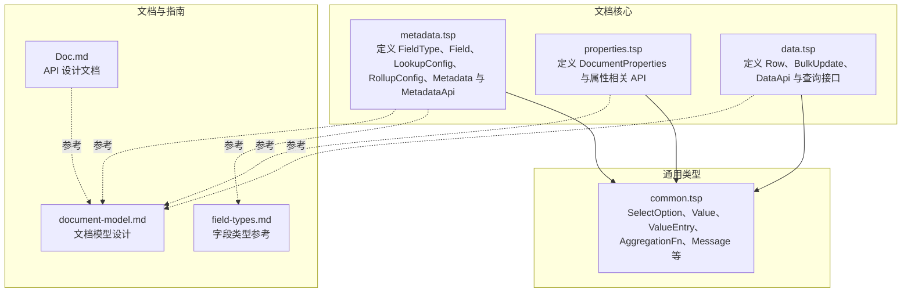
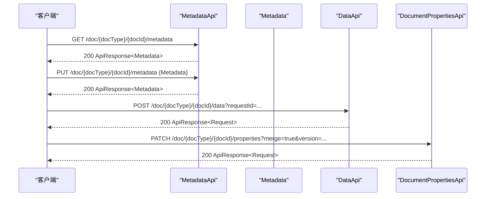
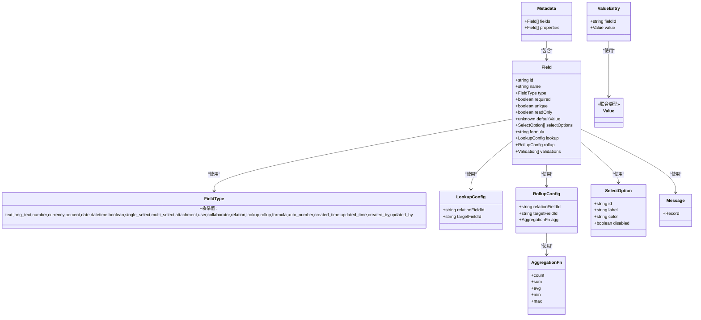

# 字段定义

<cite>
**本文引用的文件**
- [metadata.tsp](file://api/document/core/metadata.tsp)
- [properties.tsp](file://api/document/core/properties.tsp)
- [data.tsp](file://api/document/core/data.tsp)
- [common.tsp](file://api/shared/common.tsp)
- [field-types.md](file://docs-src/references/field-types.md)
- [document-model.md](file://docs-src/guides/document-model.md)
- [Doc.md](file://api/Doc.md)
</cite>

## 目录
1. [简介](#简介)
2. [项目结构](#项目结构)
3. [核心组件](#核心组件)
4. [架构总览](#架构总览)
5. [详细组件分析](#详细组件分析)
6. [依赖分析](#依赖分析)
7. [性能考量](#性能考量)
8. [故障排查指南](#故障排查指南)
9. [结论](#结论)
10. [附录](#附录)

## 简介
本章节聚焦于 NexusBook 文档模型中的 Metadata（元数据）与 Field（字段）定义，阐明其作为数据结构蓝图的核心作用：统一定义数据行字段（fields）与文档属性字段（properties），并通过接口为前端渲染与校验提供依据。文档将系统梳理 FieldType 枚举、Field 模型配置项、计算字段（formula、lookup、rollup）与验证规则（validations）的工作机制，并给出实际示例与更新元数据的 API 使用方法。

## 项目结构
围绕字段定义与元数据，相关代码主要分布在以下模块：
- 文档核心元数据与接口：api/document/core/metadata.tsp
- 文档属性与接口：api/document/core/properties.tsp
- 数据行与批量更新：api/document/core/data.tsp
- 通用类型与值结构：api/shared/common.tsp
- 字段类型参考文档：docs-src/references/field-types.md
- 文档模型设计指南：docs-src/guides/document-model.md
- API 设计文档：api/Doc.md

图表来源
- [metadata.tsp](file://api/document/core/metadata.tsp#L1-L211)
- [properties.tsp](file://api/document/core/properties.tsp#L1-L441)
- [data.tsp](file://api/document/core/data.tsp#L1-L726)
- [common.tsp](file://api/shared/common.tsp#L1-L742)
- [field-types.md](file://docs-src/references/field-types.md#L1-L454)
- [document-model.md](file://docs-src/guides/document-model.md#L143-L204)
- [Doc.md](file://api/Doc.md#L106-L167)

章节来源
- [metadata.tsp](file://api/document/core/metadata.tsp#L1-L211)
- [properties.tsp](file://api/document/core/properties.tsp#L1-L441)
- [data.tsp](file://api/document/core/data.tsp#L1-L726)
- [common.tsp](file://api/shared/common.tsp#L1-L742)
- [field-types.md](file://docs-src/references/field-types.md#L1-L454)
- [document-model.md](file://docs-src/guides/document-model.md#L143-L204)
- [Doc.md](file://api/Doc.md#L106-L167)

## 核心组件
- FieldType 枚举：覆盖文本、数值、日期时间、布尔、选择、附件、用户、协作者、关联、计算（lookup、rollup、formula）、自动编号、系统字段（created_time、updated_time、created_by、updated_by）等。
- Field 模型：字段标识、名称、类型、必填、唯一、只读、默认值、选择类字段选项、计算配置（formula、lookup、rollup）、验证规则（validations）。
- LookupConfig/RollupConfig：分别用于关联字段与目标字段的查找与汇总配置。
- Metadata 模型：fields（数据行字段定义）与 properties（文档属性字段定义）集合。
- MetadataApi 接口：提供获取与更新元数据的能力。

章节来源
- [metadata.tsp](file://api/document/core/metadata.tsp#L29-L52)
- [metadata.tsp](file://api/document/core/metadata.tsp#L65-L110)
- [metadata.tsp](file://api/document/core/metadata.tsp#L112-L145)
- [metadata.tsp](file://api/document/core/metadata.tsp#L160-L181)
- [metadata.tsp](file://api/document/core/metadata.tsp#L183-L211)

## 架构总览
Metadata 作为数据结构蓝图，与 Data、Properties、Views 等共同构成文档模型。Metadata 与 Data 强约束：Data.values[].fieldId 必须存在于 Metadata.fields 中；Properties 与 Data 分离，避免交叉污染。前端通过 GET /doc/{docType}/{docId}/metadata 获取字段定义，结合 validations 与类型信息进行渲染与校验；通过 PUT /doc/{docType}/{docId}/metadata 更新字段定义。

图表来源
- [metadata.tsp](file://api/document/core/metadata.tsp#L183-L211)
- [data.tsp](file://api/document/core/data.tsp#L565-L720)
- [properties.tsp](file://api/document/core/properties.tsp#L339-L440)

## 详细组件分析

### FieldType 枚举与字段类型体系
- 文本类：text、long_text
- 数值类：number、currency、percent
- 日期时间类：date、datetime、duration
- 布尔类：boolean
- 选择类：single_select、multi_select、rating
- 关联类：attachment、user、collaborator、relation
- 计算类：lookup、rollup、formula、auto_number
- 系统字段：created_time、updated_time、created_by、updated_by

章节来源
- [metadata.tsp](file://api/document/core/metadata.tsp#L29-L52)
- [field-types.md](file://docs-src/references/field-types.md#L1-L120)

### Field 模型与配置项
- id：字段唯一标识，用于 Data.values[].fieldId 与属性更新 target。
- name：字段显示名称。
- type：字段类型，来自 FieldType。
- required：是否必填。
- unique：是否唯一。
- readOnly：是否只读。
- defaultValue：默认值。
- selectOptions：选择类字段的选项集合（SelectOption）。
- formula：公式字段的表达式字符串。
- lookup：查找配置（relationFieldId、targetFieldId）。
- rollup：汇总配置（relationFieldId、targetFieldId、agg）。
- validations：验证规则数组，包含 ruleType、config、message（多语言）。

章节来源
- [metadata.tsp](file://api/document/core/metadata.tsp#L65-L110)
- [common.tsp](file://api/shared/common.tsp#L499-L523)
- [common.tsp](file://api/shared/common.tsp#L297-L303)
- [common.tsp](file://api/shared/common.tsp#L69-L78)

### LookupConfig 与 RollupConfig
- LookupConfig：通过 relationFieldId 指向关联字段，targetFieldId 指向目标字段，用于从关联记录中查找值。
- RollupConfig：在关联字段基础上，对目标字段应用聚合函数（count、sum、avg、min、max）进行汇总。

章节来源
- [metadata.tsp](file://api/document/core/metadata.tsp#L112-L145)
- [common.tsp](file://api/shared/common.tsp#L297-L303)

### Metadata 模型与 fields/properties
- fields：数据行字段定义（表格列），用于约束 Data.values 的结构与类型。
- properties：文档属性字段定义（文档元信息字段），用于 DocumentProperties.properties 的值结构与类型。

章节来源
- [metadata.tsp](file://api/document/core/metadata.tsp#L160-L181)
- [properties.tsp](file://api/document/core/properties.tsp#L94-L162)

### 计算字段工作机制
- formula：基于表达式的计算字段，表达式语法与支持的运算符、函数在字段类型参考中有说明。
- lookup：从关联记录中查找目标字段的值，常用于跨行取值。
- rollup：对关联记录的目标字段进行聚合计算，聚合函数来自 AggregationFn。

章节来源
- [field-types.md](file://docs-src/references/field-types.md#L316-L387)
- [metadata.tsp](file://api/document/core/metadata.tsp#L112-L145)
- [common.tsp](file://api/shared/common.tsp#L297-L303)

### 验证规则（validations）
- validations：数组结构，包含 ruleType（规则类型）、config（配置）、message（多语言消息）。
- 多语言消息：Message 为语言代码到消息文本的映射，支持任意语言代码键。

章节来源
- [metadata.tsp](file://api/document/core/metadata.tsp#L99-L110)
- [common.tsp](file://api/shared/common.tsp#L69-L78)

### 值类型与 ValueEntry
- Value：统一的值联合类型，涵盖所有字段类型的值包装结构（如 text、number、date、datetime、boolean、single_select、multi_select、attachment、user、collaborator、relation、rating、duration）。
- ValueEntry：字段ID与值的配对结构，用于 Data.Row.values 与 DocumentProperties.properties 的值载体。

章节来源
- [common.tsp](file://api/shared/common.tsp#L710-L742)

### API 使用：获取与更新元数据
- 获取元数据：GET /doc/{docType}/{docId}/metadata 返回 ApiResponse<Metadata>，用于渲染与校验。
- 更新元数据：PUT /doc/{docType}/{docId}/metadata 传入 Metadata，需具备管理权限。

章节来源
- [metadata.tsp](file://api/document/core/metadata.tsp#L183-L211)

### 实际示例与最佳实践
- 字段类型参考示例：包含 text、long_text、number、currency、percent、boolean、date、datetime、duration、single_select、multi_select、rating、attachment、user、collaborator、relation、lookup、rollup、formula、auto_number、系统字段等的值类型与配置示例。
- 文档模型设计指南：强调 Metadata 定义字段，Data 必须遵守；Properties 与 Data 分离，避免交叉污染。
- API 设计文档：提供 Metadata 与 Field 的数据结构概览与示例。

章节来源
- [field-types.md](file://docs-src/references/field-types.md#L1-L454)
- [document-model.md](file://docs-src/guides/document-model.md#L143-L204)
- [Doc.md](file://api/Doc.md#L106-L167)

## 依赖分析
- Metadata 依赖 FieldType（字段类型）、SelectOption（选择类选项）、Value/ValueEntry（值结构）、Message（多语言消息）、AggregationFn（rollup 聚合函数）。
- Data 与 Properties 通过 ValueEntry 与 Metadata 的字段定义建立强约束关系，确保值类型与结构一致。
- MetadataApi 与 DataApi、DocumentPropertiesApi 共同支撑文档的字段定义、数据行与属性的生命周期管理。

图表来源
- [metadata.tsp](file://api/document/core/metadata.tsp#L29-L52)
- [metadata.tsp](file://api/document/core/metadata.tsp#L65-L110)
- [metadata.tsp](file://api/document/core/metadata.tsp#L112-L145)
- [metadata.tsp](file://api/document/core/metadata.tsp#L160-L181)
- [common.tsp](file://api/shared/common.tsp#L499-L523)
- [common.tsp](file://api/shared/common.tsp#L69-L78)
- [common.tsp](file://api/shared/common.tsp#L297-L303)
- [common.tsp](file://api/shared/common.tsp#L710-L742)

章节来源
- [metadata.tsp](file://api/document/core/metadata.tsp#L29-L52)
- [metadata.tsp](file://api/document/core/metadata.tsp#L65-L110)
- [metadata.tsp](file://api/document/core/metadata.tsp#L112-L145)
- [metadata.tsp](file://api/document/core/metadata.tsp#L160-L181)
- [common.tsp](file://api/shared/common.tsp#L297-L303)
- [common.tsp](file://api/shared/common.tsp#L499-L523)
- [common.tsp](file://api/shared/common.tsp#L69-L78)
- [common.tsp](file://api/shared/common.tsp#L710-L742)

## 性能考量
- 字段类型与值结构的统一设计，有助于前端在渲染与校验阶段减少类型判断成本。
- 通过 validations 与多语言消息，可在客户端进行前置校验，降低无效请求与服务端压力。
- 批量更新（BulkUpdate）与变更请求（Request）工作流，避免频繁单行操作带来的网络与并发压力。

[本节为通用指导，不直接分析具体文件]

## 故障排查指南
- 字段类型不匹配：当 Data.values[].fieldId 不存在于 Metadata.fields 时，可能出现类型不匹配错误。请检查字段定义与值结构。
- 唯一性冲突：当 required/unique 配置导致重复值时，服务端会返回约束违规错误。请调整字段配置或修正数据。
- 计算字段异常：lookup/rollup 配置错误（relationFieldId 或 targetFieldId 不正确）会导致计算失败。请核对关联字段与目标字段。
- 验证规则失败：validations.ruleType 与 config 不符合预期，或多语言消息缺失导致提示不友好。请完善验证规则与 message。

章节来源
- [common.tsp](file://api/shared/common.tsp#L80-L123)
- [metadata.tsp](file://api/document/core/metadata.tsp#L99-L110)

## 结论
Metadata 与 Field 作为 NexusBook 文档模型的蓝图，通过统一的字段类型体系、严格的值结构与验证规则，确保数据行与文档属性的一致性与可审计性。借助 MetadataApi、DataApi 与 DocumentPropertiesApi，前端可高效完成渲染、校验与变更管理。合理配置 formula、lookup、rollup 与 validations，可显著提升业务灵活性与用户体验。

[本节为总结性内容，不直接分析具体文件]

## 附录
- 字段类型参考与示例：见字段类型参考文档。
- 文档模型设计与最佳实践：见文档模型设计指南与 API 设计文档。
- 元数据与字段定义示例：见文档模型设计指南与 API 设计文档中的示例。

章节来源
- [field-types.md](file://docs-src/references/field-types.md#L1-L454)
- [document-model.md](file://docs-src/guides/document-model.md#L143-L204)
- [Doc.md](file://api/Doc.md#L106-L167)