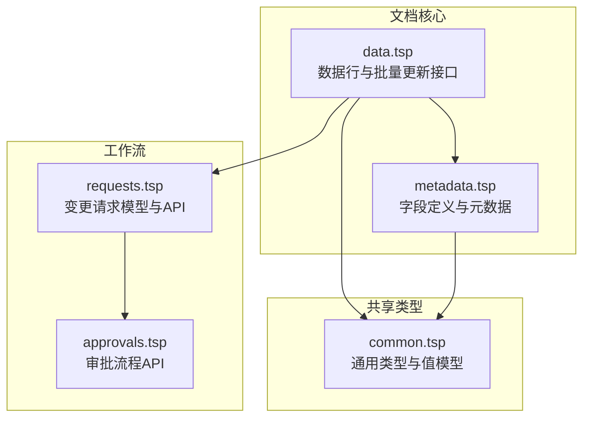
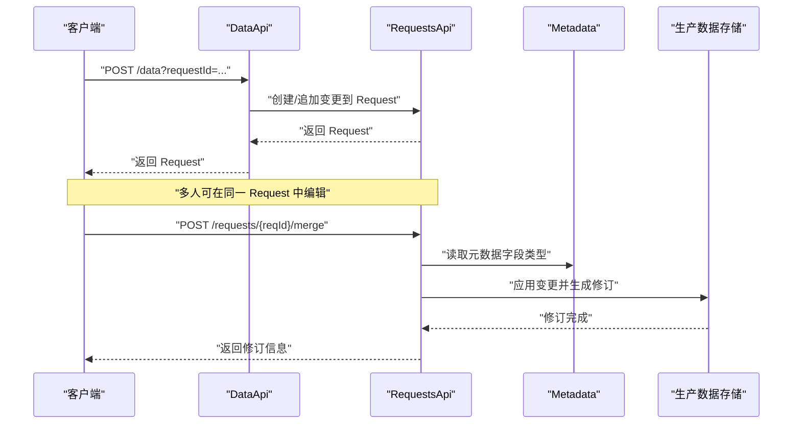
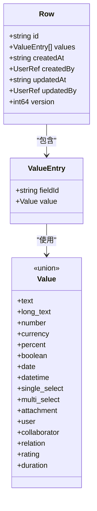
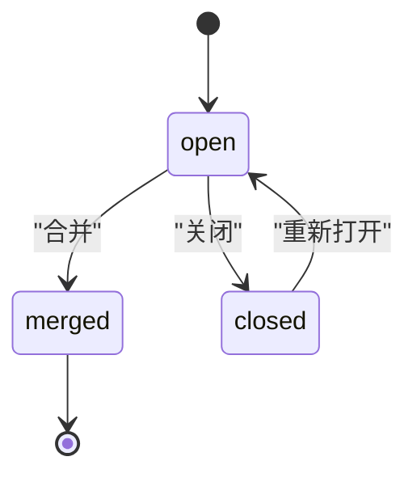
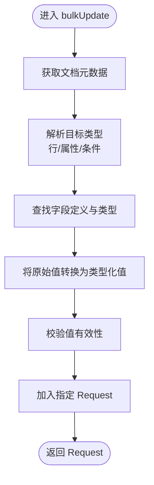
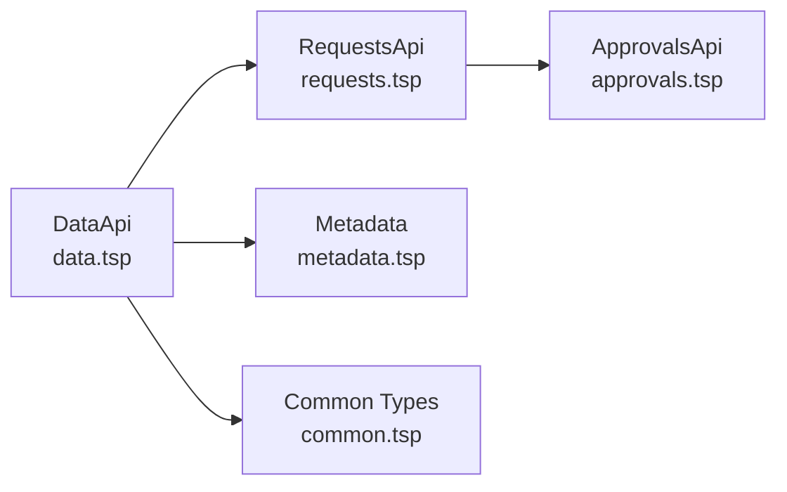

# 数据行

<cite>
**本文引用的文件**
- [api/document/core/data.tsp](file://api/document/core/data.tsp)
- [api/document/core/metadata.tsp](file://api/document/core/metadata.tsp)
- [api/document/workflow/requests.tsp](file://api/document/workflow/requests.tsp)
- [api/document/workflow/approvals.tsp](file://api/document/workflow/approvals.tsp)
- [api/shared/common.tsp](file://api/shared/common.tsp)
- [docs-src/references/field-types.md](file://docs-src/references/field-types.md)
</cite>

## 目录
1. [简介](#简介)
2. [项目结构](#项目结构)
3. [核心组件](#核心组件)
4. [架构总览](#架构总览)
5. [详细组件分析](#详细组件分析)
6. [依赖分析](#依赖分析)
7. [性能考虑](#性能考虑)
8. [故障排查指南](#故障排查指南)
9. [结论](#结论)
10. [附录](#附录)

## 简介
本章节面向“数据行（Row）”这一核心数据存储单元，系统性阐述其在文档模型中的角色与职责，包括：
- Row 的结构与字段语义（id、values、createdAt、createdBy、version 等）
- 变更工作流：所有创建、更新、删除操作均先进入变更请求（Request），经审批后生效
- 灵活的批量更新（BulkUpdate）设计：target（目标定位：单行、多行、字段、属性）与 value（原始值、对象、数组）的多种组合模式
- 服务端如何基于 metadata 自动解析原始值为类型化值
- API 端点：listRows、queryRows、createRow、updateRow、deleteRow、bulkUpdate 的行为与典型使用场景
- cURL 示例与最佳实践

## 项目结构
围绕数据行与变更工作流的相关文件组织如下：
- 数据行与批量更新接口定义：api/document/core/data.tsp
- 元数据与字段类型定义：api/document/core/metadata.tsp
- 变更请求与审批流程：api/document/workflow/requests.tsp、api/document/workflow/approvals.tsp
- 通用类型与值模型：api/shared/common.tsp
- 字段类型参考文档：docs-src/references/field-types.md

图表来源
- [api/document/core/data.tsp](file://api/document/core/data.tsp#L375-L726)
- [api/document/core/metadata.tsp](file://api/document/core/metadata.tsp#L160-L211)
- [api/document/workflow/requests.tsp](file://api/document/workflow/requests.tsp#L83-L201)
- [api/document/workflow/approvals.tsp](file://api/document/workflow/approvals.tsp#L96-L156)
- [api/shared/common.tsp](file://api/shared/common.tsp#L710-L742)

章节来源
- [api/document/core/data.tsp](file://api/document/core/data.tsp#L375-L726)
- [api/document/core/metadata.tsp](file://api/document/core/metadata.tsp#L160-L211)
- [api/document/workflow/requests.tsp](file://api/document/workflow/requests.tsp#L83-L201)
- [api/document/workflow/approvals.tsp](file://api/document/workflow/approvals.tsp#L96-L156)
- [api/shared/common.tsp](file://api/shared/common.tsp#L710-L742)

## 核心组件
- Row：数据行模型，包含行标识、字段值集合、审计信息与版本号
- BulkUpdate：灵活批量更新模型，支持多种目标与值组合
- Request：变更请求模型，承载待合并的变更项
- Metadata：文档元数据，包含字段定义与属性定义
- 通用值模型 Value/ValueEntry：统一的字段值结构，配合 metadata 实现类型化

章节来源
- [api/document/core/data.tsp](file://api/document/core/data.tsp#L241-L311)
- [api/document/core/data.tsp](file://api/document/core/data.tsp#L189-L239)
- [api/document/workflow/requests.tsp](file://api/document/workflow/requests.tsp#L83-L201)
- [api/document/core/metadata.tsp](file://api/document/core/metadata.tsp#L160-L181)
- [api/shared/common.tsp](file://api/shared/common.tsp#L710-L742)

## 架构总览
数据行的变更工作流遵循“先请求、后合并”的模式：
- 所有写操作（创建、更新、删除）不直接作用于生产数据，而是进入变更请求（Request）
- 变更请求可多人协同编辑，支持审批流程
- 合并（merge）后，变更生效并生成修订记录；未合并的变更可通过 requestId 叠加预览

图表来源
- [api/document/core/data.tsp](file://api/document/core/data.tsp#L538-L725)
- [api/document/workflow/requests.tsp](file://api/document/workflow/requests.tsp#L202-L391)
- [api/document/core/metadata.tsp](file://api/document/core/metadata.tsp#L183-L211)

## 详细组件分析

### Row 模型与结构
- 字段说明
  - id：行唯一标识
  - values：字段值集合，元素为 ValueEntry，包含 fieldId 与类型化值
  - createdAt/createdBy：创建时间与创建者
  - updatedAt/updatedBy：更新时间与更新者
  - version：版本号，用于乐观锁并发控制
- 与通用值模型的关系
  - ValueEntry.value 采用统一的 Value 联合类型，确保字段值的类型安全
- 审计与版本
  - 通过 createdAt/createdBy/updatedAt/updatedBy 记录生命周期
  - 通过 version 实现乐观锁，避免并发覆盖

图表来源
- [api/document/core/data.tsp](file://api/document/core/data.tsp#L241-L311)
- [api/shared/common.tsp](file://api/shared/common.tsp#L710-L742)

章节来源
- [api/document/core/data.tsp](file://api/document/core/data.tsp#L241-L311)
- [api/shared/common.tsp](file://api/shared/common.tsp#L710-L742)

### 变更工作流：Request 与审批
- 写操作进入 Request
  - createRow/updateRow/deleteRow/bulkUpdate 的写操作均返回 Request，表示变更已进入待合并状态
- Request 状态与流转
  - open/merged/closed 三态，支持多人编辑、评审人与合并策略
- 合并后生成修订
  - 合并成功后生成修订记录，记录贡献者与变更历史
- 审批流程
  - 可结合审批 API 发起与跟踪审批实例，决定是否允许合并

图表来源
- [api/document/workflow/requests.tsp](file://api/document/workflow/requests.tsp#L83-L201)
- [api/document/workflow/approvals.tsp](file://api/document/workflow/approvals.tsp#L96-L156)

章节来源
- [api/document/core/data.tsp](file://api/document/core/data.tsp#L538-L725)
- [api/document/workflow/requests.tsp](file://api/document/workflow/requests.tsp#L202-L391)
- [api/document/workflow/approvals.tsp](file://api/document/workflow/approvals.tsp#L96-L156)

### 灵活的 BulkUpdate 设计
- 目标（target）支持多种定位方式
  - 单行：{row: "row-1"}
  - 单行单字段：{row: "row-1", field: "price"}
  - 多行同一字段：{rows: ["row-1","row-2"], field: "status"}
  - 文档属性：{property: "amount"} 或 {properties: true}
  - 删除：{row: "row-1", delete: true} 或 {rows: ["row-1","row-2"], delete: true}
  - 条件更新/删除：{condition: {...}, field: "status"} 或 {condition: {...}, delete: true}
- 值（value）支持三种形态
  - 单个原始值：99.99、"iPhone 15"、true
  - 对象（多字段）：{price: 99.99, name: "iPhone"}
  - 数组（多行不同值）：[99.99, 88.88, 77.77]
- 服务端解析与类型化
  - 依据 docId 获取 Metadata，解析字段定义与类型
  - 将原始值转换为类型化值（如 text、number、currency、date 等）
  - 对值进行有效性校验，再加入指定 Request

图表来源
- [api/document/core/data.tsp](file://api/document/core/data.tsp#L658-L667)
- [api/document/core/metadata.tsp](file://api/document/core/metadata.tsp#L160-L181)
- [api/shared/common.tsp](file://api/shared/common.tsp#L710-L742)

章节来源
- [api/document/core/data.tsp](file://api/document/core/data.tsp#L189-L239)
- [api/document/core/data.tsp](file://api/document/core/data.tsp#L658-L667)
- [api/document/core/metadata.tsp](file://api/document/core/metadata.tsp#L160-L181)
- [api/shared/common.tsp](file://api/shared/common.tsp#L710-L742)

### API 端点与使用示例

#### 列表与查询
- listRows
  - 支持分页与简单 DSL 查询参数（page/pageSize/sort/filter/group/cursor）
  - 支持通过 requestId 叠加 Request 变更，预览变更效果
  - 支持 includeChanges 返回变更标记
- queryRows
  - 结构化查询体（filters/sorts/group/page/pageSize/cursor）
  - 支持 requestId 叠加视图
- queryGroupedRows
  - 专门用于分组与聚合，返回树状分组结果
  - 支持 includeRows 返回每组实际数据行

章节来源
- [api/document/core/data.tsp](file://api/document/core/data.tsp#L404-L441)
- [api/document/core/data.tsp](file://api/document/core/data.tsp#L442-L537)

#### 单行详情
- getRow
  - 返回单条数据行详情
  - 支持 requestId 叠加视图与 includeChanges

章节来源
- [api/document/core/data.tsp](file://api/document/core/data.tsp#L678-L688)

#### 写操作（进入 Request）
- createRow
  - 创建数据行并加入 Request
  - 若指定 requestId 则追加到该请求，否则创建新请求或追加到默认请求
- updateRow
  - 更新数据行并加入 Request
- deleteRow
  - 删除数据行并加入 Request
- bulkUpdate
  - 批量更新数据与属性，支持上述多种 target/value 组合
  - 返回 Request，等待合并生效

章节来源
- [api/document/core/data.tsp](file://api/document/core/data.tsp#L538-L725)

#### cURL 使用示例（基于接口注释）
- 列出数据（支持 requestId 与 includeChanges）
  - GET /api/v1/doc/{docType}/{docId}/data?requestId={reqId}&includeChanges=true
- 结构化查询
  - POST /api/v1/doc/{docType}/{docId}/data/query
  - Body：QueryRequest（filters/sorts/group/page/pageSize/cursor）
- 分组查询
  - POST /api/v1/doc/{docType}/{docId}/data/query/group
  - Body：QueryRequest（group/aggregations）
- 创建数据行（进入 Request）
  - POST /api/v1/doc/{docType}/{docId}/data?requestId={reqId}
  - Body：Row
- 批量更新（进入 Request）
  - POST /api/v1/doc/{docType}/{docId}/data/bulk?requestId={reqId}
  - Body：BulkUpdate[]
- 更新数据行（进入 Request）
  - PUT /api/v1/doc/{docType}/{docId}/data/{rowId}?requestId={reqId}
  - Body：Row
- 删除数据行（进入 Request）
  - DELETE /api/v1/doc/{docType}/{docId}/data/{rowId}?requestId={reqId}

章节来源
- [api/document/core/data.tsp](file://api/document/core/data.tsp#L404-L441)
- [api/document/core/data.tsp](file://api/document/core/data.tsp#L442-L537)
- [api/document/core/data.tsp](file://api/document/core/data.tsp#L538-L725)

## 依赖分析
- Row 依赖
  - ValueEntry/Value：统一字段值结构
  - UserRef：审计信息中的用户引用
- BulkUpdate 依赖
  - Metadata：根据字段定义解析类型
  - Request：写操作最终落至 Request
- 变更工作流依赖
  - RequestsApi：创建/合并/关闭/重开/冲突检查
  - ApprovalsApi：审批流程的发起与决策

图表来源
- [api/document/core/data.tsp](file://api/document/core/data.tsp#L375-L726)
- [api/document/workflow/requests.tsp](file://api/document/workflow/requests.tsp#L202-L391)
- [api/document/workflow/approvals.tsp](file://api/document/workflow/approvals.tsp#L96-L156)
- [api/document/core/metadata.tsp](file://api/document/core/metadata.tsp#L160-L181)
- [api/shared/common.tsp](file://api/shared/common.tsp#L710-L742)

章节来源
- [api/document/core/data.tsp](file://api/document/core/data.tsp#L375-L726)
- [api/document/workflow/requests.tsp](file://api/document/workflow/requests.tsp#L202-L391)
- [api/document/workflow/approvals.tsp](file://api/document/workflow/approvals.tsp#L96-L156)
- [api/document/core/metadata.tsp](file://api/document/core/metadata.tsp#L160-L181)
- [api/shared/common.tsp](file://api/shared/common.tsp#L710-L742)

## 性能考虑
- 分页与游标
  - listRows 支持 page/pageSize 与 cursor，建议在大数据量场景使用 cursor 实现深分页
- 结构化查询
  - queryRows 支持 filters/sorts/group，合理使用索引与分组可降低查询成本
- 批量更新
  - bulkUpdate 一次提交多条变更，减少往返次数；但注意单次请求体量与服务器处理能力
- 叠加视图
  - requestId 叠加 Request 变更会增加计算成本，仅在需要预览时启用

## 故障排查指南
- 常见错误码
  - ROW_NOT_FOUND：行不存在
  - FIELD_TYPE_MISMATCH：字段类型不匹配
  - REQUEST_NOT_FOUND / REQUEST_CONFLICT：请求不存在或存在冲突
  - APPROVAL_NOT_FOUND / APPROVAL_INVALID_STATE：审批不存在或状态非法
- 并发冲突
  - 更新时需提供正确 version，避免乐观锁冲突
- 审批与合并
  - 合并前检查冲突（getRequestConflicts），确保无冲突后再合并
  - 合并后关注返回的 revisionId 与 contributors，确认变更历史完整

章节来源
- [api/shared/common.tsp](file://api/shared/common.tsp#L80-L152)
- [api/document/workflow/requests.tsp](file://api/document/workflow/requests.tsp#L349-L391)

## 结论
数据行（Row）是文档模型中最核心的数据单元，配合变更请求（Request）与审批流程，实现了“先请求、后合并”的安全写入范式。BulkUpdate 通过灵活的目标与值组合，简化了客户端的使用复杂度，服务端基于元数据自动解析类型，保证了数据一致性与扩展性。通过合理的查询与分页策略，可在大规模数据场景下保持良好的性能与用户体验。

## 附录

### 字段类型与值映射参考
- 字段类型覆盖文本、数值、日期时间、选择、附件、用户、关联、计算与系统字段
- 值映射表：不同字段类型对应统一的 Value 联合类型，便于服务端解析与校验

章节来源
- [docs-src/references/field-types.md](file://docs-src/references/field-types.md#L439-L461)
- [api/shared/common.tsp](file://api/shared/common.tsp#L710-L742)