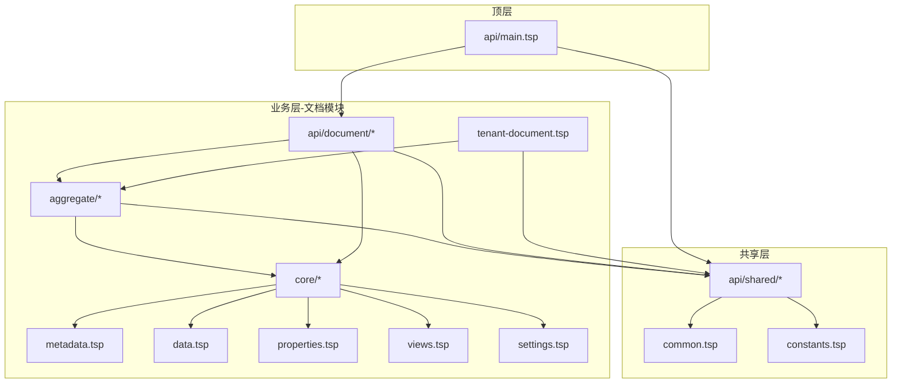
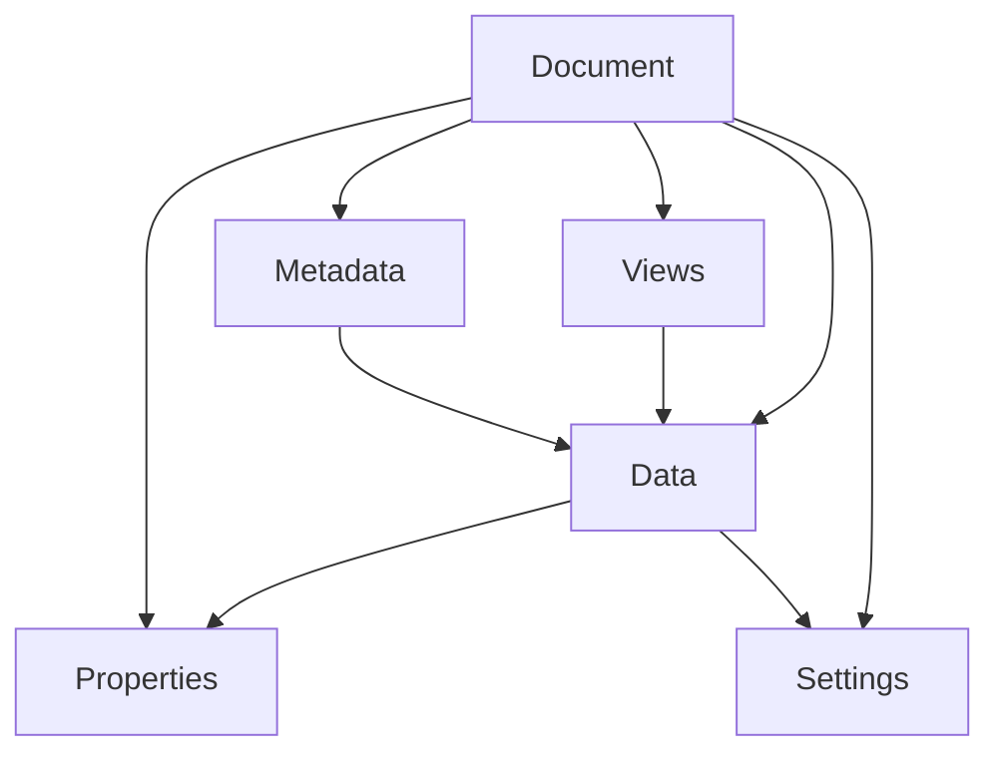
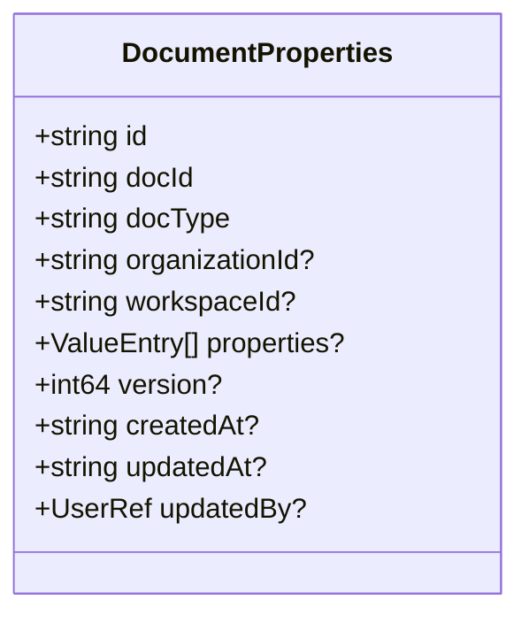
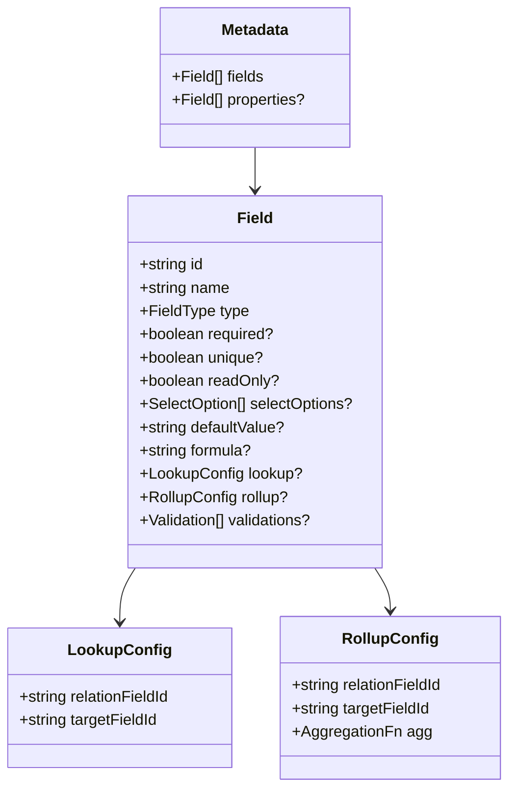
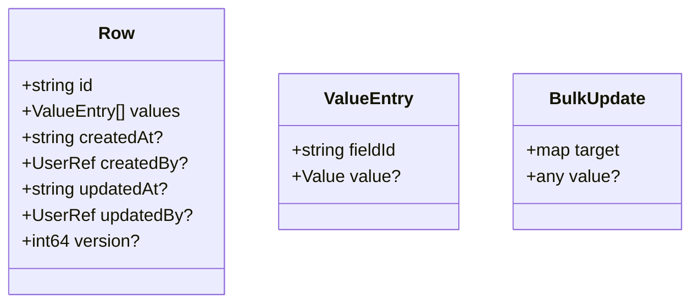
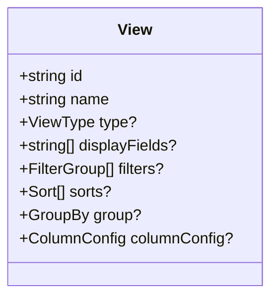
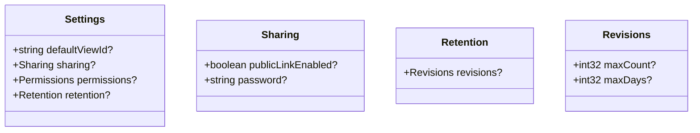
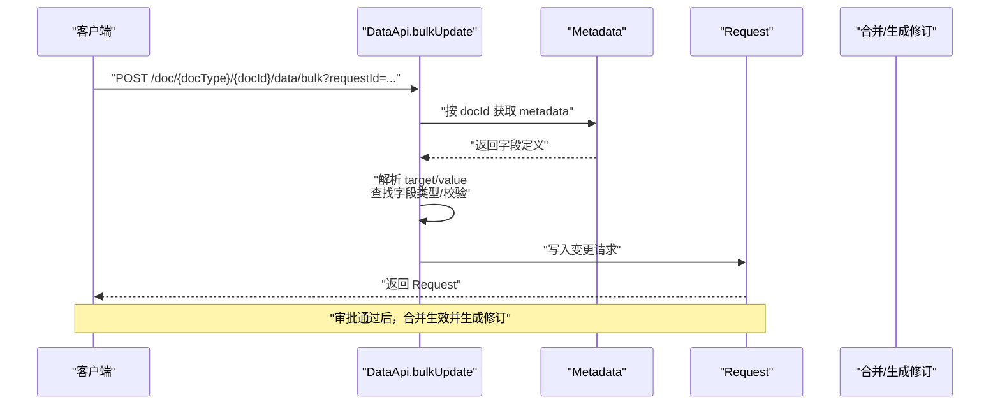
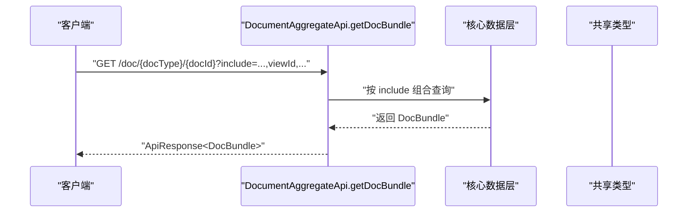
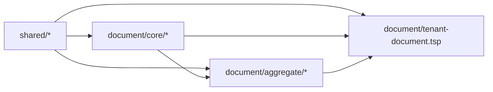

# 核心数据层

<cite>
**本文引用的文件**
- [文档模型设计文档](file://docs-src/guides/document-model.md)
- [架构指南](file://docs-src/guides/architecture.md)
- [文档模块入口](file://api/document/index.tsp)
- [核心模块入口](file://api/document/core/index.tsp)
- [元数据模块](file://api/document/core/metadata.tsp)
- [数据模块](file://api/document/core/data.tsp)
- [属性模块](file://api/document/core/properties.tsp)
- [视图模块](file://api/document/core/views.tsp)
- [设置模块](file://api/document/core/settings.tsp)
- [聚合查询模块](file://api/document/aggregate/index.tsp)
- [租户文档模块](file://api/document/tenant-document.tsp)
- [共享通用类型](file://api/shared/common.tsp)
- [共享常量与枚举](file://api/shared/constants.tsp)
</cite>

## 目录
1. [简介](#简介)
2. [项目结构](#项目结构)
3. [核心组件](#核心组件)
4. [架构总览](#架构总览)
5. [详细组件分析](#详细组件分析)
6. [依赖分析](#依赖分析)
7. [性能考虑](#性能考虑)
8. [故障排查指南](#故障排查指南)
9. [结论](#结论)
10. [附录](#附录)

## 简介
本文件聚焦 nexusbook-api 的核心数据层，系统性阐述五大核心数据层的职责、数据结构、API 端点与相互关系：Properties（文档属性）、Metadata（字段定义）、Data（数据行）、Views（视图配置）、Settings（文档设置）。文档还解释了设计原则（清晰分层、一致性约束、不可变记录等），并结合 BulkUpdate 批量更新机制与 DocBundle 聚合查询模式给出实践指导与可视化流程。

## 项目结构
- 文档模块（document）按“核心层 + 协作层 + 工作流层 + 聚合层”的分层组织，核心层即本文关注的五大数据层。
- 核心层模块通过共享层（shared）提供通用类型与常量，确保跨模块的一致性与可维护性。

图表来源
- [架构指南](file://docs-src/guides/architecture.md#L121-L219)
- [文档模块入口](file://api/document/index.tsp#L1-L31)
- [核心模块入口](file://api/document/core/index.tsp#L1-L21)
- [共享通用类型](file://api/shared/common.tsp#L1-L120)
- [共享常量与枚举](file://api/shared/constants.tsp#L1-L120)

章节来源
- [架构指南](file://docs-src/guides/architecture.md#L121-L219)
- [文档模块入口](file://api/document/index.tsp#L1-L31)

## 核心组件
- Properties（文档属性）：存储文档级元信息（如订单时间、门店、金额、数量等），支持并发控制与变更请求工作流。
- Metadata（字段定义）：定义数据行字段结构、类型、验证规则、计算/查找/汇总配置等，是 Data 的约束基础。
- Data（数据行）：承载实际的行数据，支持 CRUD、批量更新、结构化查询与变更请求叠加视图。
- Views（视图配置）：定义不同展示方式（表格、看板、日历、统计等）的列、过滤、排序、分组等配置。
- Settings（文档设置）：管理文档级权限、分享、保留策略、默认视图等配置。

章节来源
- [文档模型设计文档](file://docs-src/guides/document-model.md#L74-L141)
- [元数据模块](file://api/document/core/metadata.tsp#L1-L120)
- [数据模块](file://api/document/core/data.tsp#L1-L120)
- [属性模块](file://api/document/core/properties.tsp#L1-L120)
- [视图模块](file://api/document/core/views.tsp#L1-L120)
- [设置模块](file://api/document/core/settings.tsp#L1-L120)

## 架构总览
五大核心数据层围绕 Document 进行组合，彼此职责清晰、边界明确：
- Metadata 与 Data 强约束：Data.values[].fieldId 必须在 Metadata.fields 中存在。
- Views 不持有数据，仅保存 config（列、过滤、排序、分组），用于投影 Data。
- Properties 与 Data 分离，避免交叉污染。
- Settings 管理权限与行为配置，贯穿各层。

图表来源
- [文档模型设计文档](file://docs-src/guides/document-model.md#L35-L51)

章节来源
- [文档模型设计文档](file://docs-src/guides/document-model.md#L35-L51)

## 详细组件分析

### Properties（文档属性）
- 职责：存储文档级元信息，支持并发控制与变更请求工作流；支持全量替换与部分更新。
- 数据结构要点：包含 docId、docType、属性值集合（ValueEntry[]）、版本号、审计信息等。
- API 端点：
  - GET/POST/PUT/PATCH/DELETE /doc/{docType}/{docId}/properties
  - GET /doc/{docType}/{docId}/properties/history
- 设计原则：属性与数据分离，不可变记录（通过请求与修订实现历史不可篡改）。

图表来源
- [属性模块](file://api/document/core/properties.tsp#L94-L198)

章节来源
- [属性模块](file://api/document/core/properties.tsp#L1-L120)
- [属性模块](file://api/document/core/properties.tsp#L200-L441)

### Metadata（字段定义）
- 职责：定义字段类型、必填/唯一/只读、默认值、选项、校验规则、计算/查找/汇总配置等。
- 数据结构要点：fields（数据行字段）、properties（文档属性字段）。
- API 端点：
  - GET/PUT /doc/{docType}/{docId}/metadata
- 设计原则：字段定义先行，Data 必须严格遵循 Metadata 的约束。

图表来源
- [元数据模块](file://api/document/core/metadata.tsp#L146-L211)
- [共享通用类型](file://api/shared/common.tsp#L297-L304)
- [共享常量与枚举](file://api/shared/constants.tsp#L141-L260)

章节来源
- [元数据模块](file://api/document/core/metadata.tsp#L1-L120)
- [元数据模块](file://api/document/core/metadata.tsp#L146-L211)
- [共享通用类型](file://api/shared/common.tsp#L297-L304)
- [共享常量与枚举](file://api/shared/constants.tsp#L141-L260)

### Data（数据行）
- 职责：承载实际行数据，支持 CRUD、批量更新、结构化查询与变更请求叠加视图。
- 数据结构要点：Row（values 使用 ValueEntry，包含 fieldId 与 Value），支持版本号与审计信息。
- API 端点：
  - GET /doc/{docType}/{docId}/data
  - POST /doc/{docType}/{docId}/data
  - PUT /doc/{docType}/{docId}/data/{rowId}
  - DELETE /doc/{docType}/{docId}/data/{rowId}
  - POST /doc/{docType}/{docId}/data/query
  - POST /doc/{docType}/{docId}/data/bulk
- 设计原则：所有写操作进入变更请求（Request），经审批合并后生成修订（Revision）。

图表来源
- [数据模块](file://api/document/core/data.tsp#L241-L312)
- [数据模块](file://api/document/core/data.tsp#L189-L240)
- [共享通用类型](file://api/shared/common.tsp#L710-L742)

章节来源
- [数据模块](file://api/document/core/data.tsp#L1-L120)
- [数据模块](file://api/document/core/data.tsp#L313-L439)
- [数据模块](file://api/document/core/data.tsp#L440-L628)
- [共享通用类型](file://api/shared/common.tsp#L710-L742)

### Views（视图配置）
- 职责：定义不同展示方式（表格、看板、日历、统计等）的列、过滤、排序、分组等配置。
- 数据结构要点：View（type、displayFields、filters、sorts、group、columnConfig）。
- API 端点：
  - GET/POST/GET/PUT/DELETE/POST /doc/{docType}/{docId}/views/{viewId}/default

图表来源
- [视图模块](file://api/document/core/views.tsp#L28-L85)
- [共享常量与枚举](file://api/shared/constants.tsp#L87-L140)
- [共享通用类型](file://api/shared/common.tsp#L205-L296)

章节来源
- [视图模块](file://api/document/core/views.tsp#L1-L120)
- [视图模块](file://api/document/core/views.tsp#L86-L171)
- [共享常量与枚举](file://api/shared/constants.tsp#L87-L140)
- [共享通用类型](file://api/shared/common.tsp#L205-L296)

### Settings（文档设置）
- 职责：管理文档级权限、分享、保留策略、默认视图等。
- 数据结构要点：Settings（defaultViewId、sharing、permissions、retention）。
- API 端点：
  - GET/PUT /doc/{docType}/{docId}/settings
  - GET/PUT /doc/{docType}/setting

图表来源
- [设置模块](file://api/document/core/settings.tsp#L33-L85)
- [设置模块](file://api/document/core/settings.tsp#L86-L141)

章节来源
- [设置模块](file://api/document/core/settings.tsp#L1-L120)
- [设置模块](file://api/document/core/settings.tsp#L121-L141)

### BulkUpdate 批量更新机制
- 设计目标：统一、灵活、易用的批量更新接口，支持多行、多字段、属性与数据混合更新。
- 核心思想：客户端仅提供 target（灵活结构）与原始 value，服务端依据 Metadata 自动解析类型、校验并写入变更请求。
- 处理流程（序列图）：

图表来源
- [数据模块](file://api/document/core/data.tsp#L476-L569)

章节来源
- [数据模块](file://api/document/core/data.tsp#L71-L188)
- [数据模块](file://api/document/core/data.tsp#L476-L569)

### DocBundle 聚合查询模式
- 设计目标：一次性获取文档的多个层次数据，减少多次请求，提升页面初始化与预览效率。
- 数据结构：DocBundle（properties、metadata、views、data、comments、revisions、settings）。
- 端点：GET /doc/{docType}/{docId}?include=...&viewId&page=...&pageSize=...&commentsLimit=...&revisionsLimit=...

图表来源
- [聚合查询模块](file://api/document/aggregate/index.tsp#L44-L91)
- [聚合查询模块](file://api/document/aggregate/index.tsp#L92-L126)
- [共享通用类型](file://api/shared/common.tsp#L153-L177)

章节来源
- [聚合查询模块](file://api/document/aggregate/index.tsp#L1-L126)
- [共享通用类型](file://api/shared/common.tsp#L153-L177)

## 依赖分析
- 模块耦合与内聚：
  - 核心层（core）高内聚，围绕 Document 的五大数据层进行职责划分。
  - 聚合层（aggregate）组合核心层与其他模块能力，提供一次性获取能力。
  - 租户文档（tenant-document）在组织/工作区维度提供聚合查询与列表能力。
- 外部依赖：
  - 共享层（shared）提供通用类型（ApiResponse、Page、ValueEntry、Filter/Sort/GroupBy 等）与常量（枚举）。
- 依赖关系可视化：

图表来源
- [架构指南](file://docs-src/guides/architecture.md#L121-L219)
- [文档模块入口](file://api/document/index.tsp#L1-L31)
- [核心模块入口](file://api/document/core/index.tsp#L1-L21)
- [共享通用类型](file://api/shared/common.tsp#L1-L120)
- [共享常量与枚举](file://api/shared/constants.tsp#L1-L120)

章节来源
- [架构指南](file://docs-src/guides/architecture.md#L121-L219)
- [文档模块入口](file://api/document/index.tsp#L1-L31)

## 性能考虑
- 批量更新：通过 BulkUpdate 统一入口，减少往返次数，降低客户端复杂度。
- 聚合查询：DocBundle 一次性返回多层数据，减少多次请求带来的网络与服务器压力。
- 分页与深分页：Data 查询支持 page/pageSize 与 cursor，避免一次性拉取大量数据。
- 视图叠加读取：Data.listRows/query 支持 requestId 叠加请求变更，避免重复扫描生产数据。
- 关系与附件：Relations/Attachments 作为一等公民，建议在聚合查询中按需 include，避免不必要的数据传输。

## 故障排查指南
- 字段类型不匹配：当 value 与 Metadata 中字段类型不一致时，服务端会拒绝并返回相应错误码。
- 并发冲突：更新行时需提供版本号，否则可能因乐观锁导致冲突。
- 权限不足：Settings 中的权限策略会限制读写操作，需确保用户具备相应角色。
- 变更未生效：所有写操作需经过 Request 审批合并后才生效，若未合并请检查审批状态。

章节来源
- [共享通用类型](file://api/shared/common.tsp#L80-L152)
- [数据模块](file://api/document/core/data.tsp#L313-L439)
- [设置模块](file://api/document/core/settings.tsp#L33-L85)

## 结论
本文从架构与实现两方面梳理了 nexusbook-api 的核心数据层：Properties/Metadata/Data/Views/Settings 五层清晰分层、职责明确；通过 Metadata 约束 Data，Views 投影 Data，Properties 与 Data 分离，Settings 管理权限与行为；配合 BulkUpdate 与 DocBundle，既保证了灵活性与易用性，也兼顾了性能与一致性。遵循“审批先行、不可变记录、可审计性”的设计原则，有助于构建稳定、可演进的文档数据平台。

## 附录
- API 端点一览（核心数据层）
  - Properties
    - GET/POST/PUT/PATCH/DELETE /doc/{docType}/{docId}/properties
    - GET /doc/{docType}/{docId}/properties/history
  - Metadata
    - GET/PUT /doc/{docType}/{docId}/metadata
  - Data
    - GET /doc/{docType}/{docId}/data
    - POST /doc/{docType}/{docId}/data
    - PUT /doc/{docType}/{docId}/data/{rowId}
    - DELETE /doc/{docType}/{docId}/data/{rowId}
    - POST /doc/{docType}/{docId}/data/query
    - POST /doc/{docType}/{docId}/data/bulk
  - Views
    - GET/POST/GET/PUT/DELETE/POST /doc/{docType}/{docId}/views/{viewId}/default
  - Settings
    - GET/PUT /doc/{docType}/{docId}/settings
    - GET/PUT /doc/{docType}/setting

章节来源
- [属性模块](file://api/document/core/properties.tsp#L200-L441)
- [元数据模块](file://api/document/core/metadata.tsp#L183-L211)
- [数据模块](file://api/document/core/data.tsp#L375-L628)
- [视图模块](file://api/document/core/views.tsp#L86-L171)
- [设置模块](file://api/document/core/settings.tsp#L86-L141)