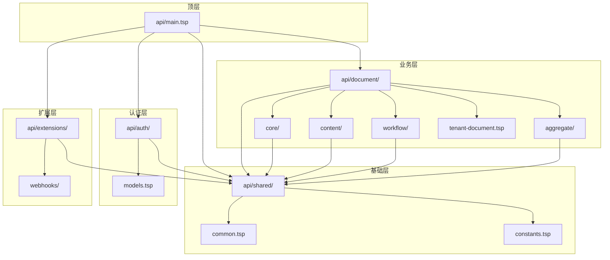
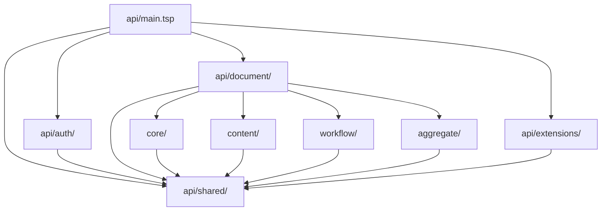
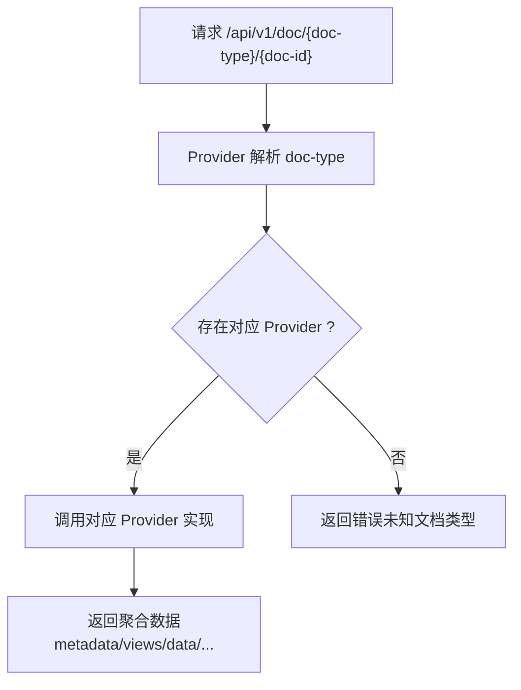
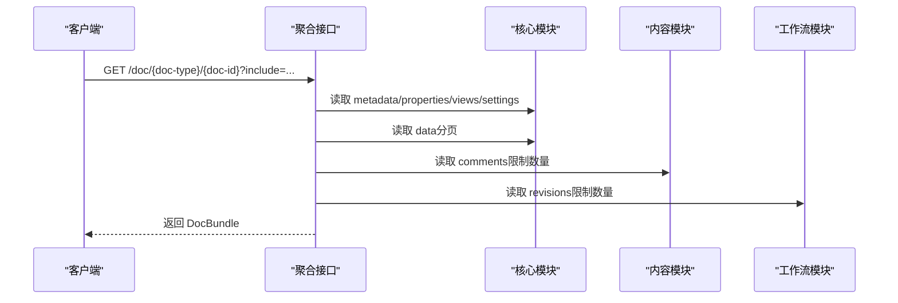
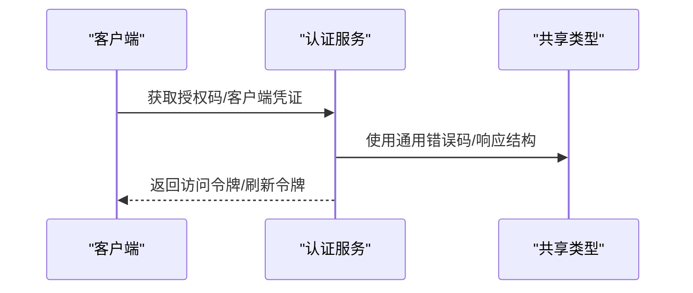
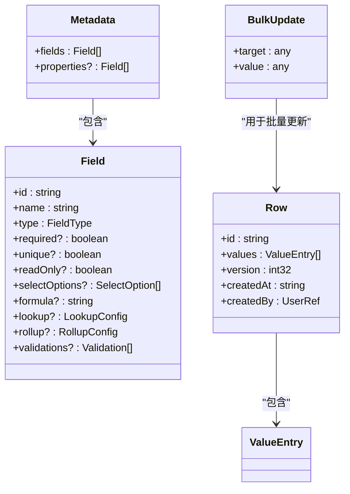
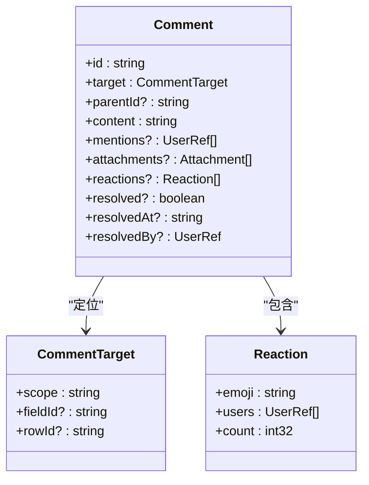
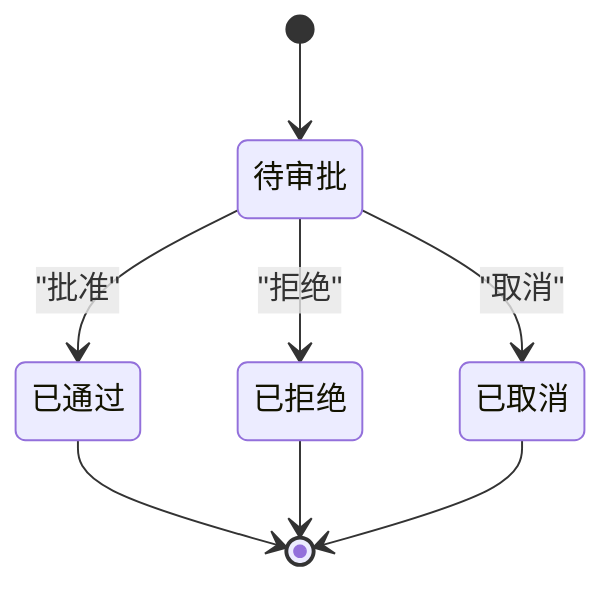
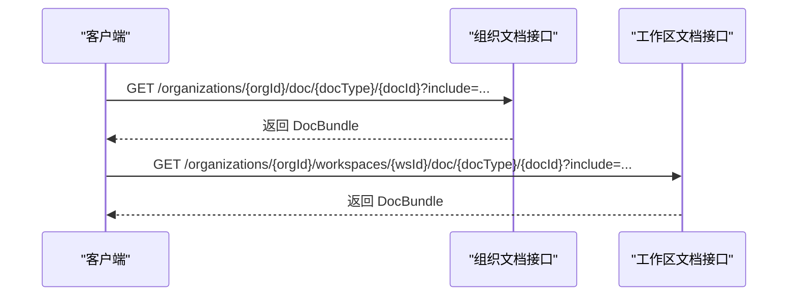
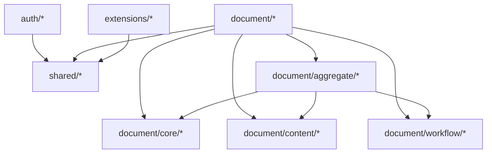

# 核心架构

<cite>
**本文引用的文件**
- [api/main.tsp](file://api/main.tsp)
- [api/shared/index.tsp](file://api/shared/index.tsp)
- [api/shared/common.tsp](file://api/shared/common.tsp)
- [api/shared/constants.tsp](file://api/shared/constants.tsp)
- [api/auth/index.tsp](file://api/auth/index.tsp)
- [api/document/index.tsp](file://api/document/index.tsp)
- [api/document/core/index.tsp](file://api/document/core/index.tsp)
- [api/document/core/metadata.tsp](file://api/document/core/metadata.tsp)
- [api/document/core/data.tsp](file://api/document/core/data.tsp)
- [api/document/aggregate/index.tsp](file://api/document/aggregate/index.tsp)
- [api/document/content/comments.tsp](file://api/document/content/comments.tsp)
- [api/document/workflow/approvals.tsp](file://api/document/workflow/approvals.tsp)
- [api/document/tenant-document.tsp](file://api/document/tenant-document.tsp)
- [api/extensions/index.tsp](file://api/extensions/index.tsp)
- [api/extensions/webhooks/index.tsp](file://api/extensions/webhooks/index.tsp)
- [docs-src/guides/architecture.md](file://docs-src/guides/architecture.md)
</cite>

## 目录
1. [引言](#引言)
2. [项目结构](#项目结构)
3. [核心组件](#核心组件)
4. [架构总览](#架构总览)
5. [详细组件分析](#详细组件分析)
6. [依赖分析](#依赖分析)
7. [性能考虑](#性能考虑)
8. [故障排查指南](#故障排查指南)
9. [结论](#结论)
10. [附录](#附录)

## 引言
本架构文档聚焦 nexusbook-api 的分层架构设计，围绕顶层入口（main.tsp）、基础层（shared 模块）、认证层（auth 模块）、业务层（document 模块）与扩展层（extensions 模块）展开。文档强调单向依赖原则（上层依赖下层，且所有模块均依赖 shared 基础层），并阐述模块化与单一职责原则，解释 Provider 模式如何通过 {doc-type}/{doc-id} 路由扩展新的文档类型，最后结合 architecture.md 中的 Mermaid 图，系统化说明组件关系与数据流。

## 项目结构
- 顶层入口：api/main.tsp 导入并组织各子模块，定义服务与服务器配置。
- 基础层：api/shared/ 提供通用类型、错误码、查询与过滤模型、枚举常量等。
- 认证层：api/auth/ 提供 OAuth2/OIDC、用户注册/登录、API Key 管理等。
- 业务层：api/document/ 提供文档核心数据（core）、内容协作（content）、工作流（workflow）、聚合查询（aggregate）、租户文档（tenant-document）等。
- 扩展层：api/extensions/ 提供 Webhooks 等扩展能力（预留集成）。

图表来源
- [docs-src/guides/architecture.md](file://docs-src/guides/architecture.md#L121-L219)
- [api/main.tsp](file://api/main.tsp#L1-L20)
- [api/shared/index.tsp](file://api/shared/index.tsp#L1-L16)
- [api/auth/index.tsp](file://api/auth/index.tsp#L1-L37)
- [api/document/index.tsp](file://api/document/index.tsp#L1-L31)
- [api/extensions/index.tsp](file://api/extensions/index.tsp#L1-L13)

章节来源
- [api/main.tsp](file://api/main.tsp#L1-L20)
- [docs-src/guides/architecture.md](file://docs-src/guides/architecture.md#L78-L118)

## 核心组件
- shared 基础层：提供通用响应结构、分页模型、错误码、查询过滤模型、聚合函数、值类型与附件等，确保各模块的一致性与复用性。
- auth 认证层：提供 OAuth2/OIDC、用户注册/登录、API Key 管理等能力，支撑业务层的安全访问。
- document 业务层：
  - core：元数据（字段定义、计算/校验）、数据行（结构化行、批量更新、版本控制）、属性（文档级元信息）、视图（多视图配置）、设置（文档/类型级配置）。
  - content：评论系统（统一评论模型、回复树、附件、表情反应、置顶与解决标记）。
  - workflow：审批流程（状态机、历史记录、决策）、变更请求与修订历史。
  - aggregate：聚合查询接口，支持一次性获取 properties/metadata/views/data/comments/revisions/settings，并按需 include。
  - tenant-document：组织级与工作区级文档的聚合接口与文档摘要模型。
- extensions 扩展层：Webhooks 等扩展能力，预留集成。

章节来源
- [api/shared/common.tsp](file://api/shared/common.tsp#L1-L200)
- [api/shared/constants.tsp](file://api/shared/constants.tsp#L1-L120)
- [api/auth/index.tsp](file://api/auth/index.tsp#L1-L37)
- [api/document/core/index.tsp](file://api/document/core/index.tsp#L1-L21)
- [api/document/aggregate/index.tsp](file://api/document/aggregate/index.tsp#L1-L127)
- [api/document/tenant-document.tsp](file://api/document/tenant-document.tsp#L1-L120)
- [api/extensions/webhooks/index.tsp](file://api/extensions/webhooks/index.tsp#L1-L15)

## 架构总览
下图展示了模块间的依赖关系与分层结构，体现“单向依赖”与“基础优先”的原则。

图表来源
- [docs-src/guides/architecture.md](file://docs-src/guides/architecture.md#L215-L219)
- [api/main.tsp](file://api/main.tsp#L1-L20)
- [api/document/index.tsp](file://api/document/index.tsp#L1-L31)

## 详细组件分析

### Provider 模式与 {doc-type}/{doc-id} 路由
- 路由形态：/api/v1/doc/{doc-type}/{doc-id}，通过 Provider 解析 {doc-type}，将请求路由到对应 Provider 实现，从而扩展新的文档类型。
- 扩展方式：新增 Provider 即可接入新类型，无需修改 API 定义；聚合查询与租户文档接口同样遵循该模式，支持组织级与工作区级文档。

图表来源
- [docs-src/guides/architecture.md](file://docs-src/guides/architecture.md#L364-L383)
- [api/document/aggregate/index.tsp](file://api/document/aggregate/index.tsp#L92-L127)
- [api/document/tenant-document.tsp](file://api/document/tenant-document.tsp#L112-L191)

章节来源
- [docs-src/guides/architecture.md](file://docs-src/guides/architecture.md#L364-L383)
- [api/document/aggregate/index.tsp](file://api/document/aggregate/index.tsp#L92-L127)
- [api/document/tenant-document.tsp](file://api/document/tenant-document.tsp#L112-L191)

### 聚合查询与 DocBundle
- 聚合接口：一次性获取文档的 properties/metadata/views/data/comments/revisions/settings，支持 include 选择、分页与限制数量。
- DocBundle：聚合载荷，按需包含上述各部分，便于前端一次性渲染。

图表来源
- [api/document/aggregate/index.tsp](file://api/document/aggregate/index.tsp#L92-L127)
- [api/document/core/metadata.tsp](file://api/document/core/metadata.tsp#L183-L200)
- [api/document/core/data.tsp](file://api/document/core/data.tsp#L199-L220)
- [api/document/content/comments.tsp](file://api/document/content/comments.tsp#L1-L120)
- [api/document/workflow/approvals.tsp](file://api/document/workflow/approvals.tsp#L1-L60)

章节来源
- [api/document/aggregate/index.tsp](file://api/document/aggregate/index.tsp#L1-L127)

### 认证与授权（Auth）
- 功能要点：OAuth2/OIDC、用户注册/登录、API Key 管理、令牌管理与权限控制。
- 依赖关系：auth 依赖 shared，提供标准 OIDC 发现端点与令牌管理。

图表来源
- [api/auth/index.tsp](file://api/auth/index.tsp#L1-L37)
- [api/shared/common.tsp](file://api/shared/common.tsp#L153-L177)

章节来源
- [api/auth/index.tsp](file://api/auth/index.tsp#L1-L37)
- [api/shared/common.tsp](file://api/shared/common.tsp#L153-L177)

### 文档核心（Core）
- 元数据（metadata）：字段定义、类型、计算/查找/汇总、校验规则。
- 数据行（data）：行结构、批量更新、版本控制与并发控制。
- 属性（properties）：文档级元信息字段定义。
- 视图（views）：多视图配置。
- 设置（settings）：文档/类型级配置。

图表来源
- [api/document/core/metadata.tsp](file://api/document/core/metadata.tsp#L1-L200)
- [api/document/core/data.tsp](file://api/document/core/data.tsp#L1-L200)
- [api/shared/common.tsp](file://api/shared/common.tsp#L544-L576)

章节来源
- [api/document/core/metadata.tsp](file://api/document/core/metadata.tsp#L1-L200)
- [api/document/core/data.tsp](file://api/document/core/data.tsp#L1-L200)
- [api/shared/common.tsp](file://api/shared/common.tsp#L544-L576)

### 内容协作（Comments）
- 统一评论模型：支持文档/字段/行/单元格多层级定位，回复树、@提及、附件、表情反应、置顶与解决标记。
- 位置定位器：CommentTarget 精确定位评论所在位置。

图表来源
- [api/document/content/comments.tsp](file://api/document/content/comments.tsp#L1-L200)
- [api/shared/common.tsp](file://api/shared/common.tsp#L359-L449)

章节来源
- [api/document/content/comments.tsp](file://api/document/content/comments.tsp#L1-L200)
- [api/shared/common.tsp](file://api/shared/common.tsp#L359-L449)

### 工作流（Approvals）
- 审批实例：状态（pending/approved/rejected/canceled）、当前节点、历史记录（节点ID、操作人、决策、备注、时间戳）。
- 接口：获取审批、发起审批、审批详情、审批决策。

图表来源
- [api/document/workflow/approvals.tsp](file://api/document/workflow/approvals.tsp#L1-L156)
- [api/shared/constants.tsp](file://api/shared/constants.tsp#L33-L86)

章节来源
- [api/document/workflow/approvals.tsp](file://api/document/workflow/approvals.tsp#L1-L156)
- [api/shared/constants.tsp](file://api/shared/constants.tsp#L33-L86)

### 租户文档（Organization/Workspace）
- 作用域：organization/workspace。
- 接口：组织级与工作区级文档聚合接口、文档列表接口，支持 docType 过滤、搜索、排序、分页。

图表来源
- [api/document/tenant-document.tsp](file://api/document/tenant-document.tsp#L112-L191)
- [api/document/tenant-document.tsp](file://api/document/tenant-document.tsp#L260-L345)

章节来源
- [api/document/tenant-document.tsp](file://api/document/tenant-document.tsp#L1-L120)
- [api/document/tenant-document.tsp](file://api/document/tenant-document.tsp#L112-L191)
- [api/document/tenant-document.tsp](file://api/document/tenant-document.tsp#L260-L345)

## 依赖分析
- 单向依赖原则：上层模块依赖下层模块；所有模块均依赖 shared 基础层。
- 聚合模块（aggregate）组合 core/content/workflow 的能力，形成统一的聚合查询入口。
- 认证模块（auth）与业务模块（document）均依赖 shared，保证通用类型与错误码的一致性。
- 扩展模块（extensions）与业务模块解耦，通过预留接口与共享类型进行集成。

图表来源
- [docs-src/guides/architecture.md](file://docs-src/guides/architecture.md#L227-L233)
- [api/document/index.tsp](file://api/document/index.tsp#L1-L31)
- [api/document/aggregate/index.tsp](file://api/document/aggregate/index.tsp#L1-L33)

章节来源
- [docs-src/guides/architecture.md](file://docs-src/guides/architecture.md#L227-L233)
- [api/document/index.tsp](file://api/document/index.tsp#L1-L31)

## 性能考虑
- 聚合查询：通过 include 参数按需加载，减少往返次数，提升前端渲染效率。
- 分页与限制：数据分页、评论/修订数量限制，降低大列表查询的负载。
- 批量更新：简化客户端提交结构，服务端根据 metadata 自动解析类型，减少重复传输与转换成本。
- 并发控制：版本号乐观锁，避免冲突导致的重试与回滚开销。

## 故障排查指南
- 统一错误码与响应结构：使用 shared 中的 ApiResponse 与 ErrorCode，便于定位问题类别（认证、文档、视图、数据、评论、审批、请求、用户、组织、工作区、邀请、加入申请等）。
- 路由与 Provider：确认 {doc-type} 是否存在对应 Provider，否则返回“未知文档类型”错误。
- 权限与作用域：组织级/工作区级文档需满足成员权限要求；审批流程需检查当前节点与权限。
- 并发冲突：更新失败时检查版本号是否过期，重新拉取最新数据后重试。

章节来源
- [api/shared/common.tsp](file://api/shared/common.tsp#L80-L151)
- [api/shared/common.tsp](file://api/shared/common.tsp#L153-L177)
- [api/document/tenant-document.tsp](file://api/document/tenant-document.tsp#L112-L191)
- [api/document/workflow/approvals.tsp](file://api/document/workflow/approvals.tsp#L1-L60)

## 结论
nexusbook-api 采用清晰的分层架构与严格的单向依赖原则，shared 基础层提供统一的类型与错误模型，auth 保障安全访问，document 业务层围绕文档抽象提供核心数据、协作与工作流能力，extensions 提供可扩展的集成能力。Provider 模式与聚合查询进一步提升了系统的可扩展性与易用性，符合高内聚、低耦合的设计目标。

## 附录
- 设计原则：分层架构、单一职责、依赖管理、可扩展性、模块化。
- 模块职责概览：shared（基础设施）、auth（认证授权）、document/core（核心数据）、document/content（内容协作）、document/workflow（工作流）、document/aggregate（聚合查询）、extensions（扩展功能）。

章节来源
- [docs-src/guides/architecture.md](file://docs-src/guides/architecture.md#L234-L253)