# 核心架构

<cite>
**本文引用的文件**
- [api/main.tsp](file://api/main.tsp)
- [api/shared/index.tsp](file://api/shared/index.tsp)
- [api/shared/common.tsp](file://api/shared/common.tsp)
- [api/shared/constants.tsp](file://api/shared/constants.tsp)
- [api/auth/index.tsp](file://api/auth/index.tsp)
- [api/document/index.tsp](file://api/document/index.tsp)
- [api/document/core/index.tsp](file://api/document/core/index.tsp)
- [api/document/core/metadata.tsp](file://api/document/core/metadata.tsp)
- [api/document/core/data.tsp](file://api/document/core/data.tsp)
- [api/document/aggregate/index.tsp](file://api/document/aggregate/index.tsp)
- [api/document/content/comments.tsp](file://api/document/content/comments.tsp)
- [api/document/workflow/approvals.tsp](file://api/document/workflow/approvals.tsp)
- [api/document/tenant-document.tsp](file://api/document/tenant-document.tsp)
- [api/extensions/index.tsp](file://api/extensions/index.tsp)
- [api/extensions/webhooks/index.tsp](file://api/extensions/webhooks/index.tsp)
- [docs-src/guides/architecture.md](file://docs-src/guides/architecture.md)
- [api/tenant/models.tsp](file://api/tenant/models.tsp)
- [api/tenant/organizations.tsp](file://api/tenant/organizations.tsp)
- [api/tenant/workspaces.tsp](file://api/tenant/workspaces.tsp)
- [api/tenant/invitations.tsp](file://api/tenant/invitations.tsp)
</cite>

## 更新摘要
**变更内容**
- 更新了“引言”、“项目结构”和“核心组件”部分，以反映多租户数据模型的最新设计。
- 新增了“多租户架构”、“组织与工作区”、“数据源引用”和“权限矩阵”四个章节，详细描述了 Organization、Workspace、DataSourceReference 模型以及基于角色的权限控制。
- 更新了“架构总览”中的 Mermaid 图，以包含新的租户管理模块。
- 更新了“详细组件分析”中的“租户文档”部分，以匹配新的 API 路由和功能。
- 更新了“依赖分析”以包含新的租户管理模块。

## 目录
1. [引言](#引言)
2. [项目结构](#项目结构)
3. [核心组件](#核心组件)
4. [架构总览](#架构总览)
5. [详细组件分析](#详细组件分析)
6. [依赖分析](#依赖分析)
7. [性能考虑](#性能考虑)
8. [故障排查指南](#故障排查指南)
9. [结论](#结论)
10. [附录](#附录)

## 引言
本架构文档聚焦 nexusbook-api 的分层架构设计，围绕顶层入口（main.tsp）、基础层（shared 模块）、认证层（auth 模块）、业务层（document 模块）与扩展层（extensions 模块）展开。文档强调单向依赖原则（上层依赖下层，且所有模块均依赖 shared 基础层），并阐述模块化与单一职责原则，解释 Provider 模式如何通过 {doc-type}/{doc-id} 路由扩展新的文档类型，最后结合 architecture.md 中的 Mermaid 图，系统化说明组件关系与数据流。**本次更新重点反映多租户数据模型的最新设计，包括 Organization 和 Workspace 概念、DataSourceReference 模型以及基于角色的权限矩阵。**

## 项目结构
- 顶层入口：api/main.tsp 导入并组织各子模块，定义服务与服务器配置。
- 基础层：api/shared/ 提供通用类型、错误码、查询与过滤模型、枚举常量等。
- 认证层：api/auth/ 提供 OAuth2/OIDC、用户注册/登录、API Key 管理等。
- 业务层：api/document/ 提供文档核心数据（core）、内容协作（content）、工作流（workflow）、聚合查询（aggregate）、租户文档（tenant-document）等。
- 扩展层：api/extensions/ 提供 Webhooks 等扩展能力（预留集成）。
- **租户管理层**：api/tenant/ 提供用户、组织、工作区、邀请与加入申请的管理功能，是多租户架构的核心。

```mermaid
graph TB
subgraph "顶层"
MAIN["api/main.tsp"]
end
subgraph "基础层"
SHARED["api/shared/"]
COMMON["common.tsp"]
CONST["constants.tsp"]
SHARED --> COMMON
SHARED --> CONST
end
subgraph "认证层"
AUTH["api/auth/"]
AUTHMODELS["models.tsp"]
AUTH --> AUTHMODELS
end
subgraph "业务层"
DOC["api/document/"]
CORE["core/"]
CONTENT["content/"]
WORKFLOW["workflow/"]
AGG["aggregate/"]
TENANT["tenant-document.tsp"]
DOC --> CORE
DOC --> CONTENT
DOC --> WORKFLOW
DOC --> AGG
DOC --> TENANT
end
subgraph "扩展层"
EXT["api/extensions/"]
WEBHOOKS["webhooks/"]
EXT --> WEBHOOKS
end
subgraph "租户管理层"
TENANT_API["api/tenant/"]
ORG["organizations.tsp"]
WS["workspaces.tsp"]
INV["invitations.tsp"]
USER["users.tsp"]
MODELS["models.tsp"]
TENANT_API --> ORG
TENANT_API --> WS
TENANT_API --> INV
TENANT_API --> USER
TENANT_API --> MODELS
end
MAIN --> SHARED
MAIN --> AUTH
MAIN --> DOC
MAIN --> EXT
MAIN --> TENANT_API
AUTH --> SHARED
DOC --> SHARED
EXT --> SHARED
TENANT_API --> SHARED
CORE --> SHARED
CONTENT --> SHARED
WORKFLOW --> SHARED
AGG --> SHARED
```

图表来源
- [docs-src/guides/architecture.md](file://docs-src/guides/architecture.md#L121-L219)
- [api/main.tsp](file://api/main.tsp#L1-L20)
- [api/shared/index.tsp](file://api/shared/index.tsp#L1-L16)
- [api/auth/index.tsp](file://api/auth/index.tsp#L1-L37)
- [api/document/index.tsp](file://api/document/index.tsp#L1-L31)
- [api/extensions/index.tsp](file://api/extensions/index.tsp#L1-L13)
- [api/tenant/organizations.tsp](file://api/tenant/organizations.tsp#L1-L498)
- [api/tenant/workspaces.tsp](file://api/tenant/workspaces.tsp#L1-L649)
- [api/tenant/invitations.tsp](file://api/tenant/invitations.tsp#L1-L548)

章节来源
- [api/main.tsp](file://api/main.tsp#L1-L20)
- [docs-src/guides/architecture.md](file://docs-src/guides/architecture.md#L78-L118)

## 核心组件
- shared 基础层：提供通用响应结构、分页模型、错误码、查询过滤模型、聚合函数、值类型与附件等，确保各模块的一致性与复用性。
- auth 认证层：提供 OAuth2/OIDC、用户注册/登录、API Key 管理等能力，支撑业务层的安全访问。
- document 业务层：
  - core：元数据（字段定义、计算/校验）、数据行（结构化行、批量更新、版本控制）、属性（文档级元信息）、视图（多视图配置）、设置（文档/类型级配置）。
  - content：评论系统（统一评论模型、回复树、附件、表情反应、置顶与解决标记）。
  - workflow：审批流程（状态机、历史记录、决策）、变更请求与修订历史。
  - aggregate：聚合查询接口，支持一次性获取 properties/metadata/views/data/comments/revisions/settings，并按需 include。
  - tenant-document：组织级与工作区级文档的聚合接口与文档摘要模型。
- extensions 扩展层：Webhooks 等扩展能力，预留集成。
- **tenant 租户管理层**：提供用户、组织、工作区、邀请与加入申请的全生命周期管理，是实现多租户 SaaS 架构的核心。

章节来源
- [api/shared/common.tsp](file://api/shared/common.tsp#L1-L200)
- [api/shared/constants.tsp](file://api/shared/constants.tsp#L1-L120)
- [api/auth/index.tsp](file://api/auth/index.tsp#L1-L37)
- [api/document/core/index.tsp](file://api/document/core/index.tsp#L1-L21)
- [api/document/aggregate/index.tsp](file://api/document/aggregate/index.tsp#L1-L127)
- [api/document/tenant-document.tsp](file://api/document/tenant-document.tsp#L1-L120)
- [api/extensions/webhooks/index.tsp](file://api/extensions/webhooks/index.tsp#L1-L15)
- [api/tenant/models.tsp](file://api/tenant/models.tsp#L1-L996)
- [api/tenant/organizations.tsp](file://api/tenant/organizations.tsp#L1-L498)
- [api/tenant/workspaces.tsp](file://api/tenant/workspaces.tsp#L1-L649)

## 架构总览
下图展示了模块间的依赖关系与分层结构，体现“单向依赖”与“基础优先”的原则。新增的 `api/tenant/` 模块是实现多租户功能的核心，所有与用户、组织、工作区相关的操作都通过此模块进行。

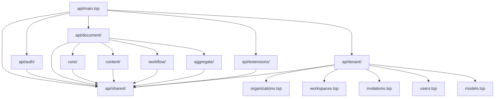

图表来源
- [docs-src/guides/architecture.md](file://docs-src/guides/architecture.md#L215-L219)
- [api/main.tsp](file://api/main.tsp#L1-L20)
- [api/document/index.tsp](file://api/document/index.tsp#L1-L31)
- [api/tenant/organizations.tsp](file://api/tenant/organizations.tsp#L1-L498)
- [api/tenant/workspaces.tsp](file://api/tenant/workspaces.tsp#L1-L649)

## 详细组件分析

### 多租户架构
NexusBook 采用多租户 SaaS 架构，通过 **Organization（组织）** 和 **Workspace（工作区）** 实现数据隔离和权限管理。一个 **User（用户）** 可以是多个 Organization 的成员，而每个 Organization 内可以创建多个地位平等的 Workspace。通过 **数据源引用（Data Source Reference）** 机制，Workspace 可以选择性地引用其他 Workspace 的特定数据。

```mermaid
graph TB
subgraph "多租户架构 Multi-Tenant Architecture"
User["👤 用户<br/>独立实体"]
subgraph "Organization 组织租户"
Org["🏢 Organization<br/>组织/租户<br/><small>数据隔离边界</small>"]
OrgMember["👥 组织成员<br/><small>owner/admin/member/guest</small>"]
subgraph "工作区 Workspaces"
WS1["📚 主数据中心<br/>Workspace A<br/><small>包含 product, supplier</small>"]
WS2["🍜 朝阳餐厅<br/>Workspace B<br/><small>引用 A 的 product</small>"]
WS3["🛍️ 海淀超市<br/>Workspace C<br/><small>引用 A 的 product, supplier</small>"]
WS4["🚚 绿源供应商<br/>Workspace D<br/><small>独立数据</small>"]
end
WSMember["👥 工作区成员<br/><small>owner/editor/viewer</small>"]
Invite["✉️ 邀请机制<br/><small>邮箱邀请</small>"]
JoinReq["📝 加入申请<br/><small>用户主动申请</small>"]
end
subgraph "数据共享关系 Data Sharing"
Ref1["🔗 B 引用 A.product<br/><small>readonly</small>"]
Ref2["🔗 C 引用 A.product<br/><small>readonly</small>"]
Ref3["🔗 C 引用 A.supplier<br/><small>readonly</small>"]
end
end
User --> |注册时自动创建| Org
User --> |owner| Org
User --> |加入| OrgMember
Org --> |包含| WS1
Org --> |包含| WS2
Org --> |包含| WS3
Org --> |包含| WS4
Org --> |创建时自动创建| WS1
OrgMember --> |需显式加入| WSMember
Org --> |邀请用户| Invite
Org --> |接受申请| JoinReq
WS2 -.->|数据源引用| Ref1
WS3 -.->|数据源引用| Ref2
WS3 -.->|数据源引用| Ref3
Ref1 --> WS1
Ref2 --> WS1
Ref3 --> WS1
style Org fill:#e1f5ff
style WS1 fill:#d4edda
style WS2 fill:#fff4e6
style WS3 fill:#fff4e6
style WS4 fill:#fff4e6
style User fill:#f0f0f0
style Ref1 fill:#ffeaa7
style Ref2 fill:#ffeaa7
style Ref3 fill:#ffeaa7
```

图表来源
- [docs-src/guides/architecture.md](file://docs-src/guides/architecture.md#L82-L143)

### 组织与工作区
#### 1. User（用户）- 独立身份实体
- **独立性**：用户是系统中的独立实体，不依附于任何组织。
- **自动组织**：用户注册时，系统自动创建一个 Personal 类型的 Organization，用户成为该组织的 owner。
- **多组织成员**：一个用户可以同时是多个 Organization 的成员。
- **身份验证**：支持邮箱/密码、OAuth 第三方登录（Google、GitHub、微信、钉钉、飞书）。

#### 2. Organization（组织）- 租户边界
- **租户隔离**：Organization 是数据隔离的基本单元，类似 Miro 的 Team。
- **组织类型**：
  - `personal`：个人组织（用户注册时自动创建）。
  - `team`：团队组织。
  - `enterprise`：企业组织。
- **成员角色**：
  - `owner`：组织拥有者，拥有所有权限（包括删除组织、转让所有权）。
  - `admin`：管理员，可管理成员、工作区、组织设置。
  - `member`：普通成员，可访问被授权的工作区。
  - `guest`：访客，仅能访问特定资源。
- **默认工作区**：创建组织时自动创建一个默认 Workspace，通常作为主数据中心使用。

#### 3. Workspace（工作区）- 业务容器
- **数据隔离**：每个 Workspace 的 Document 数据默认独立隔离。
- **灵活共享**：可选择性地引用其他 Workspace 的特定 document type 数据。
- **显式加入**：组织成员需要被显式添加到 Workspace 才能访问其中的内容。
- **成员角色**：
  - `owner`：工作区负责人，可管理工作区和成员。
  - `editor`：编辑者，可创建和编辑文档。
  - `viewer`：查看者，只读权限。
- **可见性控制**：
  - `public`：组织内所有成员可见（建议主数据中心使用）。
  - `private`：仅成员可见（建议业务工作区使用）。

章节来源
- [docs-src/guides/architecture.md](file://docs-src/guides/architecture.md#L147-L187)
- [api/tenant/models.tsp](file://api/tenant/models.tsp#L219-L714)

### 数据源引用
#### 4. 数据源引用机制（Data Source Reference）
- **替换模式**：Workspace 支持引用其他 Workspace 的特定 document type 数据。引用后，查询该类型数据时，只返回源 Workspace 的数据（只读），本地数据被隐藏但未删除。解除引用后，本地数据恢复显示。
- **查询逻辑**：
  - 有活跃引用：查询源 Workspace 的数据，标记为只读。
  - 无引用或引用已停用：查询本地数据，可编辑。

```mermaid
sequenceDiagram
participant Client as "客户端"
participant WS as "工作区B"
participant SourceWS as "源工作区A"
Client->>WS : GET /doc/product
alt 有活跃引用
WS->>SourceWS : 查询 product 数据
SourceWS-->>WS : 返回只读数据
WS-->>Client : 返回只读数据
else 无引用
WS->>WS : 查询本地 product 数据
WS-->>Client : 返回可编辑数据
end
```

图表来源
- [docs-src/guides/architecture.md](file://docs-src/guides/architecture.md#L189-L200)
- [api/tenant/models.tsp](file://api/tenant/models.tsp#L545-L576)

### 权限矩阵
#### 6. 角色权限矩阵
**Organization 角色权限**：
| 操作 | owner | admin | member | guest |
|------|-------|-------|--------|-------|
| 查看组织信息 | ✅ | ✅ | ✅ | ✅ |
| 更新组织设置 | ✅ | ✅ | ❌ | ❌ |
| 删除组织 | ✅ | ❌ | ❌ | ❌ |
| 邀请成员 | ✅ | ✅ | ❌ | ❌ |
| 管理成员角色 | ✅ | ✅ | ❌ | ❌ |
| 移除成员 | ✅ | ✅ | ❌ | ❌ |
| 创建工作区 | ✅ | ✅ | ❌ | ❌ |
| 管理工作区 | ✅ | ✅ | ❌ | ❌ |

**Workspace 角色权限**：
| 操作 | owner | editor | viewer |
|------|-------|--------|--------|
| 查看工作区 | ✅ | ✅ | ✅ |
| 查看文档 | ✅ | ✅ | ✅ |
| 创建文档 | ✅ | ✅ | ❌ |
| 编辑文档 | ✅ | ✅ | ❌ |
| 删除文档 | ✅ | ✅ | ❌ |
| 管理成员 | ✅ | ❌ | ❌ |
| 工作区设置 | ✅ | ❌ | ❌ |

章节来源
- [docs-src/guides/architecture.md](file://docs-src/guides/architecture.md#L247-L271)
- [api/tenant/models.tsp](file://api/tenant/models.tsp#L396-L424)
- [api/tenant/models.tsp](file://api/tenant/models.tsp#L692-L714)

### Provider 模式与 {doc-type}/{doc-id} 路由
- 路由形态：/api/v1/doc/{doc-type}/{doc-id}，通过 Provider 解析 {doc-type}，将请求路由到对应 Provider 实现，从而扩展新的文档类型。
- 扩展方式：新增 Provider 即可接入新类型，无需修改 API 定义；聚合查询与租户文档接口同样遵循该模式，支持组织级与工作区级文档。

```mermaid
flowchart TD
A["请求 /api/v1/doc/{doc-type}/{doc-id}"] --> B["Provider 解析 doc-type"]
B --> C{"存在对应 Provider ?"}
C --> |是| D["调用对应 Provider 实现"]
C --> |否| E["返回错误未知文档类型"]
D --> F["返回聚合数据metadata/views/data/..."]
```

图表来源
- [docs-src/guides/architecture.md](file://docs-src/guides/architecture.md#L364-L383)
- [api/document/aggregate/index.tsp](file://api/document/aggregate/index.tsp#L92-L127)
- [api/document/tenant-document.tsp](file://api/document/tenant-document.tsp#L112-L191)

章节来源
- [docs-src/guides/architecture.md](file://docs-src/guides/architecture.md#L364-L383)
- [api/document/aggregate/index.tsp](file://api/document/aggregate/index.tsp#L92-L127)
- [api/document/tenant-document.tsp](file://api/document/tenant-document.tsp#L112-L191)

### 聚合查询与 DocBundle
- 聚合接口：一次性获取文档的 properties/metadata/views/data/comments/revisions/settings，支持 include 选择、分页与限制数量。
- DocBundle：聚合载荷，按需包含上述各部分，便于前端一次性渲染。

```mermaid
sequenceDiagram
participant Client as "客户端"
participant API as "聚合接口"
participant Core as "核心模块"
participant Content as "内容模块"
participant WF as "工作流模块"
Client->>API : GET /doc/{doc-type}/{doc-id}?include=...
API->>Core : 读取 metadata/properties/views/settings
API->>Core : 读取 data分页
API->>Content : 读取 comments限制数量
API->>WF : 读取 revisions限制数量
API-->>Client : 返回 DocBundle
```

图表来源
- [api/document/aggregate/index.tsp](file://api/document/aggregate/index.tsp#L92-L127)
- [api/document/core/metadata.tsp](file://api/document/core/metadata.tsp#L183-L200)
- [api/document/core/data.tsp](file://api/document/core/data.tsp#L199-L220)
- [api/document/content/comments.tsp](file://api/document/content/comments.tsp#L1-L120)
- [api/document/workflow/approvals.tsp](file://api/document/workflow/approvals.tsp#L1-L60)

章节来源
- [api/document/aggregate/index.tsp](file://api/document/aggregate/index.tsp#L1-L127)

### 认证与授权（Auth）
- 功能要点：OAuth2/OIDC、用户注册/登录、API Key 管理、令牌管理与权限控制。
- 依赖关系：auth 依赖 shared，提供标准 OIDC 发现端点与令牌管理。

```mermaid
sequenceDiagram
participant Client as "客户端"
participant Auth as "认证服务"
participant Shared as "共享类型"
Client->>Auth : 获取授权码/客户端凭证
Auth->>Shared : 使用通用错误码/响应结构
Auth-->>Client : 返回访问令牌/刷新令牌
```

图表来源
- [api/auth/index.tsp](file://api/auth/index.tsp#L1-L37)
- [api/shared/common.tsp](file://api/shared/common.tsp#L153-L177)

章节来源
- [api/auth/index.tsp](file://api/auth/index.tsp#L1-L37)
- [api/shared/common.tsp](file://api/shared/common.tsp#L153-L177)

### 文档核心（Core）
- 元数据（metadata）：字段定义、类型、计算/查找/汇总、校验规则。
- 数据行（data）：行结构、批量更新、版本控制与并发控制。
- 属性（properties）：文档级元信息字段定义。
- 视图（views）：多视图配置。
- 设置（settings）：文档/类型级配置。

```mermaid
classDiagram
class Metadata {
+fields : Field[]
+properties? : Field[]
}
class Field {
+id : string
+name : string
+type : FieldType
+required? : boolean
+unique? : boolean
+readOnly? : boolean
+selectOptions? : SelectOption[]
+formula? : string
+lookup? : LookupConfig
+rollup? : RollupConfig
+validations? : Validation[]
}
class Row {
+id : string
+values : ValueEntry[]
+version : int32
+createdAt : string
+createdBy : UserRef
}
class BulkUpdate {
+target : any
+value : any
}
Metadata --> Field : "包含"
Row --> ValueEntry : "包含"
BulkUpdate --> Row : "用于批量更新"
```

图表来源
- [api/document/core/metadata.tsp](file://api/document/core/metadata.tsp#L1-L200)
- [api/document/core/data.tsp](file://api/document/core/data.tsp#L1-L200)
- [api/shared/common.tsp](file://api/shared/common.tsp#L544-L576)

章节来源
- [api/document/core/metadata.tsp](file://api/document/core/metadata.tsp#L1-L200)
- [api/document/core/data.tsp](file://api/document/core/data.tsp#L1-L200)
- [api/shared/common.tsp](file://api/shared/common.tsp#L544-L576)

### 内容协作（Comments）
- 统一评论模型：支持文档/字段/行/单元格多层级定位，回复树、@提及、附件、表情反应、置顶与解决标记。
- 位置定位器：CommentTarget 精确定位评论所在位置。

```mermaid
classDiagram
class CommentTarget {
+scope : string
+fieldId? : string
+rowId? : string
}
class Comment {
+id : string
+target : CommentTarget
+parentId? : string
+content : string
+mentions? : UserRef[]
+attachments? : Attachment[]
+reactions? : Reaction[]
+resolved? : boolean
+resolvedAt? : string
+resolvedBy? : UserRef
}
class Reaction {
+emoji : string
+users : UserRef[]
+count : int32
}
Comment --> CommentTarget : "定位"
Comment --> Reaction : "包含"
```

图表来源
- [api/document/content/comments.tsp](file://api/document/content/comments.tsp#L1-L200)
- [api/shared/common.tsp](file://api/shared/common.tsp#L359-L449)

章节来源
- [api/document/content/comments.tsp](file://api/document/content/comments.tsp#L1-L200)
- [api/shared/common.tsp](file://api/shared/common.tsp#L359-L449)

### 工作流（Approvals）
- 审批实例：状态（pending/approved/rejected/canceled）、当前节点、历史记录（节点ID、操作人、决策、备注、时间戳）。
- 接口：获取审批、发起审批、审批详情、审批决策。

```mermaid
stateDiagram-v2
[*] --> 待审批
待审批 --> 已通过 : "批准"
待审批 --> 已拒绝 : "拒绝"
待审批 --> 已取消 : "取消"
已通过 --> [*]
已拒绝 --> [*]
已取消 --> [*]
```

图表来源
- [api/document/workflow/approvals.tsp](file://api/document/workflow/approvals.tsp#L1-L156)
- [api/shared/constants.tsp](file://api/shared/constants.tsp#L33-L86)

章节来源
- [api/document/workflow/approvals.tsp](file://api/document/workflow/approvals.tsp#L1-L156)
- [api/shared/constants.tsp](file://api/shared/constants.tsp#L33-L86)

### 租户文档（Organization/Workspace）
- **作用域**：organization/workspace。
- **接口**：组织级与工作区级文档聚合接口、文档列表接口，支持 docType 过滤、搜索、排序、分页。
- **API 路由**：
  - 组织级：`GET /organizations/{orgId}/doc/{docType}/{docId}`
  - 工作区级：`GET /organizations/{orgId}/workspaces/{wsId}/doc/{docType}/{docId}`

```mermaid
sequenceDiagram
participant Client as "客户端"
participant OrgAPI as "组织文档接口"
participant WSAPI as "工作区文档接口"
Client->>OrgAPI : GET /organizations/{orgId}/doc/{docType}/{docId}?include=...
OrgAPI-->>Client : 返回 DocBundle
Client->>WSAPI : GET /organizations/{orgId}/workspaces/{wsId}/doc/{docType}/{docId}?include=...
WSAPI-->>Client : 返回 DocBundle
```

图表来源
- [api/document/tenant-document.tsp](file://api/document/tenant-document.tsp#L112-L191)
- [api/document/tenant-document.tsp](file://api/document/tenant-document.tsp#L260-L345)

章节来源
- [api/document/tenant-document.tsp](file://api/document/tenant-document.tsp#L1-L120)
- [api/document/tenant-document.tsp](file://api/document/tenant-document.tsp#L112-L191)
- [api/document/tenant-document.tsp](file://api/document/tenant-document.tsp#L260-L345)

## 依赖分析
- 单向依赖原则：上层模块依赖下层模块；所有模块均依赖 shared 基础层。
- 聚合模块（aggregate）组合 core/content/workflow 的能力，形成统一的聚合查询入口。
- 认证模块（auth）与业务模块（document）均依赖 shared，保证通用类型与错误码的一致性。
- 扩展模块（extensions）与业务模块解耦，通过预留接口与共享类型进行集成。
- **租户管理模块（tenant）** 依赖 shared 基础层，为整个系统提供用户、组织、工作区的管理能力，是实现多租户功能的基础。

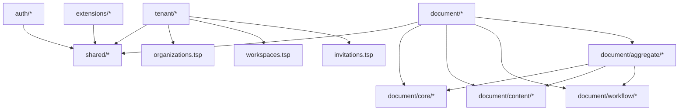

图表来源
- [docs-src/guides/architecture.md](file://docs-src/guides/architecture.md#L227-L233)
- [api/document/index.tsp](file://api/document/index.tsp#L1-L31)
- [api/document/aggregate/index.tsp](file://api/document/aggregate/index.tsp#L1-L33)
- [api/tenant/organizations.tsp](file://api/tenant/organizations.tsp#L1-L498)
- [api/tenant/workspaces.tsp](file://api/tenant/workspaces.tsp#L1-L649)

章节来源
- [docs-src/guides/architecture.md](file://docs-src/guides/architecture.md#L227-L233)
- [api/document/index.tsp](file://api/document/index.tsp#L1-L31)
- [api/tenant/organizations.tsp](file://api/tenant/organizations.tsp#L1-L498)

## 性能考虑
- 聚合查询：通过 include 参数按需加载，减少往返次数，提升前端渲染效率。
- 分页与限制：数据分页、评论/修订数量限制，降低大列表查询的负载。
- 批量更新：简化客户端提交结构，服务端根据 metadata 自动解析类型，减少重复传输与转换成本。
- 并发控制：版本号乐观锁，避免冲突导致的重试与回滚开销。

## 故障排查指南
- 统一错误码与响应结构：使用 shared 中的 ApiResponse 与 ErrorCode，便于定位问题类别（认证、文档、视图、数据、评论、审批、请求、用户、组织、工作区、邀请、加入申请等）。
- 路由与 Provider：确认 {doc-type} 是否存在对应 Provider，否则返回“未知文档类型”错误。
- 权限与作用域：组织级/工作区级文档需满足成员权限要求；审批流程需检查当前节点与权限。
- 并发冲突：更新失败时检查版本号是否过期，重新拉取最新数据后重试。

章节来源
- [api/shared/common.tsp](file://api/shared/common.tsp#L80-L151)
- [api/shared/common.tsp](file://api/shared/common.tsp#L153-L177)
- [api/document/tenant-document.tsp](file://api/document/tenant-document.tsp#L112-L191)
- [api/document/workflow/approvals.tsp](file://api/document/workflow/approvals.tsp#L1-L60)

## 结论
nexusbook-api 采用清晰的分层架构与严格的单向依赖原则，shared 基础层提供统一的类型与错误模型，auth 保障安全访问，document 业务层围绕文档抽象提供核心数据、协作与工作流能力，extensions 提供可扩展的集成能力。Provider 模式与聚合查询进一步提升了系统的可扩展性与易用性，符合高内聚、低耦合的设计目标。**本次更新引入的租户管理层（tenant）通过 Organization、Workspace 和 DataSourceReference 模型，实现了强大的多租户数据隔离与共享能力，并通过精细的基于角色的权限矩阵，确保了系统的安全性与灵活性。**

## 附录
- 设计原则：分层架构、单一职责、依赖管理、可扩展性、模块化。
- 模块职责概览：shared（基础设施）、auth（认证授权）、document/core（核心数据）、document/content（内容协作）、document/workflow（工作流）、document/aggregate（聚合查询）、extensions（扩展功能）、tenant（租户管理）。

章节来源
- [docs-src/guides/architecture.md](file://docs-src/guides/architecture.md#L234-L253)